# 第一章_1_《癌生物学》第一章（1）__孟德尔遗传定律和达尔文进化论【学习分享】

**“** 生物学各个分支学科的发现不断丰富着我们对于肿瘤发生的理解 ，孟德尔和达尔文两位先驱建立的概念影响着现代生物学思想的各个方面 。 本章中，我们首先回顾孟德尔遗传学体系和达尔文进化论，及基于此发现并建立的生物学大楼。 **”** ****

 图1-1：达尔文 与孟德尔

01 —

孟德尔遗传定律与基因型、表型

**“颗粒遗传学”** 是 孟德尔的一项主要见解，它指出：遗传物质是由独立的信息小体组成的，而每一个信息小体都对应于一可观测的性状。

这种信息小体在后来被称为基因， 可观测的性状 即表型 。 现在我们知道，基因是表型的决定性因素，多数可观测的表型都能追溯至多个基因的共同作用；而 控制不同表型的基因是相互独立、互不干扰的。

对于二倍体生物，一个基因含有两个等位基因（等位基因相同者称之为纯合子；反之为杂合子）。在决定表型上，其中一个等位基因通常起主导作用。故而，性状正常的杂合子个体可能携带有缺陷的等位基因。

 图1-2：颗粒遗传说 
 事实上，把等位基因划为显性或者隐形过度简化了生物学的现实， 某些基因的等位基因可以呈 共显性，也就是一个表达出的表型可以呈现为两个等位基因混合的形式。不完全外显也是一种常见的例子，在这种情况下，某一显性基因是存在的，但由于生物体基因组中其他基因的作用，它的表型并不能完全显示。因此，该等位基因的支配地位不仅是由这一基因自身决定表型的能力决定，而是由其与其他等位基因的相互作用决定的 。 
 

 02 — 
 孟德尔遗传定律与达尔文进化论 20世纪 二三十年代，人们开始意识到遗传物质是易变的。基因突变是改变基因信息内容的“肇事者”：基因突变把一种等位基因转变为另一种等位基因或从之前普遍存在的某一物种的等位基因创造出新的等位基因。为方便描述，把在某物种大多数个体中都存在的等位基因称为“野生型”，由突变产生的存在于少部分个体中的等位基因称为“突变型”。 然而，并非所有基因突变都会影响表型。现在知道，人类基因组中仅约3.5%的 DNA 携带重要的生物学序列并执行相应的生物学功能，绝大部分 DNA 并不携带重要的生物学序列。 突变发生于基因组中，它不加选择地改变有作用的基因和非编码DNA， 无功能DNA发生的突变并不影响表型，称为“中性突变”。

图1-3：突变与进化

中性突变对生命体的生存不会产生影响，故能够在基因库中存留，并在进化过程中累积，呈现“多态性”。相反，具有生物学功能的序列发生的突变常会导致其功能丧失，故自然选择使其在基因库中淘汰，这些序列仅仅缓慢变化，呈现“保守性”。（下图三个物种同源蛋白质的氨基酸序列显示保守型。）

图1-4：基因功能的高度保守性

03 —

基因和染色体运转

基因定位于特定染色体的特定位点（基因位点），染色体的长度与它所携带的基因数量成比例。人体中几乎所有细胞都拥有一套完整的染色体组，几乎所有细胞都直接遗传并继承了受精卵基因组的精确拷贝。这意味着，基因通过影响单个细胞的行为来产生整个生命体的表型。

孟德尔遗传定律的染色体和基因都成对出现，这一机制在肿瘤的发展中起重要作用，因为几乎所有防止细胞增殖失控的基因都以两个拷贝的形式存在，只有当两个拷贝全部失活时，才会使其失去生长抑制功能进和导致肿瘤细胞增殖。

性染色体违背了对称出现的原则：人类X染色体约携带900个基因，而Y染色体仅携带78个基因。很多对生命的发育和功能至关重要的基因都位于X染色体上，成对出现的X染色体能够保证生命体更加健壮。因此 ， 其结构上的不对称本应使雄性处于生物学上的不利地位。

图1-5：人类性染色体

然而， X 失活机制缓解了性别之间的差异：胚胎发生早期，雌性胚胎的每一个细胞中，两条 X 染色体中的一条随机失活，导致该染色体上几乎所有基因沉默，并使之收缩成称为“巴氏小体”的微粒。因此，雌性携带X染色体相关基因冗余拷贝的优势也只是相对的。

04 —

肿瘤与基因、染色体突变

正常情况下，每个细胞都存在着精密的修复系统，它们不断监控着细胞的基因组，一旦发现突变序列就用适当的野生型序列对其进行替换。然而，没有绝对可靠的损伤检测和修复系统，当 修复装置偶尔失察或灾难性损害超过修复能力，便有可能导致 基因组突变 积聚 。

生殖细胞和体细胞 累及 的突变 均可引发肿瘤，但遗传学后果不尽相同： 生殖细胞突变发生于生殖细胞基因组携带的基因中，由亲代个体传至子代个体，突变了的基因存在于子代体内性腺以外的所有细胞，并可传递给后代；体细胞基因突变 发生于亲代体细胞基因组携带的基因中 ， 突变了的基因 仅 影响亲代的一个体细胞基因组，仅传递给该亲代身体内突变细胞的直系后代，并不能传递给后代。

图1-6：生殖细胞突变与体细胞突变

此外，多数癌细胞的染色体也发生了改变，如：整条染色体丢失、额外染色体副本、一条染色体臂与另一条染色体臂融合等。特定基因、染色体的获得和缺失有益于特定类型肿瘤的增殖。

结构上看似正常的染色体可以产生额外的拷贝，所得到的拷贝首尾相连融合为一个同源染色区。染色体片段也可能被从染色体上切除，并且在核内扩增为很多拷贝，产生称为双微染色体的亚染色体片段。 有时，两种形式的扩增可共存于同一个细胞。 双微染色体和同源染色区都可引起所携带的基因扩增，进而促进癌细胞的生长。

参考书目：《The Biology of Cancer》（Second Edition）  R.A.Weinberg  著，詹启敏 等  译

# 第一章_2_《癌生物学》第一章（2）基因如何决定表型【学习分享】

“人们对基因如何决定表型的认识不是一蹴而就产生的。1944年， DNA 被证明是携带遗传信息的化学实体； 1953 年， DNA 双螺旋结构被阐明； 1964 年， DNA 碱基序列决定氨基酸序列，后者为蛋白质的构建提供信息的学说被确立；...... ”

1、DNA序列信息通过蛋白质决定表型

1.1 蛋白质结构的多样性

在最简单的转录过程中，一段基因能够转录产生同等长度的RNA分子， RNA 分子合成后，其中的碱基序列被核糖体翻译成氨基酸序列。翻译得到的大分子可能包含成百甚至上千个氨基酸，并卷曲成独特的三维结构，形成有功能的蛋白质。

在真核生物中，RNA合成是一个复杂的过程。在转录为 RNA 分子的最初阶段，其长度与亲本基因的长度大致相等。然而，在延伸过程中，内含子被切除，其两侧的外显子连接在一起，导致 转录后修饰的最终产物可能仅仅是hnRNA（最初合成的 RNA 分子及其在各个拼接阶段产生的衍生物共同构成 hnRNA）的一个小小的片段，某些成熟mRNA的长度甚至不及其pre-mRNA（pre-mRNA通常指细胞质 mRNA 的前体hnRNA）的1%。

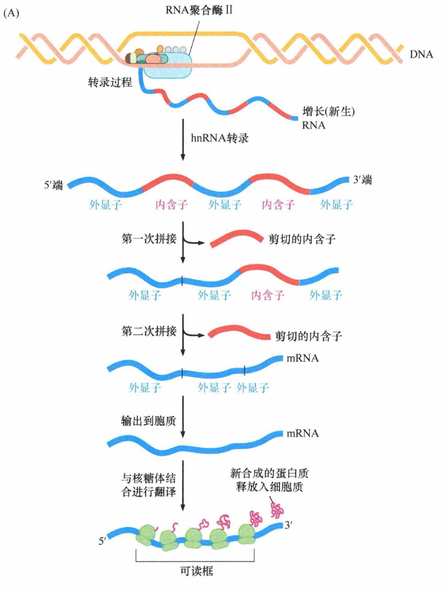

图2-1：前体mRNA的加工

****

值得重视的是，一条前体mRNA可能通过多种不同形式进行拼接，从而得到不同的成熟mRNA。 **这些选择性剪接** 形成的 mRNA分子结合不同的外显子，发挥不同的生物学效应。 实际上，人类基因组 95%以上的基因产生的前体mRNA受选择性剪接的支配 。有意思的是，可能存在一个特定的选择性剪接形式，当其产生的蛋白质在细胞中表达水平过高时，会使细胞由正常状态转换为癌细胞增殖状态。可以想象，某一调节剪接的蛋白质将介导细胞内许多甚至所有前体 mRNA 的剪接 ，而不是仅仅影响涉及特定细胞生物功能的基因子集。在细胞经历上皮 -间质转化（EMT）过程中，多达1000个前体mRNA经历了选择性剪接， 这些选择性剪接 mRNA 可能作为 EMT 的诊断标志物。

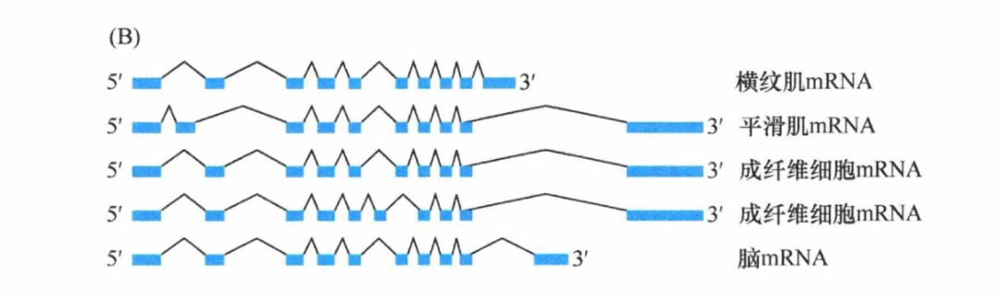

图2-2：一条前体mRNA经过选择性剪接形成不同的成熟mRNA

除了选择性剪接，翻译后修饰也是蛋白质多样性的重要原因。

蛋白质翻译后修饰的一种形式为某些化学基团与蛋白质链中特定的氨基酸残基共价结合，这些修饰分子主要包括磷酸基、糖基、甲基、乙酰基和脂基。如：大部分细胞表面蛋白的胞外区域和几乎所有的分泌蛋白都是糖基化的；又如：在肿瘤发展过程中发挥重要的作用的Ras家族蛋白定位于胞质，它包含可结合在羧基端的脂基。

另一种重要的翻译后修饰形式为蛋白酶对蛋白质的裂解作用，该酶具有在特定位点切断氨基酸链的能力，导致最终得到的成熟蛋白质比最初合成的短。很多蛋白质在合成后，被指派到胞内的特定位置，或被分泌至胞外，它们被分派的目的地由新合成的蛋白质的氨基酸序列决定。

综上，RNA转录后修饰和蛋白质翻译后修饰的复杂性，导致了细胞中蛋白质结构的多样性。

1.2 蛋白质功能的多样性

蛋白质合成后，可通过多种途径构建表型：

它们可在细胞内汇集，构成细胞骨架 ，产生细胞的形态并使其能够运动；

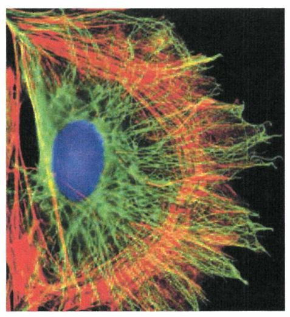

图2-3： 肌动蛋白（橘）与微管蛋白（绿）与细胞表面的突起有关

蛋白质是细胞外基质（ECM）的主要成分，后者能将细胞连接起来形成复杂的组织， ECM 的结构常被恶性肿瘤破坏从而使肿瘤细胞能够迁移到正常情况下无法到达的位置；

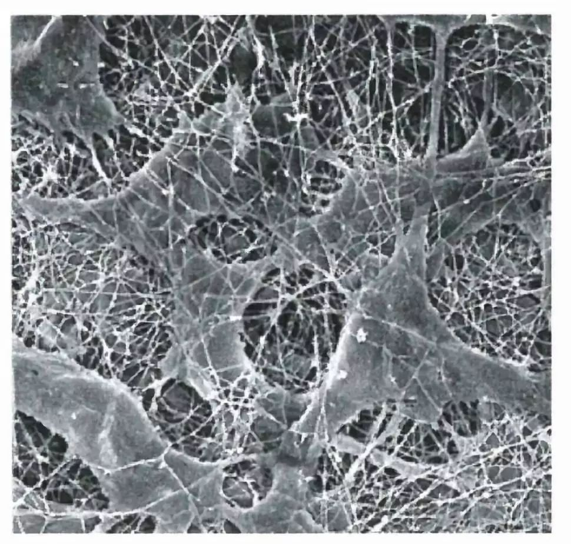

图2-4：蛋白质在胞外组装为细胞外基质（ECM）

蛋白质还能收缩并且产生肌收缩和细胞运动，在肿瘤发展中细胞的运动性能帮助肿瘤细胞散布广泛；

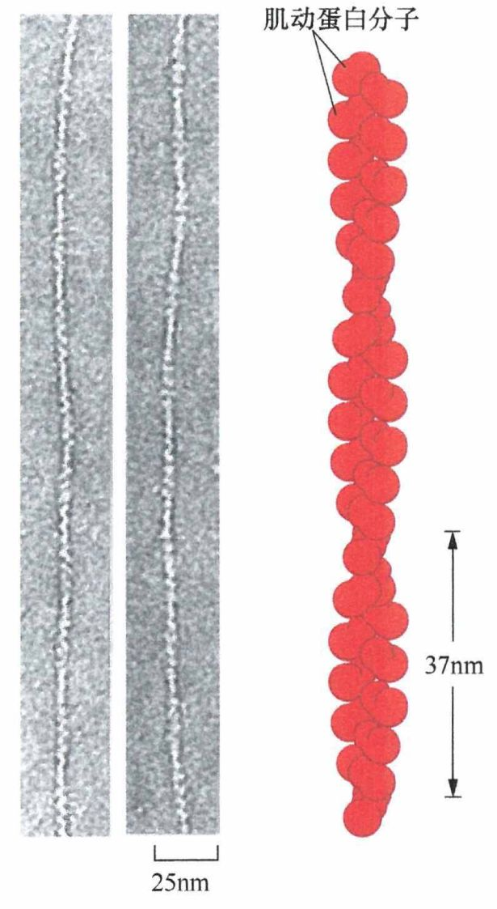

图2-5： 肌动蛋白构成细胞骨架并参与肌收缩

蛋白质的信号传递功能使复杂组织中各类的重要细胞保持适当的数量，这一点在肿瘤形成中极为重要，肿瘤细胞的异常生长大多由细胞内信号转导分子的异常引起；

很多蛋白质具有酶的功能，催化中间代谢过程中的数千个生化反应......

由此我们认识到，细胞和有机体的各方面表型可由蛋白质实现，蛋白质功能的多样性源于其结构的多样性。因此，用最简单的分子术语描述基因型与表型的关系即：表型由蛋白质实现，蛋白质的结构与功能由DNA碱基序列决定。（需注意：“表型由蛋白质决定”这一描述过于简单，它忽略了 RNA 分子的重要作用。具体内容待后续推送）

2、基因表达方式决定表型

动物体的所有细胞都是其受精卵的直系后代，这些细胞携带的基因组都是受精卵中基因组的精确拷贝，而动物体不同细胞的表型却具有极大的差异（如皮肤细胞与神经细胞）。经过长达 3个世纪的探索，发育生物学家们最终发现， 携带相同遗传模板的细胞获得不同表型的主要原因是：各类细胞对基因组的选择性表达。

随着早期胚胎中细胞不断地生长与分裂，位于胚胎中不同部位的细胞开始定型形成特定类型的组织而不是其他组织，这一过程称为分化。分化的细胞始终保持相同的基因组，但它们却聚集表现出不同的表型。

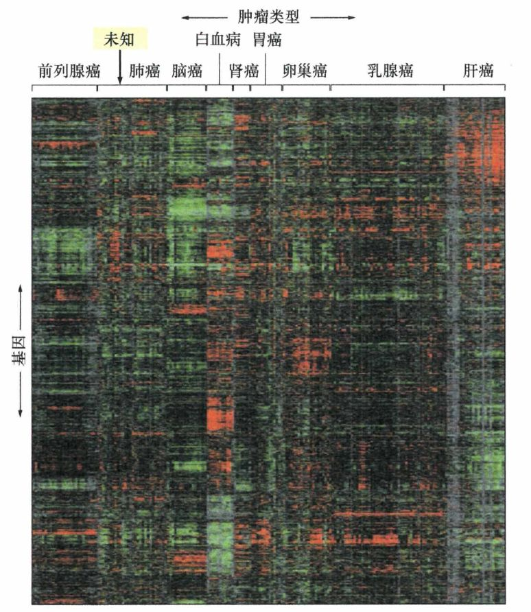

图2-6：基因表达微阵列的宏观分析：红色像素点表示某基因在某肿瘤中 高于平均水平表达 ；绿色反之。

分化现象的出现是由于一些基因在某些细胞中有表达而在另一些细胞中没有表达，通过在一些特定的细胞中表达，一组基因编码合成一组特定的蛋白质和 RNA分子，这些蛋白质与RNA最终协同创造出一种特定的细胞表型。 因此，机体中每种分化细胞的表型在根本上可以理解为在该细胞类型中表达的特定基因的集合。

哺乳动物细胞中的基因按功能可分为 管家基因和组织特异性基因。管家基因在机体所有细胞中共同表达，维持所有细胞的生存或所有细胞共同拥有的某种生物学功能；组织特异性基因仅在特异的细胞中表达，产生特异性的蛋白质，使细胞表现出特异性的分表型。在分化细胞中，绝大多数的表达基因都是管家基因，仅一小部分表达基因为组织特异性基因。例如： 细胞表达 3000-5000 个管家基因，却表达少于 1000个组织特异性基因。

有趣的是，在每种分化细胞中，基因组约 21000个基因中有相当一部分是未表达的， 这主要是 因为后者对于细胞的 共性 管家 或 特异分化目的并非必要的。

基因表达方式可以决定表型，那么基因表达受到哪些因素的调控呢？《癌生物学》学习分享下一期推送——基因表达的调控，我们不见不散！

# 第一章_3_《癌生物学》第一章（3）基因表达的调控【学习分享】

“我们已经知道，基因表达的方式可以决定表型。今天我们谈谈，基因表达受哪些因素的调控。”

转录因子调控基因表达

绝大多数基因的转录依赖于几种不同转录因子（TF）的共同作用，其中每一种TF都结合于基因启动子或周围的适当位点（即增强子），以协同作用激活基因表达。细胞中多种基因的协调表达通常称为基因表达程序，它依赖于多种 TF 在大量基因启动子上的共同作用。

细胞要表现出复杂的、组织特异性的表型需要一系列基因的协同表达和抑制另一些基因的表达。 TF结合于基因调控区的特异性DNA序列 ，决定该基因是否表达。一些 TF以分子水平尚不完全清楚的方式为RNA聚合酶 （在前体 mRNA情况下为RNA聚合酶 II ）提供了接近基因从而启动转录的机会，而另外一些 TF则可以阻止RNA聚合酶接近基因 ，以确保该基因的转录被抑制。

图3-1：TF调控基因表达

转录因子的功能非常强大，单一类型的转录因子就可能同时影响一大类下游应答基因的表达。一种转录因子引发细胞或器官多种改变的能力通常称为多效性。在肿瘤细胞中，一个功能失调的多效性转录因子可以同时协调一大类应答基因的表达，使其共同作用以产生癌细胞的表型。

组蛋白修饰调控基因表达

染色质的核心是由 DNA绑定到核小体上组成的 ，核小体由 DNA与小球状蛋 白共同形成，呈现链珠状。核小体是八聚体，由两个拷贝组成，每个拷贝由 4种不同的组蛋白 （ H2A 、 H2B 、 H3和H4 ）组成。

图3-2：染色质结构的组成

核小体的球状核心是染色质的基本支架，有两种修饰方式。

首先，一些标准的组蛋白，如组蛋白 H2A和H3, 在少数核小体中可被变体形式 （如组蛋白 H2AZ、H3.3 ）替换。在整个染色质中，分散着许多这样的变体组蛋白，但它们对于染色质结构和转录调节的准确作用尚不清楚。

再者， 4种标准组蛋 白的转录后修饰影响染色体结构和转录。这些修饰并不直接改变核小体的球状核心，而是影响核心组蛋白的氨基端尾，后者由球状核心向外延伸并接受多种共价修饰。最突出的是甲基化、乙酰化、磷酸化和泛素化。

图3-3：蛋白质氨基酸尾的翻译后修饰

例如，一种组蛋白磷酸化与发生于有丝分裂的染色质凝聚、基因表达的普遍停止有关；在细胞周期的其他阶段，核心组蛋白的乙酰化通常与基因活跃表达有关，而甲基化通常与基因表达抑制相关。需要注意的是，组蛋白的甲基化与基因抑制和表达均相关，结果效应取决于受甲基化影响的赖氨酸残基的位置。

染色质蛋白负责调控 TF及RNA聚合酶与DNA的相互作用， 越来越多的证据显示，各种各样的组蛋白修饰对允许或阻止染色体 DNA特定区域 上 RNA聚合酶 的转录功能十分重要，因而在调控基因表达方面具有重要作用。

图3-4：利用抗体免疫沉淀特定类型的修饰组蛋白，随后对该沉淀物进行DNA测序，由此绘制多种组蛋白修饰的位点，发现组蛋白H3赖氨酸4残基三甲基化（H3K4me3，绿色）的核小体位于基因的转录起始位点(TSS)。表明：包含H3K4me2的核小体与TSS相关，而那些包含H3K36me3的核小体与活跃转录基因相关。

DNA的共价修饰调控基因表达

DNA甲基转移酶使甲基基团直接结合于DNA双螺旋中CpG二核苷酸 的胞嘧啶碱基。被甲基化的 CpG二核苷酸通常定位在启动子附近 ，这种甲基化一般引起附近基因的抑制。

甲基化 CpG岛本身并不直接阻断转录 ，而是影响染色质蛋白的结构，这些蛋白质的主要作用是包装染色体 DNA并将其呈现给RNA聚合酶以便转录。尤其是甲基化CpG结合蛋白 特异地与甲基化二核苷酸结合，并影响附近染色质的结构。此外，特定组蛋白的修饰能够从相反的方向影响 DNA甲基化的状态。

DNA复制后 甲基化的维持由 DNA甲基转移酶识别新近复制DNA的半甲基化片段，对与DNA链中已经甲基化的CpG互补的未甲基化片段的CpG二核苷酸进行甲基化 完成。

图3-5：DNA复制后甲基化的维持

非传统RNA分子调控基因表达

20世纪90年代 ，科学家揭示了一种新的 RNA分子 类型：微小 RNA（miRNA）。 它们含 21-25个核苷酸 ，通常产生于更大的核 RNA前体切割产物。 它们控制胞质内特定 mRNA的水平 ，或这些 mRNA翻译的效率 ，或同时对二者进行调控。一种 miRNA可以调节许多不同 种类 mRNA的表达 ，使之对多种细胞过程表现出多效性。

一个初级 miRNA转录物加工后在细胞质内形成miRNA ，后者是核蛋白复合体 RISC （ RNA 诱导沉默复合体 ）的组成部分。这些复合体与一系列 mRNA靶点相关 ，这些靶点通常位于非翻译区，其序列的一部分或者全部与 RISC 复合体中的 miRNA互补。这种互补能够使mRNA翻译抑制或者mRNA降解，或者两种作用同时发生。

图3-6：miRNA的产生与基因调控作用

发现 miRNA的10年后 ，另一种不寻常的 RNA出现在人们的视野： 人类基因组中 4%-9%的DNA转录成200个核苷酸以上长度的RNA分子，却没有发现这些RNA有明确的蛋 白质编码序列及功能。这些长链非编码 RNA（lncRNA ）存在于细胞核与细胞质中，并以我们尚不了解的方式调节基因表达。

一部分已被阐明的 lncRNA在功能上协助蛋 白质发挥作用 —— 蛋白质调节转录， lncRNA 通常作为支架支撑特定染色体修饰蛋白。 lncRNA在 肿瘤发展中的作用研究才刚刚开始，例如， lncRNA HOTAIR 的上调表达与人类乳腺癌和结肠癌转移行为 相关。越来越多的观点认为数千种不同的 lncRNA是细胞调节机制的重要分 子成员。

miRNA和lncRNA的行为使我们进一步窥见哺乳动物细胞内基因表达 、调控的复杂性。某一基因的转录被允许后，会有数种干预机制调控其最终产物 —— 蛋白质的积累以执行该基因的实际功能。这些机制反反映在不同水平： 1、 前体 mRNA的转录后加工 ：选择性剪接模式； 2、mRNA产物的稳定性或降解 ； 3、mRNA翻译调节 ； 4、 翻译后修饰：改变蛋白质产物的稳定性或使其降解。

# 第二章_1_《癌生物学》第二章（1）肿瘤的起源【学习分享】

“正常细胞严格按照设计好的程序去参与构建不同的组织，从而使机体生存下来。而肿瘤细胞却展现出一种截然不同、 目标更加集中的任务，它们好像只考虑一件事情：尽可能地自我繁殖。”本章节，我们将初步探讨癌症的本质，帮助我们从本质上去揭示复杂的肿瘤领域。

***01***
 
**肿瘤的起源**
 
19 世纪中晚期的发现使我们了解到一个受精卵是如何发育成为组织和复杂器官的。这其中最重要的发现莫过于：受精卵能够通过不断地生长与分裂来产生机体中的所有细胞。
 
这些认识对肿瘤起源的研究产生了深远的影响。之前，许多人认为肿瘤是一种通过某种方式植入患者体内的异物。如今， 大量事实表明，各种不同类型的肿瘤常常都是源于它们各自起源的自身正常组织，而不是外界的入侵体。
  
图1：低倍镜下的小肠回肠段上皮组织切片
 
事实上，肿瘤确实有在体内迁徙的能力：在许多患者体内，多种肿瘤都能在距其原发组织很远的地方检测到转移灶，因为癌细胞能在体内扩散并且形成新的癌细胞克隆。这些新克隆，即转移灶，都可被溯源到肿瘤发生的最初部位，即原发肿瘤。
  
图2：晚期结肠癌患者常常发生肝转移（白色部分）

相对于周围正常组织，肿瘤组织结构的排列要混乱无序得多。肿瘤是由一群失去了组成正常组织能力的细胞构成的。微观结构上，肿瘤组织与正常组织差异巨大，但它们在组织学上仍然存在某些相似之处。因此，理论上讲所有肿瘤都应该能追溯到其发源的特定组织或器官，我们可以通过对肿瘤切片进行组织病理学分析来为此提供关键线索。这个简单的想法为肿瘤的分类提供了新方法，即根据可能的源发组织进行分类。

***02***
 
**肿瘤的分类**
 
根据肿瘤组织来源（上皮、间叶、造血和神经外胚层），可以将肿瘤分为四类。 

**上皮组织来源的肿瘤** 

人类大多数肿瘤来源于上皮组织。上皮细胞是构成体腔、管道和表皮的规则排列的层状细胞，如皮肤是作为机体的外覆层。在上皮细胞之下是基底膜（有时也称基底层），基底膜则把上皮细胞 与下面起支持连接作用的间质层细胞分隔开。基底膜是细胞外基质 （ECM) 的一种特殊形式，主要由上皮细胞分泌的蛋白质构成。
  
图3：鸡角膜上皮电镜扫描图
 
为什么我们对上皮细胞如此感兴趣呢，因为它产生了人类最常见的恶性肿瘤，称为癌。
 
一些上皮细胞层的主要作用是封闭腔穴或管道的表面并且保护其下层细胞。这种上皮细胞发展而来的癌称为鳞状细胞癌。例如，覆盖皮肤和大部分口腔的上皮细胞会发生这类肿瘤。
  
图4：食管癌

还有许多上皮组织中存在特殊的具有分泌能力的细胞，它们可以释放分泌物到自身形成的导管或腔穴中。通常这些分泌物的作用是保护上皮细胞层不受腔穴内物质的作用。这种细胞来源的肿瘤称为腺癌。
  
图5：胃腺癌

在某些器官，如肺、子宫、子宫颈中，上皮细胞层能够发展为单纯的腺癌或鳞状细胞癌；而在更多的情况下，这些器官来源的肿瘤会包含这两种类型的癌细胞。

**肉瘤** 

肉瘤来源于多种间质细胞，包括：分泌胶原的成纤维细胞及其相关结缔组织细胞，它们是肌腱和皮肤的细胞外基质的主要组分；脂肪细胞，它们在胞质中储藏脂肪；成骨细胞，在胶原基质中聚集磷酸钙结品以形成骨骼；还有组成肌肉的肌细胞。相对多见于儿童的血管肉瘤是由血管内皮细胞的前体细胞产生的。
  
图6：横纹肌肉瘤

**造血系统恶性肿瘤** 

造血系统恶性肿瘤由各种组成造血系统的细胞转化而来，包括免疫系统的细胞，如：红细胞、 能分泌抗体的浆细胞、T淋巴细胞（简称T细胞）和B淋巴细胞（简称 B 细胞）。白血病泛指造血细胞谱系的恶性衍生物，它们不同于红细胞 ，胞内没有细胞色素，而且 能够自由地穿行于循环系统中。白血病的肿瘤细胞是散布在循环系统中的单细胞群，而淋巴系（T淋巴细胞和B淋巴细胞）肿瘤则能够聚集在淋巴结形成实体瘤。
  
图7：多发性骨髓瘤

**神经外胚层瘤**
 
最后一大类肿瘤，是由构成中枢和外周神经系统的各种细胞恶性转化而致。这类肿瘤通常被称为神经外胚层瘤 ，反映其是从早期胚胎的外胚层发育而来，包括胶质瘤、胶质母细胞瘤、神经母细胞瘤、神经鞘瘤和髓母细胞瘤。
  
图8：少突胶质细胞瘤

**不适于上述分类的肿瘤** 

黑色素瘤来源于皮肤和视网膜中内含色素的黑色素细胞，而黑色素细胞则是由胚胎中的神经脊发育而来。尽管与神经外胚层细胞的发源地如此接近，但随着发育过程，它却最终落脚在了皮肤和眼睛的组织中，为其提供色素，而与神经系统没有任何直接联系。
  
图9：黑色素瘤

小细胞肺癌（SCLC) 中有许多具有类似于神经分泌细胞特征的细胞 ，就像肾上腺中的某些神经脊来源的细胞一样，具有分泌功能。迄今为止还未确定小细胞肺癌是否起源于神经外胚层细胞。而另一种看法认为， 这些源于肺部内胚层细胞克隆的肿瘤 ，失去了一些自身上皮细胞的特征，同时又呈现出了一些神经外胚层细胞谱系的特征。这种细胞谱系的转换和随之而获得的一套全新的已分化成熟的特性，通常被称为转分化作用。
 
畸胎瘤是由于生殖细胞（卵细胞和精子）前体在发育早期未能迁移到正确的位置，并在发育过程中一直处于异位所致。它们保留了早期胚胎细胞的多能性。 同一个畸胎瘤中能看到组成胚胎的 3 个胚层——内胚层、中胚层、外胚层。 

  
图10：畸胎瘤
 
在少数情况下 (2%~4%), 某些肿瘤已经完全丧失了其发源组织的特异性和分化特征，发生了去分化作用。发生去分化的这类肿瘤通常被归入 “未知原发灶癌 " (CUP), 很难从患者身上找到相应的原发肿瘤的部位。
  
图11：起源不明的间变肿瘤
 
本节主要介绍了肿瘤的起源，下一小节我们将进一步介绍肿瘤的发展和能量代谢特征，下期再见！
# 第二章_2_《癌生物学》第二章（2）癌症的发展及其能量代谢【学习分享】
 
**接下来开始本节的学习啦~**

“肿瘤以一种独特又令人恐惧的方式摧毁一个人，像人机体自身一样但变得高度增殖，疯狂蔓延，掠夺营养，并且不受控制。”肿瘤虽然增殖迅速，但其发展历程也是有迹可循的，本节将主要介绍肿瘤的发展和能量代谢特征。 

***01***
 
**肿瘤是多阶段多步骤发展形成的**
 
在正常组织和高度恶化的肿瘤组织两个极端之间，机体组织形态还存在着丰富的中间过渡状态。这些处于不同异常阶段的细胞，反映了细胞逐步从正常组织过渡到越来越具有侵袭和转移能力的恶化状态的过程。
 
增生 

有一些特殊的细胞肿块，它们与正常组织之间只有微小的差别，但是在细胞数量上异常增多，这种肿块称为增生。虽然形成增生组织的细胞的增殖明显不受控制，但其发育成为组织的能力与正常细胞别无二致。
 

 
图1：增生的乳腺导管

化生
 
化生是指一种已分化组织转变为另一种分化组织的过程。该过程并非由已分化的细胞直接转变为另一种细胞，而是由具有分裂能力的未分化细胞向另一方向分化而成。这些细胞虽然生长在了错误的位置，但在镜检下往往表现得与正常细胞无异。化生常常发生在上皮组织的过渡带中，多见于子宫与子宫颈及食管与胃的连接处。在上述两个连接处，扁平上皮细胞往往会急剧地转变成分泌黏液型上皮细胞。
 
食管癌变前的一个早期指征就是出现一种巴氏食管 (Barrett's esophagus) 化生情况，食管中的扁平上皮细胞会被一种常见于胃部的分泌型上皮细胞取代。尽管这些细胞具有非常正常的外观 ，但这种化生通常被认为是食管癌的早期病变步骤。
  
图2：上皮细胞的化生

不典型增生
 
比化生更为异常的组织称为不典型增生。这类组织的改变包括细胞核大小和形状改变，细胞核染色加深，核质比例增大，核分裂能力增强，以及与组织中正常分化相关的胞质特征丢失。在不典型增生组织中， 原见于正常组织的不同类型细胞的数量比例都发生了改变。不典型增生是完全良性肿瘤至恶性癌变之间的过渡状态。
 
腺瘤（腺瘤、息肉、乳头状瘤和疣）是不典型增生的上皮瘤。在显微镜下观察 ，腺瘤中的组织是不典型增生的，它们通常长到一定大小便停止生长，并且绝不穿过基底膜，所以与基底膜下方的上皮组织仍然是隔开的。正是由于这一点，一般认为它们是良性的。
  
图3：息肉显微切片照
 
恶性肿瘤
 
突破基底膜并且侵及下层组织的肿瘤属于恶性肿瘤。更进一步的异常是肿瘤扩散至体内其他部位，即形成了转移瘤。转移不仅有侵袭突破基底膜的能力，而且获得了运动和适应周围新环境的特性。
 
原发灶肿瘤细胞能通过循环系统转移到机体远处而形成新的癌细胞克隆。癌细胞侵袭到邻近的组织中，进入血管和淋巴管，通过这些管道迁徙到身体远端，并再次突破血管或淋巴管，侵入下层组织，在此处形成新的癌细胞克隆。
  
图4：侵袭性乳腺小叶癌

以上列出的各种异常生长形式代表了不断恶化的组织异常程度，它们似乎是恶性肿瘤进展过程中的停顿点，在该过程中正常组织逐渐发展为高度恶化的癌组织。

***02***
 
**肿瘤由单克隆发育而来**
 
我们已经知道肿瘤是从正常细胞逐步转化而来的，接下来需要思考的是：肿瘤是由单个的细胞跨越了从正常到异常的界限发育而来的呢，还是有一大群细胞历经这种改变，然后每一个都发展成了肿瘤中的单个细胞亚群呢？
 
理论上，肿瘤可以起源于单克隆，或者多克隆。随机出现的体细胞突变可以视为细胞的独特标记，如果这种标记出现在肿瘤块中所有的细胞里，就可以说此肿瘤块中所有细胞都起源于同一个突变的细胞。这种起源于单个祖先的细胞克隆，称为是单克隆性的。同样地，如果肿块是由一系列具有不同遗传学特征的细胞亚群构成的，而这些细胞之间并不存在共同的祖先，那么该肿块就被称为是多克隆性的。
  
图5：肿瘤的单克隆性和多克隆性

确定肿瘤细胞群体克隆性的第一个实验，依赖于胞内天然存在的、表观遗传学的标记物。如第1章所述，在雌性哺乳动物早期胚胎的体细胞中，每个细胞内的两条X染色体会随机地发生失活现象，只保留其中一条。该失活染色体 上几乎全部基因的转录都被抑制。一旦胚胎细胞中发生了某条X染色体（来自于母方或者父方）失活，由此胚胎细胞发育而来的全部成熟组织细胞就都将与其祖先保持一致，细胞中相同的X染色体均失活。
 
葡萄糖-6-磷酸脱氢酶 (G6PD) 的基因就在X染色体上。由于 X 染色体失活，杂合体女性的每一个细胞都只表达两个G6PD等位基因的其中一条，从而在胞内合成不同的G6PD蛋白。在杂合个体的大多数组织里，约有半数的细胞合成其中一种形式的G6PD, 另外半数细胞合成另一种形式的酶。1965 年曾经报道了对非裔美国人杂合体中发生的平滑肌瘤（位于子宫壁的良性肿瘤）的观测结果，每一个平滑肌瘤总是只表达G6PD两种可变形式中的其中一种。这说明很有可能此肿瘤所有细胞都来源于一个共同的祖细胞。
  
图6：用淀粉凝胶电泳对两种类型的 G6PD 进行分析，结果显示 G6PD 杂合体肿瘤患者的所有肿瘤细胞都表达该酶两种形式中的一种。

另外一个证据来自于对骨髓瘤的研究，骨髓瘤主要是源自能分泌抗体的浆细胞的母细胞 B 淋巴细胞。通常情况下，B 淋巴细胞库是由数量极多的、区别明显的亚群构成，经过免疫球蛋白（抗体）基因的重排作用，每一个亚群细胞都分泌一种特异性的抗体。与之相比，骨髓瘤患者的浆细胞产生相同的抗体，提示它们是从之前的复杂异质群体细胞中的某一单个细胞发育而来的，具有共同的祖细胞。
  
图7：多发性骨髓瘤中的单一类型抗体

关于肿瘤单克隆性质的最有力证据来自于对癌细胞染色体的观察。在有丝分裂中期染色体凝集的时候，显微镜下可见肿瘤细胞染色体有一系列异常畸变。通常由一个小概率的遗传学事件所引发的特异的染色体异常，在同一瘤体中所有细胞中都能看到。这表明，同一瘤体中所有恶性细胞都来源于同一个祖细胞，当此祖细胞染色体发生重组后，这种变化也都遗传到其所有子代细胞。
  
图8：肿瘤组织中的染色体易位

每一个祖细胞都能发育成一个单克隆群 体。 可以设想，在一种组织中 10 个正常细胞同时从正常状态向恶性状态（或至少前恶性状态）转化， 10 个祖细胞连同它们的子细胞都不受控制地异常增殖 ， 每一个祖细胞都能发育成一个单克隆群体， 总 体来看，由这10种细胞群体构成的肿瘤就是多克隆性的了。如果一个克隆具有比别的克隆稍微短一点的倍增时间，那么迟早它会长得大于其他所有克隆，这一克隆也会不断地扩增以致在整个肿瘤块中占据主导地位，使这个肿瘤看起来像一个单克隆群体。实际上，许多肿瘤的发生发展都需要很漫长的过程，这就为肿瘤块中某一单克隆群体发展成为优势群体提供了充裕的时间。因此，一个大瘤体表现出的单克隆性质，并不能严谨地证明肿瘤在最初发展时期也是单克隆性的。
 
以上这些容易发生误判的事实使我们对肿瘤的单克隆起源的判断变得更加复杂和困难。但一个已经广泛被认可的事实是，大多数人类肿瘤都是单克隆群体，即从单个的祖细胞开始逐步走向恶性转化。这些祖细胞通常被称为起源细胞。

***03***
 
**肿瘤细胞的能量代谢特征**
 
大多数肿瘤细胞的能量代谢与正常细胞相比呈现出巨大的差异性。1924年 Otto Warburg 首先报道了这一现象。正常细胞在胞质中有氧条件下能通过有氧氧化途径将葡萄糖分解成丙酮酸，随后丙酮酸被输送到线粒体，进一步分解为二氧化碳，此即三羧酸循环。在厌氧或者缺氧条件下，正常细胞的三羧酸循环被限制，丙酮酸只能被还原为乳酸，分泌到胞外。Warburg 发现许多类型的肿瘤细胞即使暴露在有充足氧气的环境中，它们的葡萄糖利用途径也还是最终产生乳酸。
  
图9：正常细胞的能量代谢

肿瘤细胞的有氧糖酵解，又称为 Warburg 效应，其每分解一个葡萄糖分子只能得到两个 ATP 分子，在能量学上显得很不经济。因为在三羧酸循环中有氧分子参与的情况下，一个葡萄糖分子能提供 36 个 ATP 分子。由于肿瘤细胞使用的是一种很不经济的糖代谢方式，因此它们需要大量的葡萄糖进入胞内进行分解。它们表达葡萄糖转运蛋白，如 GLUTl 等，以便能跨膜转运大量葡萄糖。放射生物学家利用这种特性，在循环系统中注入有同素标记的 18-氟-2-脱氧-2-氟-D-葡萄糖 [2-deoxy-2-(18F)fluoro-D-glucose, FOG] 后 ，能观察到其在肿瘤细胞中快速聚集。
  
图10：肿瘤细胞的能量代谢

有关有氧糖酵解的一个解释是肿瘤块内部的肿瘤细胞通常都呈现缺氧的状态。这种缺氧状态导致细胞不能进行充分的有氧氧化进而提供充足的 ATP。而 Warburg 效应使肿瘤细胞很好地适应了这种缺氧环境，但这依然不能解释为什么在提供充足氧气的条件下，肿瘤细胞依然不加以利用 以合成更多的 ATP。
 
关于有氧糖酵解另一个合理的解释是，除了产生 ATP, 糖酵解还有第二个作用：糖酵解途径的中间产物可以作为很多涉及细胞生长，如核酸和脂类的合成，的分子的前体。肿瘤细胞通过糖酵解途径的负反馈机制，阻断糖酵解途径的最后一步，使细胞内积累了大量早期中间代谢物。这些中间产物能参与许多重要的生化合成反应。较肿瘤细胞而言，正常细胞没有那么强的增殖活性，也不需要大规模的生化合成反应，葡萄糖主要用来产生 ATP 以维持其正常代谢。
 
那么肿瘤细胞是如何精确调控，使其绕过线粒体糖代谢过程的呢？丙酮酸激酶 (PK) 催化糖酵解的最后一 步将磷酸烯醇丙酮酸 (PEP) 催化为丙酮酸。丙酮酸激酶的 M1 亚型在大多数成体组织中特异表达，而 M2 亚型则在早期胚胎细胞、快速生长的正常细胞和肿瘤细胞中表达。PK 的 M1 亚型调控丙酮酸由细胞质运送到线粒体，而在肿瘤细胞内表达的 M2 亚型则调控丙酮酸在细胞质内分解为乳酸。与 M1亚型相比，M2 亚型催化酶的催化效率非常低，这就导致了糖酵解中间产物大量聚集，并参与到其他生化合成通路中。另外，肿瘤细胞中三羧酸循环的相对失活并非由线粒体的缺陷所致：它们在肿瘤细胞中正常存在，而且完全有能力接收丙酮酸并使其进入三羧酸循环。
 
肿瘤细胞的生长依赖于 PK 的 M2 亚型的存在，同时也依赖于较高水平表达的葡萄糖转运蛋白 GLUT1 和乳酸脱氢酶 A (LOH-A), 后者将丙酮酸分解为乳酸，再分泌出胞外。以上三者中任意一个受到抑制，肿瘤的生长速度就会减慢。

# 第二章_3_《癌生物学》第二章（3）癌症的诱因【学习分享】

表1 癌症发生和死亡率的地域差异
 

在 100 多种人类癌症中，有很大一部分是由随机的、不可避免的事件所引起的，因而在不同人群中有相似的发病率。除了某些特殊癌症发病率相对稳定以外，某些因素在特定的人群能显著地提高肿瘤的发病率。这两大重要因素就是遗传因素和环境因素。本节内容主要探讨环境因素对肿瘤的诱发作用。

***01***
 
物理因素
 
从16世纪中期开始，波希米亚的St. Joachimsthal (今天的Jachymov, 捷克共和国），大量开采银矿。在19世纪的前50年，肺癌这种在当时几乎很少听说的疾病在矿工中的发病率很高。这提示着，职业暴露与特定类型的癌症具有相关性。
 
到20世纪前10年，人们已经发现了越来越多的致癌物质。那时刚刚发明了X射线管，操作这些仪器的物理学家患肿瘤的概率较高，而且肿瘤通常发生于被照射的位置。这些研究结果终于在很多年后解释了为什么St. Joachimsthal的矿工很容易患肺癌：从矿井中开采出来的矿石具有很强的放射性，这就大大提高了矿工的肺癌发病率。
 
***02***
 
化学因素 

 
在现代流行病学建立的一个世纪前，人们就发现某些肿瘤的发生与生活方式及职业因素有关。第一个报道来自英国医生 John Hill, 他于 1761 年注意到了鼻癌的发生与长期过度吸烟有关。14 年后，伦敦的一名外科医生 Percivall Pott 报道了他所遇到的相当数量的青少年阴囊癌患者，他们小时候都有当烟囱清洁工的经历。之后不到 3 年，丹麦清扫者工会就要求其成员每天洗澡以去除皮肤上可能的致癌物。这项措施可能是欧洲大陆阴囊癌的发病率在一个世纪之后还远低于英国的原因。
 
煤焦油冷凝物与 Percivall Pott 研究中的致癌物相似，在20世纪初被用于诱导家兔产生皮肤癌。在家兔耳部皮肤的同一处反复涂抹这种物质，几个月后便会诱发恶性肿瘤。 

 
直到1940年，英国化学家才从煤焦油中提炼出几种能显著致癌的组分，它们都能够在小鼠的皮肤上致癌。组分中的 3- 甲基胆蒽、苯并芘、1,2,4,5-二苯并[a,h] 蒽都是普通的燃烧产物，随后在烟叶燃烧后气体的浓缩物中同样发现了其中一些碳氢化合物，特别是苯并芘。
 
1949年和1950年两组流行病学家的研究发现可能是环境暴露和肿瘤发生之间最确凿的关联性证据。据他们报道：重度吸烟者一生中患肺癌的风险比不吸烟者高 20 倍。
 
表2 每日吸烟者患肺癌的相对风险
 

 
在1949~1950年的报道后半个世纪内，流行病学家又发现了一系列与某些癌症强烈相关的环境和生活方式因素。
 
表3 人类肿瘤的已知或可疑因素
 

***03***
 
生物因素 

在20 世纪前10年，研究者发现病毒能感染小鸡并导致白血病和鸡肉瘤。到了20世纪中期，又发现了一系列能在家兔、鸡、小鼠和大鼠中诱导产生肿瘤的病毒。这一因素会在第3章中进行更为详细的叙述。
  
图1：Rous 在鸡中诱导肉瘤发生的流程

***04***
 
物理或化学致癌因素可诱导突变
 
3 种致癌因素的致癌机制是如此复杂以至于让人们困惑不清，直到人们对果蝇的遗传学研究取得了一些成果时，针对此机制的研究才取得了巨大的进展。1927 年，Hermann Muller 发现X射线照射可以诱导黑腹果蝇基因组发生变异。这说明动物经过特殊的处理方法，尤其是辐射作用，其基因组是可以发生改变的。这也提示 X 射线诱发肿瘤的一种机制：辐射作用可能使正常细胞的基因发生突变，而这种突变就很可能导致细胞向恶性状态转化 。
 
到 19 世纪 40 年代末，第一次世界大战芥子气战时使用的许多烷化剂也被证明是对果蝇基因具有致突变作用的。根据这些发现，许多遗传学家推测肿瘤是一种基因突变的疾病，而那些如X线或某些只有致癌作用的化学试剂，就是通过使机体发生基因突变而致癌的。
 
1960年，在许多慢性髓细胞白血病 (CML) 患者体内发现大量具有异常结构染色体的细胞。这种被命名为费城染色体的染色体是这种肿瘤的一个显著特征。
  
图2：费城染色体的结构

1975 年，加利福尼亚大学伯克利分校的细菌遗传学家 Bruce Ames 的研究结果进一步证明了致癌剂能导致基因突变。经过数十年在小鼠和大鼠体内的实验证明，不同化学致癌剂的致癌能力差别很大。
 
有没有一个有效的方法来衡量各种化学试剂诱发突变的能力呢？Ames 采用了一种突变沙门氏菌菌株，此菌株在不含组氨酸的培养基中不能生长。此突变位点被认为具有回复突变的能力。当暴露于诱变剂之下的细菌在此位点发生了回复突变后，具有此野生型基因的细菌就能在 Ames 设计的选择培养基中生长，直至形成肉眼可见的克隆。Ames 只需将待测试的化合物加入有这种突变沙门氏菌菌株的培养基中，通过对形成的菌落进行计数，就能衡量此化合物的致突变能力。
 
通过这项实验，Ames证明许多已知的致癌物同时也是具有致突变潜力的。更重要的是，他发现了这两种能力之间的关系。强致癌化合物同时也是很强的致突变剂。那些不是很强的致癌剂诱导突变的能力也较弱。
  
图3：致癌能力和致突变能力

随着对肿瘤病因研究的进展发现那些能导致人类细胞发生突变的化合物看起来的确都能致癌。但反过来却不尽然：并不是所有的致癌化合物都能诱导发生突变。20世纪90年代，大量Ames试验表明，在小鼠体内具有致癌性的化合物中，多达40%的化合物在沙门氏菌内不具有明显的致突变能力。因此，关于Ames试验结论的最新说法是：一些致癌物通过其致DNA突变能力诱发肿瘤，而其他一些则通过非遗传机制促进肿瘤发生。我们在第11章将会详述这些非致突变的致癌物，通常也称为促癌剂。

# 第三章_1_《癌生物学》第三章（1）病毒可以引发肿瘤【学习分享】

“ 病毒可以在被其感染的宿主细胞内增殖、杀死宿主细胞、释放能够感染附近其他宿主细胞的子代病毒颗粒，且在组织中快速传播，故在所到之处造成广泛的破坏。然而，有些病毒并不杀死被感染的细胞，而是促使其宿主细胞不受限制地增殖，这类病毒被称为肿瘤病毒。肿瘤病毒通常含有相对简单的基因组，但它们却能控制被其感染的细胞及其复杂的基因组，表明它们具有非常高效的基因来干扰被感染宿主细胞本身复杂的调控网络。 ”

图 3-1-1 ：双链 DNA （ dsDNA ）基因组病毒的生命周期

Peyton Rous发现鸡肉瘤病毒

1908年，两位哥本哈根的研究者从鸡白血病细胞中提取得到一种病毒，将其注入其他鸟的体内后，这些鸟随后也感染了该疾病。遗憾的是，他们并没有将最初的发现研究到底 。

1909年，Peyton Rous开始对雌鸡胸肌中出现的肉瘤进行研究。起初，Rous将这种肉瘤的碎块植入同一品种的其他鸡体内,成功地接种肿瘤。随后，他将一块肉瘤研磨得到的匀浆液进行过滤，把滤过液注入幼鸡体内后，它们也都产生了肿瘤。接着，他发现这些诱导产生的肿瘤经过匀浆后，也能够感染其他鸡并在注射部位产生肉瘤。

图 3-1-2 ： Rous 在鸡中诱导肉瘤。这个循环能无限次地重复，且子代病毒诱发肉瘤的速度较原代病毒更加迅速

从鸡肉瘤中分离得到的病毒被称为 Rous 肉瘤病毒（RSV），它们能够在鸡的组织内进行增殖，且在被感染而产生的肿瘤组织中被发现比最初注射的量多得多。Rous肉瘤病毒的研究结果使某些人确信：几乎所有人类疾病都由传染性病原体引发，肿瘤如同霍乱、结核、狂犬病和败血症一样，其病因与某种特定微生物病原体相关联。此后不久，1913 年Dane Johanne Grib Fibiger报道称，大鼠胃癌的发生能够溯源到其含有的螺旋体蠕虫。 （注：后来证明， Fibiger所描述的胃肿瘤其实是由于这些大鼠严重缺乏维生素而化生的胃上皮细胞） 他因此获得了1926年诺贝尔生理学或医学奖，直接有力地肯定了最初由Rous研究结果提出的观点：肿瘤是一种传染性疾病。

今天我们知道，“肿瘤是一种传染性疾病”的认识是片面的。但肿瘤病毒的发现，在当时对人类认识肿瘤的发病机制，的的确确产生了革命性的影响。

肿瘤病毒能感染并转化体外培养细胞

在Peyton之后，Harry Rubin发现：将含RSV的悬液加入培养有鸡胚胎成纤维细胞的Petri培养皿时，被RSV感染的细胞似乎也能无限期地存活下来。重要的是，被RSV感染的细胞表现出很多与肿瘤细胞相似的性状：它们聚集形成焦点簇，在显微镜下呈现出肿瘤细胞特有的圆形形态，它们的新陈代谢与从肿瘤中分离的细胞相似。

图 3-1-3 ： RSV 诱导形成的细胞簇 （圆形、具有折光性）与正常细胞（扁平）对比鲜明

为了研究最初被RSV感染的细胞是如何增殖的，Rubin和Temin在Petri培养皿底生长的细胞层上铺了一层琼脂胶，以防止游离的病毒颗粒从最初感染的细胞传播到培养皿中其他未感染的细胞，这保证了鸡胚胎成纤维细胞的任何行为改变都是由病毒的初始感染导致的。结果显示，RSV感染诱导产生的转化细胞与正常细胞不同，它们很明显丧失了接触抑制效应并不断增殖，细胞彼此堆积形成肉眼可见的多层细胞簇。

图 3-1-4 ：被转化的细胞形成细胞簇丧失接触抑制

在该实验条件下，同一个细胞簇中的所有细胞都是被一个RSV颗粒感染和转化的一个原代细胞的后代。而在自发产生的人类肿瘤中，所有细胞都是由一个克隆的产物所复制产生。

基于此，Rubin等人推测：RSV在Petri培养皿中诱发的细胞转化与活体动物中肿瘤的产生过程具有相似性。细胞转化（从正常细胞到肿瘤细胞的转换）这一过程不仅仅只在复杂的、难以研究的活组织环境中发生，也能在Petri培养皿中完成。

这些研究结果彻底改变了肿瘤的研究进程：肿瘤形成可以在单个细胞水平上进行研究，肿瘤整体的复杂生物学行为可以通过研究形成肿瘤的转化细胞来了解。

维持转化需要病毒持续存在

RSV诱导产生的细胞簇中的细胞行为显示，转化表型从最初感染转化的鸡细胞传递给了它的直系后代。这种传递引起了另一个问题：RSV病毒颗粒感染和转化了细胞簇的祖细胞后，是继续影响所有直系后代细胞的行为以保证细胞处于维持被转化的状态，还是以“打了就跑”的方式离开”犯罪现场”？

1970年，加利福尼亚大学伯克利分校建立了一种RSV突变株：当在37℃培养时能够转化鸡细胞，而在41℃培养时则不能（后者是培养鸡细胞的正常温度）。在鸡胚胎成纤维细胞被RSV温度敏感型突变体感染后，在允许温度（37°C)下进行培养时，病毒的转化功能得到表达，细胞将发生转化。但是将含有这些被感染细胞的培养物转移至非允许温度(41°C)时，细胞恢复到正常的、未转化的形态。之后，将这些培养物再转移至允许温度时，细胞再次展现出被转化的形态。

图 3-1-5 ：温度敏感型突变体和 RSV 诱发转化的维持

温度下调许多天后，细胞重新获得转化表型，表明尽管在高温时细胞呈现正常形态，但病毒基因组始终存在于这些细胞中，由RSV诱导的细胞转化不是一个“打了就跑”的过程。用肿瘤病毒学家的话来说，病毒的转化基因是引起和维持病毒感染细胞的转化表型所必需的。

DNA病毒也能引发肿瘤

RSV被发现后，人们逐渐发现了越来越多的肿瘤病毒，这些病毒颗粒携带的基因组不仅仅是类似RSV病毒的RNA基因组，也有很多是DNA基因组。

20世纪50年代末 ， Richard Shope在兔皮肤乳头状瘤 中 发现了 Shope 病毒， Shope 颗粒携带 DNA 分子，由蛋白质外壳包裹； 1953年 人们发现多瘤病毒，该病毒因能够在小鼠中诱发多种不同类型的肿瘤而得名； 20世纪50年代中晚期 ，人们发现了 SV40病毒时，最初认为 它是生产的脊髓灰质炎病毒疫苗中的污染物。后来的病毒学研究发现， SV40病毒颗粒经常隐藏于恒河猴和食蟹猴的肾脏细胞中，这些细胞通常在疫苗制备阶段被用于繁殖脊髓灰质炎病毒。细胞在被SV40 病毒感染后，不到一天就会溶解并释放出成千上万个后代病毒颗粒。

图 3-1-6 ： SV40 病毒结构（左）： X 射线衍射测定结果显示， SV40 DNA肿瘤病毒的蛋白质衣壳由病毒编码的3 种蛋白质构成，这些蛋白质组合成为五聚体和六聚体，双链 DNA存在于衣壳内。SV40 病毒在宿主细胞内启动裂解周期（右）：引发细胞病变，包括在细胞死亡前形成的巨大细胞质空泡和释放后代病毒颗粒。

Shope乳头状瘤病毒、小鼠多瘤病毒和SV40病毒都属于乳多空病毒 ，这个词指代乳头状瘤、多瘤及 SV40 病毒在其裂解感染中引发空泡。乳多空病毒基因组较小，由双链DNA构成，绝大多数基因都与病毒复制有关，其中有一些基因专门编码病毒颗粒的衣壳蛋白。说明乳多空病毒只有少数基因用于细胞的转化，这极大地简化了肿瘤研究，使我们只需要去研究很少数量的基因和因果机制。

图 3-1-7 ：乳多空病毒（ SV 40 病毒）基因组： 电镜下显示其结构为双链环状，图中为不同形态的 SV 40病毒DNA

人类腺病毒的发现进一步壮大了DNA肿瘤病毒的队伍，该病毒能够引发人类的上呼吸道感染，且能够在被感染的仓鼠身上引发肿瘤；其他的DNA肿瘤病毒都属于疱疹病毒。人类l型和2型疱疹病毒没有致瘤性，但疱疹病毒家族的远亲Epstein-Barr病毒（EBV）在赤道非洲和新几内亚的小儿Burkitt's淋巴瘤及东南亚鼻咽癌的发生中起关键作用。

腺病毒和疱疹病毒颗粒含有长的线性双链 DNA（dsDNA）分子，与RSV病毒的基因组相似。与乳多空病毒相比，疱疹病毒具有庞大的基因组，因而没有成为具有吸引力的研究对象。

表 3-1-1 ：肿瘤病毒基因组：腺病毒和疱疹病毒基因组庞大

肿瘤病毒诱导多种表型

肿瘤病毒感染并转化的细胞，在形态、功能上，均与正常细胞表现出很大的差异，前文提到的接触抑制消失只是病毒转化细胞众多表型改变中的一方面。

表 3-1-2 ：转化细胞的特征

正常细胞在不含血清和血清相关生长刺激因子的培养液中是不能增殖的；而被各种肿瘤病毒转化的细胞对培养液中这些因子的需求却大大降低。正常细胞在培养液中的增殖潜力有限，在经过一定的、预设的细胞分裂后，最终停止增殖；而肿瘤细胞似乎能够在培养液中无限增殖，发生永生化。此外，正常细胞必须与固相基底接触锚定后才能生长，即锚定依赖性的；而转化细胞的增殖不依赖于与培养皿固相基底接触，它们能够悬浮于琼脂胶中增殖为球状的克隆，称为锚定非依赖性的。

图 3-1-8 ： 锚定非依赖性的生长：半固体培养基中，转化细胞在悬浮状态下仍然能够增殖

细胞能够在体外以铀定非依赖性的形式生长，通常预示着当其注射入适当的宿主动物时，能够在其体内产生肿瘤。这一形成肿瘤的能力——致瘤性，是检测细胞是否完全转化的真正指标。通常，肿瘤病毒感染细胞的致瘤性不能在同系的宿主动物中进行检测，因为被研究细胞的来源物种中不能得到近亲繁殖的同系宿主。这迫使研究者使用免疫功能不全的宿主进行研究，它们的免疫系统能够耐受各种类型的外来细胞，包括来自其他物种的细胞。于是，裸鼠就成为最常用的宿主，用来检测一系列细胞（包括人源性）的致瘤性，最常见的方法是将候选的肿瘤细胞进行裸鼠皮下注射。

图 3-1-9 ：裸鼠： 裸鼠缺乏胸腺，免疫功能高度不全，容易接受遗传上不相关的移植细胞。裸鼠无毛，因此在其皮下注入转化细胞后，容易密切监测肿瘤的形成（箭头所示）过程。

参考书目： 《The Biology of Cancer》（Second Edition）  R.A.Weinberg  著，詹启敏 等  译

# 第三章_2_《癌生物学》第三章（2）肿瘤病毒如何在细胞中复制（上）【学习分享】

“ 我们已经知道：最初感染的祖细胞的后代细胞，其细胞转化状态的维持需要 RSV基因组的持续作用。这表示，某些或者全部的病毒遗传信息需要以某种方式保留下来，从转化的母细胞传给它的两个子代细胞，并且通过许多次细胞生长和分裂周期后，继续传给后代细胞。

考虑到病毒基因组缺少某些遗传元件，尤其是形成着丝粒的元件（这些元件是有丝分裂中染色体正确分配给子代细胞所必需的） ，以及病毒基因组 DNA的新陈代谢与其宿主细胞非常不同。 有一点尤其令人费解：病毒基因组是如何在传代的细胞中进行复制和传递的？ ”

肿瘤病毒的基因组
 
通过成为宿主细胞DNA的一部分
 
而留在病毒转化细胞内

1968年 ，人们发现在 SV40病毒转化的小鼠细胞中 ，病毒 DNA与染色体DNA紧密关联。利用离心技术测定DNA分子量发现 ，这些细胞中的 SV40病毒DNA不再像小的病毒DNA基因组（约5kb)那样沉降 ，而与宿主细胞中的高分子量 (>50kb)染色体DNA共同沉降下来 。这表示，在病毒转化细胞中， SV40病毒DNA插入到 了细胞的染色体中。通过与宿主细胞染色体的整合，病毒 DNA序列成为细胞基因组的一部分，如同细胞自身 的基因一样，从母代细胞传递到后代细胞。

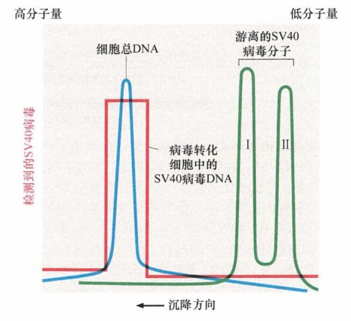

图3-2-1： SV40病毒DNA的整合： 提取SV40病毒转化细胞的DNA分子，并用蔗糖梯度（用于防止离心管中不同液体层混合）稳定的碱性溶液离心沉降。在此情况下，高分子量的细胞 DNA（蓝色）在蔗糖梯度中沉降一定的距离（图左）。相比之下，病毒颗粒中提取的SV40病毒DNA（绿色）则沉降得比较慢，这说明它的分子量相对较小。核酸杂交结果表明：SV40病毒转化细胞中的SV40病毒DNA序列与细胞中的高分子量染色体DNA（红色）发生了共沉淀，表明SV40病毒基因组与宿主细胞的基因组有共价结合。

若干年后，人们在几乎所有（ >99.7% ）的宫颈癌中都发现有整合到染色体 DNA的人乳头瘤病毒(HPV) 基因组片段。引起争论的是，人们几乎从未发现完整的病毒基因组整合于肿瘤细胞基因组中 ，取而代之的是，在肿瘤细胞染色体 DNA中，只发现了含有致癌信息的部分病毒基因组 ，而那些使病毒能够复制和构建后代病毒颗粒的基因组部分通常缺失或者仅以碎片的形式存在。

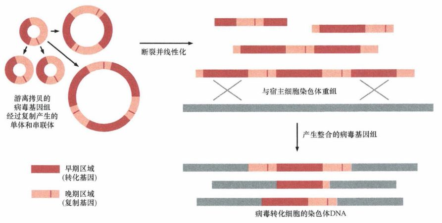

图3-2-2：整合的病毒基因组的形成

此外，最近发现，某些嗜淋巴细胞疱疹病毒，尤其是人类疹病毒 6型 （ HHV-6 ）和鸡的马立克病病毒（ MDV ） , 可以将其基因组整合至其宿主细胞染色质DNA中的端粒重复序列。这使得这些 病毒可以建立长期的潜伏感染：当病毒关闭主动复制时，病毒基因组无限期地保持；一段时间后，病毒基因组可以自我切除并主动复制。

逆转录病毒基因组
 
整合入被感染细胞的染色体中

SV40病毒 、 HPV病毒这样的DNA病毒 将它们的基因组与宿主细胞染色体 DNA整合 ，这个发现解决了一方面的疑问，但由此产生了另一个疑问：诸如 RSV 这样的 RNA病毒，其 基因组是单链 RNA分子 ，显然不可能直接与被感染细胞的染色体 DNA整合 ，那么它们是如何将其基因组在细胞系中多代地传递下去的呢？

20世纪60年代中后期，Temin 提出假说：在感染细胞后， RSV 病毒颗粒会合成 RNA基因组的双链DNA拷贝 ，这些双链 DNA被整合入宿主细胞的染色体DNA中。 由此，病毒基因组的 DNA（称为前病毒 ）就能够在细胞复制其染色体 DNA时同时被复制。另外，前病毒DNA之后还可以作为细胞RNA聚合酶转录的模板 ，由此产生能够组装入子代病毒颗粒的 RNA分子 ，或者行使 mRNA的功能 ，用于合成病毒蛋白。当时普遍的观点认为信息的传递是单向的、特定的， Temin提出 的逆转录假说使他登陆了科学的荒漠之地。

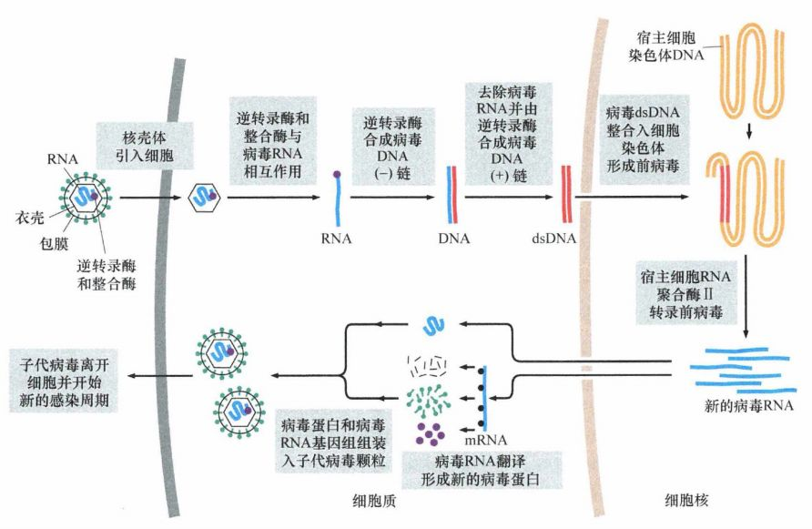

图3-2-3： RSV （ RNA 肿瘤病毒）的生命周期

1970年 ， Temin和David  Baltimore同时发现RSV和相关病毒颗粒携带有逆转录酶 ，在逆转录酶发现后的一年中，人们在 RSV感染细胞的染色体DNA中发现了前病毒DNA的存在 ，强有力地证明了 Temin 提出的观点！

很快，人们又发现了一大类具有相似结构、复制周期中信息由 RNA分子反流向DNA的病毒，称为“逆转录病毒” ，逆转录病毒也依赖于将基因组整合入染色体以保证它们基因组的稳定保留和传递。

然而，RSV等逆转录病毒与SV40病毒等DNA肿瘤病毒在整合机制上有很重要的区别。逆转录病毒pol基因编码合成 整合酶，这个整合酶与逆转录酶一同合成，参与调节染色体整合的过程。而 DNA病毒 基因组的染色体整合是非常罕见的（ <<1/1000） ，这使得其基因组持续保存在最初感染细胞的后代细胞中。

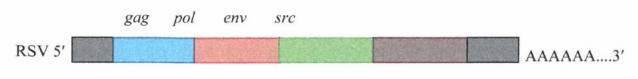

图3-2-4： RSV的基因组结构：gag基因编码的蛋白质与病毒RNA一起形成病毒颗粒的核蛋白核心；pol基因编码逆转录酶和整合酶；env基因编码病毒颗粒的糖蛋白凸起；src基因编码 的 Src蛋白可导致细胞转化。（此模式图未展示5’端帽结构。）

RSV病毒携带的src基因
 
也存在于未被感染的细胞中

将 RSV的RNA基因组与失去转化能力的相关逆转录 病毒基因组相比可发现：在 RSV基因组中，仅有非常少 量的 RSV基因组发挥转化 功能。遗传学家推测： RSV的所有转化功能存在于一个基因内，该基因称为src(读作sark) 。

1974年，加利福尼 亚大学的 J. Michael Bishop 和 Harold Varmus共同制作 了能特异性识别 RSV基因组中src 基因的探针，以了解它的起源和功能。他们猜想：在未被感染的鸡细胞的基因组中不会存在 src相关的DNA序列。受感染细胞中 则能够检测到 src序列，这些序列由感染性 病毒的基因组引入。

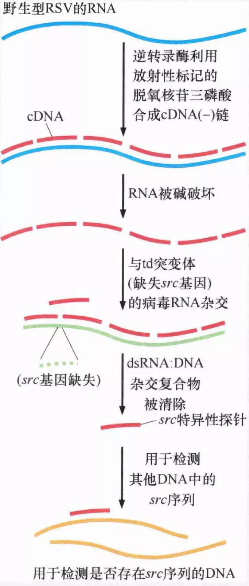

图3-2-5： src特异性DNA探针的构建 ： DNA杂交复合物被清除，留下了不能与td突变株RNA 进行杂交的 野生型 DNA的 单链 DNA片段 。残存下来的 DNA片段 ，如果经过放射性标记，可以用作 src的特异性探针来检测各种细胞DNA(橙色）中的src相关序列 。

然而，这一实验的结果与预期完全不同： src序列也存在于未被病毒感染的鸡细胞的DNA序列中 ，这些 src序列以单拷贝细胞基因的形式存在 。也就是说，每个二倍体鸡细胞基因组中存在两个 src相关DNA序列的拷贝—— 这恰恰是大多数基因在细胞基因组中的存在形式。

于是，他们得出这一观点：在未被感染的鸡细胞基因组中存在的 src序列，具有正常细胞基因的所有性质，在每个单倍体基因组中存在一个单独的拷贝，在几千万年中缓慢地进化；并且它也存在于所有现代脊椎动物的共同祖先物种中。这一认识使人们对肿瘤起源的思考有了革命性的发展。

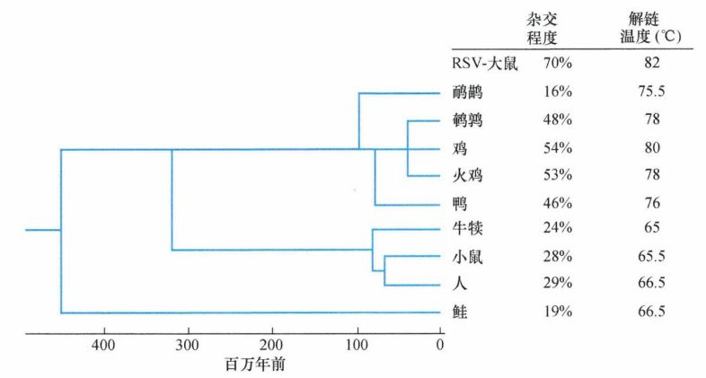

图3-2-6： src基因的进化树 ：亲缘关系越远的物种的基因，在进化中与鸡来源的 src基因 序列累积的差异越大

RSV利用从细胞捕获的基因
 
来诱导转化细胞

在正常生物体的基因组中存在高度保守的 src基因 ，细胞内 src基因 （ c-src ）被称为原癌基因，其的作用与正常的细胞行为和正常的机体发展相配。相反， v-src基因起着潜在的癌基因的作用。

是否有可能RSV的src基因并非天然存在于RSV的祖先逆转录病毒的基因组中？这个假想的病毒祖先虽然缺失src,却能很好地在鸡细胞中进行复制。

实际上， src缺失的逆转录病 毒 —— 禽白血病病毒（ ALV ）在鸡中很普遍，并且能够从一只鸡传染至另一只鸡。这提示，在鸡细胞感染的过程中，一个类似于这种普通鸡病毒的祖先病毒，从宿主细胞基因组中获得某些序列，所获得的细胞序列随后与病毒基因组整合，成为该逆转录病毒的基因。一旦存在于 RSV的基因组中，被捕获的src基因随后就能够被病毒改变和利用 ，用以转化被感染的细胞。

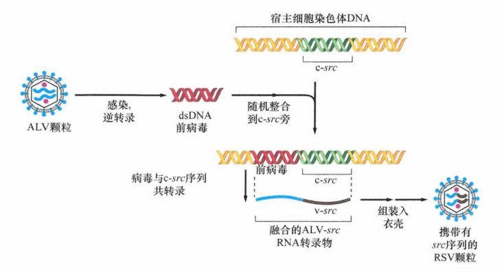

图3-2-7： 禽白血病病毒捕获src：AL V 前病毒和邻近的 c-src基因被共同转录为一条杂交 RNA转录物

这一模式赋予了逆转录病毒巨大的智慧，因为这意味着逆转录病毒可挑选和利用现成的细胞基因为自己所用。

逆转录病毒获取和激活 c-src基因的方法引发了3个进一步的猜想。

第一， 如果逆转录病毒能够激活这种原癌基因使其成为潜在的癌基因，那么其他类似的突变机制可能也可以通过重塑正常的 c-src而产生相似的结果。可能这一机制在激活细胞原癌基因成为癌基因时，并不 需要将正常基因从其所处的细胞染色体中移走。可能诱发肿瘤的信息也早已存在于正常细胞的基因组中，只等待被唤醒。

第二，RSV的所有转化能力都来自于其基因组中的单个基因v-src。这预示着单个癌基因能够引发细胞在形态上、代谢上及生长行为上的 大量改变。更普遍地说，这意味着其他能够引发肿瘤的基因也有多效性的作用。因此，如果一个被转化的、致瘤的细胞与正常细胞相 比有 20-30处 不同的性质，这些多样的改变可能不是源自于 20-30个不同基因的改变 ，而仅仅由少数基因的改变导致。

第三，RSV和其v-src癌基因可能代表了其他逆转录 病毒的行为模式，它们同样也能够在体外转化被感染的细胞及在体内诱发肿瘤。或许这些逆转录病毒获得了与 src无关的其他细胞基因。无疑，c-src基因是第一个被发现的原癌基因，其他细胞原癌基因可能隐藏于脊椎动物细胞的基因组中，等待 着某些逆转录病毒捕获和激活。
# 第三章_3_《癌生物学》第三章（3）肿瘤病毒如何在细胞中复制（下）【学习分享】

“接着上一次，今天我们继续学习肿瘤病毒在细胞中复制传代的其他方式...”

脊椎动物基因组中有大量原癌基因

RSV捕获细胞原癌基因 c-src 形成自己的 v-src，利用这些基因来转化被感染细胞。在v-src和c- src 发现的一年内，人们开始争相去寻找其他的病毒，这些病毒以相似的遗传途径传递，并可能携带其他的有趣的原癌基因。

另外一种鸡逆转录病毒 MC29骨髓细胞瘤病毒（能够在鸡中诱发一种骨髓恶性肿瘤），也属于这类病毒。MC29 基因组中也含有捕获的细胞基因，称为v-myc癌基因，这种病毒利用该基因在被感染的鸡中诱发快速生长的肿瘤。如v-src一样，v-myc基因可溯源至正常鸡细胞基因组中相应的原癌基因c-myc。

哺乳动物中也发现了类似的逆转录病毒，它们能够获取细胞原癌基因并将其转化为有效的癌基因。其中，猫白血病病毒在其基因组中获得 fes原 癌基因，产生猫肉瘤病毒；而一种杂交的大鼠 - 小鼠白血病病毒在不同情况下可获得两个不同的原癌基因 ， 由此产生 Harvey肉瘤病毒和Kirsten肉瘤病毒两种转化性逆转录病毒，在基因组中分别携带有H-ras和K-ras癌基因。

表3-3-1：急性转化性逆转录病毒及其捕获的癌基因

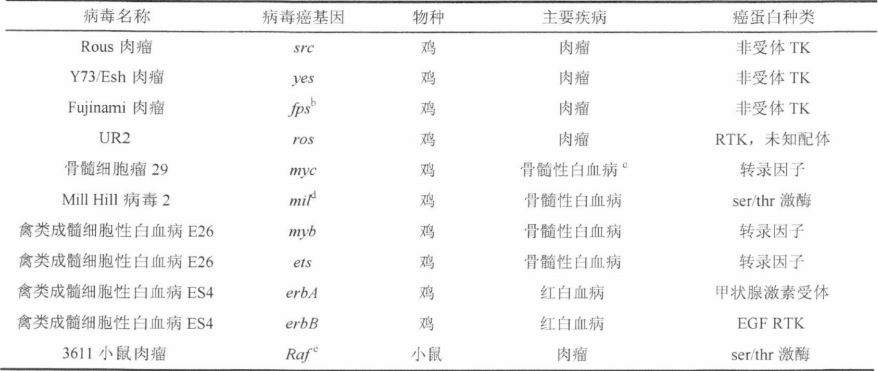

在不同情况下，存在于哺乳动物或者禽类 DNA中的原癌基因，都能够容易地在所有其他脊椎动物的基因组中被检出。这些基因，如在鸡、鼠和人类中的c-myc，在它们各自的宿主中似乎发挥着相同作用 。由此认为， 庞大的原癌基因系统存在于所有哺乳动物和鸟类的共同祖先 ——脊椎动物的基因组中，并与脊椎动物基因组中其他大多数基因一样，都遗传到了它们的现代物种中。事实上，人们至今已经发现了30多个不同的脊椎动物原癌基因。

慢性转化性逆转录病毒通过
 
将其基因组插入细胞原癌基因旁
 
激活原癌基因

如上所述，病毒从被感染的宿主细胞基因组中捕获原癌基因后，转化感染细胞，诱导其癌变。那么有一个新的疑惑：像 ALV这种不携带癌基因的病毒是如何诱发恶性肿瘤的呢？

病毒在被感染宿主细胞的染色体 DNA上的整合位点是随机的，可能存在几百万个。然而，通过绘制ALV前病毒在白血病细胞染色体DNA中整合位点的图谱，对一系列ALV引发的、在单个鸡中独立出现的白血病进行分子分析，得出了一个出乎意料的结果：这些白血病细胞基因组中，大多数 (>80%)ALV前病毒整合染色体DNA的位点紧邻原癌基因c-myc。 这一发现很难与观点 “前病毒在被感染细胞基因组上几百万个整合位点中发生随机”相符。

人们很快发现， ALV前病毒中的病毒转录启动子破坏了c-myc基因的正常表达调控机制。细胞 c-myc基因不再受本来的基因启动子的调控，而是直接受病毒的转录调控，其表达不再受细胞的精密调控，而是受外来“篡权者”的调控，高效持续地表达。

基于此，对 “ALV这种不携带癌基因的病毒是如何诱发恶性肿瘤”的疑惑解答如下：ALV感染鸡的造血系统并迅速传播至成千上百万个细胞，每一个感染都能导致ALV前病毒在被感染细胞基因组中的某个位点发生随机整合。在大多数情况下，这种前病毒的整合仅使宿主细胞产生大量的后代病毒颗粒，但是在极低的概率下，前病毒碰巧整合于c-myc基因旁。这个偶然事件导致c-myc基因转化为一个有效的癌基因，它因受邻近整合的前病毒及其转录启动子的作用，不受控制地增殖，几周内其子代细胞便可进一步发展成为更具侵略性的、形成白血病的肿瘤细胞。

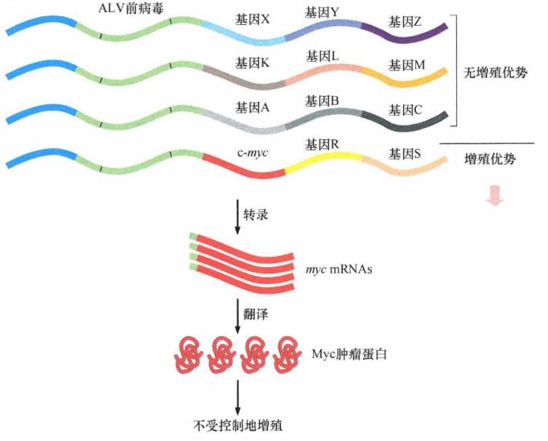

图 3-3-1 ： 插入突变：在 ALV感染鸡淋巴细胞时，ALV前病毒（绿色）在细胞染色体DNA中的几百万个不同位点进行随机整合；在罕见情况下，ALV前病毒整合到c-myc原癌基因（红色）中。随后可能造成c-myc基因的转录被ALV强力的、持续活化的启动子影响，从而不受控制地增殖。

由于前 病毒整合激活 c-myc基因的概率极低 ， 因此在恶性肿瘤被触发之前而要经历几周的时间和几百万次感染。这种特殊的原癌基因的激活机制称为插入突变 。 迄今 为止 ，对禽类和 鼠 类逆转录 病毒 感染的研究证明，整合发生在多于 25个 不 同的细胞原癌基因旁。

表 3-3-2 ： 插入突变所活化的细胞基因的例子

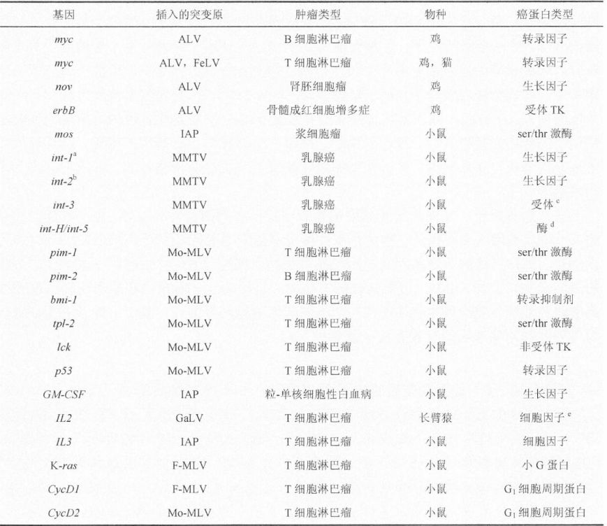

a.后命名为Wnt-l；b.后证实为编码成纤维细胞生长因子(FGF)的基因；c.与Notch受体相关；d.雄激素向雌激素转变的酶；e.指调控造血细胞的生长因子

一些逆转录病毒天然携带癌基因

总结上述两类 逆转录病毒 ：一类 病毒 ， 如 RSV ， 从细胞中获得癌基因 ， 能够快速引发肿瘤； 另一类病毒 ，如 MLV和ALV ， 不携带癌基因，但能在初始感染后经历较长的潜伏期后在宿主动物上引发肿瘤。 实际上 ， 还存在第三类逆转录病毒。

人类 T细胞 白 血病病毒 （ HTL V - 1） 感染了约 1 % 的 日 本九州居民 ， 终生 HTL V -l病毒感染具有3% - 4%的概率发展为成年T细胞白血病。广泛的分 子 研究 显示 没有任何迹象表明 HTL V -1前病毒 整合 位点聚 集 在特定的染色体区域。因此， HTL V -1 并非通过 插入突变引发 白 血病。 HTL V -1前病毒引发 白 血病的能力来源于病毒基因天然编 码 的一个或多个 病 毒蛋 白， 这其中了解最透彻的是病毒 tax基因 。

tax基因的产物能够激活前 病毒 DNA序列的转录， 由此 产生 子 代 RNA基因组。同时，tax基因产物能够激活两个细胞基因的转录， 使其 编 码 重要的生长因 子， 促进多种造血细胞的增殖 。 虽然由此引发的增殖本身不会直接造成 白 血病 ， 但 由 HTL V -1刺激的细胞能以较低概率形成真正的肿瘤变异体。

特定 病毒 癌基因的表达 ， 特别是 tax ， 似乎是宿主动物中逆转录病毒复制周期中固有的组成部分。 由此认为， HTL V -1前病毒 天然携带癌基因。

**小结： 虽然全 世 界发生的癌症中仅约 1/5是与感染性病原体相关的，且病毒和其所激活的原癌基因在人类癌症的发生中发挥的作用也并非决定性的。 我们 仍 应正确看待关于其转化机制的研究 ， 这些研究揭示了在各种人类肿瘤中发挥主要作用的基因，大大加快了我们在基因和分 子 层面上对肿瘤发病机制的了解，使得肿瘤研究有了飞跃性的发展，使其从描述性的科学发展成为能够用精确和系统的术语进行解释的科学。**

# 第四章_1_《癌生物学》第四章（1）并非所有肿瘤都由病毒感染引起【学习分享】

在上一章的分享中，我们主要学习了病毒感染和肿瘤发生之间的关系。的确，随着20 世纪 70 年代 DNA 和 RNA 肿瘤病毒的发现，为肿瘤生物学家解释人类肿瘤的起源提出了一个简单而有力的理论。

但是，我们有这样一个疑问： 所有的肿瘤的发生都是由于肿瘤病毒感染吗？

**并非所有肿瘤都由病毒引起**

随着研究的不断深入，人们发现用这个理论难以将人类肿瘤的生物学和流行病学特征统一起来。显然，大多数的人类肿瘤并不像传染病那样从一个个体传播到另一个个体。人们也很难找到具有典型小范围流行病学特征的肿瘤病例。最重要的是，自20 世纪 70 年代以来，研究人员尝试从多种人类肿瘤中分离出病毒，但均以失败告终。在西方国常见的肿瘤中，只有宫颈癌和肝癌能够明确地与特定的病毒病原体联系起来。 

20 世纪初期，日本科学家 Katsusaburo Yamagiwa 的研究表明，化学物质能够诱导实验动物发生肿瘤（见第2章）。该研究表明，在兔耳朵上连续数月反复涂抹煤焦油能够引发皮肤癌。20 年代中期 ，法国巴黎的一篇博士论文记载了百余例肿瘤病例，其中大多数为皮肤癌，这些患者都有在 X 射线环境中工作的经历。显然，这两项研究中肿瘤的直接诱因都是非生物性的，或者为化学有机物或者为射线。

在这种情况下，一些支持病毒致癌说的学者，尤其是从事逆转录病毒研究的学者，在 20 世纪 70 年代早期提出了一种新的机制学说，解释了在没有明显外部病毒感染的情况下，肿瘤病毒是如何参与多种肿瘤发生的。
 
这种新机制的提出源自于逆转录病毒独特的生物学特性。在某些情况下，逆转录病毒的基因组能够整合到各种脊椎动物的生殖细胞基因组中，由此产生的前病毒可以像孟德尔等位基因一样遗传至后代。这些 内源性前病毒常常处于转录沉默的状态，而且它们在生物体细胞中的存在也不明显。只有在极少数的情况下，这些通常保留了编码感染性逆转录病毒颗粒能力 的内源性前病毒的表达会被唤醒。

从某些品系的小鼠中分离出成纤维细胞，并向其中加入胸腺嘧啶类似物——溴脱氧尿苷（BrdU), 能够激活这些细胞中内源性的逆转录病毒 (ERV) 基因组。作为应答， 这些由于内源性前病毒转录沉默而表面上看没有被感染的结缔组织细胞，开始释放逆转录病毒颗粒。一旦这些细胞释放具有感染性的病毒颗粒，它们就能通过细胞间的感染不断增殖，并迅速扩散到全身，诱发白血病。

这个理论在小鼠身上似乎是成立的，那么在人身上呢？事实上，大多数存在于人类基因组中的内源性逆转录病毒基因组，都是 500 万年前早期的灵长类动物的生殖细胞受到感染后遗传而来的。从那时起，这些前病毒的序列渐渐发生突变，失去产生特定的具有传染性的逆转录病毒颗粒的能力，成为大量存在于人 类基因组中的垃圾 DNA 序列的一部分。尽管多达 8%的人类基因组源自内源性逆转录病毒的基因组，但在这些接近 4 万个逆转录病毒起源的基因片段中，只有少数几个被证实具有完整性及编码特定感染性病毒的能力。例如，其中之一的 HERV-K 亚家族， 该家族整合至人类生殖细胞的时间相对较晚，前病毒相对比较完整。即便如此，人们也没能发现它们具备产生感染性病毒颗粒或者诱发肿瘤的能力。人们始终不能从人类肿瘤中分离出有感染性的逆转录病毒颗粒，这个假说因为缺乏支持性的证据而很快垮台。

**DNA转染检测非病毒性癌基因**

内源性逆转录病毒理论虽然终结了，但是它也给非病毒性致癌作用研究的人提供了另一种可能的理论：致癌物质作为诱变剂发挥作用。无论是物理因素（如 X 射线）还是化学因素（如烟焦油），这些物质都能使易感细胞基因组中关键的生长控制基因发生突变，从而诱发肿瘤。这些生长控制基因可能是正常的细胞基因，如由逆转录病毒学家发现的原癌基因。一旦这些基因发生突变，产生的突变等位基因可能发挥活化的癌基因的作用，促使含有这些突变体的细胞发生癌变。

为了明确非病毒性癌基因是否在化学诱变的细胞中存在，一种新的实验方法应运而生。该方法将癌细胞的 DNA（或部分基因）导入正常细胞中，并观察受体细胞是否对导入的肿瘤细胞 DNA 产生反应 ，通过受体细胞在导入肿瘤细胞 DNA 数周后在培养基中形成的集落数来评价受体细胞是否发生了转化。
 
1972 年 ，一种高效的基因导入方法产生了，很快被命名为 “转染 ”，它是利用 DNA 和磷酸钙晶体形成共沉淀，在此基础上将裸 DNA 分子直接转入哺乳动物的细胞内。

在 1978~1979 年的实验当中，研究人员用 3- 甲基胆蒽（3-MC）处理不同的小鼠细胞系，诱导其发生癌变，然后提取 DNA 加入源自于小鼠胚胎成纤维细胞的 NIH 3T3 细胞系培养基中。几周之后，NIH 3T3 细胞形成 大量的转化灶。转化灶中的细胞随后被证实具有锚定非依赖生长及致瘤能力。这个实验证明了供体肿瘤 DNA 中含有能够将正常的 NIH 3T3 细胞转化成具有强 致瘤能力的恶性细胞的遗传因子。此外，从正常的小鼠成纤维细胞中提取出的 DNA 不能诱导 NIH 3T3 细胞形成转化灶， 说明 3-MC 使小鼠成纤维细胞 的基因组发生了某些改变，产生了一些新的具有转化能力的遗传序列。
 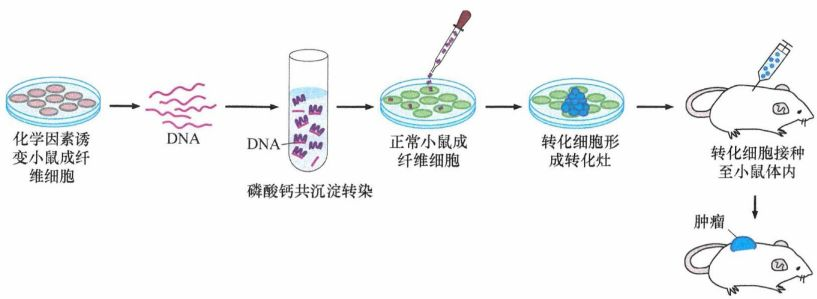 
图1：转化细胞DNA的转染

此外，从不同的人类肿瘤细胞中提取出的 DNA 被证实均能转化小鼠成纤维细胞。这意味着无论来源于何处，肿瘤细胞中的癌基因都能够跨越物种和组织的差异，使正常细胞发生转化。

**癌基因与逆转录病毒相关**

人们产生了新的疑问：同样的细胞原癌基因，是否既可以在某些情况下被逆转录病毒激活，又可以在另外一些情况下被非病毒的诱变剂激活？或者，被逆转录病毒激活的癌基因和通过非病毒诱变剂激活的癌基因本来就是两组完全不同的基因？

通过 Southern 印迹杂交实验, 人们用针对 Harvey 大鼠肉瘤病毒中存在的 *H-ras* 癌基因设计的 DNA 探针，在人膀胱癌细胞中检测到了相关的癌基因。另一个相关的癌基因，存在于 Kirsten 肉瘤病毒中的 *K-ras* 基因，同样能够在人结肠癌细胞中被检测到。

表1：人类肿瘤中发现的逆转录病毒相关癌基因
 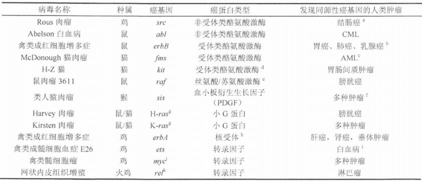
 
随后，研究人员发现，逆转录病毒相关癌基因在人肿瘤细胞基因组中有更多的拷贝数。来源于禽髓细胞瘤病毒 (AMY）的 *myc* 癌基因在人早幼粒细胞白血病细胞系 HL-60 的基因组中存在多个拷贝。 *myc* 基因这些额外的拷贝（一倍体基因组包括 10~20 个拷贝数）是基因扩增的结果，同时也导致其编码的 Myc 癌蛋白的含量增加，从而促进肿瘤细胞增殖。

在癌细胞中，促进生长的原癌基因往往发生过表达，而抑制生长的肿瘤抑癌基因则出现缺失。不同类型的细胞在转变为肿瘤细胞的过程中，其基因组发生了截然不同的改变。
 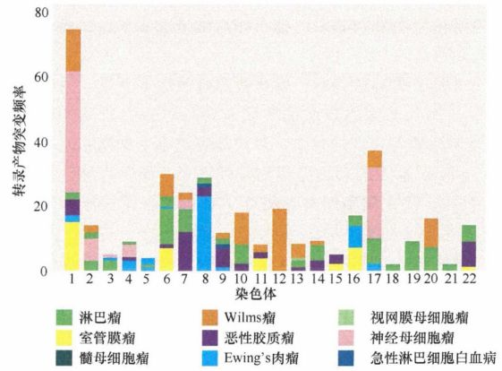 图2：染色体区域非随机性扩增和缺失 

所有结果表明，许多与禽类或哺乳动物逆转录病毒相关的癌基因都能在人类肿瘤细胞基因组中找到相应的突变激活体。意味着在肿瘤发生的过程中，细胞原癌基因既可以被逆转录病毒激活，又能通过非病毒性诱变因素激活。

那么，逆转录病毒和非病毒性诱变因素又是通过什么机制激活原癌基因的呢？这个内容让我们在下一节再一起来学习吧~不见不散哦~

# 第四章 《癌生物学》第四章（2）细胞原癌基因的激活【学习分享】

在正常细胞中，每个原癌基因都受到启动子，也就是调节它转录的一段 DNA 序列的调控。随着细胞生理状况的改变，启动子调节这些原癌基因的表达发生相应的改变。通常情况下，细胞会根据自身需要，通过相应的信号通路使原癌基因的表达处于相对较低的水平；然而在某些情况下，细胞会上调这些基因的表达。

**逆转录病毒激活原癌基因** 

尽管人们已经证实，在人类肿瘤基因组中，大量原癌基因以激活形式存在，但是导致它们激活的遗传学改变的机制依旧不是很清楚。在逆转录病毒的基因组结构被研究清楚后，人们也就了解了逆转录病毒引起癌变的机制 。
 
如果原癌基因来源于逆转录病毒，当在细胞基因组中插入逆转录病毒基因后，插入基因的表达仍然受逆转录病毒的启动子调节, 导致基因处于持续高表达的状态，并且其表达不受细胞自身信号通路的调控。例 如，正常情况下， *c-myc* 基因的表达受到细胞外信 号，如促有丝分裂生长因子的严格调控。而在禽髓细胞瘤病毒 (AMV) 的基因组中，该基因（通常被称为 *v-myc* ) 的表达远远高于细胞内的正常水平，并持续处于高表达的状态。
 
对 *myc* 基因表达的调控还存在另一种罕见的方式。当 ALV 插入基因组中靠近 *c-myc* 原癌基因的位置时， *c-myc* 的表达会受到 ALV 前病毒的调节，导致 *c-myc* RNA 的持续过表达和 Myc 蛋白的含量增加，使细胞获得过量的生长信号。
 
通过前病毒插入导致 *c-myc* 原癌基因激活的模型给了研究人员一种提示：尽管 *c-myc* 处于染色体的正常位置上（ALV不携带癌基因），但也有可能因为外源性转录启动子的插入而导致肿瘤发生。
  
图1：插入突变

**体细胞突变激活原癌基因**
 
**（蛋白质表达水平上升）**
 
通过研究逆转录病毒激活原癌基因的机制，人们发现逆转录病毒可以通过上调蛋白质表达水平，从而达到激活原癌基因的目的。在体细胞突变所致的原癌基因激活，也存在类似的情况。
 
**基因拷贝数增加**
 
***01***

在某些人类肿瘤中， *myc* 基因受它自身的启动子调节，但是肿瘤细胞基因组中 *myc* 基因的拷贝数远远超过正常细胞中的两个拷贝。在 30%的儿童神经母细胞瘤病例中， *c-myc* 同一家族成员 *N-myc* 同样被发现存在扩增，在一些恶性度较高的肿瘤中尤为明显。在这两种情况中，基因拷贝数的增加导致基因产物 Myc 蛋白和 N-Myc 蛋 白的表达增加。Myc 家族蛋白具有促进细胞生长的作用。因此，当 Myc 蛋白表达过量时，将使细胞的增殖失去控制。
 
对特定区段的染色体 DNA 选择性复制所形成的基因扩增导致 *myc* 基因的拷贝数增加, 这使得染色体中较远的染色体区域不受影响。这个特定扩增的染色体区域——扩增子，其长度远远大于 *c-myc* 或 *N-myc* 自身的长度（通常包含 50 万~1000 万个碱基对）， 因此在细胞分裂中期，可以用光学显微镜观察到发生扩增的片段。基因扩增会产生一些重复的长线性染色体区段，其在显微镜下表现为均质染色区（HSR) 。带有 *myc* 或 *N-myc* 的染色体片段可能会从染色体上断裂，形成一些染色体外的独立重复颗粒（双微体）。
  
图2： *N-myc* 基因在肿瘤细胞内存在大量的拷贝 （黄色） 

**染色体易位致转录调控改变**
 
***02***

在对分裂中期的肿瘤细胞基因组进行详细分析后，研 究人员发现几乎所有的 Burkitt's 淋巴瘤都存在染色体易位的情况。也就是说，某一染色体上的某一片段与另外 一条染色体上的另一无关片段发生了融合。
 
1983 年，研究人员发现 *myc* 原癌基因定位于 Burkitt's 淋巴瘤细胞 8 号染色体与其他 3 条染色体发生易位的区域中。在易位点（也称为染色体断裂点）的另外一边是免疫球蛋白的启动子区，使 *myc* 基因的表达受到免疫球蛋白启动子的调控。由于免疫球蛋白增强子序列直接调节 *c-myc* 基因持续不断地高表达。最终 *myc* 基因编码的 Myc 蛋白结构没有发生改变，但是处于一种不正常的高水平。已有确切的证据表明，在进化中负责免疫球蛋白基因重排的酶偶尔失去特异性，导致免疫球蛋白与 *myc* 重排在一起。
  
图3：Burkitt's 淋巴瘤中的染色体易位
 
此外，microRNA 的发现及它们在基因调控中的作用使得之前模糊的某些染色体易位分子机制变得容易理解。
 
例如，HMGA2 是一种小非组蛋白核蛋白，已经被证实在各种良性和恶性肿瘤中高表达，发挥癌蛋白的作用。HMGA2 基因的 3'端非编码区发生断裂，其阅读框与另外一个基因发生了融合。很长一段时间内，人们认为由易位产生的融合蛋白增强了 HMGA2 的致癌功能。然而，删除与 HMGA2 融合的蛋白质序列并不影响 HMGA2 融合蛋白的转化能力。这使人们意识到易位还有另外一个目的：通过易位使正常 HMGA2 mRNA 3'UTR 区上 microRNA Let-7 的识别结合位点发生了缺失。这种缺失，使所产生的 mRNA 不再受 Let-7 介导的转录抑制和降解，最终导致 HMGA2 mRNA 和蛋白质的大量增加 ，以一种尚不明确的机制促进染色质重塑和细胞转化。在 这个实例中，染色体 易位更多的是将原癌基因从负调节的状态中解放出来 ，并非让它与正调节因子融合。
  
图4：易位使 mRNA 不受miRNA 抑制
 
在另外一些实例中，染色体易位，如包含 microRNA 的 *myc* 基因，将这些 microRNA 的编码基因与外源性的转录启动子融合，从而增强所编码的 microRNA 的表达。在存在类似易位的肿瘤中，如骨髓增生异常及与之相关的急性髓细胞白血病，易位上调 了 microRNA 的表达，从而阻止了细胞分化，并使细胞处于一种能够演变为高度恶性肿瘤细胞的状态。
 
**体细胞突变激活原癌基因**
 
**（蛋白质结构改变** ）

正常情况下，定位于细胞膜上的生长因子受体只有在细胞外的区段与相应的生长因子 (GF, 也就是生长因子受体的配体）结合后，才能向细胞内传递信号。然而，由于受体编码基因的突变或者是受体 mRNA 前体的异常剪切，某些受体胞外段出现缺失，这些缺失胞外段的受体在没有生长因子配体的情况下，也能持续向细胞内传递信号。
 
由此我们可以看到，不光是蛋白质表达水平的上升，蛋白质结构的改变也能激活原癌基因。

**点突变**
 
***01***

*ras* 基因中的点突变是第一个被发现的原癌基因点突变。膀胱癌中 *H-ras* 基因只有一份拷贝，因此用基因扩增无法解释该基因的激活。 *H-ras* 癌基因是一段包含 6600 个碱基的 DNA 片段。有趣的是，在人类正常基因组中，也存在一个同样大小的片段，也就是人类 *H-ras* 的原癌基因。在膀胱癌发生的过程中， *H-ras* 原癌基因发生突变，转变成 *H-ras* 癌基因。
 
那么，人类基因组中正常的 *H-ras* 原癌基因又是如何转变成能在膀胱癌中被检测到的癌基因的呢？研究人员将原癌基因片段与癌基因片段进行杂交，最终将关键的差异序列局限在一段长为 350 个碱基对的片段中。通过对这段片段进行测序分析，发现原癌基因和癌基因之间仅存在一个非常细微的差异：原癌基因中的一个 G(鸟嘌呤）在癌基因中突变成 T（胸腺嘧啶）。这种单个碱基的突变——点突变，就是 *H-ras* 原癌基因转换成能够诱发肿瘤的癌基因的原因。重要的是，发生突变的碱基位于 *H-ras* 基因编码蛋白的阅读框内。这个突变使正常 *H-ras* 基因编码的蛋白质中一个甘氨酸变成了缬氨酸。
  
图5：具有癌基因活性突变位点的确定

**染色体易位致蛋白质结构改变**
 
***02***
 
在学习通过蛋白质表达水平上升激活原癌基因的时候，我们就已经介绍过染色体易位。但是那种易位没有影响蛋白质编码基因，也就是说蛋白质结构并没有发生变化。
 
最著名的染色体易位出现在慢性髓细胞白血病 (CML) 中，出现频率约为 95% 。与 Burkitt's 淋巴瘤不同, 这些慢性粒细胞性白血病中通过易位形成的融合蛋 白，是一个基因的转录调节序列插入第二个基因的阅读框内产生的，也就是说蛋白质的结构已经发生了改变。几乎所有 CML 中的染色体易位，都是大部分 Bcr 基因阅读框与几乎全部Abl基因阅读框发生了融合。这种易位形成的融合蛋白中酪氨酸激酶（对应于 SH1 结构域）的活性异常激活，这种异常是融合蛋白发挥致癌功能的主要原因。
  
图6： *bcr-abl* 癌基因的形成

**总结一下——**
 
原癌基因能够通过两种不同的方式被激活：逆转录病毒感染或者体细胞突变。
 
体细胞突变所导致的原癌基因激活存在两种情况：一种是使原癌基因编码的蛋白质结构发生改变，另一种则是使相应蛋白质表达水平升高。蛋白质结构的改变包括点突变，如 *ras* 原癌基因；基因易位，如 *bcr-abl* 。蛋白质表达水平的上升则是由于基因拷贝数的增加或基因易位导致转录调控的改变，如 *myc* 基因易位后受到免疫球蛋白增强子序列的调控。

# 第五章 《癌生物学》第五章（1）生长因子与受体（上）

 
“ 正常细胞从其周围获得生长刺激信号，这些信号被细胞中复杂的信号环路处理并整合，决定细胞是否适合生长及分化。细胞间的信号传递主要由蛋白质负责，癌蛋白（如： Src和Ras 分别为癌基因 src和ras的产物 ）可同时改变多种细胞的表型。我们不禁会问，这些单一种类的蛋白质，是如何同时调节众多不同的信号调节通路的呢？
 
从本期推送起，我们将共3期推送介绍生长因子（受体）与配体的知识，欢迎一起学习！”

1、正常细胞间的生命活动相互依存

正常组织形态的维持由以下几方面构成：保持不同细胞组分的适宜比例；替代缺失细胞；清除额外的无用细胞；及时修复损伤组织；清除外源感染物质。这些功能的实现皆有赖于细胞间的协同合作，因此活体组织中的细胞需要持续不断地相互对话，而大部分对话由生长因子（GF）负责传达。

图 5-1-1： 生长因子的作用 ： 被固化在细珠（绿点）上的表皮生长因子（ EGF ）加入小鼠乳腺癌细胞培养体系 5min后，细胞肌动蛋白细胞骨架（红色 ）重组，并从胞质内向生长因子伸出触角（上图：平面观；下图：侧面观）

细胞是否生长由整个组织及整个有机体的需要而定，并非仅出于有利于某些组分生长的目的。正因如此，活体内没有一个细胞被赋予自主权决定该细胞是否增殖或维持静息状态。这一决定需要与组织中其他细胞共同“商议”后才能做出。周围细胞可以通过促使某种特殊细胞分泌生长因子以刺激靶细胞的增殖，也可以通过释放生长抑制因子而抑制其增殖。最终，一个体细胞做出是否增殖的决定反映了周围细胞的群体意见。

从活组织中分离出正常细胞，而后在培养皿中进行培养的实验，可以充分说明个体细胞对环境的依赖性：即使细胞上层的液体介质中包含了所有细胞生长繁殖所要的营养成分，此种介质也无法诱导细胞增殖。但是一旦在这种介质中加入小牛或胎牛的血清，细胞就可增殖。这是因为血清中含有促使细胞增生的生长因子。

血液凝固时，血小板相互黏附聚集并逐渐收缩形成血凝块，将血液中的细胞成分（包括：红细胞和白细胞）网罗其中，这有利于阻止继续出血；当血小板在伤口处形成血凝块时，它们还通过向其周围释放血小板衍生生长因子 （ PDGF）启动伤口的愈合；此外，PDGF可将成纤维细胞吸引至伤口处并刺激成纤维细胞增生，使之形成包括上皮下细胞层的大部分结缔组织。如果没有血清中 PDGF 的刺激 ，在细胞培养皿内培养的成纤维细胞虽然可在几周内存活并保持正常的新陈代谢，但无法继续生长和分裂。

2、Src的酪氨酸激酶功能

细胞间信号如何通过生长因子传递的第一条线索来源于对癌基因v-src及其特定蛋白质产物的生化分析：科学家根据src癌基因的核苷酸序列推导出src癌基因编码的蛋白质氨基酸序列，然而后者并未给“癌蛋白如何促使细胞增殖及转化”这一问题找到答案。

直到1977-1978年，生化学家研制出能与Src特异识别并结合的抗体，当其在同时含有Src及腺苷三磷酸（细胞的万能磷酸根供者）的溶液中孵育时，该抗体被磷酸化。由此可知，Src是作为蛋白激酶发挥作用的，即将ATP的一个高能磷酸键转移至一个适宜的蛋白质底物分子。 （需要注意的是：Src并不常规地磷酸化蛋白底物，早期试验中它的磷酸化功能仅提示它在细胞中的作用模式涉及蛋白底物的磷酸化。） 除了其自身的激酶活性，Src本身就是一个磷酸化蛋白，这表明Src也可作为底物被蛋白激酶磷酸化——自磷酸化或者充当其他激酶的底物。

图 5-1-2 ： Src 的磷酸化作用（底物为用于免疫沉淀 Src分子的抗体 ）

图 5-1-3 ： Akt/PKB激酶 （丝氨酸／苏氨酸蛋白激酶）通过磷酸化主要调控蛋白而广泛地影响生物过程

Src 激酶功能的揭示意义深远：原则上，一种蛋白激酶可以磷酸化细胞内多种不同的蛋白质底物（如Src已被证明有50种不同的蛋白质底物），一旦被磷酸化，这些底物蛋白质的功能可能会发生改变，进而改变其下游靶点的功能。这种作用机制可以解释像Src这样的蛋白质为何能如此多效地干扰多种细胞的表型。

不久之后，人们又发现Src与以前发现的其他蛋白激酶显著不同：在正常细胞内99%以上的磷酸化氨基酸为磷酸化丝氨酸和磷酸化苏氨酸，磷酸化酪氨酸仅占这些细胞内全部磷酸化氨基酸的0.05%-0.1 %；当细胞经v-src癌基因转化后，胞内磷酸化酪氨酸水平显著升高，占这些细胞磷酸氨基酸总量的1%。而当用其他癌基因（如H-ras) 转化相同的细胞时，这些细胞的磷酸化氨基酸组分并没有什么改变。因此认为，磷酸化酪氨酸残基的产生是Src的特有属性，Src通过其酪氨酸激酶活性使蛋白质底物磷酸化而成功地转化细胞。

3、上皮生长因子（EGF）受体的酪氨酸激酶功能

上皮生长因子（EGF）是第一个被发现的生长因子，它对多种上皮细胞具有促分裂作用。EGF可结合于某些细胞表面并刺激其生长，而无法与EGF结合的细胞则对其有丝分裂原作用无反应。这些观察结果提示：可能存在一种细胞表面蛋白——EGF受体（EGF-R），它可特异性识别并结合胞外的EGF，将信息向胞内传递。

图 5-1-4 ： 生长因子受体（ EGFR)结构

图 5-1-5 ： 人类 EGF受体 （ HER2)信号网络

分离EGF-R蛋白极具挑战，因为该受体和其他很多受体一样在细胞内的表达水平非常低。研究者通过使用子宫上皮癌细胞（其表达的EGF-R比正常水平高100倍）解决了这个问题。对EGF-R分离纯化并进行氨基酸序列分析，可以帮助我们了解该蛋白质的结构特征以及这一结构如何发挥功能。从EGF受体的整体结构可以大致推断出：其胞外结构域与EGF结合之后，一个信号被转导通过细胞膜以激活胞内结构域，胞内结构域被激活后释放促使细胞生长分裂的信号。

对该胞内结构域的检测显示，它与已知的Src蛋白质序列有明确的序列相似性。EGF受体如何在胞内释放信号这一问题的答案瞬间变得清晰起来：一旦其胞外结构域结合EGF, 其胞内结构域的Src样激酶将以某种方式被激活，之后磷酸化某些胞内蛋白质的酪氨酸残基，从而使细胞增殖。

图 5-1-6 ： EGFR 可以根据其结构的特点分为不同的家族：它们具有相似的胞内酪氨酸激酶结构域（红色）；它们的胞外结构域（绿色或灰色）结构高度变异，识别并结合大量胞外配体

4、改变的生长因子受体可发挥癌蛋白作用

1984年，人们证实EGFR和禽成红细胞增生病毒的erbB 癌基因编码的癌蛋白高度相似：erbB 癌基因编码的癌蛋白缺少EGFR的N端胞外结构域的序列。在没有N端序列的情况下，ErbB癌蛋白无法辨认及结合EGF，然而，它发挥了细胞增殖刺激因子的功能。

图 5-1-7 ： EGFR 和 v-ErbB癌蛋白高度相似 ： v-ErbB蛋白由EGFR 基因的变体序列编码，它是缺少正常胞外结构域（绿色）的截短体

这一发现引出了一个有趣的推论并在随后被证实：胞外结构域的缺失可通过某种方式使被截短的EGF受体蛋白向细胞内源源不断地发送生长刺激信号，而完全不依赖于EGF。多年后，在1/3的人成胶质细胞瘤中发现了被截短的EGFR，其mRNA缺少由外显子2-7携带的编码序列，这源于该受体的基因中相应的DNA序列缺失。而后，在乳腺癌中发现了ErbB/EGF-R的同源分子，如Erb82、HER2及Neu，它们与不良预后密切相关。更具广泛意义的是，在人类肿瘤中存在多种与EGF受体结构相似的生长因子受体过表达或结构改变。

图 5-1-8 ： 功能正常的生长因子受体（左侧）在与配体（蓝色）结合后向胞内释放信号（红色穗状）；编码受体分子的基因突变（右侧）可引起蛋白质结构的变化，导致配体非依赖性的受体激活，信号失调。

正常细胞通过从其培养基中获得生长因子而维持生长，然而癌细胞在生长和生存过程中对生长因子的依赖性则大大降低。ErbB-EGF-R间的关系为癌细胞这一特性提供了一个简单明了的解释：ErbB 癌蛋白所释放的信号与那些经配体激活的EGFR所释放的信号非常相似，不同于EGR的是，ErbB癌蛋白可以持续不断地向细胞内发放生长剌激信号，从而使细胞认为周围存在着大量的EGF。

# 第五章_2_《癌生物学》第五章（2）生长因子与受体（中）

5、生长因子基因可转变为癌基因 
 
1983年 ，人们发现血小板衍生生长因子（ PDGF）的β链序列与猴肉瘤 病毒 v-sis癌基因编 码的癌蛋白高度相关，后来的氨基酸序列鉴定提示了另一个癌蛋白转化细胞的重要机制：猴肉瘤病毒感染细胞后，它的 sis癌基因促使被感染细胞释放 大量 PDGF样Sis蛋白 ，后者与释放它们的自身细胞上的 PDGF-R结合 ，造成这些细胞上 PDGF受体强烈活化 ，产生持续的生长刺激信号。
 
PDGF主要刺激间 充质细胞（如成纤维细胞、脂肪细胞及平滑肌细胞）生长，而 EGF则主要 刺激上皮细胞生长。这也解释了为什么猴肉瘤病毒只能转化成纤维细胞，却无法转化上皮细胞。
 
我们已知许多肿瘤细胞可以产生并释放大量它们自身亦可应答的生长因子。肺癌可产生至少 3种不同的生长因子 ：肿瘤生长因子 -α（TGF-α ）、干细胞因子（ SCF ）及胰岛素样生长因子 -1 （ IGF-1 ），并可表达这 3种配体的受体，从而同时确立了3条自分泌信号环路。这些信号环路对肿瘤生长具有重要作用 ，例如，在一项对小细胞肺癌（ SCLC ）患者的研究中，癌细胞表达 Kit （即受体 SCF ）的患者确诊后的平均存活时间仅为 71天，而癌细胞不表达Kit的患者则可平均生存288天。

表 5-2-1： 产生自分泌生长因子的人类肿瘤举例
 

 
一般来说，自分泌信号环路意味着组织和器官存在潜在危险。在正常组织中，个体细胞的增生几乎都依赖于从其他细胞获取的信号；这种相互依赖性确保了细胞种群及组织结构的稳定性。一个获得控制自身增生能力的细胞，其自我强化的正反馈环路往往会导致生理失衡，因此会造成巨大的危险。

6、 受体酪氨酸激酶依赖转磷酸化发挥作用

生长因子受体与配体结合后，其激酶结构域被激活，磷酸化某些胞内蛋白质的酪氨酸残基，从而使细胞增殖。这又引发了一个问题：生长因子受体与配体结合后，是怎样利用它们的酪氨酸激酶结构域来发出信号的呢？

图 5-2-1： 在缺乏EGF时， 32 P0 4 标记的富含磷酸化氨基酸的蛋白质；当添加 EGF到人表皮样癌细胞A431时，右下方的点变强 ，根据内参标记表明这是磷酸化酪氨酸。

在没有配体的情况下，一个生长因子受体通常以单体（一个亚基）形式嵌入质膜。当其生长因子配体（配体为同源二聚体）存在时，受体分子就会结合在配体两个亚基中的一个上。其后，配体 - 受体复合物将在质膜上徘徊直到有第二次机会遇到另一个受体分子，配体中没有结合受体的那个亚基将和第二个受体分子结合。这样，通过二聚体形式的配体为桥梁，两个受体分子成功地交联在一起。两个受体分子的胞外结构域通过与配体结合而发生二聚化，胞质部分通常也会被拉在一起。每个激酶结构域磷酸化另一受体胞质结构域里的酪氨酸残基，这种双向的相互磷酸化作用被称为 转磷酸 作用。

图 5-2-2： 受体二聚化、配体结合与转磷酸作用：在没有配体结合时，生长因子受体分子（左，绿色）在质膜平面自由横向迁移；当两个受体分子相遇时，它们形成同源二聚体且待续时间短暂，受体的胞外结构域发生构象改变并获得与生长因子配体结合的强亲和力（步骤 1 ）；随后 EGF配体分子的结合可导致受体二聚体的稳定性增强并激活酪氨酸激酶 （ TK ）结构域（步骤 2 ）；每个受体亚基磷酸化另一个亚基的 C端胞质尾区转磷酸化作用（箭头）

这些酪氨酸残基的磷酸化至少导致两种后果。

首先，激酶催化裂隙（即蛋白酶发挥功能的区域）通常受蛋白质的环结构阻隔，从而阻止激酶与其底物有效结合。阻隔 “活化环”的关键 酪氨酸的转磷酸作用可导致该环结构移开，从而可使底物分子进入催化裂隙。其次，转磷酸作用可导致生长因子受体胞质部分激酶区域 以外的一系列酪氨酸残基磷酸化。

受体的二聚化模型解释了生长因子受体分子的过表达如何参与肿瘤的形成：生长因子受体在细胞表面的表达水平远远超过了正常细胞，由于受体分子可以自由地在质膜平面横向迁移，它们的高数量使得分子之间经常发生碰撞，这种碰撞类似配体结合所引发的受体二聚化并导致转磷酸作用、受体激活和信号传递。

此外，除了二聚化，配体结合的胞外结构域还经历某种类型的旋转或立体转换，这种转换通过质膜传递至胞质激酶结构域，使其本身转变成更利于转磷酸作用的新构象。事实上，在一些酪氨酸激酶受体中，即使没有配体结合，组成性的二聚化也是可能存在的，配体只是使受体分子的胞外和胞质结构域同步旋转，从而有利于其激酶结构域转导信号。

图 5-3-3： 在一些恶性肿瘤中，当编码生长因子受体（黑色）的基因碰巧与通常能形成二聚体或高阶寡聚物（红色）的基因融合时，其产物可将一对受体单体拖到一起 （这里列出的是人类肿瘤中存在的一些突变融合受体） 。

7、 其他类型的受体介导哺乳动物细胞与环境的交流

细胞从周围环境中接收各种各样的生化信号，这提示许多类型的受体可能参与了肿瘤的发病机制。上述酪氨酸激酶受体（ RTK ）只是众多结构多样的受体类型之一，其他类似 RTK 的 受体特异识别细胞外特定的配体，一旦与之结合就将信号转导入胞内。

Jaks激酶是独立的 多肽，它利用了酪氨酸激酶活性，与受体的胞质结构域非共价连接，调控各种类型造血细胞的发育。这类受体包括促红细胞生成素（ EPO ）受体、促血小板生成素（ TPO ）受体和干扰素受体（INF-R）。当这类细胞因子受体分子被配体结合而发生二聚化时，与之相连的 Jaks相互磷酸化并激活 ，使受体分子的 C端尾部磷酸化，从而使受体激活并释放信号。 （详见第 6章）

图 5-3-4：干扰素受体 （ IFN-R,深绿色）以非共价形式与Jak家族的酪氨酸激酶(Tks)连接 (Tyk2和Jakl) ：当配体（ α-干扰素）结合后，两个Tks通过转磷酸化作用来相互激 活，接下来， Tks再磷酸化受体亚基的C端尾部，使受体处于一个信号活化的构象

转化生长因子 -β（TGF-β） 及相关配体的受体结构上类似酪氨酸激酶受体（有一个胞外配体结合域、跨膜结构域和胞质激酶结构域），但这些受体是以异源二聚体形式发挥功能，如 I型和II型TGF-β 受体复合物。重要的是，它们的激酶结构域磷酸化丝氨酸和苏氨酸残基，而不是酪氨酸残基。 TGF-β 在肿瘤发病机制中发挥重要作用，它们能抑制正常上皮细胞的增殖，同时促进已经转化的细胞获得侵袭能力。当配体结合后，一个含有组成性丝氨酸／苏氨酸激酶活性的 II型TGF-β 受体亚基，被带到一个 I型TGF-β 受体亚基附近，然后将其磷酸化。 I型TGF-β 受体亚基的激酶被激活后，磷酸化胞浆蛋白并使其入核，从而激活特定靶基因。（详见第 8章）

图 5-3-5：转化生长因子-β 受体的激酶结构域特定地磷酸化丝氨酸和苏氨酸残基。当 Tl型受体 （ TGF-βR II） 通过结合 TGF-β 配体进而接触到 I型受体 （ TGF-βR I)后，它可以磷酸化并激活I型受体的激酶活性。活化的I型受体激酶通过磷酸化特定的细胞质底物释放信号。

Notch受体和它的多个选择性配体是一个更为原始的跨膜信号系统。这些配体是由信号发射细胞表达出来的固定在细胞表面的蛋白质。因此 ，配体 - 受体相互作用需要信号发射细胞和信号接收细胞之间物理距离靠近，这种类型的信号被称为近分泌信号。

图 5-3-6 ： 当 Notch受体 （绿色）与相邻细胞表面的配体（图中 Delta,粉红色 ）结合后，配 体 Delta通过内吞作用进入配体表达细胞，从而触发Notch受体两次连续的蛋白酶酶切作用。最终导致Notch受体C端胞质片段释放并入核，从而改变某些基因的表达。

Patched受体由多个跨膜结构域组成 ，这种形式的受体称为蛇形受体。当 Patched配体Hedgehog蛋白 （ Hh ）与 Patched受体 （ Ptc ）结合后， Ptc远离第二个蛇形G蛋白 Smoothened （ Smo ），从而释放 Smo蛋白的信号转导活性。

Wnt代表另一个独立的信号转导系统 ，人类至少有 19种不同的Wnt蛋白。Wnt蛋白被紧紧结合在细胞外基质(ECM ）中，并通过一个脂质尾结合在细胞膜上，不能随意扩散。当没有 Wnt信号时，细胞质糖原合成酶激酶3β（GSK-3β） 磷酸化几个关键促增殖蛋白并使其降解。但是，当 Wnt结合到Frizzled受体时会触发一系列级联反应 ，关闭 GSK-3β 活性，使下游蛋白质逃脱降解从而促进细胞增殖。

β-catenin的水平受Wnt调控，通常被称为“经典的Wnt信号通路”, 是 Wnt与其Frizzled受体影响细胞行为的两种方式之一。某些Wnt配体与它们相应的Frizzled受体一起，通过一个完全不同的生化途径传导信号，称为“非经典的Wnt信号通路”。非经典的Frizzled受体能够激活鸟嘌呤核苷酸结合蛋白（简称为G蛋白），G蛋白可作为一个双相开关, 在 GTP结合的活化状态和GDP结合的非激活状态之间转换 。 Wnt通路在肿瘤发病中起着至关重要的作用，我们将在接下来的几个章节详细讨论 。

图 5-3-7： Frizzled受体介导的经典Wnt信号通路 ：没有配体结合时（左），复合物中的 axin （棕色）和 Ape （淡蓝绿色）允许糖原合成酶激酶 3P （ GSK-3P,粉色）磷酸化β-catenin （蓝色），导致 β-catenin被蛋白酶水解而迅速降解。当Wnt配体结合到特定的Frizzled受体（右，深绿色）和LRP受体（紫色）时，Frizzled受体被激活，并通过Dishevelled蛋白（浅绿色）和axin （深棕色）抑制 GSK-3P ，这样 β-catenin就能在细胞核 累积并促进细胞增殖。

# 第五章_3_《癌生物学》第五章（3）生长因子与受体（下）

9、 核受体感受低分子量脂溶性配体的存在

细胞内有一类信号配体，属于低分子量和相对疏水的分子，包括类固醇性激素、类维生素 A和维生素D。它们的疏水性使这些配体容易穿透细胞膜并进一步进入细胞核 ，结合并激活一系列充当转录因子的核 DNA结合蛋白。这些“核受体”可以结合它们的配体并直接调控靶基因的表达 ，不需要各种细胞表面受体和核内转录机制之间起中介功能的胞质内信号级联通路。

图 5-3-1：许多核受体为异源二聚体 ，图中所示为唯一已被阐明的核受体复合物的结构：即 PPAR-γ（ 过氧化物酶体增殖物激活受体 γ,浅紫色）和RXR （视黄素 X受体 ，蓝色）的异源二聚体复合物。每个受体的共激活子（红色）的 LXLL结构域CL为亮氨酸 ， X为可变的氨基酸残基 ）使共激活子直接结合到受体，然后再招募染色质修饰酶到附近的染色质。两个受体的配体（绿色）为罗格列酮（与 PPAR 结合）和9-顺视黄酸（与RXR结合）

人类48个左右的核受体中最主要的为结合雌激素、孕激素和雄激素这3种类固醇激素的受体。这3种受体在人类恶性肿瘤 ，尤其是乳腺癌、卵巢癌和前列腺癌的发展中发挥重要作用。

核受体分子包含一个 DNA结合域、铰链区和一个保守的配体结合域 ，这 3个区域两侧有可变N端和C端结构域。一些核受体保留在细胞质中直到配体结合才触发入核，有的则结构性地结合到染色质。一旦与染色质相结合，这些受体以同源或异源二聚体的形式结合到它们所调控表达的基因启动子区内或附近的一段DNA识别序列 ，这些识别序列通常称为激素应答元件（ HRE ）。

雌激素受体（ ER ）与其天然配体 17β 雌二醇（通常称为雌激素或 E2 ）结合可引起 ER配体结合袋附近a螺旋的构象转变；这些转变可使受体吸引某个受体共激活子 ，并释放共阻遏子，这些共激活子和共阻遏子是将信号从 ER传递到转录机构的蛋白质。这些中介蛋白经常通过修饰附近组蛋白或通过招募组蛋白修饰酶来发挥作用 。经修饰的染色质能够允许或禁止 RNA聚合酶II对相关基因的转录。选择性雌激素受体调节剂 （ SERM ）（如他莫昔芬）可使 ER释放共激活子并招募共阻遏子，从而有效阻断E2信号 。

图 5-3-2： 配体 17β 雌二醇（雌激素 E2)可引起雌激素受体 （ ER ）构象改变，使受体结合一个共激活子，从而导致转录活化。而与假配体结合，如药物 4-胫基他莫昔芬 （ 4-0HT ）会导致受体的另一种立体化学结构转变，使其失去共激活子并与共阻遏子结合，这解释了为什么他莫昔芬可以用于治疗性地拮抗雌激素信号

10、 整合素受体感受细胞与细胞外基质间的联系

正常细胞的重要属性是锚定依赖性生长，其增殖需要固体基质。对细胞黏附的培养皿底部的固体基质的生化分析表明，大部分细胞并不直接锚定到培养皿的表面，而是连接到类似存在于大部分组织内细胞间空隙存在的细胞外基质（ ECM ）的复杂分子网络。 ECM 由一系列糖蛋白组成，包括胶原、层粘连蛋白、蛋白聚糖和纤连蛋白。细胞进入培养皿，会分泌 ECM ，然后附着到这种基质上。

锚定依赖性真实地反映了正常细胞为了生存和增殖对周围 ECM 组分的需求 ，这使细胞能够感知自己是否已成功接触到 ECM 。大部分 ECM组分的识别是 由一类专门的细胞表面受体完成，即整合素（ integrin ），整合素通过将细胞栓系到 ECM创建组织的机械稳定性。

图 5-3-3： 整合素的结构：整合素由一个 α 亚基和一个 β亚 基（绿色，蓝色）组成。胞外结构域可与细胞外基质（ ECM ）的特定组分结合。二价阳离子（黄点）以多种方式调节配体－受体结合；胞质结构域（主要是 β 亚基）通过中间蛋白与细胞骨架（主要是肌动蛋白纤维）相连接，还可吸引各种信号转导蛋白，当胞外结构域与 ECM配体结合时即可将之激活

整合素构成一个异源二聚跨膜细胞表面受体大家族，该受体由 α 亚基和 β 亚基组成。这些受体的胞外结构域可与特定的 ECM组分结合 。例如，研究较多的 α5/β1整合素是纤连蛋白的主要受体 ，纤连蛋白是脊椎动物组织中 ECM组分的一个重要糖蛋白 ；层粘连蛋白是包含多个结构域的 ECM大分 子，已知可被多达 12个 不同的整合素异源二聚体结合。

表 5-3-1：整合素及其胞外基 质配体

通常认为受体的功能是从细胞外向细胞质传递信息，整合素确实发挥了这样的功能。除此之外，来自细胞质的信号也可控制整合素与其 ECM配体结合的亲和力 ，这种 “由内向外”的信号使细胞能调节它们与不同 类型的 ECM或同一ECM的不同位点的结合 ，从而打破已有的连接并在自己的位置上建立新的联系。细胞外接触的快速调节使细胞能够摆脱组织内的一个微环境并进入另一微环境，甚至在体外横贯单层 ECM 。

综上，针对各式各样的酪氨酸激受体和整合素的研究表明，这些受体使正常细胞进行生长和分裂满足两个前提条件： 细胞必须感应到在其周围有充分的有丝分裂生长因子 和 充分的可锚定的ECM特定组分。

11、 Ras蛋 白作为信号级联反应的下游因子，
 
发挥类似G蛋白的功能

哺乳动物细胞中有 3个 不同的 ras基因编4 码种不同的 Ras蛋白 （ K-Ras的mRNA前体经选择性剪接形成两种蛋 白）， Ras可以结合并水解（即剪切） 鸟苷酸。这种类似 GTP 酶的作用和 Src、erbB的酪氨酸激酶作用模式完全不同 ，但这 3种癌蛋 白对细胞行为的影响极为相似。

通过进一步与 G蛋 白对比发现： Ras蛋 白处于非活化状态时，结合一个 GDP分子； 当上游信号级联通路传来刺激信号后， Ras蛋 白释放结合的 GDP分 子并结合一个 GTP分 子；结合了 GTP分 子后， Ras蛋 白转化为活化的、可以传递信号的构象，自身的 GTP酶发挥功能，剪切GTP,从而使自身再一次回到非活化的、 不能传递信号的构象。

图 5-3-4：Ras信号环路

假设信号传递链是这样的：酪氨酸激酶受体传递的有丝分裂信号激活了一种鸟嘌呤核苷酸交换因子（ GEF ），活化的 GEF使 静止的 Ras蛋 白释放 GDP并结合GTP而活化；活化的Ras蛋白将信号传给下游未知的靶基因群 。当 Ras蛋 白水解 GTP后 ，这个信号传递过程结束， Ras蛋白恢复到静止状态 。

人们在对 Harvey肉瘤病毒点突变ras癌基因编码的Ras蛋白进行生化分析时发现 ：突变的 Ras癌蛋白和其他正常Ras蛋白一样 ，可以结合 GTP,但是它丧失了大部分的GTP酶活性。因此，它可以被上游刺激信号和GEF激活而转化为活性的信号传递状态 。但是一旦被激活，突变的 Ras蛋白不能自动关闭而处 于持续活化状态。这说明点突变引起的氨基酸替换破 坏了Ras蛋白行使正常功能必需的负反馈调节环。

X射线结晶学方法对Ras蛋白的详细结构研究 显示： Ras蛋白的12位、13位和61位氨基酸残基位 于 Ras蛋白行使GTP酶活性的区域。因此 ，几乎这 3个氨基酸发生的任何替换，都能破坏Ras蛋白的GTP酶功能 。

现在 我们可以理解为什么在多种人类肿瘤基因组中只发现了仅仅影响少数有限数目氨基酸残基的点突变： ras原癌基因的大片段改变在肿瘤中并不常见，因为它们往往引起Ras蛋白功能缺失而不是增强 ；大部分 ras原癌基因点突变产生的突变Ras蛋白往往失去而不是增强了传导生长刺激信号的能力 。只有当 Ras蛋白的信号传递能力保持完好 ，而其 GTP酶负反馈调节机制被选择性抑制时，Ras蛋白才能获得促进细胞增殖和使细胞发生转化的能力。只有那些极少数发生突变导致Ras蛋 白 3个氨基酸残基中任何一个发生替换的细胞，才能获得比其野生 型细胞更强的生长能力，从而有机会成为癌细胞前体细胞。

小结：过去三次推文中，我们一起学习了在生理及病理状况 （尤其是肿瘤） 下，机体信号传递的基本方式，即：配体 -受体结合导致一系列下游变化并释放信号。从受体角度来讲，除耳熟能详的膜受体外，核受体与整合素也发挥着重要的作用。也许你仍然对于复杂的信号通路及配体受体分子难以理解，不用紧张，在后续章节中，我们还会多次重温这些知识。

# 第六章_1_《癌生物学》第六章（1）酪氨酸磷酸化的调控作用

**前言：** 在上一章的学习中，我们提到了 Src 和 EGFR 的酪氨酸激酶功能，但是对于酪氨酸磷酸化的具体调控功能没有展开深入的讲解。今天，我们主要的学习内容就是： **酪氨酸磷酸化调控胞内蛋白质信号的定位和功能** 。哈哈，要讲到各种 **信号分子间的相互调控** 啦，一听就不是好惹的“家伙”呢。

先打个预防针，这一章节的内容可能是整本书最有挑战性的一章了。因此，各种字眼，每个句子的意思，大家可要花费一番不小的心思去 **琢磨** 呢。虽然比较难啃，但是估计也是各位同学最想啃下来的部分了，要加油哦~

**从细胞表面至细胞核的信号通路**
 
***01***
 
暴露于有丝分裂原的细胞，其生长和分裂的改变包含着成千上万种胞内蛋白的协同作用。那么，生长因子是结合并激活它们的受体后发生了什么改变呢？
 
对于这些问题的认识的重要进展来自于 1981 年的实验，即利用撤除生长因子的血清培养正常细胞（使用正常成纤维细胞）的实验。在 “血清饥饿 ”期间，培养的细胞都可逆地进入了不生长的静止状态，称为 G0期。处于 G0 期几天后，“血清饥饿”的细胞又被置于含有新鲜血清中获得充足的有丝分裂生长因子。此实验的目的是将所有的培养细胞都诱导至一个活跃生长和分裂同步的状态。的确，经过 9~12h 后，这些原先静止的细胞大多数开始了 DNA 的复制，几小时后又开始了细胞分裂。
 
在不到 1h 的时间内，100 多种胞内基因即被诱导转录 。这些基因表达被我们称为 **即刻早期基因** (IEG) 的表达，在生长因子剌激不到半小时内就迅速增加。
 
1981 年实验的另一个衍生实验，是用新鲜血清和放线菌酮一起处理细胞。放线菌酮是一种能阻断所有胞内蛋白质合成的物质。尽管抑制了蛋白质合成，即刻早期基因的诱导依然正常进行。这表明在血清加入细胞的时候，激活即刻早期基因的转录所需要的蛋白质就已经就位了。换句话说，这些基因的诱导不需要蛋白质的从头合成。
 
在即刻早期基因 mRNA 诱导 1h 内，第二轮基因诱导表达开始了。这些 **延迟早期基因** 的诱导表达会被放线菌酮有效阻断，表明它们的表达依赖于蛋白质的从头合成（实际上，这些延迟早期基因的表达似乎依赖于即刻早期基因表达出来的转录因子）。
  
图1:即刻早期基因与延迟早期基因

即刻早期基因编码一些有趣的蛋白质。其中一些是转录因子，它们一旦被合成，就能诱导下一轮基因的表达，包含 myc、fas 和 jun 等最初鉴定的与逆转录病毒转化相关的基因。其他即刻早期基因则编码分泌型细胞因子 (cytokine), 或者编码细胞骨架蛋白。
 
给静止细胞添加生长因子除了能迅速诱导核内基因表达外，还能引起细胞生理上的其他变化。静止细胞暴露于血清后，通过活化一些具有促核糖体起始 mRNA 功能翻译的蛋白质，使胞内蛋白质的合成速率显著增加。一些生长因子可以诱导细胞运动，表现为沿培养皿的底层移动。其他一些生长因子可以引起决定细胞形态的平滑肌肌动蛋白纤维的重组，来协助构建细胞骨架——这是决定细胞形态的支架。还有许多生长因子为细胞存活提供信号，保护细胞不会激活一些不利于细胞生存的反应，如细胞亡之类的自杀程序。
 
这些形形色色的反应表明配体激活生长因子受体后，可发散出一系列不同的生化信号，并且这些信号作用于胞内的不同靶点，代表着这背后肯定有着纷繁复杂的信号转导机制。
 
**信号转导的故事从Ras蛋白说起**
 
***02***

细胞的信号转导通路慢慢地像一个游戏拼图那样被拼凑起来，其中的故事要从 Ras 蛋白开始。在上一章中我们讨论过 Ras 的特点，但并没有表明它是如何与整个信号网络联系起来的。
 
故事起源于研究者发现一个被称为 Sevenless 的基因对组成果蝇复眼的光感原件小眼的正常发育起关键作用。Sevenless 基因编码的蛋白质含有酪氨酸激酶受体普遍存在的结构，即哺乳动物的成纤维细胞生长因子受体。一个名为 Son of sevenless 简称 sos 的基因编码其中一个下游蛋白，并发现 Sos 蛋白与参与激活核苷酸交换的 G 蛋白如 Ras 有关。这些酵母蛋白，通常被称为鸟嘌呤核苷酸交换因子 (GEF), 可通过诱导 G 蛋白释放 GDP, 以便为 GTP 的结合提供位点。这样便可将这些 G 蛋白从无活性状态诱导为活化的、可释放信号的构象。而这个精细的反应是 Sos 作用于 Ras 之后的结果。因此 ，Sos 就是长期以来寻找的可将 Ras 转化为活性状态的上游刺激因子，是调控 Ras 的关键组分。
  
图2：Sos 蛋白

随后陆续发现了信号级联中的其他中间分子。其中的两个是 Shc 和 Grb2。这些蛋白质的功能是作为接头蛋白，在生长因子受体和 Sos 之间起桥连作用。第三个此类的接头蛋白称为 Crk, 是一种 由 CT10 鸟肉瘤病毒编码的癌蛋白。
 
以上这些结果提示人们有这样一条线性信号级联：酪氨酸激酶受体→Shc→Grb→Sos→Ras。但这些级联只给出了一条信号通路的框架，并未在相互作用的生化方式上说明各种蛋白质间是如何传递信号的。

**酪氨酸磷酸化的调控作用**
 
***03***
 
那么生长因子受体上的酪氨酸残基的磷酸化是怎样向细胞内传递信号的呢？就像我们知道了这条信号级联：酪氨酸激酶受体→Shc→Grb→Sos→Ras，他们的信号又是怎样一步步传递下去的呢？
 
通过对 Src 蛋白结构的分析，研究人员发现了 3 种不同的氨基酸序列结构域，每一 种都既存在于 Src 蛋白中，又存在于其他的无关蛋白质中。这些序列被称为 Src 的同源结构域 l 、2 、3 (SH1、SH2、SH3)。这对于解开受体信号通路这个谜题起到了关键的作用。
  
图3：Src 蛋白结构域的结构

我们来仔细看看这三种结构域的结构和功能——

SH1结构域 

Src 蛋白的 SH1 结构域代表它的催化结构域，并且和 Src 构型相似的所有受体酪氨酸激酶和非受体酪氨酸激酶中都存在相似的结构域。如图3所示，SH1 的催化结构包含两部分—— N 端和 C 端激酶结构域（黄色和橙色）。ATP 的结合位点就位于这两个末端之间 （红色棒）。ATP是细胞的万能磷酸根供者。
 
SH2结构域

SH2结构域的功能是作为内部的 “受体”发挥作用，即识别胞质中的底物。它既能识别磷酸化酪氨酸，又能识别磷酸化酪氨酸 C 端的侧翼氨基酸序列。而正是这些侧翼氨基酸残基保证了结合的特异性。
 
一个 SH2 结构域可使携带它的蛋白质与一个伴侣蛋白结合 ，这个伴侣蛋白具有特异的磷酸化酪氨酸及侧翼氨基酸序列，从而使这两种蛋白质发生物理结合 。一些含有 SH2 结构域的蛋白质并不只有催化活性，而其他一些这类蛋白质，除了具有 SH2 结构域，还携带与 Src 蛋白本身的酪氨酸激酶活性完全不同的催化点。例如，SHP1 蛋白则携带与一个磷酸酶的催化结构域连接的一个 SH2 结构域，该磷酸酶结构域具有去磷酸化活性，可以对抗激酶的磷酸化作用。
  
图4：SH2结构域的结构和功能

SH2 结构域的相关发现最终回答了酪氨酸激酶受体是如何发出信号的问题。正如上一章讲到的，配体诱导的受体转磷酸作用的结果是受体分子（如血小板衍生的生长因子 β 受体等）胞内区产生特征性的磷酸酪氨酸残基谱；同样，表皮生长因子受体的胞内区也具有特异的磷酸化酪氨酸。这些磷酸酪氨酸残基 （其 C 端的氨基酸序列决定了其特异性） 对各种含 SH2 的胞内蛋白质具有亲和力，尤其是胞质内可溶区 （细胞液）的一些常见蛋白质。于是，在被配体结合激活后不久，一个生长因子受体就被一系列伴侣蛋白——通过 SH2 结构域结合到其磷酸化酪氨酸残基上所修饰。 **（多读几遍，好好理解理解这段话，这是本篇推文最核心的知识点）**
 
例如，配体激活的血小板来源生长因子受体可以募集 Src、PI2K、Ras-GAP（可激活 Ras 的 GTP 酶活性）、SHP2 （含 SH2 的酪氨酸磷酸酶 2) 和 PLC-γ （磷脂酶 C-γ），这些蛋白质都携带至少一个 SH2 结构域。当血小板来源的生长因子受体的胞内尾部和激酶区（称为 “激酶插入区" ) 中间很短的一段酪氨酸磷酸化后，这些蛋白大量结合到血小板来源生长因子受体上。一旦定位于 PDGF 受体上，一些含 SH2 结构 域的蛋白就成为 PDGF 受体激酶的酪氨酸磷酸化底物。每一种蛋白质都控制着自身下游的信号级联，而每种级联都影响不同方面的细胞行为。含 SH2 蛋白质与受体分子结合后就会激活它们相应的信号级联。一些含有 SH2 的蛋白质可以激活负反馈环并最终关闭受体信号通路。这就解释了一个生长因子是如何激发细胞产生不同生物化学和生物学反应的。
  
图5：磷酸化受体募集的信号转导蛋白

由于酪氨酸激酶受体胞内的结构域位于质膜内表面，由受体募集而来的含 SH2蛋白也就贴近质膜，即由于各种原因已存在质膜上的其他蛋白质。这种靠近使得各种含 SH2 蛋白可直接与质膜相关蛋白或磷脂相互作用，故而产生一系列生化信号，并通过各种信号级联传递下去。其中最经典的例子就是 Ras 调控的信号通路，将会在下一期中进行详细叙述。

SH3结构域

SH3 结构域是 Src 蛋白中的第三个序列模板，其功能是调节催化的活性。它能特异地结合伴侣蛋白中的富含脯氨酸序列结构域，这些富含脯氨酸的序列就作为 SH3 结构域配体来发挥作用。
 
在 Src 蛋白的 SH3 结构域这个例子中，有证据表明这个结构域可以识别并结合特定的富含脯氨酸结构域的底物 ，这些底物一旦与 Src 结合，可被 Src 的激酶活性磷酸化。其他证据则指出，Src 蛋白本身就含有富含脯氨酸的连接结构域，可以与其自身的 SH3 结构域相连，形成分子内连接，Src 蛋白激酶的功能即被沉默。

**最后** ，我们再返回去看一下这条级联通路就会比较清楚了： 酪氨酸激酶受体→Shc→Grb→Sos→Ras 。Grb2 蛋白包含两个 SH3 结构域和一个 SH2 结构域。它的 SH3 结构域对 Sos 中两个不同的富含脯氨酸序列具有亲和能力，而它的 SH2 结构域则可与众多生长因子激活受体的 C 端 的磷酸化酪氨酸结合。对 Grb2 蛋白及与其构象相似的蛋白质结构（如 Crk) 进行深入分析表明，它们除了 SH2 和 SH3 结构域之外并不携带其他功能结构域。显然 ，这些接头蛋白的作用就是把不同的蛋白质连接起来（下图中还显示了另一种桥连形式，即一个生长因子受体通过 Grb2 或 Shc 与 Sos 连接时所采用的方式）。
 
一旦 Sos 蛋白通过 Grb2（或者 Grb2 及 Shc) 与受体连接，它与 Ras 蛋白的距离就会被拉近，而大部分 Ras 蛋白都被永久性地锚定于质膜内侧。Sos 与 Ras 分子的直接相互作用诱导后者释放 GDP 并结合 GTP。这种鸟嘌呤核苷酸的转换使 Ras 蛋白通路的信号激活。
 

 图6： 由 Grb2 和 Shc 桥连蛋白形成的分子间连接 

 
因此，这条生化通路可显示如下：受体→Grb2→Sos→Ras/受体→Shc→Grb2→Sos→Ras。

# 第六章 《癌生物学》第六章（2）Ras下游3条重要的信号通路

**前言：** 在一期的学习中，我们前前后后提及过很多次 Ras 蛋白，可见其在细胞的信号转导中真的非常非常重要，可谓是元老级人物。今天我们就要请出这位重量级嘉宾—— **“Ras”** ，来一起学习一下其下游的3条重要的信号通路。

小编已经迫不及待要上个图给大家感受感受这位重量级嘉宾的“表演”了——
  
图1：Ras下游3条重要的信号通路

如果你看着有点眼花缭乱，那小编视觉冲击的目的就达到了，哈哈，别急，我们一条一条来捋清楚~

Ras→Raf→MAP激酶通路 

经过第5章的学习，我们知道，当 Ras 结合 GTP 时，两个 “切换结构域 ”发生切换，Ras处于活化状态，使效应环可以和一些 Ras 效应分子的下游信号分子相互作用。这些行使 Ras 实际功能的蛋白质统称为 Ras 效应分子。每一种效应分子对结合 GTP 的 Ras 蛋白的效应环具有强亲和力，而对 GDP 结合形式的Ras 蛋白的效应环亲和力差。
 
第一个被发现的 Ras 效应分子是 Raf 激酶 。像大多数细胞内的蛋白激酶一样，Raf 可以磷酸化底物蛋白的丝氨酸和苏氨酸残基。
 
Ras 激活 Raf 的反应依赖于 Raf 在胞质内重新定位。Ras 蛋白一直都锚定于质膜上，通常通过它的疏水 C 端结合在质膜的内表面。一旦 Ras 结合了 GTP, Ras 对 Raf 的亲和力将增加三个数量级，活化的 Ras 就可以通过其效应环结合 Raf。在这种结合形成之前， Raf 存在于胞质中，与 Ras 结合之后，Raf 通过 Ras 定位于质膜附近。
 
Raf 活化后通过磷酸化激活第二个激酶 MEK (MAPKK) 。MEK 被 Raf 激活后，MEK 就作为一种可以传递信号的激酶被活化了。这种丝氨酸/苏氨酸的磷酸化与生长因子受体胞内区的酪氨酸残基磷酸化的结果不同。受体的磷酸化可以募集信号伴侣分子并且将伴侣分子重新定位，而 Raf 引起 的 MEK 磷酸化可以引起其结构的改变并进而导致其激酶功能活化。MEK 既可以磷酸化丝氨酸／苏氨酸残基，又可以磷酸化酪氨酸残基。MEK 利用这两种功能来磷酸化另外两种激酶，胞外信号调控激酶 1 和 2 ( 通常指的是 Erk1和 Erk2 ) 。一旦被活化，每一种 Erk 都可以磷酸化底物，然后调节包括转录在内的各种胞内进程。
 
这种激酶信号级联通常称为 MAPK 通路 （丝裂原激活蛋白激酶 ）。Raf 起始的信号级联下游的 Erk1 和 Erk2 可以称为 MAPK。磷酸化 MAPK 的激酶通常称为 MAPKK, 在本级联中，MEK 行使这个 MAPKK 的角色。磷酸化 MAPKK 的激酶则通常称为 MAPKKK，Raf 可以认为是一种 MAPKKK。
 
这些组成许多信号级联的激酶由骨架蛋白维系在一起。例如，KSRI 可以把 Raf、MEK 和 Erk 组装在一起，从而保证 Raf 能与其底物 MEK、MEK 与其底物 Erk 相互靠近。
 
Erk 激酶一旦被激活，就可以磷酸化胞内底物并可以转位至核内，在核里磷酸化转录因子，其中的一些转录因子可以启动即刻早期基因和延迟早期基因表达。除了活化一些生长促进基因外，这条通路还使细胞失去了锚定依赖性和接触抑制性。同样，它也对 Ras 蛋白所引起的细胞形态的改变起重要作用。
  
图2：Ras→Raf→MAP激酶通路

**PI3K→PIP3→Akt信号通路**

对于肿瘤来说，抑制细胞凋亡是非常重要的。这种抗凋亡的活性对于癌细胞极其关键，因为大多数癌细胞都是处于细胞凋亡被激活的边缘状态。而PI3K→PIP3→Akt信号通路与细胞凋亡有着密切的关系。
 
我们都知道，细胞膜的磷脂都是双亲性的，即具有一个亲水性的头部和一个疏水性的尾部，一些磷脂的亲水性头部含有肌醇基团。肌醇是一种水溶性碳水化合物分子。
  
图3：脂双层的生化结构

这种 磷脂的肌醇部分 能被磷酸基团修饰，形成 三磷酸肌醇（IP3） ，接着与磷脂分子的疏水基团部分相分离。由于其是完全亲水的，IP3 能扩散到远离膜的部位，从而实现其作为一种胞内激素、把信号从胞膜传递到细胞远端的作用。这种胞内激素通常称为第二信使。 二酰甘油（DAG） 是IP3分离后的另一产物，它能激活细胞中一种重要的信号激酶——丝氨酸／苏氨酸激酶，即蛋白激酶 C (PKC) 。另外，磷酸化的肌醇也能与磷脂保持连接，嵌入胞膜，从而作为某些胞内蛋白的锚定位点。
 
知道了细胞膜磷脂的肌醇部分被磷酸化后产生的效应，那么它是被谁磷酸化的呢？
 
目前已知磷脂的肌醇部分能被几种不同的激酶修饰，并且每种酶都特异性地修饰肌醇的某一羟基，如 磷脂酰肌醇 3-激酶 (PI3K) 能给嵌在胞膜的磷脂酰肌醇 (PI) 肌醇部分的 3' 羟基加上一个磷酸基团。在已发现的几种 PI3 激酶中，最重要的可能是磷酸化 Pl (4',5') P2 ( 又称 PlP2 ) 的 PI3K。PlP2 自身在肌醇部分的 4'位和 5'位含有磷酸基，经 PI3K修饰后肌醇获得了第三个磷酸基团，因此 PIP2 变成了 3',4',5'-三磷酸磷脂酰肌醇 ( PIP3 ）。与上一条通路不同的是，Pl3K是将磷酸基团加到磷脂上而不是蛋白质底物上。
  
图4：PI3K→PIP3→Akt信号通路

咦？讲了半天，Ras 这个主角貌似还没有出现！这就来这就来：这个我们需要结合上一期的知识，PI3K 能通过其调节亚基的 SH2 基团结合到一些配体激活的受体上，并磷酸化位于细胞膜上的含肌醇磷脂。研究发现 GTP 激活的 Ras 就能结合 Pl3K 并增强其功能活性。上一期还提到：由于酪氨酸激酶受体胞内的结构域位于质膜内表面，由受体募集而来的含 SH2蛋白也就贴近质膜。这种靠近使得各种含 SH2 蛋白可直接与质膜相关蛋白或磷脂相互作用，产生一系列生化信号。所以，PI3K 与 Ras 的结合使其定位于质膜附近，它就可以接触并磷酸化嵌在膜内的肌醇脂质。
 
此外，PI3K 还能被多种信号分子激活，如 PDGE 、神经生长因 子 (NGF) 、胰岛素样生长因子 CIGF-1) 、白细胞介素-3 和通过整合素连接的细胞外基质 (ECM)，可见 PI3K 能在多种信号通路中发挥枢纽作用。
 
许多与 PIP3 作用的胞浆蛋白都有一个 pleckstrin 同源 (PH) 结构域, 这个结构域对三磷酸化的肌醇头部有很强的亲和力。Akt 又称为蛋白激酶 B (PKB), 是一种含有 PH 结构域的丝氨酸/苏氨酸激酶。因此，当 PI3K 生成 PIP3 时 ， Akt/PKB 激酶分子便通过其 PH 结构域，结合到从细胞膜延伸到细胞内的 PIP3 肌醇头部。
  
图5：PH 结构域锚定到 PIP3 上

Akt/PKB 与细胞膜的结合导致其激酶活性激活。激活后的 Akt/PKB 对一系列的底物进行磷酸化，从而对细胞产生各种各样的效应。Akt/PKB 对细胞主要有 3 方面的生物学效应: ① 减小细胞启动凋亡程序自杀的可能性，促进细胞的存活；② 刺激细胞增殖；③ 刺激细胞生长，即狭义上的细胞体积大小的增长。同时，它也能以一种目前尚不明确的机制影响细胞迁移和血管生成，促进新的血管形成。
 
Akt/PKB 增殖调控功能依赖于其对细胞生长分裂循环，即细胞周期进展过程中重要蛋白质的干扰。此外，Akt/PKB 还能使调控细胞蛋白质合成速率的相关蛋白质发生巨大变化。Akt/PKB 通过中介分子诱导激活 mTOR 激酶 ，而激活后的 mTOR 激酶可磷酸化一种翻译抑制因子 4EP-BP, 并使之失活。同时，激活的 mTOR 激酶还磷酸化激活一种翻译激活因子 p70S6 激酶，这些变化使 Akt/PKB 能提高一组 mRNA 的翻译起始效率，加速蛋白质合成，利于胞内蛋白质的积累，从而促进细胞生长（而不是增殖 ）。
  
图6：PI3K→PIP3→Akt信号通路

细胞内使 PIP3 和其他磷酸化 PI 分子通常情况下维持低水平的是一系列磷酸酶，其能逆转类似 PI3K 激酶的激活效应。最有代表性的是 PTEN , 它能将 PIP3 中由 PI3K 等激酶加上 的 3'磷酸移除。这提示了两种可能导致 Akt/PKB 信号通路在肿瘤细胞中异常调控的不同机制：PI3K 的过度激活或者 PTEN 的失活。

**通过Ras同源物Ral进行调控**

先来看看背景知识——
 
在具有 PH 结构域的蛋白质中，有一组类似 Sos 作用的鸟嘌呤核苷酸交换因子（GEF), 能激活各种类似 Ras 蛋白并与之有联系的小 GTPase。这一类 GTPase 属于 Rho 信号蛋白家族，这一家族包括 Rho、Rac 和 Cdc42 三个成员。如同 Ras 一样，这些 Rho 蛋白也是双相开关，结合 GTP 时作为具有活性的信号分子，而结合 GDP 时没有信 号活性。Rho-GEF 一旦结合 PIP3 被活化后，它就如同 Sos 对 Ras 蛋白的作用一样作用于 Rho 蛋白。这些 Rho-GEF 能解离结合在 Rho 上的 GDP, 使 GTP 结合上来，从而激活 Rho。
 
激活的 Rho 蛋白功能与 Ras 显著不同：它参与细胞骨架及细胞与胞外环境黏附结构的重建。通过这种方式，Rho 样蛋白调控细胞形状、迁移及癌细胞的转移。例如，Cdc42 与肌动蛋白细胞骨架重组有关，并参与细胞线状伪足形成。线状伪足是一种细胞用来探知外部环境和胞外基质黏附的细胞膜指状小突起；而 Rac 则参与形成片状伪足，这是一种位于运动细胞前沿从细胞膜上延伸出来的褶皱。这些过程与肿瘤细胞的侵袭和转移密切相关。
 
Ras 下游的第三条通路涉及一对 Ras 样蛋白：RalA 和 RaIB, 这两种蛋白质与 Ras 具有 58%的序列同源性。同 Ras 一样, Ral 蛋白的功能激活依赖于 GTP 取代 GDP 与之相结合。
 
Ras 和 Ral 之间的信号转导由 Ral 鸟嘌呤核苷酸交换因子 (Ral-GEF) 介导，Ral-GEF 能促进 Ral 蛋白释放 GDP 并结合 GTP。除了它的 GEF 结构域，每个 Ral-GEF 还有一个能结合活性状态下 Ras 的口袋形结构域。Ral-GEF 与 Ras 的结合，使 Ral-GEF 定位在细胞膜的内表面，而且能引起 Ral-GEF 构象改变，激活其内在的鸟嘌呤核苷酸交换因子 (GEF) 的活性。
 
结合 GTP 的 Ral 蛋白接着激活多个下游通路，主要激活 Sec5、Exo84 和 RalBP1 的通路。激活的 Sec5 和 Exo84 对体外培养的 Ras 转化细胞的非锚定依赖性生长及体内成瘤有着重要贡献，而 RalBP1 通过作用于 Cdc42 和 Rac, 可重组肌动蛋白细胞骨架从而影响细胞迁移。
  
图7：Ral及其对细胞骨架的调控

Ras 下游3条重要的信号通路到这里就讲完了，但是我们是把 Ras 蛋白作为单一蛋白质进行讨论的，然而事实上 Ras 家族有 4 种蛋白质 (1种 H-Ras, 1种 N-Ras, 2种 K-Ras), 这4种蛋白质在细胞中的定位不同，作用方式也略有差异。其次，我们列举的3种蛋白质 (Raf、PI3K 和 Ral-GEF) 并不能包括所有的 Ras 效应蛋白。

学完一个Ras通路，有没有觉得有那么一点点成就感呢，哈哈，下一期还有N条通路等着我们来学习呢，真是路漫漫其修远兮~ 但是！我们不在怕的，对不对

# 第六章 《癌生物学》第六章（3）细胞内其他信号网络
 
前言：在一期的学习中，我们介绍了一位重量级嘉宾——“Ras”，一起学习了其下游的3条重要的信号通路。今天我们主要来看看其他的一些细胞内的信号通路，有Jak-STAT、Wnt-β-catenin、NF-κB、Notch……学习任务也是不轻的哦，要继续打起十二分精神，拿小本本记下来了！

Jak-STAT通路 

对一些造血系统刺激因子受体进行的研究发现，它们的受体与上一章中介绍到的大多数生长因子受体略有不同。这些特殊的受体蛋白没有共价结合的酪氨酸激酶结构域，而是与 Jak (Janus 激酶）一类的酪氨酸激酶形成非共价复合物。这类受体包括干扰素 (IFN) 受体、促红细胞生成素 (EPO) 受体和血小板生成素 (TPO) 受体。
 
由配体结合介导受体发生二聚化后，每个受体分子结合的 Jak 酶将二聚体中另一个受体分子的细胞质尾部酪氨酸磷酸化，其原理与 EGF-R 和 PDGF-R 受体在被配体激活后二聚体亚基之间进行交互磷酸化是一致的。形成的磷酸化酪氨酸吸引并结合含有 SH2 结构域的转录因子 STAT。STAT 进一步被 Jak 磷酸化后，形成同时含有 SH2 结构域和磷酸化酪氨酸的单个 STAT 分子。重要的是，STAT 的 SH2 结构域能够特异性地结合 STAT 上形成的磷酸化酪氨酸残基，因此形成 STAT-STAT 二聚体，其中每个 STAT 都通过其 SH2 结构域与二聚体中另一STAT的磷酸化酪氨酸相结合。形成的 STAT 二聚体迁移入核，作为转录因子发挥功能。
  
图1：Jak-STAT通路

STAT 可以激活对细胞增殖和细胞存活极其重要的靶基因，包括如 myc、cyclinD2 和 D3（能使细胞通过生长一一分裂周期），以及编码强抗凋亡蛋白Bcl-X L 的基因等。除了可磷酸化 STAT, Jak 还可磷酸化那些能激活其他促有丝分裂通路的底物，包括前面介绍的 Ras-MAPK 通路。
 
STAT 能促进癌症发生发展。在 STAT3 中插入一对半胱氨酸残基，突变后的 STAT3 能够自发二聚化并形成共价二硫键从而稳定地交联。这样形成的 STAT3 突变二聚体在结构和功能上均与正常情况下被 Jak 磷酸化后生成的 STAT3 二聚体相似，但其作为核内转录因子的作用是组成性激活的，因此具有致癌蛋白功能。
 
在许多黑色素瘤中，STAT3 主要是被 Src 激活的，而 Src 本身在这些肿瘤细胞里也是组成性激活的。至少有 4 种属于非受体酪氨酸激酶的 Src 家族成员蛋白质能磷酸化并激活 STAT3。这也突出表明了 STAT 在胞质中是被非受体偶联的酪氨酸激酶而不是受体相关的 Jak 活化的。抑制这些黑色素瘤细胞中的 Src 能使 STAT3 失活，导致细胞凋亡，表明了 STAT3 在保证肿瘤细胞存活中具有重要作用。

整合素信号通路 

由α+β二聚体组成的整合素具有 3 个功能：①使细胞与 ECM 相连接；②通知细胞是否已经与某些 ECM 成分连接；③通过断开与 ECM 的旧连接，形成新连接，促进细胞的迁移。
 
如上一章所述，整合素能在一小块称为黏着斑的固定面积上聚集生成许多与 ECM 的连接。这种聚集能引起黏着斑激酶 (FAK) 激活。FAK 是一类类似 Src 的非受体酪氨酸激酶，与一些整合素分子β亚基的细胞内尾部相连，当整合素聚集在黏着斑时其可能通过反式磷酸化作用被磷酸化。FAK 上被磷酸化的酪氨酸残基可以为 Src 提供锚定位点。锚定后的 Src 接着磷酸化 FAK 上的其他酪氨酸残基，由此形成的磷酸化酪氨酸残基成为其他含 SH2 结构域的信号分子（如 Grb2 、Shc、PI3K 和 PLC-γ) 的锚定位点。也有证据表明 Grb2 一旦结合磷酸化的 FAK 后，能重新招募 Sos, 后者接着激活其下游的靶基因，包括 Ras 和 PI3K。已有的证据表明存在最少包括以下这些元件的信号通路：ECM→整合素→Sos→Ras→Raf, Pl3K 和 Ral-GEF。
  
图2：整合素的信号转导

正常情况下细胞依赖整合素信号来衡量正常 Ras 蛋白的活化情况。缺少这种信号时，细胞会认为已经无法与细胞外基质相连接。这将使细胞生长分裂的周期演进受到阻滞，或者更剧烈地引起细胞进入失巢凋亡的程序性死亡状态。这提示致癌性Ras 能模仿整合素与细胞外基质黏着后的一个关键下游信号，从而促使细胞获得非锚定依赖性生长增殖的特性。产生的结果是致癌性的Ras能够迷惑细胞，使其认为整合素已经与 ECM 成分成功结合，允许 Ras 转化的细胞继续增殖。

Wnt-β-catenin通路

Wnt-β-catenin 通路可以转导有丝分裂信号，还能使细胞保持在一种相对的未分化状态。
 
正如第5章提到的，Wnt 因子结合 Frizzled 受体，抑制糖原合酶-3β （GSK-3β）的活性。在缺乏 Wnt 时，GSK-3β 磷酸化几种重要的底物蛋白质，使他们被降解。这其中最重要的一种底物是 β-catenin。β-catenin 正常情况下在细胞中以 3 种状态存在：①它可以结合到细胞－细胞黏附受体的胞内结构区，如 E-钙黏蛋白；邻近细胞的 E-钙黏蛋白分子可以互相连接形成黏附连接 ——一种有助于保障上皮层完整、阻止癌细胞转移的细胞间接触；②存在于胞质的一个可溶性分子池里，并且很快地降解，存在时间不足 20min；③它还可以存在于细胞核里，作为重要的一个转录因子元件发挥作用。
 
合成后不久，β-catenin 就会与其他两种细胞蛋白——Apc（腺瘤性结肠息肉蛋白）和 axin 形成多蛋白复合物。这些蛋白质使β-catenin 与其分解者 GSK-3β结合。通过磷酸化β-catenin, GSK-3β 确保 β-catenin 被泛素化标记，从而导致β-catenin的快速降解，故正常情况下稳定状态的β-catenin在胞质内总保待低浓度。
 
Wnt 信号激活时，GSK-3β 的降解作用被抑制，β-catenin 免于降解，半衰期从 20min 增长为 1~2h, 其稳态浓度也相应增加，累积的β-catenin便转移进入细胞核，结合Tcf/Lef 蛋白，激活转录。β-catenin 与 Tcf/Lef 形成的转录因子复合物能激活多个重要靶基因，包括那些编码细胞生长增殖相关蛋白的基因，如 cyclin D1 和 Myc。
  
图3：Wnt-β-catenin通路

GSK-3β 还可磷酸化其他一些重要的生长调节蛋白。GSK-3β 可通过磷酸化 cyclin D1 而促进其快速降解。因此，Wnt 通路实际上在转录水平和翻译后水平两个层次上调节 cyclin D1 的表达水平。Wnt 因子还是一种强分裂原，其作用如同许多受体酪氨酸激酶的配体一样。此外，高水平的β-catenin是小肠干细胞保持未分化状态、不分化成小肠壁特异细胞的重要保证。
 
β-catenin 的另一种角色是参与形成一种细胞质复合物，使细胞表面黏附受体（如 E-钙黏蛋白）连接到细胞骨架上。在上皮细胞中，似乎绝大多数β-catenin 分子都与胞膜上 E-cadherin 分子的胞内尾部相结合，而 E-cadherin 则形成细胞与细胞间的黏附连接。因此，可以推测在没有 E-cadherin 的细胞里，β-catenin 会被解放出来，进而转位入核，启动转录。事实上这确实是可以观察到的现象。
  
图4：β-catenin 分子与 E-cadherin 分子结合

已有显著证据表明在大约 20%晚期前列腺癌中存在β-catenin的核转移，并且，5%~7% 的前列腺癌出现β-catenin 的基因突变，其编码的蛋白质不能被 GSK-3β磷酸化，因而在细胞核大量累积。此外，能促进β-catenin 降解的 Apc 蛋白质失活，导致在几乎所有的结肠癌中 β-catenin 的降解机制都是失活的。

G蛋白偶联受体 

G蛋白偶联受体（GPCR）是一个跨膜蛋白，迂回七次通过细胞膜。当G蛋白偶联受体与细胞外配体结合时，每一个受体可以激活一种或者几种胞质内的G蛋白异源三聚体。之所以称为异源三聚体是因为G蛋白具有3个截然不同的亚基 (Gα、Gβ 和 Gγ），其中 Gα 可以结合 GDP 或者 GTP。以 Ras 蛋白为例，当结合 GTP 时，Gα 处于活化状态。
 
一旦被G蛋白偶联受体激活，G蛋白异源三聚体中的 Gα 亚基就会与它的两个伙伴 Gβ 和 Gγ 分离，进一步活化一系列不同的酶类, 其中就包括腺苷酸环化酶和磷脂酶 C-β （PLC-β)。腺苷酸环化酶可以将 ATP 转化为环腺苷酸cAMP, 而磷脂酶 C-β 则通过酶切 PIP3, 生成二酰甘油 (DAG) 和三磷酸肌醇（lP3）, 其中 IP3 是细胞质中重要的第二信使，具有刺激细胞增殖的功能。
 
有证据表明，就连 Src 激酶也可以被某些 GTP 结合的 Gα 亚基所激活。同时，G蛋白异源三聚体中的另外两个亚基复合物 Gβ 和 Gγ 也可以激活其他重要的细胞有丝分裂信号蛋白，如某一种形式的磷脂酰肌醇 3-激酶 (PI3K)。
 
GPCR 介导的第二条信号通路是由最初的视网膜的视紫红质信号通路衍生而来。这条光子刺激诱导 GPCR 发出的信号通路可以被一种名为 arrestin 的蛋白质阻滞。这种分子介导某种形式的负反馈，来确保 GPCR 信号在被光子激活后可以仅限定在一定的时间段内活化。随后，研究者又发现了视网膜 arrestin 的两个同源蛋白 β-arrestin1 和 β-arrestin2 在视网膜外的人体所有细胞类型中表达。在多种类型的细胞中，配体活化 GPCR 的同时会激活 β-arrestin 的负反馈反应，激活下游多种信号蛋白，其中包括已知的促进细胞生存及增殖的重要激酶。
  
图5：G蛋白偶联受体

在某些非小细胞肺癌中，肿瘤细胞可以自发分泌铃蟾钛（亦被称为胃泌素释放肽或GRP) 、缓激肽、缩胆囊素 (CCK)、胃泌素、神经加压素和抗利尿激素。同时，表达 G 蛋白偶联受体的细胞可以识别并结合这些因子，从而形成了一个自分泌信号环路。甲状腺瘤和某些甲状腺癌中，编码促甲状腺激素受体（一种G蛋白偶联受体）的基因经常发生点突变，导致 TSH 受体可以不依赖于配体而组成性地活化。在其他的甲状腺肿瘤中，Gα发生点突变，使 Gα 失去了通过自身 GTP 酶活性发挥自我关闭的功能。在某些疱疹病毒感染时（如人8型疱疹病毒HHV-8, 另称卡博氏肉瘤疱疹病毒 KSHV，G蛋白偶联受体被意外破坏，经常导致艾滋病患者发生血管肿瘤。

NF-κB信号通路 

最常见的 NF-κB 异源二聚体由 p65 和 p50 组成。通常，NF-κB 被另一个多肽 IκB (NF-κB 抑制因子）阻滞在细胞质中。在接收到某些不同来源的信号时，IκB 被磷酸化并迅速降解。结果，NF-κB 从 IκB 的禁锢中解放出来，并移动到细胞核中，激活一大群（至少 500 个 ）靶基因的表达。
 
破坏 IκB 并导致 NF-κB 信号通路活化的激酶（称为 IκB 激酶或者简称 IKK) 本身也能被众多的因子所激活，包括肿瘤坏死因子、白细胞介素-1β (免疫系统中参与免疫应答的细胞外因子）、脂多糖（细菌感染的标记）、活性氧物质 (ROS) 、抗肿瘤药物及λ射线等。在肿瘤发生过程中，NF-κB 对细胞存活和增殖具有重要影响。一旦到达细胞核，NF-KB 就可以引起一系列重要的抗凋亡蛋白的基因表达，如 Bcl-2、IAP-1 和 IAP-2。同时，NF-KB 可以通过诱导细胞周期调节机制中的重要成员 myc 和 cyclinD1 的基因表达，参与细胞有丝分裂。因此，NF-κB可以保护细胞免于细胞凋亡，同时驱动细胞增殖。
  
图6：NF-κB异源二聚体

Notch信号通路 

如第5章所讲，Notch 是一个细胞表面受体，与配体（Jagged 或 Delta-like 蛋白）结合后经历两次蛋白酶切，一次在细胞外结构域，另一次在细胞跨膜区。后一次的酶切从细胞膜附着处释放出一个大的胞质蛋白片段，这个片段随后移动到细胞核中，与其伴侣蛋白一起作为转录因子发挥作用。Notch 配体和受体的胞外区随后内化，被配体呈递细胞降解。
 
每次 Notch 受体结合配体后，受体将经历一次不可逆转的共价改变，更明确地说就是蛋白酶切。因此，每一个 Notch 受体在结合配体后仅能活化一次。而与之形成鲜明对比的是酪氨酸激酶受体可以在结合配体后的相当长时间里重复释放信号，将生长因子配体所启动的信号大大增强。
  
图7：Notch 受体

Hedgehog信号通路 

当 Patched 受体与其配体 Hedgehog 结合时，改变了 Patched (Ptc) 与 Smo 的相互作用，结果导致 Smoothened 与 Gli 在初级纤毛富 集，位置主要在纤毛顶部。正常状态下，在缺少 Smoothened 蛋白调节时，Gli 前体蛋白被切割为两个片段，其 中一段移动到细胞核中，行使转录抑制因子的功能。但是，当 Smoothened 被活化时，Smoothened 与 Gli 在初级纤毛相互作用， Gli 前体的切割被抑制，导致完整的 Gli 蛋白移动到细胞核中，作为转录激活因子发挥功能。
  
图8：Hedgehog信号通路

Gli 最初是在恶性胶质瘤中发现的一个高表达蛋白质。一旦高表达，Gli 和其他几个有亲缘关系的家族蛋白可以发挥癌基因的功能。例如，人 patched 基因 (PTCH) 遗传性失活突变会导致 Gorlin 综合征——一种遗传性的肿瘤易感综合征，表现为皮肤多发性基底细胞癌及其他肿瘤的发病危险性增加（尤其是成神经管细胞瘤，这是一种小脑细胞肿瘤）。这一类的失活性突变导致 Patched 不能抑制 Smoothened, 使得下游不间断地释放活化的 Gli 蛋白到细胞核中。

TGF-β信号通路 

TGF-β 和它所引起的信号转导通路几乎在所有的肿瘤发生中起重要作用，包括肿瘤发生早期 TGF-β 在多种类型细胞中阻滞细胞生长及在随后的肿瘤进展期影响肿瘤侵袭的表型。这条通路的活化可以将转录因子 Smad 转位到细胞核中，在那里结合特异性的四联核苷酸序列，并与周边转录因子共同作用，诱导多个基因表达并抑制另外一些基因的表达, 在关键因子 Smad 缺失时，上皮性肿瘤细胞可以逃脱 TGF-β 的生长抑制作用而旺盛生长，这种情况在侵袭性胰腺癌的前期经常可以看到。
  
图9：TGF-β信号通路

Smad 转录因子与其他转录因子不同，它们识别和结合染色体 DNA 的四联核苷酸序列。仅靠 Smad 自身的结合力太弱，不能保证 Smad 结合在 DNA 上。因此，Smad 经常结合在邻近的其他转录因子结合点的 DNA 区段上，这样 Smad 与其他转录因子（TF) 伴侣之间的蛋白质－蛋白质相互作用保证它们与 DNA 的结合足够强劲，而且相互协作。目前已知 Smad 可以与超过 130 个不同的 TF 形成这种伙伴关系，但大多数功能尚不明确。这条通路在后续的学习中还会进行更为深入的讨论。

正向和反向反馈调控

事实上，所有有规则的信号环路均有抑制作用的成员对发出正向信号的环路成员进行抗衡及调控。
 
原则上，限制分裂信号通路的有效策略是限制细胞暴露环境的生长因子数量。即使细胞表面表达过量的生长因子受体，但由于受体可以结合的 GF 配体数量有限，也可限制下游信号通路的活化。
 
更精准和有效地调控这类分裂信号的策略是调控效应细胞内部信号的进程。在信号环路活化之前，细胞内信号环路中的负调控成员处于失活状态，一旦信号环路开始传递，负调节的蛋白质就会被活化，减弱或者阻断更多信号活化。这种可诱导的抑制作用称为负反馈。我们已经提到了很多参与负反馈调节环路的蛋白质。例如，当一个 GF 受体被配体结合活化后发生自身磷酸化，Ras-GAP的 SH2 区域可以将蛋白质结合到受体的一个磷酸化位点。这样就将 Ras-GAP 带到指定的位置，使其可以激活 GTPase 活 性，导致 Ras 失活。这样，Ras 蛋白在刚被激活为活化的 GTP 结合状态后，即通过以上反应失活。
 
与负反馈环路相对应的模式是正反馈环路。例如，神经纤维瘤蛋白（NF1）通常与 Ras-GAP 功能相似，可以诱导 Ras 蛋白的 GTP 水解。在细胞没有分裂信号时，NF1 确保 GTP 结合的 Ras 处于极低水平。但是，一旦配体结合的 GF 受体激活分裂信号，细胞内的 NF1 蛋白就迅速降解，使 Ras 迅速活化。随后，NF1 蛋白水平被其他调控机制恢复，确保其最后可以关闭 Ras 信号。关于 NF1 的功能将在第 7 章详细讨论。
 
有时候，正反馈机制可以用来稳定某一细胞行为，如使细胞保持某种分化状态。例如，一旦细胞决定前进到细胞周期的下一个时相，正反馈环路将增强并且放大这一决策，阻止细胞返回到细胞周期的前一个时相。

第6章的学习到此结束，下一章节我们将一起来学习有关抑癌基因的内容，敬请期待~

# 第七章_1_《癌生物学》第七章（1）__抑癌基因与肿瘤细胞表型

“原癌基因编码的蛋白质通过多种途径参与接收和加工细胞外环境来源的生长刺激信号,一旦这类基因发生突变，其释放的生长刺激信号就处于失控状态，导致肿瘤细胞的不可控生长。20世纪70年代和80年代期，与癌基因的已知性质相悖的肿瘤细胞遗传学实验证据逐渐增多，这暗示着存在另一类功能不同的细胞生长调控基因限制或抑制细胞增殖。这类抗生长基因称为抑癌基因(TSG), 这类基因的失活或丢失参与肿瘤形成。”

1、 细胞融合实验显示肿瘤表型是隐性

病毒基因组被转入正常细胞后，这些基因将起决定性作用（第 3章），这是因为病毒癌基因会使正常细胞基因失效。也就是说病毒基因具有所谓的显性表型特性，因此能够引起细胞转化，这提示肿瘤细胞的生长与正常（野生型）细胞生长相比是显性表型，即正常细胞的生长是隐性的。

然而大多数人类肿瘤并不是肿瘤病毒感染的结果，所以对这些肿瘤病毒的研究结果可能与了解人类肿瘤发生并无本质的相关性 ， 这使得人们需要重新寻找肿瘤遗传学的根本性问题。

**细胞融合技术** 非常适合于将维持正常生长的等位基因与导致恶性增殖的等位基因放入同一体系，观察他们表型的外显能力。在这一实验过程中，将两种不同表型的细胞（经常是不同基因型）进行共同培养。然后用一种试剂使单层相邻细胞的细胞膜发生融合。融合试剂通常是化学试剂 （如聚乙二醇）或病毒糖蛋白（如副黏病毒科的 Sendai病毒表面糖蛋白）。融合剂可以使两个相互靠近且细胞膜相互接触的细胞融合成一个拥有同一个细胞膜的双核大细胞，即合体细胞。如果大量单层细胞相互之间碰巧非常接近，那么它们就可能融合为一个拥有巨大细胞膜的多核细胞。

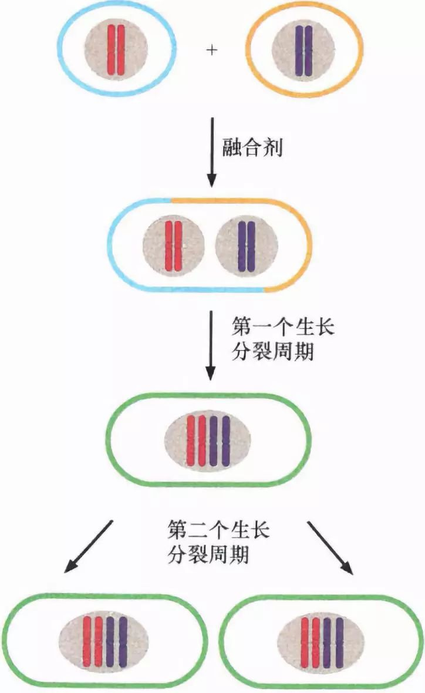

图7-1-1： 实验性的细胞融合

携带多个细胞核的细胞通常无法存活，而双核细胞却往往可以存活并继续生长。当进入有丝分裂期，两个核膜破裂，两对染色体进入有丝分裂期，最终产生的每个子代细胞会形成一个单独的细胞核，这个细胞核内含有来源于两个亲本细胞的染色体 。

利用 细胞融合技术 可以获得来源于不同物种的杂交细胞，甚至包括人鸡细胞的杂合体。将 G 1 期细胞与 M期细胞融合，可以观察哪个细胞周期起决定性作用。将未分化的细胞与分化细胞融合，以确定哪种细胞表型起决定性作用。

然而，我们只关注 **正常细胞与肿瘤细胞的杂合体细胞将如何生长** **：** 大量实验证据表明，当肿瘤细胞与正常细胞融合后，将产生的四倍体或亚四倍体杂交细胞注射入合适的宿主动物体内，发现这些细胞将失去肿瘤形成能力。这个出乎意料的结果使肿瘤与正常细胞表型的理论得到了补充和完善： **非肿瘤病毒来源的肿瘤细胞与正常细胞融合后，其恶性表型是隐性的。**

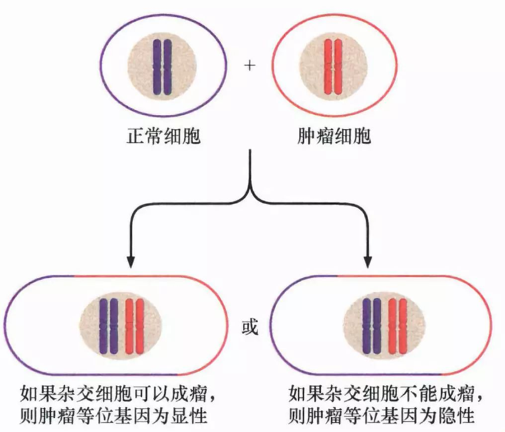

图7-1-2： 肿瘤遗传表型的显隐性：细胞触合技术检验肿瘤细胞表型的显隐性，理论上有两种结果

2 、 肿瘤细胞隐性表型特性的遗传学解释

我们可以这样假设： **正常细胞携带可以限制或抑制其增殖的基因** 。在肿瘤发展过程中，不断发展的肿瘤细胞丢失或失活了一个或多个这样的基因。一旦这些生长抑制基因丢失或失活，肿瘤细胞就会不再受这些生长抑制基因的调控而加速增殖。然而，当肿瘤细胞与正常细胞融合后，这些完整的野生型生长抑制基因将发挥作用，使肿瘤细胞的增殖至少是其肿瘤形成能力停止。 **由于这些基因的野生型能够拮抗肿瘤细胞表型，因此被命名为抑癌基因（ TSG）** 。

抑癌基因的存在一直饱受争议。

支持该观点的证据显示， **通过一系列突变使基因失活要比通过突变使其激活容易得多** 。例如，只有 ras原癌基因的第12位、13位和61位密码子的点突变才可以使其激活。而对于一个抑癌基因或者对其他任何基因而言，其蛋白编码区很多位点的点突变，或这些基因序列中的核酸片段随机缺失都可以使该蛋白失活。

反对抑癌基因存在的理论认为，如果抑癌基因突变失活能够促进肿瘤细胞的生长，但由于这些等位基因是隐性的，那么理论上一个等位基因的失活对肿瘤细胞应该没有任何影响，因为隐性突变的等位基因与显性野生型的等位基因共存。 **只有当肿瘤细胞中某特定抑癌基因的一对野生型等位基因同时失活后，此细胞才能持续增殖** 。两次独立的遗传学改变发生在同一对等位基因上，是一个极其繁杂的过程，在肿瘤形成时间内要使抑癌基因的两个等位基因都失活几乎是不可能的。

3、 视网膜母细胞瘤解决抑癌基因的遗传学困惑

视网膜母细胞瘤是一种儿童眼部肿瘤，来源于光受体细胞的前体细胞，在出生至 6 - 8 岁的儿童中高发，在这个年龄段之后则较为罕见。这类肿瘤症候群表现为两种形式：

没有视网膜母细胞瘤家族史的孩子表现为单侧眼的单发肿瘤（单侧视网膜母细胞瘤），如果通过放疗或手术将肿瘤从患眼摘除，患儿视网膜母细胞瘤的复发风险或身体其他部位肿瘤的发病风险并不增高。对于这种没有家族史的患儿，我们通常将其认为是散发病例。

患有家族性视网膜母细胞瘤的儿童，一般表现为双侧多发（双侧视网膜母细胞瘤）。这些患儿在经手术或放疗治愈后，其青春期罹患骨肉瘤的概率比正常儿童高出 500倍，并且在成年后身体其他部位的肿瘤易感性也明显增高。这些肿瘤患儿如果能够存活至成年期则通常具有正常的生育能力，但他们的后代中有一半的孩子将患有家族性视网膜母细胞瘤。

图7-1-3： 遗传性视网膜母细胞瘤患者的家系谱：男性（方形）、女性（圆圈）、患者（绿色）、非患者（空白）。在家系谱中有一支出现了隔代遗传（箭头），代表了不完全外显，即该基因型未产生相应的表型，其可能的原因与复杂的生物学效应影响最终表型有关。值得一提的是，箭头所指男性一定是该等位基因的携带者，因为他的两个女儿均罹患此病。

家族性视网膜母细胞瘤符合孟德尔遗传定律中的等位基因显性遗传病的特点。实际上，家族性遗传的视网膜母细胞瘤与散发性病例并无不同。通过对儿童期家族性或散发性视网膜母细胞瘤的发病动力学的研究， Alfred Knudson在1971年提出， **家族性肿瘤的外显率与单随机事件的发生概率一致，而散发性肿瘤的发病率则与双随机事件发生概率类似** 。

上述发病动力学提示我们可能存在一个基因（后来的研究发现并证实其为 Rb基因），其突变可以引起视网膜母细胞瘤。如果Rb基因突变以后所产生的致瘤性是隐性的，那么需要两个Rb等位基因同时被敲除才会使视网膜细胞发生不可控增殖，产生视网膜母细胞瘤。

从父母基因组遗传获得野生型 Rb基因的儿童，其视网膜母细胞瘤的形成需要视网膜细胞相继发生两 次 体细胞突变 ，才能 使原有的两个功能性 Rb等位基因均失活。而具有视网膜母细胞瘤家族史的儿童以受精卵种系遗传的方式，从父母获得一个突变的Rb等位基因， 且 该突变的 Rb基因存在于包括视网膜细胞在内的所有胚胎细胞中。这些视网膜细胞中只要有任意一个细胞发生一次体细胞突变就能使仅存的野生型等位基因也失活，使这个细胞内不再有任何功能性的Rb基因，从而最终进展为视网膜母细胞瘤。

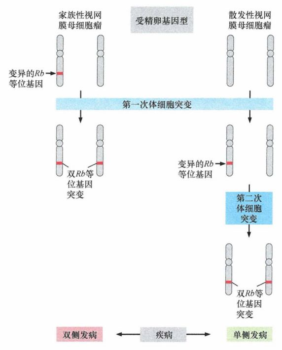

图7-1-4： 视网膜母细胞瘤形成动力学

4、 肿瘤的起始需要清除抑癌基因的所有野生型拷贝

Rb基因的发现强调：只有这个基因的两个拷贝都被消除才能诱发肿瘤。但与此同时又引发了另外一个问题：在同一个细胞中连续发生两次突变的概率大约为1 0 -12 ，发育中的视网膜只存在约 10 6 个细胞，从理论上讲，想要通过这样两次连续的突变清除掉一个抑癌基因的两个拷贝几乎是不可能的，那么这些细胞是如何先后清除掉自身抑癌基因的两个拷贝而最终发展成为散发性视网膜母细胞瘤 的 呢？

一些遗传学家提出了合理的解释：当两个 Rb等位基因中的一个由于某种类型的突变而失活时，其发生的频率与大多数突变事件相同，即约为10 -6 。发生这种突变的细胞将成为一个杂合子，且该杂合子细胞继续表现为野生型。但是当 **另外一个野生型 Rb等位基因的失活并不是直接由第二次打击导致的突变所引起** 的时，会发生哪些情况呢？

**01.有丝分裂重组 ：** 与携带野生型 Rb等位基因的同源染色体在配对时交换部分遗传信息。正常情况下，绝大多数染色体重组发生在减数分裂期。但如果重组恰好发生在一条携带有野生型Rb等位基因的染色体臂和一条携带有突变型Rb等位基因的染色体臂进行配对时，携带野生型Rb等位基因的染色体臂可能与其配对的、携带突变型 Rb 基因的同源染色体臂发生互换。

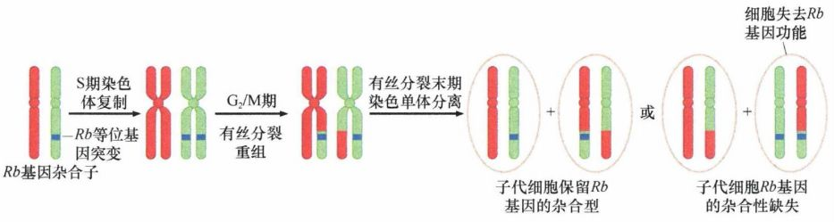

图7-1-5： 有丝分裂重组能够导致Rb基因的突变杂合性缺失(LOH)

这种重组方式的重要意义在于，其发生率为 10 -5 -10 -4 /细胞代，与上面提到的发生率为l0 -6 /细胞代的突变失活相比，更容易使细胞失去野生型的Rb基因拷贝。

**02.** **基因转换** ：在染色体DNA的复制过程中，延伸的DNA子链可以暂时脱离原有的模板链而与同源染色体中另外一条互补的DNA母链杂交，并以这条互补链为模板，继续复制直到它重新回归到原有的模板链（这种机制又被称为复制选择）。如果这种基因转换复制正好发生在已失活的Rb基因所在的染色体区，那么子代DNA链的Rb基因就会发生杂合性缺失。这种基因转换的发生频率在每代细胞复制过程中甚至要高于有丝分裂重组。

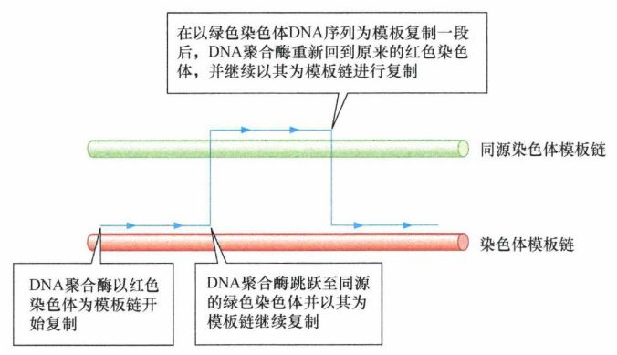

图7-1-6：基因转换

**03. 染 色体不分离** ：在多种肿瘤中，有丝分裂过程中染色体的分离不当引起染色体整条丢失。在子代细胞内，染色体不分离所产生的 3条染色体中的一条将被随机丢失，从而导致携带两个同型基因拷贝的染色体被最终保留下来。

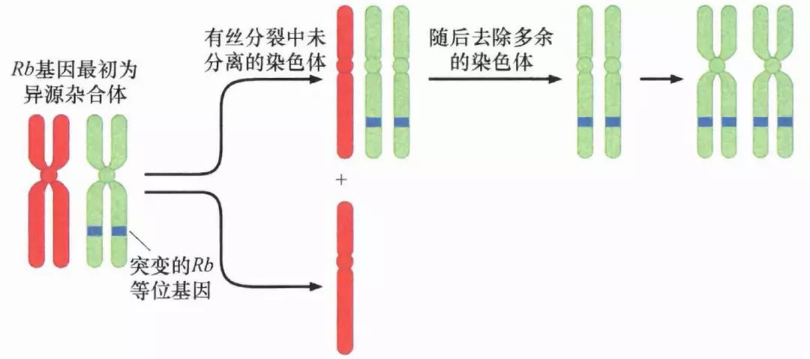

图7-1-7： 染色体不分离与杂合性缺失

# 第七章_2_《癌生物学》第七章（2）__抑癌基因的发现与探索

“通过上一讲，我们知道： 杂合性缺失的发生频率远高于基因突变的发生频率，这就意味着 野生型 Rb基因的丢失可能更多地依赖于杂合性缺失，而不是通过直接的基因突变。 普遍认为，大多数视网膜母细胞瘤细胞都会在 13号染色体Rb基因及其附近的区域（13号染色体长臂l区4带（13q14)）存在杂合性缺失，而不是在这一位置发现由两次独立的事件所产生的、两个突变位点不同的Rb等位基因。”

图 7-2-1 ： Rb位点杂合性缺失的实证：五核苷酸序列最初表现为异源杂合子的形式（上方），但在经历了导致Rb基因发生杂合性缺失的过程之后也同样呈现出杂合性缺失的形式

1、 通过杂合性缺失寻找抑癌基因

癌基因经常在逆转录病毒的基因组中被发现，可以通过转染实验来验证它们的克隆形成能力，或者通过检测它们是否存在于肿瘤染色体的扩增区域来鉴定。与之形成鲜明对比的抑癌基因，只有当它们从基因组上丢失时才能体现自身价值的基因，我们该如何发现它们呢？

在肿瘤形成过程中， 抑癌基因倾向于在邻近的染色体区域发生杂合性缺失 ，这为肿瘤研究人员提供了一种新的遗传学方法来寻找它们： **通过在特定类型肿瘤发生过程中总是发生杂合性缺失的无名遗传标志物附近寻找，有可能会发现尚未被克隆的抑癌基因** 。

在一部分个体当中， 某 DNA片段能够被限制性内切酶剪切；而在其他个体中，同样的DNA片段由于在限制性内切酶识别位点单个碱基的替换而无法被切割。类似于这样的遗传可变性在人类基因库中是由正常的遗传变异引起的，这些位点代表了遗传标志物的多态性。鉴于这些序列存在着可被内切酶剪切和不可被剪切两种不同的结果，我们将其称为 **限制性（内切酶）片段长度多态性 (RFLP)** 。

图7-2-2： 限制性片段长度多态性(RFLP)：母源（红色）DNA片段可以被EcoR I酶切割，而其同源的父源（绿色）片段由于单核甘酸的替换而无法切割。使用一个能识别父源片段右侧末端的放射性探针，通过Southern杂交分析能够确定剪切是否发生。本例中，两例肿瘤患者的正常组织DNA在该染色体区域均呈杂合性。然而，在他们的肿瘤DNA中发生了杂合性缺失。

肿瘤遗传学家通常利用 RFLP来判断在某种肿瘤的发生过程中染色体不同区域是否频繁地发生了LOH。下图显示了用RFLP技术在一组结直肠肿瘤中寻找LOH的结果。大部分染色体的长臂和短臂都用了至少一个RFLP标志物来标记，以便研究整条染色体的变化。值得注意的是，在人类的多种肿瘤中发现17号染色体的短臂(p)和18号染色体的长臂(q)均存在异乎寻常的高LOH发生率，这两条染色体臂的缺失率均远高于肿瘤细胞中平均15%~20%的染色体LOH发生率。

图7-2-3： 肿瘤抑癌基因定位：染色体长臂和短臂分别以绿色和橘色条状图表示。纵坐标显示的”等位缺失”即LOH。（由于当时只有极少数的探针可用于检测染色体层面的LOH, 因此该分析对于关键性的抑癌基因的定位并不精确）

这一事实为这两条染色体臂中发生 LOH的区域还存在其他尚未明确的抑癌基因提供了有力证据。因此， **遗传学定位** 为那些在基因组中寻找与结直肠肿瘤发展密切相关的抑癌基因的基因克隆学家提供了明确的指示线索。

2、抑癌基因突变遗传能解释多种家族性肿瘤

和 Rb基因一样，大多数已经被克隆的抑癌基因都与家族性和散发性肿瘤的发生有关。一般而言，遗传了上述有缺陷的基因拷贝都能极大地增加罹患某种特定类型肿瘤的风险，而该类型的肿瘤在正常人群中则通常比较罕见。在某些患者中，如果突变发生在胚系等位基因中，将会导致对多种类肿瘤易感。

表 7-2-1：部分已被克隆的人类肿瘤抑癌基因 （ TSG）

当遗传了一个突变的 TSG等位基因时可能会增加罹患肿瘤的风险，但反之则不然：并不是所有的家族性肿瘤综合征都存在遗传性的TSG等位基因。由于肿瘤的发生取决于个体体细胞基因组的累积突变，因此减少体细胞基因如这些维持基因组稳定性的基因的突变频率具有高效的抑癌功能。相反，基因组的不稳定性会增加基因的突变率，从而使罹患肿瘤的风险大幅度增加。

因此，人们认识到体内存在着两类不同的家族性肿瘤基因 ： 本 章 讨论的 **抑癌基因** 及将在第 12章介绍的 **基因组稳定维持基因** 。 抑癌基因是通过影响细胞的增殖、分化或死亡来直接调控细胞生物学行为的，有时也被称为 **看门基因** （ gatekeeper gene ),以表明它们在决定细胞是否进入生长和分裂周期过程中所起到的关键作用。 基因组 维持基因则只通过调控细胞内基因突变累积的速率来间接地影响细胞的生物学行为 ， 又 称 为 **看护基** **因** （ caretaker gene )。

3 、 启动子甲基化是抑癌基因失活的一种重要机制

在哺乳动物类细胞中，当鸟嘌呤 5'端的胞嘧啶（CpG序列）甲基化发生在启动子附近时，它能够引起相应基因的转录抑制。大量研究显示：基因组DNA的CpG修饰是导致抑癌基因沉默的重要途径之一。

在一些肿瘤的形成过程中，经常会发现肿瘤细胞整个基因组的甲基化水平逐渐降低，这种 “ **广泛甲基化不足** ”有可能与DNA上那些不具有特定生物学功能的、高度重复序列所携带的甲基化基团丢失有关。

与此同时，在肿瘤细胞基因组中存在另一类富含 CpG的DNA区域，即通常位于启动子区的" **CpG岛** ”，常发生异常高甲基化，从而抑制该基因的转录，导致原本应该转录激活的基因被沉默。

实际上，近年来越来越多的证据显示，比起体细胞突变，启动子区甲基化在沉默抑癌基因方面发挥养更重要的作用。通过胚系突变可引发家族性肿瘤综合征的抑癌基因中有超过半数被发现在散发性的肿瘤中经由启动子区甲基化而沉默。例如，当 Rb抑癌基因发生胚系突变时将导致家族性的视网膜母细胞瘤。而在散发性视网膜母细胞瘤中，则是由体细胞突变或启动子区甲基化导致该抑癌基因的失活。此外，其余一系列被确认或推测与抑制肿瘤形成相关的基因，其启动子区也被发现处于甲基化的状态。

表 7-2-2：人类肿瘤细胞基因组中高甲基化基因

原则上，启动子甲基化可以通过两种方式灭活抑癌基因的功能。其中之一是使一个抑癌基因的两个拷贝分别被甲基化。另外一种则是当其中一个拷贝发生甲基化以后，另一个拷贝通过复制该甲基化拷贝所导致的 LOH而丢失，结果造成甲基化拷贝复制。实际上，第二种机制的发生频率更高。例如，在对吸烟者、曾吸烟者和从未吸烟者的肺组织中 p 1 6 I NK 4 A 抑癌基因的甲基化研究发现，该基因在 44%的吸烟者和曾吸烟者（表面上正常）的支气管上皮细胞中发生了甲基化；而作为对照的那些从未吸烟的人群的细胞中则没有发生任何甲基化。这一染色体区域的LOH在两种吸烟人群中的比例为 71% - 73%, 而在从未吸烟人群中则只1.5% - 1.7% 。

该研究也给了我们其他一些启示：调控生长的关键性基因的甲基化通常发生在肿瘤形成这一繁杂过程的早期，甚至远早于组织学上的形态改变。这些表面正常的细胞群体将为最终的癌前病变和恶性生长提供肥沃的土壤。

图7-2-4： 肿瘤细胞基因组中12个已知发挥抑癌作用基因的甲基化

维甲酸的作用很好地说明了启动子甲基化的细胞生理学结果。在上皮细胞中，维甲酸是一种潜在的细胞周期阻滞剂，甚至是细胞分化诱导剂，它能阻断乳腺癌细胞的进一步增殖。然而，大多数肿瘤细胞中负责编码关键性维甲酸受体蛋白的 RARβ2基因由于启动子甲基化而沉默。该受体的表达缺失时将导致乳腺癌细胞对维甲酸治疗无反应，从而摆脱了生长阻滞，并产生相应的耐药性。

# 第七章_3_《癌生物学》第七章（3）_抑癌基因的作用实例

“由前所知，抑癌基因可抑制肿瘤的进展，这些基因及其编蛋白唯一的共同特点是它们能够降低肿瘤的发生风险。那它们是如何发挥抑癌作用的呢？ 一些抑癌基因的功能是通过对一系列生长抑制和分化诱导信号的应答来自接抑制细胞增殖；另一些抑癌基因作为细胞周期调控组分的基因，则是通过代谢失衡和基因组损伤反应来抑制增殖。”

1、Rb基因与p53基因的抑癌作用

最先被研究的比较透彻的两个抑癌基因分别是 Rb基因和p53基因（又被命名为Trp53或TP53)，它们是人类肿瘤发生过程中起主要作用的两个抑癌基因。Rb基因编的蛋白质主要调控细胞的生长和分裂周期，而在人类大部分甚全可以说在几乎所有的肿瘤中，Rb信号通路对生长的调控机制都被阻断了。p53基因及其产物在肿瘤进展中也扮演着同等重要的角色。鉴于它们的中枢性功能，我们将在第8章和第9章详细讨论 ，敬请期待！

2、 NF1 蛋白抑制 Ras 信号

神经纤维瘤病在 1862年被首次报道，I型神经纤维瘤是一种较为常见的家族性肿瘤综合征，全球的平均发病率为1/3500。神经纤维瘤患者常表现有其他细胞类型的异常，其中包括：咖啡牛奶斑，以皮肤内显著的色素沉着为主要症状；皮肤和长骨细胞形态学上的细微改变；认知障碍；被称为"Lisch小体”的虹膜良性病变。这些症状的出现与否主要受患者遗传背景的影响（即个体基因组中所遗传到的其他等位基因的怕况），即便同胞兄弟姐妹遗传了NF1基因的同一个突变体，通常也表现为不同症状。

NF1基因于1990年被克隆，NF1基因的遗传学行为与Rb基因非常类似。因此，突变失活的NF1等位基因也可以通过胚系传递，产生显性表型。在细胞水平上，该基因（NF1 +/- ）最初的杂合子形式通过杂合性缺失的方式，转变成肿瘤细胞中的纯合子 (NF1 -/- )。近半数的神经纤维瘤患者没有家族史，表明他们携带的这个突变拷贝是由胚系新发突变所导致的。

通过对已克隆的 NF1基因测序，我们获知了其编蛋白——神经纤维瘤蛋白的功能：它与酵母类的两种蛋白IRA1和IRA2存在广泛的序列相似性，这两种蛋白是酵母Ras的GTP酶激活蛋白(GAP),即类似于哺乳动物的Ras-GAP蛋白。和大多数真核生物一样，酵母细胞利用Ras蛋白调控它们的代谢和增殖。通过对酵母遗传学的详细分析发现，Ras蛋白的激活受到IRA蛋白的拮抗。诱导Ras激活其内在的GTP酶活性后，IRA迫使Ras从激活的GTP结合形式转变为失活的GDP结合形式；哺乳动物的Ras-GAP蛋白精确地执行了同样的功能。实际上，在Ras激活它的下游效应因子之前，一个Ras-GAP可能就已经潜伏在它的旁边了。

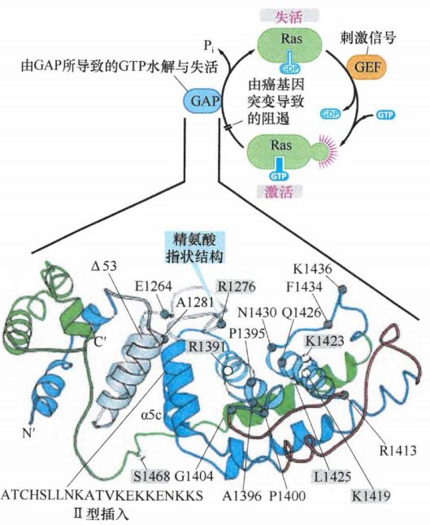

图7-3-1： NF1和Ras信号周期：NF1的精氨酸指状结构携带了一个关键的精氨酸（RJ276），它能插入到Ras的GTP酶的裂隙中，从而激活Ras，将GTP水解成GDP。（突变引起NFl精氨酸指状结构内精氨酸残基被其他氨基酸残基所取代，从而导致NFI对Ras的GTP酶的促进活性下降1000倍）

NF1在机体中广泛表达，一旦细胞受到生长因子的刺激，为使Ras信号传递不受NF1的干扰，它们可能降解NF1。然而60-90min后，NF1的表达将恢复至正常水平，而且集聚的NF1蛋白将关闭更多的Ras信号。如果神经外胚层和髓系细胞中缺失NF1的功能，那么Ras蛋白将长期维持激活的GTP结合状态。实际上，在遗传学背累为 Nf1 -/- 的细胞中， GTP结合的激活和Ras基础水平就明显高于正常细胞，并且在生长因子的刺激下能够迅速升高。其结果是，细胞中NF1功能的失活类似于由突变的ras癌基因所产生的高活性Ras蛋白功能。

3、 Apc促进结直肠隐窝细胞外迁

绝大多数结直肠癌为散发性，但有一小部分是由于遗传了具有终生患病风险的等位基因。对于理解遗传性结肠癌综合征最好的例子是结肠腺瘤性息肉，其通常被称为家族性腺瘤性息肉综合征（ FAP），是一种能在结肠中形成腺瘤状息肉的遗传疾病。

结直肠中干细胞后代中的一部分仍然位于小肠隐窝的底部，目的是维持恒定数量的干细胞，而大部分细胞则向隐窝外延伸，并向上皮的肠道表皮层分布，在那里形成肠道的上皮层，并逐渐凋亡和脱落。这是一种对结直肠癌发生高度有效的防御机制，即几乎所有发生了突变的细胞由于仍然承担着保护肠壁的责任，它们注定会在形成肠壁表层之后的几天内死亡。按此逻辑，唯一可以导致肿瘤后续发展的突变形式（及突变的等位基因）就是那些能够同时阻断结肠表皮细胞从隐窝处向外迁移及随后细胞死亡的突变。如果一个结肠上皮细胞获得了这样一种突变，该细胞及其后代就能够在隐窝处聚集，而且其子代获得的其他任何等位基因突变都积累在隐窝处，这就可能赋予了推动子代细胞向肿瘤进展的潜力。

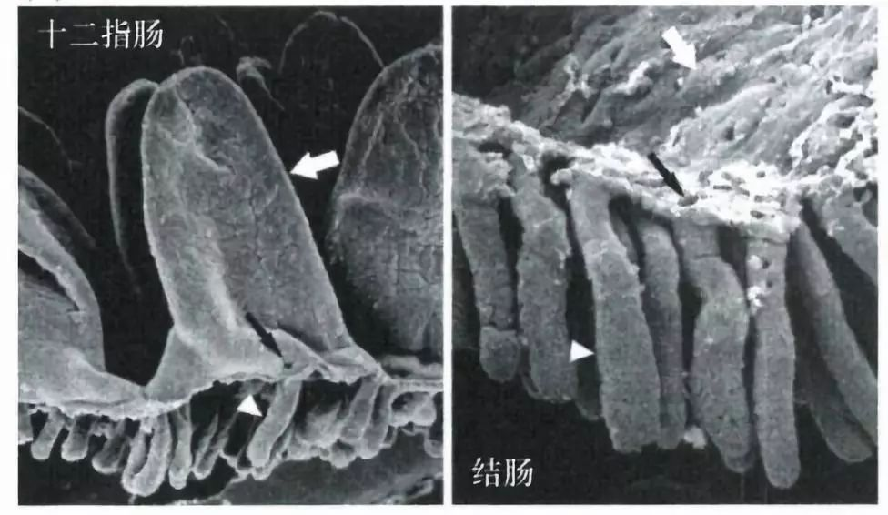

图7-3-2：十二指肠于结肠结构：扫描电镜图示小肠和大肠的组织结构很类似，都存在含有干细胞（白色箭头）的深部隐窝及新生肠上皮细胞由菲底部向肠道表面迁移（上）、分化、并经细小开口出现于肠腔表面（细黑色箭头）。在十二指肠内，新生的细胞继续沿着突出于肠腔的指状绒毛边缘向上迁移（宽白箭头），结肠中不含有指状绒毛。但在这两节肠段中，上述细胞将于几天后脱落。

β-catenin是调控肠上皮细胞从结肠隐窝向外迁移的主要调控因子，当Wnt与细胞表面受体结合后，β-catenin可逃避被降解，并在细胞质内聚，随后迁移至细胞核中，在那里与一组被称为Tcf或Lef的DNA结合蛋白复合体相结合。二者形成的异源二聚体还可以继续招募其他核蛋白形成高价的多蛋白复合体，该复合体能够修饰染色体，并激活一系列与干细胞表型相关的靶基因表达（以肠上皮细胞为例）。（详见第6章）

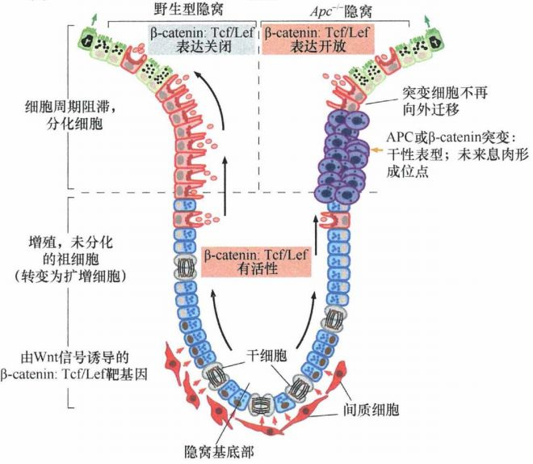

图 7-3-3 ： β-catenin 与结肠隐窝的生物学意义

APC负责 负性调控细胞内 β-catenin的水 平。在正常隐窝底部的肠上皮细胞中， APC基因基本不表达，从而使β-catenin能在胞浆内聚并转运至核内。然而，当细胞开始向上迁移出肠隐窝时，APC在这些细胞中的表达水平大幅度增加。APC能与β-catenin结合，其与两个支架蛋白Axin和Conductin形成了一个包括糖原合成酶-3P（GSK-3P)和β-catenin在内的多蛋白复合体。通过彼此之间的相互结合，GSK-3P可以使β-catenin蛋白中的4个氨基酸残基磷酸化，这种磷酸化导致β-catenin由泛素化－蛋白酶体途径被降解。伴随基质细胞分泌Wnt信号因子的减少，细胞内β-catenin的水平及核内β-catenin/Tcf转录因子复合体的形成量都将逐渐降低。

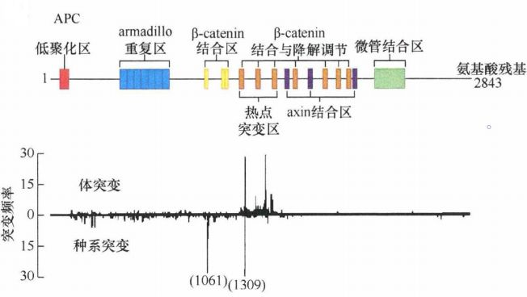

图 7-3-4 ： APC蛋白的多结构域模式团（上）及其突变位点（下）

因此当 APC缺失时，β-catenin将在在肠黏膜细胞的前体细胞中大量聚积，导致大量处于相对未分化状态的细胞在结肠隐窝处聚集,并最终进展为腺瘤状息肉。β-catenin蛋白聚积是APC失活所导致的最重要的后果，这一现象可以在约90%的散发性结肠癌患者中发现。

近期的研究还发现 APC丢失所引起的一个意外后果：APC参与了有丝分裂过程中形成纺锤体的微管和部分细胞骨架的调节。缺乏APC功能的细胞具有明显的染色体不稳定性(CIN),这将引起有丝分裂过程中染色体的不恰当分离，从而导致染色体数目发生变化。一些APC阴性的细胞中染色体数目甚至可以翻倍，从而使对促进和抑制生长起至关重要作用的基因发生拷贝数的改变。这一改变又会加速癌前病变细胞获得更多基因型及相关表型的突变来促使肿瘤发生。此外，APC还通过参与胞浆突触的形成和参与细胞运动的调节；缺失这些突触的细胞其运动能力将被显著削弱。这也进一步解释了为什么APC突变的肠上皮前体细胞无法迁移出结肠隐窝。

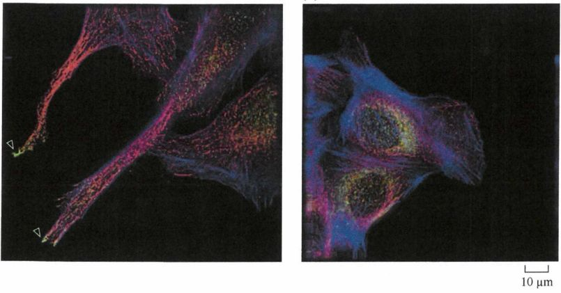

图7-3-5： APC与细胞骨架：当APC存在时（左），细胞分化出大量突触，微管（红色）是这些突触的核心结构，这些突触对于细胞的运动非常关键。当通过siRNA实验抑制APC表达后（右），突触与微管消失，细胞的运动能力明显削弱。

4、 pVHL 调节缺氧反应

von Hippel-Lindau综合征是一种可以发生多种肿瘤的遗传性疾病，包括肾透明细胞癌、嗜铭细胞瘤（肾上腺细胞来源）和中枢神经系统及视网膜的成血管细胞瘤（血管瘤），几乎所有患者都存在VHL抑癌基因的胚系突变。

VHL也存在杂合性丢失，从而导致在VHL -/- 基因型患者的肿瘤细胞中仅遗传了一个胚系变异的 VHL等位基因。VHL基因的失活发生在大部分散发性（即非家族性）肾癌患者中，在这些患者中该基因的失活通常是由该基因启动子区甲基化引起的转录沉默所导致的。VHL基因产物pVHL的主要功能是促进一个关键性转录因子——低氧诱导因子(HIF-2)的结构破坏。（ 注意： HIF-2在肾癌进展过程中发挥的作用远大于HIF-1和HIF-3，但我们讨论的内容都来源于对HIF-1的研究 ）

功能性的 HIF-1转录因子由两个必要的亚基(HIF-1α和HIF-1β)组成。在正常氧含量下，pVHL能够促进HIF-1α亚单位的降解，从而使HIF-1在细胞内以非常不稳定的形式存在，并维持失活状态。这种蛋白质合成之后就被迅速降解的过程称为“无效循环”。但当细胞处于低氧（异常氧含量）环境时，这种特殊循环将被打破。在此条件下，HIF-1将不再被降解，其半衰期和浓度都将增加10倍以上。功能性HIF-1转录因子复合体的形成导致了一系列靶基因的表达，而这些靶基因的产物都与血管形成、红细胞生成、糖酵解及葡萄糖转运至细胞内有关。

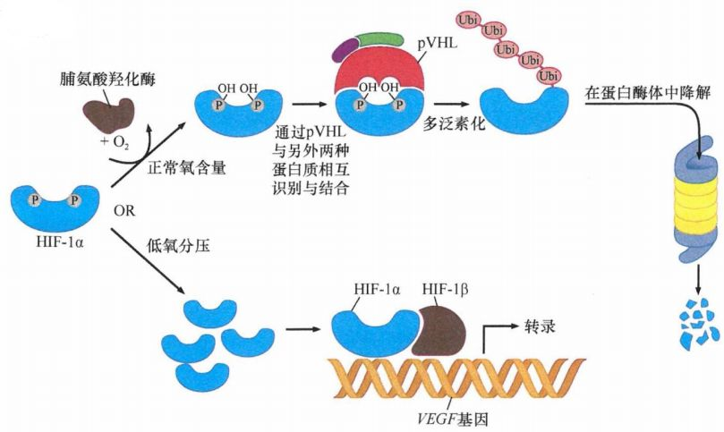

图7-3-6：HIF-1生理功能：正常的氧分压下（上），HIF-1α( 蓝色）高效合成的同时能被迅速降解。在缺氧条件下（下），脯氨酸胫化酶不能使HIF-1α的两个脯氨酸残基被氧化，HIF-1α得以逃避被泛素化并迅速累积，与HIF-1β结合形成稳定的二聚体，作为一个转录因子促进很多重要基因的表达。

pVHL在细胞内通常与其他蛋白质共同形成一个复合体，在这个多蛋白复合体中，pVHL负责识别和结合HIF-1α,并募集其他蛋白质复合体,使它们尽量接近HIF-1α以便对它进行泛素化。只有当HIF-1α两个脯氨酸残基中的一个被氧化成羟脯氨酸时，pVHL才能与HIF-1α结合；当缺乏羟脯氨酸时，HIF-1α失去被结合的能力并能逃避被降解。HIF-1α中的脯氨酸可以被一种其活性依赖于氧含量的酶转化成胫脯氨酸。一旦HIF-1α中的脯氨酸被胫基化，它就可以插入到pVHL的疏水核心的间隙中，从而结合pVHL并触发降解过程，进而阻断其所诱发的基因转录。

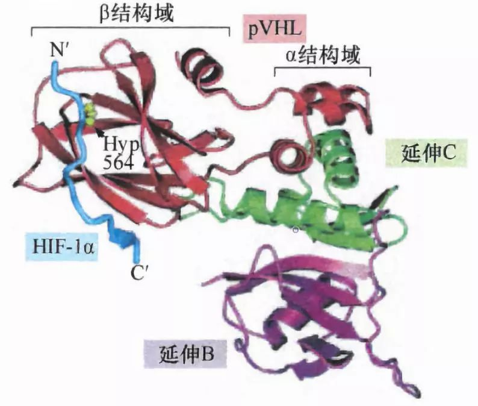

图7-3-7：HIF-1α蛋白中第一个脯氨酸被氧化后的部分连续剖面图：该位点（564 位的 Hyp,

浅绿色球形）的氧化能够使HIF-1α(亮蓝色）中的一个结构域与由pVHL(红色）、延伸B（紫色）及延伸C（绿色）蛋白组成的三聚复合体相结合，从而诱导HIF-1α泛素化，并导致其被蛋白酶体迅速降解

缺氧诱导的 HIF功能激活可以与另外一个非氧依赖性机制协同作用：在多种肿瘤细胞中存在PI3K的激活所伴随的Akt/PKB功能上调，其随后可以通过mTORC1激酶促进HIF-1αmRNA的转录和翻译（详见第16章）。而HIF的激活可以导致细胞由正常的能量代谢转变为有氧糖酵解，这就是Warburg效应的产生机制。

在多种肿瘤中 VHL等位基因突变将导致pVHL蛋白在癌细胞中的表达缺失。而在其他一些肿瘤中，较轻微的改变将会引起pVHL的失活，而不是影响其表达水平。例如，点突变可能影响pVHL识别和结合HIF-1α,羟化脯氨酸疏水性口袋中的氨基酸残基。通过其他的一些机制也可引起HIF-1α转录因子的激活从而驱动一系列生长促进基因的表达，包括VEGF、PDGF和TGF-α,此过程使多种具有相应受体的细胞增殖，从而最终导致某种肿瘤发生。

然而，上述有关 pVHL作用的描述仍然不能解释其功能失调所引起的所有表型。可以明确的是，pVHL具有与HIF-1α降解无关的其他功能。例如，pVHL失活的细胞不能正确组装细胞外基质中的纤维连接蛋白，并且有确切的报道称pVHL可以结合细胞内的纤维连接蛋白。此外，pVHL还在很大程度上与胞浆微管蛋白的稳定性密切相关。还发现VHL能够影响p53抑癌蛋白的激活及其所介导的凋亡过程（详见第9章），参与调节NF-KB信号及上皮－间质转化（详见第14章）。这些不同的功能表明pVHL抑癌蛋白与APC一样，在进化过程中被指定参与调控多种不同的细胞生物学功能。

# 第八章_1_《癌生物学》第八章（1）细胞周期控制时钟

 
前言：经过前几章的学习，相信我们的小伙伴已经认识到，做人不容易，作为一个小小的细胞也是“鸭梨山大”呀！面对这错综复杂的信号和通路，每天都是批不完的“公文”！那么细胞是不是也像人一样，有个像“大脑”一样的“总司令”呢？答案是有的！它就是我们这一章节的主角—— **“ 细胞周期控制时钟 ”** ！
 

 
功能各异的信号可以被细胞表面受体收集并传递给细胞质中复杂的信号处理通路，这些混杂的信号必须以某种方式处理、整合，最终形成简单的、二元的 命令，如决定细胞是继续增殖还是保持休眠，或者决定静止细胞是否进行分化。这些生物学行为提示，在细内部存在一些中央行动调节器——一种专门的信号交换所，接收各种输入信号并做出重要的指令从而决定相关细胞的命运。目前这些重要的调节器已经鉴定，它们在细胞核中发挥细胞周期时钟的作用。当然，这个 “时钟”并不能用来计算时间，这些细胞周期时钟是一些相互作用的蛋白质网络，它们接收胞内和胞外的各种不同来源的信号，对其进行整合后决定细胞的命运。
  
图1：细胞周期时钟
 
**No.1**
 
**细胞周期**
 
一个经过细胞分裂新近生成的子代细胞， 必须马上决定是否进入下一个新的生长-分裂周期，或者退回到非生长状态，即G 0 期。要维持在活跃的生长-分裂周期中，需要这些细胞即刻开始准备进入下一次分裂。这些准备必须包括细胞内大分子成分的复制，以确保下次分裂形成的两个子代细胞能够获得相等的成分。这种细胞成分的累积导致细胞体积增加的过程，为细胞的生长过程。而细胞的分裂过程是指通过有丝分裂和胞质分裂，一个亲本细胞形成两个子代细胞的过程。
 
在大多数哺乳动物细胞中，RNA 与蛋白质的累积在细胞分裂之后立即开始并且持续整个细胞分裂周期。与之不同的是，在细胞有丝分裂和胞质分裂形成子代细胞之后的几小时内才开始 DNA 复制 (12~15h) 。这个子代细胞形成与 DNA 开始复制的间隙被命名为细胞周期的G 1 期（第一个间隙）。在这一时期里，细胞要做出继续生长还是维持静止的决定；对于静止细胞，则要决定细胞是否开始分化。G 1 期后的DNA合成通常要6~8h, 这一DNA合成期被称为S期。随后，大多数哺乳动物细胞在进入M期之前都有一个3~5h的延迟，这是细胞周期中的第二个间隙，称为G 2 期，细胞为进入M期和细胞分裂做准备。M期的完成通常大约需要1h, 包括4个独立的亚期：前期、中期、后期、末期，并最终完成胞质分裂，形成两个新的子代细胞。
  
图2：细胞周期

细胞周期中每一步的执行都有可能发生故障，而细胞周期对细胞的重要作用要求细胞周期的每一步都准确无误。因此，细胞还需要具有一系列的监控机制来监督细胞周期的每一步，保证在上一步成功完成之后细胞周期才能进入下一步。如果细胞周期中特定的步骤发生错误，监控机制就会马上中止细胞周期的进程，直到这个错误被修正。还有的监控机制用于确保某些特定的步骤在一个细胞周期中完成后就不再重复，直到细胞进入下一个细胞周期，这些监控机制被命名为检验点(checkpoint) 或检验点调控 (checkpoint control)。
 
细胞周期中的检验点举例如下：
 
①细胞在完成G 1 期各步骤之前不能进入S期；
 
②所有染色体DNA复制完成之前细胞将被阻滞进入G 2 期；
 
③中期的有丝分裂纺锤体与所有染色体正确组装之前，细胞将不能进入有丝分裂后期（成对的姐妹染色单体分离）；
 
④如果细胞的DNA受损而没有被修复，细胞将不能进入S期或M期；
 
⑤在G 2 晚期，解链监测点能阻止细胞进入M期，直到前面S期复制的DNA完成解螺旋。
 
**No.2**
 
**G 1 期特定时相决定细胞生长/维持静止**

机体内几乎所有正常细胞都需要外部信号的调控，如细胞在生长和分裂前都需要促有丝分裂生长因子转化的信号剌激。唯一例外的例子是非常早期的胚胎细胞，它们能够不接受特异的生长刺激而持续增殖。
 
细胞受控于其周围的胞外环境以及活跃细胞周期的特定时间窗内的生长调控信号，具体来说， **活跃细胞周期的特定时间窗内是指从G** **1** **期开始直至G** **1** **/S期转换前的1h或2h。** 如果在G 1 期完成的80%~90%以前撤除培养细胞的血清和生长因子，这些细胞将不能继续完成剩余的细胞周期，它们将极有可能返回到G 0 期的状态；然而，一旦细胞度过了G 1 期的生长决定时限进入G 1 期的最后几小时(G 1 期最后的10%~20%), 再撤除培养血清将不能影响它们的生长进程，它们将完成剩下的G 1 期并最终通过S期、G 2 期、M期。同样，有丝分裂抑制因子，如 TGF-β，也只能在G1期的早期和中期发挥作用；一旦细胞进入G1期晚期，细胞的生长就如其周围没有负调节因子一样。
 
细胞周期进入G 1 期晚期前完全依赖于细胞外信号，然后成为信号相对非依赖的状态，这种规律表明决定细胞在接近G 1 期晚期的时候必须做出关键性决定——是否停留在 G 1 期、退出细胞周期而进入G 0 期、还是是加速进入G 1 期晚期从而继续细胞周期进程完成后面的时相。这一关键的转换点被称为检验点或 **R点** 。R点发生在G 1 /S 期转化前的几小时。
  
图3：限制点（R点）

如果细胞在R点决定继续完成其生长分裂周期，那么它们将自主通过G 1 期进入S期并且严格完成周期中的一系列事件（整个S期、G 2 期和M期）。即使在其后的周期时相中细胞外环境不存在生长因子，这个决定也将持续完成。
 
但这一个模式也并不是绝对的，在S期、G 2 期、M期介入的代谢性、遗传性或者生理性损伤都有可能暂时中断细胞周期的进程，直到这些损伤解除或修复。然而在许多情况下，活体组织中的细胞能够成功避免这些损伤作用。所以R点成为决定细胞是否生长的关键决策点。此外，G 1 期晚期的其他决策点仍然对一些肿瘤的异常增殖发挥作用。其中作用非常显著的一个决策点是哺乳动物细胞在R 点之后至G 1 /S 期过渡之前需要监测他们与细胞外基质的黏附情况。

**No.3**
 
**细胞周期时钟的核心组件 
**

细胞周期时钟是一些相互作用的蛋白质网络，其中最核心的组件就是： **细胞周期蛋白(cyclin)** 和 **细胞周期蛋白依赖性激酶(cyclin dependent kinase,CDK)** 。
 
参与细胞周期调控机制的蛋白激酶统称为细胞周期蛋白依赖性蛋白激酶。这些蛋白激酶不能依靠自身发挥作用，而必须与细胞周期蛋白相互结合才能发挥正常功能。CDK 与其相应的细胞周期蛋白配体构成双分子复合体参与细胞周期时钟的信号向下游传递给效应分子，推动细胞生长-分裂周期的运行。
 
CDK是丝氨酸/苏氨酸激酶。细胞周期蛋白与CDK的结合激活了激酶的催化活性。与此同时，细胞周期蛋白还具有导向作用，有助于细胞周期蛋白-CDK 复合体在细胞中正确识别蛋白底物。

**CDK与cyclin在细胞周期中的作用：**
 
① 在 G 1 期的大部分时间段内，两个功能类似的 CDK( CDK4和CDK6 )与3个细胞周期蛋白( D1、D2、D3 ) 相互作用并由其定位至相应部位，这3个细胞周期蛋白统称为 D型细胞周期蛋白 。
 
② G 1 期晚期的R点之后， E型细胞周期蛋白 (E1、E2) 与 CDK2 结合并磷酸化进入S期所需的适当底物。
 
③ 随着细胞进入S期， A型周期蛋白 (A1和A2) 代替E型细胞周期蛋白与 CDK2 结合，从而保证S期的进程。
 
④S后期， A型细胞周期蛋白 与 CDK2 解离并重新结合其他 CDK, 此复合体被称为 CDC2 或者CDK1(本书用CDC2) 。
 
⑤ 进入G 2 期后， CDC2 中的A型细胞周期蛋白被 B型细胞周期蛋白 (B1和 B2) 所替代。最终，从 M 期开始，B 型细胞周期蛋白参与的CDC2复合体触发了有丝分裂复杂过程的前期、中期、后期、末期等许多事件。
 
⑥ 另一对 cyclin-CDK 复合体—— cyclin C-CDK3 参与了细胞从G0期进入G1期的转换，目前对其知之甚少。
  
图4：cyclin与CDK的配对

各种cyclin-CDK复合体的激活必须是可以调节的，以强化对细胞周期特定时相的调控 。其中最重要的调控手段就是改变细胞周期的各个时相中 **细胞周期蛋白** 的表达水平和效率 。而几乎所有的CDK表达水平变化很小。
 
研究结果显示，B型细胞周期蛋白的蛋白水平在有丝分裂之前显著升高，cyclinB与CDC2 形成复合体，促使细胞进入M期。在M期未，该蛋白的降解导致cyclinB的水平迅速下降。在下一个细胞周期的早期，细胞中的cyclinB几乎检测不到，到下一个M期之前 cyclinB又开始逐步累积。cyclinB水平随细胞周期显著性变化的现象在其他细胞周期蛋白上也有发生。cyclinE水平在大多数G 1 期都较低，在细胞通过R点后显著升高，而在细胞进入S期后下降。同时，cyclinA 随着细胞进入S期开始表达升高。
  
图5：细胞周期中细胞周期蛋白水平的变化

各种细胞周期蛋白随着细胞周期时相的变化而快速地改变，是因为它们能够被快速降解，其降解主要是通过泛素化途径进行的。多聚泛素链能介导蛋白酶体中的蛋白水解作用。细胞周期蛋白的快速降解及之后的逐渐累积可以引导细胞周期时钟只向一个方向发展。以cyclinB为例，它保证细胞在完成M期之后不能返回重复进行另一个M期，而只能继续向前通过G 1 期、S期、G 2 期，直到cyclinB累积到必需的水平，细胞才能再次进入M期。
 
在此程序性变化的细胞周期蛋白中唯一的特例就是cyclinD。cyclinD 的3个亚型具有相似的结构，它们的蛋白质水平在细胞生长分裂周期各时相中并没有明显的变化。相反，cyclinD 的水平主要受控于细胞外信号，尤其是由多种促有丝分裂生长因子传递的信号。生长因子激活的酪氨酸激酶型受体及其下游的多级信号传递可导致cyclinD1的快速累积。相反，从细胞培养基中撤除生长因子，将导致 cyclinD1水平的快速下降。所以，cyclinD不断向细胞周期时钟传递细胞外环境的信号变化。
  
图6：细胞周期蛋白表达水平调控
 
细胞质中合成的cyclinD在转运进入至细胞核后，与相应CDK (CDK4和CDK6) 相互结合形成复合体。由于这两个CDK功能相似，此后就用CDK4/6 指代。cyclinD-CDK4/6 复合体具有相同的酶活性和底物特异性，与cyclinD的亚型无关（不论D1、D2、D3) 。这些看似兀余的细胞周期蛋白使细胞的输入信号更加准确，并增加了反应的灵活性。这3个编码基因的各自启动子受不同的信号通路调控，因此基因的表达受不同的细胞表面受体调控。
 
cyclinD1的启动子（在人类中通常指CCND1) 具有AP-1、Tcf/Lef 和 NF-κB 转录因子的结合点, 它们能依次被多种生长因子受体激活；而 cyclinD2 的启动子与 Myc 的活化及胞外信号导致的胞内cAMP累积相关；cyclinD3与转录因子STAT3和STAT5相关，这两个转录因子参与由白细胞介素受体介导的多种造血细胞活化，而参与激活淋巴细胞分化的转录因子E2A也能调控cyclinD3的表达。
 
一旦cyclinD-CDK4/6复合体形成，它们将使细胞从G 1 期开始通过R点。一旦细胞通过R点，细胞周期将会自主进行，不受细胞外信号的影响。在随后的周期时相中形成的细胞周期蛋白-CDK复合体能够对上个时相中的细胞周期蛋白-CDK复合体产生抑制作用。例如，在S晚期和G 2 早期，cyclinA-CDC2复合体开始激活cyclinB-CDC2, 从而推进细胞进入有丝分裂。而一旦后者被激活，它又反过来抑制cyclinA的合成。

**No.3**
 
**CDK抑制剂**

生理信号对细胞周期时钟的影响仿佛只是通过细胞周期蛋白的表达调控实现的。实际上，还存在其他层面的方式调控细胞周期蛋白-CDK复合体的活化。在这些调控方式中最重要的方式来源于一类蛋白，即CDK抑制分子或称为 CKIs。迄今为止，已经发现7种CDK抑制分子能够对抗细胞周期蛋白-CDK 复合体的活化。其中，4 个INK4家族的分子（起先被命名为CDK4抑制分子），能定向结合CDK4和CDK6复合体 ，而对CDC2和CDK2不起作用。这4种抑制分子包括 p16 INK4A 、p15 INK4B 、p18 lNK4C 和p19 INK4D 。另外3个抑制分子是 p21 Cip1 (有时也称为 p21 Waf1 )、 p27 Kip1 、p57 Kip2 , 它 们对细胞周期晚期存在的细胞周期蛋白-CDK复合体具有广泛的抑制作用。
 
图7：CDK抑制剂的作用

这两类CDK抑制分子的作用原理可以通过 p15 INK4B 和 p21 Cip1 - p27 Kip1 这一对分子来阐述。
 
TGF-β能强烈诱导 **p15** **INK4B** 的表达，并且对 p21 Cip1 也有一定的诱导作用，其中，前者能够阻断cyclinD-CDK4/6 的反应，后者能够影响细胞周期中其他cyclin-CDK复合体的活化。如果没有活化的cyclinD-CDK4/6, 细胞将不能通过G1早期和中期到达R点。一旦细胞通过了R点，细胞将不再依赖cyclinD-CDK4/6 的作用。这或许可以解释为什么TGF-β在G 1 早期和中期只有生长抑制作用，而当细胞通过R点后其生长抑制作用将部分甚全全部丧失。
  
图8：TGF-β对细胞周期的调控

**p21 Cip1** 是一种广泛的CDK抑制分子，也能够被 TGF-β诱导，但诱导作用较弱。各种生理性应激反应可能导致 p21 Cip1 水平升高，这具有很重要的意义。一旦 p21 Cip1 达到一定水平，它就能够在细胞周期的多个时段阻断其进程。所有应激中最严重的是细胞基因组的损伤。在基因组DNA持续非修复状态的悄况下，DNA 一旦受到损伤，只要基因组还处在未修复状态，被诱导表达的 p21 Cip1 将降低已经形成的cyclin-CDK复合 体的活性，如cyclinE-CDK2、cyclinA-CDK2、cyclinA-CDC2、cyclinB-CDC2。一旦DNA的损伤被修复， p21 Cip1 的阻断作用就被解除。这一策略在G 1 期具有特殊的意义：如果这一时期细胞的基因组被诱变剂损伤， p21 Cip1 将阻止细胞通过R点（通过抑制细胞周期蛋白E-CDK2复合体），以保证细胞不能进入S期，直至DNA损伤被修复，使得受损的DNA 序列不会被复制。而且， p21 Cip1 能抑制一种被称为PCNA的DNA复制关键组件的功能，这一功能能够保证已经开始的 DNA 复制的中止， 直到 DNA 损伤修复完成。

促细胞分裂剂能够发挥与CDK抑制分子相反的作用，推进细胞周期进程。它们的作用机制是依靠磷脂酰肌醇 3-激酶 (PI3K) 通路。PI3K能直接或间接地被促细胞分裂剂激活，进而激发许多酪氨酸激酶受体。Akt/PKB是一种重要的激酶，它能被促细胞分裂剂活化的PI3K激活。既而Akt/PKB能磷酸化位于细胞核中的 p21 Cip1 ，促进其从细胞核转运全细胞质，而到达细胞质中的 p27 Kip1 将不能对细胞周期蛋白-CDK复合体产生抑制作用。同样，Akt/PKB 能够磷酸化 p27 Kip1 (其功能与 p21 Cip1 类似），并抑制 p27 Kip1 从其合成的细胞质部位转运到细胞核，而 p27 Kip1 通常在细胞核中才能发挥其关键作用。
  
图9：PI3K通路对细胞周期的影响

p21 Cip1 与 p27 Kip1 存在一种看似很矛盾生物学行为，当它们抑制cyclinE-CDK2、cyclinA-CDC2、cyclinB-CDC2作用的同时，其又促进了cyclinD-CDK4/6 复合体的形成。而且，即使 cyclinD-CDK4/6 与其中任一抑制分子结合形成三元复合体， cyclin-CDK 复合体仍然能磷酸化它的正常底物。因此，所谓的 "CDK 抑制分子”实际上是一个误称 。这两个蛋白质 p21 Cip1 与 p27 Kip1 对大多数细胞周期蛋白-CDK 复合体具有抑制作用，但是它们对cyclinD-CDK4/6具有激活作用。
  
图10： p21 Cip1 与p27 Kip1 激活cyclinD-CDK4/6，抑制cyclinE-CDK2

当细胞处在G 1 期时， p27 Kip1 累积并结合细胞内为数不多的cyclinE-CDK2, 这种结合能抑制复合体的活性。当细胞受到生长因子的作用时，由于促细胞分裂剂能够提高细胞中D型周期素的水平，cyclinD-CDK4/6 开始累积。每当新的 cyclinD-CDK4/6 复合体形成时，它就会结合一个 p27 Kip1 分子。随着越来越多 p27 Kip1 被cyclinD-CDK4/6复合体捕获，导致细胞中游离的 p27 Kip1 减少。几小时后，剩余的 p27 Kip1 分子终于从 cyclinE-CDK2复合体上解离。一旦cyclinE-CDK2复合体解除了 p27 Kip1 的作用，这复合体就能推进细胞通过 R点。最初被激活的cyclinE-CDK2复合物触发了一个自我维持的正反馈循环，导致 p27 Kip1 分子发生降解，同时增加新的cyclinE的分子合成。结果是功能性cyclinE-CDK2复合物迅速上升以及基本不可逆地通过R点。
  
图11： p27 Kip1 的特殊生物学行为

今天主要介绍了细胞周期控制时钟的基本机制，下一节会接着介绍抑癌基因Rb对细胞周期进程的作用~
# 第八章_2_《癌生物学》第八章（2）pRb在细胞周期时钟中的作用
 
前言：在第七章的学习中，我们已经知道 *Rb* 是一个肿瘤抑制基因，该基因编码一个约105kDa的磷酸化核蛋白，这个蛋白被称为pRb或RB, 在多种肿瘤细胞中都发现该蛋白质的缺失或结构缺陷。 在肿瘤细胞中 pRb 功能受损的两条途径：在视网膜母细胞瘤、骨肉瘤和小细胞肺癌中 Rb 基因的突变会使 pRb 丧失功能；在感染并转化了人乳头瘤病毒 (HPV) 的细胞中也会出现同样的现象 。 在这一小节，我们就要来揭秘 **pRb** 在细胞周期进程中的作用。

**No.1**
 
**pRb在细胞周期中的变化**

已有的实验结果显示，pRb的磷酸化与细胞周期的进程相一致。在G 0 期，pRb基本是非磷酸化状态；进入G 1 期后，pRb上少量的丝氨酸/苏氨酸残基开始磷酸化（低磷酸化）；细胞通过R点后，pRb 上大量的丝氨酸/苏氨酸残基被磷酸化（高度磷酸化）。一旦细胞通过R点，pRb在随后的整个细胞周期中就会持续维持磷酸化状态；在细胞完 成有丝分裂后，pRb 上的磷酸化基团被 I 型蛋白磷酸酯酶 (PPl) 水解去除。这些磷酸基团的水解是下一个细胞周期的必需阶段，由此，pRb开始进入下一个磷酸化循环。pRb的高度磷酸化与细胞通过R点的时间相一致，提示这个蛋白质可能是R点转换的分子调节器。
 
在G 1 早期和中期的pRb是低磷酸化状态的，它对细胞的生长起抑制作用；而在R点之后，pRb是高度磷酸化状态，它丧失了生长抑制功能，即蛋白质的磷酸化使其功能失活。这意味着R点转换伴随着pRb的生化改变而完成。
 
pRb的磷酸化是可逆的过程。如果细胞在S期或G 2 期受到生理性应激，磷酸化的pRb可以被目前尚未知的磷酸酶水解，使pRb回到抑制生长的状态。这些应激包括缺氧、DNA 损伤、有丝分裂纺锤体被破坏等。一旦细胞生理应激或损伤被解除，这种反应也将被逆转。
  
图1：pRb的细胞周期依赖性磷酸化
 
1988 年的研究揭示了一个关于DNA肿瘤病毒编码蛋白，干扰细胞生长的重要调控机制。人类 5 型腺病毒中E1A癌基因编码蛋白的生化特征表明，在腺病毒感染的细胞中，这种癌蛋白能够紧密结合许多细胞蛋白，其中就包括pRb。随后，在人宫颈癌中发现病毒SV40编码的大T癌蛋白和某些人类HPV病毒编码的E7癌蛋白也能与pRb物理性结合，形成复合物。
 
除了pRb，能够与这些DNA肿瘤病毒编码蛋白结合的还有pRb的两个同源蛋白——p107和p130。pRb和它的两个同源蛋白常常被称为 “口袋蛋白“, 每个蛋白质携带一个可被病毒癌基因如 E1A 插入的沟槽。E1A 蛋白可以结合这 3 种细胞蛋白，并且明显是为了将这三种蛋白捕获隔离。一个病毒感染细胞后需要重置被感染细胞的调控通路，来创建一个支持病毒复制各个步骤的细胞内环境。病毒DNA复制是最重要的环节。显然，病毒只有把这些控制细胞处于静息期的调控蛋白功能失活，使受感染的细胞从G 0 静息静释放进入活跃的细胞周期，DNA才能有效复制。此外，HPV E7 蛋白不仅能直接阻断pRb功能，还能介导pRb的泛素化从而促进其降解。
 
实验还发现，DNA肿瘤病毒编码蛋白能够优先结合低磷酸化的pRb, 而这种低磷酸化的pRb主要出现在G 1 期。相反，这些病毒编码癌蛋白不能结合G 1 晚期及随后的细胞周期中出现的高度磷酸化pRb。这一发现也提示，肿瘤病毒编码蛋白的主要作用于特定状态下的pRb存在于G 1 早期和中期的、起生长抑制作用的pRb, 而对那些已经被其他途径失活的pRb蛋白则不起作用。

**No.2**
 
**pRb磷酸化状态的调控**

pRb就像细胞周期时钟的守护者一样，使这条通道保持关闭状态，直到pRb被高度磷酸化而失去生长抑制功能，这扇大门才打开，才能允许细胞进入G 1 晚期及后续的细胞周期时相。
 
既然pRb是监控细胞生长与否的关键分子，那么它的磷酸化必须被严格调控。在G1早期和中期， cyclinD 与其配体 CDK4/6 参与 pRb的起始磷酸化 ，并产生 低磷酸化 的pRb蛋白。而且cyclinD的表达水平在很大程度上受到细胞外信号尤其是促有丝分裂生长因子的调控，故而我们能归纳出这样一条信号通路：生长因子诱导cyclinD的表达；细胞周期蛋白D与CDK4/6相互结合，开始pRb的磷酸化过程。
 
在正常的细胞周期中，pRb的起始磷酸化对于其在R点的功能失活是必需的，但是条件并不充分，因为R点转换需要pRb的高度磷酸化。实际上， cyclinE 的表达水平在R点显著升高，其与配体 CDK2 相互作用能促进pRb磷酸化的完成，使pRb进入 高度磷酸化状态 而功能失活。这意味着不经过cyclinD-CDK4/6的起始磷酸化的pRb将不能成为cyclinE-CDK2复合体的磷酸化底物。pRb的同源蛋白p107和p130的磷酸化和功能失活也在cyclinD-CDK4/6的调控之下，其中或许还包括 cyclinE-CDK2复合体的作用。
  
图2：pRb磷酸化状态的调控

如果在从G 1 早期到R点的时间段内撤除促细胞分裂剂，cyclinD1的表达水平将大幅度下降。没有 cyclinD1 的情况下，pRb 通过尚未知的磷酸酯酶去除其磷酸基团，结果可能导致pRb蛋白不能成为cyclinE-CDK2的磷酸化底物。这一反应强调了在G 1 早期到R点的时间段内持续较强促细胞分裂信号作用的必需性。
 
细胞一旦通过R点，pRb的高度磷酸化及功能失活状态的维持和加强就主要通过cyclinE、cyclinA、cyclinB及其各自相关的CDK来调控。这些细胞周期蛋白-CDK复合体都不参与细胞外信号反应，这是细胞周期时钟的特征。
 
如果pRb在细胞中缺失（通过染色体上Rb基因突变、Rb基因启动子甲基化，或者DNA肿瘤病毒编码蛋白的作用），那么该蛋白将不再能监控R点。而在其他一些肿瘤细胞中，则失去了正常情况下PPl磷酸酯酶完成的M/G 1 期转换所必需的pRb 去磷酸化过程。这一现象导致pRb持续磷酸化，在细胞的整个生长分裂周期内始终处于功能失活状态 。没有pRb的监控作用，细胞通过G1期进入 S 期将不受控制。

**No.3**
 
**pRb在细胞周期中的下游机制**

pRb主要通过一些转录因子(被称为 E2F)完成对细胞周期的调控功能。
 
当pRb(及其同源蛋白p107 和 p130) 处于非磷酸化或低磷酸化状态时，它们能结合E2F, 包括与DNA结合的E2F; 然而，当被高度磷酸化后，pRb和它的同源蛋白从E2F上解离。这提示着：
 
① 在G 1 早期和中期，E2F 结合在它们调控基因的启动子上；同时，这些转录因子与口袋蛋白结合；口袋蛋白参与抑制E2F的转录激活作用，故 在细胞周期的G 1 期依靠E2F转录的基因处于抑制状态；
 
② 当口袋蛋白在G 1 晚期的点被高度磷酸化后，它们与E2F解离，允许E2F激活下游基因的转录，这些基因的蛋白产物随后诱导细胞从G 1 晚期进入S期；
 
③ 当存在病毒来源的癌蛋白时，它们能通过阻止pRb与E2F的结合产生与pRb高度磷酸化同样的后果。
  
图3：pRb与E2F在细胞周期中的相互作用

那么，E2F是何方神圣？

E2F由 E2F1~E2F8八个成分组成 ，其中前6个可以和DP1或DP2结合形成异源二聚体转录因子; E2F7和E2F8有两个DNA结合位点(DBD), 可以和DNA结合，但和DP1或DP2亚基无关。一旦二聚体形成，E2F-DP复合体就会识别结合许多基因启动序列中的特异序列元件(TTTCCCGC或此序列的轻度变异体）。
  
图4：E2F的结构和功能

当E2F结合基因启动序列而缺乏任何相关口袋蛋白（如pRb、p107、p130) 时，E2F (如 **E2F1、E2F2、 E2F3** ) 可以吸引其他蛋白（如组蛋白乙酰化酶），使临近染色质重塑并募集RNA聚合酶以起始转录。
  
图5：E2F1/2/3 激活转录
 
当pRb呈低磷酸化状态时，它能够与已经位于基因启动子区的 **E2F1/2/3** 结合（此时 E2F 与多个基因的启动子结合，pRb 与它们结合后也依然能保待这种结合的形式）。一旦与这些E2F结合，低磷酸化的pRb分子能够封闭E2F上的转录活性结构域。同时，pRb 募集其他抑制转录的蛋白。其中重要的途径之一是募集组蛋白去乙酰化酶 (histone deacety lase, HDAC) 到复合体上；HDAC通过水解附近组蛋白分子上的乙酰基团，导致染色体构型重塑使之不适应转录激活。这意味着，除了通过物理性结合阻断与E2F的反式激活结构域，pRb还发挥转录抑制作用。
  
图6：pRb介导的染色体修饰

**E2F4和E2F5** 主要参与抑制基因表达，它们通过与 p107和p103蛋白共同作用募集转录抑制因子结合到启动子区域，使基因表达下调。 **E2F6、E2F7和E2F8** 不与口袋蛋白结合，能单独作为转录抑制因子发挥作用。
  
图7：p107/p130介导的染色体修饰

在休眠状态的G 0 期细胞，E2F4和E2F5发生富集（与 p130 大量结合），而几乎不表达在增殖状态的细胞中才会大量表达的E2F1、E2F2和E2F3转录因子。此外，基因水平丢失E2F4和E2F5的细胞中， p16 INK4A CDK抑制剂不能再产生生长抑制效应。这意味着抑制 cyclinD-CDK4/6 复合体及阻断口袋蛋白磷酸化引起的大部分下游效应，是通过这两个E2F与p107、p130 结合来介导的。最终，这种结合将会抑制启动子区含有TTTCCCGC 序列的基因的表达。
 
一旦被高度磷酸化，pRb 将释放E2F1、E2F2和 E2F3复合体，这些 E2F随后募集转录激活蛋白，包括组蛋白乙酰化酶，它能够修饰染色体的构型使之利于转录。在一系列G 1 晚期发生特异表达、并已知或推测出其对进入S期具有重要作用的基因的启动子区都发现含有E2F的结合位点。

**细胞周期时钟中的正反馈回路** ：
 
① 在E2F激活的基因中最显著的是编码cyclinE和E2F1的基因。因此，通过R点以后cyclinE和 E2F1的mRNA水平迅速上调，蛋白含量也随之增加。因为部分cyclinE能与CDK2作用共同促进pRb的高度磷酸化，所以pRb的失活将引起cyclinE水平的上调， 而cyclinE一旦生成，将进一步使pRb失活。这些通路能够在细胞通过R点时形成一个强大并自我加强的正反馈回路。 

  
图8：正反馈回路

② 在细胞通过R点的同时还会激活另一种正反馈回路，其机制如下：cyclinE-CDK2复合体使 p27 Kip1 磷酸化，后者一经磷酸化后就迅速发生泛素化降解 。 p27 Kip1 分子降解后将释放cyclinE-CDK2复合体，进而继续磷酸化其他的 p27 Kip1 分子使其失活。
  
图9：正反馈回路
 
③ 还有一个正反馈回路是：E2F在R点可提高 Skp2基因的转录，Skp2蛋白能促进 p27 Kip1 降解，从而释放更多被 p27 Kip1 抑制的 cyclinE-CDK2 复合体 。
 
这种正反馈机制可以保证细胞决策能够迅速完成，并确保指令一旦下达便不可逆转。
 
E2F1、E2F2和E2F3促进转录活化的时期是非常短暂的。这段时间始于R 点，此时pRb发生高度磷酸化并释放E2F。这3个E2F进而诱导G 1 晚期重要基因表达，这些基因的产物将为细胞进入S 期做准备。当细胞通过G 1 /S过渡期进入S期时，cyclinA被激活并与其配体CDK2共同磷酸化这些异源二聚体转录因子E2F和DP的亚基，导致E2F-DP复合物解离，并丧失其转录激活能力。同时，E2F1 (可能还包含其他 E2F) 发生泛素化降解；具有抑制E2F介导的基因活化能力的E2F7和E2F8开始表达，使细胞进入S期后的基因表达不再依赖E2F。这些改变能有效关闭E2F因子的转录激活作用，而E2F作为转录激活因子的短暂作用时刻仅会在下一次细胞周期的G 1 末期重新出现。

**No.4** ****
 
**多种有丝分裂信号通路调控pRb的磷酸化状态**

有丝分裂信号转导通过 **Ras** 使pRb先低磷酸化最终高度磷酸化。这种磷酸化作用的启动是通过诱导编码cyclinD基因的表达来实现，特别是cyclinD1 期。当Ras信号途径被阻断（通过转入显性负效应突变体Ras蛋白）后，血清培养的野生型细胞的增殖被阻断，而缺乏 Ras 作用的突变型Rb -/- 细胞则能照常进入S期。 这说明了在G 1 期间Ras的主要功能是确保配体激活的生长因子受体能成功引发pRb磷酸化及功能失活，进而产生有丝分裂信号释放。 此外，外源过表达cyclinE或E2F1能够绕过显性负效应的Ras蛋白，引起的S期前阻滞。 上述内容揭示了一条直线指令： 生长因子→生长因子受体→Ras→cyclinD1和cyclinE→pRb失活→E2F活化→进入S期。

**Ras→Raf→MAPK 信号通路** ：处于这一信号级联放大的底层有许多Fos家族转录因子，能与Jun蛋白形成复合物，产生异二聚体AP-1转录因子，这些AP-1复合物已知是cyclinD1基因转录的强力激活因子。此外，cyclinD2和cyclinD3启动子具有自己的上游调控因子，并能对胞外信号作出应答。在人类癌细胞中，许多汇聚到这两个基因的启动子的通路信号会出现失控，导致某种cyclinD过表达，引起pRb的异常磷酸化和失活，并发生细胞增殖调控异常。
 
活化后的Ras通过 **磷脂酰肌醇3-激酶 (Pl3K)** 激活 **Akt/PKB激酶** ，后者能使糖原合成酶激酶 3β(GSK-3β)磷酸化失活，该反应利于细胞生长。GSK-3β 的作用是使β-catenin磷酸化，最终导致β-catenin泛素化，并随后在蛋白酶体内降解。然而，PKB/Akt磷酸化使GSK-3β失活，导致β-catenin积累并入核，在核内与Tcf/Lef 形成转录因子复合物，促进合成更多cyclinD1的 mRNA。由于GSK-3β磷酸化也可使cyclinD1蛋白降解, 故 GSK-3β 的失活能进一步上调 cyclinD1 的水平。此外，Wnt 生长因子通过抑制 GSK-3β 的活性可能在细胞周期中也具有类似的功能。
  
图10：多种有丝分裂信号通路调控pRb的磷酸化状态
 

 
今天的学习内容就到这里，下一节会接着介绍 Myc蛋白和TGF-β 在细胞周期中的调控作用~

# 第八章 《癌生物学》第八章（3）Myc、TGF-β在细胞周期时钟中的作用

前言：在前一节的学习中，我们已经了解了Rb基因在细胞周期中的作用。人类癌细胞会通过多种策略来逃避细胞周期的调控，今天我们就要来学习 **Myc蛋白** 和 **TGF-β** 在细胞周期中的调控作用。

**No.1**
 
**Myc蛋白调控细胞增殖或分化的方向** 

Myc 蛋白在调节异常的情况下会成为一种癌蛋白。超过 70% 的人类肿瘤中过度表达Myc (通常称为c-Myc), 或者与其相近的两个同源蛋白N-Myc和L-Myc。Myc癌蛋白家族的功能与我们前面提到的癌蛋白非常不同。其他癌蛋白特别是Ras和Src, 在细胞膜附近作用并引发复杂的级联信号，激活胞内信号转导蛋白，最终激活核转录因子。相比之下，Myc和它的同源蛋白存在于核内，并发挥促生长转录因子的功能。
 
这 3 个Myc家族蛋白属于一个庞大（多于100个成员）的bHLH转录因子家族。它们以共同的三维结构命名。这个三维结构包括一个碱性的 DNA 结合结构域，以及与之相连的一个由氨基酸序列构成的 a 螺旋-环状结构-a 螺旋结构。该转录因子家族成员能与自身或者其他成员形成同源或者异源二聚体。这类二聚体复合物随后与被称为E-box(由CACGTG序列组成）的特异性调控序列所结合，E-box 序列存在于其调控的目的基因的启动子区域。
 
Myc作为转录因子是起促进作用还是抑制作用，不仅仅只由它自身水平决定，还由与它结合的bHLH蛋白水平决定。后者能够增强或者抑制Myc作为转录激活因子的功能。Myc蛋白的磷酸化能调节它的功能及稳定性，当Myc与能促进转录激活的 bHLH 配体Max结合后， **Myc-Max** 异 源二聚体转录因子将有效地促进一群目的基因表达，其中许多基因的产物对细胞周期具有潜在的 **促进细胞增殖效应** 。
 
虽然Myc受有丝分信号的强烈影响，但Max的水平在胞内保持相对稳定。因此，当细胞在血清促有丝分裂剂中培养时，Myc会大量累积；相反的，当移除血清中促有丝分裂剂时，Myc的水平将急剧下降。这意味着 Myc-Max异源二聚体的水平在正常细胞中是由有丝分裂信号所调控的。
 
Myc作为转录因子的功能比较特殊。其他的转录因子可能仅参与转录起始。但是，对于许多基因来说，RNA聚合酶 II 开始转录后，会在一个位于转录起始位点下方约 50bp处的位点暂停。此时，Myc-Max异源二聚体结合到DNA上，与RNA聚合酶 II 复合物发生作用，使其通过暂停位点，并继续转录整个基因，即延伸RNA转录物。如果没有Myc-Max的作用，RNA 聚合酶 II 将停止在该暂停位点。在一项研究中发现 70%活跃转录的基因在这些暂停位点中都有Myc-Max异源二聚体结合。
 
当活跃生长的细胞还没有进入有丝分裂后期的分化状态时，Myc 可以促进细胞增殖并阻断细胞分化。当细胞增殖减缓并开始分化时，因为Mxd蛋白水平升高，替代了复合物中的Myc, Myc-Max复合物解离。后来形成的 **Mxd-Max** 复合物不再刺激转录，使许多人体组织细胞进入 **有丝分裂后期的分化状态** 。
  
图1：Myc蛋白调控细胞增殖或分化的方向

**No.2**
 
**Myc在细胞周期时钟中的作用**

Myc 驱动的多种基因表达改变可以通过一种或者其他多种方式推动细胞通过G1期：
 
① Myc的众多靶基因之一是cyclinD2 基因。cyclinD2的高表达会引起pRb的低磷酸化。
 
② Myc还能促进CDK4的基因表达，CDK4表达上调后形成cyclinD-CDK4复合物使pRb低磷酸化，与此同时还能偏离CDK抑制因子 p27 Kip1 进而从抑制作用中释放cyclinE-CDK2 复合物。
 
③ Myc也能促进Cul1蛋白的表达，Cul1蛋白在泛素化降解CDK抑制因子 p27 Kip1 的过程中起到核心作用。
 
④ Myc可以通过与另一个转录因子Miz-1的作用，行使转录抑制因子的功能。Myc 能抑制那些编码CDK 抑制因子 p15 INK4B 和 p21 Waf1 的基因表达，从而抑制 CDK4/6和CDK2的功能。
 
我们即将在后面提到，TGF-β会利用这两种CDK抑制因子来阻止细胞通过G 1 期。因此，Myc 通过抑制这两个CDK抑制因子的表达，对TGF-β的生长抑制功能发挥拮抗作用。这表明即使肿瘤细胞处于存在正常细胞增殖抑制因素的情况下（例如，周围环境存在 TGF-β），还能通过这种重要的方式继续增殖。
 
⑤ Myc能够诱导编码 E2F1、E2F2和E2F3转录因子蛋白的基因表达。通过使这些促生长转录因子在胞内积累，Myc 再次打破平衡，促进细胞增殖。
  
图2：Myc 在细胞周期时钟中的作用

对果蝇细胞中Myc的功能研究得知，Myc还对许多细胞周期机制以外的其他目标基因起作用。检测这些基因后发现Myc在胞内的广泛效应是促进细胞生长，从视觉上而言就是增加细胞的体积。事实上，Myc 调节的促生长基因数量(包括促进蛋白质合成和整体的能量代谢)超过了Myc作用于细胞周期进程的基因。在癌症的发病机制中，Myc似乎还具有其他的生物学功能，如其在胚胎干细胞 (ES) 中对肿瘤形成的影响。总之，Myc能够调控成千上万个的哺乳动物基因的表达，其在细胞周期进程、细胞生长方面的功能及这里提及的功能都只是它诸多功能的一部分。

**No.3**
 
**TGF-β引起细胞周期阻滞**

TGF-β有两种主要作用：一种是抑制肿瘤细胞的生长，另一种是促进肿瘤生长。这两种作用显然互相拮抗。癌细胞往往能够解决这种困境，学习如何逃避 TGF-β的抑制作用却又完整保留另一种作用，如促进肿瘤细胞的侵袭能力。
 
TGF-β具有独特的受体，该受体能利用其胞内结构域（而不是酪氨酸激酶）的丝氨酸/苏氨酸激酶发出信号。这些信号已知的初级靶点是 **Smad转录因子家族** 的蛋白。一对 Smad2 (或Smad3) 蛋白分子一旦在胞质中被 TGF-β受体磷酸化，它将与Smad4蛋白作用（后者并不是受体的磷酸化底物），形成异源三聚体蛋白复合物，入核行使转录因子的功能。
 
TGF-β可直接或间接 **抑制pRb的磷酸化** , 而pRb是决定细胞是否增殖的中心调控分子。在细胞周期调控中，TGF-β最重要的作用靶点是两个编码CDK抑制因子 p15 INK4B 和 p21 Waf1 的基因, 它们的启动子区域中都含有CAGAC, 能募集Smad3-Smad4转录因子的异源三聚体复合物。一个Smad复合物仅靠自身无法激活这些基因的转录，它会与另一个转录因子Miz-1共同作用，Miz-1能够与这两个基因启动子区域的邻近DNA序列结合从而激活转录。而Myc癌蛋白对这两个基因具有相反作用，与Miz-1共同作用阻断这两个CDK抑制因子的诱导表达。
 
**在正常细胞中，TGF-β需要具有决定细胞是否增殖的最终决定能力** 。为此，TGF-β必须能 **抵抗任何Myc释放的信号** 。在正常细胞中，TGF-β可以通过阻断myc原癌基因的表达，使Myc远离 p15 INK4B 和 p21 Waf1 的启动子区域。myc基因启动子上具有一个 TGF-β激活的Smad3 转录因子能够结合的序列。邻近这段序列的是可以被E2F4或 E2F5结合的序列，这两个E2F转录因子能够抑制转录。Smad3通过与E2F4/E2F5 加上p107形成一个三聚体复合物阻断Myc的转录，从而消除细胞调控回路中Myc蛋白的生长促进效应。一旦TGF-β成功地从CDK抑制因子 p15 INK4B 和 p21 Waf1 的启动子区域移除Myc, TGF-β将再利用Smad3-Smd4复合物，协同 Miz-1, 一起激活这两个启动子，诱导这些重要的CDK抑制因子表达。当myc突变为癌基因后，这些基因的启动子结构发生了改变，不再对TGF-β诱导的抑制作用产生反应。
  
图3：TGF-β和Myc的拮抗作用

**No.4**
 
**癌细胞逃避TGF-β的生长抑制**

通常情况下，癌细胞极力避免TGF-β的生长抑制作用，却保留对细胞生长有利的其他TGF-β反应。
 
① 逃避 TGF-β介导的生长抑制作用通常是通过失活 pRb 信号通路来实现。如果通过前一节所述的任一机制，使pRb蛋白从调控环路中失活，TGF-β阻滞生长的能力就会被大大地削弱，因为 TGF-β诱导的 p15 INK4B 不能有效地抑制细胞周期的进程。
 
② TGF-β的部分失活，如Smad2/Smad4蛋白编码基因的突变，若缺乏Smad4, 无论是Smad2-Smad4还是Smad3-Smad4复合物都无法形成。这两个复合物是 TGF-β受体派出的、进入细胞核抑制细胞增殖的主要分子。
 
③ Ski 癌蛋白质似乎也能类似地部分削弱TGF-β 诱导的抗有丝分裂反应，该蛋白及其亲缘蛋白Sno都能与Smad3-Smad4转录因子复合体相结合，并阻断后者抑制 *myc* 基因转录的能力。
 
④ 通过失活编码TGF-β受体的基因来关闭其产生的所有反应。例如，绝大部分具有 “微卫星不稳定性”（一种会引起高频突变的状态）的结肠癌存在突变失活的 TGF-β II 受体。

**No.5**
 
**pRb与Myc蛋白对细胞分化的作用**

pRb
 
在对视网膜的研究中，pRb功能缺陷的视网膜前体细胞会阻止杆状光感受器细胞的正常分化。 

相对未分化的肌原细胞能在体外诱导成肌细胞 （肌肉细胞）。通过实验手段提高 p16 INK4A 或者 p21 Waf1 CDK抑制因子的表达水平可以强制阻断肌原细胞在细胞周期G 1 期，引起肌原细胞在不能发生分化的条件下（例如，培养基中高水平的血清生长因子）发生分化。同时缺乏两个Rb基因拷贝并无法表达pRb的遗传修饰小鼠的肌原细胞，对转入 p16 INK4A 或者 p21 Waf1 编码基因引起的分化诱导不能产生响应。此外，在肌原细胞中过表达 cyclinD1 (促进pRb磷酸化及失活）会阻断移除培养基中的生长因子诱导的细胞分化。上述实验都表明 **低磷酸化的 pRb 是停止肌原细胞增殖和促进它们分化成为肌细胞所必需的** 。
 
**调控pRb及其同源蛋白磷酸化状态的机制是细胞分化过程中一个活跃的参与机制。**

Myc蛋白
 
Myc蛋白是分化和细胞周期之间的重要耦合点。许多调控分化程序的转录因子都是像Myc一样的bHLH转录因子家族的成员。然而， **这些bHLH蛋白的功能与Myc非常不同：它们会调控复杂的、组织特异性的分化程序，而 Myc 作用相反，阻断分化并促进增殖。**
 
Myc能够提高Id1和Id2蛋白水平，后者能作为bHLH转录因子的抑制因子来抑制分化。Id1和 ld2 也属于bHLH转录因子家族的成员 (Id1~Id4) 。Id蛋白能显性负抑制其他 bHLH 转录因子。此外，Id 还能与 bHLH转录因子形成异源二聚体。因为它们缺少DNA识别的结构域，故它们不具有结合DNA的能力。这揭示了为何Id蛋白能作为bHLH 诱导分化转录因子的抑制因子，发挥抑制分化的作用。
 
Id蛋白在许多生长活跃的细胞中表达水平都比较高，降低了这些细胞分化的可能性。例如，一个Id蛋白与MyoD作用，抑制MyoD在生长活跃的肌原细胞中的肌肉分化程序。在正常的分化过程中，Id蛋白的水平会降到极低的水平，MyoD则不受Id的影响，而能够与 bHLH伴侣（称为E12和E47) 形成二聚体来激活肌肉特异性的分化程序。
  
图4：Id 转录因子和分化抑制
 
在许多正常细胞中，Id2蛋白被含量丰富的pRb分子抑制。然而，在儿童中相对常见的神经母细胞瘤中，过表达的N-Myc蛋白经常促进ld2的高表达。Id2积累到分子摩尔水平，远远超过(>10X) pRb的程度。因此，pRb无法再抑制并调控细胞中的ld2蛋白。而在某些肿瘤中，这些高度不稳定的Id蛋白的降解被阻断。Id 蛋白的浓度大大提高，从而阻断了细胞分化。

经过这一章的学习，相信大家对细胞周期时钟和 *Rb* 基因的了解又进了一步，下一章我们会继续深入学习 *p53* 基因，不见不散哟~

# 第九章 《癌生物学》第九章（1） p53——抑癌基因

“多细胞动物都能从自身组织中清除有缺陷或者失灵的细胞 ， 毫无疑问，高等生物自身的构成中就蕴含着死亡 。 哺乳动物在它们的细胞内拥有一个忠实的 护卫 p53 蛋白 ，后者 保证细胞机能有条不紊。 如果 p 53 认为代谢紊乱或者基因组的损伤严重到无法修复的程度 ， 则放出信号激活细胞潜 在 的自杀程序凋亡 ， 这将导致该细胞迅速死亡 。”

1、 p5 3 的发现

将被 S V40 DNA 肿瘤病毒转化的小鼠细胞注射到具有清楚遗传背景的小鼠体内时（同系宿主），宿主的免疫系统将针对只在被病毒转化的细胞中存在而正常小鼠细胞中不存在的核蛋 白， 产生抗体产生强烈反应 ， 这种蛋白质称为大肿瘤 (largeT, LT) 抗原， 由 病毒基因组的一段区域编 码 。 大 T 抗原是 SV40 病毒 产生的具有多种功能的蛋 白 质，用来扰乱被感染或者转化细胞的调控通路 。

从携带 S V40 诱导肿瘤的小鼠中获得的抗大 T 血清，早在 1979 年，就被用来检测在 SV40 转化细胞中该蛋白质的存在。这个免疫沉淀物中除了大 T, 还包含一个与其相互作用的蛋白质，分 子量 为 53~54kDa 。使用 p53 蛋白的抗血清能在 小 鼠胚胎肿瘤细胞中检测到这种蛋 白 的存在，随后也在许多从未感染过 SV40 的人类和 啮 齿类肿瘤细胞中检测到了这种蛋白。

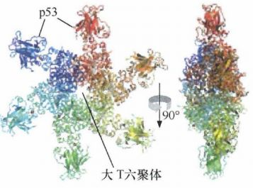

图 9-1-1 ： X 射线 晶 体衍射显示 p 53 与 SV40 大 T 结 合： SV40 大 T 分子组装进 p53 同源六聚 体 中，它的每个组分结合到一个单独的 p53 分子上，并将之束缚

用只识别大 T 的单克隆 抗体能免疫沉淀到病毒感染的细胞中存在这一 5 3~54kDa 的蛋 白 质 ， 而在未被病毒 感 染的细胞中则检测不到。 这些发现揭示了在 S V40 转化的细胞中表达的大 T 抗原能和一种新发现的蛋白质结合，这种蛋白质被命名为 P 53 。 能同时与大 T 及 P 53 反应的血清可以 在一些未被感染的细胞中检测到 P 53 。 值得注意的是，这些 肿 瘤细胞是通过非 病毒 机制转 化的。随后的研究证实， P 53 来源 于 细胞，而不是病毒。同年，有报道称化学致癌剂转化的小 鼠 细胞同样表达 P 53, 进一步肯定了这一结论。

2 、 p5 3 被认为是抑癌基因

p5 3 的功能研究绕了一个很大的 弯 路。 最初， 科学家发现在大 鼠 胚胎成纤维细胞 ( REF) 中共转染 p53 cDNA 克隆和 ras 癌基因可以转化这些咄齿类动物的细胞。 由于 之前的研究发现 myc 可以与癌基因 ras 一起使咄齿类动物的细胞发生转化 ， 这说明 p53 基因可能起与癌基因 myc 类似的癌基因的作用 。

后来的研究发现事实并非如此。最初的 p53 cDNA 以肿瘤细胞的 rnRNA 为模板 合 成，而随后从正常细胞中获得的 p53 cDNA 并不能使细胞转化，反而抑制了细胞的转化。在比较了这两种 cDNA 序列后发现，两者之间的区别在 于 一个碱基的替换 ， 这导致了 P 53 蛋白中一个氨基酸的改变。

这些结果显示野生 型 p 53 等位基因的实际功能是抑制细胞的增殖 ， 当其阅读框发生点突变时， 它 就会获得促进细胞生长的功能。鉴 于此 ， p53 基因被认为是一个抑癌基因。 p 53 的等位基因点突变在很多人类肿瘤细胞的基因组中广泛存 在。大 量 研究数据显示，在 30%~50% 的人类肿瘤中都存在 p53 基因的突变 。 实际上，在迄今所有人类肿瘤细胞基因组中， p 53 是发生突变频率最高的基因，在 几 乎 1/3 的人类肿瘤中都以突变的形式存在 。

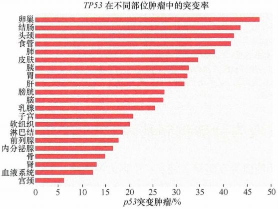

图 9-1-2 ： p 53 等位基因在人类肿瘤细胞中突变的频率

有趣的是， 随后对于 p 53 功能的分析显示， p53 并不是一种典型的抑癌基因。大多数抑癌基因在小鼠生殖细胞中以纯合子的形式失活时， 将 导致胚胎发育中断。这些抑癌基因似乎负调控多种类型细胞增殖来发挥作用，它们在细胞调控通路中的缺失将导致一些细胞的不正常增殖，从而中断其正常发育。

与之 相反的是，小鼠生殖细胞中两个 p53 基因拷贝的完全缺失对于绝大多数的 p5 3 -/- 胚胎的发育并无明显影响。因此， p53 不能被简单地认为是正常细胞发育中增殖的负调控因子。这个特点第一次提示了 P 53 蛋白并不操纵增殖，或者非 增殖 信号从而持续影响细胞调控其增殖。相反， P 53 似乎是特异地阻止非正常细胞的出现，尤其是那些有可能发展成肿瘤的细胞。

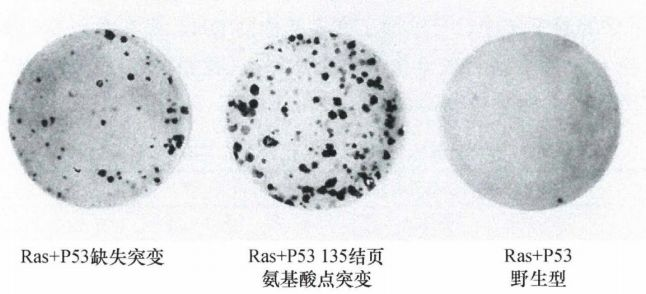

图 9-1-3 ： 将编码 Ras 癌蛋 白 的 cDNA 与多种不同剪切形式的 p53 cDNA 共转染到大鼠胚胎成纤维细胞中 ： 在 p53 缺失突变载体中（左），几乎缺失了全部的 p53 阅读框，只形成了很少的聚 集 点 ； 在 p53 点突变的情况下（中），大 量 聚集点形成 ； 在野生型 p53 的克隆中（右） ， 几乎没有聚 集 点的形成

3、 突变的 p 53 干扰正常 p 53 的功能

第 7 章讲到 ，只有抑癌基因 由于 两次连续失活突变而被去除，或者一个失活突变与杂合性缺失 ( LOH) 同时发生时，才能出现细胞表 型 上实质性的变化 。然而， 小鼠生殖细胞中两个 p53 基因拷贝的完全缺失对于绝大多数的 p5 3 -/- 胚胎的发育并无明显影响 ， p 53 基因似乎并没有遵循 抑癌基因丢失的双击理论 。

解决突变的 p 53 蛋白如何促进肿瘤细胞形成这个难题主要通过两个方面的方法。

一 个 是对于酵母遗传学方面的研究表明，某个突变的等 位 基因可以在由 于 突变而失活的 某 个基因产物中发现该基因的等位基 因 突变 。 同时，这个突变使得突变后的等位基因能够干扰或者妨碍细胞中那个剩下的野生 型 拷贝的正常活性。这种类别的等 位 基因被命名为差异显性干扰 ， 或显性负等位基因。另 一个是 对于 P 53 蛋白的生物化学分析， P 53 是一个核蛋白 ， 一般以同源四聚体的形式存在于细胞中 。

将显性负效应和四聚体形态联系在一起 ， 可以推测出突变的 p 53 等位基因能有效地干扰在同一个细胞中表达并持续起作用的野生 型 p53 等位基因。 假设人类肿瘤细胞中存在一个突变的 p 53 等 位 基因，编 码 了一个失去正常功能但仍能形成四聚体的 P 53 蛋白。如果这个突变的等位基因和野生 型 的等位基因在此细胞中共存 ，那么这个细胞中的 P 53 四聚体将是包含了突变的 P 53 蛋 白 及野生 P 53 蛋 白 。

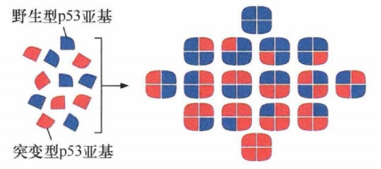

图 9-1-4 ： p 53 作为显性负等位基因 ： 在含有单个突变 的 p 53 等位基 因 的细胞中，会形成包含不同比例的野生型（蓝色）及突变型（红色） P 53 亚基组成的四聚体 。由于 单独一个突变的亚基都可能导致整个四聚体功能的丧失 ， 因此在 p53 基因杂合的细胞中， 15/16 的蛋白质都缺乏完整的正常功能

将一个突变的 p 53 cDNA 克隆导入（转染）含有一对野生型 p53 等位基因的细胞中 , 这个导入的等位基因通常带有一个高活性的转录启动子，比细胞自身的 p53 拷贝启动子活性高得多。所以，在这种转染的细胞中，突变的 p53 蛋白表达量会比内源性的正常 p53 蛋 白 高得多。因此，在这种细胞中，完全由野生 型 p53 亚基形成的 p53 四聚体所占的比率远远少 于 1/16 。这解释了为什么导入的突变 p53 等位基因能够高效地影响这些细胞中 p53 的功能。

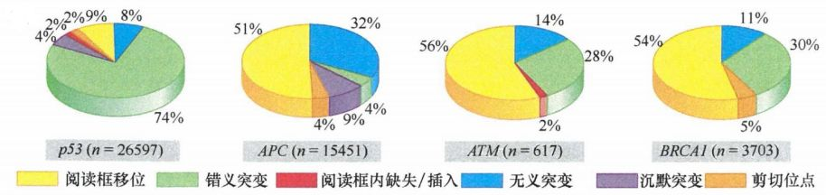

图 9-1-5 ： 人类肿瘤中发现的绝大多数的 p53 等位基因的突变 为错义突变（ 点突变 ），而 其他肿瘤抑制基因或 管家 基因 (ATM, BRCA 1 ) 中的突变多为阅读框移位或无义突变

按 此 逻辑，许多人类肿瘤细胞在失去 p 53 功能后取得优势，可能是 由 于它们携带了一个野生型和一个突变型的等位基因。实际上，在 p53 基因座突变的大多数人类肿瘤细胞中，都发现了 p53 基因的杂合性缺失，这些细胞中野生型的等位基因被清除，产生了具有两个突变 p53 的等 位 基因。因此 ， 在这些细胞中，当一个 p53 基因在开始时突变 ， 接下来剩下的野生型 p53 基因也 将 通过杂合性丢失机制被清除。

4、 P 53 蛋白半衰期较短

早在 P 5 3 蛋 白 的 DNA 结合结构域被发现之前，该蛋 白 在许多正常细胞或者肿瘤细胞的核定位就提示了它可能作为一个转录因子来发挥功能。已知至少 3 种调控转录因子活性的机制： 1. 调控转录因子在核内的水平 ； 2. 转录因子在核内的水平保持恒定，但其活性必须由一些共价修饰辅助 ； 3. 调控某个共同转录因子水平 。 对 于 P 53 来说 ， 第一种机制 ，即 P 53 蛋 白 的水平改变是主要的。

许多细胞中的蛋白质分子，一旦被合成就能持续数十小时或者数百小时。同时，许多其他蛋白质的代谢是高度不稳定的，几乎一合成就被降解 。 区分这两类蛋 白 质的一个方法是用放线菌酮处理细胞，这是一种能抑制蛋白质合成的药物。

在对具有野生 型 p53 等位基因的细胞进行放线菌酮处理后， 测得 P 53 蛋白的半衰期大约只有 20 m in 。 这说明 P 53 是一种高 度 不稳定的蛋 白 质，在被合成后不久即被降解 ，因此其 调控更为迅速，可以通过增加或者降低其稳定性来完成 。

# 第九章 《癌生物学》第九章（2）  P53水平的调控

“我们已经知道了， P53 最终被认为是一个非常重要的抑癌基因。那么，机体是如何调节 P53 的激活、降解与稳定，进而发挥重要的作用呢？这其中涉及哪些信号与通路呢？”

1、 P 53 的激活信号

20 世纪 90 年代早期， 科学家 发现 X 射线 、紫外线、 某些能损伤 DNA 的化疗药、 DNA 合成抑制剂及分解细胞骨架中微管蛋白的因子能诱导 P 53 蛋白水平快速升 高。在接下来的几年里，低氧（缺氧）条件被发现能够引起 P 53 水平剧烈改变。 后来 还发现，将 myc 或者腺 病毒 携带的 E 1 A 癌基因转入细胞后也能引起 P 53 水平的上调。 高 于正常水平的 E2Fl 转录因子表达、染色体 DNA 的广泛去甲基化、 DNA 的核 苷酸前体不足都能刺激 P 53 的积累。将细胞置于一氧化二氮或者酸性培养基中、细胞内核糖核酸的缺失、 RNA 或 DNA 合成的阻碍也都可以使 P 53 蛋白水平升高。

在其他研究中能导致 P 53 上调的遗传毒性（如 DNA 损伤）因子及生理学信号同样被熟知 ，它们在某些条件下能抑制细胞生长，导致细胞循环停止，这种反应通常被称为 “ 生长抑制 ” 。在另一些情况下，这些应激信号可能启动凋亡程序。 当遗传毒性因子，如 X 射线，诱发细胞内 P 53 水平升高时， p21 Cip1 蛋白水平也相应地升高， 然而在 p53 突变的细胞中则不发生这样的现象 。这说明 P 53 蛋白能通过诱导 CDK 抑制剂的表达来阻滞细胞周期进程。

综合考虑，这些发现可以整合成一个简单的机制模型： P 53 持 续地接收从多种监控系统传出的信号。如果 P 53 接收到特殊的 警报信号时，它将阻止细胞的增殖，或者启动凋亡程序。

实际上， p53 具有抑制细胞生长和促进细胞凋亡的功能，这对于那些向恶性生长期进展的初期肿瘤细胞来说是一个主要威胁。许多应激，包括缺氧、基因组损伤及调控细胞增殖的信号通路失调，是肿瘤细胞在发展成肿瘤的各个时期都会经历的。在这些应激中的任何一种存在的情况下，完整的、有功能的 P 53 警报系统就会威胁可能形成肿瘤的细胞。

2、 D N A 损伤及失调的生长信号导致 p 5 3 稳定

有 3 个研究 的比较透彻的监控系统，当检测到损伤或者信号失衡时，会给 P 53 发送 报警信号。

第一个监控系统是对染色体 DNA 双链断裂 (DBS) 进行应答的，这些断裂是 由 电离辐射引起的，如 X 射线。传感器将信号传递给 ATM 激酶 ， ATM 将信号传递到 Chk2 激酶上。 Chk2 激酶能磷酸化 P 53, 而 P 53 的磷酸化保证其 中 被一个名为 Mdm2 的蛋 白质降解。（下节讨论）

第二 条信号通路可以被单链 DNA ( ssDNA) 激活，单链 DNA 是 由 停滞的复制叉产生的，通常是由于 DNA 聚合酶遇到了因 DNA 损伤而改变的碱基 。 这些 DNA 损伤因 子包括某些化疗药物及紫外线照射。 ssDNA 感应器通过 Chk 1 激酶激活 ATR 激酶，进而使 P 53 蛋白磷酸化，从而保护其不被降解 。

第三条通路是由异常的生长信号引起的 P 53 激活，特别是在那些由于 pRb-E2F 控制的细胞周期发生紊乱时 ，这条通路并不依赖于激酶介导的 P 53 水平的改变及信号。

这些错综复杂的信号通路说明了哺乳动物细胞的脆弱。在进化的进程中， P 5 3 蛋白被委以重任，接收来自负责监控许多重要的细胞内生理及生化系统发出的信号。 但这也给细胞带来了一个最大的弊端 ，即一旦失去这个调控通路的蛋白质，细胞将灾难性地失去监控自身健康的能力，并且将不能对某些系统的失灵采取适 当的对抗措施。

图 9-2-1 ： P 53 的 激活信号和下游效应

在一次打击后（实际上，两次打击能使 P 53 基因的两个拷贝失活） ， 细胞变得对 自身的故障开始视而不见。 由此它们获得了在某些环境下持续增殖的能力，而在正常情况下这些环境会导致细胞增殖抑制或者进入凋亡。另外，失去了由 P 5 3 促进的 DNA 修复及稳定基因组的功能， p5 3 -/- 细胞的子 代将获得更多的突变 ，并且在向形成恶性肿瘤的道路上更快地迈进 。

3、 M d m2 参与降解 P53

像许多细胞蛋白 一样， p53 蛋白是 由泛素蛋白酶体系统降解的。由这个系统降解的蛋白质都会首先被多聚泛素链共价标记结合，然后被转运到蛋白酶体中，并在其中被消化成为寡肽。这个过程中最为关键的一步是起始的标记过程。 在正常的、未被搅乱的细胞中， p53 的降解是 由 蛋白 Mdm2 （ 小鼠中）和 MDM2 （ 人）调控的。

p53 作为一个转录因 子起作用， Mdm2 与 p53 结合后立即使其调节转录的功能失活。此后， Mdm2 介导单个泛素与 p53 的连接，并将其从核内 （ p53 主要在核内起 作 用）转运到细胞质中，接下来对 p53 的多聚泛素化保证了其在细胞质蛋 白酶体中的迅速降解。连续而有 效的 Mdm2 运作保证了 p53 在正常未受应激的细胞中有 20min 短暂的半衰期 。

以上讨论仅显示 了 Mdm2 作为一个单体蛋白发挥作用，而实际上它常与 MdmX （ 又称 Mdm4 ） 形成异源二聚体。这个复合物在泛素化导致 p53 降解的过程中发挥主要作用。实际上 ， 在缺失 Mdm4 的情况下， Mdm2 不 能使 p53 降解。

图 9-2-2 ： Mdm2 控制 P 53 水平 ：在某些生理信号刺激后 P 53 浓度上升（此处未显示）， P 53 四聚体与众多的靶基因启动 子区结合，这些靶基因的转录由 P 53 诱导（上）。在这些基因中，还包括 mdm2, 导致 mdm2mRNA 及 Mdm2 蛋白水平的上升（右）。一旦合成， Mdm2 分子就和 P 53 蛋白亚基结合，并使其泛素化，并被转运至胞质中进一步泛素化（此处未显示），随后在蛋白酶体中降解。这个负反馈环保证了 P 53 最终回落到一个较低的水平，并且在正常细胞中保证 P 53 的浓度在一个非常低的水平

在某些环境下，特别是细胞遭遇某些类型 的应激或者损伤时， p53 必须被保护起来，以免除 Mdm2 对它们的降解。一般来说，这种保护通常是通过磷酸化来 实 现的， Mdm2 不 能与磷酸化的 p53 结合，故 不 能使其泛素化。 p53 的磷酸化氨基酸残基位于 N 端结构域 ， 如 ATM 、 Chkl 和 Chk2 等激酶对该位点的磷酸化，改变了 p53 蛋 白中通常被 Mdm2 识别并结合的结构域，通过这个方式避免 Mdm2 与 p53 结合。同时， DNA 损失诱导激活的 ATM 激酶可以磷酸化 Mdm2, 并使其功能失活并解体。 当 p53 和 Mdm2 都被磷酸化后 ， Mdm2 不 能起始 p53 的泛 素化。 从而使得 p53 不被降解 。

图 9-2-3 ： p53 蛋白与 Mdm2 的结合发生 在 其靠近 N 端的一个小的结构域中 ，而它的转录激活区也在此处。 在此区域内的 p53 氨基酸残基的磷酸化（红色棒棒）阻止了与 Mdm2 的结合并使得 p53 不能被泛素化及降解

Mdm2 蛋 白的活性及其水平由 其他信号调节。这个信号通路使细胞在激活 Pl3 激酶 (Pl3K) 通路后，通过 Akt/PKB 激 酶 引起 Mdm2 的磷酸化，将 Mdm2 从细胞质中转入核中，并在核中与 p53 发生作用。由 于 Pl3K 本身 由 Ras 和生长因子受体激活，我们了解到促有丝分裂信号通路确实可以影响 Mdm2 从而影响 p53 。同时，在促有丝分裂信号通路中， Ras - Ra f - MAPK 的激活能通过 Ets AP-I (Fos + Jun) 转录因子大幅提高 mdm2 基因的转录，产生高水平的 mdm2 m RNA 及蛋白质。提高的 Mdm2 蛋白水平通过 PI3K - Akt/PKB 信号通路增加了磷酸化激活的 Mdm2 。 这些效应都导致了 p53 蛋白水平的降低 。

另外一个影响 Mdm2 的机制通过 Mdm2 拮 抗物的发现而被发现，即小鼠细胞中的 p 1 9 ARF 和人类中的 p 1 4 AR F 。精确的序列分析发现了后来被命名为 ARF 的基因。这个编码基因最早在小鼠细胞中被发现，它的序列与 p16 INK4A 基因重叠。后者是 CDK4 和 CDK6 激酶的一个重要抑制剂，可起始 pRb 的磷酸化。通过使用 p16 INK4A 启动了上游 13kb 处的启动子转录及可变剪切，使该基因合成了一个编码可变阅读框的 mRNA ， 其编码 ARF 蛋 白 。在野生型咽齿类动物细胞中表达 ARF 编码的 cDNA, 可以对细胞增殖产生强有力的抑制作用 。 但是，当将 ARF 的 cDNA 转入到缺少野生型 p53 功能的细胞中时，这种抑制作用却没有发现。这说明 ARF 的生长抑制功能完全依赖于细胞中有功能的 p53 的存在。

进一步的研究发现， 在野生型细胞中， ARF 的表达可以导致 p53 水平的快速上调。 现在已经研究清楚了 ARF 与 Mdm2 结合并抑制其功能这个反应的分子机制，一方面它可以将 Mdm2 隔离在核仁中；另一方面则是在细胞质中抑制 Mdm2 。一旦将 Mdm2 与 p53 的相互作用阻断， p53 就能逃离 Mdm2 介导的泛素化及降解 ，并由此在细胞内快速高水平地累积。 ARF 能够快速诱导 p53 水平的上调就是因为它能结合并抑制 Mdm2 。

由于 ARF 在提高 p53 水平上有重要的作用， p 1 4 A RF 基因与编码其靶蛋白 的 p53 一样 ，是细胞中一个极其重要的肿瘤抑制基因。
# 第九章_3_《癌生物学》第九章（3）__P53的生物学功能

“ 我们已经知道了， P53 可接受多种激活信号， DNA 损伤及失调的生长信号也参与调节 P53 的稳定，此外， Mdm2 参与泛素化调节 P53 降解， ARF 能结合并抑制 Mdm2 。 今天我们将主要讨论 P53 的分子生物学功能，及其与肿瘤发生发展的关系。 **”**

1、 D N A 损伤后 p5 3 阻止细胞周期的进程并参与修复

如前所述 ， p53 转录因子一个非常重要的靶基因就是 Mdm2 基因。当作为一个转录因子激活时， p53 促进 了 Mdm2 的合成 ， 而 Mdm2 则能促进 p53 的降解 。 这个负反馈环保证了 p53 分子在合成后能很快被降解，使正常细胞中的 p53 蛋白维持在较低的水平。

p53-Mdm2 反馈环解释了 p53 异乎寻常的行为。在带有突变或有缺陷的 p53 等位基因的人类肿瘤细胞中， p53 蛋白的表达水平相对 于 正常细胞来说几乎维持在非常高浓度。乍看起来，这似乎很奇怪，因为像 p53 这样的一个生长抑制的蛋白的表达水平如此高，似乎与恶性细胞的增殖相矛盾 。这个悖论可以被前面提到的情况解释， 即大多数突变的 p53 基因导致了 p53 蛋白丧失其转录激活能力。一个直接的后果就是 p53 不能诱导 Mdm2 的转录及蛋白质合成。在 Mdm2 缺失的情况下，无功能的 p53 可以逃脱降解 ，并累积到一个非常高的水平。

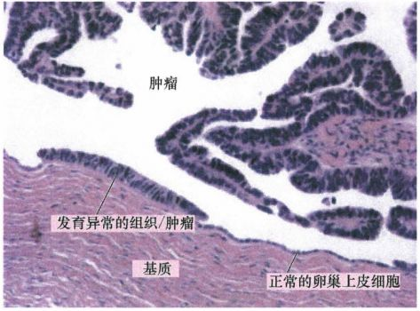

图 9-3-1 ： p53 突变细胞中 p53 的积累 ： 用和过氧化物酶偶联的抗 p53 抗体染色卵巢癌组织 后（细胞核被染成黑色）在显微镜下观察：卯巢癌中大量的上 皮细胞由含有高水平的 p53 表达的细胞组成

这解释了为什么在肿瘤细胞群中容易通过免疫染色的方法检测到 p53 ， 这是在这些细胞基因组中存在突变的 p53 等位基因的一个明显迹象。这 也 解释了在被 SV40 感染或转化的细胞中 p53 蛋白含量较 高 的原因： p53 被病毒的大 T 抗原 隔离， 抑制了 p53 诱导的 Mdm2 基因的表达 ， 从而抑制了 p53 的降解。

Mdm2 仅仅是 由 p53 诱导表达的基因中的一个 ， 另外一个非常重要的靶基因就是 p21 Cip1 。 p21 Cip1 是一种广泛的 CD K 抑制剂，它可以 抑制 CDK2 和 CD KK 2, 它的诱导表达解释了 p53 抑 制细胞生长（而不是促进凋亡）的活性。 这 解释了 p53 是如何阻断细胞周期各个点而向前进展的。

同时，细胞内的 DNA 修复机器也将被动员起来，对损伤进行修复。其中有些是 直 接被 p53 诱导的。 研究证明，在带有野生型 p53 等基因的细胞中某些 DNA 修复蛋 白 要比在带有突变 p53 等位基因的细胞中能 更 快地动员起来。另外， DNA 修复蛋 白 切除改变化学碱基后， DNA 聚合酶在重建 DNA 链的过程中发 挥重要的作 用，其活性在 p53 缺失的细胞中比野生 型 的对照中要低得多。当 DNA 被成功修复后， 保护 p53 不 被降解的信号将消失。接下来 p53 水平降低而 p21 Cip1 的水平恢复正常。这使得细胞周期进程恢复， 保证细胞进入 S 期， DNA 复制得以开始。

表 9-3-1 ： p53 靶基因举例 （依据功能分类）

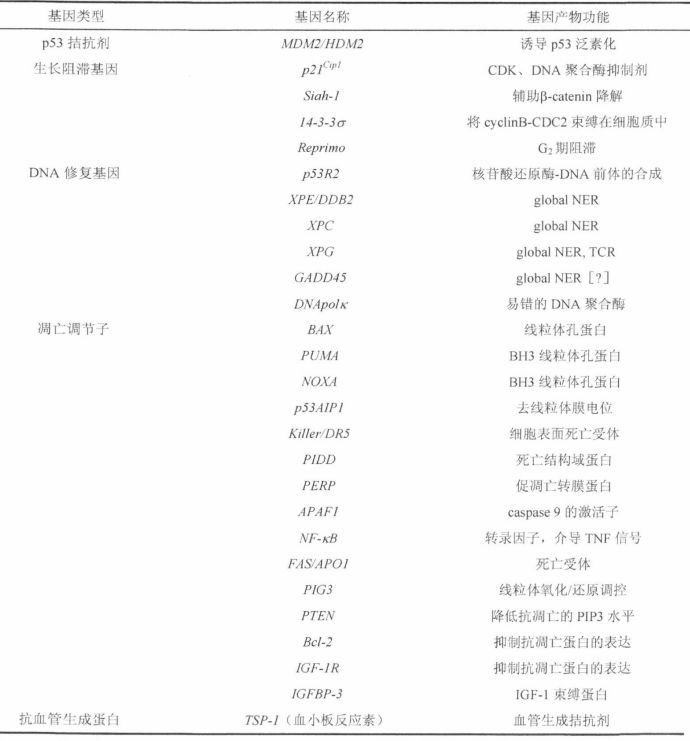

p53 蛋 白还可以通过其他的基因和蛋白 质来增强对细胞周期的阻滞。例如， Siah-1, 另一个 p53 诱导的基因产物，参与 β-catenin 的降解，而 β-catenin 帮助诱导 cyclin D 1 的合成，以通过细胞周期的 G1 期。 β-catenin 的丢失可能会引起 myc 基因转录的降低，除了对于 G1 期进程的影响，也会引起其他细胞周期各个时期的进程减慢。

p53 的这些功能使得有人将其称为 “基因组的保护神”。在染色体DNA 受损伤之后，通过 阻止 细胞周期的进程和 DNA 的复制同时诱导 DNA 修复酶的表达， p53 能够减少细胞基因组中突变累积的比率 。 此外，在 DNA 损伤发生时， p53 将启动凋亡，进而消灭突变的细胞及它们的基因组。相反 ， 如果失去了 p53 的功能，细胞将发生复制损伤且只有未被修复的 DNA ， 这将导致它们产生相对不稳定的基因组，即在细胞增殖中积累了异常高比率突变的基因组。

2、 p5 3 引发凋亡

在大量 不可修复的基因组损伤、缺氧（特别是无氧）或者许多信号失衡的情况下 ， p53 能够引起比可逆的细胞周期阻滞更为强烈的反应 ，即启动凋亡。凋亡程序依照着精细协调的计划进行。在几分钟以内，质膜形成泡状结构，细胞核断裂固缩， 染色体 DNA 片段被裂解为小片段。通常在 1 h 内，凋亡的细胞破碎成小的片段 （凋亡小体），被邻近组织中路过的巨噬细胞快速摄入。

凋亡在正常组织的生理学过程中发挥着重要作用。如：在红细胞发育的过程中， 超过 95% 的有核红细胞 （成熟红细胞前体），作为常规操作中的一部分，被从骨髓中去除。但是当血液中运输的氧气比率跌到一个限值时，或者是因为出血、各种类型的缺血或周围空气中低氧时，促红细胞生成素将快速上升，并且阻断这些红细胞前体的凋亡，使它们成熟为有功能的红细胞。在遗传学上敲除凋亡机器的主要元件的小鼠中，出现了很多特征性的发育缺陷，包括大脑中过多的神经元、面部畸形、脚趾间蹊化消失的延迟及上腮与晶状体的异常。在大脑发育的过程中，超过半数的初始神经元在形成神经回路的过程中都将遍通过凋亡而被清除。

在更普遍的层面上，凋亡用来保证人类组织中的各种不同类型的细胞保持在一个合适的数量。我们的肝脏中心形成的细胞与去除的细胞数量相当，绝大多数这种消失的细胞都是通过凋亡来去除的。（注意：维持常规组织的凋亡似乎并不依赖于 p53 的功能， p53 启动的凋亡似乎仅 针对非常规的、威胁到细胞及组织的紧急情况，结果是清除有潜在成瘤能力的细胞）

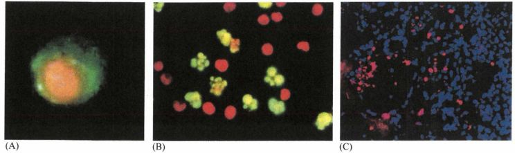

图 9-3-3 ： 凋亡细胞的检测： （ A ） 在凋亡程序的早期，磷脂酰丝氨酸（ PS ） 分子，正常应该存在于 质膜的内层，被翻转而暴露于细胞的表面。 PS 与膜联受体 V 蛋白相结合，后 者与荧光染料偶联，供检测的细胞表面暴露 出来的 PS （ 绿色）；（ B ） 在 TUNEL 检测中，凋亡的细胞（黄绿色，上）的染色体 DNA 被片段化 ， 暴露出了可以被末端脱氧核苷酸转移酶（ TdT ） 延长的 DNA 3' 端 ， 用 BrdUTP （ 溴脱氧尿苷三磷酸）作为底物。产生的寡核苷 酸尾巴可以被抗 -BrdU 的单克隆抗体识别，该抗体与染料分子相偶联（黄绿色） ；（ C ） 在 MMTY-Neu 小鼠乳腺癌组织中使用针对剪切的（激活的）级联蛋白 3 （ 红色）的偶联了荧光染料的抗体及对细胞核染色（蓝色）的 DAPI ， 凋亡的癌细胞区域（左）与正常的基质细胞（右）相邻，而后者中的凋亡细胞中非常少见

p53 起始 凋亡一部分是通过启动许多组成凋亡机器的下游靶基因的表达来实现的。这些基因编了不同类型的凋 亡前体蛋白。同时， p53 还抑制了那些抗凋亡蛋白的表达。

总之，在某些情况下， p53 行使其抑制细胞生长功能，阻碍细胞周期的进程。在另一些情况下， p53 激活细胞潜在的凋亡机制 ，确保细胞死亡。这两种调控模型间的选择似乎依赖于生理性刺激或者遗传学损伤的种类、刺激或者损伤的严重程度、细胞类型，以及细胞中其他促进制亡或者抗凋亡信号的运作。

3、 p 5 3 失活为初始癌细胞在肿瘤发展的多个阶段提供机会

在肿瘤细胞形成的早期阶段，原癌基 因常通过不同形式的突变而被激活。这种癌基因的激活很容易将细胞置于 p53 诱导凋亡的危险中。在接下来的肿瘤发展过程中，越来越多的肿瘤细胞会由临养缺氧的问题，在这种情况下，正常细胞通常会死亡 （凋亡）； 而肿瘤细胞则会生存下来，因为它们的祖辈细胞在肿瘤发生的早期阶段就会失活 p53 基因 。

在肿瘤发展的多阶段、多步骤的长期过程中， p53 对遗传损伤诱导反应的缺失会允许累积突变高于正常比例的细胞存活下来。这种突变的增多使原癌基因激活和抑癌基因失活相应增多，也会加速前恶性细胞到恶性细胞的演进过程 。此外， 依赖 p53 表达的一个重要的靶基因是 TSP- 1 ， 即凝血酶敏感素 - 1 。 TSP- 1 是一个在细胞外间隙阻止血管形成的分泌性蛋白 。在肿瘤发展的早期阶段， p53 缺失导致 TSP- 1 表达的减少，为成簇的肿瘤细胞得到足够的血供解除了一个重要的障碍。

总之，整个有机体能因体内细胞存在 p53 而得到保护 ， 一旦它们中有些细胞的 p53 功能缺失，就会自由通往恶性转化之路，整个机体就会遭受严重的打击 ，这 也解释了为什么绝大部分肿瘤中 p53 通路通常被破坏 。

4、 影响 p 5 3 信号通路的基因影响肿瘤形成

1982 年 ，有许多家庭被发现对多种不同的肿瘤有高度的敏感性，包括：恶性胶质瘤、白血病、 乳腺癌、肺癌、胰腺癌、肾母细胞瘤和软组织肉瘤。有 2/3 的家族成员在他们 22 岁之前就有着这些肿瘤的存在 ，他们之中有些成员甚至同时并发多种肿瘤， 这种家族性的肿瘤综合征称为 Li-Fraumeni 综合征。它的最特别之处在于能引起多种 类型肿瘤的敏感性，这与我们在第 7 章提到的其他类型的家族性肿瘤综合征相比完全不同。

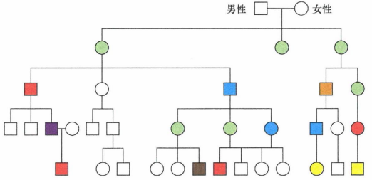

图 9-3-4 ： p53 等位基因种系突变导致的家族性肿瘤易感性 ：乳腺癌（绿色）、恶性胶质瘤（灰色）、白血病（紫色）、肺癌（蓝色）、胰腺癌（橙色）、肉瘤（红色）、肾母细胞瘤（棕色）；男性用正方形表示，女性用圆形表示

1990 年 ， 研究者发现大多数病例是由于 17 号染色体短臂的 1 区 3 带 （ 恰好是 p53 基因定位的区域 ）存在等位基因突变。 在这些肿瘤多发家族 70% 的成员中， p53 的等位基因突变都遵循养孟德尔遗传法则，从母代传至子代 。 遗传了 p53 等位基因突变的家族成员在生命的早期有更高的可能性发生某种恶变。不同肿瘤发生的年龄也各不相同。例如， 5 岁时易发生肾上腺皮质癌， 16 岁时易发生肉瘤， 25 岁时为脑肿瘤， 37 岁时为乳腺癌 ， 50 岁时则为肺癌。

p53 等位基因突变在 Li-Fraumeni 家族的种系传递中意味着分散于 p53 阅读框的多种点突变（迄今为止，人们已识别出超过 500 种 p53 的种系突变）。近些年来 ，一些相似的家族性肿瘤综合征已追踪到 p53 控制通路的其他组成部分 ，家族癌症易感性可能来源于 p53 通路中其他组成部分的缺陷 。

# 第九章_4_《癌生物学》第九章（4）__凋亡与肿瘤

“我们已经知道，作为抑癌基因， P53 影响肿瘤发生发展的机制包括 在 DNA 损伤后阻 止细胞周期的进程并参与修复，在机体面对不利因素的情况下介导细胞凋亡。然而，直到现在为止，我们对凋亡的认识并不完全，也未能完全公平评判自杀程序在肿瘤病因学中的作用。现在，我们重新回顾一下凋亡，并展开更深层次的探讨。”

1、 凋亡过程依赖线粒体

1972 年之前，多细胞动物组织里的细胞通常被认为是因坏死而被单个消灭的 ； 20 世纪 80 年代晚期，对线虫发育的遗传学研究拟示了凋亡在这些微小动物的正常发育过程中参与清除各种细胞。大家逐渐认识到，对于所有的多细胞生物而言 ，凋亡都是一个基本的生物学行为。

表 9-4-1 ： 凋亡与坏死的区别

线粒体在凋亡过程中发挥着重要的作用， 细胞色素 c 是这个过程的核心因素，通常位于线粒体内膜和外膜之间的间隙 ，作为氧化磷酸化作用的一部分，起传递电子的作用。然而，一旦某些信号起始凋亡，线粒体的外膜开启通道， 细胞色素 c 就会脱离线粒体，进入外 围胞质，联合其他的蛋白质引起导致凋亡的级联事件。所以，在真核细胞进化的过程中，在细胞产生大量能量的地方同时还存在养另一完全不相关的功能，那就是产生和释放生化信号，诱导相关变化最终导致细胞死亡。

图 9-4-1 ： 细胞色素 c 从线粒体中释放入细胞质 ： （ A) 起始时，细胞色素 c 与线粒体在细胞质中的分布一致 ； ( B )( C )( D ) 当凋亡逐渐进展，细胞色素 c 逐渐从线粒体中释放进入细胞质中，它在细胞浆中的染色体变得越来越均匀一致，同时细胞核表示出与凋亡相一致的断裂 细胞色素 c 可被特异性荧光标记抗体检测（绿色） ，与染料标记细胞核（红橙色）区别

Bcl-2 蛋 白是一个大而复杂的家族中的一员， 它能调控细胞色素 c 通过线粒体 外膜上的特异性通道释放进入细胞质， 这些通道也特异性地决定细胞色素 c 和其他的蛋 白质是否 从线粒体释放入细胞质。 Bcl-2 家族的一些成员， 如 Bcl-2 和 bcl-XL ， 能够保持这些通道关闭； 而其他 Bcl-2 相关蛋 白 ，如 Bax 、 Bad 、 Bak 和 Bid ， 起开启这些通道的作用。

图9-4-2： Bcl-2 和相关蛋白 ： B c l 家族成员既有抑制凋亡的作用又有促进凋 亡 的作用。这些蛋白质都具有一个同样的 BH3 结构域（紫色） ， 有些如 Bcl-2 还具有 BH1 和 BH2 结构域 （红色，蓝绿色），一些成员还具有用于铀定 于细胞膜上 的跨膜结构域（浅绿色）和 BH4 结构域（深绿色），具有 BH4 结构域的蛋白质可以在一定程度 上抑制内质网钙离子释放，进而具有抑制凋亡的功能。促凋亡蛋白 可以分为 Bax 家族和只含有 BH3 结构域家族蛋白。 Bax 家族蛋白以无活性形式，存在 于线粒体外膜或者细胞质基 质中，无活性的只含 BH3 结构域的蛋白质只存在于细胞质基质中，两类促亡蛋白在凋亡信号的刺激下被活化（或者），转位到线粒体外膜。

人类基因组已知能编码 24 种 Bcl-2 相关蛋白 。 它们中的 6 种是抗凋亡 蛋 白，剩下的 18 种是促凋亡蛋白。每一个通道内的促 凋 亡蛋白和抗凋亡蛋白的相对水平决定细胞色素 c 是保留在线粒体内还是释放出来 ， 从这个角度来说，线粒体膜通道决定细胞的生存或死亡。这也可以解释为，组织中不同细胞的命运由促凋亡和抗凋亡 Bcl-2 样蛋白之间的精密平衡来掌控。

图9-4-3： 凋亡前体蛋白和抗凋亡蛋白之间的精密平衡： (A) 野生型小鼠的肾脏在 5 周龄 时结构完整； ( B ) 抗凋亡 bc l -2 基因的双生殖系拷贝缺失（造成 bc l-2 - /- 表型）导致这个年龄小鼠广泛性的细胞凋亡和多囊性肾病； ( C) 如果凋亡前体 bim 基因的单生殖系拷贝缺失可避免这种情况的出现（高产 bc l -2 -/- bim +/- 表型）

Bcl-2 蛋白家族的促凋亡蛋白和抗凋亡蛋白的作用各不相同，每个成员都有自己的反向作用伴随者。

图9-4-4： Bcl-2 蛋白家族的每一个成员都有自己的一套反向作用剂

此外， 这些蛋白质都可以诱导特定细胞类型中的细胞凋亡。例如， Bim 在控制乳腺的发展中起到了关键性的作用 ， 使管腔形成了管道。细胞色素 c 一旦从线粒体逃逸至细胞质，它就与 Apaf-1 蛋白形成一个复合物结构，称为凋亡小体。形成的这个 凋亡 小体复合物活化潜在的细胞质蛋白酶前体 caspase9 （ 半胱天冬酶 9 ）， 使之变成活化的 caspase9 。 小体活化的 caspase9 剪切前体 caspase3 活化另一相关的蛋白酶 ， 接着再切割并活化其他前体 caspase, 形成条链式反应 。 这种剪切的顺序相连形成一种信号级联放大。当胞质的细胞色素 c 活化 caspase 时，另一个与细胞色素 c 一同从线粒体释放出来的蛋白 质 Smac/DIA-BLO 可以失活一组称为 IAP （ inhibitor of apoptosis ） 的抗凋亡蛋白。正常情况下， lAP 以下面两种方式抑制 caspase 的活性：直接结合 和 标记在泛素化 caspase 上并把它降解 。如果没有 I AP 持续抑制的影响， caspase 可以自由地起始蛋白酶水解切割，最终导致凋亡。所以，在线粒体膜通道开放以后，凋亡信号以两种方式活化。细胞色素 c 释放并活化凋亡小体内的 caspase9 。同时，从通道内释放出来的 Smac/DIABLO 失活 IAP, 从而使 caspase 免除 IAP 的抑制。 caspase 的级联活化将会一直进行 ，直到最终导致细胞的程序性死亡。

图9-4-5： Bcl-2 样蛋白的多样性是各种各样的细胞生理刺激通过不同的凋亡前体蛋白去对抗抗凋亡蛋白，如 Bcl-2 和 B c l-XL （ 绿色）， 因此阻止 B c l-XL 蛋白中和 Bax 及 Bak （ 浅棕色），它们是一个重要的凋亡前体蛋白 ，能从线粒体膜释放细胞色素 c 。 在凋亡通路下游已激活的 caspase 也可以通过蛋 白 质水解（切割 tBid ） 激活 Bid 促凋亡功能，从而放大凋亡反应

caspase 从功能上分为两类：一类为起始性的 caspase ， 它们是真正的破坏细胞重要组分的实施者。一类为下游执行 caspase ， 掌控了破坏细胞关键组分的工作。一系列重要的细胞组分都被死亡执行性的 caspase, 如 caspase3 、 caspase6 和 caspase7 剪切 。它们的剪切降解引起细胞复杂的形态学转化，这些转化伴随着细胞凋亡而进行。核膜内表面的核纤层蛋白的切割，即和可观测到代表凋亡的染色质凝集和核皱缩（固缩）同时进行。剪切半胱天冬酶活化的脱氧核糖核酸酶的抑制剂（ ICAD ） 能使脱氧核糖核酸酶活化，从而降解染色体 DNA 。剪切细胞骨架蛋白，如肌动蛋 白 、网格蛋白、弹性蛋白和（肌动蛋白）凝溶胶蛋白，能使细胞骨架塌陷，质膜外生性地水泡状生长，形成 “自然死亡”小体。caspase 对它的降解能破坏电子传递链，使 ATP 产生失败，从线粒体中释放活性氧，使线粒体的结构也失去整体性，从而扩增凋亡程序。凋亡多个步骤的有效实施在一定程度上又进一步地增强了 凋亡起始信号。

图9-4-6： 凋亡的半胱天冬酶级联反应： 线粒体外膜 （暗褐色）有着决定细胞生存或死亡的关键性的门控通道 。抗凋亡信号控制线粒体外膜通道的关闭，凋亡前体蛋白则使之开启。 释 放入细胞质的重要线粒体分子是细胞色素 c 分子（红球）和 Smac/DIABLO 分子（褐方） 。 细胞色素 c 聚集 Apaf-1 形成一个 7 辐条的轮状 凋亡小体（左） 。凋亡小体能转换活化前体 caspase9 成有活性的 caspase9 （绿环）， caspase9 继续剪切并活化前体 caspase3 、 caspase6 和 caspase7 ，转换成死亡决定性的 caspase, 然后就可以剪切各种底物 ，产生凋亡表型。正常情况下，许多凋亡抑制物（ IAP ） 结合并失活 caspase 。 然而， 同时从线粒体释放出来的 Smac/DIABLO 能对抗这些 IAP ， 从而使 caspase 免除 IAP 的抑制

2、 细胞内外途径均可介导凋亡

前面所述的凋亡程序能在许多信号，如：重要的基因组损伤、缺氧，以及那些细胞内部生长调节信号的不平衡的刺激下使 p53 活化处于凋亡诱导状态， 后者 推动如 Bax 这样的蛋白能开启线粒体膜通道，细胞色素 c 和其他凋亡前体蛋白就能从线粒体释放出来，活化 caspase, 起始凋亡。这一系列的事件有时称为细胞 凋亡的内途径，因为起始信号来自细胞内部。

凋亡也可以通过其他选择性的途径起始。其中之一就是细胞外信号活化凋亡前体细胞的表面受体。细胞表面受体是跨膜蛋白，通常被称为死亡受体，提示它们具有活化凋亡程序的能力。在结合了细胞外间隙的相应配体后，死亡受体能活化细胞质中的半胱天冬酸 级联反应 ，最终和前面所述的内源性 凋亡通路会聚，导致凋亡的发生，这种受体所引起的凋亡称为外源性凋亡程序或受体活化凋亡途径。

表9-4-2： 死亡受体和它们的配体

图9-4-7： 不同类型哺乳动物细胞表面有 5 个不同死 亡受体家族

死亡受体的配体是肿瘤坏死因子 (TNF) 家族成员，包括 TNF-a 、 TRAIL 和 Fas 死亡受体的配体 （ FasL ） 。每个 TNF 样蛋 白与它们的相应受体结合， 这个受体家族的许多成员之中大约有 30 个由人类基因组编码，有一个共同的胞浆死亡结构域。这些受体和它们的行为因为受体和配体名称的多样性而变得复杂 ，一旦被配体的结合所活化， 这些受体的死亡结构域能结合并活化细胞质中称为 FADD 的蛋 白质。 形成的复合物称为 DISC ， 能聚非活化的、酶原形式的 caspase8, 少数情况下是 caspase 10 , 它们都是起始性的 caspase 。 caspase8 和 caspase 10 活化执行死亡的 caspase3 、 caspase6 和 caspae7, 最后和内途径凋亡程序殊途同归。

图9-4-8： 凋亡内途径与外途径汇聚： 在死亡受体把前体 caspase8 和（或） caspase 10 活化成

相应的 caspase 后，后者通过切割和活化执行 caspase 和内源性 凋亡级联反应的汇聚

实际上，还存在着凋亡的第三条途径， 此途径由杀伤靶细胞的细胞毒性 T 淋巴细胞和自然杀伤 (NK) 细胞起始 。 这两种杀伤细胞能够活化靶细胞表面表达的死亡受体，如 Fas 。另外，杀伤性细胞能结合在靶细胞表面，并注入一种被称为颗粒酶 B 的蛋白，颗粒酶一旦受制于这些杀伤细胞 ， 就能切割并活化酶原 caspase3 和 caspase8 ， 和前面所描述的途径相汇聚，继续作用而引起凋亡。

3 、 癌细胞抵抗凋亡

细胞在形成肿瘤的漫长过程中会遇到许多生理应激因子威胁它们的存在，每个生理应激因子都能诱导凋亡。事实上，所有的癌细胞都有抗凋亡的战略机制。

小部分人类肿瘤过表达 Mdm2 ， 这些影响 ARF 或 Mdm2 表达的机制都会降低细胞内 p53 蛋白的水平。最终 ， 在许多人类肿瘤细胞中， p53 就会错误定位 ，沉默于细胞质中。

另外一个对抗凋亡高度有效的机制来自 PI3K - Akt/PKB 通路的过度活化 。 这条通路的活化来自酪氨酸激酶受体和 Ras 癌蛋白的联合作用 ， 它们都能活化 Pl3K 使 PIP3 的水平升高，活 化 Akt/PKB 。一旦 Akt/PKB 被聚集的 PIP3 活化，它就能磷酸化并抑制促凋亡蛋白，同时磷酸化并活化 Mdm2 。

另一个逃避凋亡的机制在儿童 成神经细胞瘤中表现得很明显， N-myc 基因的扩增表明了肿瘤的攻击性生长和预期寿命的缩短。对于它本身来说，这种扩增确实威胁到神经母细胞瘤细胞的增殖，如前由所述， myc 癌基因的行为是一把双刃剑。这些编 码 癌蛋白的基因释放潜在的有丝分裂信号，但同时又强烈地促凋亡。许多神经母细胞瘤细胞通过基因扩增过表达 N-myc ，看 起来解决了这个问题，至 少一部分通过甲基化或缺失失活 caspase8 编码基因。

外途径细胞凋亡诱导通路常与癌细胞发展相关。事实证明在有些肿瘤细胞中，此通路常是失活的。有些癌细胞表达 FLIP (FLICE- 抑制蛋 白），一种通过结合死亡受体的死亡结构域而介导外源性途径凋亡级联反应活化的蛋白质，从而阻断这个反应过程和阻止 起始 caspase8 的自我催化活化。其他肿瘤细胞通过甲基化 TNFR 1 编码基因的启动子 ，从而抑制 TNF 受体的表达。

图9-4-9： 癌细胞抗凋亡机制：癌细胞能以各种逃离方式减少凋亡发生的可能性。在不同的癌细胞中，重要的促凋亡蛋白的表达水平和活性下降（蓝色）；某些抗凋亡蛋白的活性和表达水平则上升（红色）

癌细胞运用的这些策略机制清楚地说明了它们能通过失活凋亡的外源性途径从而得以存活。这也相应地说明了，免疫细胞经常包围癌细胞， 并试图通过释放 TNF 样因子和引起的外途径 凋亡程序来杀死它们。看到这么复杂的调节凋亡的连线图，不难推测，还有很多其他的抗凋亡机制是我们未知的。

# 第十章 《癌生物学》第十章（1）肿瘤细胞无限增殖的两个障碍
 
在正常人体细胞朝着肿瘤性生长状态进化的漫长时间内，它们经历了长期连续的生长分裂周期循环。然而，如此激烈的增殖方式与正常人类细胞的基本特征相冲突：正常人类细胞只被赋予了有限增殖的能力。一旦正常入类细胞耗尽了所允许的细胞倍增次数的配额，这些细胞群体里的细胞将会停止增殖，甚至会进入细胞凋亡。所以，为了形成肿瘤，初期的癌细胞必须突破在正常情况下会限制它们增殖潜能的屏障，获得无限增殖的能力——永生化的细胞表型。
 
**复制性衰老**
 
体外培养的啮齿动物或人类胚胎细胞的连续增殖能力是有限的。这些细胞在衰老之前具体的复制倍增次数取决于制备细胞的物种类型、组织起源及细胞供体的年龄。体外培养的细胞在经过特定的分裂次数后，将会停止生长并进入 复制衰老期 ，简称为衰老期。通常衰老的细胞会继续保持代谢活性，但不可逆地失去了重新进入细胞周期进行复制的能力。这些细胞在单层培养时会伸展开来，具有更大的胞浆，其形态似“煎蛋”状。只要给予充足的营养和生长因子，细胞可存活数周甚至数月 。虽然生长因子可以刺激健康的、未衰老的细胞进行增殖，但并不能使衰老细胞获得增殖能力，只能维持衰老细胞的生存能力。衰老细胞也有生长因子受体，但是其下游的信号通路通过某种未知的机制失活了。
 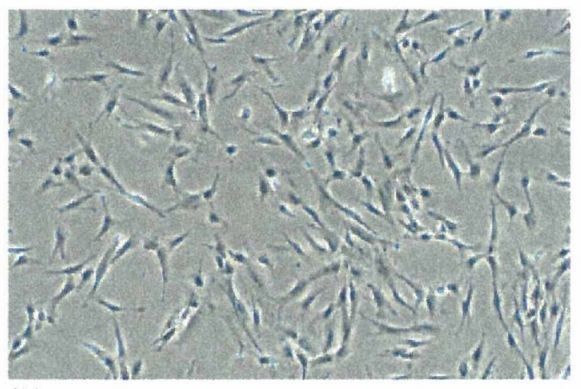 
图1：相差显微镜下具有增殖活力的衰老前期细胞
 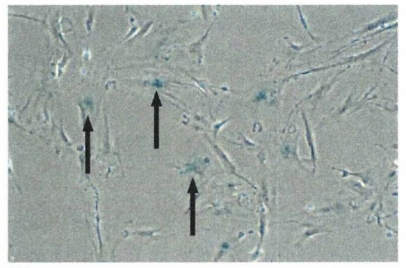 
图2：衰老细胞能特异性表达酸性β-半乳糖苷酶（箭头所示蓝色）
 

 
虽然大多数细胞在体外复制次数有限，但胚胎干(ES) 细胞在适当条件下，可以分化为人体内所有的已分化的细胞谱系。在体外培养时，如果提供合适的营养，这些细胞会展现无限增殖的潜能，即永生化（这个词有些误导性，因为真正永生化的是ES细胞谱系而不是单个的ES细胞）。
 
在胚胎形成的最初期，细胞具有无限扩增的能力。但是机体内特定的细胞谱系（如皮肤成纤维细胞、神经元细胞及乳腺上皮细胞）形成后，它们似乎已经被设定了胚后期的倍增次数。肿瘤细胞的增殖能力至少在表面上看起来是与ES细胞相似的。在体外培养多种肿瘤细胞时，只要提供合适的培养条件，它们就能够进行无限增殖。
 
人体赋予自身细胞谱系有限次数的生长分裂循环是一种肿瘤防御机制。例如，如果细胞要经过100代的增殖才有可能形成临床可检测的肿瘤，那么很多初始阶段的肿瘤细胞在成功形成这样大的肿瘤之前就会耗尽50次或60次增殖的正常配额。
 
衰老的开启伴随着两个重要的CDK抑制分子 p16 INK4A 和 p21 Cip1 表达的升高。这些CDK抑制分子能够阻止细胞周期的进展，使细胞进入非生长状态。外源性表达 p16 INK4A , 可使细胞形成与衰老细胞相似甚至一致的细胞生物学状态。p53也许同样能促进衰老的发生：p53的表达水平在小鼠胚胎成纤维细胞(MEF)衰老时会升高10-40倍。一旦诱导p53高表达，似乎就能通过抑制细胞生长（通过 p21 Cip1 ) 来阻止细胞进一步增殖。
 
异常表达SV40大T抗原（LT）可以使培养的人类细胞避免衰老（常称为“复制性衰老" ) 。LT能够通过结合pRb和p53并使之失活, 使细胞避免进入衰老状态。在大多数人类肿瘤中，由pRb和p53这两个肿瘤抑制蛋白所控制的信号通路经常是失活的。因此，当癌细胞从瘤组织中分离出来进行组织培养时，之前在体内发生的Rb和p53通路的失活可能有助于细胞适应体外培养条件而避免衰老。
 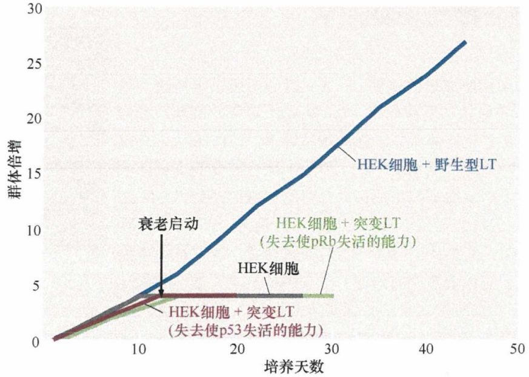 
图3：大T抗原 (LT) 在抗衰老中的作用

酸性β-半乳糖苷酶（SA-β-gal）是一个广泛应用的衰老标志物，其表达于衰老细胞中。通过这个标志物可以证明细胞衰老不仅仅是体外人工培养的结果，它也会在体内发生。此外，位于人衰老细胞核内的异染色质簇集（SAHF）也是细胞衰老的特异性标志物。
 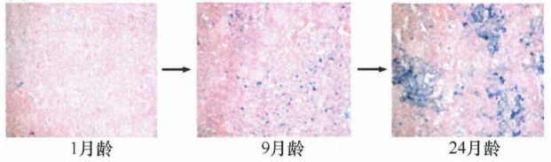 
图4：大鼠肾脏组织进行β-半乳糖苷酶 (蓝色）检测

另一个衰老标志物与染色质有关。作为双链DNA断裂反应，断裂处两侧染色质的大片区域携带有经过修饰的组蛋白，称为γ-H2AX，组蛋白被修饰过的染色质能吸引适合的DNA修复蛋白。这些γ-H2AX簇集也出现在衰老细胞中。由X射线引起的γ-H2AX通常会在射线诱导的dsDNA断裂被修复后消失。但衰老细胞中的γ-H2AX则会持续存在，意味着它们代表了累积的不可逆的DNA损伤。
 
除了体外培养应激，一系列其他细胞生理性应激也能诱导细胞进入与复制性衰老一样的细胞状态。这些生理性应激包括由高氧（即超过正常氧分压导致细胞内的氧化应激）、内源性活性氧物质 (ROS) 、X射线、化疗药物及功能受损端粒所导致的 DNA 损伤，以及某些癌蛋白的异常信号转导。
 
体内很多条件可以引起细胞衰老。对于癌症来说，衰老是肿瘤发展的重要屏障。例如，ras癌基因能够诱导衰老，这意味着衰老是一种自发的细胞反应，能够中止获得癌基因活化的细胞继续增殖，进而阻止肿瘤发生。由于进入衰老状态通常不可逆，因此衰老也许和凋亡一样能够有效阻止肿瘤的发生。
 
矛盾的是，细胞衰老也能够以一种完全不同的方式促进肿瘤生成。衰老细胞能够释放一系列促炎性细胞因子，包括白介素、IGFBP及TGF-β等。细胞因子的释放是衰老相关分泌表型 (senescence-associated secretory phenotype, SASP) 的一个表现，其中一些细胞因子中以自分泌的方式来促进细胞衰老，也有一些以旁分泌的方式招募固有免疫系统中的促炎性细胞。这些促炎性细胞在促进肿瘤进展中扮演主要角色。衰老细胞能够持续数周甚至数月而不是很快消失（如进入凋亡状态的细胞），这意味着衰老细胞能够在很长一段时间内释放炎症信号，从而扰乱周围组织微环境。
 
**危象**
 
以人类胚胎肾细胞为例，表达SV40大T癌蛋白能够使细胞绕过第一个障碍——衰老, 但仍然不能使这些细胞获得永生化。当这些避开衰老的细胞再经过数代增殖后（也许比通常进入细胞衰老时的代数再多10-20代），细胞群体就会进入危象期，并出现大规模细胞凋亡。即使SV40大T抗原具有潜在p53失活功能，也无法使逃脱危象相关的细胞凋亡。衰老细胞虽然停止了增殖，但在相当长一段时间内保存了细胞的生存能力，而细胞危象则是细胞凋亡产生的细胞死亡。衰老细胞似乎仍然具有相对稳定的（但不完全的）核型，但是危象状态的细胞出现了广泛的核型紊乱。
 
每个哺乳动物染色体都包含着一条极长的DNA分子（从1号染色体的约247Mb到21号染色体的约47Mb)。然而一旦线性DNA分子导入细胞，在多种核酸酶和DNA连接酶作用下，其末端会迅速发生融合，这些酶在大部分哺乳动物细胞中都有活性。虽然线性DNA在细胞中本来就不稳定，但是染色体中的线性DNA分子却能持续存在。
 
位于染色体末端的端粒解释了线性DNA分子是如何与细胞中的多种DNA修饰酶稳定共存的。端粒扮演着阻止染色体末端融合的角色，这样就防止了染色体之间的彼此融合。
 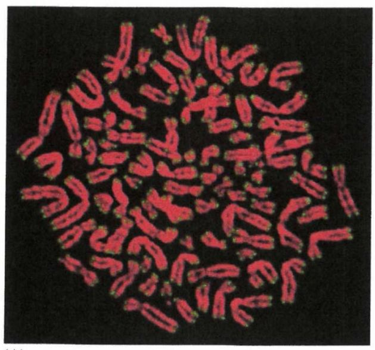 
图5：荧光原位杂交 (FISH) 检测端粒（黄绿色点）

末端失去功能性端粒的染色体彼此之间将会迅速发生末端-末端融合。融合后产生的巨型染色体含有两个或多个着丝粒。着丝点是染色体上的特殊结构，在有丝分裂过程中附着在纺锤体上。例如，在细胞中维持端粒正常结构的关键蛋白TRF2失活后, 端粒失去保护功能（虽然端粒DNA仍然存在），导致所有的染色体末端与末端融合，从而形成一个巨型染色体。如下图所示。
 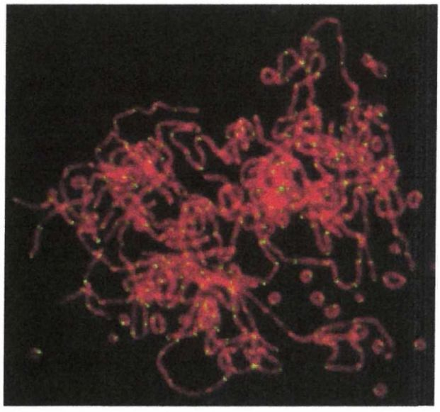 
图6：TRF2失活形成的巨型染色体

细胞中每个端粒DNA由5'-TTAGGG-3'六核苷酸重复序列构成，它们会串联重复数千次。这些重复序列和相关蛋白一起形成了功能性端粒。正常细胞中的端粒DNA在细胞周期的分裂增殖中呈渐进性缩短，最终因为端粒太短而不能有效保护染色体末端, 此时就会发生细胞危象、染色体融合及广泛的细胞凋亡。因此在这些细胞中，缩短的端粒记录了细胞自早期胚胎起源开始所经历的细胞增殖代数。
 
对感染Epstein-Barr病毒后逃避体外培养所致衰老的人淋巴细胞进行传代培养，每次传代都将部分细胞保留用于进行端粒DNA分析。每次传代意味着3-6次细胞群体倍增。通过使用一些限制性内切酶处理基因组DNA来测量端粒长度，这些限制性内切酶不会切开构成端粒DNA的"TTAGGG"重复序列，但是会剪切染色体除端粒外的DNA。经过此处理后剩下的唯一高分子量基因组片段即为端粒限制性片段(TRF)。因为细胞间端粒长度不同，每个细胞间端粒DNA缩短的程度也不同，所以每个样本中端粒DNA的长度异质性很大。如图所示，非永生化人淋巴细胞的TRF在每次细胞传代后会缩短50-100bp。当TRF长度小于3kb后，细胞进入危象状态。当细胞摆脱危象状态（即永生化）后，其端粒长度保持在比危象状态细胞端粒稍长的状态。
 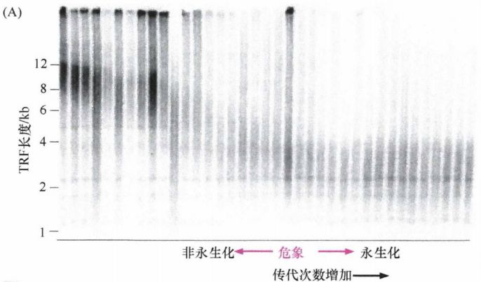 
图7：端粒 DNA 缩短与细胞增殖
 
进入危象状态的细胞，起初的染色体末端-末端融合事件通常发生在同一条染色体的两条姐妹染色单体之间。成对的染色单体出现在细胞周期的G2期到S期（此时细胞从亲本染色体产生两条染色单体）之后、M期（两条染色单体分离）之前。融合更倾向发生在姐妹染色单体末端（而不是两条不相关染色体末端），至少有以下两个原因：第一，由于拥有联合着丝粒，两条姐妹染色单体及其末端在空间上非常贴近；第二，不同染色体臂的端粒DNA由于未知的原因，其缩短速度不同。在DNA复制时重新合成的两条同源的端粒DNA( 如人类9号染色体的染色单体长臂末端上的成对端粒）拥有完全一致的分子结构。因此，如果一条染色单体的端粒末端缩短、损伤及变得易于融合，另一条姐妹染色单体的端粒末端很可能处于同样的状态。
 
在随后的有丝分裂中，这些融合的染色单体的两个着丝粒随着纺锤体迁移而向相反方向移动, 由此形成显著的 分裂后期桥 , 这经常出现于端粒广泛受损的细胞中。有丝分裂的动力作用最终使双着丝粒的染色单体（即一个染色单体拥有2个着丝粒 ）在某个随机位点发生断裂，产生两个新的染色体末端。这些新形成的末端都没有端粒，很容易发生彼此融合，或与其他非同源染色体的无端粒末端发生融合。
 
缺陷的、没有端粒的染色体末端与另一个（非同源的）染色体末端融合的事件会形成含双着丝粒的新染色体，这种新染色体在下次有丝分裂时的命运更不容乐观。一种情况是，两个着丝粒不发生断裂而被拉向同一个方向，朝着某一个即将形成的子代细胞移动。另一种情况是，这种染色单体的两个着丝粒分别附着在两个纺锤体上，被牵拉到细胞的两级。在有丝分裂后期染色单体彼此分离时，第二种情况下的染色单体将会再次遭受损伤，会发生染色单体的分离及形成无端粒保护的染色体末端。这些序贯性事件被称为断裂-融合-桥(BFB)循环。一旦发生这些，BFB循环将会造成细胞核型紊乱，从而影响到细胞内的许多染色体。
 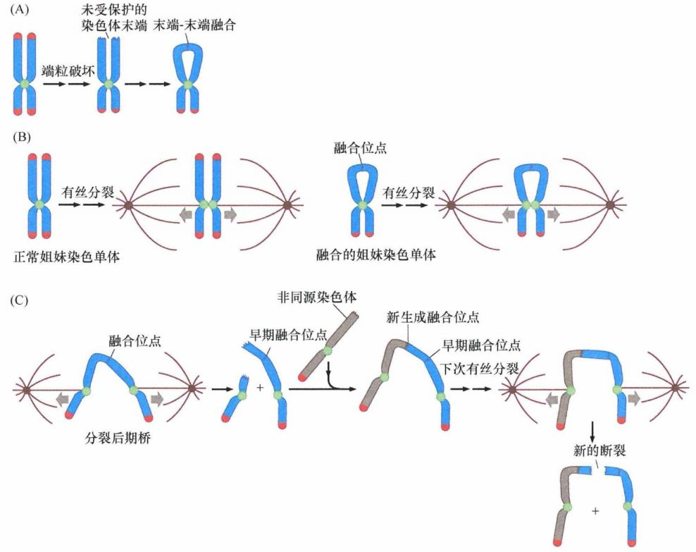 
图8：染色体断裂－融合－桥连接机制

这一期关于复制性衰老和危象的内容就到这里啦，我们下一期将会详细阐述端粒的结构及其功能~

 参考书目： 《The Biology of Cancer》（Second Edition）  R.A.Weinberg  著，詹启敏 等  译 
 编辑： 张月明 周健 
 校审： 张健 罗鹏 

 
 
 ***欢迎点击下方图片进行留言，说出你的看法哦~***
 

# 第十章_2_《癌生物学》第十章（2）端粒和端粒酶

 
**前言** ：上一期我们已经介绍了肿瘤细胞无限增殖面临的两个障碍。今天我们主要是学习“ **端粒** ”和“ **端粒酶** ”的相关内容。相信通过本期的学习，我们对端粒和端粒酶的理解会更上一层楼~
  
**端粒的结构** 

在哺乳动物细胞（以及许多其他后生动物细胞）中，端粒由重复的六核苷酸序列组成，其中一条链(富含G)上为5'-TTAGGG-3', 互补链上(富含C)为 5'-CCCTAA-3'。在正常人体细胞中，端粒DNA由数千个重复的六核苷酸序列组成，在染色体末端形成5-10kb 长的序列重复片段。
 
端粒DNA通常为5-10kb长。在功能性端粒DNA(中间)与非端粒染色体DNA(最左侧）之间还存在着亚端粒DNA区域。亚端粒DNA区域里含有TTAGGG类似片段，但并没有染色体末端保护功能。然而，由于亚端粒DNA含有端粒类似序列，它通常也是端粒限制性片段(TRF)的组成部分。但是只有单纯的端粒重复片段能够保护染色体DNA末端：当单纯串联重复片段的重复次数减少到12次以下时就会丧失末端保护功能。因此，即使仍然有数kb长度的TRF存在，但端粒已经丧失了阻止染色体DNA末端融合的能力。
  
图1：端粒DNA的结构
  
特殊的是，富G链多出一百至数百个核苷酸，导致该链3'单链端外悬。这种凸出的链会形成一种最不寻常的分子构型——t环。当时通过电子显微镜分析端粒DNA时发现了一种环形结构，实质上是套索结构。这种构型的形成依赖于三链DNA复合体的形成 。有可能所有端粒DNA的末端均含有 t 环，但是由于在电子显微镜下保存和观察此结构的技术上的限制，只有一部分端粒在电子显微镜下可以观察到 t 环。t 环有助于保护线性DNA分子未端，因为单链末端的外悬区被巧妙地塞进双链区域，以保护其免受损伤。
 
下图为 t 环的示意图，显示了 3'端凸出的富G链(粉色)与富C链(蓝色)的小段区域退火形成詈换(D环)(粉色链)。图中箭头方向为 5'→3'。
  
图2：t 环结构

下图再次显示了t环，3'端伸入染色体形成双链螺旋，在图中用粗线标明(粉色)。
  
图3：t 环结构

相对较长的双链端粒DNA和相对较短的外悬单链末端都与特定蛋白质相结合。这些蛋白质中含有能够特异识别并结合该六核苷酸序列的结构域，能够与端粒DNA的双链和单链区结合。端粒结合蛋白、尚未被发现的相关蛋白及端粒DNA一起构成的核蛋白复合体就称为端粒。构成端粒复合物的一些端粒相关蛋白能保护端粒免于降解。其中，TRF1和TRF2能够结合端粒的双链DNA部分，而第三个蛋白POT1既能结合富G链的 3'端外悬单链，又能与置换环(D环)的单链DNA结合。
  
图4：端粒复合物

每个端粒中会出现多个端粒复合物，它们负责t环的结构维持。如下图所示，POT1通过和D环结合能够维持其结构稳定性并维持 t 环结构完整性。
  
图5：端粒复合物

在细胞周期的S期，复制机制能高效地复制线性DNA分子中间的序列，即染色体的主体部分，但复制染色体末端序列是极其困难的。困难之处在于所有DNA链的合成必须从已有DNA的3'羟基端开始，DNA3'羟基端以与引物相似的方式来延伸核DNA链。如果没有可用的DNA引物，则以RNA分子的3'端作为DNA合成的引物。
 
如果引物酶（其作用是安置RNA引物）恰巧在距模板链 ( "滞后链合成”发生处）3'端的一定距离处放置了一个RNA引物，那么DNA聚合酶新合成的DNA链的 3'端将缺少一定数量与模板链互补的碱基。即使引物酶恰巧位于模板链的末端，并合成了一条RNA引物，在新合成的子链中仍缺失大约10个核苷酸，这正相当于RNA引物的长度，因为RNA在引物完成起始DNA延伸的使命后就被降解了。最后的结果是DNA两条模板链的其中一条末端的核苷酸序列不能被适当复制。
 
在正常DNA复制过程中，亲本的双螺旋DNA在解旋酶作用下解开，使得复制过程持续进行。新合成的滞后链由短的RNA引物片段引导，引物酶按数百个核苷酸的间隔依次安置这些RNA引物。RNA 分子的3'羟基端作为新合成子链的起始。在这些 RNA 引物尚未移去、片段尚未融合之前，这些片段称为冈崎片段。因为合成按5'→3'方向进行，所以滞后链的合成与延伸的方向和复制叉前进的方向相反。而另一个亲本链的复制由于延伸方向和复制叉的移动方向一致，能够连续进行复制，随着亲本链的解旋向3'端延伸。下图中每条链5'→3'的方向由箭头指示。粗线代表亲本DNA链，细线代表新合成链。
  
图6：正常DNA复制

由于以上原因，前导链DNA的合成将会一直进行到端粒的末端，产生和原来端粒DNA序列一致的拷贝。然而，滞后链的合成需要用到端粒末端DNA (环状）附近对应的RNA引物。由于此RNA引物随后会被移除，而且它也未必确定位于蓝色模板链的末端精确互补，因此最终合成的DNA链是缺少一段亲本链的互补序列的，最后造成部分亲本链DNA(粗线，蓝色）没有被复制，以及子代细胞基因组中端粒DNA序列的丢失。下图中每条链5'→3'的方向由箭头指示。粗线代表亲本DNA链，细线代表新合成链。
  
图7：端粒DNA的复制

末端复制的问题可以解释正常细胞每一次分裂后端粒DNA的缩短。除了端粒DNA末端的复制不足，细胞中核酸外切酶也会对端粒DNA的末端造成损坏，其最终所导致的端粒末端侵蚀也许会更大。无论何种原因，在许多类型的正常人类细胞中，细胞每分裂增殖一代端粒将会丢失50-100bp的DNA。这种对端粒DNA的持续性破坏是限制细胞传代能力的分子机制。
 
**端粒酶**
 
早期癌细胞可以通过表达端粒酶逃脱细胞危象。端粒酶能特异地延长端粒DNA。通过端粒重复序列扩增实验(telomeric repeat amplification protocol, TRAP) 进行检测发现，在85%-90%的人肿瘤细胞样品中都能检测到端粒酶活性，而其在正常细胞中水平很低。低水平的端粒酶活性，虽然能最低限度地维持端粒DNA的稳定(如修复 t 环或使其再生)，但不能阻止每一次正常细胞周期复制分裂过程中端粒的进行性损耗。
 
一般成人正常细胞中观察到的端粒酶活性都很低，但也有例外。例如，睾丸的精子细胞中存在高端粒酶活性，功能性活化的淋巴细胞也会表达高水平端粒酶。端粒酶在早期胚胎生成过程中高表达，而在随后细胞分化形成机体组织过程中大幅减少。人体大多数细胞中虽然含有端粒酶的全基因序列，却因不能足量表达此基因而表现出该酶的活性。
 
哺乳动物细胞端粒酶全酶的核心由两个亚基组成，即hTERT(human telomerase reverse transcriptase) 催化亚单位和与之相关的hTR RNA亚单位（构成功能性全酶还需要5个其他蛋白质，有的蛋白质出现两个拷贝)。hTERT催化亚单位为DNA聚合酶，更确切地说是逆转录酶，其作用与逆转录病毒产生的逆转录酶、其他一些病毒和转座元件类似，能以RNA为模板合成DNA。但是与其他逆转录酶不同，端粒酶巧妙地组装自身RNA模板即hTR RNA亚单位(由415个核苷酸长度的RNA分子)的一小部分作为模板来指导全酶的逆转录活性。
 
hTERT催化亚单位能够合成与端粒酶相关RNA分子(hTR; 其编码基因有时被称为TERC) 中六核苷酸序列互补的DNA分子，使这些核苷酸结合到端粒DNA 3' 端富G链外悬区域。端粒DNA的互补链据推测由常见DNA聚合酶生成 。
 
下图中，全酶附着在3'端富含G凸出末端(粉色)，部分通过hTR的氢键结合到富含G链的最后5个核酸上。因此通过对hTR亚单位序列的逆转录，hTERT能够以每次6个核苷酸的形式使富含G链延伸(黑色)。通过重复每次增加6个核苷酸这个过程，该酶能在富含G链上延伸成百上千个核苷酸。箭头方向为 5'→3', 在完成延伸后，传统的DNA聚合酶会结合到互补链(蓝色)完成DNA合成。
  
图8：人端粒酶全酶的结构

在细胞即将进入危象状态之前，转染hTERT基因的cDNA,可诱导细胞端粒酶活性并促使已明显缩短的端粒得以延伸，阻止细胞进入危象状态从而使细胞永生化。
  
图9：表达端粒酶可阻止细胞进入危象

该实验及类似实验结果支持三点结论。首先，端粒酶的全酶可能由多个不同的亚单位构成，在正常危象前人类细胞中仅仅缺失了hTERT基因编码的催化亚单位；端粒酶全酶的其他亚单位(包括hTR端粒酶相关的RNA分子）在危象前细胞中都是足量存在的。其次，端粒酶的表达(而不是其他酶)使细胞逃过危象，并且端粒酶特异地作用于端粒DNA上，这些观察表明危象的关键原因之一就是端粒的极度缩短。最后，该实验显示端粒酶活性的获得(如在一些处于危象状态的细胞群中仅有极少数的变异细胞可自发地获得端粒酶活性)足以使细胞逃脱危象并使其子代细胞获得永生化能力。
 
端粒酶活性对肿瘤细胞增殖能力的重要性还通过导入反义RNA降低端粒酶活性和催化能力丧失的hTERT酶突变体(dn hTERT)的实验得到了验证。值得注意的是，端粒酶阳性细胞一旦进入危象后，将观察不到dn hTERT酶对细胞增殖的作用，这就排除了另一种可能性：酶突变体本身具有细胞毒性，其对细胞的作用可能是非特异性的毒性损伤。
 
为了合理解释上述结果，研究者提出“汽车模型”的比喻来解释人类肿瘤细胞的生长：癌基因激活被形象地比喻为踩油门，而抑癌基因失活被比作刹车系统失灵，端粒酶好比是高速公路上的加油站，为一路前行的汽车提供汽油。
 
**ALT机制**
 
85%~90% 的人肿瘤细胞中端粒酶为阳性，而其余 10%~15% 的肿瘤细胞缺乏可检测到的酶活性。然而，这类肿瘤细胞也能维持最短的端粒长度，满足无限增殖的需要。事实上，这些细胞大部分可通过端粒延长的替代(alternative lengthening oftelomerase, ALT) 机制保护端粒，使细胞存活下来。ALT是一种不依赖端粒酶活性的端粒长度维持机制，少数缺乏端粒酶活性的人肿瘤细胞可利用ALT维持端粒长度。
 
ALT细胞中维持端粒的一种可能机制就是端粒间的序列信息交换(如下图所示), 这一点可能基于染色体复制过程中DNA聚合酶作用依赖于多条染色体模板。一个端粒(棕色和绿色，左下)延伸3'突出末端 (绿色)，取代了另一染色体端粒上相同极性的一条链(粉色)，使3'突出末端退火结合到后一条染色体端粒的互补链上(蓝色)。常规DNA聚合酶能以互补链(蓝色)为模板延伸这条链(绿色虚线)，随后，富含G链从蓝色互补链(蓝色)上解离出来。新延长的富含G链可被常规DNA聚合酶转化成双链形式(棕色虚线，右下)。这个过程可被重复数十次，导致序列信息从一个端粒传递到另一端粒上，最终在无端粒酶存在的情况下，端粒长度延长数千个碱基。实际上，就是DNA聚合酶借用另一个染色体的序列作为模板，并将其序列信息整合到第一个染色体新合成的子链中。
  
图10：ALT的替换机制

此外，ALT细胞中也会发生端粒之间的不平等交叉互换机制交换序列片段，导致一个端粒长度增加而另一个端粒长度减少，这或许可解释这些细胞中为何端粒的长度极不稳定。
  
图11：ALT的不平等交叉互换机制

我们仍未能成功在ALT阳性的人肿瘤细胞中鉴定维持端粒结构的酶。一些涉及DNA修复的酶可能维持了ALT细胞的端粒长度。
 
ALT 的存在说明：所有人肿瘤细胞都必须通过使端粒长度维持超过一定阈值的途径来保持细胞的永生化增殖。大多数肿瘤细胞通过解除对hTERT基因表达抑制，少数早期癌细胞可通过激活ALT而发挥作用。另外，ALT也可在正常淋巴细胞的特定类型中起作用。
 
然而为何hTERT机制与ALT机制相比更占优势，目前仍不明确。同样不清楚的是为何处于ALT状态的人类细胞端粒DNA的长度多达30kb, 远比那些端粒酶阳性细胞的端粒 (5-10kb)长得多。值得注意的是，dn hTERT 酶可诱导端粒酶阳性的肿瘤细胞进入危象状态，而ALT细胞却没有这样的作用。这些事实支持以下观点：①ALT 阳性细胞增殖不依赖端粒酶；②dn hTERT 酶本身不具有细胞毒性。
 
ALT细胞也可表现出端粒和衰老之间的关系。当ALT细胞体外导入强表达的ras基因(携带有长质粒)时，转化重组细胞较少存活。然而，当强制这些细胞表达hTERT时，大量的转化细胞存活。这表明由ALT 细胞携带的长端粒不能保护细胞免受ras诱导的衰老作用, 而只有hTERT能保证端粒末端的正确组装和维持。此外，胶质瘤患者可通过ALT机制维持端粒长度，比依赖hTERT作用的患者存活时间长。

# 第十章_3_《癌生物学》第十章（3）端粒酶的双重角色
**前言** ：在前两期中我们已经学习了端粒的大部分内容，对肿瘤细胞的增殖机制有了更深入的理解。今天的内容比较琐碎，主要是讲解有关端粒的一些杂七杂八的内容，重点需要理解的是 **端粒酶的双重角色** 。

**端粒在实验小鼠和人类细胞中的不同作用**
 
***01***

啮齿类动物，尤其是那些实验小鼠的细胞，其控制端粒酶表达的方式完全不同。由于某些未知原因，实验小鼠端粒DNA的双链区域长达30-40kb——大约是人类端粒DNA的5倍长度。事实上，实验鼠的端粒如此之长，在其一生中都不存在端粒被破坏而降解至临界点的危险，甚至通过实验抑制端粒酌的表达也不能使其缩短。小鼠端粒的长度允许其细胞谱系经历更长的传代次数，超过肿瘤一般形成所需的时限。然而，小鼠体细胞中高水平的端粒酶活性和较长的端粒长度仍旧不足以使肿瘤细胞在此类物种中迅猛增殖。这提示实验小鼠不依赖端粒长度来限制正常细胞谱系进行复制，而且端粒的破坏也并不是促进咄齿类动物肿瘤发生的机制。
 
在某种程度上，来自实验小鼠的细胞在离体培养时，具有有限的增殖能力，而这个能力并不取决于端粒的长度。事实上，鼠类细胞在培养基中进行繁衍时能相对容易地获得永生化(筛选逃避衰老而自发永生化的离体细胞)。而与鼠类细胞不同，人类细胞需要SV40的大T癌基因(逃避衰老)和hTERT基因(逃避危机)同时导入才能使细胞永生化。另外，离体培养的小鼠细胞较少发生衰老可能是因为它们体外培养时不能产生衰老相关异染色质簇集(SAHF), 而人类细胞容易发生。
 
引入注目的是，人类细胞在其一生中平均大约经历10 16 次的有丝分裂，远比小鼠 10 11 次分裂更具有患肿瘤的危险(即小鼠细胞仅为人类细胞的0.1%, 小鼠平均寿命仅约为人类的1%)。 因此，体型大、寿命长的哺乳动物，如人类，与相对小的、寿命短的物种(如小鼠)相比需要演化一套防御肿瘤的额外机制。
 
mTR阴性表达小鼠与野生型小鼠的表型没有明显区别，这一点进一步证明哺乳动物中端粒酶全酶的作用主要是维持端粒的长度，而对组织发育没有明显影响。(然而，继续表达mTR但不表达mTERT的基因突变小鼠表现出轻微的形态缺陷——一个胸椎转换成腰椎。这一改变显然是由于mTERT蛋白与端粒作用不相关的功能：它结合了转录因子复合体从而使β-catenin激活Wnt信号通路的基因表达，这些研究发现在hTERT也得到了验证。）
 
端粒酶阴性表达的纯合子小鼠(mTR -/- ) 在饲养至少3代以上均未出现表型的变化。 但是，最终在第5代时发现端粒酶阴性的小鼠开始出现明显的表型改变。 经过5代繁殖后，端粒酶缺失小鼠的端粒长度开始缩短。 这些第5代的 mTR -/- 小鼠开始出现病态，缺少创伤修复能力，表明细胞对促有丝分裂信号的反应降低了，出现了早衰症状，包括日渐消瘦，驼背（如下图）。 当繁殖到第6代时， mTR -/- 小鼠这种异常表现进一步加重。 同时小鼠生育能力明显降低。 第6代 mTR -/- 小鼠出生时端粒已经很短，之后也不能维持端粒长度，尤其在有丝分裂活跃的组织中有大量细胞死亡，组织失去功能。 例如，增殖旺盛的组织，如胃肠的上皮细胞、造血系统和睾丸组织，开始明显地萎缩（细胞数减少）。 这些异常现象与小鼠的遗传学特征并不平行，因为将突变导入生殖细胞中，上述表型在5代或6代之后才出现。
 
图1：mTR-/-小鼠多代繁殖后发生端粒侵蚀损耗和表型改变

同时，这些结果进一步显示了人与实验性突变小鼠之间端粒的差异。人类端粒原始长度相对较短，在经历第1代繁殖后，失去端粒酶活性在第1代繁殖后就会产生严重机体表型导致严重的后果。
 
此外，端粒酶功能缺陷还与一种人类家族性综合征——先天性角化不良(dyskeratosis congenita, DC)有关。DC患者的许多组织萎缩，其原因可追溯到端粒酶功能缺失或端粒的严重破坏，使原来再生能力强的组织，如皮肤、骨髓等不能再生，同时伴有染色体稳定性降低。一些个体骨髓造血干细胞再生能力丧失，导致造血系统破坏, 有些患者最后因为端粒破坏而患白血病。

**端粒酶阴性小鼠既能增加也能降低肿瘤的易感性**
 
***02***

实验小鼠易感自发性肿瘤，大部分为淋巴瘤和白血病。编码 p16 INK4A 和 p19 ARF 的抑癌蛋白同时被抑制，可以产生易患癌的小鼠。将 p16 INK4A / p19 ARF 失活的生殖细胞导入缺少mTR的小鼠。在对照组，端粒酶阳性、 p16 INK4A /p19 ARF 阴性的小鼠有64%发生肿瘤，而在第4、5代 mTR -/- p16 INK4A / p19 ARF 阴性的小鼠仅有31%发生肿瘤。 通过观察小鼠16周的生存率，88%端粒酶阳性小鼠因患肿瘤而死亡，而端粒酶阴性的第5代小鼠仅有46%死亡，差异具有显著性。 端粒酶阴性小鼠患癌率 低 表明， mTR -/- 小鼠的正常组织在肿瘤发生前已经耗尽所有复制能力。 这些小鼠体内一旦启动肿瘤，初始的肿瘤细胞群在形成肉眼可见的肿块前就必须经过许多代的增殖。 然而，在肿瘤发展的相对早期，这些具有增殖潜力的肿瘤细胞因端粒破坏而启动衰老，肿瘤发生消退。 

 
敲除生殖细胞两个拷贝p53基因的小鼠表现完全不同。通常，在p53 -/- 小鼠引入mTR基因突变，使小鼠生殖细胞p53失活导致患癌风险和死亡率增加。 分析第5、6代 mTR -/- 伴有 p53 -/- 小鼠的细胞基因组，发现其肿瘤形成率明显 高 于单纯 p53 -/- 小鼠而且肿瘤类型从 p53 -/- 小鼠常见的淋巴瘤和血管肉瘤扩大到人类常见的肿瘤，这一发病趋势在第7、8代端粒阴性的小鼠中更为明显。 

 
可以设想由于第5、6代小鼠的细胞耗尽端粒，细胞染色体开始进入BFB(断裂-融合-桥)循环,之后出现衰亡。已经明确BFB循环造成的双链DNA断裂诱导的凋亡依赖于p53，因此，携带正常p53基因并进入BFB循环的细胞可能迅速从组织中消失。当第5代或第6代的 mTR -/- p53 -/- 小鼠经过BFB循环时，为了生存，需要修复染色体DNA断裂损伤。然而，许多细胞由于缺乏关键的促凋亡反应机制——p53而得以存活下来。尽管染色体核型紊乱，但这些细胞仍然保留着细胞生长和分裂能力，而且这些细胞的染色体能持续数周BFB循环。
 
p53缺失而不能诱导细胞凋亡，使这一恶性循环不断在细胞中反复进行。结果在BFB过程中出现大景染色体易位，而导致细胞的基因组不稳定。而基因的不稳定可增加促癌基因结构的发生。此外更重要的是，有证据表明，双链DNA(dsDNA)断裂会导致断裂处附近染色体的扩增或缺失。
 
尽管还没有证据证明BFB循环会对p53阴性细胞产生致命影响，但这种恶性循环一定会影响细胞的增殖能力。这意味着单个细胞要面临很大的选择压力来逃脱BFB循环并恢复核型的稳定，一旦完成这一过程，细胞便能快速增殖。由于生殖细胞中mTR基因已被敲除，在这些小鼠细胞中端粒酶不再被激活。基于这点，一旦细胞通过旁路激活ALT端粒维护系统，这些细胞就能稳定祖细胞失去端粒后造成的异常核型而使细胞重新保持增殖状态。
 
前面提到，在先天性角化不良患者中，一旦进行骨髓移植使崩溃的造血系统成功重建，常常会导致发生肿瘤，一些发展成血液恶性肿瘤(诸如骨髓不典型增生和急性髓细胞白血病)或胃肠道肿瘤。肿瘤发生在持续快速增殖的组织中，这些组织正是端粒酶活性缺失导致端粒迅速破坏的部位，最终导致BFB恶性循环。

**端粒酶阴性小鼠的肿瘤发病机制可能同样适用于人类肿瘤**
 
***03***
 
在肿瘤演进的早期阶段，p53抑癌基因的失活是有利于细胞生存的，因为这样能帮助初始肿瘤细胞逃避凋亡(凋亡原因包括癌基因的激活、血管不足造成的营养匮乏、缺氧、代谢物毒性)。随后，在肿瘤演进过程的癌前细胞群体中，端粒DNA破坏到不能保护染色体末端的水平时，BFB循环发生，导致染色体重排，在断裂点附近出现DNA扩增或缺失。经过BFB循环的细胞将通过p53诱导凋亡的途径被清除，然而，当p53功能缺失时，这样的细胞将会生存下来。尽管伴有核型异常的细胞其增殖速度会降低，但其不易发生凋亡。这类细胞的产生将会形成更多的变异体，这些变异的细胞会再生端粒和维持核型稳定，并获得快速增殖的能力。在突变的 mTR -/- 小鼠细胞, 通过ALT端粒维持系统激活而获得端粒稳定性，而在野生型(例如，mTR +/+ ) 机体(包括肿瘤患者)中使hTERT再表达，可允许端粒重建并保持适当的端粒长度。 一旦端粒在所有染色体末端再生，因BFB循环而导致的进一步核型异常将会受阻。 但是，前期已经生成的任何核型异常将会被保留下来并传递到子细胞群体中。 这一模型对广泛存在于人类肿瘤细胞中的非整倍体核型现象给予了明确的解释。
  
图2：BFB循环促进人肿瘤形成的机制模型
 
人胰腺癌演化过程的研究为这一模型提供了依据。在多阶段胰腺组织癌变过程的早期，在低级别腺瘤的有丝分裂细胞中，少量的后期桥是BFB循环的标志。然而，在发展到重度不典型增生的腺瘤细胞中出现了大量的连接桥。之后，在更晚期的原位癌中，后期桥的水平再次降低。此外，某些慢性炎症如溃疡性结肠炎、Barret 食管炎及被乙肝或丙肝病毒感染的组织，可能与癌症风险增加有关，也可能与端粒破坏和BFB循环有关。

# 第十一章_1_《癌生物学》第十一章（1）__肿瘤多阶段发展

“正常个体的组织细胞通过演化并逐步发展成具有恶性表型的肿瘤，这一过程称为肿瘤进展。进化过程使正常细胞和肿瘤细胞之间建立了一系列的屏障，肿瘤进展过程中所完成的每一步都可以看作是癌前细胞克隆性生长的屏障被破坏的过程。 前面的大多数章节主要讲述的是肿瘤发生过程中某些单独的细胞防癌控制系统，现在我们将这些单独的线索综合起来，看看到底这些系统的改变是如何促进肿瘤形成的。 ”

1、 大多数人类癌症的发生发展需要数十年时间

流行病学调查显示，年龄是癌症发病的一个重要因素。在美国， 70岁男性死于结肠癌的风险比10岁儿童高出大约1000倍 ， 包括 结肠癌 在内的许多常见癌症同样需要经过几年或几十年的发生与发展。

图 11-1-1： 不同年龄阶段的癌症发病率

在五十岁后，大多数 典型 类型 的 肿瘤发病率随着年龄的增长急剧增加 。 然而，特定癌症的年龄发病率并不遵循这一规律 ，如：睾丸癌。

图 11-1-2： 睾丸癌发病率随年龄的变化

这些不同的肿瘤行为表明，研究肿瘤形成的动力学机制和发生率，还需要考虑除不断增长的年龄以外的其他因素 。如： 致癌物质增加了特定肿瘤进展的速度，比自然背景下的肿瘤进展速率快许多个数量级 。

2、 多阶段致癌学说的组织病理学依据

人类肿瘤发生发展的多阶段性概念在肠上皮组织中已经被阐述得很清楚了。

上皮细胞层是大多数结肠癌发生病理变化的位置。结肠癌病理活检分析可以显示多种组织形态，从几乎很难与正常组织区分的轻度恶变到多种细胞混杂的高度恶变。这种由多种组织形态组成的结构很难与正常肠黏膜（结肠腔内层结构）区分开，逐渐形成高度恶变的组织。与正常的肠道上皮一样，这些肿瘤也由各种不同的细胞类型构成，事实上几乎正常组织中存在的所有类型细胞在肿瘤组织中都有存在。

一些增生性病变表现出几乎正常的组织学形态，这些细胞的外观和正常细胞相同。然而，这些增生区域的上皮细胞具有显著的分裂能力，从而形成比正常情况下更厚的上皮细胞层。但是有些其他的增生细胞却表现出异常组织学形态，如结肠黏膜上皮细胞不再形成规则的细胞层，个体细胞 的形态与正常细胞存在不同程度的差异。这类细胞增殖称为不典型增生。当进一步增殖会使赘生物体积更大、结构异常更明显，细胞内包含不典型增生细胞且细胞层显著增厚，此时的赘生物称为息肉或腺瘤。在结肠中存在着不同类型的息肉：有些沿着结肠生长，有些通过蒂与结肠壁相连。通常认为这些赘生物是良性的，它们都没有突破基底膜而浸润到基质组织。细胞形态异常更加明显的赘生物如果突破基底膜并向下浸润即认为是恶性组织。这些恶性程度较强的结肠癌与相关癌细胞之间是有分级的，其分级主要依赖于细胞是否侵入基质层和平滑肌层，以及这些增生物中的细胞是否迁移转移至解剖学上的机体远处位置。

图 11-1-3： 人类结肠癌组织的病理学形态改变

将这些演进中的组织表型从正常发展到具有侵袭性进行排序，可以看到这种演进过程精确地描述了结肠中肿瘤发展的实际情况。

图 11-1-4： 不同器官部位的多步骤肿瘤发生过程

此外，有人对进行结肠镜检的大规模患者人群进行了临床研究。在这些患者中常规进行结肠镜检 以监控结肠偶尔发生的腺瘤性息肉，并在一旦发现的时候将其切除。在一项研究随访中发现，那些被切除了息肉的患者在多年后其结肠癌的发生率降低了 80%。这一结果表明，在这一人群中，至少80%的结肠癌来源于已经存在的、可检测到的腺瘤。（这些研究不足以证明所有人类的结肠癌都是由已经存在的腺瘤发展而来的）

3、 肿瘤进展过程中会不断积累遗传学与表观遗传学变化

遗传进展与表型进展之前的平行性最初来源于对人类结肠癌的研究。

约翰霍普金斯大学医学院的研究者们得到许多证据表明诸如 ras和p53之类的等位基因突变会在体外的实验条件下导致细胞转化。因此，他们又进一步确定是否能通过检测小结肠腺瘤、中等体积腺瘤、大腺瘤和癌的基因组发现在体内也存在这种关系。令人高兴的是，他们发现 **随着结肠组织从正常至高度癌变进展的过程中，这一系列组织中的上皮细胞会不断积累越来越多的这类基因突变** 。

在这项具有里程碑意义的工作中，研究者发现早期腺瘤就已经表现出 5号染色体长臂（5q) 的杂合性缺失。而对于体积稍大的腺瘤，几乎50%会另外携带突变的K-ras癌基因。而在体积更大的腺瘤中，18号染色体长臂（18q) 倾向于发生高频率的杂合性缺失。几乎一半的结肠癌会在此基础上发生17号染色体短臂（17p) 的杂合性缺失。

图 11-1-5： 染色体杂合性缺失与结肠癌进展

这些结果强烈支持了这样一个观点：在肿瘤进展过程中，随着上皮细胞获得癌变表型，它们的基因组相应表现出越来越多的大量遗传位点改变。这些改变会累及原癌基因激活为癌基因 (K-ras) 及至少三个不同抑癌基因的显著失活，这些基因改变对于结肠癌发生同样重要。这一观点首次提出了我们现在看来是一个相当常见的现象：在人类肿瘤细胞基因组中，失活的抑癌基因数量远远超过被激活的癌基因数量。

在这一遗传事件发现不久就发现了 5号和17号染色体遗传位点包含的抑癌基因。染色体杂合性缺失经常累及的5q21包含的基因是APC(结肠腺瘤样息肉）抑癌基因，染色体17p13区则被鉴定为p53抑癌基因的位点。而结肠癌发生过程中染色体18q区域所累及的抑癌基因还没有鉴定出来。这一染色体区段在60%以上的人类结肠癌中都存在着杂合性缺失，这段区域包含的最可能的抑癌基因是DPC4/MADH4，它编码的Smad4把TGF- β 受体产生的生长抑制信号传递至细胞核内。但是， DPC4/MADH4基因拷贝仅在不到35%的结肠癌中存在着突变或转录抑制，并且它旁边的一个基因Smad2也经常以稍低的频率发生失活。这就使大部分肿瘤中染色体18q上被LOH或其他机制失活的抑癌基因身份难以确定。

图 11-1-6： 抑癌基因与结肠癌进展 ： 80%结肠癌在进展的早期有5号染色体长臂APC基因的失活 ； 35%的病例存在K-ras基因突变 ； 不足 50%病例的17号染色体有杂合性缺失 ； 60%病例18号染色体长臂杂合性缺失 ； 约 30%的结肠癌存在导致TGF- β 受体失活的突变或启动子甲基化

依赖于肿瘤发生的多步骤模型，我们能够理解为什么遗传了突变的 APC等位基因会导致息肉病和结肠癌：作为结肠癌进展的第一步，家族性息肉病患者的所有结肠上皮细胞中已经存在了APC基因拷贝失活，这些患者体内包括结肠细胞在内的所有细胞都是APC +/- 基因型而不是 APC -/- 基 因型。由于在每一代细胞分裂中杂合性缺失是相对高发的事件，家族性腺瘤息肉病患者生命早期就可能会产生上百个、甚全上千个完全失去 APC功能的结肠上皮细胞，从而进入APC -/- 的基因型状态。每个 APC阴性的细胞成长为腺瘤性息肉的可能性都很大，这种息肉一旦形成，就很可能会发展为癌。

肿瘤形成过程中这些多步骤遗传和表观遗传学事件的积累可能表明肿瘤发生的最终细胞产物与它们完全正常的前体细胞（起源细胞）之间的相似性很低。但是，越来越多的研究发现即使经历了几年（如果不是几十年的话）的演变，正常起源细胞的大部分分化程序仍然存在于其癌变子代细胞中。因此，即使肿瘤细胞基因组中的某些致癌改变倾向于导致细胞的分化特征缺失，这一缺失也是不完全的。实际上，大部分肿瘤中都还保留养分化的特征（不同的形态学和蛋白质标志分子），这使病理学家能够相当准确地把这些肿瘤分成不同的类型 。

4 、 肿瘤发生似乎符合达尔文进化论

对于肿瘤进展来说，进化单元是细胞群体中互相竞争的个体细胞，而不是种群中互相竞争的生物 个体。如现代达尔文进化论所描述，随机突变在细胞群体中产生了遗传多样性。一旦产生遗传异质性群体，那些利于细胞在活体组织微环境内生长的特征就会在选择压力下使细胞获得优势生长。

把达尔文进化论与肿瘤进展多步骤理论结合起来，能够把肿瘤发生过程描述为一个序贯的克隆扩增过程：随机突变能产生具有优势生长和生存能力的细胞，这一细胞和它的子代细胞能够比它们周围的细胞更高效地增殖，最终产生一个大的克隆细胞群，从而成为肿瘤组织的主要成分并从遗传上淹没了不具优势的邻近细胞。这一细胞克隆早晚会达到足够大的体积（如 10 6 细胞）使细胞克隆易于随机发生其他具有生存优势的突变（突变频率大约为 l/10 6 )。

图 11-1-7： 达尔文进化论与克隆演进 ： 有机体通过基因组中的突变推动物种的进化，肿瘤进展过程中细胞群体内的可遗传改变可能也发挥了同样的作用

需要注意，肿瘤进展的达尔文进化模型是非常简化的。

首先，必须把基因的表遗传学改变（准确地说是启动子甲基化 ) 在抑癌基因失活中具有重要作用这一发现引入达尔文进化理论。其次，用肿瘤进展过程中受累的遗传位点数量计数来进行估计，我们可能低估了肿瘤进展中所需的不同步骤事件数目。抑癌基因的失活总是衙要两个步骤才能完成，因此肿瘤进展过程中发生的不同改变的数量大约是相关突变位点数量的两倍。

由于这些克隆增殖是由低频率的遗传或表观遗传学改变引发的，这些克隆的扩增很可能间隔很长时间。在散发性结肠癌发生过程中，两个关键遗传改变事件发生之间可能间隔 1年甚至更长时间。对于许多个体来说，整个肿瘤进展过程可能要一个多世纪的时间才能完成。

但是，也有一些人在很短的时间内发生散发性结肠癌，因此在这些个体的结肠中这一程序一定被 压 缩执行了。最近的研究发现肿瘤的多步骤进展发生过程中所发生的突变数景远远超过驱动肿瘤发生所实际需要的突变数量，这使 勾描 肿瘤遗传图谱变得更加复杂了。

# 第十一章_2_《癌生物学》第十一章（2）_对进化论解释肿瘤发展的补充

 
“通过上一讲，我们知道了，肿瘤的发生发展经常需要历经数十年时间。 肿瘤 在 进展过程中会不断积累遗传学与表观遗传学变化 ，使其 最终细胞产物与它们完全正常的前体细胞（起源细胞）之间的相似性很低 。 达尔文进化论 可以帮助我们从一个角度理解 肿瘤 的 多步骤进展 ，但其 模型是非常简化的 ，因此我们需要更广泛、深刻地理解。 ”

1、 肿瘤干细胞与克隆演化和肿瘤进展

人类肿瘤中的细胞根据其细胞表面蛋白被分为不同亚型，利用荧光激活细胞分选技术（ FACS）可以通过带有荧光染料的单克隆抗体标记不同亚型的细胞，从而将不同亚型的肿瘤活细胞分离开来。

研究人员 用 FACS方法将AML分为多数和少数两个细胞群体，在一次实验中：少数群体细胞只占不到 1%，只需5000个左右的这类少数群体细胞注射入宿主小鼠体内就可形成新的肿瘤，因此被认为只有“成瘤性”；相反，来自多数细胞群体的多达500000个AML细胞却不能形成肿瘤。少数细胞群体接种后最终形成的肿瘤再次分为了大、小两个细胞群体。和原先一样，这两类细胞的成瘤性差异极大 。

这些结果表明 **AML肿瘤由两种类型细胞组成，小部分是具有自我更新能力的成瘤细胞，大部分是不具有体内增殖能力或仅有很小增殖能力的分化细胞** 。

类似结果随后 拓展到了 乳腺癌 、 脑肿瘤 和 其他实体瘤如胰腺癌、直肠癌、肝癌及某些恶性造血系统肿瘤中 。

图 11-2-1： 多至 10 5 个 低表达 CD 1 33细胞不能在宿主小鼠体内形成肿瘤； 少 至 10 2 个 高表达 CD 1 33细胞能在免疫缺陷小鼠体内形成肿瘤

正常组织中的细胞呈现等级结构的组织形式。干细胞处于等级结构的顶层，它的一个子代细胞仍然保持干细胞状态，另一个子代细胞则启动分化程序。已经脱离干细胞状态的细胞通常称为过渡扩增细胞，也称为前体细胞。这些细胞在许多正常组织中都存在，代表着干细胞和它们的完全分化后代细胞之间的过渡细胞群。过渡扩增细胞／前体细胞能够经过很多代次的分裂，它们的子代细胞最终会进入完全分化状态、停止活跃的生长－分裂周期。因此，最初形成的过渡扩增细胞／前体细胞能够扩展出几十个、甚至数百个分化的后代细胞。这表明：干细胞只需要分裂一次就能够产生大量完全分化的子代细胞，因此即使在不断地丢失和再生分化细胞的组织中干细胞也仅采用周期性分裂的方式，而不是持续性的分裂方式，而组织内的大部分细胞分裂通常是以指数形式生长的过渡扩增细胞。

图 11-2-2： 干细胞与它们的后代细胞：（ A）干细胞的不对称分裂：子代细胞一个成为与亲本细胞一样的干细胞（蓝色） ； 另一个（红色） 发生 分化而失去分裂能力 （ B）干细胞的一个子代细胞成为干细胞 ， 另一个 子代 细胞形成 “过渡扩增细胞”（灰色）进入分化程序但并不进入终末分化状态 ， 这些细胞以及它们的后代细胞发生一系列对称分裂，最终会进入完全分化的 后 有丝分裂状态（红色）

这一理论被用来解释肿瘤细胞的组织：肿瘤起始细胞（肿瘤干细胞， CSC）是一种具有自我更新能力的细胞，能够产生组成瘤体的无数肿瘤后代细胞。虽然 CSC 和它的后代细胞在遗传上是完全相同的，但后代细胞由于失去了自我更新能力从而也失去了起始肿瘤形成的能力。肿瘤仅仅是利用了它们正常组织来源的干细胞中的调控程序，而不会创造出新的干细胞调控程序。

CSC 的存在使肿瘤内的复杂性又增加了一个维度 ： 先前我们勾画了一个正常细胞发展至肿瘤细胞的线性、一维进展过程。现在，似乎以二维图的方式描绘肿瘤的多步骤进展过程更合适，每一阶段形成的干细胞衍生出多个不同的亚细胞群，这些细胞群都或多或少地发生了不同程度的分化。

然而，如果认为多步骤肿瘤进展过程的每个阶段都有这种干细胞等级结构，还有很多问题尚不清楚：每个阶段的细胞是如何进化成为下一阶段的细胞的，尤其是该阶段的哪个肿瘤细胞亚群会获得触发新的克隆扩增所需要的突变以使细胞进入下一进展阶段 ？ 肿瘤干细胞的准确正常细胞来源 是什么？ 形成的瘤体中所有肿瘤细胞的前体细胞的正常细胞是干细胞还是过渡增殖细胞或祖细胞？我们将在第 16章讨论这些问题，敬请期待！

2、 肿瘤内异质性

到目前为止，我们所提出的克隆演进模型、认为肿瘤团块内参与形成某个特定克隆扩增的所有细胞在遗传学上都是彼此相同的，根据这一理论，如果我们要检测癌前或癌细胞团中的细胞的话，我们几乎总会发现团块中某个遗传学上同质的细胞克隆占据主体成分，这是它过度生长并大范围代替产生它的前体细胞的结果。

但是，随着肿瘤的进展，肿瘤基因组经常会变得更加不稳定，每一代细胞增殖获得突变的机率大大增加，遗传改变以及由此导致遗传差异的速率很快会超过达尔文选择的速率。因此，许多肿瘤团块中共存着大量遗传上不同的细胞亚克隆。例如，在人的胰腺癌中，肿瘤不同部位的基因组序列分析发现了肿瘤内具有不同遗传特征的亚克隆，每个亚克隆约含至少 100万个细胞。每个亚克隆及其相关细胞在肿瘤内的定位并不明确。用计算机技术对肿瘤内每个细胞进行分析会发现：每个亚克隆的细胞是彼此交织渗透的。

图 11-2-3： 肿瘤团块中存在遗传上不同的亚克隆：肿瘤进展过程中，肿瘤细胞的基因组经常会变得越来越不稳定，产生突变等位基因的速率可能会超过达尔文选择的速率

在原发肿瘤内还存在其他尚未完全了解的遗传差异性来源。例如，有明确的证据表明相距很远的转移灶之间的细胞能够重新归巢至原发灶并再次形成肿瘤种植克隆。这意味着在这些转移灶中发生的任何遗传进化会被反馈至原发肿瘤灶的基因池中并成为原发灶的遗传变异来源之一。

图 11-2-4： 肿瘤内存在高度变异的不同细胞克隆

对人类肿瘤进行的常规检测还发现了肿瘤内异质性的另一个来源：表遗传学可塑性。对肿瘤切片中的蛋白表达进行免疫荧光染色发现肿瘤内存在着明显不同的小灶状肿瘤细胞亚群，这种改变很有可能是由于表遗传学机制导致的 —肿瘤微环境内细胞—细胞之间信号通路的局部波动会使细胞产生表型差异，而这并不能直接用它们的遗传变异来解释。诸如此类的研究结果提示：在肿瘤内共生着不同表型的亚细胞群，它们彼此之间并非直接竞争，而是支待彼此的生长和生存。

这种遗传异质性累积的结果可能体现在两个水平：特定肿瘤不同的亚克隆包含不同的遗传改变的组合；不同患者之间同一类型肿瘤之间的差异。因此，这些肿瘤的基因型之间可能会存在着巨大的差异。

3、 单个基因突变不能使正常细胞发生转化

将有活性的膀胱癌 H-ras癌基因突变体导入正常的NIH3T3成纤维细胞，从而获得含有突变的ras癌基因的转化细胞，并最终能在合适的宿主小鼠体内形成肿瘤。 而 用 上述 原代大鼠和仓鼠细胞得到的实验 ， 通过对照实验可亳无疑问地确定这些原代细胞确实获得了转染的癌基因并表达 Ras蛋白，但它们没有发生转化 。

二者 结果 相悖， 是因为： NIH3T3细胞是一个细胞系，已经适应了培养环境并且能够无限增殖。这些细胞在某些环节已经发生了一个甚至更多的遗传或表观遗传学改变，使它们能够在培养条件下以永生化的方式生长和增殖。

事实上，仅仅单次单基因点突变，其本身不能使一个正常的细胞转变为癌细胞。用一个简单的估算验证：人体内每天发生细胞分裂的次数约为 3 X 10 11 ，人体总细胞数大于 3X 10 13 ，鉴于人类基因组中随机发生特定点突变的比率，每天都会有数百万计细胞携带 ras基因的致癌突变，但人并没有每天都产生肿瘤。

还有结果表明，即使是同时涉及活化的原癌基因 (K-ras)和失活的抑癌基因(AFC)两个突变等位基因，仍然不足以在人体中引发结肠癌。

4、 细胞转化常需要多个突变基因协同

20世纪80年代初，研究DNA肿瘤病毒时发现，它们的基因组中携带有多个癌基因，如多瘤病毒带有中T和大T基因两个突变。1982年，研究人员发现这两个癌基因具有协同促使啮齿类动物细胞发生转化的作用：大T蛋白有助于细胞适应培养环境并且发生永生化，中T蛋白诱导出许多与ras癌基因相关的表型。很快，在许多其他DNA肿瘤病毒中也发现了同样的多基因协同细胞转化的特征。

DNA肿瘤病毒诱导细胞转化的特征表明细胞内自身突变的基因也可能相互作用诱导细胞转化。实际上，在人早幼粒白血病细胞中就发现携带有活化的N-ras和myc两个癌基因，这表明两个癌基因可能共同决定了早幼粒白血病细胞的恶性型。这个猜想在一个简单的实验中得到了证实：当我们将myc基因与H-ras基因共同转染入大鼠的胚胎成纤维细胞时，便使其产生了恶性转化；然而，单独转入某一个癌基因并不能使其发生恶性转化 。

图 11-2-5：大鼠 胚胎成纤维 细胞转化需要 N-ras和myc两个癌基因协同

很快，研究者又发现了许多其他相互协同的癌基因能够诱导体外细胞转化和体内肿瘤发生。大多数情况下，相互作用的两个基因按照功能可分成两种：一种有 ras特性，另一种有myc特性。我们现在已知ras样癌基因参与组成细胞质中促有丝分裂级联信号反应，而myc样癌基因则扰乱发生在细胞核中的许多细胞周期调控机制。

表 11-2-1： 体内外癌基因共同作用的例子

这些癌基因之间相互作用的体外实验为体内细胞多级转化模型奠定了基础，同时也为人类肿瘤形成过程中复杂的基因改变提供了理论基础。每一个基因改变能够使细胞发生一种或者多种表型的变化，最终使得细胞发生恶性转化。细胞增殖和生存是受一系列不同细胞信号通路调控的，每一个癌基因都干扰细胞内某个特定的信号通路，肿瘤细胞在形成之前已经发生了这些通路的改变。

有趣的是，在特定实验条件下，可以通过改变单一基因而诱导细胞发生恶性转化。例如，在体外条件下鸡胚成纤维细胞（ CEF)仅仅通过RSV（Rous sarcoma virus)感染便可致瘤 ； 而在体内其肿瘤的形成仅发生在一些创伤部位，包括当时肌内注射 RSV时形成的创伤部位。因此成纤维细胞在创伤修复过程中发生的改变可能会促进RSV的src基因诱导肿瘤细胞转化。类似地，在对大鼠胚胎成纤维细胞处理的实验中显示：当从Petri培养皿中把经过ras基因转化的细胞分离出来进行培养时，这些细胞甚至不需要类似myc的另一些癌基因共同作用便能增殖形成癌细胞克隆 ； 而当这类细胞被正常的邻近细胞包围时（类似在体内）却不能增殖形成癌细胞克隆。

这些单一基因使细胞转化实验能够取得成功，可能是由于我们对活体组织内抗肿瘤形成机制并不完全了解，在活体组织内肿瘤形成还 需要 其他改变的相互作用。

# 第十一章_3_《癌生物学》第十一章（3）参与肿瘤发展的因素之炎症

“通过上一讲，我们知道了， 单个基因突变不能使正常细胞发生转化，细胞转化常需要多个突变基因的协同作用。今天我们探究体内细胞在是如何大量积累突变而形成肿瘤的 ”

1、 非诱变剂在肿瘤进展中的重要作用

20世纪40年代早期，在一个诱发小鼠皮肤癌的实验中，每日用DMBA（7、12-二甲基苯并α蒽）涂抹小鼠局部皮肤，每周再用TPA（12-0-十四烷酰佛波醇-13- 乙酸酯）刺激小鼠皮肤同一区域，4-8周后，用TPA重复涂布DMBA暴露的区域周后会出现乳头状瘤。 开始时这些皮肤乳头状瘤的存在和生长依赖于持续的 TPA处理， 停止 TPA处理会导致乳头状瘤退化。然而，如果TPA处理持续数周 ，则出现 TPA非依赖性乳头瘤 ，这种乳头瘤在停止 TPA处理后也不会退化，能够持续很长时间。TPA非依赖性乳头状瘤中的一小部分可能在约六个月后进一步发展为皮肤恶性鳞状细胞癌。而在没有初始DMBA处理的情况下，用TPA重复涂抹不能产生乳头状瘤或癌的区域。有意思的是，一块皮肤区域用DMBA处理一次， 即使一年不做处理，一年后当再用 TPA处理这块皮肤时，它会进一步形成乳头状瘤。

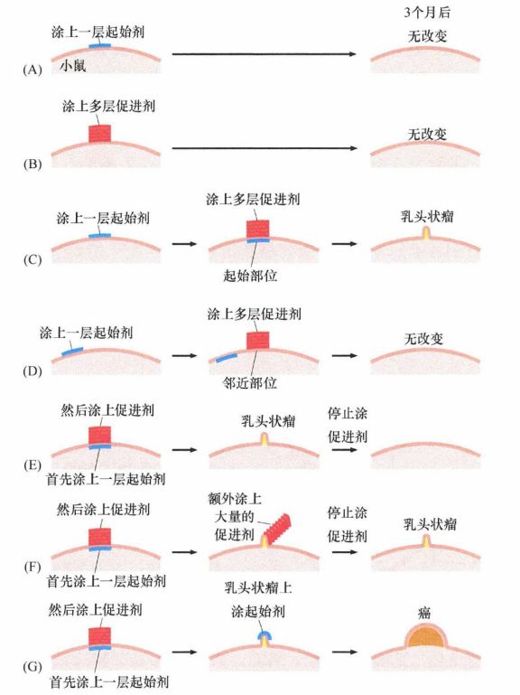

图 11-3-1： 小鼠皮肤癌诱导过程

这些现象的合理解释如下：由 **起始剂（** **诱发剂** **）** DMBA进行的处理在细胞或细胞群上留下稳定而长期存在的标志 ，随后将这些细胞重复暴露于 **促进剂** TPA使这些细胞迅速增殖 ，最终产生乳头状瘤。但是，促进剂的作用是可逆的，如果停止 TPA处理乳头状瘤会消失。表明它对乳头状瘤细胞产生非遗传效应 ，无论其性质如何，都可以与起始剂引起的明显的基因改变协同作用，以驱动细胞的增殖。

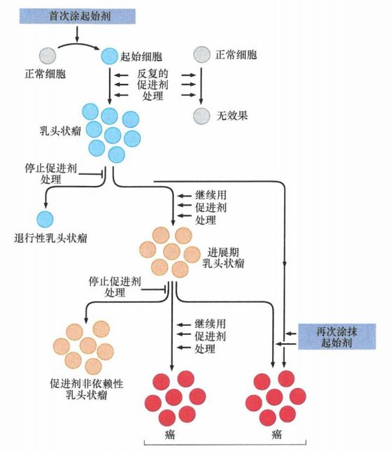

图 11-3-2： 小鼠表皮癌的起始和促进模式图

在首次成功诱导小鼠皮肤癌模型 40年后，参与这种皮肤肿瘤发生过程中的主要基因和蛋白质被发现了。DMBA是一种随机作用的诱变剂，用DMBA处理的细胞基因组会产生各种各样的突变，但所出现的皮肤肿瘤细胞中常常出现H-ras基因的点突变，表明这种特定的突变等位基因赋予皮肤细胞一些强烈的选择性优势。重复使用TPA处理小鼠皮肤诱导产生乳头状癌是这种促进因素和H-ras基因共同作用的结果。长时间用TPA处理乳头状瘤可能会导致即使停止TPA剌激后乳头状瘤也可持续存在。另外，如果将乳头状瘤细胞再次暴露于DMBA等起始剂下，这种乳头瘤可能发展成癌细胞，并且这种癌细胞携带H-ras致癌突变基因和p53突变基因。

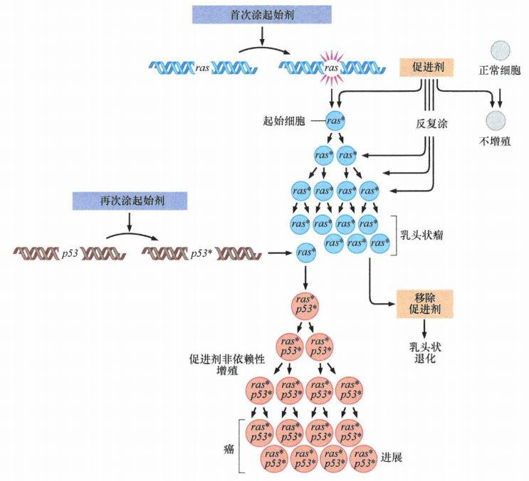

图 11-3-3： 参与小鼠皮肤癌发生的基因和蛋白质

从信号转导水平上研究这类现象，发现促进剂TPA是一种细胞增殖刺激剂，它充当了二酰甘油 （DAG）的功能模拟物，通过激活蛋白激酶C-α（PKC-a）的细胞内丝氨酸／苏氨酸激酶发挥作用。 PKC-α的下游效应物与H-ras致癌基因以未知的方式协同作用，促进角化细胞的增殖形成乳头状瘤，并在罕见情况下发展成癌。

通过以上研究，我们得出这样的结论： 化学诱变剂如TPA，并不是直接作用于细胞基因组，而是作为一种重要的功能因子驱动肿瘤的进展。 而且，这也为我们明确了一个概念： 致癌剂不一定是诱变剂。

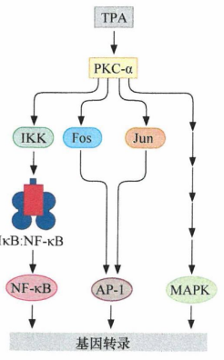

图 11-3-4： PKC-α激活Fos、Jun和NF-κB

2 、 毒素和有丝分裂剂是人类肿瘤的促进剂

组织中存在多种对某些类型细胞具有高度毒性的化合物，这些毒性物质可以通过促进活细胞增殖而发挥促癌剂的作用。 Kostmann综合征（婴儿遗传性粒细胞减少症）是一种罕见的遗传综合征，其特征是血液中几乎完全缺失嗜中性粒细胞。在这类常染色体显性遗传病中，遗传缺失导致嗜中性粒细胞合成特异性弹性蛋白酶的突变体，且该酶通常在中性粒细胞分化阶段高表达。Kostmann患者携带的弹性蛋白酶突变体对于其体内的嗜中性粒细胞是具有细胞毒性的，一旦其表达达到一定水平就会导致中性粒细胞凋亡。受血液中性粒细胞减少症刺激前体骨髓干细胞大量增殖并分化成嗜中性粒细胞 ， 干细胞来源的嗜中性粒细胞又会受弹性蛋白酶突变体诱导而亡，因此所有的中性粒细胞扩增途径都无法挽回中性粒细胞减少的命运，由此干细胞进入无限循环增殖状态。在一些患者中，持续而过度的干细胞增殖会导致急性髓系白血病。这种综合征为我们提供了一个有力的证据：内源性细胞毒素因子可以直接作为肿瘤促进因子发挥功能。

促有丝分裂剂也可以作为促癌剂发作用，突出的例子是雌激素。流行病学调查显示，女性一生中经历的月经周期越多，患乳腺癌的风险就越高；切除女性体内雌激素主要来源器官卵巢，可以降低乳腺癌风险。雌激素的一个明显作用是可以周期性诱导细胞增殖，使一系列已经始动癌变的乳房上皮细胞 (MECs)转变为在各种类型的乳腺癌中所发现的MECs。因此，雌激素的作用机制十分符合经典促癌剂的特性。

3 、 慢性炎症促进肿瘤发生

单独将人类结肠癌细胞系植入裸鼠皮下不能产生肿瘤，但是如果将该细胞系附着于塑料片一起植入宿主鼠，那么塑料片会诱发局部基质炎症，细胞则会生长成瘤。并且这时将它们单独移植入另一宿主动物时仍然会保持致瘤表型，这提示有某些可遗传的遗传学或表观遗传学改变驱动着肿瘤生长。

慢性炎症在人类其他肿瘤发病机制中同样扮演着明确的角色：胆囊癌发生率的增加通常与十年以上胆结石引发的上皮内膜炎症相关；肝癌与长期 HBV（乙型肝炎病毒）感染伴随的肝炎症相关。

表 11-3-1： 炎症环境与肿瘤发生

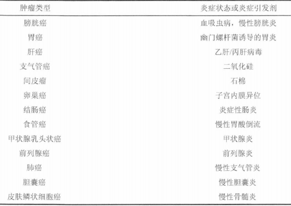

HBV诱发肝癌的致病机制有两种合理的解释：一方面，HBV通过调控肝细胞持续增殖来诱发肝癌，持续增殖产生的细胞会替代被HBV病毒感染杀死的正常肝细胞。另一方面，HBV感染会启动免疫系统相关细胞消除被感染的细胞，这种免疫反应会使肝脏长期伴随炎症。

特别的， HBV也能够和黄曲霉毒素Bl协同作用。黄曲霉毒素Bl是由存在于高湿环境下的花生、坚果和玉米上生长的曲霉菌产生的一种强烈致突变化合物。HBV感染和黄曲霉毒素Bl暴露的协同作用会产生致命性的结果。在上海进行的一项前瞻性小样本流行病学研究中发现，感染HBV者比未感染者患癌风险高7倍；如果食用黄曲霉毒素Bl污染的食物，那么患癌风险会增加3倍；如果同时感染HBV病毒和暴露于黄曲霉毒素B1, 患者的患癌风险会比正常入高60倍。

值得一提的是，非病毒引发的炎症环境也同样可以增加肿瘤易感性。有一种家族性胰腺炎是由编码胰酶的基因发生遗传性显性等位基因突变引起的。目前已经清楚了这一突变酶形式的作用方式：遗传该基因特异突变的患者便会过早激活胰酶，这会损伤胰腺组织。这些患者一生会反复发生胰腺炎，且患胰腺癌风险达 40%。胰腺组织频繁损伤、愈合及炎症会自接诱发这些致命性的肿瘤。

4 、 炎症信号转导通路对肿瘤的促进作用

炎症在肿瘤发生发展中的作用来自于大量的流行病学调查，抗炎药物如阿司匹林能降低各种人类肿瘤的发病率。长期服用 NSATD能够降低肿瘤发生率的流行病学结果以及在小鼠实验中进行的皮肤癌和肝癌发生的实验结果促使我们去认识许多组织中肿瘤发生的生物化学和细胞生物学机制。

一项重要的研究线索来源于 TPA下游细胞靶点—— 蛋白激酶 C（PKC-α） 的发现：在经 TPA处理的 小鼠 角质细胞中， PKC-α信号通路在一定程度上是通过激活IKK（IκB激酶）而导致IκB(NF-κB的抑制分子）发生磷酸化，释放NF-κB使其活化，导致NF-κB从细胞质移向细胞核，从而影响下游一系列基因的转录。

而在那些能够阻止细胞凋亡和促进细胞增殖的基因中， NF-κB能诱导肿瘤坏死因子-α（TNF-α) 的表达。TNF-a是一种能趋化免疫细胞（即它是一种细胞因子）至小鼠皮肤及其他上皮组织中产生局部炎症反应的生物分子。缺乏TNF-α基因拷贝及其他相应致瘤因素（如DMBA启动子和TPA启动子）的小鼠与野生型小鼠一样，其皮肤癌发病率为5% -1 O%。对后者（野生型）进行TPA处理能引起表皮角化细胞中表达TNF-α，从而导致真皮层的基质细胞发生炎症反应。

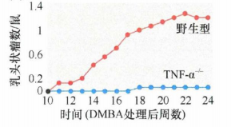

图 11-3-5： TPA介导的免疫应答的主要调节分子是TNF-α：在小鼠皮肤首次涂抹DMBA后每周 2次 涂抹 TPA，持续15周

综合上述可得到以下的信号通路： **TPA** **→** **PKC** **-** **α** **→** **IKK** **→** **NF-κB** **→** **NF-** **α** **→** **炎症** **。** NF-κB信号通路在炎症组织中具有高度活性，被趋化至组织免疫系统的炎症细胞能够在局部基质产生炎症反应，释放促炎症的信号因子。

非甾体类抗炎药物（ NSAID）如阿司匹林都以环氧化酶-2 (COX-2)为作用靶点， COX -2能生成促炎分子前列腺素E2（PGE 2 )。事实上，COX-2基因就是通过NF-κB和TNF-α信号通路诱导表达的。许多上述列举出来的TNF-a促炎症效应都依赖于诱导COX-2表达和随后的PGE 2 水平迅速增加 。

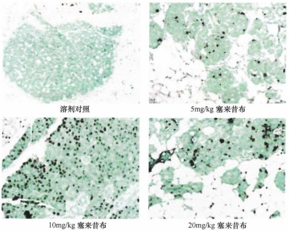

图 11-3-6： COX-2在转基因小鼠乳腺癌中的抑制作用：转基因小鼠乳腺癌模型的进展是由T癌蛋白驱动的，用非甾体抗炎药塞来昔布（选择性COX-2抑制剂）处理小鼠后，通过TUNEL（一种凋亡标志）染色法检测显示，T 癌蛋白表达量明显减少

COX-2在介导炎症反应中的重要作用可以通过AFC基因修饰小鼠(AFC基因的胚系突变）易感结肠息肉的实验进行说明：当在这一小鼠中引入COX-2基因胚系失活后，小鼠形成息肉的 数量 减少 7倍。同样，采用药理学方法(NSAID类药物）使COX-2酶失活后，原本易感肿瘤的转基因小鼠体内发生乳腺癌的能力也受到了显著抑制 。

在另一些实验中， 通过升高 PGE 2 水平可观察到相反的效应。在自发肿瘤中，肿瘤发生可部分归结于能够降解 PGE 2 的 羟基 前列腺素脱氢 酶 (PGDH)表达水平 降低 。在实验动物 模型 中，敲除小鼠生殖细胞中的 PGDH 基因 将会明显增加结肠癌的发生率 。 或者，在转基因 小鼠 乳腺组织中过表达 COX-2以提 高 PGE 2 的水平，这些小鼠患乳腺癌的风险明显增加。

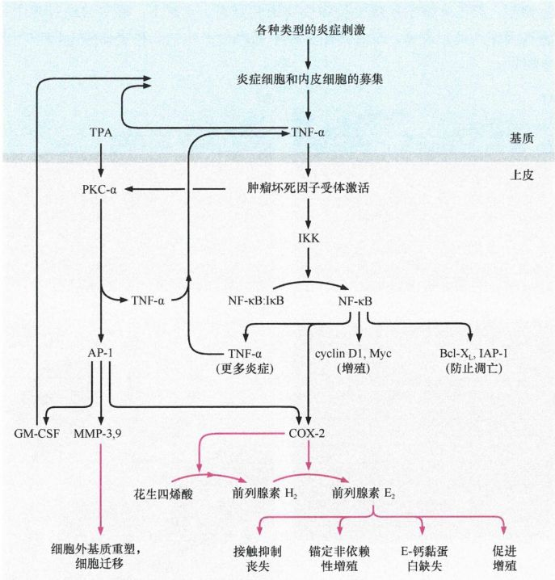

图 11-3-7： 上皮细胞炎症和肿瘤发生模型

# 第十二章_1_《癌生物学》第十二章（1）DNA损伤的预防
 
**前言** ：通过上一章的学习，我们已经知道有很多外源性因素可以通过基因突变诱导或促进肿瘤的发生。本章主要的内容就是基因组完整性的维持。今天这一小节是本章的重头戏！重头戏！重头戏！——“ **DNA损伤的预防和修复** ”。

 
**DNA损伤的预防**

**干细胞逃避突变的形成和积累**
 
每种组织中都有一小部分细胞处于干细胞区域。这些自我更新细胞可能构成了组织中所有细胞群的很小一部分，有时仅占全部细胞的0.1%~1%。干细胞数目很少，外形不容易鉴别，并经常分散在组织的其他细胞类型中，所以它们很难被识别和研究。因此，以下大多数关于干细胞的描述属于推测，而非对干细胞及其特征的直接观察。
 
与肿瘤组织中的干细胞一样，正常组织中的干细胞也具有自我更新能力，一个干细胞分化成两个子细胞，其中至少一个子细胞将保留母细胞分裂前的表型。在多种组织中，第二子细胞及其过渡－扩增子细胞将经过一系列的细胞分裂才进入有丝分裂后高度分化的状态。这些活跃的分裂细胞充当干细胞及其分化后代之间的中间产物，可能会再产生大量第二子细胞的分化后代。由此得出一个简单的观点：干细胞代表组织内唯一稳定的遗传信息库，因此干细胞基因组必须受到保护，免受破坏。
 
对某些类型的白血病进行研究结果表明在造血系统中致癌作用的初始靶点也是干细胞。最典型的例子是慢性髓细胞白血病(CML)。几乎所有该病的病例中 都可观察到费城染色体，它是由染色体易位导致bcr和abl基因融合而产生的。有进一步的证据表明正是这个特定的易位作为遗传损伤导致了CML。
 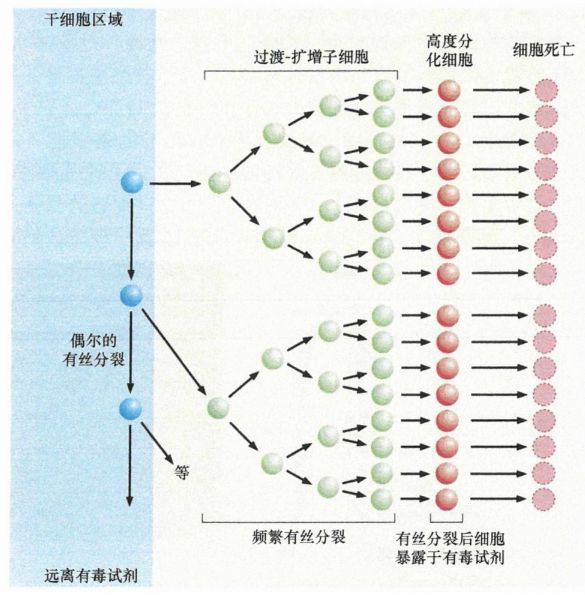 
图1：组织形成和干细胞基因组的保护

**（1）干细胞DNA复制频率较低**

过渡－扩增子细胞数目的指数级增长意味着一个干细胞只需偶尔分裂就可以维持组织中大量的终末、高度分化的细胞。例如，据推测结肠隐窝一个干细胞分裂最终可形成数百个分化的肠上皮细胞。因此，尽管人们可能认为是干细胞参与持续的细胞生长和分裂周期，但事实常常并非如此，其实是过渡－扩增子细胞产生了许多组织中的大量有丝分裂。因为每轮细胞周期中的DNA复制原本就倾向于产生错误，所以这种模式将降低突变积累于干细胞基因中的风险。
 
**（2）物理隔离**
 
在许多上皮组织中，分化的上皮细胞特别容易受到损伤，因为它们形成各种管腔的内壁，而这些管腔里含有众多有毒物质。结肠和胆管上皮细胞分别接触排泄物和具有高度腐蚀性胆汁。形成肺泡的细胞每天必须和空气中的颗粒及污染物对抗。皮肤的角化细胞直接暴露于外界，因此更容易受到各种损伤，如紫外线辐射和有毒物质的破坏。
 
在各种组织中终末分化细胞的寿命是有限的，它们最终都要被丢弃。例如，红细胞的平均寿命大概为120天，之后脾脏会将它们清除并降解，降解产物则进行再循环或被分泌出去。结肠上皮细胞在被诱导启动凋亡前生存5-7天，然后脱落进入肠腔。皮肤的角化细胞形成后20-30天内死亡，以死皮的小鳞片形式不断脱落。
 
因此，过渡－扩增子细胞具有高有丝分裂活性，并且它们的分化后代可能经常位于突变的环境中，因此发生突变的风险也很可能随之升高。然而，过渡－扩增子细胞及其分化后代携带的任何遗传损伤对组织几乎没有影响，因为这些细胞最终会被清除，一旦它们死亡，其所积累的任何突变都将随之消失。而干细胞深深地嵌入到隐窝中, 通过隐窝中细胞分泌的厚厚的黏液层与肠腔中的诱变物质隔离，使其可以免受损伤。这种黏液（由高度糖基化的黏蛋白构成）产生胶状的障碍物阻止肠腔中的物质渗入到隐窝中。该现象实际上揭示了降低干细胞基因组突变的另一种策略：进化过程产生了干细胞在解剖学上与毒素（包括致癌物）隔离的机制。Muc2是胃肠道中大量存在的黏蛋白，敲除Muc2基因的小鼠容易产生小肠腺瘤，其中许多会进一步进展为腺癌。
  
图2：干细胞和胃肠道隐窝的构成
 
理论上，组织中的干细胞区域有无限产生分化的子代细胞而不被损耗的能力。然而，一个干细胞不可避免地会因为这样那样的不幸从这个细胞区域中消失。缺失的干细胞必须由其他的干细胞补充。具体地讲，一个存活干细胞的两个子代细胞均保持母细胞的表型而后进行对称分裂。如下图（B）所示，某一干细胞库含有7个干细胞，丢失了3个（最上排红叉标记的细胞），余下的干细胞随后进行对称分裂，使干细胞库中干细胞数量保持不变。并且，子代中干细胞的丢失（第三排中红叉标记的细胞）会使另外一个过渡－扩增子细胞转变成干细胞（底部）。同样，在器官生长时，干细胞的数量必须增加，这就需要一些干细胞进行对称分裂。
 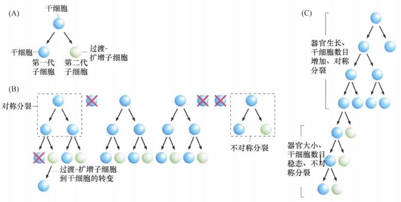 
图3：干细胞的对称分裂和不对称分裂

**（3）凋亡**

在小鼠小肠隐窝中，遭受 X 射线照射而造成遗传损伤的干细胞将快速启动凋亡，而不是停止增殖或试图修复损伤。这种行为可能与DNA修复的易错特征有关。DNA 修复装备非常高效，但是很难精确，因此经常在染色体DNA中遗留下未修复或错误修复的残基。如果细胞的DNA复制装置遇到这种损伤，它们就能使突变的DNA序列得以复制并遗传到子细胞，包括自身将成为干细胞的子细胞。因此，小鼠隐窝中的干细胞DNA发生损伤时会首先激活凋亡而不是发生突变。
 
当然，是不是所有组织中的干细胞都发生凋亡还不是很清楚。例如，多种肿瘤组织中的肿瘤干细胞(CSC)抗凋亡能力升高及DNA修复机制增强，使得它们具有更强的抵抗辐射和多种药物治疗的能力。鉴于CSC采用的干细胞程序与正常前体组织中的极其相似，某些正常的干细胞可能通过高效的DNA修复机制，而不是快速启动凋亡以应对遗传损伤。
 
**（4）药物泵出**

荧光激活的细胞分选(FACS)是一项从组织大量细胞中分离干细胞的常用技术，利用该技术发现了另一种可能的保护机制。干细胞能够有效地泵出某些荧光染料分子，然而这些细胞的分化衍生细胞泵出染料分子的能力不是很活跃。因此，将细胞群体暴露于此类染料之后，干细胞染色较其他细胞染色弱。染料分子分泌的活跃取决于膜蛋白Mdr1 (multi-drug resistance 1) 的作用，其首次发现是在多种肿瘤细胞中，发现肿瘤细胞可以利用该蛋白泵出化疗药物，从而获得耐药性。Mdr1在多种干细胞中异常高表达，这似乎是一种保护策略，使基因组免受胞外进入细胞质的物质中那些潜在诱变物质的破坏。
 
**（5）不对称的DNA链分配机制**

不对称的 DNA 链分配机制在防止某些组织中干细胞遗传损伤的累积也起了重要作用。根据这一构想，干细胞中的DNA发生复制后，新复制（有潜在错误）的DNA链被分配到成为过渡－扩增子/祖细胞的子代细胞中，而不含有与复制相关的序列改变的、未复制的亲本DNA链被分配到仍然是干细胞的子代细胞中。虽然理论上具有吸引力，但是支待这一假说的实验证据还不充分，仍存在大量争议。

**细胞保护DNA分子的稳定性**
 
**（1）物理性防护**

细胞保护自身基因组不被诱变剂损伤的最有效方法是，通过物理性防护使DNA分子免受直接攻击。以太阳的紫外辐射为例，紫外线很难穿透人体组织，因此只有皮肤细胞和视网膜色素细胞是易受损伤的组织。皮肤依靠角化细胞内的黑色素抵抗紫外辐射。这些黑色素由黑素细胞转移到表皮的角化细胞内（皮肤的上皮层）。
 
皮肤角化细胞针对UV, 尤其是对UVB光子的防护，主要依赖表皮角化细胞中含有黑色素的黑色素颗粒，它们是由黑素细胞转移到位于表皮基底层的角化细胞内的。当角化细胞获得黑色素后，它们就组装为小伞/太阳伞的形状（有时也被称为细胞核上的帽），位于角化细胞核的上方，使细胞核免于可见光尤其是UVB的辐射。缺失伞状结构的角化细胞与含有伞状结构的角化细胞相比，UV引起的DNA损伤会增加4倍。
 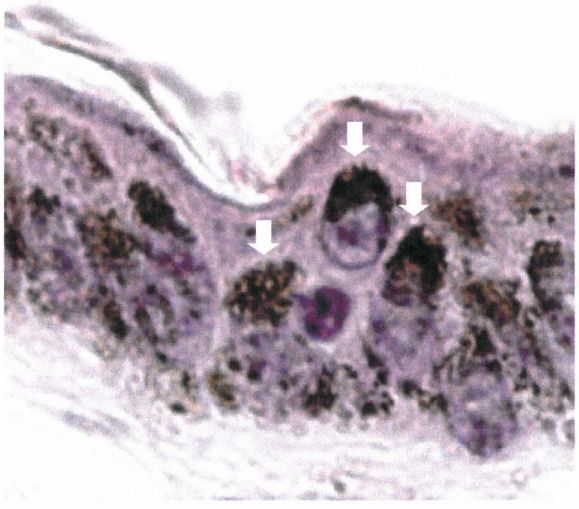 
图4：角化细胞核对于紫外辐射的物理防护

**（2）超氧化物歧化酶和过氧化氢酶**

机体抵抗物理致癌剂的方法是有限的。相比之下，机体可以通过多种机制在化学致癌剂尚未对细胞基因组造成损伤之前阻断其作用。一系列酶包括超氧化物歧化酶和过氧化氢酶，可以消除活性氧和自由基，它们协同作用将活性氧转化为无毒的非活性形式。活性氧也可以被一系列自由基清除剂清除，包括维生素C、维生素E、胆红素和尿酸盐。这些分子可以与活性氧发生化学反应，使其失去毒性。

**（3）谷胱甘肽-S-转移酶类**

 
另一条重要的防线是谷胱甘肽-S-转移酶类(GST),它们可将亲电化合物和许多致癌剂与谷胱甘肽相连接，从而使这些化合物去毒并以备进一步代谢和分泌。谷胱甘肽-S-转移酶利用谷胱甘肽半胱氨酸残基上的硫基使许多活性化合物在与细胞内目标分子（如DNA)作用前去毒。下图显示的是由GST调节的一个典型反应，谷胱甘肽中的巯基用于去除被氧化化合物中的高活性环氧基团(R代表任何的化学基团）。
 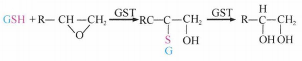 
图5：谷胱甘肽转移酶的作用
 
值得注意的是，90%的人类前列腺癌表现出GST-π表达的下调，由GSTP基因启动子区甲基化所致, 这也是肿瘤细胞下调多种抑癌基因表达的一种机制。

**DNA损伤的修复**

实际上，DNA经常受到各种物质和反应过程的攻击。为了简单起见，我们将这些诱变过程分为三类。第一，细胞周期S期由DNA聚合酶进行DNA序列的复制时倾向于产生低频但很严重的错误。其中包括发生化学改变的核苷酸前体不小心掺入正确的DNA中。第二，即使不存在诱变剂的攻击，DNA分子中的核苷酸也会自发地发生化学改变，这些改变经常使DNA的碱基序列发生变化，从而改变DNA中包含的信息。第三，DNA分子会受到各种诱变剂的攻击，包括正常细胞内代谢产生的分子以及外来的化学和物理诱变剂(X射线和UV射线）。我们将在后面的小节介绍后两个过程。
 
负责几乎所有染色体DNA序列复制的分子机器发生错误的频率非常低。细胞核中基本的复制机器主要由pol-α、pol-δ和pol-ε三类聚合酶驱动。人类基因组中，总共已发现19个不同的DNA聚合酶基因，今后很可能还会发现更多。这些基因大多数并非参与DNA复制本身，而是参与了损伤DNA分子的修复。

**DNA复制过程中产生的错误**
 
**（1）DNA聚合酶的校对功能**

DNA聚合酶是结构非常复杂的复合物，由众多不同的蛋白亚基装配而成。当它们沿着单链DNA模板，由 5'→3'方向延伸新生链时，DNA聚合酶（如pol-δ) 会 “不断回望“，扫描刚发生聚合的DNA的延伸链；这种监控通常称为校对。当聚合酶检测到一个复制错误时，就利用其3'→5'外切酶活性反方向移动，降解刚合成的DNA片段，然后再重新复制这一片段，期望再次出现较好的结果。
 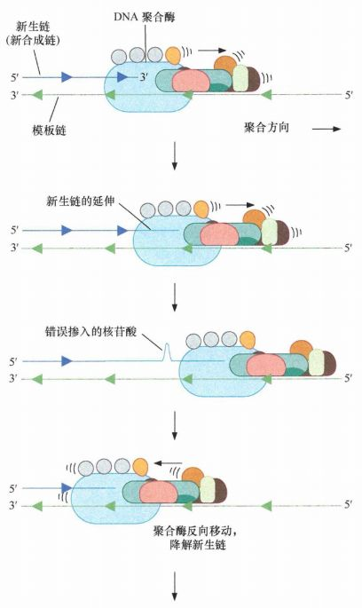 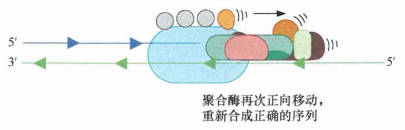 
图6：DNA聚合酶校对

**（2）错配修复（MMR）酶**

错配修复 (mismatch repair, MMR) 酶监测新合成的DNA, 用以发现被DNA 聚合酶校对机制忽略的错配DNA序列。错配修复系统的作用在只有重复序列的DNA区域变得尤为重要。这些序列包括简单的单核苷酸重复（如AAAAAAA)、二核苷酸重复（如AGAGAGAG)及更复杂序列的重复。由于链的滑动，即当亲本链和新生链从原有的价置滑出时，DNA聚合酶在复制这些重复序列时呈现偶尔停顿的方式，使得新生链中掺入更高或更低拷贝的重复序列。因此，A 7 序列 AAAAAAA很可能造成聚合酶合成一个T6或T8序列的互补链。随之产生的插入或缺失可能逃避DNA聚合酶校对元件的监视，因此成为错配修复机器识别和修复的主要靶点。
 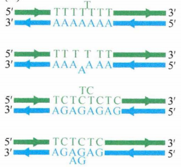 
图7：DNA聚合酶错误

基因组高度重复序列中的每一个重复单位通常携带100个或更多的核苷酸，称为“卫星”序列。由于这里讨论的简单短序列在基因组中的很多地方都存在，因此它们被称为微卫星。有缺陷的错配修复系统在微卫星复制时不能发现和终止由DNA聚合酶产生的错误，造成后代细胞中序列的延长或缩短。所产生的遗传结果被称为微卫星不稳定性(microsatellite instability, MIN), 最终可能使成千上万的微卫星序列散布于整个细胞基因组中。在MMR缺陷的细胞中存在大量突变。
 
然而，由DNA聚合酶产生的更细微的复制错误，如非重复序列中错误碱基的掺入，可能也会被错配修复蛋白检测出来并被清除掉，这些蛋白对由错误核苷酸掺入所造成的双螺旋中的突起和环状结构高度敏感。错配修复机器能够区分新合成的 DNA链和作为模板的 “亲本链", 使MMR装置的注意力中在清除和修复新合成并有缺陷的DNA链。错配修复涉及切除错配的核苷酸并重新合成这条链。
 
在真核细胞中，MMR装置的两个成分：MutSα和MutLα，相互协调起始错配DNA的修复。MutSα(MSH6和MSH2异源二聚体）扫描DNA并定位于错配处。然后MutLα(MLH1和PMS2异源二聚体）扫描DNA单链缺口，它们识别新生链（红色）；新生链的甲基化可能也有助于这一识别过程。MutLα通过已被检测到的错配引发该链的降解，使修复DNA的合成得以继续，并产生正确配对的DNA 链。
 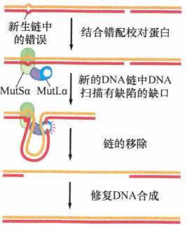 
图8：错配修复

**诱变剂攻击产生的错误**
 
细胞产生一系列恢复正常 DNA 结构的酶。重要的是，这些酶的功能不同于上文提到的错配修复酶的功能，因为MMR修复的是结构尚正常但掺入到错误位置的核苷酸，而此处讨论的修复机制针对的是化学结构异常的核苷酸。
 
**（1）MGMT（DNA烷基转移酶）**

修复发生化学改变DNA结构最简单的策略是酶催化产生变化碱基的逆反应。例如，一种DNA烷基转移酶可以去除鸟嘌呤O 6 位上的甲基和乙基加合物，从而 恢复正常碱基的结构。 有研究报道，MGMT(也 称DNA烷基转移酶）在某些肿瘤的发展中起重要作用，MGMT在高达 40%的神经胶质瘤和结肠癌、25%的非小细胞肉瘤、淋巴瘤和头颈部肿瘤中存在启动子甲基化引起的基因沉默。
 
许多DNA修复酶修复DNA的方式为将改变的碱基或整个核苷酸从DNA上切除，而MGMT则不同。MGMT通过使改变的鸟嘌呤恢复为正常结构进行DNA修复，即从鸟嘌呤 O 6 位移除乙酰基。如果该修复机制发生缺陷，乙酰化的鸟嘌呤会导致G突变为A 。
 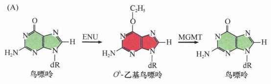 
图9：通过去乙酰化修复酶恢复正常碱基结构

在一些肿瘤动物模型中，特定致癌剂引起的肿瘤类型会受到分布于各种组织中的DNA修复酶种类的影响，并且很可能在人类也是这样。而且，与谷胱甘肽-S-转移酶类似，这些DNA修复酶能影响治疗反应。例如，一组MGMT正常表达的恶性胶质瘤患者，用烷基化疗药替莫咄胺治疗后生存期为 12 个月；同一队列中另一组低表达MGMT( 由于MGMT基因启动子区甲基化）的患者生存期为22个月，几乎是前者的两倍。该结果及一系列其他临床研究表明，正常表达的MGMT可以非常有效地清除化疗药物在DNA上产生的甲基，从而中和其细胞毒作用。

**（2）A1kB酶**

大肠杆菌A1kB DNA修复蛋白的同源物通过氧化DNA碱基上的甲基基团发挥作用，氧化的甲基以甲醛的形式从4种DNA碱基环上脱落。同样，A1kB酶可以使人的乙基基团以乙醛的形式释放。一种比较夸张的解释形容这种现象为，酶燃烧掉了不想要的甲基基团！S-腺苷甲硫氨酸引起的DNA碱基的甲基化在细胞生命过程中经常发生，该甲基供体经常参与细胞中许多分子的生物合成；其高活性甲基基团可转移到细胞内多种人分子上使其甲基化，包括DNA碱基。
 
细菌A1kB酶（及其哺乳动物同源物）也可以移除更加复杂的碱基加合物 。例如，炎症组织中不饱和磷脂不可逆的氧化率很高，进而产生脂的环氧化物和过氧化物。这些高活性的化合物能与DNA碱基产生复杂的具有高致癌性的加合物。

**（3）识别碱基化学性改变的酶**
 
比去烷基化酶更重要的是许多细胞内识别DNA碱基化学性改变的酶，这些酶的识别依赖于DNA的特殊修饰，并通过两种方式做出反应。在一些情况下，特异性的酶可以切断脱氧核糖和修饰碱基之间的化学键，该过程被称为 **碱基切除修复 (BER)** 。其他情况下，全部的核苷酸包括碱基和相连的脱氧核糖一起被切掉，被称为 **核苷酸切除修复（NER)** 。
 
**碱基切除修复** 是由一组DNA糖基化酶起始的，每种酶特异性识别一种异常碱基并且切断其与脱氧核糖核酸之间的共价键。例如，DNA中的尿嘧啶碱基可以被负责碱基切除修复的蛋白质识别，因为尿嘧啶碱基在 DNA 中出现是不正常的。尿嘧啶被尿嘧啶DNA糖基化酶消除，并迅速被胞嘧啶替换（DNA中尿嘧啶的出现是胞嘧啶自发去氨基化的结果）。然而，在DNA不恰当的位置上出现胸腺嘧啶给这些修复酶带来了很大的困难，因为胸腺嘧啶是DNA的正常组分。5-甲基－胞嘧啶偶尔会发生自发脱氨基作用，变为胸腺嘧啶，从而形成T:G碱基对。为应对该问题，生物进化已在细胞内创造了T:G糖基化酶，该酶特异性切除与G配对的T。尽管如此，由脱氨基作用形成的T:G碱基对，偶尔也能逃避该酶的监测，持续地产生点突变。
 
当 **DNA糖基化酶** 把异常碱基去除后，无碱基的核糖会被第二个酶 **APE(核酸内切酶）** 切掉。该酶在糖的5'端特异性切割携带无碱基脱氧核糖核酸的链；另一种酶，即 **AP裂解酶** 在3'端切割释放无碱基的糖。DNA上产生的单链缺口由 **DNA聚合酶** 修复，通常是聚合酶β。产生的单链切口通过DNA连接酶在相邻核苷酸间形成磷酸二酯键而闭合，最后重建了正常的DNA化学结构。偶尔出现的碱基切除修复变异形式是 “长补丁修复" , 参与损伤碱基附近4~7 个碱基的切除，然后再补满这个缺口。
 
解释一下BER 存在的两种形式：单核苷酸及缺口可能由DNA 聚合酶 (polβ ) 进行填充和连接（ **短补丁修复** ）。或者，在经APE切除和由polβ引入单个碱基之后，DNA 聚合酶δ或ε在在缺口处的 3'端延伸 n 个核苷酸。产生的替换链被Flap核酸内切酶清除，剩余的损伤缺口由连接酶连接（ **长补丁修复** ）。
 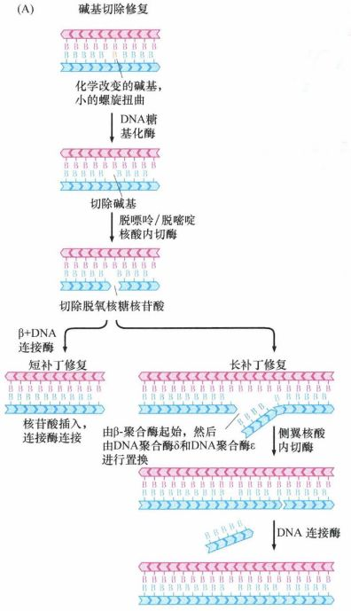 
图10：碱基切除修复

**核苷酸切除修复** 由一个大的蛋白质复合体完成，该复合体包含24个亚单位。只有DNA发生两个独立的改变时才会启动该复合体的修复，即当正常的双螺旋结构发生显著变形和同时发生碱基化学变化时。一旦该复合体发现异常，就会切掉损伤链上游和下游的损伤部位，产生25~30个核苷酸长度的单链片段，然后该单链片段被去除。DNA聚合酶以未损伤链为模板，按照互补原则，特异性地补满产生的缺口，然后 由DNA 连接酶擦除最后的损伤痕迹。
 
核酸切除修复酶是那些能够识别和移除大量碱基加合物形成的特殊结构（如与碱基共价结合的复杂分子结构）的酶，这些结构异常可由外源性致突变剂如多环化合物、异环氨基酸和黄曲霉毒素 B1 引起，也包括紫外线照射形成的嘧啶二聚体。核苷酸切除修复装置在嘧啶二聚体的3'端去除5个核苷酸，在5'端去除24个核苷酸。
 
核苷酸切除修复反应可以分为两种类型，第一种类型为特异性作用于具有转录活性的模板链，并与负责转录过程中延伸这些模板链的RNA聚合酶分子协 同作用 ，这种反应称为 **转录偶联修复 (TCR)** 。第二种NER负责其余的基因组修复，包括转录基因的非模板链和基因组的非转录区域，因而有时称为 **全基因组修复(GGR)** 。抑癌蛋白p53可以激活许多在GGR过程中发挥作用的核有酸切除修复蛋白编码基因的表达, 这也是p53突变细胞中存在GGR缺陷的原因；相反，转录偶联修复在这些细胞中未发生缺陷。
 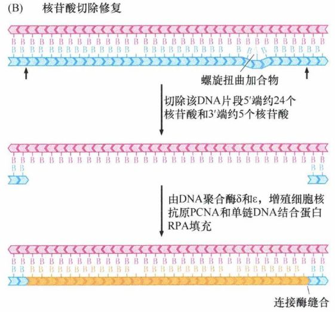 
图11：核苷酸切除修复

**（4）错误倾向DNA复制**

细胞处理损伤DNA的另一种策略（实际上是一种绝望的行为）是对仍未被修复的模板DNA链的复制（而且，这种情况导致的突变序列随后会被掺入其姐妹染色单体上野生型序列，从而得到修复，也就是由复制叉形成的另一条新合成的双螺旋）。该过程被称为 **错误倾向DNA复制** ，此处的复制装置在遇到仍然损伤的碱基时必须判断到底4种碱基中的哪一种适合掺入到正在延伸的DNA链上，而这种判断并不总正确，经常导致碱基的错误掺入。
 
迄今为止，在哺乳动物中发现了至少9种不同的错误倾向DNA聚合酶。其中有些酶可以在模板链上碱基缺失的情况下，在延伸链的互补位置掺入一个核苷酸。而其他酶可以利用别的DNA聚合酶错误掺入的核苷酸为引物延伸新生DNA链。第三种类型的酶可以在互补链上相应碱基带有复杂基团时（如共价结合的未被核苷酸切除修复系统去除的DNA), 掺入一个碱基。其中一种由XPV基因编码的酶高度特异，能识别由UV辐射产生的T-T胸腺嘧啶二聚体，并在互补链上插入两个A。另外一种错误倾向DNA聚合酶是聚合酶κ, 其能将包含错识加合物甚至是包含 8-脱氧鸟嘌呤的序列作为模板进行复制。聚合酌κ在8-脱氧鸟嘌呤的位置更倾向掺入A而不是C, 这也能解释碱基氧化产物的诱变作用。尽管细胞中负责DNA合成的聚合酶发生错误的概率仅为10 -5 ，但这些错误倾向 D NA聚合酶发生错误的概率却高达每复制 100 个碱基会有一个错误掺入。 因此，错误旁路聚合酶不是严格意义上的DNA修复酶，因为错误旁路聚合酶不会移除错误，也不会恢复野生型核苷酸序列。
 
错误倾向聚合酶引起的错误可能在细胞基因组中产生不可接受的高频率突变。积累这些突变付出的代价应与另一种选择进行权衡，即由于损伤的DNA不易被复制，导致DNA复制叉停滞，从而使细胞面临即将死亡的风险。
 
研究最充分的错误倾向聚合酶是DNA聚合酶β(pol-β), 该酶通常参与替换由碱基切除修复去除的核苷酸。这种相对较小的聚合酶分子缺乏大聚合酶的校对功能, 此种功能缺失可以解释大部分易错DNA复制现象。在各种卵巢癌细胞系中，该酶呈现10倍的高表达。
 
实际上，至少有一种哺乳动物基因组编码的酶(AID酶）可以有目的地将突变掺入基因组中，这种酶也可能参与肿瘤的发生。AID基因编码活化诱导的胞嘧啶脱氨酶，该酶主要负责基因转录起始点下游3kb的胞嘧啶脱氨反应，尤其是抗体等一些基因的转录。通过将胞嘧啶转化为尿嘧啶，该酶有效地插入了大量C:T的点突变，如免疫球蛋白基因，AlD酶引起的体细胞过量突变将导致抗体分子的配体结合位点多样化，使得免疫系统可以产生对其抗原更具亲和力的抗体。在一些人类淋巴瘤中，AID酶表现异常，将点突变插入到非正常目的基因。当通过转基因的方式，将 AID基因导入小鼠的组织中过表达后，将引发高频率的T细胞淋巴瘤，其中大部分含有大量的基因点突变，如myc基因。

# 第十二章_2_《癌生物学》第十二章（2）基因组损伤的来源

**前言** ：上一期我们了解了预防和修复基因组损伤的机制，这一小节主要来学习 **基因组损伤的来源** ，可以进一步加深对基因组损伤修复的理解。

DNA具有双螺旋结构，碱基朝向内部，以遮蔽潜在的化学反应基团，尤其是碱基的氨基侧链，使其免受多种诱变剂的各种化学攻击。一些研究表明，单链DNA中的碱基比双链DNA中的碱基遭受的氧化损伤多100~1000倍。尽管DNA分子具有如此聪明的机制，它还是容易发生化学改变和物理损伤。一些损伤是中性pH条件下低浓度（约10 -7 m ol/L) 氢离子和氢氧根离子的作用造成的。

**内源性攻击**

**脱嘌呤过程**

在脱嘌呤过程中，连接嘌呤碱基（腺嘌呤或鸟嘌呤）和脱氧核糖的化学键能够自发断裂。据估计，一个哺乳动物细胞每天通过脱嘌呤作用能丢失多至10000个嘌呤碱基（这相当于人体内每天产生多于10 17 个 化学改变的核苷酸）。
 
图1：脱嘌呤作用

**脱嘧啶过程**

与脱嘌呤相比，脱嘧啶作用以低20~100倍的频率发生，但仍能使每个细胞每天丢失多至500个胞嘧啶和胸腺嘧啶。据估计，存在于单一人类基因组中无碱基核苷酸的水平稳定维持在4000~50000个。

**脱氨基过程**
 
脱氨基作用可能发生于鸟嘌呤、腺嘌呤和胞嘧啶环中伸出的氨基位点，使氨基丢失，这一脱氨基作用分别产生黄嘌呤、次黄嘌呤和尿嘧啶。尿嘌呤在随后的DNA复制过程中可能被识别为胸腺嘧啶，因此造成C-T点突变，称为转换性突变，即嘧啶之间相互替换。通过脱氨基作用产生的碱基对于正常DNA来说都是外来的，因此能被识别，并被DNA修复酶去除。然而，任何逃避监视和被修复酶去除的碱基都代表了潜在的点突变来源。
 
5-甲基胞嘧啶——前面提到的甲基化胞嘧啶——通过自发脱氨基作用能以更高的频率产生胸腺嘧啶。这将会给DNA修复机器带来很严重的问题，因为胸腺嘧啶（与上文提到的脱氨基作用的其他三种产物不同）是正常DNA的组成成分，T:G碱基对可能因此而逃避监视，从而幸存下来，最终作为模板进入下一个DNA复制循环，造成C-T点突变。
 
实际上，5-甲基胞嘧啶的脱氨基作用是人类DNA中点突变的主要来源。据估计，内脏器官的肿瘤基因组中63%的点突变（如免受紫外线辐射的组织）发生于CpG序列。在突变的p53等位基因中，约有30%是由野生型p53等位基因中的CpG序列突变而来的。但不是所有CpG位点发生的突变都是由脱氨基作用造成的。
   
图2：脱氨基作用

**氧化过程**
 
细胞内环境对于染色体DNA来说，还具有其他危险。其中最严重的来自氧化过程，这可能比上面提到的反应对DNA产生的损伤更多。最重要的反应发生在线粒体中，在氧气逐渐被还原为水的过程中生成多种中间产物：
  
图3：氧化过程

一些中间产物，所谓的活性氧物质(ROS),可能会从线粒体中渗出，进入细胞质，从而到达细胞中其他部位。这样的中间产物包括超氧离子、过氧化氢和羟自由基。然而，还会产生多种作为耗氧酶副产物的氧化剂，包括过氧化物酶体（参与多种细胞成分，特别是磷脂氧化反应的细胞质体）中的酶，以及由脂类自发氧化导致过氧化的酶。炎症反应也会为氧化剂提供重要来源，这些氧化剂倾向于引发突变和随之而来的致癌作用。
 
在这些过程中产生的高反应活性分子，通常在几秒钟之内就能与细胞中很多其他分子形成共价键。DNA中的碱基是众多活性氧物质攻击的位点之一，包括嘌呤碱基和嘧啶碱基。另外，活性氧物质可以诱导单链和双链DNA的断裂，形成无嘌呤和无嘧啶位点（统称为无碱基位点，这些位点中的碱基从脱氧核糖上断裂下来), 以及DNA-蛋白质的交联。许多由此而改变的碱基被修复机器识别，进而从DNA上切除。
 
两种高频率的氧化反应，一种是脱氧鸟嘌呤核苷(dG)被氧化成8-氧化-脱氧鸟嘌呤核苷(8-oxo-dG); 另一种是脱氧-5-甲基胞嘧啶(d5'mC), 这一核苷酸存在于甲基化CpG序列中。后者最初形成一个不稳定的碱基，并很快脱氨基，生成脱氧胸腺嘧啶乙二醇(dTg)。
 
一些被切下的碱基，包括由脱氧胸腺嘧啶二醇产生的胸腺嘧啶二醇和由8-氧化-脱氧鸟嘌呤核苷(8-oxo-dG)产生的8-脱氧鸟嘌呤，可在哺乳动物尿液中对其进行检测并定量，从而为获得其在整个机体中的合成速率提供 一些信息。
 
一些实验显示，在多种物种中这些成分的生成量与氧化代谢速率有直接的比例关系。8-oxo-dG的形成会有突变的危险，因为该碱基的一种构象可以很容易与A配对，在DNA复制过程中该碱基错配会导致G:C碱基对替换，即G:A对变成T:A碱基对。这种G→T由嘌呤到嘧啶的替换（或相反）通常称为 **颠换** 。
  
图4：DNA中碱基的氧化

**碱基甲基化**

其他损伤可以通过碱基与S-腺苷甲硫氨酸反应而引发碱基甲基化。S-腺苷甲硫氨酸是细胞中一种常见的代谢中间物，携带高反应活性的甲基基团。
 
总的来说，由氧化、脱嘌呤、脱氨基和甲基化产生的持续损伤，每天可能使每个细胞中成千上万的碱基发生改变，远远超过大多数组织中由外源诱变剂产生损伤的量。

**外源性攻击**
 
**X射线**
 
研究最多的外源致癌物是X射线，由于这种形式的电磁能量在细胞中产生离子化的、具有化学反应活性的分子，通常被称为“离子辐射”。细胞中由X射线储存的多达 80%的能量被认为用于从水分子中去除电子，产生的自由基接着会形成活性氧物质(ROS)。X射线能够使DNA发生改变，因为它们通常形成可使DNA双螺旋中产生单链和双链断裂的自由基。这些双链断裂通常很难被修复，而且可能偶尔会在染色体内发生断裂，这在显微镜下观察中期分裂相时可以看到。

**紫外线辐射**

与X射线相比，来自阳光的紫外线辐射是更加普遍的环境辐射来源。紫外光子攻击皮肤细胞中的DNA常常会形成嘧啶二聚体。也就是说，在同一条DNA链两个相邻的嘧啶之间形成共价键。原则上，这些键可以在两个相邻的C、两个相邻的T或者C和相邻的T之间形成。在哺乳动物中，A、C、G和T的比例相似，多于60% 的嘧啶二聚体是TT, 另有约30%是CT, 剩下的是CC 。一对共价键在相邻的嘧啶之间形成，从而产生一个四碳环（环丁烷。
  
图5：DNA相邻嘧啶之间发生共价交联

另一种不很普遍的DNA光反应产物，被称为嘧啶(6-4)嘧啶酮，也包含两个相邻嘧啶的共价交联。嘧啶二聚体一旦形成，就非常稳定，能够在DNA中存留很长时间，除非它们被DN 修复酶识别并消除掉。
 
嘧啶二聚体能够诱变的事实，在皮肤角质症（良性皮肤损伤）和基底细胞癌DNA中发现的p53突变谱中得以证实。在异常细胞中，许多突变的p53等位基因被一个嘧啶二聚体所替代。TT二聚体是由紫外线照射形成最多的结构之一，但其只有弱的诱变作用，因为很多DNA修复和复制酶能够对其进行有效的处理。

**烷化剂**

多种化学分子能够从外界进入机体，经过化学修饰，然后与细胞中的大分子DNA进行反应。许多被修饰的化学分子是亲电的，它们寻找并击靶分子内富含电子的区域。最强的一类诱变剂是被称为烷化剂的化学物质，它们能够使烷基与DNA碱基共价交联。
 
碱基的烷基化可能使其与脱氧核糖间的共价键变得不稳定，造成DNA中嘌呤或嘧啶碱基的丢失。另外，烷基化碱基在DNA复制过程中可能会被DNA聚合酶错读。由于它们强大的诱变作用，烷基化试剂通常被用于诱导实验动物形成多种类型的肿瘤。
 
由于在临床上被用于抗肿瘤化疗的特定烷化剂也具有强大的诱变作用，化疗会带来一个副作用，即可能会在另一个部位出现由于治疗而引起的新肿瘤。另外，按受过烷化剂替莫唑胺(temozolomide)化疗的胶质瘤患者的基因组测序结果表明，其基因组中存在大量的点突变。
  
图6：DNA的甲基化（烷化基团）

**代谢改变化合物的性质**

当被吸收的化合物在细胞中通过代谢途径发生改变时，会形成很多功能强大的诱变物质。以苯并芘(BP)为例，它是一种强致癌剂，属于多环芳烃(PAH),即多个苯环以多种方式组合在一起。一组复杂的属于细胞色素酶P450(CYP)家族的酶，被细胞用于氧化多环芳烃。细胞运用这些酶解毒外来化学分子，并将其转变为可溶的并易于分泌的分子。然而，这一解毒作用的作用通常是，产生对DNA分子有高反应活性的、具有活跃诱变性的化学分子。其结果是，化学惰性、无反应活性的前致癌剂会被转变为反应活性高的致癌剂，通过与多种碱基之间形成共价键直接攻击DNA分子。致癌剂与DNA碱基反应形成的化学基团通常被称为DNA加合物。
 
在多数情况下，具有化学反应活性的终致癌剂几乎在刚形成的时候就对其他分子进行攻击，因此它们作为游离分子的生存期只有几秒钟时间。这表明许多由活化致癌剂造成的遗传损伤与这些分子启动的代谢激活途径存在于相同细胞内。
 
最近发现乙醇的致癌作用主要是当其以多种高浓度的蒸馏酒的形式存在时发挥的细胞毒作用：乙醇可使口腔和食管的上皮脱落，进一步驱动上皮干细胞的代偿性增殖，从而作为一个强大的肿瘤促进因子起作用。然而，该机制不能解释已被广泛接受的流行病学现象，即大量饮用更加稀释的乙醇也能够致癌。近期一项欧洲的研究发现，每日饮用三杯或更多啤酒且具有特定乙醇脱氢酶（alcohol dehydrogenase, ADH) 等位基因和能够使酶活性降低的乙醛脱氢酶（aldehyde dehydrogenase, ALDH) 等位基因的人患胃癌的频率提高2倍（相对于正常的等位基因）。东亚人群中，ALDH2位点杂合使酶功能降低，饮酒后面部变红，且相对于具有完整ALDH2活性的人，其患食管癌的风险增加10倍。可能主要（虽不是全部）是由于乙醛的诱变作用。乙醛是乙醇代谢过程的中间产物，其与脱氧鸟苷(deoxyguanosine, dG) 具有较高的反应活性，二者能够形成几种不同的DNA加合物，这些加合物远远小于苯并芘产生的庞大加合物。
  
图7：代谢产生的乙醛具有DNA损伤活性

**黄曲霉素B1** 

最强的外源致癌剂之一是由曲霉属真菌合成的黄曲霉毒素B1(aflatoxinB1, AFB1)。曲霉真菌生长在保存不当的花生和谷物上。生活在AFB1高剂量环境中的人患肝癌(HCC)的风险升高3倍，而感染慢性肝炎B病毒的人患此病的风险将升高7倍。在一些区域，被这一病毒感染并食用过被AFB1污染食物的人患萎缩性肝癌的风险升高60倍。
 
AFB1一旦被肝中的CYP激活，产生的代谢物就能攻击鸟嘌呤，并通过共价键连接至该碱基，从而形成一个DNA加合物。AFBI导致DNA中发生特定的G→T突变。暴露于AFB1而形成的肝细胞癌中，有一半在抑癌基因p53第249位密码子处发生点突变，即AGG→AGT。
  
图8：黄曲霉毒素

**杂环胺**

杂环胺(heterocyclic, HCA)是多种肉类在高温烹制时大量形成的一类分子。这些化合物是通过细胞中自然形成的分子之间的作用形成的，主要是肌氨酸、葡萄糖磷酸、二肽和游离氨基酸。HCA无疑具有致癌作用。例如，肉类高温烹制过程中形成最多的化合物2-氨基-1-甲基-6-苯基咪唑 [4,5-b] 吡啶(PhIP), 能导致大鼠发生结肠癌和乳腺癌，导致小鼠形成淋巴瘤。PhIP被认为是人类饮食中最主要的HCA。
 
一旦杂环胺进入细胞，即被CYP氧化。一些CYP氧化杂环胺的环，其他的氧化环外的氨基，即由环伸出的基团。CYP对环的氧化作用可以成功地解毒。然而，氨基氧化会形成易与蛋白质和DNA形成共价键的具有高度活性的化合物。这些化合物和HCA的其他化学变构体在肝脏中大量积累，生成的活性分子通常都会在肝脏中保留很长时间后才被释放，然后通过血液循环进入其他器官。在这些器官中，它们可能通过攻击DNA从而发挥其诱变活性。
  
图9：PhIP的氧化

# 第十二章_3_《癌生物学》第十二章（3）DNA修复缺陷引发的疾病
 
**前言** ：介绍完DNA损伤的来源、预防和修复，今天我们主要来学习几个DNA损伤修复缺陷引发的疾病。

**DNA损伤修复缺陷引发的疾病**

**着色性干皮病（XP）**

1874年，两名澳裔匈牙利内科医生Ferdinand Hebra和Moritz Kaposi, 描述了一种与皮肤鳞状细胞的和基底细胞癌高频发生相关的罕见综合征，Kaposi随后以其名字命名了这种独特的肉瘤。 随着研究越来越清楚，发现感染个体对UV射线极其敏感，仅仅是很少量的阳光照射后就会使婴儿的皮肤受到严重的灼伤。这些个体出现 干燥的羊皮纸样皮肤（着色性干皮病）和许多雀斑。
 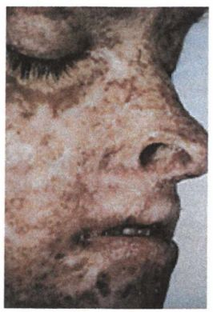 
图1：着色性干皮病患者

总的来说，年龄低于20岁的着色性干皮病(XP)患者比一般人患皮肤癌的风险高出2000倍，患舌尖鳞状细胞癌的风险高100000倍。着色性干皮病儿童患皮肤癌的平均年龄约为10岁，而正常人群患皮肤癌的年龄一般约为60岁。XP患者患其他疾病的风险也会升高，特别是神经系统疾病。
 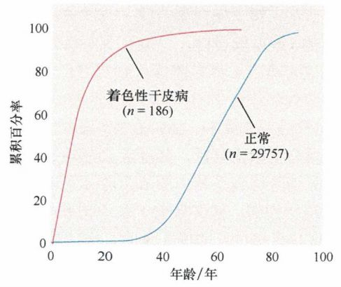 
图2：着色性干皮病的流行病学

现在知道有8个基因与XP相关，其8个XP相关基因中的7个，被命名为XPA~XPG,编码大的多蛋白 **核苷酸切除修复复合体(NER)** 的组分。第八个基因XPV为 **错误倾向DNA 聚合酶η（pol-η)** 。当细胞常用的DNA聚合酶（如DNA聚合酶δ) 不能复制未经修复的DNA损伤（如嘧啶二聚体）时，就会动用DNA聚合酶η。错误倾向聚合酶（有时被称为旁路聚合酶）能够复制包含仍未修复的T-T二聚体的DNA模板链，一般在互补链合成两个A。pol-η通常被认为是很准确的，95%的时间它可将AA核苷酸掺入到与TT相对的延伸链。

**Cockayne综合征**

其他一些遗传综合征也与 **NER的缺陷** 有关，如Cockayne综合征 (CS) 患者体内与转录偶联的NER相关的两个基因中一个有缺陷，他们的细胞具有与XP患者细胞相似的高光敏感性，死于该疾病的患者中位年龄是12岁。这种疾病非常罕见，因为显著的DNA修复损伤并没有表现出明显的肿瘤发病率升高。迄今尚未明确XP或Cockayne综合征相关突变等位基因为杂合型的个体患某种特定类型癌症的风险是否会升高。

**遗传性非息肉性结肠癌（HNPCC）**
 
遗传性非息肉性结肠癌(HNPCC)是一种家族性癌症综合征，代表了遗传性易感体质患结肠癌的普遍原因，占所有结肠癌的2%~3%。正如其名，HNPCC不同于我们前面提到的另一种类型的遗传性结肠癌易感类型——结肠腺瘤状。HNPCC患者的一种亚类在其80%的生命中都有患结肠癌的风险，除此之外，他们对脑肿瘤、子宫内膜瘤、胃癌、卵巢癌和泌尿系统癌症的易感性也会升高。
 
HNPCC患者的高癌症易感性可以追溯到其结肠中肿瘤进展速率的增加：腺瘤到腺癌在普通人群中的进展过程需要8~10年, 而HNPCC患者由于细胞的遗传不稳定性会使这一进程缩短至2~3年 。
 
绝大多数（85%~90%)HNPCC是由编码两种重要 **错配修复蛋白MSH2和MLH1** 的基因发生胚系突变所引起的，另两个MMR基因MSH6和PMS2的胚系突变只参与小部分（约15%) HNPCC的发生。但是，另两个在DNA修复中同样起重要作用的 MMR 相关基因 (PMS1、MSH3) 却极少发生胚系突变。与很多抑癌基因的遗传学特点相同，患者仅遗传一个有缺陷的MMR等位基因，这样的患者发生癌症时几乎所有的肿瘤细胞总是发生杂合性丢失(LOH), 使MMR基因的活性野生型拷贝丢失。
 
细胞失去发现和修复序列错配的能力将导致含有微卫星重复序列基因的突变率增加。关于这种修复缺陷的后果，一个早期的典型例子是对11个存在微卫星不稳定的结直肠癌细胞系的研究。在这11个细胞系中，有9个存在 II 型TGF-β受体编码基因的突变。特别是该基因的野生型阅读框中有10个腺嘌呤(A)核苷酸序列的延伸。然而在这9个细胞系中，TGF-βR II基因丢失了十腺嘌呤核酸序列聚合体中的一个或两个。这种改变使TGF-βR II基因的编码序列改变了阅读框，生成没有功能的 TGFβR II蛋白。可以想象，一旦肿瘤细胞前体不再表达TGF-βR II, 它们将逃避抗分裂原因子(TGF) 的生长抑制作用。
 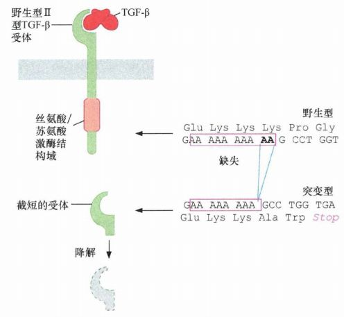 
图3：微卫星不稳定性影响 TGF-β 受体基因

几乎在这些所有的肿瘤中，微卫星不稳定的现象大多归因于甲基化导致的MLH1基因沉默。有趣的是，在与MMR缺陷肿瘤邻近的正常子宫内膜组织中，MLH1基因常被甲基化，表明甲基化是这一组织中肿瘤进展的早期事件之一。
 
MLH1和MLH2表达缺乏的细胞除了丧失错配修复功能之外，还表现出对在正常情况下激活G 2 /M检测点或诱导细胞凋亡的烷基化诱变剂的抗性。这种细胞在暴露于DNA损伤剂后仍然可以连续通过G 2 /M期从而逃避凋亡，在发生特定DNA损伤后，细胞还可产生MSH2突变，从而使MMR功能选择性地失活，而不影响其启动凋亡的能力。

**先天性乳腺癌和卵巢癌易感性**

到 目前为止，最著名肿瘤相关基因是 **BRCA1和BRCA2** 。这两个基因中的任何一个发生胚系等位基因突变都会导致先天性的乳腺癌和卵巢癌易感性。此外，BRCA2胚系突变的男性携带者在65岁前发生前列腺癌的风险将增加7倍以上。
 
在这两个基因第一次被发现时，由于其参与细胞增殖、生长和分化的动态调节，人们认为应该将之归于抑癌基因。但是越来越多的证据表明，这两个基因实际上参与维持基因组的完整性，应该归入“看守基因"(DNA 修复蛋白）的行列 ，而非 “门卫基因”（肿瘤抑制蛋白）。现在看来，这种划分过于简单化，随着BRCA1和BRCA2蛋白功能的逐步揭示，它们显示出更为广泛的核功能。
 
研究发现，BRCA1和BRCA2蛋白在核内形成复合体，并与许多其他蛋白相互作用。这个大的复合体含有 **RAD50/Mre 11和RAD51蛋白** ——与酵母中两个在电离辐射（如X射线）引起的DNA断裂修复中起重要作用的蛋白同源。同时，在该复合体中也发现了错配修复蛋白。
 
用能导致S期复制叉停滞的胫基脲处理细胞，可使BRCA1分子在细胞核中的复制叉部位聚集。许多这些停滞的复制叉被认为是双链DNA的断裂位点，这种断裂是复制叉处尚未复制的单链意外断裂引起的,产生的断裂通常通过 **同源重组修复(HR)** 或 **同源介导修复(HDR)机制** 修复。免疫荧光分析结果显示，BRCA1分子正常情况下以大量小点的形式分布于整个细胞核，胫基脲使BRCA1分子聚集为少数的几个大的离散点，其中含有定位于复制叉的增殖细胞核抗原(PCNA)。这些点还含有其他一些已知的DNA修复蛋白，包括Rad50和Rad51。BRCA2蛋白也在这些点中为其参与DNA修复过程提供了证据。而且，当用窄激光束有目的地使细胞核中不同区域出现双链DNA断裂时，发现BRCA1蛋白与γ-H2AX共定位于该区域。γ-H2AX是一个磷酸化的组蛋白，出现在双链DNA损伤的染色质侧翼位点。参与DNA修复的共20种不同的蛋白质也被募集到损伤区域，并且蛋白数目还在增加。
 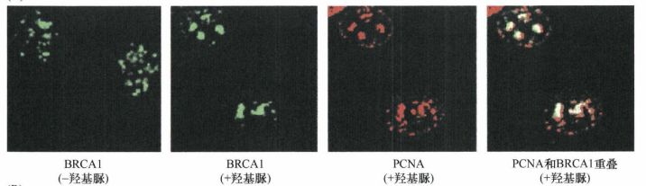 
图4：BRCA1及其DNA损伤的反应
 
上图中，BRCA1蛋白（用荧光标记的抗体检测）通常分布于S期细胞核内大量离散小点的位置（绿色，第一幅图）。但是，当用羟基脲处理S期细胞的时候，复制叉停止，BRCA1蛋白脱离这些小点，聚集为少数的几个大点（绿色，第二幅图）。可观察到增殖细胞核抗原(PCNA)也有相似的重新定位模式，已知该蛋白与复制叉相关（红色，第三幅图）。黄色点表示BRCA1与PCNA共定位（第四幅图）。这些停滞的复制叉往往是复制叉处尚未复制的单链DNA(因而很脆弱）偶然断裂造成的双链DNA断裂位点。这些结果表明，BRCA1被募集到了双链DNA断裂的位置。
 
使用抑制剂抑制BRCA1或BRCA2突变细胞的PARP酶活性：参与碱基切除修复 (BER)的DNA修复酶被PARP1蛋白［多聚 (ADP-核糖）聚合酶］募集于单链断裂位点（SSB site) 。这种酶结合于断裂位点并进行自身ADP-核糖基化（可能也使相邻蛋白糖基化) 。然后多聚-ADP尾作为锚定位点募集SSB修复酶，因此当PARP1被抑制时SSB将持续存在。当复制叉在S期通过断裂位点时，这些SSB将产生更严重的问题——双链断裂（DSB)。 下图中SSB（金色）通常通过BER被切除，然后由PARP1和招募的修复酶进行修复。但是，在PARP抑制剂存在的情况下，这些修复酶不能被招募，BER不能完成，从而导致在下一个S期复制叉通过时，原来的单链断裂转变为双链断裂(DSB) 。只有通过同源介导修复(HR)才能将这种断裂有效地修复为野生型，但在BRCA1和BRCA2突变细胞中，HR存在缺陷。
 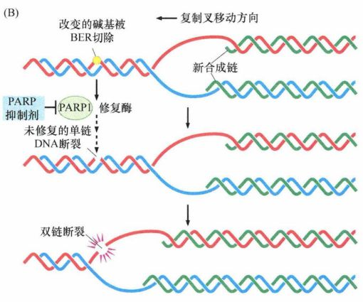 
图5：抗 PARP 药物对 BRCA2 阴性细胞的杀伤机制

在遗传学水平上敲除所有BRCA1功能的小鼠死于胚胎发育早期，但是仅丢失部分功能的BRCA2胚系突变等位基因造成恶性淋巴瘤的易感性增加和染色体异常，这些异常染色体结构显示两个染色体臂之间的非同源重组（或融合）率的增高。该染色体结构是DNA双链断裂异常修复的特征性结果，其中许多是由于可能偶然出现在细胞周期S期的复制叉处而造成的。此外，BRCA2缺陷导致中心体数目及随后的有丝分裂纺锤体失调，从而产生非整倍体，而且细胞内BRCA2水平降低还会导致有丝分裂后期胞质分离的延长。然而，检测体外培养细胞由X射线引起的DNA双链断裂中恢复正常DNA能力的实验提供了其他关于BRCA1和BRCA2突变细胞内双链DNA修复缺陷的证据。缺乏BRCA1大部分功能的细胞对X射线杀伤的敏感性和对于化疗药物如顺铂的敏感性显著增加（顺铂可以引起DNA链间的共价交联）。
 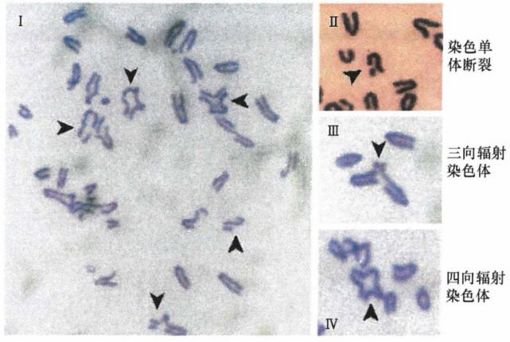 
图6：BRCA2 功能部分缺失引起的核型改变

一条染色单体上双链DNA断裂的修复，通常依赖于修复机器参照姐妹染色单体上未损伤同源序列进行修复的能力，即通过参照仍然完整的DNA片段指导修复装置重建断裂的双螺旋结构。因此，这种 同源介导修复(HDR) 主要发生在细胞周期S期的晚期和G2期，这个时期姐妹染色单体的DNA双螺旋可为修复损伤染色单体提供序列信息。
 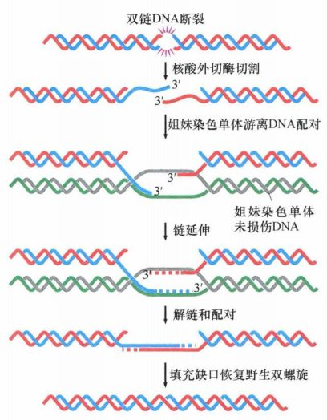 
图7：同源介导修复

在BRCA1或BRCA2功能丧失的细胞中，所有类型的同源介导修复(HDR)都存在，RAD51蛋白（可直接与BRCA2相互作用）的行为可能部分地解释这种现象。RAD51能结合单链DNA分子，使其侵入（并因此解开）同源双链螺旋，该过程是起始HDR必需的。BRCA2有8个BRC结构域，原则上每一个都可以与一个RAD51分子结合，表明BRCA2可将RAD51分子装配成线状，从而与单链DNA结合。如果缺少BRCA1或BRCA2,RAD51可能就不会被募集至双链DNA断裂位点，随后，HDR过程也不会正确地进行。在BRCA2突变细胞分裂中期观察到的三向辐射和四向辐射染色体，就是这些细胞内修复装置不能利用HR修复双链DNA断裂所导致。
 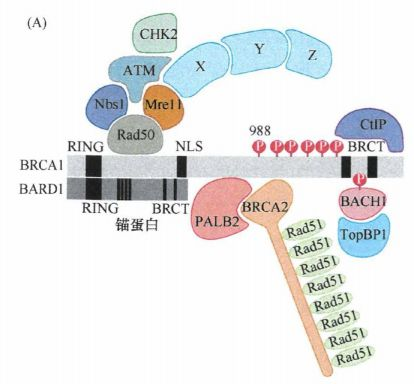 
图8：BRCA1、BRCA2 及其相互作用分子

BRCA1和BRCA2在维持染色体结构正常、避免癌症发生中到底如何发挥作用还不是很清楚。BRCA1和BRCA2可以与多种参与DNA修复核蛋白结合的事实说明，它们至少可部分地作为分子支架募集其他蛋白复合物。一旦完成聚集，这些修复蛋白就会协同作用，修复DNA上的损伤和大片段双链断裂。而且，BRCA1缺失可以破坏某些正常情况下对DNA损伤做出反应的细胞周期检验点调控。
 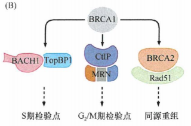 
图9：BRCA1 的作用

**Nijmegen断裂综合征**

 
Nijmegen断裂综合征患者也存在同源介导修复缺陷。他们的细胞缺乏Nbsl 蛋白质, 无法起始HDR。由于不能进行HR, 这些患者的细胞转而通过 **非同源末端连接(NHEJ)** 使两个双链DNA的末端发生融合。重建的DNA双螺旋中丢失了原本未损伤DNA双螺旋中的部分碱基对。
 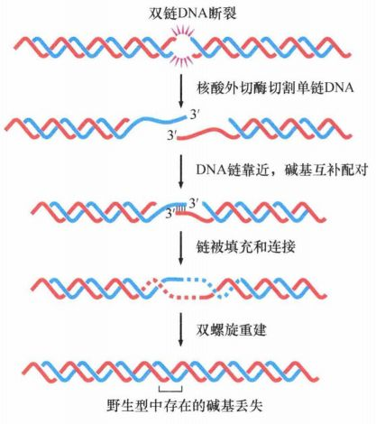 
图10：非同源末端连接

NHEJ必然是一个错误倾向过程，因为在一条染色单体上的野生型DNA序列并不知道其姐妹染色单体上排列有两条融合的DNA片段，产生的末端－末端融合在连接位点形成突变序列，导致Nijrnegen断裂综合征患者患恶性血液病的发病率较高。NHEJ机器中成员发生缺陷、同时p53功能缺失的小鼠淋巴瘤的发生率非常高。
 
有趣的是，NHEJ多发生在G 1 期，恰好是姐妹染色单体不能进行同源介导修复的时期。实际上NHEJ在DNA修复过程中的作用是独一无二的，因为其在与DNA损伤修复无关的正常生理条件下在导致功能性抗体和T细胞受体形成基因重排的过程中发挥作用。例如，形成编码抗原结合位点的DNA序列依赖于染色体V、D和J片段的重排和融合。当NHEJ需要的修复蛋 白全部缺失时这些DNA片段的融合便无法进行。这将 导致无法形成正常的免疫球蛋白分子（抗体）和T细胞受体，体液免疫和细胞免疫将都失去功能并导致重症联合免疫缺陷病(SCID)。类似地，大多数的类别转换需要NHEJ, 这是一个能融合VDJ片段的正常过程，负责编码免疫球蛋白的抗原结合部分，通过与免疫球蛋白基因的不变区片段结合，形成多种多样的抗体分子。

# 第十二章_4_《癌生物学》第十二章（4）癌细胞核型的变化

**前言** ：前三小节学完，第十二章的学习也接近尾声了，今天的学习任务相对比较轻松了哈。主要来讲解癌细胞核型异常的两种形式： **单条染色体结构的改变和无染色体结构改变的数量变化** 。

**癌细胞核型的变化**

早在对DNA损伤及其修复认识之前，人们就已经知道癌细胞中存在核型异常。实际上，人类认识到癌细胞中存在着异常染色体已经近一个世纪。在BRCA1和BRCA2功能缺失的细胞中可观察到二射体和四射体的中期染色体就是很好的例子。癌细胞中的核型异常有两种形式：单条染色体结构的改变和无染色体结构改变的数量变化。

**染色体结构的改变**
 
非整倍体通常指由正常（或整倍体）核型衍生而来的染色体数量的变化。但是，近年来非整倍体这一术语所指的范围偶尔也会扩大到包括单条染色体结构的变化，这种异常见于大部分实体瘤细胞（大于85%)。在此，我们使用一个更专业的术语 “染色体畸变”。
 
偶然发生在DNA复制叉的不能被修复的双链DNA断裂，被认为是染色体易位的主要机制。研究比较清楚的易位是myc原癌基因易位到3个免疫球蛋白之一的启动子/增强子序列，形成融合基因。在这些及其他的淋巴瘤中，引起免疫球蛋白和T细胞受体(TCR)基因重排的复杂机制似乎没有作用。该机制不引起免疫球蛋白和TCR基因序列的重排，而是催化错误的染色体间重组，使免疫球蛋白基因杂乱地与遍布于整个基因组中的序列融合，myc基因就是其中之一。发生在原癌基因myc 中的稀有易位可使其转录失调，细胞获得特异的增殖优势，导致细胞克隆出现，最终产生具有特异核型的淋巴瘤。
 
实际上，在多种造血系统的恶性肿瘤中报道了许多高度特异性的易位。引起蛋白质结构发生各种改变的分子机制还不清楚。但是，在第10章提到了一种很吸引人的假设，即端粒断裂引起的断裂－融合-桥(BFB)循环。
 
在各种造血系统肿瘤中发现一些相似的结构异常。许多这些易位是高频的，因为在一系列独立发生的肿瘤中都发现了这些易位。因为这些易位位于染色体上高度特异的位点，所以其发生的分子机制可能不同于上述的断裂－融合－桥循环。
 
我们在2010年发现，约25%的骨癌基因组和2%~3%的所有肿瘤基因组中存在着完全新型的畸变一局部爆发式染色体重排。仅仅一个灾难性事件就可以使基因组的片段发生碎裂，由此形成的各种构型的碎片随后被重新连接起来。至今“染色体碎裂 "的诱变机制仍不清楚。
  
图1：局部爆发式染色体重排

在造血及非造血细胞中发现的更为常见的易位分子机制同样也不清楚，在这些细胞中参与免疫球蛋白基因和T细胞受体基因重排的酶不表达。对DNA易位断裂位点及其周围序列分析发现了重复、缺失和倒位，这些发现提示一些具有“错误－倾向”的DNA修复机制，如前面提到的非同源末端连接(NHEJ)参与其中，但目前为止还很难得到证明。

**染色体数量的改变**

造成染色体不稳定的染色体数目变化通常是有丝分裂过程中染色体错误分离的结果。在正常的细胞周期M期，染色体排列到赤道板与由微管蛋白组成的纺锤体纤维相连，一起形成中期纺锤体。中期纺锤体是一种双极结构，每一个半极由微管纤维组成，其中许多由位于染色体的HT(与染色体着丝粒DNA相关的核蛋白体）延伸出来再回到中心体，后者负责整个中期纺锤体结构的组织。当这一“装置”正常运转时，纺锤体纤维牵拉成对的姐妹染色单体将二者分开，使每个染色单体分别移向一个中心体。这一过程保证染色体在两个子细胞中均等分配。
 
染色体分离的复杂过程是由一系列的检验点监控的，从开始就保证形成两个中心体和两个半极的纺锤体，只有在所有配对的染色单体都正确排列到赤道板后染色单体才可以分离。当这些检验点机制失去对染色体分离的监控后，配对的染色单体可能被拉向同一个中心体（即染色体不分离）。结果导致该条染色体在其中的一个子细胞中可能是单体，而在另一个子细胞中可能是三体。在有些情况下，某条染色单体可能没有与纺锤体纤维连接，从而在子代细胞的基因组中丢失。
 
非整倍体的一个更重要的来源是一种复杂装置的功能障碍。正常情况下，这种装置确保每个着丝粒准确结合在自己一套20~25个用于形成纺锤丝的微管上；每对姐妹染色单体原本是由配对的着丝粒连接，着丝粒与纺锤丝的连接可使姐妹染色单体在细胞有丝分裂后期被拉向相反的方向。然而，在许多癌细胞中这种控制机制不能正常运行，单个着丝粒与过多的纺锤丝相连接。例如，当某个着丝粒（属于单个染色单体）同时连接两套方向相反的纺锤丝时就会形成 **微管－染色体错误联结** （merotely),而微管－染色体错误联结就会参与一种微观的“拔河”比赛，这种竞争往往在有丝分裂完成时还未结束，从而使得携带此着丝粒的染色单体滞留在两组准确分离的染色单体（现称为染色体)之间。这条孤立染色体的命运是未知的，它可能完全丢失或者最终进入某个子代细胞核。
  
图2：微管－染色体错误联结

在正常细胞中，微管－染色体错误联结现象经常在细胞从分裂中期进入分裂后期时被校正修复。这种校正修复对正常细胞非常关键，因为发生微管错误联结的染色体不能解发 **纺锤体组装检验点** (SAC)。如果纺锤丝未能正确地连接到所有染色单体的着丝粒上，SAC就会阻止细胞进入分裂后期。实际上，癌细胞的14个不同SAC 调节蛋白中的一个或多个经常发生缺陷。具有某些SAC蛋白低表达的基因工程小鼠的自发肿瘤形成水平提高。
 
如果纺锤体本身没有正确的组装就会出现更广泛的核型混乱。在正常间期细胞的细胞质中可见一个中心体 , 有丝分裂过程中两个中心体在细胞内两极相对排列。但是在癌细胞中经常可见这种组织形式存在显著的缺陷，包括在间期出现 **多个中心体** 。结果可能是出现多极的，而不是正常细胞内见到的两极的有丝分裂纺锤体。通常，额外的中心体会在细胞有丝分裂过和中合并到正常的中心体中，但是它们形成的纺锤体纤维最终会形成没有功能的纺锤体－着丝粒连接。或者，这些额外的中心体可能持续存在，造成染色体分配至三个或更多的子细胞中。染色体错误地分配到子细胞中可能会导致染色体数目和整个核型的剧烈变化。
  
图3：左边单个中心体，右边多个中心体
 

  
图4：多级有丝分裂装置
 
保证染色体正常分离的复杂装置一旦损伤就难以恢复。从这方面来说，CIN与前面提到的断裂－融合－桥(BFB)循环不同，这种循环对基因组的影响发生在肿瘤进展过程中有限的窗口时间内，一旦细胞获得端粒末端转移酶使其核型稳定后，循环就停止。
 
中心体的复制与细胞周期进展是紧密协调一致的，这一过程可能发生在G1/S 过渡期或接近G1/S期。是越来越多的证据表明，中心体的复制与细胞周期蛋白E-CDK和细胞周期蛋白A-CDK复合物以某种方式协调作用。人乳头瘤病毒(HPV) E7 癌蛋白表达的原代细胞中出现中心体数目的失调，通常导致出现多个中心体。E7癌蛋白可结合细胞内的视网膜母细胞瘤蛋白(pRb蛋白）使其功能失活，并加速其降解。一种失去了与pRb结合能力的突变形式的HPV E7癌蛋白不能诱导额外中心体的出现。总之，这些证据表明pRb功能缺失的一个结果是中心体复制的失调。
 
在人类宫颈癌细胞中就发现了这种形式的染色体不稳定，几乎所有的这些细胞都表达HPV基因组的早期区域，该区域携带有编码病毒E6和E7癌蛋白的基因。
 
HPV E6蛋白与其他可使p53功能失活的因子一样，可促进非整倍体的形成，因为关键抑癌基因功能缺失的细胞更容易出现非整倍体基因组。因此，HPV E7癌蛋白使中心体数目不稳定，而E6癌蛋白通过对p53蛋白的作用，使细胞对最终出现的中心体异常耐受。p53 功能、有丝分裂检验点的控制及染色体数目的监控三者之间的信号网络还不是很清楚。pRb调节的失活可导致控制R点转化的监控机制失效，从而使 HPV 感染初期的细胞立即获得增殖优势。
 
有丝分裂调控基因的一个例子是CHFR,纺锤体微管和中心粒排列异常时，该基因编码的蛋白通常可阻止细胞周期由前期进入中期。
 
另一个对M期进展有关键调节作用的是14-3-3蛋白σ。当基因组DNA受到损伤时，p53诱导14-3-3σ的合成，随后该蛋白在细胞质中捕捉周期蛋白B-Cdc2复合物 ，通过隔离这些周期蛋白-CDK复合物，14-3-3σ成功地阻止了细胞进入M期从而终止有丝分裂，直到损伤的染色体DNA得到修复。

# 第十三章_1_《癌生物学》第十三章（1）_肿瘤发生类似伤口损伤愈合

“对癌症的许多认识都归功于还原论方法：将正常组织与肿瘤组织分解为细胞，再将这些细胞细化为分子。虽然由此获知的信息只涉及复杂系统的一小部分，但这部分至少是确信可靠的，且后续研究者对复杂系统及其组分进行研究时不必对这一部分做本质上的修改。

癌症绝不仅仅是肿瘤细胞内部相互作用的结果，相反，大多数肿瘤组织中恶变细胞与正常细胞不停地进行交流。本章我们将着重讨论上皮癌 ， 因为对这些肿瘤组织内部恶变细胞与正常细胞间的相互作用较其他类型肿瘤了解得更为清楚。 ”

1、 正常和恶性上皮组织均由相互依存的不同细胞类型组成

除了恶变的上皮细胞外，多种间质细胞也参与构成上皮来源肿瘤组织。这些间质细胞包括成纤维细胞、肌纤维细胞、内皮细胞、内皮细胞、平滑肌细胞、脂肪细胞、巨噬细胞、淋巴细胞及肥大细胞。种类繁多的间质细胞可产生结缔组织，以及在血液和免疫系统中产生多种免疫细胞，因此与转化后可导致癌变的上皮细胞在生物学上有很大区别。

图 13-1-1： 多色流式细胞仪监测实体瘤间质中的不同细胞类型

为什么其他类型的细胞会存在于上皮癌间质中呢？

一种可能的解释是：在这种组织中，适当比例的不同类型细胞必须依赖其间待续的信号交流，这种相互作用包括多种不同分化方向的细胞类型，它们之间的通信称为异质性信号转导，不同细胞通过这种方式促进或限制其邻近细胞的生长。 由此推测，在正常组织中的许多异质性相互作用在该组织形成的肿瘤中也发挥重要作用。这可能意味着如同正常上皮细胞一样， **肿瘤细胞通过招募邻近的正常组织和远处骨髓中的间质细胞来控制其数量并促进其增殖** 。另外，间质细胞也可能影响肿瘤上皮细胞的增殖和存活 。

在正常组织中，异质性信号通路主要依赖下列因子间的交换： 1.生长因子，如血小板衍生生长因子（PDGF）；2.生长抑制信号，如转化生长因子-β（TGF-β）；3.营养因子，如胰岛素样生长因子（IGF）。这些因子分泌到细胞外间隙的同时，通常短距离发挥仵用 ， 并且它们的定位对其功能非常重要 。

而在肿瘤组织中，间质－上皮异质性相互作用的各种细节到今天已经被详细阐明。它们几乎在肿瘤进程的所有阶段都起关键作用，包括肿瘤最初的形成阶段。例如，癌细胞释放生长因子、细胞因子和趋化因子招募巨噬细胞、中性粒细胞和淋巴细胞至肿瘤相关间质，然后招募 的细胞释放 TNF-α和前列腺素引起炎症反应，从而进一步促进附近上皮细胞的增殖和血管生成。在肿瘤形成以后异质性相互作用仍然存在。例如，肿瘤上皮细胞释放PDGF，而间质细胞（特别是成纤维细胞、肌成纤维细胞和巨噬细胞）含有相应的受体，同时间质细胞释放IGF-1,促进周围肿瘤细胞的生长和存活。

正常上皮组织中间质细胞和上皮细胞互相协作，建立起存在于二者之间的特殊细胞外基质（ ECM），也称为基底膜或基底层。组成毛细血管和大血管及淋巴管的内皮细胞是正常和恶变间质中的重要成分，这些内皮细胞的增殖由上皮和间质中的其他细胞促进，从而确保其获得充足的血液供应。当毛细血管被组装并具有功能后，可为邻近细胞提供足够的养料和氧；当细胞缺乏足够氧时就会释放可促进毛细血管生长的血管生成因子。

图 13-1-2： 毛细血管（绿色）和淋巴管（红色）交错成网：淋巴管直径远大于毛细血管，但淋巴管内皮细胞不受其下的壁细胞（周细胞和平滑肌细胞）支撑

当毛细血管生成时，内皮细胞分泌生长因子促进其他非内皮细胞的增殖。最重要的是，内皮细胞释放 PDGF和HB-EGF，吸引周皮细胞和血管平滑肌细胞，共同形成毛细血管外壁。当位于合适位置时，周皮细胞 又会 释放血管内皮 生长 因子（ VEGF）和促血管生成素-I(Ang-I)，反过来为最初招募它们的内皮细胞生长提供生长信号。

2、 癌细胞在形成细胞株的过程中行为异于体内肿瘤

为了在体外培养肿瘤细胞，研究者将肿瘤组织标本中的癌细胞 在 体外 培养皿中 培养。 然而 大多数情况下，这样的集落并不能形成 。 能够形成克隆的细胞常常是间质来源的，特别是成纤维细胞，可被培养基血清中的 PDGF促进生长。

少数情况下，在培养皿中长时间培养肿瘤组织，癌细胞增殖活跃的克隆的确能够生长起 来 。这些癌细胞在体外选择压力下，获得了自发生长的能力，且不依赖于间质的支持，因此其进化已经不再受大多数肿瘤中癌细胞在体内所处的肿瘤进展阶段的影响。这些肿瘤细胞系 （常用有几十株 ）是癌症研究的标准对象。这些细胞可被植入免疫缺陷小鼠中，迅速增殖并形成移植瘤。 （ 裸鼠、 NOD/SCID小鼠及RAGl/2小鼠由于缺乏免疫系统而可容忍其他物种的组织生长而被用于此类实验。 ）

3 、 肿瘤组织与未愈合的损伤组织类似

实际上，肿瘤内异质性相互作用的信号传递非常复杂，涉及许多信号分子在不同细胞间的交换 ， 且许多正常组织中不存在这样的信号转导 。 由此引出一些问题：肿瘤细胞是怎样学会释放和应答这样一系列异质性信号的？复杂的信号转导程序及其引起的生物应答是肿瘤在进化过程中逐渐获得的，还是肿瘤利用了正常组织中预存的程序？

1986年，有研究者在观察肿瘤组织和愈伤组织结构时，注意到许多信号转导在肿瘤发展和伤口愈合时有惊人的相似性。若这种相似性被证明的话，则说明癌细胞只不过是激活了复杂而普通的生理过程——伤口愈合，这 一 已经存在基因组中的程序。

图 13-1-3 ：伤口愈合模式图

伤口愈合过程已被研究得非常深入，当皮肤形成创伤时，血小板凝集并释放一些分子，包括血小板衍生生长因子（ PDGF）和转化生长因子-β(TGF-β）。伤口会释放血管活性因子，增加伤口附近血管的渗透性，帮助伤口从血浆中得到纤维蛋白原，后者转化为纤维蛋白，成为血块的支架，成簇的纤维蛋白缠绕在血小板团块周围起止血作用。 血小板释放的 PDGF能吸引成纤维细胞并刺激其增殖，随后血小板衍生的TGF-β激活这些肌成纤维细胞并诱导其分泌基质金属蛋白酶（MMP）。受伤位点招募的大量巨噬细胞也分泌这些蛋白酶。激活的成纤维细胞还释放有丝分裂原，如各种成纤维细胞生长因子（FGF），刺激特定上皮细胞的增殖。

MMP一旦释放，便开始降解胞外基质（ECM）中的特定成分，导致两种主要结果：一方面使ECM结构重塑，为新的细胞留出空间；另一方面导致许多黏附于ECM上且处于未激活状态的生长因子的释放并激活，包括碱性成纤维细胞生长因子(bFGF)、TGF-β、PDGF、EGF-相关因子和干扰素-γ（IFN-γ）。

血小板释放的和 ECM来源的生长因子随后吸引单核细胞（其会迅速分化成巨噬细胞）和其他类型的吞噬细胞，称为中性粒细胞，浸入伤口位置。这些细胞清理伤口并清除外来物质、细菌及组织碎片，同时释放并激活有丝分裂因子，如成纤维细胞生长因子（FGF）、血管内皮生长因子（VEGF），刺激内皮细胞增殖并构建新的毛细血管，即血管生成过程。

当这些事件在愈伤间质部位发生时，此处的上皮细胞也在进行自我更新。上皮细胞减少其与 ECM，特别是基底膜的黏附，其运动能力大增。愈伤组织周围的上皮细胞之间的相互按触也被切断，连接相邻上皮细胞的E-钙黏蛋白表达降低，并常常被替换为N-钙黏蛋白。当表达不同的细胞表面钙黏蛋白后，处于愈伤组织周边的上皮细胞发生形态学改变，呈现出成纤维细胞的外观，上皮细胞具有运动能力和侵袭性，这种改变称为上皮－间质转化（EMT），可使上细胞游走至伤口部位，并填充伤口产生的组织损伤缺口。

图 13-1- 4 ： 上皮－间质转化： MMP-3能降解E-钙黏蛋白，刺激单层上皮细胞EMT的发生 ： 上皮细胞蛋白，如细胞角蛋白（深粉红色）和 E-钙黏蛋白表达减少；间质细胞蛋白，如波形蛋白、纤维结合素和N-钙黏蛋白表达增多；此外细胞形状由多边形转变为成纤维细胞的形态，且常常因此获得运动和侵袭能力。

EMT仅是细胞形态暂时性的改变，当这些细胞到达伤口位置并覆盖伤口后，它们将启动逆向程序重建上皮组织，这样的程序称为间质－上皮转换（MET），伤口完全愈合后上皮组织内的细胞便不留有任何间质细胞的痕迹。

图 13-1- 5 ： 伤口愈合流程图

与伤口愈合过程相同的是，由癌细胞产生的 PDGF靶点都是表达PDGF受体的间质细胞，包括平滑肌细胞、成纤维细胞和巨噬细胞。对于间质细胞，PDGF同时起到诱导物和有丝分裂原的作用，可能是癌细胞招募并剌激间质细胞增殖的重要信号分子。癌细胞释放的PDGF首先招募成纤维细胞进入纤维蛋白基质。同时，招募来的成纤维细胞通过整合素附着在纤维蛋白基质的骨架上，并可以在其上迁移。侵入的间质细胞通过降解许多最初形成的纤维蛋白分子，并用一种由成纤维细胞分泌的胶原组装成的更为永久性的基质替代它们，从而重塑这一“临时性基质”。这与伤口愈合时的有序性过程一致。

在伤口愈合过程中，间质细胞的任务之一是使伤口边缘收缩从而闭合伤口。收缩由肌成纤维细胞 的特殊成纤维细胞调节。肌成纤维细胞同样在慢性创伤中出现，即那些持续发炎的组织在大多数晚期肿瘤的间质中也存在大量此类肌成纤维细胞。

大多数间质成纤维细胞和肌成纤维细胞的来源尚未阐明。伤口愈合期间，参与凝集的血小板释放 PDGF, 从相邻组织间质中招募成纤维细胞。TGF-βl诱导这些成纤维细胞的一部分转分化成为肌成纤维细胞。事实上，TGF-βl 在体外可诱导正常的成纤维细胞成为肌成纤维细胞，这提示许多类型的癌细胞，尤其那些正在向更高恶性程度进展的癌细胞所分泌的TGF-β1，是肿瘤相关间质中肌成纤维细胞形成的主要原因。

肌成纤维细胞的其他来源也已被证明：它们可能产生自成纤维细胞和起源于骨髓的间充质干细胞（ MSC）。两种类型的细胞都在循环系统被发现，并且已知可以定位到组织损伤的区域，在此它们可以分化成肌成纤维细胞或成纤维细胞，从而促进间质的快速重建。这个机制确保大量细胞可以快速动员伤口外部的原料从而加快损伤间质的重建。同样地，MSC被大量招募到各种癌症的间质。由于起源于MSC的分化的肌成纤维细胞也是血管生成的强诱导者，这使MSC及其形成的肌成纤维细胞成为肿瘤生长的关键调控因子。

图 13-1-6： 通过抗原染色的方法检测 α-SMA，在伤口愈合部位、发炎部位和肿瘤相关间质中发现肌成纤维细胞：（A) 小鼠皮肤受伤后3天（褐色为肌成纤维细胞）；（B) 肝硬化组织（棕色为肌成纤维细胞）；（C) 肝细胞癌（棕色为肌成纤维细胞）

肌成纤维细胞形成的肿瘤间质与正常上皮组织间质在外观上有着很大区别，基于这一特征性的外观，病理学家将其称为 “反应性的”或促结缔组织增生的间质。后一名称说明，由于肌成纤维细胞的作用，造成广泛的细胞外基质沉积，导致肿瘤硬块的形成。在肿 瘤 向更高级别、更具侵袭性发展的过程中，促结缔组织增生间质的比例也在增加 。

比较 伤口愈合 过程同肿瘤细胞与相邻间质细胞的相互作用，发现 **伤口愈合与肿瘤发生极为相似** 。

# 第十三章_2_《癌生物学》第十三章（2）_间质细胞可促进肿瘤

“ 通过上一讲，我们知道了，恶性上皮 同 正常 上皮一样 ，由相互依存的不同细胞类型组成 ，且 不同类型细胞 通过 异质性信号转导 传递信息 ，促进或限制其邻近细胞的生长。 此外， 肿瘤发生与伤口愈合 过程 极为相似 ，这提示 癌细胞只不过是激活了伤口愈合这 一 已经存在基因组中的程序。

今天，我们具体讨论间质细胞在肿瘤发生发展过程中的重要作用。 ”

1、 间质细胞的活化促进肿瘤发生

在一项研究中，通过导入 PDGF表达载体使原来非致瘤性的、永生化的角化细胞分泌高水平的PDGF。释放的生长因子在体外对这些细胞的增殖并没有影响，因为它们的表面没有表达PDGF受体。然而，当这些细胞被植入宿主鼠体内时，它们形成了增殖旺盛的肿瘤，这种能力无疑是因为它们可以释放PDGF以招募并激活间质细胞。然后，间质细胞又与分泌PDGF的角化细胞相互作用，并促进其增殖，最终引发后者的恶性转化。

在一个补充实验中，研究者通过基因工程技术改变小鼠种系，使他们能灭活各种组织间质成纤维细胞中的 TGFβ II型受体。结果导致间质细胞对TGF-β介导的生长抑制不再敏感，并在多种组织中发生间质增生。其中一些过度增殖的成纤维细胞促进附近上皮细胞增殖，最终形成癌。再一次证明 **间质细胞有刺激上皮细胞增殖的能力，并导致上皮细胞的致瘤转化** 。

图 13-2-1： 间质成纤维细胞发生遗传改变的小鼠形成的前列腺肿瘤

正常上皮组织的间质细胞加速肿瘤形成的效率是否与癌间质细胞相同 呢？ 通过比较提取自正常上皮组织的间质成纤维细胞与提取自癌组织的肿瘤相关成纤维细胞（ CAF）的行为 可 得到答案。

在一系列实验中，成纤维细胞纯化自正常人前列腺的间质，而 CAF来自于人前列腺癌的间质。每个细胞群体与另外的非致瘤性的、SV40大T抗原永生化的人前列腺上皮细胞混合，然后植入免疫缺陷的裸鼠。结果显示这些混合组织移植物的生长有显著差别，特别是同时含有CAF和永生化前列腺上皮细胞的移植物形成的肿瘤 ， 比同时含有正常人前列腺成纤维细胞和永生化的前列腺上皮细胞形成的肿瘤大 500倍（当单独注射时，CAF不形成肿瘤）。该实验证明，这些CAF在功能上与正常前列腺组织中的间质成纤维细胞有很大的不同。在肿瘤进展过程中，间质细胞对邻近上皮细胞的存活和增殖起到越来越重要的作用。

图 13- 2-2： CAF诱导血管新生：人MCF7-ras 乳腺癌细胞与正常人乳腺间质成纤维细胞混合（左）形成的肿瘤在肿瘤相关间质（蓝色）中显示有相对较少的血管（红色）；与肿瘤相关成纤维细胞（CAF, 右）混合 的 形成肿瘤伴有大量血管和红细胞（红色）

那么，肌成纤维细胞的 CAF群体是如何加速肿瘤生长的呢？鉴于血管生成在肿瘤发生过程中通常是一个限速步骤， **混合 CAF的促肿瘤作用可能很大程度上是由于其能加速肿瘤血管生成** 。 事实上， 肌成纤维细胞释放间质衍生因子 -1（SDF-1, 也称CXCL12) ，后者 招募循环中的内皮前体细胞（ EPC）进入肿瘤间质。 此外， 肌成纤维细胞分泌的 VEGF有助于诱导这些新成员分化成为内皮细胞，形成肿瘤的新血管系统。

图 13-2-3、图13-2-4： CAF比正常乳腺间质成纤维细胞吸引更多EPC：将用绿色荧光蛋白标记的表达内皮前体细胞（EPC）特征性表面抗原的骨随细胞 置于 小室的渗透性膜的上面，正常乳腺间质成纤维细胞或来自乳腺癌细胞 CAF被置于下层小室底部的表面，18小时后用荧光显微镜计数被募集于下层小室底部的EPC数量

目前广泛接受的假设认为，肿瘤脉管系统中出现的内皮细胞有两个来源：绝大部分源于现有内皮细胞的增殖（包括相邻的正常组织中的内皮细胞）；另一小部分源于骨髓来源的 EPC，它们随循环系统到达肿瘤间质。

2、 巨噬细胞和骨髓细胞在活化肿瘤间质中起重要作用

起初认为，肿块大量募集巨噬细胞可能对肿瘤形成不利，因为巨噬细胞通常由免疫系统产生，清除并破坏感染性的物质及异常细胞。但越来越多的证据显示，这些免疫细胞在促进肿瘤发展中也起重要作用。

骨髓中髓系单核细胞被癌细胞募集进入肿瘤，而后被诱导分化为巨噬细胞。这种募集依赖于趋化因子传递的趋化信号，这些因子为运动的细胞提供定向信号。多种类型的神经外胚层细胞和上皮性癌细胞分泌 的 单核细胞趋化蛋白 -1 (MCP-1) 和 其他肿瘤细胞释放的集落刺激因子 -I（CSF-1） 均 有助于刺激单核细胞分化为巨噬细胞。

巨噬细胞一旦定居于肿瘤间质中，即刺激血管生成 ，特别 是在肿瘤的乏氧区 。（ 虽然仅凭募集的巨噬细胞并不能完全弥补局部血管生成的缺陷。 ） 在一些癌症中， **产生 MCP-1的水平、巨噬细胞存在的数量与各种肿瘤诱导血管生成的水平直接相关** 。利用实验的方法促进肿瘤表达 MCP-1后，该趋化因子使得肿瘤细胞吸引更多巨噬细胞，后者分泌重要的血管生成因子，特别是VEGF和IL-8，导致血管生成活性显著增加。此外，当肺癌细胞在体外暴露于培养的巨噬细胞所分泌的各种因子中时，肿瘤细胞就会产生IL-8和许多其他促进血管生成及细胞侵袭的蛋白质作为应答。

图 13-2-5： 巨噬细胞参与血管形成模式图

与肌成纤维细胞类似， 肌成纤维细胞释放间质衍生因子 -1（SDF-1,也称CXCL12) ，后者 招募循环中的内皮前体细胞（ EPC）进入肿瘤间质。 此外， 肌成纤维细胞分泌的 VEGF有助于诱导这些新成员分化成为内皮细胞，形成肿瘤的新血管系统。

MMP-9也可以裂解IGFBP (胰岛素样生长因子结合蛋白），后者通常在细胞外空间灭活IFG分子。释放IFG, 为邻近的细胞（包括肿瘤细胞）提供生存信号。在晚期乳腺癌中，肿瘤相关巨噬细胞也能直接帮助癌细胞，因为它们是驱动表达EGF-R的癌细胞增殖的上皮生长因子(EGF) 的主要来源。

一些巨噬细胞参与肿瘤进展，而另一些形态上不同的巨噬细胞亚系辅助免疫系统，可以发现并杀死癌细胞。然而，它们在许多类型的肿瘤中都没有起到免疫作用。可能是一些肿瘤细胞获得了减弱第二类巨噬细胞的肿瘤杀伤作用的能力，而帮助肿瘤进展的第一类巨噬细胞保留着完整的功能。或者，肿瘤细胞具有某种逃避机制，使其不被巨噬细胞识别和破坏。

髓系细胞中还有第二种促进肿瘤侵袭的细胞。未成熟骨髓细胞 (iMC)在小鼠的结直肠癌模型中研究得最为清楚。通过使Apc和Smad4双基因失活建立小鼠自发结直肠癌模型，Smad4是TGF-β信号转导的关键蛋白，该模型所产生的腺瘤或腺癌细胞分泌趋化因子CCL9，后者能招募来源于骨髓的iMC。 **iMC聚集于肿瘤侵袭的前沿，分泌基质金属蛋白酶MMP-2和MMP-9，协助肿瘤细胞向下面的组织层侵袭** 。后续研究显示，如果没有 MMP-2和MMP-9，iMC就不能促进小鼠结直肠癌细胞的侵袭和转移，并且原发瘤中癌细胞的转移能力依赖于其对iMC的募集。

# 第十三章_3_《癌生物学》第十三章（3）_血管生成与肿瘤

“通过上一讲，我们知 道了，多种间质细胞的活化都可以促进肿瘤的进展。 肿瘤相关成纤维细胞（ CAF） 和 肌成纤维细胞 既可以 释放间质衍生因子 -1（SDF-1 ），后者 招募循环中的内皮前体细胞（ EPC）进入肿瘤间质 ，也可以 分泌 VEGF ，以 诱导形成肿瘤的新血管系统 ；小鼠 腺瘤或腺癌细胞 可 分泌趋化因子 CCL9，后者能招募来源于骨髓的未成熟骨髓细胞 （ iMC ）， iMC聚集于肿瘤侵袭的前沿，分泌基质金属蛋白酶MMP-2和MMP-9，协助肿瘤细胞向下面的组织层侵袭。

今天，我们讨论内皮细胞及血管新生在肿瘤发生进展中的作用。 ”

1、 内皮细胞及其形成的血管确保肿瘤接近循环系统

早在 20世纪50年代中期，病理学家就注意到肿瘤优先生长在血管周围：距离血管0.2mm之外的肿瘤细胞不再生长，而再远处的肿瘤则会死亡。在距离血管大约0.2mm的这一半径范围内的细胞可依赖扩散保证它们的供氧，在这个距离之外的细胞则要经受中度或严重的乏氧和低pH的影响，有坏死的危险。

图 13- 3-1： 前列腺癌中的大规模坏死：中心生长的是腺癌癌巢（深红色），其被大量的间质 （浅红色） 包围，癌巢的中央是一大块坏死的组织（浅红色）。腺癌细胞因 接近间质和相关的血管系统而 生长旺盛

乏氧不是细胞远离循环系统所付出的唯一代价， 除获取氧气之外，脉管系统对于所有类型组织（正常及肿瘤组织）的生长和存活均具有重要意义 。细胞还需要与血管系统进行有效的相互作用以获取营养，并排泄代谢废物和二氧化碳。组织中所有细胞与最近的毛细血管的距离都不超过几个细胞的直径，在一些正常组织，尤其是具有高代谢活性的组织中，多数细胞都倾向于与至少一根毛细血管直接接触。

在胚胎发育过程中，一个器官或组织的结构和总体大小是由遗传编程的，但单个细胞的精确定位并非如此。这同样适用于脉管系统：基因组决定主要血管的总体布局，并将设计和装配局部毛细血管网和稍 大 血管的任务委派给组织内的单个细胞。短距离的异质性相互作用决定了构建脉管系统的单个毛细血管的路径。更加特别的是，组织中的毛细血管似乎可在任何需要它们的、无血管（即实质）的细胞处形成。

肿瘤发生过程与上述情况相似。一个生物体的基因组不能决定肿瘤的总体构造，因为每个肿瘤都是新创造的，而不是由基因组预先设定的。这暗示肿瘤血管生成也是如此。肿瘤不能依照遗传信息配置它们的血液供给系统，而是必须根据肿瘤发展的不同阶段，调整脉管系统的布局。特别是在组装它们自己的供血系统时，肿瘤完全依赖瘤内无脉管的细胞（包括肿瘤细胞和其他类型的起支持作用的基质细胞）与脉管系统的细胞（包括内皮细胞、周细胞和平滑肌细胞）间局部的异质性相互作用。

将小块肿瘤移植至实验动物如兔子的角膜或耳中，揭示出血管生成因子的存在及其能力。几天之内，先前存在的毛细血管床中即形成密集的毛细血管网和较大的血管，这些毛细血管网及血管进而汇聚于移植的肿瘤块中。

图 13- 3-2： 通过插在小鼠皮肤肿瘤上的窗观察 皮下移植瘤的血管生长

在正常组织中可见毛细血管被周细胞系统地覆盖，与之形成反差的是它们在肿瘤相关毛细血管附近的杂乱分布。肿瘤中典型的毛细血管直径是正常的 3倍。而且， **肿瘤内部及肿瘤周围血管的整体布局相当混乱** 。

肿瘤中毛细血管和较的血管建造得如此随意的确切原因还不清楚。一种可能的原因是两种互相桔抗的生长因子（促血管生成素 -1 和促血管生成素-2) 之间的平衡被打破。VEGF通过吸引和刺激内皮细胞启动毛细血管生长，而促血管生成素-1 和促血管生成素-2的混合物诱导内皮细胞招募周细胞和平滑肌细胞，使得新形成的毛细血管成熟为由3种细胞类型（即内皮细胞、周细胞和平滑肌细胞）以适当比例构建起的血管。这两种 拮抗 的促血管生成素的不平衡及肿瘤内过高的 VEGF,可能是大多数肿瘤中脉管系统构件缺陷的原因。实际上，一些实验表明在正常的皮肤中仅通过表达VEGF-A即可模拟肿瘤相关微血管的异常组织形态。

图 13-3- 3 ： 活体组织血管成像技术显示 肿瘤相关血管的组织紊乱

在亚显微水平，肿瘤块中的毛细血管是随意组装的。因为相邻内皮细胞的质膜并没有相互接触形成围绕毛细血管腔的无缝隙内层，相反经常保留着几微米宽的缺口，导致毛细血管周围的细胞直接接触血浆，由此导致的渗漏可能是肿瘤实质中血纤维蛋白沉积的原因。

定量测量显示肿瘤中毛细血管壁的通透性比正常毛细血管高 10倍。有些渗漏可能是由于毛细血管壁组装缺陷。但是， **多数渗漏可能是由肿瘤细胞和肿瘤相关间质中的巨噬细胞和成纤维细胞分泌 VEGF失调所致** 。当给荷瘤小鼠注射 VEGF中和抗体后，肿瘤相关毛细血管的渗透性显著降低。 然而， VEGF造成血管渗透性增加的机制尚不清楚。

图 13-3-4： VEGF引起毛细血管渗漏：用包装有VEGF-A表达载体的腺病毒感染小鼠的耳朵，此后将伊凡思蓝染料注入小鼠循环系统，30分钟后成像显示，VEGF-A表达的时间越长，微血管的渗漏程度越严重

肿瘤相关毛细血管的渗漏导致肿瘤实质间隙中大量体液的累积。在正常组织中，这些体液可由淋巴管引流最终进入静脉循环。而在实体瘤中，癌细胞群的扩张使淋巴管外部压力增大，使仅存的淋巴管坍塌。在实体瘤核心区域中，由此导致的淋巴排泄系统缺陷进一步加剧了由毛细血管渗漏造成的体液积累，在肿瘤的无脉管部分产生相对较高的液压。

2 、 血管生成开关的开放对肿瘤扩张是必需的

Rip-Tag 转基因小鼠实验研究了 肿瘤发生血管生成的机制，该小鼠携带一个胚系转基因 -胰岛素基因启动子驱动SV40大 T抗原和小T抗原的表达，确保病毒癌蛋白在胰腺中形成胰岛的β细胞中表达。10周龄时，Rip-Tag小鼠约一半的胰岛形成增生结节 ； 12 - 14周时，最初形成的增生性胰岛中约3%最终进展成为癌。

图 13-3-5： 胰岛细胞肿瘤进展的 Rip-Tag 模型

在 Rip-Tag小鼠小的肿瘤细胞巢中，细胞因被转入的致癌基因驱动而持续不停地分裂 ，但 每个胰岛中肿瘤细胞群体的总体大小保持恒定，因为细胞会通过凋亡进行代偿消耗。该模型提示，人类中小肿瘤细胞巢在很多年里保待这种不断分裂但体积不变的状态，无法突破限制它们的屏障。且这种 屏障 并非 是物理性的 ，而是因为 这些细胞还没有开始形成血管，缺乏脉管系统 ， 由此导致的乏氧触发 了 p53依赖的凋亡 。

然而在某些时间点上，一小群癌前胰岛细胞突然获得了引起新血管生成的能力，限制它们及其后代增殖的因素被解除。这种小肿瘤块行为上的瞬间显著改变称为 “ 血管生成开关 ”。 **血管生成开关无疑是肿瘤进展中的一个** **重要** **步骤，代表癌细胞成功突破了这一防御屏障并且获得随意诱导血管生成的能力** 。

这些 β细胞在血管生成开关出现之前很久就已制造了大量的VEG，但这些VEGF分子被周围的细胞外基质（ECM）有效隔离，不能刺激血管生成。而在Rip-Tag胰岛中的血管生成开关伴随着突然出现大量的基质金属蛋白酶-9（MMP-9），MMP-9以靶向作用的方式裂解ECM的特定成分，从而释放VEGF。MMP-9是由被招募了癌变前胰岛的炎性细胞（肥大细胞和巨噬细胞）合成并释放的。因此，在此特定的组织中， **血管生成开关的开放在根本上是依赖于招募炎性分子的能力的** 。

图片 13-3- 6 ： 血管生成开关及炎性细胞的招募

用基因工程技术选择性地使胰岛细胞中编码 VEGF的基因缺失，胰岛存活并且肿瘤的早期步骤仍然可以正常地进行，但不会出现血管生成开关。这更加说明了 **胰岛细胞** **来源** **的 VEGF分子在触发血管形成中起关键作用，而且招募的基质细胞不能通过其自身带来的VEGF补偿这种VEGF的缺乏** 。

需要注意的是， Rip-Tag模型不能代表所有类型肿瘤形成过程中发生的血管形成机制。例如，在一些肿瘤中，血管形成似乎是逐渐增多的，这与Rip-Tag胰岛的行为形成反差。此外，其他肿瘤可能依赖不同的血管生成因子引发血管形成。

3 、 血管生成开关启动一个高度复杂的过程

肿瘤早期血管生成是受限制的，只有当肿瘤细胞变得有侵袭性、穿透基底膜，并获得与间质细胞直接而密切的接触时，才开始大量生成血管，这表明 **肿瘤的侵袭和血管大量生成是紧密相连的两个过程** 。在许多类型的人类肿瘤中，显微镜下平均每个视野中的毛细血管密度会随着肿瘤的恶性程度而增加， 且 大量表达 VEGF（除HER2外）的乳腺癌患者在初次诊断后的治疗效果就很差，这些表明血管生成开关仅是使肿瘤逐渐发生血管生成并加速脉管系统形成的诸多阶段中的第一步。

图 13-3-7： 肿瘤获得侵袭性前 /后的毛细血管（褐色）：(A) 良性前列腺上皮内瘤变中的毛细血管远少于浸润型前列腺癌 （B)乳腺导管原位癌中的毛细血管远少于浸润型导管癌

血管生成开关可能使少量肿瘤细胞在血管生成开启后可以增殖并最终占据肿瘤大部分体积，从而使得肿瘤整体上均有血管生成表型。实际上，通过分析从人移植瘤中分离出来的细胞，发现 **不同亚群的肿瘤细胞在血管生成能力方面有很大的异质性** ，一些肿瘤细胞血管生成能力很强，而另一些则很弱。即使在肿瘤细胞系中，单个亚克隆细胞群在体内移植时也显示不同的血管生成和肿瘤形成能力。这 提示 血管生成开关开启很久以后，肿瘤块中血管生成能力较弱的肿瘤细胞依赖于邻近血管生成能力较强的细胞 ， 获得充足的脉管系统。

4、 血管生成通常被生理抑制剂抑制

原发肿瘤可释放一些类型的抑制物，通过体液循环抑制远端转移细胞的增殖。这些抑制因子无论其本质是什么，似乎都能在次级生长中阻止血管生成，使其不能扩张至多于 1/10mm。一旦原发肿瘤被切除，假定的抑制因子就会在循环系统中消失，去除了对已经种植的转移灶生长的抑制。

图 13-3-8： 血管生成开关平衡

血管抑素和内皮抑素分子最初是从罹患肿瘤的动物的尿中分离得到的，对这两个氨基酸序列进行测序发现，它们来源于细胞外基质 (ECM)或者血浆中已知蛋白的切割产物。近年来，仍有其他抗血管生成物质被分离，许多是通过水解细胞外基质蛋白形成的。这些发现表明，血管生成在正常组织发育和伤口愈合中进行，该过程最终由胞外空间的抗血管生成蛋白片段聚集所终止。

其他重要的天然抗血管生成蛋白发挥基质金属蛋白酶 (MMP)拮抗剂的功能。VEGF刺激局部产生MMP-1-MMP-4, 促使毛细血管延伸侵袭到细胞外基质。称为组织金属蛋白酶抑制物(TIMP)的一系列分泌蛋白可以通过阻止这些或者其他的MMP发挥作用而阻止毛细血管的延伸。

在这些 血管生成的生理调节中观察到的现象表明，血管生成不是一个二元的状态。相反，不同类型的肿瘤细胞获得或多或少血管生成能力 ， 甚至在特定的肿瘤中，不同的肿瘤细胞也很可能显示出不同吸引脉管系统的能力。这样的行为可以被解释为 **促血管生成和抗血管生成因子之间的平衡决定了新生血管生成是否会继续，以及肿瘤内多大的区域将会被脉管覆盖** 。

5、 特定的抗血管生成可用于治疗肿瘤

原则上讲，既然肿瘤完全依赖于血管生成才长成特定大小（直径约 0.2 mm), 那么任何可以成功阻止血管生成或清除血管生成的产物的方法应该代表治疗肿瘤的高效策略。一旦其血管供给被中断，微小肿瘤将不会再长大，较大肿瘤将会衰竭。 且 肿瘤中内皮细胞不断地形成和丢失，半衰期仅有一周。而机体其他正常血管的相应内皮细胞几乎不分裂，且半衰期达到数百天。循环细胞（如进入活跃的细胞周期的细胞）对药物诱导杀伤的敏感性几乎总是远远高于那些静止的细胞 ，所以 针对内皮细胞的细胞毒性治疗应当对肿瘤相关的脉管系统有强烈的杀伤作用，而体内正常的血管则完好无损。

**天然抗血管生成抑制剂（如血管抑素和内皮抑素）** 是体内天然存在的，它们有被耐受而不产生毒性作用的优势。血管抑素和内皮抑素阻止 Rip-Tag胰腺小鼠的血管生成开启的作用是非常有限的，但是当应用到已具有血管的小肿瘤时，内皮抑素对生长的抑制超过了80% ， 血管抑素抑制了 50%。当用这些试剂治疗那些大的、发育良好的肿瘤时，几乎没有观察到任何效果，但是将二者同时导入可使这样的肿瘤体积减小75%。长时期的内皮抑素治疗可使肺癌细胞系诱导小鼠肿瘤消退。这表明内皮抑素可能成为肿瘤临床治疗的高效的治疗方案。

**干扰素** 是另一类天然血管生成拈抗剂，常常被用于研究如何调节免疫系统不同细胞类型的活性。碱性成纤维细胞生长因子（ bFGF）和白介素-8（IL-8）是强的血管生成剂，干扰素-α和干扰素-β已被证明是合成bFGF和IL-8的强效抑制剂。使用干扰素-α在引起一些内皮细胞起源的肿瘤如血管瘤及Kaposi's肉瘤等的消退中被证明是有用的。

一种 **单克隆抗体** **， 有 Avastin 和 bevacizumab** 两种名称， 结合并中和 VEGF-A，这种抗体在大规模临床试验中显示出显著的有效性。例如，使用这种抗体联合化疗 (5-氟尿嘧啶）治疗转移性结肠癌的患者，在平均水平上比单纯化疗的患者存活期长4个月，Avastin 联合目前的化学治疗将非小细胞肺癌 (NSCLC) 患者的存活时间延长了两个月。类似地，Avastin 可以延缓肾细胞癌患者的肿瘤进展，但是对于延长生存期无效。

一些合成的低分子量 抗血管生成化合物 已经被发现或者开发，其直接针对血管生成过程中不同的分子靶点。第一种是 **烟曲霉素** ，一种真菌来源的抗血管生成化合物，其临床衍生物是 TNP-470 ，可以抑制体外和体内内皮细胞的增殖，表明其体内抗血管生成能力来自其阻止依赖内皮细胞的新毛细血管的生长。第二种类型的药物 主要 **抗** **PDGF受体酪氨酸激酶** ，如 SU6668。血管生成的起始步骤可以在无PDGF受体功能的条件下顺利进行，但是在后续的肿瘤进展过中，PDGF对血管生成和肿瘤体积的增加越来越重要。SU6668在处理晚期高级别肿瘤时，远比抗VEGF-R药物更有效，可将这些肿瘤人小减少一半并减少血管分布。

13-3-9： PDGF受体抑制剂SU6668联合VEGF-R抑制剂SU5416治疗Rip-Tag转基因小鼠胰岛细胞癌： 小鼠胰岛细胞肿瘤（左）接受治疗 4周 后（右） ，脉管系统衰退。 （ 毛细血管腔用黄色标记，红色标记为与之相关的血管平滑肌 ）

13- 3-10： PDGF受体抑制剂SU6668联合VEGF-R抑制剂SU5416治疗Rip-Tag转基因小鼠胰岛细胞癌： 患癌的 13.5周龄小鼠 （红色，左） 接受治疗 3.5周后 ， 肿瘤基本消退（右）

实验表明， 抗血管生成药物除可以抑制肿瘤相关微脉管外，还在 传统的抗肿瘤放射治疗中起着难以想象的重要作用 ： 肿瘤的放疗敏感性并不是肿瘤细胞自身固有的，而是由宿主细胞决定的，尤其被那些从宿主骨髓招募至移植瘤的内皮细胞。这些都表明，将来优化抗肿瘤化学疗法或许应更多地考虑肿瘤相关微血管而非肿瘤细胞本身的反应性。

# 第十四章_1_《癌生物学》第十四章（1）侵袭-转移级联反应

大多数(80%)威胁生命的恶性肿瘤起源于上皮组织，称为癌。因此本章中所讨论的大多数肿瘤指的都是癌。需要说明的是，来源于其他组织的肿瘤，如结缔组织和神经组织的肿瘤，也具有相似的侵袭和转移方式。甚至某些造血系统的肿瘤，特别是淋巴瘤，也同样具有一个局灶化的早期肿瘤及播散到远端组织器官的晚期肿瘤阶段。这一系列复杂的步骤，称为“侵袭－转移级联反应 ”。
 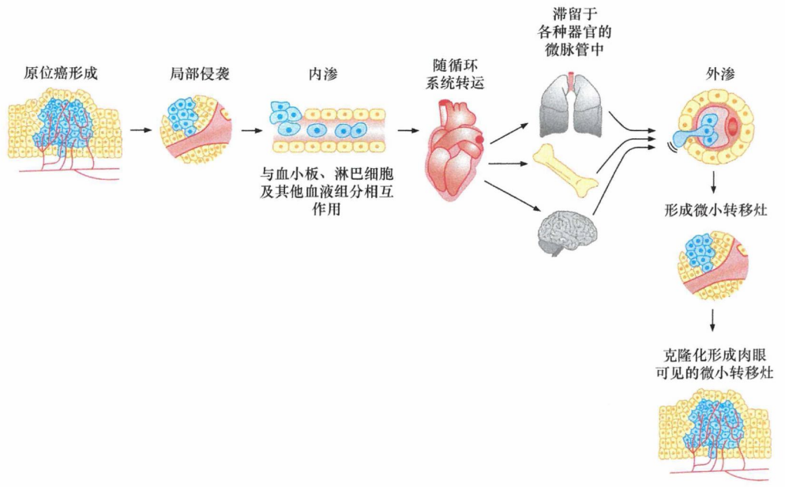 
图1：侵袭-转移级联反应

**局部侵袭**
 
多数上皮组织都具有共同的上皮组织结构。在大多数情况下，相对薄的上皮细胞层位于复杂的基质层的上方，两者之间被一种称为基底膜（BM）的特殊细胞外基质(ECM)所分隔。这一蛋白网状结构是由上皮细胞和基质细胞分泌的蛋白质共同构建的。起源于基底膜上皮侧并仅局限于这一侧的肿瘤，称为良性肿瘤。然而，一些肿瘤细胞获得穿透基底膜的能力。肿瘤细胞突破基底膜后，开始以单个或成簇的形式浸润周围基质, 这种肿瘤细胞团块被重新定义为恶性肿瘤。
 
如下图所示，基底膜可以通过使用针对层粘连蛋白(基底膜中的关键组分)的特异性抗体检测。在A图分化程度比较高而侵袭性比较低的结直肠癌中，用抗角蛋白抗体标记癌细胞巢（红色），用抗层粘连蛋白a3链的抗体标记周围环绕的基底膜（绿色），癌细胞巢之间的基质是黑色的。在B图分化程度比较低而侵袭性比较高的肿瘤中，可见缺失了基底膜的癌细胞巢边界（箭头所示），肿瘤细胞直接暴露于周围基质。
 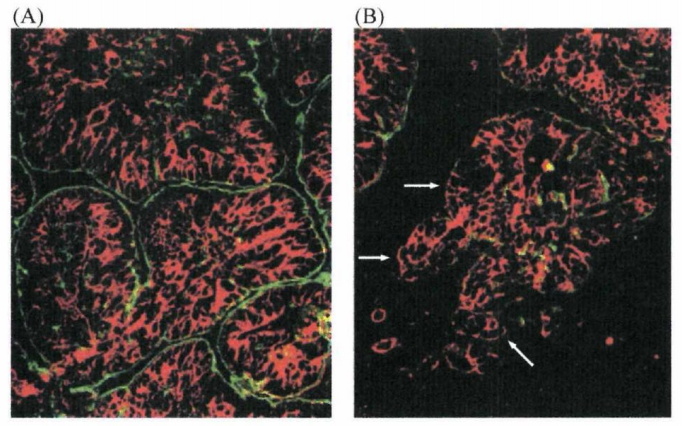 
图2：穿透基底膜
 
侵袭性肿瘤细胞造成基底膜分解，破坏了阻碍肿瘤细胞群进一步扩张的重要物理屏障。同时，通过降解各种基底膜成分，侵袭细胞获得了促进细胞生长和存活的细胞因子，而在正常情况下，这些因子常常隔离或深藏在特化的细胞外基质结构中。
 
肿瘤局灶浸润依赖于分泌性蛋白酶的释放，这对于重塑细胞外基质、形成肿瘤细胞行进的空间非常必要。在某些肿瘤中，浸润的肿瘤细胞可以自己分泌蛋白酶，如MMP-2和MMP-9，也可诱导其他多种基质细胞协同性地释放蛋白酶，促进基质细胞后跟随的癌细胞成簇生长。

**血管内渗**
 
肿瘤细胞在破坏基底膜前，通常会产生促血管生长因子，它们通过多孔屏障作用于基质内的内皮细胞，刺激基底膜基质侧血管的生成。一旦处于基质环境中，肿瘤细胞可以直接从血管和淋巴管入口进入血管和淋巴管。而在正常情况下，这些血管和淋巴管仅分布在基底膜的基质侧。与毛细血管的紧密接触使肿瘤细胞易于获得血液中携带的营养物质和氧气。此外，肿瘤细胞的侵袭特性使其可以突破（即穿透）管壁进入血管和淋巴管的管腔。这一侵入脉管的过程称为内渗(intravasation), 它依赖于单个肿瘤细胞或肿瘤细胞簇脱离周围的肿瘤组织、自行进入循环的能力。
 
对内渗过程研究得较少。最初认为，在许多乳腺癌及其他肿瘤中，3种不同类型的细胞——癌细胞、巨噬细胞和内皮细胞协同促进肿瘤细胞浸润毛细管腔的内皮层。在本节的后面，将重新审视癌细胞——巨噬细胞相互作用和它们之间的信号通路，以及癌细胞的侵袭及相关血管内渗过程（这是由巨噬细胞释放的表皮生长因子驱动的）。在人乳腺癌组织病理切片中，计数癌细胞、巨噬细胞和内皮细胞的密度，是判断肿瘤患者最终转移复发的有效预测因子。
 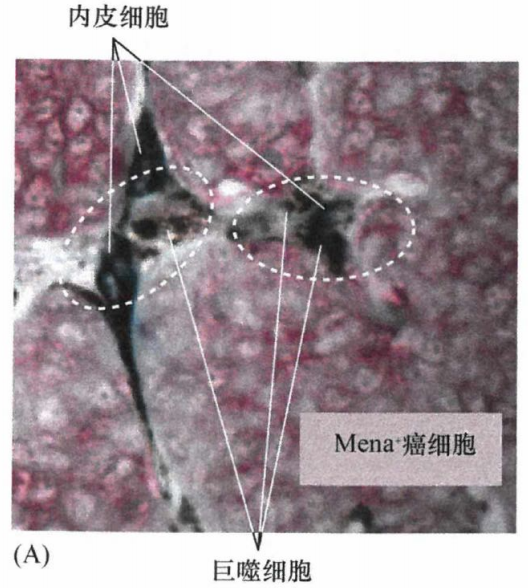 
图3：血管内渗需要基质细胞辅助

**转运**
 
一旦癌细胞进入血管或淋巴管的管腔，单个的肿瘤细胞会随血流或淋巴液到达身体的其他部位，这种长途迁徙充满危险。像正常细胞一样，肿瘤细胞也需要锚定在固相支持物上，没有依附的迁移细胞将很快发生失巢凋亡, 这种类型的凋亡是由细胞与固相支持物如细胞外基质的解离而引发的。基质可以通过多种途径，如提供促进细胞有丝分裂和细胞存活的因子而促进癌细胞生长。
 
血液循环（尤其在小血管中）形成的强剪切力，会导致循环中的肿瘤细胞破裂。基于小鼠转移瘤模型的实验表明，循环中的肿瘤细胞可以募集周围的血小板，以保护它们快速通过湍急的循环血流进入相对安全的组织。
 
如下图所示，从一例转移性前列腺癌患者外周血中分离出来的循环肿瘤细胞簇。细胞通过抗前列腺特异膜抗原的抗体染色（绿色），另一个抗体是抗CD45抗体（红色），多种类型的血源性细胞表达CD45。DNA经DAPI 染为蓝色。
 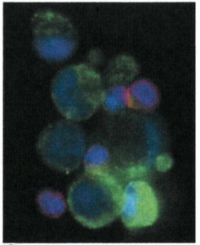 
图4：癌细胞周边吸附血小板

尽管如此，目前仍然没有完全理解癌细胞如何在体循环中存活下来，而这是临床上转移复发的主要播散路径。循环肿瘤细胞 (circulating tumor cell, CTC) 是联系原发灶和转移位点的纽带，近年来受到了关注。但只有一小部分CTC最后能成功地建立新的转移性克隆。在循环中，CTC只能持续很短的一段时间，这在很大程度上是因为它们不像红细胞或白细胞一样能够在各种组织的微血管中循环穿行,因为多数毛细血管的内径(3~8μm)对于CTC来说太小了。红细胞的直径只有7µm,且可以变形，使得它们很容易通过毛细血管。而对于多数的癌细胞来说，它们的直径超过 20µm, 而且不易变形。如果血流中的癌细胞表面包被了大量血小板, 它们的有效直径会变得更大，这使得它们能够滞留在口径大于毛细血管的较大血管、如细动脉中。这些因素决定了进入静脉循环的癌细胞在几分钟之内就会到达肺部的毛细血管床, 进而被滞留下来。事实上，CTC作为游离细胞在循环中存在的寿命非常短，以至于CTC尚未意识到失去了固相锚定的支持物和基质的支持。
 
一些滞留在肺中的转移性癌细胞将试图建立转移灶。然而，多种人类肿瘤常常不在肺而是在身体其他部位形成转移灶。这表明癌细胞可以从肺部毛细血管床逃逸，抵达身体远端部位并形成转移，相关机制目前尚不清楚。从一些实验中观察到，滞留在肺部毛细血管的癌细胞可以大量缩减胞质，在不影响存活的情况下使细胞体积大为缩小。一旦“瘦身”成功，这些细胞就可以成功地通过肺部狭窄的毛细血管。另一种更有可能的解释是，循环肿瘤细胞可以有效利用动脉、静脉间具有较大内径的交通支，绕行于动脉和静脉循环系统，而避免滞留于肺脏等多个器官的细小毛细血管。癌细胞经过肺部到达动脉循环后，循环中的肿瘤细胞可以播散到全身各个组织。
 
淋巴道在癌细胞播散中的作用不很明显。几乎体内所有的组织都有淋巴管网，它们负责细胞间隙液的引流。大部分腹部器官的淋巴液回流到心脏附近的左锁骨下静脉，从而进入体循环。因此，淋巴管中的癌细胞有时通过这一交叉连接进入体循环。
 
癌细胞及其募集的基质细胞均可分泌VEGF-C,它促进淋巴管生成并形成新的淋巴管。而且，分泌高水平VEGF-C的实验性肿瘤会在附近的引流淋巴结中种植更多数量的转移癌细胞。但是，对自发性肿瘤的组织学分析提示，肿瘤团块中很少有功能性淋巴管。实际上，它们大多位于实体瘤的外围区域，肿瘤中心区很少发现淋巴管，且通常已塌陷闭塞。由于淋巴管道的静水压很小，看起来它们无法抵抗肿块扩展的压迫而塌陷。尽管入口有限，有些癌细胞还是成功地进入淋巴系统。在某些特殊的乳腺癌中，有些转移性癌细胞进入直接引流乳腺的淋巴管道，并在附近下游的淋巴结汇集。一旦癌细胞在这些淋巴结内形成多发的微小转移，也就意味着某些癌细胞可能已经播散至远处器官。
 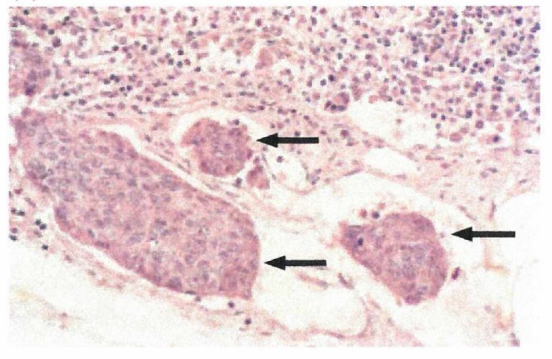 
图5：腋窝淋巴结中的3个微小转移灶

**血管外渗**
 
一些实验表明，癌细胞利用特殊的细胞表面受体（如整合素）黏附在特定组织的细动脉和毛细血管管壁上。大量的证据还显示，癌细胞在小脉管中单纯性的物理性滞留，如前所述肺脏中的情况，是循环中的肿瘤细胞在组织中的第一个立足点。癌细胞一旦在各种组织的血管中停留，就必须离开血管管腔进入周围组织，这一步骤称为外渗（extravasation) 。癌细胞可以采用多种方式穿出脉管。它们可以直接穿出血管壁,这种能力和其祖先细胞离开原发瘤侵入脉管具有相同的生物化学和细胞生物学机制。或者，癌细胞可以在脉管腔内增殖，形成一个小的肿瘤，并持续增殖最终破坏邻近血管壁。在此情况下，癌细胞推开周围的血管内皮细胞、周细胞和平滑肌细胞，而在正常情况下这些细胞将周围组织（即所谓的实质组织）与脉管腔分开。有趣的是，在外渗位点发现了播散的癌细胞和巨噬细胞之间的紧密接触，这与内渗过程中两者的相互作用一样, 癌细胞募集巨噬细胞以协助它们离开循环进入实质组织中。
 
我们熟知的白细胞能诱导毛细血管后小静脉的内皮细胞收缩，打开通往组织的入口，这一过程称为血细胞渗出。而 大多数的转移性癌细胞没有血细胞渗出所需的受体及相应的生物化学反应机制。因此，癌细胞若要穿出毛细血管或是更大些的脉管壁，需要蛮横的力量，这多半是通过降解血管内皮层来实现的。此外，在微血栓形成（募集血小板）过程中产生的疑血酶能够非常有效地水解切割内皮细胞与下层血管基底膜之间的黏附蛋白。这将引起内皮细胞收缩脱离微血栓，使侵袭性癌细胞及产生的蛋白酶直接作用于暴露的毛细血管基底膜。
 
如下图所示，外渗过程通常包括以下几个步骤：(1) 转移性癌细胞(棕色)物理滞留在毛细血管内；(2) 数分钟内，大量的血小板(蓝色)黏附在癌细胞表面形成微血栓；(3) 癌细胞将毛细血管一侧壁上的内皮细胞(绿色)推开，从而直接接触下层的毛细血管基底膜(橙色);(4) 1天内，微血栓被血液中的蛋白酶溶解，这些蛋白酶通常负责血凝块溶解。(5) 癌细胞开始在毛细血管腔内增殖；(6) 几天甚至更短时间内，癌细胞破坏毛细血管基底膜，侵入周围的实质组织(灰色区域)。
 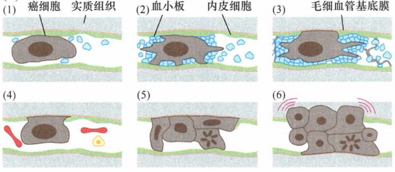 
图6：血管外渗过程

**微小转移灶形成**

一旦转移性癌细胞到达实质组织，它们就可以增殖形成小簇的播散癌细胞团，称为微小转移灶 (micrometastase) 。在乳腺癌患者临床症状刚刚出现的时候，超过30%的患者的骨髓中就会带有几百个甚至几千个微小转移灶，但这组患者中，只有一半人最终在临床上被诊断为肿瘤转移。事实上，这些微小转移灶广泛分布于肿瘤患者的各种组织中，但除了骨髓，其他组织中的微小转移灶通常难以检测。有时，一些隐匿性的微小转移灶将会引起灾难性的后果。
 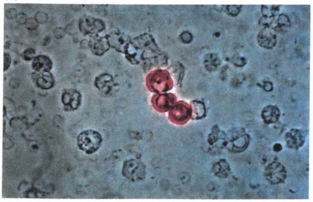 
图7：结肠癌患者骨髓中的微小转移灶

抗细胞角蛋白的抗体对于检测原发性肿瘤播散于骨髓和血液中的微小转移灶很有用，而抗上皮细胞黏附分子(epithelial cell adhesion molecule, EpCAM)的抗体常常用于检测淋巴结的微小转移灶。通常，间叶组织中出现单个的角蛋白染色阳性的细胞即上皮细胞，是肿瘤发生播散转移的明确信号。
 
很多癌细胞在远处转移位点存活下来，但是不能形成临床上可检测到的转移灶，其结果是在很多癌症患者体内存在遍布全身的无数微小转移。虽然微小转移几乎不能形成临床上可检测到的转移灶，但它确实可以提示原发瘤已将癌细胞播散全全身。如果其中的一些微转移在其种植于远处组织几年后突然发展成临床可检测到的转移，那么将威胁癌症患者的长期生存。乳腺癌的可怕之处就在于肿瘤被切除并宣布患者无瘤10年甚至20年生存之后，肿瘤的再次复发。
 
转移性癌细胞在远端组织中，可以以不分裂、休眠的状态存活很长一段时间。还存在另外一种类型的微小转移灶，播散的癌细胞可以在其他组织中增殖形成很小的克隆，但是这种亚临床型的微小转移体积不会增大，因为在这一团细胞中，增殖与凋亡的速率达到了平衡，也许是因为这些细胞不能促进血管生成。

**克隆形成**
 
有一些微小转移灶可以最终成长为临床上可以检测到的肿瘤团块，这一从微小转移灶生长为肉眼可见转移瘤的过程，通常称为克隆形成(colonization)。也许这是侵袭转移级联反应中最富挑战性和最艰难的步骤。这主要是因为新的组织环境不能给新迁移过来的癌细胞提供它们在原发瘤所需的中各种生长因子和促生存因子，没有这些生理支待，转移性癌细胞将会很快死亡，或充其量以显微镜下才可见的微小转移灶的形式存活一段时间。
 
单个播散的癌细胞成功形成肉眼可见转移灶的概率非常低，但肿瘤患者体内全身播散的癌细胞是不良预后的明确指征。至少目前，播散到骨髓的肿瘤细胞，常常称为播散肿瘤细胞(disseminated tumor cell, DTC), 比起外周血中的循环肿瘤细胞（CTC), 更适合作为判断患者不良预后的指标。这可能是因为DTC代表了一段时间内播散肿瘤细胞的累积效果，而外周血复杂的血流动力学过程制约了CTC的寿命，限制了CTC在外周血中的稳定状态。

# 第十四章_2_《癌生物学》第十四章（2）上皮间叶转化（上）

**前言** ：发生转移的第一步是获得局部侵袭能力，需要原发瘤的癌细胞发生许多表型改变。如前所述，本节主要讨论的还是上皮组织来源的肿瘤。为了获得运动和侵袭能力，癌细胞必须丢掉许多上皮细胞的表型，改变表型、脱离上皮层、发生一系列显著的改变，这个过程称为 **上皮间叶转化(EMT)** 。今天这一小节主要先来学习两个部分的内容：“ **EMT的标志物** ”和“ **激发EMT的基质信号** ”

**EMT的标志物**

在胚胎发育过程中，某些形态发生阶段和组织重建需要依赖各种类型的上皮细胞发生EMT。在早期胚胎发生的原肠胚形成期，外胚层的单个细胞脱落，向胚胎内部中央迁移，形成中胚层，中胚层是间叶组织包括成纤维细胞和造血细胞（在脊索动物中）的前身。在此阶段，上皮细胞层中排列的外胚层细胞，通过EMT转变为具有中胚层表型的细胞。同时，细胞通过EMT获得从一个部位（外胚层）迁移到胚胎其他（内部）部位的能力。创伤边缘的上皮细胞也必须经历暂时性的EMT,以便迁移到伤口位点并封闭损伤造成的上皮细胞层缺口。
 
癌细胞侵袭过程中存在的、复杂的细胞重组过程，依赖于通常在胚胎发育和成年组织损伤过程中表达程序的重激活。
 
正常和病理状态下的EMT,除了涉及细胞形态改变并获得运动能力外，细胞基因表达谱也发生了改变。上皮细胞标志物E-钙黏蛋白和细胞角蛋白的表达受到抑制，而诱导表达一种间叶细胞骨架中间纤维的组成成分，波形蛋白(vimentin)。发生EMT的上皮细胞通常产生纤连蛋白，这是一种在正常情况下只由间叶细胞，如成纤维细胞分泌的细胞外基质蛋白。同时，典型的成纤维细胞标志物——N-钙黏蛋白，通常取代 E-钙黏蛋白开始表达。

表1：与EMT现象相关的细胞学改变
  
在这所有的蛋白质中，跨膜的E-钙黏蛋白在影响上皮与间叶细胞表型方面起着非常重要的作用。在正常上皮中，E-钙黏蛋白分子的胞外结构域从胞膜表面伸出，与邻近上皮细胞同样凸出在细胞表面的E-钙黏蛋白分子形成复合物。使上皮细胞层邻近的细胞间形成同源二聚体桥，所形成的黏附连接在维持上皮细胞层的结构完整性上起非常重要的作用。
 
单个E-钙黏蛋白分子的胞质结构域通过α-catenin和β-catenin复合物及其他辅助蛋白锚定在细胞骨架的肌动蛋白纤维上。肌动蛋白细胞骨架为细胞提供张力。因此E-钙黏蛋白分子将邻近细胞的肌动蛋白骨架交织在一起，帮助上皮细胞层抵抗撕拉机械力。一些实验表明，单纯抑制E-钙黏蛋白的表达，就会使细胞获得间叶细胞的形态并增强运动能力。在多种人侵袭性肿瘤中，E-钙黏蛋白编码基因CDH1的启动子发生甲基化而使其表达受到抑制。
  
图1：伴随EMT发生的生化改变（Twist转录因子可以诱导EMT ）

钙离子对维持E-钙黏蛋白的二级结构和胞外结构域的刚性是必需的，在下图中用红色小球标示。同时，E-钙黏蛋白的胞质尾部通过β-catenin和许多其他分子，连接肌动蛋白细胞骨架。β-catenin同时也在胞质中作为Wnt信号通路的一个重要中间分子。胞膜中E-钙黏蛋白的缺失释放了β-catenin分子，进而使其在胞质中累积。在Wnt信号的作用下，β-catenin从胞质转位到胞核，并与Tcf/LEF和其他转录因子结合，从而诱导EMT相关基因的表达。
  
图2：E-钙黏蛋白与β-catenin

在早期胚胎的原肠胚形成阶段，也可以看到EMT过程中E-钙黏蛋白表达被N-钙黏蛋白取代的现象。在培养的上皮细胞中(来自胚胎外胚层)，肝细胞生长因子(HGF)可促进E-钙黏蛋白向N-钙黏蛋白的转变。由此它可以诱导EMT,使肌细胞和皮肤前体细胞从原始的生皮肌节迁出，而后者具有早期脊椎动物胚胎体节中的上皮样细胞。
 
像E-钙黏蛋白一样，N-钙黏蛋白也参与细胞间的同型相互作用，它们结合在邻近细胞表面的相同类型的其他分子上。因此，表达在发生了EMT的癌细胞表面的N-钙黏蛋白分子，增强了肿瘤细胞与正常表达N-钙黏蛋白的间质细胞、特别是与上皮细胞层下方基质中的成纤维细胞的亲和性。这种结合有利于具有侵袭能力的癌细胞侵入基质细胞群。这一动态模型可以解释黑色素瘤的发展：正常的黑色素细胞表达E-钙黏蛋白，使它们与周围的角化细胞结合。黑色素瘤细胞黑色素细胞的转化衍生物表达N-钙黏蛋白，使它们浸润皮肤真皮层基质，并与成纤维细胞和内皮细胞相互作用。
  
图3：钙黏蛋白表达转换和黑色素瘤细胞的侵袭性

虽然从原理上讲，细胞间也可以形成N-钙黏蛋白桥，但是其表达并不会使癌细胞形成大的片层样结构。看起来，N-钙黏蛋白分子间形成的作用力要明显弱于E-钙黏蛋白的同源二聚体。这可以解释为什么细胞表面的N-钙黏蛋白分子有助于细胞的运动，相反同家族的E-钙黏蛋白则可以使细胞固定在上皮细胞层。

**EMT通常由基质信号诱导**

EMT由癌细胞所处的肿瘤微环境中的细胞外信号所诱导。这一观点部分来自于正常发育过程中经历的EMT特性：在胚胎中EMT只在特定位置上才被诱导。胚胎中这种行为实际上意味着两点：第一，EMT由胚胎中特定部位而非其他部位的胚胎细胞信号所诱导；第二，这种精确的定位可能依赖于整合了不同来源单个细胞复杂信号的综合作用，如不同的相邻细胞或细胞群。
 
紧密接触周围基质的癌细胞激活了EMT程序，而位于癌巢内部的细胞（无法直接接触基质）则不会发生EMT。如下图所示，低倍镜下观察同株人转化乳腺上皮细胞（MEC）形成的肿瘤，人波形蛋白（深棕色）的表达限制于直接与周围基质接触的细胞中。相反，处于癌巢内部的癌细胞不表达人波形蛋白，推测它们仍维待在上皮细胞状态。
  
图4：肿瘤上皮与基质界面处的 EMT 现象

在多种肿瘤的发生发展过程中，EMT表型是完全可逆的。一旦癌细胞完成了多步骤的侵袭转移过程，它们通常要经过间叶-上皮转化过程回复到上皮样细胞表型。很多观察发现，转移灶与其来源的原发瘤在组织病理水平上具有高度相似性, 也提示了这一可逆过程的存在。
 
这种EMT表型的消失可由癌细胞从原发瘤转移到转移灶处后，所处微环境的变化来解释。在原发性肿瘤中，原发瘤形成的漫长过程中产生“反应性基质" , 并释放诱导附近癌细胞发生EMT的信号。当离开原发瘤后，在管腔中吸附于癌细胞表面的血小板，可释放其他的EMT诱导信号, 以保持这些细胞的间叶状态。然而，当癌细胞外渗到转移位点后，最先接触的可能是完全正常的基质，因此无法释放促使周围刚到达此处的癌细胞发生EMT的信号；这将导致细胞通过MET过程恢复到其位于原发瘤中心的祖先细胞的上皮细胞状态（这提示在某些癌细胞中，经EMT产生的间叶细胞状态必须由基质信号维持，一旦这些信号消失，癌细胞将恢复到上皮状态）。如果微小转移灶成功地在远端组织形成克隆，反应性基质最终也会在肉眼可见转移灶中形成，再次重复了先前在原发瘤中发生的改变，并在癌细胞中引发 EMT 过程。
  
图5：EMT的可逆性

实际上，传统的组织病理学技术很难证明原发性肿瘤侵袭前沿的EMT现象，这主要是因为一旦癌细胞完全发生EMT，它们将与周围的间质细胞难以区分。
 
TGF-β是一个重要的间质信号传递分子。此外，多种其他因子，包括Wnts、肿瘤坏死因子-α(TNF-α)、表皮生长因子(EGF)、肝细胞生长因子(HGF)、胰岛素样生长因子-1 (lGF-1) 和前列腺素 E2 (PGE2) 也参与这一过程。一些研究还发现癌细胞和I型胶原之间具有直接相互作用，I型胶原在基质中含量丰富而在肿瘤上皮中不存在。看起来，这些间质信号以各种组合的方式激活细胞内潜在的EMT程序。
 
一组颇有影响力的实验证明，当ras转化的EpRas小鼠乳腺上皮细胞接受TGF-β刺激后，会逐步失去上皮细胞形态，并下调上皮细胞标志（如细胞角蛋白和E-钙黏蛋白的表达）。与此同时，这些转化细胞开始表达间叶细胞标志（如波形蛋白），而且细胞形态也逐渐趋向于成纤维细胞。这些特征提示细胞发生了EMT的改变。有趣的是，一旦这些ras转化细胞发生了EMT,它们开始自己产生并分泌TGF-β1。这种TGF-β1经自分泌反馈信号作用于细胞自身，即使撤掉培养基中的TGF-β, 细胞也能长期维持间叶细胞表型。上述研究表明，TGF-β信号通路可以协同癌基因 ras, 引起上皮细胞发生EMT转变。肿瘤相关基质也可产生大量TGF-β1。
 
如下图所示，EpRas细胞(左侧)通常具有鹅卵石样的上皮细胞形态，并且在细胞-细胞连接处表达E-钙黏蛋白(绿色)。但在TGF-β1存在的条件下培养7天后(右图)，E-钙黏蛋白表达受到抑制而表现为波形蛋白表达(红色)，由上皮细胞基因表达模式转换为间叶细胞模式。细胞核经DAPI染为蓝色。
  
图6：TGF-β调控EMT

TGF-β促进恶性癌细胞进展的作用与我们前面讨论的其抗增殖效应相矛盾。大量研究支持TGF-β增强恶性细胞生物学行为，即肿瘤相关TGF-β(通常是TGF-β1) 的表达水平与肿瘤的侵袭性呈正相关。的确，无论是肿瘤组织内还是循环体液中高水平的TGF-β, 都与肿瘤患者的长期生存负相关。
 
总之，TGF-β至少通过4种方式促进癌细胞侵袭。首先，大多数肠道以外起源的人类肿瘤都保留了部分TGF-β受体信号功能，这使得它们在肿瘤发生发展的各个时期都能对TGF-β信号做出反应。其次，大多数人类肿瘤都有pRb信号通路的失活，这使得细胞对TGF-β的细胞生长抑制效应失去响应，但TGF-β受体信号通路引起的其他效应不受影响。再次，在失去TGF-β的细胞生长抑制效应以后，癌细胞接受TGF-β刺激的实际效果将促进细胞增殖。最后，乳腺癌细胞接受TGF-β刺激后可以产生并释放其他因子，加速骨质降解，这是形成骨转移灶的关键步骤。骨质降解还可以释放另外的有丝分裂原，促进细胞增生。
 
基质信号之间可以协同作用，激活癌细胞内的EMT程序。例如，TNF-α可以与TGF-β共同诱导EMT的发生。在肿瘤发生的早期，TNF-α经常由炎症细胞产生，如巨噬细胞。在多种肿瘤中，TNF-α和TGF-β均有助于长期维持活化的NF-κB信号，这一信号似乎对诱导和维持EMT至关重要，因为抑制NF-κB信号将抑制EMT的发生。
 
通过研究自发进入间叶状态的细胞所分泌的生长因子，发现了3种类型的信号蛋白：经典Wnt蛋白、非经典Wnt蛋白和TGF-β，它们在维持细胞处于间叶状态方面有重要作用。
 
有趣的是，上皮细胞也可以分泌TGF-β和经典Wnt蛋白。然而，这些细胞激活自身EMT程序的能力（通过自分泌循环）被伴随分泌的高水平抑制蛋白所阻断，特别是骨形成蛋白(BMP,TGF-β信号抑制因子），以及SFRP和DKK1(经典和非经典Wnt信号抑制因子)。最初由邻近的基质细胞以旁分泌形式提供的信号蛋白激活EMT程序，而后需要以自分泌的形式产生相同的信号蛋白，以维持细胞的间叶状态。推测启动EMT的间质信号可以中和分泌的抑制因子，这些抑制因子在正常情况下可以防止上皮细胞自身的EMT程序不被活化。另一种与EMT诱导相关的自分泌和 旁分泌信号与前列腺素E 2 (PGE 2 ) 有关。PGE 2 可诱导上皮细胞发生EMT, 并与 Wnt蛋白和TGF-β互补加强基质信号。
  
图7：多信号协同诱导并维持间叶细胞状态

EMT诱导信号的多样性促使人们注意到基质细胞参与肿瘤的侵袭性行为。基质中的巨噬细胞对原发性癌细胞侵袭转移能力的影响，主要来自对集落刺激因子 (CSF-1)缺乏的遗传缺陷小鼠的实验研究。肿瘤易感转基因小鼠发生的乳腺癌通常募集大量的肿瘤相关巨噬细胞(tumor-associated macrophage, TAM)。但是，当这种小鼠的肿瘤细胞失去产生CSF-1的能力时，TAM则很难见到。缺乏CSF-1 和TAM并不影响原发肿瘤的生长, 但是这样的肿瘤与大量募集TAM的肿瘤相比，表现出良性、非侵袭性表型。而且，这些巨噬细胞对转移能力的影响是惊人的——没有TAM, 乳腺癌细胞将不能转移到肺。
 
前面提到过，巨噬细胞源性的TNF-α可能诱导癌细胞发生EMT。另一个关键的巨噬细胞源性信号很可能是由EGF介导的，正如前面提到的巨噬细胞刺激血管内渗。
 
EGF是癌细胞侵袭的主要诱导因子。像多数上皮细胞一样，癌细胞也表达EGF受体，EGF活化其受体导致细胞获得运动侵袭能力并分泌CSF-1,而后者可以趋化并活化巨噬细胞。巨噬细胞对CSF-1刺激的反应是增殖并分泌EGF, EGF又可以反过来激活肿瘤细胞。这些效应都是由旁分泌而小是自分泌信号引发的，因为乳腺癌细胞并不表达CSF-1受体，而巨噬细胞不表达EGF受体。这两种细胞互惠合作，彼此刺激，于是产生了另一种类型的正反馈调节环路。
  
图8：乳腺癌细胞和巨噬细胞间的互惠合作

HGF是肿瘤基质中的另一种配体，它同样可以诱导上皮细胞发生EMT。这些细胞表面通常具有HGF的受体Met。像EGF一样，HGF似乎可以诱导一部分但并不是全部的EMT相关表型改变。
  
图9：激发MET的基质信号通路
# 第十四章_3_《癌生物学》第十四章（3）上皮间叶转化（下）

**前言** ：上一节我们已经学习了EMT的两个内容，今天我们接着学习另外的三个内容：“ **EMT的关键转录因子** ”，“ **细胞外蛋白酶** ”和“ **小Ras样GTP酶** ”。

**EMT的关键转录因子**
 
像许多复杂的细胞生物学过程一样，EMT也由少量的多效性转录因子(TF)所诱导。通过激活这些转录因子，癌细胞启动了复杂的、多阶段的EMT程序。基质中的异型性信号在癌细胞中诱导这些TF的表达，进而启动EMT程序。
 
目前至少发现了6个EMT-TF, 在特定的上皮细胞中异位表达这些转录因子中的任何一个，都能诱发EMT现象。例如，在脊椎动物的早期胚胎中，Snail首先在一部分外胚层细胞表达，这部分细胞随这原肠胚的形成后来逐渐发育成中胚叶。Snail、Slug和Twist在胚胎发育过程中的表达都可以使上皮细胞转变成可迁移的间质细胞并形成中胚叶。Snail及其同一家族的Slug还参与一些其他的胚胎发育步骤，这些步骤都涉及一种组织向另外一种组织的转变。这些转录因子的真正起源如表1所示。
 
某些这类转录因子也在成人组织、如创伤愈合的组织重塑阶段表达。培养的单层上皮细胞的体外划痕实验能很好地模拟这一现象。Slug在划痕边缘存活的上皮细胞中诱导表达，以使细胞获得运动能力并迁移到划痕处。
 
Snail和Slug(也称为SNAl1和SNAI2)是C2H2型锌指转录因子家族成员。现有研究结果表明，Snail-Slug主要充当转录抑制因子，如这两个因子都可以抑制E-钙黏蛋白基因的表达。
 
胚胎期中Snail及其相关的转录因子Slug和Goosecoid可以被某些基质信号，如TGF-β和Wnts诱导表达。Twist 表达水平同样受TGF-β信号诱导。
 
表1：参与EMT现象的转录因子
 
在癌细胞中EMT-TF总是结合在一起表达，提示它们之中没有一个能单独组织起EMT程序相关的、所有细胞生物学改变。实际上，人们发现这些主要调节因子可诱导其他因子的产生，这通常是由一个EMT-TF直接结合到另一个EMT-TF启动子上实现的。例如，Twist可直接结合至Twist、Snail、Slug和Zeb1的启动子上，而为了激活EMT程序，它实际上有赖于Slug的诱导表达。此外，在人类乳腺癌中Slug常常与Twist共表达；在某些乳腺癌细胞中当Twist不再表达时，Slug表达也随之缺失。同样，某些这类转录因子以冗余的方式发挥作用，如Snail、Slug、ZEB1和ZEB2都可以结合在E-钙黏蛋白基因(CDH1)启动子上，并抑制E-钙黏蛋白的表达。与此一致，Twist也可以通过Slug抑制E-钙黏蛋白的表达。
 
在这些EMT-TF中，ZEB1和ZEB2似乎在决定癌细胞是保留上皮细胞状态还是激活EMT程序的过程中发挥决定性仵用。它们发挥这一功能有一部分是通过形成一个双稳态开关，使细胞在很长一段时间内保持在间叶细胞或上皮细胞状态。对 ZEB1和ZEB2 mRNA的测序结果表明，miR-200家族成员靶向其3'UTR(3'非翻译区）的多个位点，致使翻译抑制和（或）这些mRNA降解。
 
下图揭示了一个作为双稳态开关的互相拮抗机制，可使一个细胞相对稳定地处于间叶细胞或上皮细胞状态。一旦一组调节因子占上风（如ZEB1/2或miR-200), 细胞将进入一个方向并关闭另一方向，且长期维持于间叶或上皮细胞状态。原则上，每组调节因子可作用于其他基因和mRNA。例如，ZEB1/2可抑制E-钙黏蛋白和其他上皮细胞基因的表达。不过miR-200的功能似乎仅局限于抑制ZEB1/2的表达上。
  
图1：双稳态开关

EMT诱导转录因子对细胞性状的影响提示，这些重要的调节因子可以协同性地调节侵袭-转移级联反应中几乎所有的步骤。然而还有一个重要的转移步骤尚未考虑：播散的癌细胞若要形成转移灶，必须先具有肿瘤干细胞(CSC）所具有的肿瘤起始能力。
 
一群实验永生化的MEC通过外源表达EMT诱导转录因子Twist或Snail,进入EMT程序。对照组和两个实验组的MEC细胞通过荧光激活细胞分选技术(FACS)分为CD44 hi CD24 lo 和 CD44 lo CD24 hi 两个细胞亚群。 在培养的对照组细胞中，只有很 小一部分细胞具有干细胞特征，而外源表达Twist或Snail则使原先为非干细胞的这部分细胞群转变为 CD44 hi CD24 lo 细胞群，这部分细胞亚群中包含了所有的干细胞。
 
另外一个实验显示了更有说服力的证据：利用FACS将永生化的人MEC区分为两个细胞亚群，一个亚群包含干细胞( CD44 hi CD24 lo ), 另一个亚群包含极少干细胞( CD44 lo CD24 hi ) 。当定量分析这两个细胞亚群的mRNA水平时发现，与非干细胞亚群相比，干细胞富集亚群中间叶标志表达水平显著提高，同时一组EMT-TF的mRNA表达水平也明显增加。这里EMT诱导转录因子与干细胞宫集状态之间的关系反映了自然存在的、内源性转录调节，而不是由实验引入基因而导致的。
 
不过这些实验并不能证明EMT-TF能诱导产生真正的干细胞，而不是与真正干细胞共存于同一细胞亚群的其他细胞。在此情况下，乳腺重建实验则更有启示性。这一实验评价少量的植入MEC形成完整的乳腺导管树（即乳腺的正常结构）的能力。当来自小鼠乳腺的MEC, 瞬时外源表达Slug和Sox9 (第二个协同转录因子)时，将其植入已清除其他细胞的乳腺基质脂肪垫中，其形成乳腺导管树的能力与未表达这些转录因子时相比提高了100倍以上。

**细胞外蛋白酶**
 
 
恶性细胞最显著的特征是具有侵袭邻近细胞层的能力。这种行为需要癌细胞重塑周围的组织微环境，在细胞外基质 (ECM) 中开辟道路并推开其他细胞。
 
导致这些复杂改变的最重要的效应分子是 **基质金属蛋白酶** **(MMP)** 。在肿瘤中被募集的间质细胞主要是巨噬细胞、肥大细胞和成纤维细胞，这些细胞本身而不是癌细胞，但能够分泌大量的蛋白酶。通过溶解组织中包绕在细胞周围的厚厚的基质分子，MMP为细胞的移动创造了空间。被MMP降解的ECM组分包括纤维蛋白原、黏蛋白、层粘连蛋白、胶原及蛋白聚糖等。在降解ECM组分的进程中，MMP 还可以动员和激活特定的生长因子，这些生长因子本来以非激活的形式包绕在ECM或细胞表面。
 
与这些分泌型MMP功能互补的一个关键分子是 **MT1-MMP ( 膜型-1 MMP)** , 它直接锚定于癌细胞质膜表面，切割、降解细胞外基质成分、细胞表面黏附分子（如钙黏蛋白和整合素）及生长因子受体和趋化因子。它还可以裂解失活型的酶原（如前MMP-2) 使之转变成有酶活性的MMP分子 (MT1-MMP 是 6 种细胞膜锚定 MMP之一，因此只能裂解邻近细胞产生的底物蛋白）。
  
图2：MT1-MMP 与 MMP-2 的合作

基底膜是癌细胞侵袭过程中首先遇到的障碍，它具有直径仅40nm的小孔。细胞可通过胞质变形来挤过那些小孔，而细胞核相对较僵硬，因此决定了细胞能穿过的最小孔径。细胞核直径通常在3~10µm, 较基底膜小孔的孔径大了约100倍。这是基底膜溶解对于癌细胞侵袭过程至关重要的原因。
 
MT1-MMP活性在基底膜崩解过程中发挥主导作用，它在细胞表由不同位点的分布密度不同，分布集中的位点最初被称为足小体, 由于这一结构参与了癌细胞侵袭, 近来常被称为侵袭性伪足。在恶性进展早期，癌细胞表面的MT1-MMP可切割赋予基底膜刚性作用的IV型胶原蛋白。基底膜的疏松化使癌细胞开始侵袭下方基质。一旦到达基质，侵袭的癌细胞被相互交联的I型胶原纤维网所阻碍，此时MT1-MMP再一次发挥关键作用。MT1-MMP降解I型胶原蛋白并切割活化基质来源的不具活性的酶原 (MMP-2 前体)。活化的MMP-2在细胞周围空间中进一步将I型胶原蛋白切割成低分子量片段。若没有这些步骤，细胞外基质中的高密度I型胶原纤维网将阻断癌细胞侵袭。
 
几个研究比较清楚的胚胎性转录因子促进EMT进展的主要原因之一就是促进癌细胞合成并释放MMP(主要是MMP-2和MMP-9)。已知大量的MMP来源于肿瘤基质细胞，如广泛研究的MMP-9, 主要由肿瘤侵袭前沿的巨噬细胞、中性粒细胞和成纤维细胞表达。体外实验表明MMP-9能够降解胶原，特别是胶原IV、V、XI和XIV 。胶原是ECM(包括基底膜)的关键组成部分。MMP-9降解的其他底物包括层粘连蛋白(基底膜另一种重要组成部分)、趋化因子、纤维蛋白原和潜伏性TGF-β1。后两者经MMP切割后，由静息型转变为活化型。各种募集的炎性细胞产生多种分泌性蛋白酶，这在很大程度上解释了它们在癌细胞侵袭中的作用。
 
MMP广泛的功能表明其酶活性至少在正常组织中必须受到严密的调控。如同 caspase一样，可溶性的MMP(如MMP-2和MMP-9)最初以无酶活性的酶原形式合成，只有被其他蛋白酶剪切后才具有活性。一类称为组织金属蛋白酶抑制物（TIMP)的蛋白也具有负调控作用，TIMP结合MMP后，使其转变成非活化型构象。

**小Ras样GTP酶**

细胞外蛋白酶在生物化学水平解释了侵袭的癌细胞如何清除前进道路上的细胞外基质及组织障碍。但它们并不能说明单个癌细胞如何通过清除后的道路前行，即细胞运动迁移能力。
 
当培养细胞暴露于各种生长因子后能诱导细胞运动（这些除了具有促有丝分裂原活性外还能促进细胞运动的生长因子被称为促运动因子）。对于上皮细胞，诱导运动能力最强的因子通常是肝细胞生长因子(HGF), 它能够诱导单层培养细胞向各个方向运动，又称为分散因子(SF)。大部分上皮细胞表达HGF的受体——Met,这类细胞在HGF作用下获得运动能力。同样，EGF也能诱导乳腺癌细胞运动。
 
细胞运动过程不但涉及细胞不同部位的肌动蛋白骨架的连续重构，而且包括迁移细胞和细胞外基质(ECM)间的黏附和解黏附过程。对于培养细胞，ECM是铺在细胞下方、培养皿表面的蛋白质网络。
  
图3：片状伪足

细胞运动过程可以分为几个不同的步骤。首先，细胞的细胞质向运动方向延伸。这一延伸过程包括从细胞表面隆起宽而扁平的薄片样片状伪足。细胞表面蛋白酶能选择性地降解迁移细胞前沿的ECM蛋白。在此过程中，细胞在迁移前沿的ECM和片状伪足之间重新部署整合素分子，以形成新的黏附点；同时，细胞后沿的这种整合素黏附结构解离，由此释放细胞质和质膜，将其重新部署到迁移细胞的前沿。
  
图4：固体附着层上的细胞移动

从片状伪足凸出的麦芒状突起结构，称为丝状伪足, 能使细胞向前方扩展并启动由整合素介导的黏着斑形成。一旦黏着斑形成，将为细胞提供生存信号，同时使其获得与附近细胞外基质紧密物理接触的牵引力。有提示，丝状伪足通过使外渗癌细胞与邻近组织的细胞外基质形成黏着斑，在微小转移灶初始形成过程中发挥重要作用。如同片状伪足一样，丝状伪足的形成也是通过肌动蛋白纤维重新组装而成，每一丝状伪足的细胞膜下都有紧密排列成束状分布的肌动蛋白纤维。
  
图5：丝状伪足

如下图所示，高倍镜下显示片状伪足中的肌动蛋白纤维（左上），通过在正端加上肌动蛋白单体（黄球）进行延伸，并在回撤的“负端”通过释放单个肌动蛋白单体而解离。同样的动态机制也促使丝状伪足向前延伸（右）。形成片状伪足的分枝状纤维网络的辅助蛋白用粉色表示，而形成丝状伪足的紧密成束、平行排列的肌动蛋白纤维的辅助蛋白用绿色表示。
  
图6：细胞表面重建
 
细胞的形状和运动过程由Rho蛋白家族的一组Ras相关蛋白调控。Rho蛋白像Ras一样，也可进行两相转换，当结合GTP时处于活化状态，当水解GTP成GDP时处于失活状态。人类细胞中已经发现了20多个Rho蛋白家族成员。它们分为3个亚家族—— **Rho蛋白、Rac蛋白和Cdc42** 。像Ras蛋白一样，大多数Rho蛋白家族成员的C端具有脂类基团，使其能锚定在细胞内膜上，而每一成员在细胞形状和运动过程中具有特定的作用。
  
图7：类Rho蛋白的作用

看起来在肌动蛋白细胞骨架构象改变过程中，每一成员均在整个细胞内发挥作用。事实上，细胞运动的复杂过程依赖于这类蛋白中的每一成员在细胞质内很小范围的局部激活，并随后促进细胞作为一个整体向一个方向或另一个方向移动。这种局灶性的激活似乎依赖于特定Rho GEF (鸟嘌呤核苷酸交换因子）的亚细胞定位。例如，将Rho蛋白从非激活的GDP结合状态转换为具有活性的GTP结合状态的Sos。
 
酪氨酸激酶受体，如PDGF和EGF受体与这些Rho家族蛋白成员之间的信号传递机制目前还不清楚。但是已知这些受体通过激活Ras,活化其下游至少3个信号通路，包括Raf、PI3K和Ral-GEF效应子，它们中的一部分随后通过调节Rho蛋白影响细胞运动。另外，激活的Ras似乎还结合并活化Tiam1, 它可作为Rac的鸟嘌呤核苷酸交换因子(GEF)。GEF可使小G蛋白（如Ras和Rho) 与GDP解离并结合GTP, 从而激活这些G蛋白的信号通路。因此，Tiam1和Rac可以作为Ras的下游效应蛋白，通过调节片状伪足形成而影响细胞运动能力。
 
从细胞运动的角度来说，PI3K是Ras蛋白最重要的效应蛋白。通过产生磷脂酰肌醇(3,4,5)三磷酸(PIP3),PI3K使细胞质膜的胞质即发生化学结构改变，从而使多种胞质蛋白通过PH结构域与之结合。这些蛋白中包含许多GEF，它们负责激活Rho家族的G蛋白成员。这些Rho GEF锚定于质膜后发生活化。
 
似乎Tiam1通过结合活化的Ras和（或）PlP3而激活其功能。通过激活Rac蛋白，Tiam1 GEF促进迁移细胞前沿的肌动蛋白局部多聚化，从而形成对细胞运动至关重要的片状伪足结构。
 
Rho-GEF激活的其他类Rho蛋白在细胞运动过程的其他方面发挥功能。例如，Rho蛋白(如RhoA和RhoB)功能与Rac蛋白作用相似，促进细胞前沿和细胞外基质间新的黏附点的形成。反之亦然，形成的新的黏着斑也促进Rac活化，提示在细胞连续向前移动中形成了自我维持的正反馈环路。Rac和Cdc42蛋白似乎也能诱导一些分泌蛋白酶的表达，主要是基质金属蛋白酶。
 
细胞体的收缩(帮助细胞滞后端向前沿端移动)对细胞的定向运动同等重要。这种收缩主要由Rho亚家族成员控制。通过促进胞质中的肌动蛋白成束分布，Rho 蛋白能产生所谓的“应力纤维”结构，从而调节胞质的收缩性。
 
Cdc42代表第三类Rho样蛋白亚家族，它有特殊的功能：能诱导指状丝状伪足的形成。这些丝状伪足通过集结黏着斑而促进细胞运动，随后使前行细胞在ECM中立地生根。另外，激活的Cdc42还能不依赖于对丝状伪足的特定影响而促进细胞运动。
 
更为复杂的是，Rho、Rac和Cdc42在不同类型的细胞中作用也不相同。例如，在正常上皮细胞（不是成纤维细胞）中，Rac和Rho亚家族蛋白负责维持E-钙黏蛋白依赖性的细胞间黏附连接，这些连接对维持上皮细胞的片层结构、固定上皮细胞至关重要。但是在转化的上皮细胞（如发生了部分或完全EMT转换的结肠癌细胞）中，Rac促进细胞运动。在不动的细胞内，Tiam1(Rac交换因子）定位于黏附连接中；而在迁移的细胞内，Tiam1定位于片状伪足和相关的膜皱褶处。
 
EGF诱导细胞运动环路如下图所示，癌细胞中特定蛋白过表达的程度在图中用粉色数字标示，而表达下调的程度用绿色数字标示。某些蛋白，如cofilin, 在细胞特定区域作用于存在的肌动蛋白纤维，而封端蛋白阻止纤维过度延伸。cortactin与皮质肌动蛋白相关，负责组织片状伪足的侵袭前沿。Rho GTPase家族的成员在图中用黄色和橙色背景标示。事实上，这张图中EGF刺激的所有细胞运动相关环路都可能参与其他促运动因子，如HGF和PDGE诱导的细胞运动过程。
  
图8：EGF诱导细胞运动环路

EMT过程主要是通过各种调节细胞骨架、蛋白酶合成及癌细胞运动能力的效应蛋白而完成的。这里主要讨论 **Mena蛋白** ，又称ENAH蛋白。
 
当癌细胞发生EMT时，控制选择性剪接模式的某些剪接因子表达发生明显改变。例如，某些利于上皮细胞表型的剪接因子表达被抑制，导致合成某些选择性剪接mRNA,其编码的蛋白质促进细胞向间叶表型转变。Mena就是这样一个mRNA。正常合成的Mena蛋白形式被包含侵袭相关结构域的Mena INV 所代替。 Mena INV 随后影响一系列与细胞侵袭相关的行为，包括影响细胞对EGF诱导的细胞运动和跨内皮侵袭的反应性。
 
通常在正常上皮细胞和非转移性癌细胞中合成的Mena蛋白有多个结构域。如下图所示，除了3个浅棕色结构域外，所有带颜色的结构域由特定的mRNA编码（简称为 Mena), 或是由这些带颜色的结构域再加上一个11a片段的mRNA编码(称为Mena11a)。相对的，在发生了EMT的癌细胞内或体内生长的包含外显子INV (也称为+++）和++及缺乏11a片段的癌细胞中，Mena基因的mRNA发生了改变。编码INV外显子的Mena结构域似乎在癌细胞侵袭过程中发挥特别重要的作用。箭头表明了与EMT相关的变化。
  
图9：Mena的结构域变化

各种形式的Mena蛋白促进肌动蛋白纤维的延伸，这是片状伪足和丝状伪足生长所必需的。下图仅显示了片状伪足的生长过程。正常情况下，封端蛋白(红圈)阻断肌动蛋白纤维的进一步延伸。cofilin(黄色)切断肌动蛋白纤维末端并移除封端蛋白，此后Mena阻止封端蛋白的重新结合，使纤维得以进一步延伸。Mena的INV异构体促进延伸的效率特别高，因此驱动肌动蛋白纤维延伸及片状伪足和丝状伪足的生长。另一个蛋白Arp2/3(蓝色)则使肌动蛋白纤维形成分支，这对片状伪足稳定延伸尤为重要。
  
图10：Mena蛋白的作用

# 第十四章_4_《癌生物学》第十四章（4）转移的亲组织性和骨转移实例

**前言** ：前几节描述的侵袭和转移播散机制从整体上解释了侵袭-转移级联的大多数阶段。看起来似乎各种各样的侵袭转移性癌细胞利用一组通用机制发生播散转移。然而更重要的是侵袭-转移级联的最后步骤——克隆形成。这一小节我们就主要来讲一下 **转移的亲组织性** 和 **骨转移** 的实例。

**肿瘤转移的亲组织性**
 
很多类别的癌细胞以一种非常相似的方式完成侵袭－转移级联的早期步骤，但不同类型的癌细胞形成克隆的方式则相差很大。因此，成功适应骨髓环境的转移性乳腺癌细胞与在骨髓中成功克隆化的前列腺癌细胞间具有很大差异。另外，在骨髓中成功克隆化的乳腺癌细胞所要经历的变化，与在脑中或肺中克隆化的乳腺癌细胞也有很大区别。
 
大量的证据支持转移性癌细胞在特定组织中形成克隆是高度特异的过程。①75%的年轻的甲状腺乳头状癌患者伴随明显的淋巴结转移，但其中仅3%的患者最终发生远处转移。因此，适应淋巴结的转移性甲状腺癌细胞并不能在体内其他组织形成转移灶。②同样，直径大于1cm的十二指肠癌具有高频的淋巴结转移，但是很少发生肝转移，而肝转移是附近的结肠来源肿瘤的常见转移位点。③把人淋巴结转移灶中分离的癌细胞注射至免疫缺陷鼠的静脉系统，更倾向于在鼠的淋巴结中生长而不是在其他位置形成克隆。④手术切除孤立的、较大的结肠癌肝、肺转移灶通常能增加患者数年的无病生存时间，尽管这些患者的循环中携带较大数量的转移性细胞（包括已经在一个或几个器官中拥有克隆形成能力的细胞）。⑤小鼠黑色素瘤细胞优先在肺部形成转移，而乳腺癌易转移至肺和骨。
 
转移性前列腺癌细胞在骨髓比在肝脏或胰腺更容易形成克隆，这提示正常前列腺上皮细胞的分化程序对癌细胞转移至特定的组织有很强的影响。前列腺癌细胞更容易到达骨髓，表明它们需要较少的改变就能适应这个地方。相反，它们不容易到达其他器官，如肝脏或胰脏，因为在那些器官成功形成克隆需要经历更为复杂的适应过程。下图中箭头的宽度提示原发性腺癌发生临床明显转移灶的相对 比例：
  
图1：原发瘤和它们的转移倾向性

关于在一个器官或其他器官形成转移灶的偏好性，1889年英国病理学家Stephen Paget提出 **“种子-土壤“假说** ，他把癌细胞比喻成植物播散的种子。在对 735 例乳腺癌患者进行的临床研究中，Paget 发现这些患者的转移形成模式既不能通过体内随机播散来解释，又不能用乳腺的血液循环模式来解释。因此他提出转移性癌细胞（种子）仅在特定的适宜组织（土壤）中生存。
 
但是“种子-土壤”假说并不能解释所有类型人类肿瘤的转移模式。实际上，在某些情况下，转移到某些器官的偏好性可能与 **连** **接原发癌的血管和转移位置的布局** 相关。如结肠癌细胞有强的肝转移倾向，这恰恰反映了这些癌细胞通过门静脉系统（它收集下消化道和脾脏的静脉血）离开肠道后很快进入肝脏，几乎难以避免地滞留在肝内门静脉系统后的毛细血管床中。甚至即使单个转移性结肠癌细胞的克隆化效率极低，这些被困在肝脏中的癌细胞的绝对数目也可以保证随着时间的推移在肝脏这一特定靶器官形成大量的转移灶。
  
图2：门脉循化和肝转移

相同的逻辑可以解释乳腺癌为什么通常在肺部形成转移灶。与结肠癌细胞的转移一样，游走的乳腺癌细胞并没有发现肺部能为它们提供特别适宜的环境，单个癌细胞成功在肺部形成克隆的概率很低。但是，有些转移灶会最终在肺脏形成，这仅仅是因为太多的细胞被物理性地滞留在这一组织中了。这一逻辑提示，转移至器官的概率一般由两个参数决定：转移的癌细胞在组织中物理性滞留的频率及癌细胞适应组织中新的微环境并形成克隆的能力。
 
"种子-土壤"假说面临最尴尬的地方是它不能解释 为什么对侧转移很少发生。例如，一侧乳腺原发瘤中播散的癌细胞应该找到对侧乳腺，因为它能提供最适宜克隆生长的微环境。事实上，同出现在乳腺外的转移相比，仅2%的乳腺癌患者出现对侧转移。相似地，原发性肾癌也很少在对侧出现转移。一个可能的解释是，除了在适合的组织种植下来以外，癌细胞优先在具有活化基质的组织中生根，如慢性炎症或创伤愈合位点。
 
有迹象表明，某些 **特定的病理过程（如局部损伤）** 能使本来不适合克隆形成的组织变得适宜克隆形成。这提示肿瘤患者机体内的慢性炎症有时可能为转移性癌细胞营造适宜的微环境，因为它们能提供一系列的促分裂和营养信号。
 
还有其他理论用来解释癌细胞转移的组织倾向性。例如，靶器官释放特定化学信号—— **化学趋化因子** ，它们能募集循环中游走的癌细胞。作为免疫系统正常运转的一部分，这种趋化作用可以确保循环中的各种免疫细胞归巢到特定的组织中。在一组实验中，当B16鼠黑色素瘤细胞异位表达CXCR4趋化因了受体时，它转移到肺的能力增加了10倍。当在这些黑色素瘤细胞中特异性高表达CXCR7受体时，显示出明显增强的淋巴结转移能力，因为这一机制正是正常淋巴细胞归巢至淋巴结的机制。事实上，由于这些趋化因子激活受体通常为癌细胞提供促分裂和生存信号，很难知道这些受体是诱导转移性癌细胞到特定的组织，还是仅仅当细胞停留在某一组织而非其他组织后，促进了这些细胞的生存和增殖。
 
根据其他的转移器官特异性模型机制，各种组织中形成的毛细血管床在管腔面表达组织特异性分子。这些分子为表达特定黏附分子（如整合素）的癌细胞表面提供锚定位点。这种模型称为“ **血管邮政编码** ”理论，因为它表明不同组织血管腔面在化学形式上具有类似于邮递系统的特定归巢地址。但这种模式没有考虑到癌细胞通常被血小板团包围, 这些血小板能封闭癌细胞和内皮细胞之间的直接相互作用。
 
总之，各种不同的观察提示转移的细胞播散全机体内许多组织器官，这种播散受血管系统布局的影响。一旦癌细胞到达不同的位点，癌细胞通常在可提供特定的趋化因子、营养因子和分裂原的组织中存活并最终形成克隆。然而在一些情况下，这些细胞能成功地在不适宜栖息的组织场所形成肉眼可见的转移，仅仅是因为血液循环使大量的癌细胞到达这些位点。

**骨转移实例**
 
骨转移的发生发展在某些方面代表了我们对转移性癌细胞在特定组织微环境快速生长的生物化学和生物学机制的理解。西方国家最常见的几种肿瘤（包括肺癌、乳腺癌和前列腺癌）都表现出很强的骨转移倾向。实际上，晚期乳腺癌和前列腺癌患者往往都会发生骨转移。
 
正常情况下，骨的不断更新是由破骨细胞和成骨细胞协同完成的，前者可以破坏矿物化的骨骼，后者负责重建骨骼。破骨细胞的功能首先是对骨骼去矿物化，即溶解磷酸钙晶体，接着是降解新暴露的作为磷酸钙晶体沉积有机支架的细胞外基质，这一过程通常称为重吸收。随后成骨细胞很快移至骨溶解部位重建骨骼，这一过程包括新细胞外基质的组装和磷酸钙晶体在新基质间隙中沉积。这两种细胞在正常情况下以密切协作的方式工作。
 
扫描电镜显微照片在高倍数下显示破骨细胞如何吸收骨质的细节。下图的切片横穿破骨细胞(多个核，n)及下方骨质，显示出破骨细胞复杂的褶皱边缘(ruffled border, RB), 在边缘破骨细胞分泌因子溶解骨质中的矿物质成分，以及酸性蛋白酶以降解在去矿化作用下暴露的富含胶原的细胞外基质。接触区域周围是环状密闭区域(sealing zone, SZ), 包含了大量肌动纤维蛋白，作为密封圈将这些分泌产物限制在破骨细胞和骨之间的小范围区域。
  
图3：破骨细胞介导的骨降解

大部分类型的转移癌细胞本身并不能重塑骨骼结构。相反，它们调控并利用骨组织的这两类细胞改变骨骼形态。所以，乳腺癌细胞倾向于激活破骨细胞，导致溶骨性转移，即引起骨质溶解的转移。然而，前列腺癌细胞往往是激活成骨细胞，产生成骨性病灶。在这种情况下，不成熟矿物化的骨组织（有时称为类骨质) 聚集在转移灶附近。如下图所示，可清晰地分辨矿化骨（橘色）、周围的肌肉（亮红色）和骨髓（深紫色）。
  
图4：溶骨性和成骨性转移

实际上，这两种生物学行为代表了骨代谢平衡的两个极端，因为这两种类型的癌都或多或少的同时激活成骨和破骨细胞。例如，虽然晚期乳腺癌患者以溶骨性转移为主，但是大约1/4患者的骨骼也可见明显的成骨性病灶。同样，前列腺癌导致的成骨性损伤中偶尔也可见散在的破骨性转移。除了骨髓瘤（骨髓瘤是可分泌抗体的B细胞肿瘤，只能产生溶骨性损伤）以外，其他肿瘤的骨转移灶都可见这两种类型的骨转移。
 
成骨细胞和破骨细胞的紧密合作是通过（至少部分通过）生长因子信号的交换介导的。 **RANK** (NF-κB受体激活因子）配体，简称RANKL,是破骨细胞的一个重要诱导因子。 **RANKL** 由成骨细胞合成，分布于细胞的表面。当表达RANK受体的破骨细胞前体与成骨细胞表面的RANKL分子接触时，会导致破骨细胞表面RANK受体的活化及破骨细胞前体成熟为功能性的破骨细胞。同时，成骨细胞可合成一种可溶性的诱饵受体，称为 **骨保护素(OPG)** , 它可以结合RANKL,并在它成功激活破骨细胞表面的RANK受体之前阻断它，其结果是阻断了RANKL-RANK信号通路，抑制破骨细胞的成熟。因此，RANKL(激活作用）和OPG(抑制作用）信号的平衡决定了破骨细胞的激活状态。
  
图5：破骨细胞和成骨细胞

成骨细胞和破骨细胞之间的动态相互作用为转移到骨的癌细胞发挥作用提供了支持。它们向骨骼的趋化作用最终源于构成磷酸盐沉积有机骨架的非矿化的胶原性细胞外基质。骨细胞外基质富含可促进多种癌细胞生长的促有丝分裂因子和营养因子。因此，癌细胞通过激活骨的去矿物化进入到可作为各种因子储藏库的骨细胞外基质中，这些因子可以支持其自身的繁殖和存活。
 
转移性癌细胞通过滋养骨髓的血管到达骨骼。一旦抵达骨骼，它们便黏附于骨髓面的特化基质细胞。特别是转移性乳腺癌细胞，一旦到达骨骼，它们就恢复了其正常前体——乳腺上皮细胞(mammary epithelial cell, MEC)的行为学特征。在哺乳期，乳汁产生过程中，乳腺中的MEC形成分泌甲状旁腺素相关肽(PTHrP) 的小囊泡。PTHrP通过血液循环到达骨，然后启动激活破骨细胞溶解骨的一连串事件，导致钙离子动员。游离的钙离子再通过血液循环进入乳腺，通过MEC进入乳汁。
 
这种生理性的钙动员机制被转移性乳腺癌细胞所利用，以便建立骨转移。乳腺癌细胞黏附于矿化骨表面的基质细胞后，便恢复正常MEC的功能，开始分泌PTHrP。PTHrP直接结合于成骨细胞表面的受体，引发这些细胞释放RANKL。随后RANKL诱导破骨细胞前体分化为活化型的破骨细胞。活化型的破骨细胞降解附近的矿化骨组织，由此释放黏附于骨细胞外基质的大量生长因子。
 
骨细胞外基质释放出来的生长因子，包括PDGF、骨形态发生蛋白(BMP)、成纤维细胞生长因子 (FGF)、胰岛素样生长因子-1(IGF-1) 和 TGF-β, 成为乳腺癌细胞生长的养料并诱导癌细胞分泌更多的PTHrP。PTHrP引发破骨细胞更为严重的骨溶解，导致形成正反馈增强的信号传递系统，被称为“恶性循环”, 在这一过程中TGF-β也发挥了重要的作用。
  
图6：肿瘤骨转移的机制

破骨细胞在这一循环中的中心性作用为治疗干预提供了一些可能的靶点。最有效的策略来自二磷酸盐化合物, 这种口服药物可被组成骨矿物组分的磷酸盐晶体所吸收，药物分子可以在局部停留长达10年之久。当含有二磷酸盐化合物的骨被破骨细胞溶解时，后者会被释放的二磷酸盐化合物所损伤，导致自身的凋亡。因此，二磷酸盐化合物可用来降低多种溶骨性损伤骨转移癌的损伤程度。
 
可以预测，成骨性损伤依赖于其他的激活成骨细胞而非破骨细胞的信号传递方式。在此情况下，转移性癌细胞释放的生长因子——" **内皮素-1** "(ET-1), 在激活成骨细胞和抑制破骨细胞活性过程中发挥了显著的作用。这样，原发瘤中的前列腺癌细胞释放内皮素，由于其同类受体也表达于这些癌细胞表面，导致了自分泌激活环路的形成。然而，当癌细胞到达骨髓后，它们释放的内皮素也通过异型信号激活成骨细胞，造成这一肿瘤特征性的成骨性病灶。前列腺癌细胞如何促进成骨细胞活化的确切机制还不清楚。可能在矿化骨形成过程中，活化的成骨细胞分泌了大量的生长因子，一些生长因子在成骨性转移中被癌细胞利用。

**转移抑制基因**
 
与所有精细调控的环路一样，前面已经提到的各种蛋白质一定既包含正性调节因子又包含负性调节因子，以确保精细调控信号的正确输出。由此可以得到这样的结论：细胞内一定存在很多可以抵抗和平衡促进进展期肿瘤侵袭和转移行为的负性调控因子。这些负性调控因子，类似于肿瘤抑制因子，被称为转移抑制基因，这些基因特异性地抑制转移而不影响原发瘤生长。
 
表1：候选的转移抑制基因
 
# 第十五章_1_《癌生物学》第十五章（1）_免疫系统概述

 “ 免疫系统高效地识别和清除组织中外来的感染性病原体，包括病毒、细菌和真菌等，并且具有多层次的抗肿瘤作用。今天我们讨论免疫系统的基本知识。 ”

1、 免疫系统的两种防御策略

免疫系统主要通过以下两种防御策略：

**1.体液免疫反应可通过产生可溶性抗体分** **子** **特异识别和结合抗原** ，使病毒颗粒或表达在细菌的表面的抗原能快速地被抗体分子包被和中和。同样，被感染的细胞可将病原体生成的抗原表达在细胞表面上并被识别和结合这些抗原的抗体分子包裹，而后被吞噬细胞如巨噬细胞识别、吞噬和消灭，或被细胞毒性细胞如自然杀伤 (NK)细胞杀死。这些免疫细胞自己不具有识别特异外来抗原的能力，但是结合于病毒、细菌或哺乳动物细胞表面抗原的抗体分子能引导这些免疫细胞来摧毁已存在的靶标。

图 15-1-1：抗体分子的中和作用：（A) 病毒感染后宿主产生的抗体可结合病毒颗粒（红色），通过这种包被和中和（灭活）病毒颗粒的感染活性封闭病毒附着于宿主细胞的能力 (B) 细菌表达的某些表面抗原 （红色）也可通过抗体分子（黄色的包被）阻止它们黏附宿主细胞

2. **细胞免疫应答能生成和分化出大量的特异性细胞毒性细胞** ，它们自己能识别和直接攻击在表面表达特定抗原的其他细胞。这种情况下，不需要可溶性抗体仵为中间介导者去识别靶细胞表达的抗原。因为细胞毒性 T淋巴细胞（CTL）系统已形成了由它们自己的T细胞受体（TCR）去识别抗原的机制。

图 15-1-2： 细胞毒性 T淋巴细胞（CTL) ：CTL在其表面产生T细胞受体（TCR)，在免疫系统形成过程中产生出不同排列的TCR, 类似于可溶性抗体的多样性，每个CTL表达一种能识别特异抗原的TCR

免疫系统运用这两种获得性免疫应答限制病毒感染： **细胞免疫应答用于杀伤病毒感染的细胞，体液免疫应答通过抗体分子包被中和已被释放到细胞外、包括循环系统中的病毒颗粒。**

还 从另一个视角描述免疫系统：

免疫系统对感染性病原体（如病毒的特定株）及其抗原的许多免疫应答反应依赖于之前曾遇到过的相同的病原体。免疫系统通过初次相遇并识别这些病原体表达的某些抗原而受到 “训练”，当再次遭遇它们时会产生强有力的反击，这种现象称为获得性免疫反应。同时，免疫系统的其他细胞本能地参与了反应，它们不需要预先遇到抗原和训练即可识别某些感染物和异常细胞，这种生来具有的能力称为固有免疫反应。如前所述的NK细胞就能识别表达特异性细胞表面分子的异常细胞（即使之前没有遇到过此类细胞）。

2、 体液免疫：诱导产生抗体

获得性免疫应答始于免疫系统特殊的吞噬细胞，特别是巨噬细胞和树突状细胞 (DC)吞入感染性颗粒或者非正常的细胞。摄取这些物体或碎片后，吞噬细胞转变了任务，将被摄取的物质呈现给免疫系统的其他细胞（各种类型的T细胞）。为了训练免疫系统，这些抗原呈递细胞(APC)首先消化被它们吞噬的或者内吞的颗粒，在特化的细胞质的小泡中进行消化，将内化的蛋白质切割成寡肽残基，然后这些寡肽结合到主要组织相容性复合体(MHC)II类分子上的特异抗原呈递区。

MHC II分子将信息传递给免疫系统的其他细胞，特别是一类称为辅助性T细胞（T H 细胞）的细胞，其通常被称为 CD4 + 细胞，它们表达一种特异的细胞表面抗原。因为巨噬细胞和树突状细胞专门应用它们的 MHCII 类分子呈递它们自环境中摄取的抗原，免疫学家有时称它们为“专职的"APC。

图 15-1-3： 抗原呈递细胞 (APC)处理抗原：树突状细胞和巨噬细胞将潜在抗原颗粒（红色、绿色和蓝色）吞噬后，通过蛋白酶水解将其片段化成寡肽。然后MHCII 类分子从内质网起步，途经高尔基体（未显示）到达内吞小体并在此与寡肽结合，而后再移到细胞表面，最后在淋巴结内向T细胞呈递寡肽片段

这些 APC将其表面表达的II类分子裸露功能区及其结合的寡肽抗原以联合分子的结构形式一起呈现给T H 细胞。抗原呈递给某些 T H 细胞，然后依次激活 B细胞产生特异识别和结合独特抗原的免疫球蛋白（抗体）分子。这些B细胞的继而分化成熟形成浆细胞，它们活跃地将特定的抗体分泌到循环中，这些抗体分子特异地识别和结合触发这一系列反应的特定抗原。

图 15-1-4： 免疫细胞相会导致抗体产生：树突状细胞通过 MHC II类分子（灰色）将抗原肽呈递给辅助性 T（T H ）细胞。在这里，一个抗原呈递细胞会遇到一些 T H 细胞，它们每个细胞都在其表面显示自己独特的 T细胞受体（紫色、绿色和红色）。 图中 ，最初 3个相遇的T细胞没有一个其表面的T细胞受体能识别并结合被树突状细胞的MHC II类分子呈递的寡肽抗原。当树突状细胞发现 能 识别 其 呈递的寡肽抗原 MHC II类分子 的 T H 细胞 时 ， T H 细胞被激活，离开树突状细胞，寻找在其表面也 MHC II类分子呈递相同抗原的B细胞。当TH细胞发现这种B细胞（浅黄色）时会激活B细胞，促进其增殖，并使其分化为具有释放能够识别这些寡肽抗原的抗体分子的浆细胞。

****

包被在细胞或感染性病原体上的抗体能引发另一种类型的免疫攻击：血浆中的一组蛋白，称为补体，能识别结合于细胞（包括细菌、真菌和哺乳动物细胞）表面的抗体分子的恒定区，与抗体分子结合，在邻近细胞膜上打孔，从而杀伤细胞。 导致适应性体液免疫应答的一系列步骤告诉我们关于具有免疫原性、即能引发免疫应答的抗原分子结构的一些重要内容：它们不是完整的蛋白质，而是 来自于大的蛋白质切割后产生的寡肽片段。

3 、 细胞免疫：细胞毒细胞形成

体液免疫应答不能有效地对抗那些已进入细胞内的病原体，因为浆膜屏蔽了免疫系统对它们的监视。原则上讲，这种屏蔽将产生严重的免疫学难题，因为免疫系统不但承担监控胞外空间和细胞表面的任务，还要监控在细胞内将要发生的事情。这个难题是通过抗原呈递机制来解决的：第一种是通过上述的专职抗原呈递细胞 (APC)的作用；第二种是由其他抗原呈递机制完成。

实际上第二种更为普遍，全身绝大多数细胞都采用第二种方式。它的处理过程如下：细胞内部分合成的蛋白质不是用于它们通常特定的功能，而是常规地被转运给专门的蛋白酶体，在那里，这些蛋白质被降解成寡肽。这些由 8-11个氨基酸残基组成的寡肽先与MHC I类分子结合再被转运到细胞表面，并以MHC-抗原呈递分子复合物的形式展示在细胞表面。

图 15-1-5： MHC I类分子展示胞内抗原几乎全身所有细胞类型：一些在细胞质中近期合成的蛋白转送给蛋白酶体（紫色、黄色），在这里它们被降解成寡肽（红点），然后寡肽通过一个专门的通道 (TAP, 深绿色）被送入内质网腔，在这里遇到MHCI类分子（黄色）并与其相对紧密地结合。这将使寡肽-MHC复合物通过囊泡被传送到细胞表面，向免疫系统展示细胞内合成蛋白的片段。

（ 这些抗原表达的全部过程与 MHCII类分子对抗原的处理、呈递类似，但MHCII类抗原的呈递是由特异的“专职抗原呈递细胞”如巨噬细胞、树突状细胞和B细胞完成的，而MHCI类分子的抗原呈递几乎机体中所有细胞类型都可执行 ）

某些细胞表面呈递寡肽抗原后（通过它的 MHCI类分子)可以吸引细胞毒性T细胞( T C ，或 CTL），进而被这些细胞杀伤。这种杀伤的起源可以追溯到 T H 细胞的作用 , 它们当中一部分亚群能活化 CTL细胞前体 ， 活化的 CTL细胞 特异性识别和杀伤表达激活免疫应答的特殊寡肽抗原的靶细胞，这种细胞毒性淋巴细胞攻击抗原表达细胞即为获得性细胞免疫应答反应。

15-1-6： 树突状细胞激活细胞毒性 T淋巴细胞使其杀伤表达抗原的靶细胞：某些树突状细胞（DC) 能使用自有MHCl类分子来呈递吞下的寡肽给细胞毒性T淋巴细胞的前体（粉红色）。这种DC和Tc前体间的相互作用有时被称为“交叉呈递”，可以帮助诱导细胞毒性T淋巴细胞的前体成熟为活化的细胞毒性T淋巴细胞（CTL, 红色），由它们的T细胞受体(TCR) 识别并结合由全身所有类型细胞表面的MHCI类分子呈递的抗原。这种识别导致的结果是展示抗原的细胞受到攻击（上部右侧灰色区域）。CTL通过含有穿孔素和颗粒酶的细胞毒颗粒（黑点）杀伤靶细胞

细胞毒性 T淋巴细胞通过两种不同的机制有效地杀伤靶细胞。它们可以使靶细胞暴露于特定的毒性蛋白中，如颗粒酶，这些毒性蛋白以多蛋白复合体（包括穿孔素）的形式被内吞入靶细胞的细胞质中，穿孔素在由内吞作用产生的囊泡膜上打孔，允许颗粒酶由这些孔进入靶细胞的细胞质。一旦颗粒酶进入靶细胞的细胞质内，将切割并激活前凋亡蛋白caspase 。

4 、 固有免疫不需要预先致敏

固有免疫应答的细胞能够在体内 “本能地”识别并且攻击外来的病原体和异常细胞，而且无须预先暴露于这些因子被“诱导”。介导固有免疫应答的细胞不是识别特异性抗原，而是识别表达在感染病原体（或者转化细胞）的表面具有特征性的分子模式，该分 子 模式在正常细胞上不表达。

**自然杀伤 (NK)细胞是固有免疫反应的重要介导者** ， NK细胞识别表达在许多不同类型的癌细胞表面的蛋白质结构。除NK细胞外，固有免疫系统的其他细胞成分，包括巨噬细胞和中性粒细胞，可能参与了对抗癌细胞的固有免疫应答。

NK细胞识别和攻击靶细胞后，发出细胞因子信号，特别是干扰素-γ（IFN-γ), 来征募包括巨噬细胞在内的其他免疫细胞到达攻击的部位，这是免疫应答的第二次浪潮，它通常使免疫系统以特异的适应性体液免疫和细胞免疫应答方式，产生更加精确和更为有效的反应。例如，通过获得性免疫应答可以动员大量的细胞毒性T淋巴细胞去有效地杀伤肿瘤细胞。

5 、 免疫耐受的产生需要区分自己和非己

免疫系统具有精密的调控性和高度特异性，它必须能非常精准地区分外来蛋白与体内自身细胞产生的正常蛋白。假如一个细胞表达的寡肽与免疫系统常规遇到的寡肤相似或相同，它在免疫系统各种武器面前将是安全的 ——表现为一种免疫耐受。

在免疫系统的发育过程中，有各种机制确保以清除能识别自身抗原的任何 T细胞或B细胞。免疫系统的早期发育中，T细胞在胸腺基质中遇到巨大的蛋白库，其中包含全身以组织特异性形式表达的大量蛋白 ， **在胸腺中识别自身抗原的 T细胞通过凋亡而从淋巴细胞群中被删除** 。据估计，我们基因组编码的多达 50%的蛋白都在胸腺基质中表达，以产生耐受。中枢耐受的诱导随后经外局／耐受来补充，此时已经逃逸了胸腺中删除过程的T细胞，从胸腺转到全身的淋巴结并识别自身抗原，这些T细胞在淋巴结中进而失活。如果不能从淋巴细胞库中清除这些自身反应的淋巴细胞，那么自身正常的组织细胞将成为它们的靶子。

**自身免疫病的产生就是自身反应细胞对这种耐受打破** ，如类风湿关节炎、溃疡性结肠炎、红斑性狼疮，抗体和细胞毒性细胞均参与攻击正常细胞和组织。

6 、 调节性 T细胞 （ T regs ) 抑制免疫应答

20世纪90年代有间接证据表明，正常个体内有一群重要的免疫细胞，隶属于CTL群体，识别由MHC I类分子呈递的正常组织抗原，这将直接引起对正常组织的免疫攻击，引发自身免疫病。

事实上这种攻击并不会发生，显然一些未知手段抑制了这些细胞的作用。调节性 T细胞（T reg 细胞）的发现在很大程度上解答了这个问题 ——这些细胞封闭了分布在我们全部组织中CTL的作用。

T regs 像 T H 一样，在它们的细胞表面表达 CD4抗原，不同的是T regs 还表达 CD25表面抗原和FOXP3的转录因子。由于T regs 表达抗原特异性 T细胞受体（TCR），它们可以 **特异地封闭那些具有识别同样抗原 TCR的细胞毒性T淋巴细胞** 。此外，在淋巴结中， T regs 可以阻止树突状细胞激活 T H 细胞。

T r e gs 发挥抑制作用必须十分靠近 T H 和 T C 细胞，并且通常释放 TGF-β和白细胞介素-lO（IL-10)来抑制其他类型的T淋巴细胞的增殖。

图 15-1-7： 体液免疫系统和细胞免疫系统概览

# 第十五章_2_《癌生物学》第十五章（2）__免疫监视理论

“ 上一讲我们主要学习了：人体的免疫应答可以分为体液免疫与细胞免疫。 体液免疫应答主要通过 MHC II类分子特异性识别T H 细胞， T H 细胞激活特异性的 B细胞，后者激活后分泌抗体，抗体分子包被中和已被释放到细胞外、包括循环系统中的病毒颗粒；而细胞免疫应答通过T H 细胞活化 CTL细胞，后者经MHC I类分子的吸引，抵达并杀伤病毒感染的细胞。

今天，我们讨论免疫监视的相关知识，了解免疫系统是以何种方式区分肿瘤细胞与正常细胞、并对其产生杀伤效应的呢？ ”

1、 免疫监视学说的产生和质疑

20世纪50年代，有研究者将荷瘤小鼠的肿瘤移植给其他小鼠，发现肿瘤很快被破坏掉，而且有确凿的证据显示是活跃的宿主免疫系统所为。但不久就清楚了，这种破坏与肿瘤细胞的恶性本质无关，而是不同品系小鼠在细胞膜上表达的由独特遗传模板编码的主要组织相容性复合物（MHC）导致的同种异体排斥反应的结果。

图 15-2-1： 同系小鼠和 MHC可变性

尽管如此，早期的研究工作仍然揭示了重要的现象：除了清除细菌和各种各样的病毒， **免疫系统也能破坏外源的哺乳动物细胞，或者说很可能破坏一些异常的细胞** 。另外，癌细胞不能从一个个体传播到另一个个体 。

如上，假如免疫系统真的能抑制肿瘤的出现，那么免疫功能低下的动物其肿瘤发生率将增加。

然而， 20世纪70年代的研究显示，与同窝出生的野生型正常小鼠相比，裸鼠（缺乏有功能的胸腺——T 细胞发育成熟的器官）的自发肿瘤和化学诱导肿瘤的发生率并没有升高。免疫监视理论的研究经历了巨大的挫折，人们不再相信它，并且使其退出了癌症研究的主要领域近20年。

但这种对免疫监视理论的否定是不成熟的 ！ 裸鼠虽然缺乏正常 T细胞 ， 但完整地保留了免疫系统的其他成分。有些类型的 T细胞可以在胸腺外发育 ，且 裸鼠体内大量存在两种非常重要的免疫细胞：自然杀伤（ NK)细胞和巨噬细胞。在20世纪80年代，研究人员积累的资料证实，NK细胞在识别和杀伤包括肿瘤细胞在内的异常细胞中发挥非常重要的作用，所以从裸鼠的低肿瘤发生率中得到的教训并没有太大的价值。

在小鼠模型中某些化学诱导的肿瘤具有免疫原性、并可被免疫系统识别和清除的证据也在积累。例如，在一批实验中，来自 3-甲基胆蒽（3-MC) 诱导的肿瘤细胞，经照射灭活后注射到小鼠体内，照射的目的是阻止细胞在小鼠体内增殖。随后小鼠被第一次注射相同的活的肿瘤细胞，或者来自第二种由3-MC诱导的肿瘤细胞；结果显示注射来自同样肿瘤的活的肿瘤细胞没有生长，而 由3-MC诱导的另一种肿瘤细胞则继续生长并形成一个新的肿瘤。这表明首次接种照射后的死细胞，使小鼠对后来接种的同一肿瘤来源的活细胞具有了免疫力。

2 、 免疫监视理论的复苏

20世纪90年代中期，研究者可以利用新的研究技术对小鼠的基因进行改造，从而产生新的小鼠品系，应用这项技术能创造缺失一个或多个在免疫系统中起重要功能性作用基因的小鼠。在此基础上开展的一系列研究为长期处于不受重视的免疫监视理论赋予了新的生机。

IFN-γ受体表达缺陷的小鼠是通过在生殖细胞中靶向灭活IFN-γ受体基因而产生的。IFN- γ 是一种可以扩散的细胞因子，它在细胞间传递信，并通过结合和激活其同源细胞表面受体诱导细胞反应。目前尚未发现免疫系统外的细胞可以产生IFN- γ ，因此敲除小鼠基因组中的IFN-γ受体基因后的任何变化，都能归因于免疫细胞之间及免疫细胞与身体其他细胞相互作用缺陷。结果，IFN- γ 受体的基因敲除小鼠，对化学致癌物3-MC诱导肿瘤的敏感性提高了10 - 20倍。

图 15-2-2： 用灭活的肿瘤细胞免疫小鼠

在另 一 系列实验中，让肿瘤细胞表达功能区缺陷的 IFN- γ 受体，使之对各种免疫细胞释放的IFN- γ 不能产生反应，把这些细胞注入野生型的小鼠体内后，发现这些携带缺陷受体的肿瘤细胞比携带正常受体的肿瘤细胞具有更强的致瘤性。这提示肿瘤细胞表达的IFN- γ 受体常常能使它们对免疫细胞释放的IFN- γ 起反应，阻止或延缓由这些细胞形成的肿瘤的生长。

IFN- γ 这种作用至少部分与NK细胞的作用有关：一旦NK细胞将癌细胞视为杀灭的靶细胞，它们将在靶细胞附近释放IFN- γ 。IFN- γ 帮助NK细胞募集其他类型的免疫细胞靶向杀伤癌细胞，从而扩大免疫系统的反应。在这些免疫应答细胞中，巨噬细胞不仅可以直接杀伤癌细胞，还可以作为专职抗原呈递细胞(APC)加工和呈递来自于这些癌细胞的抗原分子。同时，IFN- γ 可以刺激癌细胞，使其细胞表面MHC I类分子的表达升高，后者携带的寡肽抗原能进一步激发高度特异性的获得性免疫反应。

支持免疫监视理论在肿瘤预防中重要性的最令人信服的证据来自对 RAG-2 -/- 基因 缺陷小鼠（缺乏 T细胞、B细胞和一种NK细胞的亚类NKT细胞，获得性免疫应答严重缺陷）或野生型小鼠3-MC诱发肉瘤的详尽研究。当来源于这两组小鼠的肿瘤细胞被移植入新的RAG-2 -/- 缺陷的宿主时，两种来源的肿瘤细胞在新宿主形成肿瘤的效率都很高。然而，当肿瘤细胞被移植入同基因的野生型 （免疫功能健全的）宿主时，观察到明显不同的结果。预先已在野生型小鼠中诱发的 17个肿瘤细胞都成功地在新宿主中生成肿瘤；而预先由3-MC在RAG-2 -/- 诱发的 20个肿瘤细胞中有8株细胞不能形成肿瘤，被这些野生型宿主的免疫系统排斥。

图 15-2-3： 免疫功能在抗肿瘤免疫应答中的作用：当 R A g-2 -/- 小鼠诱发的肿瘤被移植回 R A g-2 -/- 小鼠时，接受移植的所有 Rag-2 -/- 小鼠体内均形成肿瘤（上） ; 而当 R A g-2 -/- 小鼠诱发的肿瘤被移植到野生型小鼠体内时，在 20个接受移植的小鼠中有8个没形成肿瘤（下）

这些观察表明，小鼠的免疫系统在识别肿瘤起源和它们表达抗原的中起到积极作用。免疫系统对肿瘤表型的积极干预被称为免疫编辑，免疫编辑可以看作达尔文自然选择学说的一种类型，在这里选择压力来自于免疫系统对新生肿瘤的直接攻击。

事实上，肿瘤还能进入第三种模式：被免疫系统一直监测（不被消灭），在人体内惰性生长形成无明显症状的小肿瘤。这类肿瘤细胞具有抗原性，可被免疫细胞如细胞毒性 T淋巴细胞清除，清除速率与肿瘤细胞产生速率相同，从而使肿瘤进入一个长期、表面稳定的平衡状态。这种微妙的平衡可被至少两种方式破坏：一种是肿瘤学会抑制其更强免疫原性抗原的表达，从而使其逃避免疫识别和清除，使具有弱抗原性肿瘤细胞突然暴发式生长。另一种是获得性免疫系统的某些组成部分被损伤或破坏，免疫介导的肿瘤抑制减轻，使处于休眠状态的肿瘤得到进展性生长。

3 、 人类免疫系统防御肿瘤

20世纪90年代 以来，由 观察报告积累的证据清楚地显示人类免疫系统在抵御癌症方面发挥非常重要的作用 ：

在美国进行的研究发现，移植患者发生癌症的风险提高了 3 - 5倍，肝移植的患者在移植后5年内通常会发生新的肿瘤。但由病毒感染引起的肿瘤在免疫功能受损的个体中发病率大大增加 ， 首当其冲的是卡波氏肉瘤（由人疱疹病毒 -8，HHV-8感染引起），其在AIDS患者中的发病率是普通人群的3000倍以上。多种抑制HIV复制药物的联合应用，使得大部分HIV感染的患者免疫功能得以恢复，卡波氏肉瘤的发生率降低了40倍。这说明 **免疫系统保护我们对抗病毒诱导的恶变** 。

事实上，成人器官移植的受者与普通人群相比，黑色素瘤的发病率升高了 2-4倍 ， 除卡波氏肉瘤外 的 其他肉瘤发病率也高于普通人群 3倍；接受心脏移植的人群肺癌的发病风险升高了25倍 ； 结肠、肺、膀胱和肾及内分泌系统肿瘤的发病率都升高了。 这说明， **免疫系统也能防御非病毒起源的肿瘤** 。

病毒抗原对机体来讲是外源物，会引起多种体液和细胞介导的免疫反应。在非病毒引起的肿瘤中，肿瘤浸润淋巴细胞（ TIL)被肿瘤细胞招募到肿瘤块中促进肿瘤的生长，而这些TIL也许是免疫系统为了消灭癌细胞而专门被派遣到这里的。

对一组卵巢癌患者的观察为 TIL的抗肿瘤作用提供了生动的实例：将卵巢癌患者的临床病程与他们肿瘤组织中存在或缺乏充足数量的肿瘤浸润淋巴细胞的进行相关分析，结果表明在经历了外科切除瘤组织并随后进行化疗的患者中，肿瘤组织有大量TIL浸润的患者5年生存率为74%，而癌组织无此现象的患者5年生存率只有12%。

4 、 免疫系统可区分正常组织和癌变组织

在各种肿瘤细胞表达的大约 2000种不同的蛋白质（和它们的异构体）中，只有一小部分蛋白质仅表达于肿瘤细胞， 且 肿瘤细胞表达的大多数蛋白质在结构和表达水平都是正常的。 那么， 对来源于机体自身组织的癌细胞，免疫系统能够将其识别为外来物吗？

Ras癌蛋白是肿瘤新抗原中的一个典型例子，它是正常细胞表达的4种亚型的Ras蛋白第12、13或者61位氨基酸残基发生 氨基酸置换 后产生的。 Ras癌蛋白中已经改变的氨基酸残基与其相邻的氨基酸残基组成的氨基酸序列可能构成诱发免疫应答的寡肽抗原。同样，由p53抑癌基因编码的氨基酸结构可以因为众多的 **等位基因突变而使翻译的蛋白质发生改变** ，具有免疫原性。

另一个产生肿瘤特异蛋白的例子来自于多种类型的染色体易位使原来无关联的基因一起编码特定的 融合蛋白 。这种染色体易位多见于血液系统恶性肿瘤，如在慢性髓细胞白血病 (CML)细胞中发现的Bcr-AbL融合蛋白。融合蛋白的大多数氨基酸序列与正常细胞中发现的两种母本蛋白的氨基酸序列相同， 但 这两种 **蛋白** **融合** **组成了全新的氨基酸序列** ，能被免疫系统识别为外源物质，因而具有免疫原性。

机体免疫系统通过各种不同的机制对某些正常的细胞蛋白质产生免疫耐受。然而，如果这些 **蛋白质在肿瘤细胞中异常高水平表达** ，那么免疫系统就可以识别这些肿瘤细胞。例如，端粒酶的催化亚单位 hTERT，它在正常细胞的表达水平较低，但在85%~90%的人类肿瘤细胞中高水平表达。同样，许多乳腺癌细胞表达的HER2/Neu受体比正常上皮组织高10 - 20倍。

此外，人类的肿瘤细胞经常表达一些在 **正常成人组织中从未发现过的胚胎蛋白** ，这些胚胎蛋白可能成为有效的抗原物质 。

综上，免疫系统可以对肿瘤细胞异位（非天然解剖位置）表达的蛋白质，或发育阶段通常不能遇到的，或异常高水平表达的蛋白质发起免疫攻击。

# 第十五章_3_《癌生物学》第十五章（3）_肿瘤细胞与免疫系统的斗争

“上两讲中，我们主要讨论了免疫系统的体液免疫与细胞免疫这两种防御策略、免疫监视功能，及免疫系统在抗肿瘤方面的重要作用。 今天，我们具体讨论人体免疫系统与肿瘤抗原、肿瘤细胞间的斗争。”

1、 肿瘤抗原诱导免疫应答

肿瘤免疫学家将肿瘤细胞表达的特异性抗原分为两大类： **肿瘤特异性移植抗原 (TSTA) 和肿瘤相关移植抗原（TATA）** 。

TSTA是只在某种肿瘤或者某一类肿瘤表达、而不在人体正常组织表达的蛋白质或者寡肽。肿瘤特异性移植抗原可以由病毒基因组或者在肿瘤进展过程中出现的突变体细胞的等位基因（例如，突变的ras、p53或bcr-abl基因）编码。由于肿瘤特异性移植抗原结构异常，它们不太可能在免疫系统的正常发育过程中诱导免疫耐受。相反，TATA的表达不是仅限于恶性组织，也存在于正常组织或细胞。TATA是一大类正常蛋白分子，这些蛋白分子由于各种原因未能诱导出完全免疫耐受。当这些蛋白分子在肿瘤中表达时，会产生免疫反应答。

肿瘤特异性移植抗原（ TSTA)和肿瘤相关移植抗原(TATA)这两种类型抗原的存在可以通过肿瘤移植实验得到证实。

例如，化学致癌物 3-甲基胆蒽诱导近交系小鼠产生的肉瘤，可以移植给另外一只同系小鼠。待这些肿瘤细胞在小鼠体内增殖几周后经手术切除，再重新植回给这只术后的小鼠，则会产生抗肿瘤的特异性排斥反应。然而，如果把来源于另一只经3-甲基胆蒽诱导肉瘤的小鼠肿瘤细胞移植给这只小鼠，肿瘤则会生长。这个现象表明，在小同小鼠体内3-甲基胆蒽诱导出的两种肉瘤抗原性存在差别 ，第一种肉瘤细胞携带有一种或者多种特异的抗原决定基，可以诱导小鼠产生排斥移植相同肉瘤细胞的免疫应答。

根据达尔文的自然选择规律，能够被实验者研究的是那些可以长期生存的低表达肿瘤特异性移植抗原的肿瘤细胞和子代肿瘤细胞（因为机体会试图清除高表达的强抗原性的肿瘤细胞），这就使通过生化的方法分离和鉴定肿瘤特异性移植抗原蛋白变得更加困难。然而近年来，采用基因克隆技术已经克隆出一些编码 3-甲基胆蒽诱导产生的肿瘤特异性移植抗原的基因。

克隆策略之一是将作为免疫识别靶点的与 3-甲基胆蒽转化细胞表面MHC I类分子结合的寡肽洗脱、纯化、测定氨基酸序列，然后预测出其相应的编码基因的核苷酸序列，最后克隆出编码基因。通过分析从肿瘤细胞克隆出的肿瘤特异性移植抗原的基因编码序列，发现所有这些基因是经由编码各种细胞蛋白的正常基因相对应的等位基因发生点突变而产生，而这些正常蛋白质并未明显涉及细胞恶性转变的任何路径。

**化学物质诱导产生的 TSTA与肿瘤病毒感染诱导产生的TSTA的生物学行为差异显著** 。例如， SV40病毒可以诱导小鼠产生肉瘤。将荷瘤鼠的肉瘤手术切除后，小鼠就像被免疫了，它们对随后接种的由SV40病毒诱导的肉瘤或其他肿瘤的细胞均产生排斥反应。在这种情况下，确实产生了交叉免疫，参与交叉反应的TSTA是病毒编码的大T癌蛋白，它在所有的SV40病毒转化细胞中都是高水平表达的。这与3-MC诱导的肿瘤不同，后者每个肿瘤都表达自身独特的TSTA或一套TSTA。

2 、 肿瘤相关抗原诱导抗肿瘤免疫

肿瘤相关移植抗原 (TATA)是由于各种原因没有诱导出机体免疫耐受的正常细胞蛋白，当这些正常蛋白质在肿瘤细胞表达时，它们诱导出可以检测到的免疫应答，包括体液和细胞免疫应答。

黑色素瘤细胞可能过度表达源自正常的黑色素细胞的前体细胞低水平表达的某些蛋白质，这些家系特异性的蛋白质有时称为分化抗原。黑色素瘤细胞表达的分化抗原通常诱导机体免疫系统产生很强的免疫应答，伴随而来的还有一种非常特殊的自身免疫病 —— 白癜风，即有些黑色素瘤患者出现大面积的皮肤色素脱失。这种现象是机体针对黑色素瘤的一种特异性免疫应答产生的临床表现。

图 15-3-1： 作为肿瘤相关抗原在黑色素瘤细胞中表达的正常蛋白：应用单克隆抗体在皮肤的黑色素细胞中可检测到酪氨酸酶，它由黑色素瘤细胞表达，使黑色素瘤细胞具有免疫原性并成为细胞毒性淋巴细胞杀伤的靶子

在这些黑色素瘤患者中，由黑色素瘤细胞表达的 TATA诱发的免疫应答可以产生一种副反应，即 **攻击同样表达这些抗原的正常黑色素细胞** 。人黑色素瘤细胞的抗原性可能来源于它们表达的其他主要 TATA亚型，即癌胚抗原（指的是曾在胚胎形成过程中表达并被肿瘤组织再次表达的一类抗原）。 值得注意的是，伴有白癜风的黑色素瘤患者相比不伴有者的生存时间更长，这表明至少在一段时间内这些患者的免疫系统可以有效地控制黑色素瘤。

黑色素瘤蛋白诱导的免疫耐受很容易被克服（打破），使科学家想到了一种简单有效的抗肿瘤治疗策略，即将这些抗原视为外源微生物的侵袭产物。这种理念已使科学家尝试应用一种或多种这类抗原蛋白组成疫苗免疫小鼠或人。例如，一些黑色素瘤细胞会上百倍过度表达某种正常的转铁蛋白受体，向小鼠注射这种纯化的鼠转铁蛋白受体后，可以诱导小鼠产生针对这种蛋白的免疫应答。这提示通过暴露高水平的这种蛋白，很容易打破小鼠体内针对这种蛋白的任何免疫耐受。经过鼠转铁蛋白免疫的小鼠可以排斥随后移植的任何高表达该受体的黑色素瘤。

3 、 肿瘤细胞通过免疫逃逸摆脱免疫监视

免疫耐受使免疫系统对多种类型癌细胞表达的抗原视而不见，同时，在肿瘤患者的血液中可以检测到结合在肿瘤细胞表面抗原上的相对较高滴度（浓度）的抗体。这些观察表明，尽管机体存在免疫耐受，但人类的免疫系统可以针对许多类型（也许是所有类型）的肿瘤细胞发起攻击。

尽管这样，免疫防御机制仍然无法有效地阻断许多肿瘤的进展，我们不禁会问：为什么人类免疫系统动用其强大 的免疫细胞和各种免疫手段，却在阻断肿瘤进展方面屡战屡败呢？

一种可能就是某些具有免疫原性的肿瘤，最初可能遭受免疫系统的严重攻击，但最终找到了逃避清除的途径 —— **免疫逃逸** ，这些肿瘤细胞随后可以旺盛生长，以至于形成体积较大、威胁患者生命的肿瘤。这种解释可以很好地描述许多人类肿瘤的生长过程：正是由于人类肿瘤细胞不断发生改变才有可能逃避免疫系统的攻击。

表 15-3-1： 肿瘤细胞的免疫逃逸策略

最常见的免疫逃逸策略是 **肿瘤细胞停止表达已经吸引免疫系统注意的 TATA或TSTA** 。这些抗原中的大部分并不参与细胞恶性转化过程，它们是组织特异性分化抗原，只是肿瘤组织高表达而已，因此肿瘤细胞经常通过启动子甲基化抑制这些抗原的表达而不损伤自身持续的存活和增殖，这些抗原表达缺失的细胞最终成为肿瘤组织中的主要细胞。

图 15-3-2 ： 免疫系统动态适应变化的肿瘤细胞抗原呈递：免疫系统可以与肿瘤细胞同时进化，产生具有新的特异性的 CTL, 以适应攻击黑色素瘤细胞的需要

在某些 TATA或TSTA的表达对肿瘤的生长不可或缺而不能下调的肿瘤中，肿瘤细胞需要采取其他策略来逃避免疫系统的杀伤。其中一个重要且普遍的策略就是 **通过抑制 MHC I类基因的转录** **下调 MHC I类分子的表达** 。另外，肿瘤细胞也可以采用转录后机制 **抑制 MHC I类分子** **迁移至细胞表面** ，从而抑制抗原呈递。

图 15-3-3 ： MHC I类分子在多数肿瘤中存在高比例的表达下调

4 、 肿瘤细胞逃避 NK细胞和巨噬细胞介导的杀伤

NK细胞表面表达识别潜在靶细胞MHC I类分子的受体，靶细胞的MHC I类分子与NK细胞表面的受体结合后，NK细胞接收抑制性信号，不会对MHC I类分子阳性细胞攻击。相反， 靶细胞表面 MHC I类分子表达缺失 时 NK细胞 会对其靶向杀伤 。这就解释了为什么有些 **肿瘤细胞只选择性地抑制正常情况下机体细胞持续表达的 6种MHC I类分子中的一种** ， **这种抑制既可阻断某种肿瘤抗原的呈递使肿瘤细胞逃避免疫监视，又不会引起 NK细胞的攻击** 。

图 15-3-4 ：肿瘤细胞逃避 NK细胞杀伤： NK细胞（黄）表达识别潜在靶细胞（灰）表面MHC I类分子的杀伤细胞抑制性受体(KIR, 红）。当发生识别时，KIR传递的抑制性信号阻止NK 细胞针对靶细胞的杀伤（左）；当缺乏识别时，NK 细胞启动针对靶细胞的杀伤（右）

NK细胞与肿瘤细胞间还有一种固有的相互作用。肿瘤细胞常表达某种NKG2D活化型配体，NK细胞表面针对这些蛋白表达的受体称为NKG2D ， NKG2D受体与NKG2D活化型配体 结合后，会诱导 NK细胞迅速杀伤表达这些配体的靶细胞。 这迫使 **肿瘤细胞** **为了逃避 NK细胞的攻击而下调** **NKG2D** **配体的表达** ，最终产生强劲增长的肿瘤。此外，许多肿瘤细胞通过另一种策略使 NKG2D信号通道失活：它们 **将** **NKG2D配体** **分泌到肿瘤细胞周围的基质中，** **作为** **诱饵配体结合 NKG2D受体，导致这些受体的内吞和降解** ，使免疫细胞对肿瘤细胞表面的 NKG2D配体 无能为力。

图 15-3-5 ： NK细胞 的 NKG2D受体与靶细胞的NKG2D配体结合，介导NK细胞杀伤靶细胞

不同于调控 NK细胞对肿瘤的攻击，另外两种由肿瘤细胞表达的蛋白为邻近巨噬细胞提供了相互制衡的信号 ：一种 **钙网蛋白 (CRT)代表“吃我”的信号** ，导致肿瘤细胞被巨噬细胞内吞；另一种 **CD47蛋白代表** **“别吃我”的信号** ，帮助肿瘤细胞避开巨噬细胞的吞噬作用。

在特定典型样本中，还未变成侵袭性的人原发乳腺癌细胞 CD47表达几乎少到没有，但来自高度恶性的乳腺瘤的循环肿瘤细胞显示高水平的该蛋白，从而保护自身不被巨噬细胞攻击。肿瘤细胞高水平表达CD47启发了一种有趣的治疗策略：使用单克隆抗体结合和阻隔细胞表面的CD47，剥夺肿瘤细胞对抗巨噬细胞攻击的防御能力 。

5 、 肿瘤细胞攻击免疫细胞

淋巴细胞运用表面的 Fas死亡受体的配体（FasL）分子结合并激活在机体内其他细胞的Fas死亡受体，FasL配体与死亡受体结合激活非固有的凋亡通路。然而，许多种 **肿瘤细胞通过产生和释放可溶性 FasL，扭转FasL-Fas系统作用的方向** 。这种 FasL对肿瘤细胞没有影响，因为肿瘤细胞已经对其作用变得耐受了。但是，一些研究表明这一配体能激活在几种淋巴细胞上表达的Fas死亡受体，诱导它们的死亡。通过对围攻的免疫细胞发起这样的反攻，肿瘤细胞使自身处于安全地带，再一次减小被其杀伤的概率。

此外，许多类型的人类 **肿瘤细胞释放 TGF-β或白介素-10（IL-10)** 。这两种蛋白均能有效地抑制免疫功能，在某些情况下， TGF-β还能诱导免疫系统中两种关键的抗原呈递细胞树突状细胞和巨噬细胞发生凋亡。

一组实验说明了 TGF-β的免疫抑制能力 ： 一组 10只小鼠均被注入一种可以分泌高水平TGF-β的小鼠黑色素瘤细胞，所有的小鼠均在45天内死于肿瘤；另一组向小鼠的骨髓中移植经过基因修饰的造血干细胞，它们表达一种显性负效应(dn)的TGF-β II受体（只有能封闭正常受体的功能），使小鼠的淋巴细胞第一次对TGF-β介导的杀伤产生耐受。当相同的黑色素瘤细胞系注入这组小鼠后，10只中的7只在45天后仍然存活。

图 15-3-6： TGF-β在免疫反应中的作用：将表达显性负效应的TGF-β II受体(上）淋巴细胞的祖细胞注入小鼠的 骨髓中，形成分化的淋巴细胞（绿），对 TGF-β的杀伤作用没有反应（左）；如果将黑色素瘤细胞（粉红，左）注入一个携带有这种淋巴细胞的小鼠中，尽管这些黑色素瘤细胞分泌大量的TGF-β（浅褐色 ，四边形），但淋巴细胞可旺盛生长并且杀灭这些黑色素瘤细胞。相反，当相同的黑色素瘤细胞导入一个移植了表达野生型 TGF-β II 受体（右）淋巴细胞祖细胞的宿主小鼠时，黑色素瘤细胞释放的TGF-β引起表达正常功能TGF-β受体的淋巴细胞（蓝）进入凋亡（下）

这些实验描绘了一种新型抗肿瘤疗法的轮廓，即将肿瘤患者的骨髓细胞修饰成对 TGF-β介导的凋亡产生抵抗，使其高效地攻击释放TGF-β的人类肿瘤。不幸的是，一旦免疫细胞对TGF-β失去应答能力，它们常常会对全身的组织发动灾难性的自身免疫攻击，使机体比患有肿瘤性疾病时更加衰弱和更快死亡。

6 、 肿瘤细胞吸引 T regs 细胞以阻挡其他淋巴细胞的攻击

众多观察表明，调节性 T细胞在影响抗肿瘤免疫中起着重要的作用。 在正常的个体中，调节性 T细胞仅仅占CD4 + 淋巴细胞群的 5%-10%；但在肿瘤患者体内，这 一数字可以升高 25%-30%。

肿瘤释放趋化因子 CCL22以募集调节性T细胞，此外，TGF-β也被认为在胸腺和外周组织中均能帮助诱导其他类型的T细胞反向分化成T regs 。 **肿瘤细胞募集调节性 T细胞后，既可以抑制辅助性T细胞的作用，也能直接抑制甚至杀伤与调节性T细胞识别相同抗原的细胞毒性T淋巴细胞和辅助性T淋巴细胞** 。

图 15-3-7： 调节性 T细胞和肿瘤免疫逃逸：肿瘤细胞（粉）释放CCL22趋化因子（紫，圆点），结合在调节性T细胞表达的CCR4 趋化因子受体（蓝色）上，吸引它们进入肿瘤。Tregs 一旦被募集，就可抑制 CD4 + 辅助性 T淋巴细胞（浅绿）和CD8 + 细胞毒性淋巴细胞（浅橙）

调节性 T细胞的发现，使肿瘤浸润淋巴细胞（TIL）所起的作用变得更加复杂。TIL被归类于细胞毒性T淋巴细胞，积极参与清除它们周围的肿瘤细。但是，如果调节性T细胞在一些肿瘤的TIL构成中所占比例增大，那么这些肿瘤中存在的TIL数量的意义就不得而知了。这意味着对 **细胞毒性 T淋巴细胞和调节性T细胞相对比例的评估，有利于理解肿瘤与宿主细胞免疫反应相互作用的真正动态变化** 。

Treg 细胞和 NK细胞通常在调节肿瘤发展中产生相反的作用，这也提示了 **获得性免疫系统（由 T** **reg** **细胞控制）和固有免疫系统（以 NK细胞为代表）** **的** **互相制衡决定** **了** **瘤内细胞的命运和免疫抑制患者的临床进程** 。

# 第十五章_4_《癌生物学》第十五章（4）_肿瘤的免疫治疗

“通过上一讲，我们知道了，肿瘤细胞表面抗原可以诱导免疫反应，但肿瘤细胞通过多种方式逃避免疫监视并免受免疫细胞的攻击，此外，肿瘤细胞可以招募调节性 T 细胞抵挡淋巴细胞的攻击。反过来，肿瘤细胞可以攻击免疫细胞以确保自身安全。 今天，我们讨论肿瘤的免疫治疗。”

1、 单克隆抗体被动治疗

被动免疫包括给患者提供免疫制品（如抗体）或是来源于另一生物体的免疫系统中的细胞，目前为止最著名的被动免疫治疗涉及的单克隆抗体是被称为赫赛汀的单抗，也被研发者称为曲妥珠单抗。

赫赛汀来源于一种鼠源的单克隆抗体，可以与 EGF受体相关蛋白强烈作用，该蛋白在不同的地方分别被称为HER2、erbB2或Neu 。 HER2蛋白并非肿瘤特异性抗原，细胞表达异常高水平的HER2蛋白通常高于正常的10-100倍，可能会成为被赫赛汀优先作用的靶细胞。这一过度表达，通常是由于受体编码基因的扩增导致的，一般代表预后不良。

使用 **赫赛** **汀** **能延长肿瘤中过度表达 HER2蛋白的乳腺癌患者的生命** 。赫赛汀很少单独使用，常和一些已经有确定疗效的化疗药物联合用药治疗乳腺癌患者。在一个大规模的临床试验研究中，将赫赛汀与晚期乳腺癌女患者的标准化学疗法联用，可以使疾病无进展期延长（二者联合， 7.4个月；单用化学疗法，4.6个月），一年内死亡率降低(22%比33%)，且生存期更长(25个月比20个月） 。令人印象深刻的消息来自 2005年：对适宜手术的过度表达HER2的早期乳腺癌患者术后单用化疗方案或与赫赛汀联合使用进行治疗。4年后，接受联合用药的妇女中仅有15%肿瘤复发，而单用化疗方案的妇女中有33% 复发肿瘤。

赫赛汀杀伤肿瘤细胞的一个重要机制是依赖多种细胞毒性细胞和吞噬细胞表面的 Fcy受体，包括最重要的NK细胞和巨噬细胞。Fcy受体结合在免疫球蛋白（lgG) 抗体的恒定区，而抗体结合在乳腺癌细胞上。抗体结合在表达Fcy受体的细胞毒性细胞上，后者将靶细胞杀伤。因此，NK细胞和巨噬细胞通过它们的Fcy受体缩短了与lgG抗体结合的肿瘤细胞的距离，并且杀伤肿瘤细胞，这一过程称为 **抗体依赖的细胞介导的细胞毒作用 (ADCC)** 。

不同于赫赛汀，利妥昔单抗（美罗华）是结合 CD20、 含有人源 IgG1的Fc段部分和保留的来自鼠源的单克隆抗体（MoAb）组成的嵌合抗体，这种修饰是为了减少治行患者可能对抗MoAb本身产生免疫反应、导致抗体活性被中和。

（ CD20在不同发育阶段的B细胞和细胞来源的肿瘤上均有表达，它在靶细胞表面的表达水平非常高，且与抗体结合后不会被内化，因此 是一个特别有用的靶向抗原。）

已经证明 **美罗华对于许多非霍奇金淋巴瘤 (NHL)治疗有效** 。每周用一定剂量的利妥昔单抗治疗复发性滤泡性非霍奇金淋巴瘤患者或这些疾病的顽固性肿瘤病例时，约在一半的患者中取得了疗效。有趣的是，在接受治疗的患者中，其正常 B细胞群也同样可以被这种单克隆抗体杀伤，但仅仅在6-9个月后就可以恢复，这种治疗 较小的副作用是可以被患者接受的。截至 2012年 ，美罗华已经被用于治疗全世界几百万患有多种 B细胞来源恶性肿瘤的患者。在大多数情况下，它对已经再有的治疗方法有很好的辅助作用。

然而，虽然这一单克隆抗体治疗能稳定病情并因而延长生存时间，但它还不能治愈患者， **几乎所有患者都会在几年内复发 。** 一些复发患者的肿瘤可能对美罗华的第二轮治疗产生抵抗。迄今为止，美罗华获得性耐药的确切机制并没有完全清楚，目前提出了关于 CD20表达的改变、抵抗凋亡能力的提高、补体活性缺失和介导细胞毒性的细胞免疫能力缺失等理论。

对于抗肿瘤单克隆抗体的研究也可以从新的方向切入：

1. 许多实验已经在探究增强这些抗体分子的细胞毒效应的可能性。抗体分子可能会结合在肿瘤细胞的表面，随后通过补体作用或结合 Fc受体的细胞毒性细胞引起细胞杀伤。一个有前景的选择是将抗体与毒物连接，制造出免疫毒素，它就像一个“巧妙的导弹”对肿瘤进行靶向攻击，这样它们可以将高浓度的毒素导入靶细胞。

2.在注入肿瘤患者体内之前，将抗体分子与放射性分子连接，通过放射线杀伤邻近的肿瘤细胞。

3.将特异性的酶连接在抗体分子上：这些酶类能将无毒的药物前体活化为有毒性的药物。一旦抗体和相连的活化酶在肿瘤中富集后，随后注射入患者体内的药物前体就能被肿瘤邻近区域的酶激活。这种策略的优势在于，酶可以在靶肿瘤细胞的邻近区域激活上百种或是上千种有毒性的药物分子，将单个结合的单克隆抗体分子的毒性效应扩大。

2 、 回输外源免疫细胞被动治疗

被动免疫中一个特殊的类型是骨髓移植（ BMT) ，因为供者的骨髓移植物包含造血干细胞（ HSC),所以可以重建受者的骨髓、再生正常造血功能和免疫功能所需要的所有细胞系 。在许多造血系统恶性肿瘤、特别是淋巴瘤和白血病中， **骨髓移植的目的是去除全身各处的肿瘤干细胞，最重要的是去除骨髓中的肿瘤干细胞** 。

骨髓移植在治疗造血系统恶性肿瘤中的大部分治疗功效是来源于移植物抗肿瘤反应（ GVT),即供者的免疫细胞识别和攻击剩余的肿瘤细胞。这种攻击需要移植供者细胞中存在T淋巴细胞。目前GVT应答是使得格列卫耐药的慢性髓细胞白血病(CML)产生持续缓解和偶尔治愈的唯一有效的方法。

当第一次使用这种肿瘤干细胞治疗策略时，最有效的骨髓供者被认为是与那些骨髓受者组织相容性抗原最匹配的人，这可以保证最有效的骨髓重建和来源于移植物的免疫细胞攻击宿主组织的可能性最小化。但是，随着时间的推移，我们发现 **供者和受者之间只要具有最低水平的组织相容性就可以了** 。这使得异体干细胞移植 (ASCT) 和次要组织相容性抗原不匹配的移植治疗得到广泛应用。

3 、 动员患者的免疫系统

**动员抗肿瘤反应的一个重要策略取决于树突状细胞的激活** ，这些抗原呈递细胞 (APC)通常内吞遍布全身组织的感染原或其他抗原颗粒（包括肿瘤细胞），然后迅速回到邻近的引流淋巴结，在那里它们用其MHC II类分子呈递消化后的寡肽片段给辅助性T细胞。

一种以 DC为基础的 策略称为 **Provenge或sipuleucel-T** ，首先将提取自患者的单核细胞与来自前列腺酸性磷酸酶（ PAP， 几乎所有的前列腺癌细胞都表达 )形成的蛋白在体外共培 养，目的是将 PAP来源的抗原肽负载到从患者提取的树突状细胞（DC)的MHC II蛋白上。然后将PAP的C端与GM-CSF的N端融合形成融合蛋白 （ PA2024 ）。 PA2024的生长因子部分有两个作用：刺激单核细胞分化成未成熟的树突状细胞(DC)和通过GM-CSF与表达在单核细胞 表面的同源受体 GM-CSF-R 连接。

图 15-4-1：Provenge 治疗策略： GM-CSF受体（左）结合融合蛋白，信号传递驱动单核细胞分化成活化的DC，与此同时抗体－受体复合物内化，在内吞小体中降解融合蛋白成寡肽。后面内容是假设寡肽负载到MHC II类蛋白（第三版块）和呈递到DC表面 （右版块） ，产生的抗原呈递 DC能激活包含TH和Tc细胞及B细胞的抗肿瘤获得性免疫应答

这个策略被证明是成功的，使无临床症状或较少症状的转移性前列腺癌男性患者的平均生存期从 21.7个月延长到25.8个月。 这次成功成为了抗肿瘤免疫治疗的一个里程碑，是第一个通过成功控制获得性免疫系统在相当一部分患者中阻止肿瘤进展的临床实验。

可以通过多种途径增强 T淋巴细胞尤其是T H 和 Tc细胞对抗原呈递细胞(APC)呈递寡肽的反应。这个反应通常经历两个阶段。在第一个阶段中，T淋巴细胞最初与APC相遇，导致多种淋巴细胞反应，这些反应是由T淋巴细胞表面的CD28受体介导的。CD28参与呈递抗原结合到T细胞受体(TCR)的过程，而TCR参与抗原的识别。在第二个阶段中，另一个T淋巴细胞表面受体， **CTLA-4（细胞毒性T淋巴细胞抗原-4)与CD28竞争性地结合相同的APC配体** ， **强烈抑制抗原呈递的树突状细胞对 T淋巴细胞进一步激活。** 因此 CTLA-4受体控制着一个关键的负反馈调控系统，确保T淋巴细胞的活化仅仅是短暂的，并限制随后的免疫反应。 **结合和中和 CTLA-4抑制性受体的单克隆抗体，能极大地增强T淋巴细胞的免疫反应** ，可能是因为这些抗体能延长和增强抗原呈递的树突状细胞对于淋巴细胞的刺激活化。

图 15-4-2：CTLA-4调节细胞免疫反应包括两个步骤：(A) 第一个阶段中，T H 细胞表面表达的 CD28蛋白（浅绿）与抗原呈递细胞表面的B7蛋白（深绿）互补结合，使得CD28分子释放共刺激信号（红色箭头），其与抗原结合的T细胞受体释放的信号（蓝色箭头）共同作用使TH细胞活化；（B) 第二个阶段中，作为其活化程序的一部分，T细胞开始合成CTLA-4分子（粉红），这些CTLA-4分子结合在APC的B7分子上，其亲合力高于CD28分子，因此可取代CD28的结合，继而限制T细胞的进一步活化

此外，已证实在体外将白细胞介素 -2（IL-2) 加入到淋巴细胞和已被灭活的肿瘤细胞中混合培养，能够激活淋巴细胞、增强对荷瘤小鼠体内肿瘤细胞的杀伤。另一个动员免疫的相关策略是从患者肿瘤中提取淋巴细胞，在体外将这些细胞进行处理，然后再回输患者体内，这一过程称为过继性细胞输入 (ACT)。

这些结果是令人鼓舞的，但仅仅是零星出现的。很明显，我们仅仅是刚刚开始了解如何调控免疫系统才能使肿瘤衰退。这解释了为什么上述介绍的方案仅仅是序幕，它们将很快被更能有效激活抗肿瘤免疫反应的方案取代。

值得期待， 21世纪，是免疫学的世纪！

# 第十六章_1_《癌生物学》第十六章（1）肿瘤的合理治疗（上）

**前言** ：经过前15章的学习，无论是癌症的本质、特性，还是癌症的起源、生长、增殖、分化、凋亡以及侵袭转移，我们对其中的信号转导和发生发展机制都有了一个大概的了解。但是仅有对分子机制的研究是不足的，我们最终需要做的还是要将这些知识转化为肿瘤治疗的原始生产力。所以，这最后一章，我们主要来讲 **6个实例** ——将前面所学的分子机制应用到临床的治疗中去！至于今天要讲的这个实例，大家应该都有所了解，就是电影《我不是药神》里的“ **格列卫** ”。

分子肿瘤学的知识揭示了许多功能失调有助于肿瘤形成和肿瘤维持的蛋白质。很多这些蛋白质所暴露出来的分子特征，使它们成为如单克隆抗体和低分子量药物等新型抗癌药物的吸引人的靶点。能被抗体所攻击的蛋白质靶点总是位于细胞表面或细胞外间隙。而能够被低分子量药物攻击的大部分蛋白质靶点都是具有药物催化缝隙的酶，因为小分子更容易穿透肿瘤间隙，从而对所有的肿瘤细胞发挥治疗效果。
 
目前的研究进展扩大了候选药物靶点的范围，包括通过低分子量药物抑制特定的蛋白质与蛋白质之间的相互作用。最适合作为靶点的蛋白质是那些一旦失活，肿瘤细胞停止增殖或诱导凋亡导致肿瘤细胞死亡的蛋白质。到目前为止开发得最成功的抗肿瘤药物都具有干扰各种促细胞生长和存活的酶的功能，尤其是受体相关的酪氨酸激酶。成功的药物都要有较高的治疗指数、适合的药代动力学和药效动力学特征，以及对主要器官系统的副作用很小。药物在临床 I 期、II 期、III期的试验研究是不可或缺的，因为临床前在细胞和动物水平对药物疗效和耐受性的研究结果不能很好地预测该药物在人体内的行为。

**格列卫的研发历程**

1960 年，在费城工作的两位细胞学家注意到，在大多数慢性髓细胞白血病 (CML) 的细胞中都很特异地存在一种异常而且显著短小的 22 号染色体。这个染色体从此被命名为费城染色体 (Philadelphia chromosome) 或简称Ph。过了数十年时间，有一位芝加哥的研究者证实了 9 号和 22 号染色体相互的易位是Ph染色体形成的原因。因为22号染色体的一个很大的片段供给了9号染色体的异位点，这种分离使原来就很短小的22号染色体变得更短；22号染色体的残余部分加上9号染色体异位过来的小片段就形成了Ph。这种明显由体细胞突变而导致的染色体异常被认为是该病的潜在病因。95%以上的CML病例中存在这种特殊的易位。
 
通过这个易位而产生的融合基因在此后几十年里依然未知，直到 1982 年分子生物学家才发现是鼠c-abl原癌基因的人类同源基因ABL直接参与了这个染色体的异位，与另一个未知的基因融合。此后不久发现，另一个未知基因的断点（与 ABL 基因融合的染色体位点）分布在几 kb 长的一段DNA上，被命名为断裂点簇集区(breakpoint cluster region), 简称BCR。实际上，N 端不同长度的 Bcr 蛋白与 C 端几乎完整长度的Abl蛋白构成了 3 种不同的融合蛋白。不同的融合蛋白与不同的白血病类型相关。
  
图1：Bcr-Abl 蛋白的起源和结构

如上图所示，根据 BCR 断裂的精确位点，可能形成 3 种不同的 Bcr-Abl 融合蛋白，它们分别见于 ALL (急性淋巴细胞白血病)、CML (慢性髓细胞白血病) 和 CNL (慢性中性粒细胞白血病) 。每个 BCR-ABL 融合基因编码一个多结构域 （多功能）的融合蛋白。两年后发现 ， Bcr-Abl 蛋白具有组成性激活的酪氨酸激酶活性 。这个融合蛋白的结构域能够激活Ras通路、PI3激酶-Akt/PKB通路、Jak-STAT通路和Jun、Myc、NF-κB等转录因子。此外，调控着细胞迁移、存活和增殖活化的Ras样(Ras-like) Rac蛋白和两个非受体类酪氨酸激酶 (Hck 和 Fes) 也被激活。这些不同的融合形式使Bcr-Abl蛋白能够影响控制细胞增殖和存活的几乎所有调控通路。
 
研究者已经证实了来源于Abl原癌基因编码蛋白的 Bcr-Abl酪氨酸激酶结构域是其诱导白血病的关键元件。导致Bcr-Abl蛋白酪氨酸激酶催化活性丢失的微小改变都会使其完全丧失细胞转化功能。20 世纪90年代初期，在一项针对Bcr-Abl蛋白酪氨酸激酶活性的低分子量抑制剂进行的研究中，最终发现了一种药物—— **甲磺酸伊马替尼** ，别名 STl-571、Glivec和 **Gleevec** , 它能够结合Bcr-Abl 酪氨酸激酶的催化部位。与这个家族的其他所有激酶相似，Bcr-Abl酪氨酸激酶的催化部位位于激酶蛋白的两个主要结构单元之间。
  
图2：格列卫位于Bcr-Abl 酪氨酸激酶的催化部位

尽管Abl激酶结构域和许多其他的酪氨酸激酶在氨基酸序列上的相似性约有42%, 但格列卫对Bcr-Abl的抑制效果却相对地特异。随后，又发现格列卫也能抑制来源于 PDGF（α和β）、Kit 受体，以及 Arg (Abelson相关基因）蛋白的酪氨酸激酶活性。据此，格列卫在治疗浓度下只对人类 90 多种酪氨酸激酶中的 4 种有作用。像大部分其他激酶抑制剂一样，格列卫分子与Abl激酶域的ATP结合袋 (ATP-binding pocket) 相关。然而格列卫并不像其他激酶抑制剂一样通过阻断 ATP 结合于催化裂隙而发挥作用，而是通过结合并稳定激酶使之转换为一个没有催化活性的构象。
 
1996 年体外实验发现格列卫能够抑制CML细胞的生长但不会影响正常的骨髓细胞。更为特异的是，低至 40nmol/L 的药物浓度仍然能抑制Bcr-Abl依赖的细胞增殖，这 表明格列卫与酪氨酸激酶区域的催化部位具有相当高的亲和性。格列卫通过抑制Abl的激酶功能，会强制Bcr-Abl依赖性细胞进入凋亡程序。开始于 1998 年的临床试验显示，所有的接受格列卫治疗的31例CML患者都得到了疾病缓解，持续多年的每日服药也只产生轻微的副作用。4 年后 6000 例患者加入了格列卫的临床试验。
  
图3：格列卫的治疗效果：白血病细胞（大而深染的核）减少

**对格列卫的耐药性**
 
格列卫抑制Bcr-Abl激酶活性的能力随着肿瘤复发和继发性耐药而发生巨大改变。对格列卫耐药患者癌细胞中的BCR-ABL序列进行分析后显示，32 例复发病例中有 29 例 BCR-ABL 基因发生了突变，共产生了激酶区域内 13 个不同氨基酸的替换。其中一些突变直接干扰了格列卫与催化位点的结合或间接地通过改变癌蛋白立体化学构型的方式阻止格列卫与催化位点的结合。例如， 格列卫分子能够紧紧嵌入野生型Bcr-Abl癌蛋白315位苏氨酸形成的分子空隙里。然而，在一个格列卫耐药患者的白血病细胞里发现了一个315位苏氨酸被异亮氨酸取代的Bcr-Abl突变，以致药物结合的空隙向外突出而干扰格列卫进入结合位点。
  
图4：基因突变产生对格列卫的耐药性

少数患者中对格列卫的耐药性是由于白血病细胞 内BCR-ABL基因发生扩增，由此提升了编码癌蛋白的水平，很自然地导致白血病细胞不能再被常规使用的药物浓度所抑制。如下图所示，一个患者白血病细胞中BCR-ABL基因的拷贝数可以用荧光原位杂交技术检测。在该检测中细胞核呈蓝色，ABL序列呈红色，BCR序列呈绿色。黄色显示的是 ABL 和 BCR 的重叠序列，也就是由染色体易位产生的融合基因部位。在治疗开始时（左）融合基因（黄色）的拷贝数非常低，但是随着治疗的进行（向右），融合基因的拷贝数渐渐增多直到患者的白血病细胞产生耐药性。
  
图5：基因扩增产生对格列卫的耐药性
 
进一步的探索尝试在编码Bcr-Abl蛋白的载体中引入随机突变，以确定哪种突变类型能够抵抗格列卫对白血病细 胞的抑制作用。表达“野生型" Bcr-Abl蛋白的cDNA克隆载体（如染色体易位的直接产物）能够通过DNA复制时容易发生错配的 E.coli 细菌内传代而诱发突变，从而在携带BCR-ABL序列的质粒上产生突变体。将产生随机突变的 Bcr-Abl表达克隆文库通过一个逆转录病毒载体引入BaF3细胞，继而用格列卫进行筛选。少数格列卫耐药细胞能够被分离出来，从而可以确定格列卫耐药的BCR-ABL突变型蛋白的序列信息。（在正常情况下，鼠源前B淋巴细胞系BaF3需要在培养基中补充IL-3来维持细胞的生存和增殖。）
  
图6：格列卫耐药Bcr-Abl突变体的体外筛选

CML患者中产生的对格列卫耐药的Bcr-Abl突变会导致疾病临床复发，很多二代Bcr-Abl抑制剂已经被合成并能有效抑制这些突变Bcr-Abl蛋白。这些抑制剂包括 尼洛替尼 和 达沙替尼 ，它们实际上比格列卫／伊马替尼更有效。然而，它们及其他新开发的 Abl 抑制剂却不能抑制 T315I 这一最棘手的突变蛋白类型。在对这一突变蛋白的结构及其对药物结合的影响进行详尽分析的基础上，终于研发出对这种特殊突变类型具有抑制能力的新型化合物（AP24534）。

**格列卫在其他肿瘤中的作用**
 
格列卫还能够抑制 血小板源生长因子受体(PDGF-Rα和 PDGF-Rβ) , 提示格列卫也可能在其他类型恶性肿瘤的治疗中发挥重要作用。例如，在一些慢性骨髓增生性疾病中发现了由编码这两种受体的基因易位引起的受体组成性激活，正是这种异常激活造成了血液循环中某种髓系来源的细胞水平升高。格列卫治疗能使嗜酸性粒细胞增多综合征的患者获得完全缓解，嗜酸性粒细胞完全消失。很多更为常见的胶质母细胞瘤的生长是通过 PDGF-PDGF 受体的自分泌环路来调控的。然而，在这个例子里，同时使用格列卫和细胞毒性药物并没有产生鼓舞人心的效果，可能是因为格列卫不能有效地穿过血脑屏障到达肿瘤组织。
 
格列卫还对第3种酪氨酸激酶 Kit 受体 有效，这也使它成为一种受欢迎的胃肠道间质瘤(gastrointestinal stromal tumor, GIST) 治疗药物。GIST是一种相对少见的肉瘤性肿瘤，几乎没有有效的治疗措施。这些肿瘤中大多数（约 85%) 存在 Kit 受体突变，少数 (3%~5%) 存在 PDGF-Rα突变，这两种蛋白均是格列卫的靶标。这些肿瘤中的突变受体是构成性激活的，似乎是肿瘤细胞有丝分裂的主要驱动力。在一项研究中，几乎 70%接受治疗的患者都观察到了明显的肿瘤消退。

**肿瘤干细胞限制了格列卫的功效**
 
针对血液肿瘤、乳腺癌和脑瘤等人类肿瘤进行的研究显示，在这些肿瘤组织中肿瘤干细胞经常是肿瘤细胞的一小部分 (<<5%), 并且它们的存在只能通过肿瘤形成能力的生物学检测或使用荧光激活细胞分选技术得以显示。巧合的是，格列卫可以强力杀伤具有活性的循环的白血病细胞 （也就是短暂增殖细胞或“前体”细胞）。然而，肿瘤干细胞群体中的许多细胞在某单一时间点处于活跃的细胞周期之外，已经证明这些细胞对药物治疗具有相当的抵抗性。除此特性之外，这些肿瘤干细胞中执行多药耐药的外排泵分子表达水平升高。另外，大部分肿瘤干细胞所处的静息状态使它们对常用的以杀伤快速增殖细胞为主的细胞毒药物具有更强的抵抗性。
 
接受格列卫冶疗的 CML 患者通常只存在很少量的肿瘤干细胞，只能由高度敏感的 PCR 检测出来。然而，如果治疗中断，肿瘤干细胞通常会重新进入生长分裂周期，产生具有短暂增殖能力的前体细胞，并进而导致肿瘤再次生长和临床复发。这一现象解释了为什么格列卫治疗要长期维持，以及为什么未来的药物开发需要通过杀死肿瘤干细胞来彻底根除肿瘤。
  
图7：肿瘤干细胞对抗肿瘤治疗的影响
# 十六章_2_《癌生物学》第十六章（2）肿瘤的合理治疗（中）
 
**前言** ：格列卫的研发最初在它发源的药物公司遇到了相当大的阻力，原因只是这一药物的预期市场非常小，以至于不能填平药物研发和临床试验的巨额费用。而我们今天要学习的药物则是不一样的， **EGF受体拮抗剂** 靶向的表皮生长因子受体（EGFR）在 1/3 的肿瘤发生中存在高表达并发挥着关键性的作用。此外，我们还会 介绍 **蛋白酶体抑制剂** 的相关内容 。
 
**EGF受体拮抗剂**
 
研究最充分的两个EGF-R酪氨酸激酶抑制剂是 易瑞莎 和 特洛凯 ，它们也分别被称为 吉非替尼/ZD1839 和 埃罗替尼/OSI-774 。这两种药物具有十分相似但不完全相同的特性，都是破坏受体相关激酶的 ATP 结合位点。一旦通过抑制EGF-R剥夺了肿瘤细胞的受体信号转导功能，它们就失去了由这一受体驱动的强烈的促有丝分裂和抗凋亡作用。例如，在许多上皮细胞类型中，持续的EGF-R信号能维持Bcl-X L (与Bcl-2同一家族，具有强烈抗凋亡作用的蛋白）的表达，通过MAPK驱动磷酸化和促凋亡蛋白Bad的功能失活。
 
我们已经知道在许多人类癌症中存在缺少胞外功能区的截短的EGF-R。这些突变的EGF-R能以配体非依赖的方式持续发出生长信号，即具有强烈的致癌蛋白功能。与此相似，约有一半的进展期胶质瘤（也称为多形性胶质母细胞瘤，GBM) 表现为EGF-R高表达。在这些肿瘤中，又有大约 40% 的肿瘤表达的EGF-R受体缺少由编码序列中外显子2~7编码的胞外区。这些截短的受体不能被单克隆抗体 (MoAb) 识别 ，因为这些抗体只能识别正常受体蛋白的胞外区抗原表位。但这不能阻止低分子量的酪氨酸激酶拮抗剂发挥作用，因为这些药物作用于这一受体胞内区的信号触发区。这些药物的缺点在于其药代动力学特征。例如，特洛凯的半衰期是36h, 而西妥昔（一种抗 EGF-R 的单克隆抗体）的半衰期多于 5 天，赫赛汀的半衰期为 28 天。 

  
图1：易瑞莎和特洛凯

易瑞莎和特洛凯具有相同的苯胺喹唑啉骨架，这使它们对受体酪氨酸激酶 ATP 结合位点产生亲和性。但联结于骨架的化学侧链具有生物学效应，这就使这两种药物具有不同的肿瘤疗效，如对非小细胞肺癌(NSCLC) 的治疗。与单独应用化疗药物治疗NSCLC相比，易瑞莎与标准化疗药物合用产生的协同效应并没有在患者中产生生存优势。当单独应用时，特洛凯能延长对标准化疗药物治疗耐药的 NSCLC 患者的总体生存时间，而易瑞莎则没有这种作用 。
 
2004 年，波士顿的两个研究小组分别独立地从分子角度对观察到的易瑞莎的不同反应性进行了解释。从前只是从NSCLC细胞中EGF受体是否高表达或是否以持续激活的截短体形式存在两方面研究了EGF受体的状态，但 2004 年进行的研究中，研究者对接受易瑞莎治疗的NSCLC患者中 EGF-R编码基因的阅读框进行了详细测序 。
 
结果他们惊奇地发现，几乎所有对易瑞莎治疗只有较好反应性的患者（占总患者的 10%) 的肿瘤细胞都携带结构发生了改变的 EGF-R。在对易瑞莎治疗没有反应的肿瘤中没有发现这一类型的突变受体，即使在表达高水平的EGF-R的肿瘤患者中也没有发现这些突变。这些突变在激酶结构域产生了氨基酸替换和小片段的缺失, 而不是在胶质母细胞瘤中发现的典型的受体胞外区大部分缺失。这些突变受体改变了它们C端的酪氨酸磷酸化模式，并选择性地激活下游Akt/PKB和STAT5通路，但MAPK信号通路则不受影响。这表明了在用如易瑞莎和特洛凯之类的分子靶向药物治疗肿瘤时利用分子标志物对肿瘤进行分层的重要性。但是，这些实验并没有揭示为什么易瑞莎和特洛凯对这些特殊的肿瘤具有如此强烈的作用。
  
图2：基因缺失或点突变影响EGF受体的胞质结构域

另外一个困惑是发现NSCLC患者表达结构改变的EGF受体的频率不同。西方NSCLC患者中它的表达率为10%, 而某些亚洲人群NSCLC患者中这些突变受体蛋白的表达率高达30%。在所有情况下，这些改变的受体是体细胞突变造成的，而不是胚系多肽性。这类肿瘤在女性非吸烟患者中发生的频率更高。
 
但是这个困惑看起来已经被解决了。在某些东亚人群中多至一半的CML患者对格列卫产生不完全反应，而在西方患者中这一数值只有1/4。在非小细胞肺癌患者的EGF-R抑制剂冶疗中也存在类似的耐药人群。在这两种情况下，这些患者的肿瘤从一开始就对酪氨酸激酶抑制剂 (TKI) 耐药。肿瘤学家把这种开始就存在的耐药称为 原发性耐药 ， 从而与治疗中产生的 继发性耐药 相区别。
 
在非小细胞肺癌和白血病中，原发性耐药已经追溯到 促凋亡基因Bim 的一个等位基因，这个基因编码一种Bim缺陷蛋白。12.3%的东亚人携带这种缺陷基因， 但是非洲和欧洲人群中没有发现这种突变基因。其他研究表明，致癌的酪氨酸激酶能够抑制野生型Bim蛋白的表达，抑制TK后Bim蛋白激活对于格列卫、易瑞沙和特洛凯成功诱导肿瘤细胞发生凋亡具有重要的作用。由于Bim的两个野生型等位基因均缺失，因而失去了正常的Bim蛋白表达，所以这些东亚患者的肿瘤发生凋亡的趋势显著降低，因而这些肿瘤对这类抑制剂杀伤作用的反应也下降。
 
除了以上提到的胚系或体系突变基因，还有其他基因也有助于预测抗EGF-R TKI的疗效。癌基因K-ras或PI3K发生激活突变或抑癌基因PTEN发生失活与肿瘤对这些TKI药物治疗失败显著相关。如果细胞表面受体的胞质下游效应分子被某种突变激活的话，即使采用靶向治疗使受体失活，下游分子仍然可以不依赖于受体的状态而保持持续激活。
 
但是，也有一个重要的现象无法通过我们现在对细胞信号的理解来解释，到目前为止还是谜：各种抗EGF-R治疗的抗肿瘤疗效的最佳提示指标是肿瘤患者的皮疹严重程度。由于皮肤并不参与肺癌或结直肠癌的病理发生过程，这一现象可能提示不同患者在决定治疗疗效的药代动力学(PK)方面存在显著差异，并且这一差异也同时影响到了皮肤，但是 PK 和皮疹的发生并没有相关性。此外，皮疹严重程度和治疗反应呈正相关这个规律适用于多种小分子量药物及受体单克隆抗体药物。
  
图3：患者皮疹情况与治疗疗效的关系

**蛋白酶体抑制剂**
 
大部分蛋白降解过程是由泛素蛋白酶体系统来调控的。当蛋白被添加多泛素标记后，它就会被运输到蛋白酶体上，并在这些胞内装置中发生降解。肿瘤相关的恶病质现象最先激起了研究者对蛋白酶体抑制剂的兴趣。蛋白酶体抑制剂有望能够有效延缓恶病质患者中广泛的蛋白质降解。目前至少已经研发过5种不同种类的蛋白酶体抑制剂，但是大部分由于它们的代谢不稳定、缺少特异性和不可逆结合并灭活蛋白酶体等而被放弃了。 **万珂** 是其中一种包含硼酸二肽的蛋白酶体抑制剂，是人工设计的蛋白酶体20S 核心的肽酶（肽剪切）活性特异性抑制剂。通过竞争性抑制酶活性，万珂能够降低蛋白酶与底物的结合，从而使其功能受阻。
 
蛋白酶体介导的蛋白质降解在许多重要的细胞信号通路中起关键的调节作用。因为发现其他的蛋白酶体抑制剂能杀死多种体外培养的肿瘤细胞，所以万珂在临床 I 期试验中被用于现有治疗手段失败后的肿瘤患者的治疗。它在实体肿瘤患者中并没有产生显著疗效。但在血液恶性肿瘤中有一种B细胞系来源的多发性骨髓瘤(MM), 在这种骨髓瘤中能够产生抗体的单一克隆的浆细胞会占据骨髓的大部分。骨髓瘤细胞产生的溶骨性病灶会导致骨折，并代替骨髓的其他细胞成分，结果产生严重的免疫抑制，多数最终因无法控制的感染而死亡。经过万珂初次治疗的患者发生了显著的肿瘤消退, 随后在这项 I 期试验中又迅速纳入了其他骨髓瘤患者，并最终进行了大规模的临床试验。
  
图4：万珂治疗后浆细胞所产生的单种免疫球蛋白γ (lgG) 明显减少

认为可以应用蛋白酶体抑制剂治疗多发性骨髓瘤，是因为发现骨髓瘤中NF-κB信号通路持续活化，而NF-κB在 细胞的生存和增殖中发挥重要的生理作用。转录因子NF-κB通常被其抑制因子IκB隔离在胞质。当IκB被IκB激酶IKK这一特异激酶磷酸化时，IκB发生多泛素化并被降解；释放出的NF-κB进入细胞核，活化多种抗凋亡基因和促生长基因的表达。因此，如果蛋白酶体的活性被抑制，IκB就不会被降解，而是在胞质中结合NF-κB, 抑制其入核发挥转录因子活性。
  
图5：万珂的作用机制之一

但是，这些还都不能解释为什么万珂能有效抑制骨髓瘤，但对依赖NF-κB信号通路而免受凋亡的其他肿瘤没有疗效。从骨髓瘤细胞的生长和存活高度依赖于它们表达VEGF (血管内皮生长因子）和黏附分子这一现象可以得到一些线索。黏附分子能使骨髓瘤细胞黏附到骨髓干细胞, 使骨髓瘤细胞完成关键的异型相互作用。所有编码这些蛋白质的基因都受NF-κB活性的调节。
 
万柯作用的另外一种广受支持的理论机制与它特异性灭活NF-κB信号通路功能无关。这种理论机制来源于这样一种事实：骨髓瘤细胞与具有正常抗体分泌功能的浆细胞一样，估计以每秒几千个分子的惊人速度持续合成和分泌抗体分子。这些分子中的相当一部分会由于错误折叠或其他翻译后成熟过程中的灾难性事件而导致其在蛋白酶体中常规降解。除了被蛋白酶体降解，未折叠或错误折叠的蛋白质在内质网中累积还会诱发内质网应激状态，并进一步激活未折叠蛋白反应 (UPR)。这一复杂的程序依赖于受体样UPR信号转导分子传递内质网(ER)腔中过量错误折叠蛋白的信息。在ER应激的急性阶段，UPR的一个成分使分子伴侣从胞质转移到ER腔，帮助异常蛋白正确折叠。UPR 的另一个功能是参与慢性ER反应并启动凋亡。骨髓瘤对蛋白降解抑制剂尤其敏感，细胞中充满了以抗体亚单位为主的错误折叠蛋白分子。蛋白酶体功能缺陷会在胞质中以某种尚不清楚的机制激活ER中UPR过程，引起细胞凋亡。
  
图6：万珂的作用机制之二

# 第十六章_3_《癌生物学》第十六章（3）肿瘤的合理治疗（下）

前言：上一节，我们介绍了靶向EGFR和蛋白酶体的抑制剂，今天我们就来介绍靶向另外3个靶点的抑制剂—— **Smo蛋白** 、 **mTOR** 和 **B-Raf** 。

**Smo拮抗剂**
 
抗肿瘤药物的一个重要潜在来源就是自然界中存在的化合物。植物来源产物 环巴胺 (cyclopamin, 西洛帕明）的发现就是一个很好的例子。
 
这个奇特的故事起始于观察到美国西部高地牧草羊群的小羊有时候出现流行性先天畸形，它们大多数生下来就是死胎。最极端的畸形是独眼——小羊只有一个中间单眼。20 世纪 50 年代开始的兽医研究工作发现，如果怀孕的母羊在怀孕第 14 天吃了假藜芦（ 藜 芦属) 就会产下独眼的新生羊羔。如果在怀孕早期或晚些时候吃了假藜芦就会出现其他的畸形（如腭裂和短腿）。1968 年之前，对假藜芦引起的致畸效应的追踪研究发现了一种后来称为环巴胺的生物碱, 它能在多数有机体中诱导独眼畸形。
  
图1：假藜芦引起的胚胎畸形

许多这类畸形与人类中称为前脑无裂畸形的疾病相似，人类这种畸形胎儿是由于 PTCH (patched) 受体基因 或编码其配体的 SHH (sonic hedgehog) 基因 发生遗传种系突变引起的。目前已经发现了23种SHH突变和3种PTC突变与这一情况有关。这些发现第一次提示环巴胺这一强烈的致畸药物能够干扰Hedgehog 激活的信号通路。
 
在这个信号通路中， Gli转录因子 的前体通常在胞质中被裂解，分解后的一个片段入核发挥转录抑制因子的作用。 质膜定位蛋白Smo(Smoothened) 能保护Gli转录因子前体蛋白免受裂解，但这一作用通常被质膜中 Ptc受体蛋白 通过尚不清楚的机制所抑制。然而，当 Hh(Hedgehog)配体 与 Ptc 结合后，Ptc失去抑制 Smo 蛋白的作用。Smo 则进入初级纤毛蛋白保护Gli蛋白免受正常情况下发生的裂解。完整的Gli能从初级纤毛运动到核内作为锌指结构转录因子诱导基因表达。Hedgehog结合Patched后产生的效应可以用突变的方法造成Ptc功能缺失或Smo功能获得来模拟，这些基因突变在皮肤基底细胞癌中很常见。
 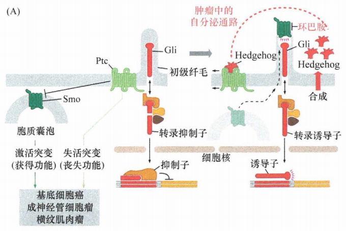 
图2：Patched-Smoothened 信号通路

在皮肤基底细胞痣综合征(BCNS)中检测到 Patched 编码基因存在胚系突变。皮肤细胞PTCH基因座杂合性缺失(LOH) 会使痣朝着基底细胞癌(BCC)演变。此外，基底细胞癌是最常见的UV照射导致的皮肤肿瘤，近半数散发性基底细胞癌存在PTCH基因失活突变或SMO基因的激活突变。不过幸运的是，这些皮肤癌相对预后较好和容易治疗。但是这两个基因存在等位基因突变的其他肿瘤，尤其是肌细胞和小脑来源的肿瘤(成神经管细胞瘤) 则不是这样。
 
2000年研究者发现环巴胺能直接抑制Smo蛋白, 而且这种相互作用阻滞了Hh过度表达或SMO基因突变所造成的异常信号转导。这表明环巴胺的致畸效应是直接由胚胎发育期阻滞Hh信号通路的重要环节而导致的。
 
环巴胺与Smo相关性的发现随后引发了用环巴胺治疗多种Hh阳性的人类肿瘤细胞系的尝试，其对肿瘤细胞增殖的抑制程度达到75%~95%。例如，体外培养的人成神经管细胞瘤细胞具有较强的Hedgehog信号通路活性，能对环巴胺产生显著的治疗反应，导致细胞生长停止并快速失去活性；而另外两种 Hedgehog 未激活的脑肿瘤细胞（胶质母细胞瘤和室管膜瘤）中环巴胺未能产生治疗反应。环巴胺对其他无Hedgehog信号通路激活的肿瘤细胞系也不能产生治疗作用。另外，环巴胺能彻底阻滞胆囊肿瘤（另一种分泌Hedgehog的内胚层肿瘤）细胞在小鼠模型中的肿瘤形成能力。大约 70%人胰腺癌存在高水平的Hh表达，表明Hh-Smo-Ptc-Gli信号通路的活化是这些肿瘤生长程序的内在部分。
 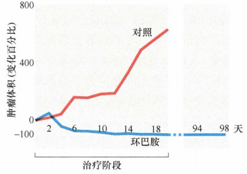 
图3：环巴胺的治疗效果

成年鼠长时间应用治疗剂量的环巴胺至今没有任何毒性作用的表现。然而，有3个主要问题动摇了环巴胺作为有效抗肿瘤治疗候选药物的潜力。首先，与其他天然产物相类似 ，环巴胺是一系列复杂酶反应的最终产物，这一复杂的酶反应过程很难通过有机合成化学实验来实现。其次，要从假藜芦中得到足够大量的产物是不实际的。最后，尽管已经在小鼠体内得到了以上结果，但是在人体内环巴胺仍然产生了过高的毒性作用。因此，在环巴胺的基础上研发了无毒性但具有类似环巴胺阻断Hh信号通路能力的 Smo 拮抗剂，而且这些药物对其他细胞受体的影响很小。
 
Hh信号对胰腺癌进展具有非常多元的作用。一般来说，在许多肿瘤中，自分泌Hh驱动肿瘤进展，因为这类肿瘤细胞分泌Hh配体同时表达Patched受体，此情况已在胰腺癌基因工程小鼠模型中确证，然而，旁分泌Hh信号在这些肿瘤的进展中具有更重要的作用。胰腺癌细胞释放能刺激肿瘤微环境中成纤维细胞和肌成纤维细胞增殖的Sonic Hh, 胰腺癌特征之一就是具有这些间质细胞构成的致密结缔组织基质。此基质形成了阻碍化疗药杀伤内部肿瘤细胞的物理屏障, 该现象能从一个方面解释为什么一些肿瘤几乎对所有类型的治疗都不敏感。所以Hh抑制剂可以用于阻断致密基质形 成来和其他细胞毒性药物联合抗癌, 这种新策略的临床效果目前还不清楚。

**雷帕** **霉素** 

mTOR的故事也是从一个天然产物 雷帕霉素 开始的。雷帕霉素于1960年从太平洋中部一个广为人知的Easter Island上Rapa Nui土壤中生长的吸水链霉菌中分离出来。20世纪70年代早期，一个制药公司把它分离出来作为抗真菌药物。在随后的几十年中发现雷帕霉素能够阻止真核细胞生长，而且对从酵母到哺乳动物的真核细胞具有广谱作用。
 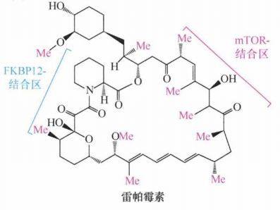 
图4：雷帕霉素

后来发现即使极低浓度的雷帕霉素也有很强的免疫抑制能力。1999年美国FDA批准它作为器官移植（主要为肾移植 ）的免疫排斥药物。这一药物也称为 西罗莫司 ，能够与其他免疫抑制药物发挥协同作用，尤其是与环孢霉素和类固醇药物联合应用来保证长时间的移植物移入不会引起移植者的严重副作用。有意思的是，环孢霉素产生的免疫抑制会在器官移植受者中增加产生肿瘤的风险。而雷帕霉素诱导的免疫抑制能够降低这些患者发生移植后淋巴增生紊乱的风险。
 
雷帕霉素能够直接结合于低分子量蛋白FKBP12(分子量为12kDa的FK506结合蛋白)。一旦雷帕霉素-FKBP12 结合成复合体, 其就能够与mTOR相互作用，并导致其功能失活。mTOR 是一个289kDa的丝氨酸/苏氨酸激酶，它的激酶结构域与PI3激酶和相关的酶相似。
 
mTOR整合了包括营养利用和有丝分裂原在内的一系列输入(即传入细胞内部)信号，并进而调控葡萄糖摄入和蛋白质合成等一系列其他细胞生物学过程。具体过程为mTOR磷酸化两个关键的翻译调控分子：p70S6 激酶(S6K1)和4E-BP1。S6K1的磷酸化导致4E-BP1磷酸化核糖体小亚基的S6蛋白，然后小亚基才能够参与形成核糖体（与核糖体大亚基相互作用 ）并参与蛋白质的合成。
 
通过磷酸化4E-BP1(及4E-BP2), mTOR能够使4E-BP1/2 释放关键的翻译起始因子eIF4E(真核起始因子4E) 。eIf4E被释放以后就可以与其他一些起始因子结合成复合体，该复合体能够使核糖体起始特定mRNA的翻译过程，尤其是那些5'非翻译区有寡聚嘧啶的mRNA。这一系列反应过程使mTOR成为一个细胞生长的关键调控因子（而不是调控细胞增殖)。
 
此外，mTOR被证明是Akt/PKB的一种关键上游活化因子。通过控制Akt/PKB通路，除了已知的调节细胞生长功能以外，mTOR 还能够调控细胞凋亡和增殖过程。
 
在下图中，mTOR出现在两个位置，反映了它与Raptor和Rictor两个伴侣分子相互作用的功能。 mTOR-Rictor复合物 与第三个蛋白分子GβL一起形成 TORC2复合体 ，通过生长因子以未知的方式激活 Akt/PKB。 mTOR-Raptor复合物 与GβL形成TORC1复合体。目前我们已经清楚TORC1复合体负责激活蛋白质合成过程（通过磷酸化S6K1、4E-8P1和4E-BP2)。通过与FKBP12结合，雷帕霉素直接与mTOR-Raptor复合体结合，使其迅速失活。而且，雷帕霉素作用几小时以后，mTOR-Rictor也能够失活，最终抑制Akt/PKB通路。对于雷帕霉素抑制mTOR-Rictor复合体的机制还知之甚少。
 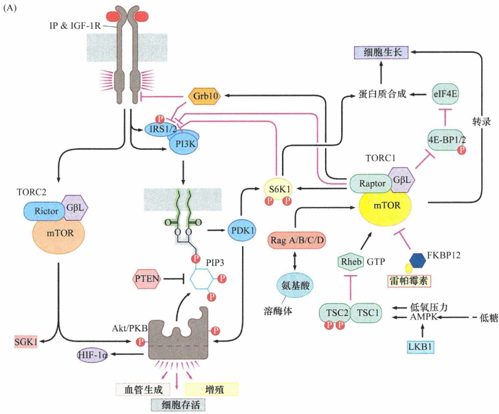 
图5：mTOR通路

雷帕霉素的肿瘤治疗作用很可能是其抑制了Akt/PKB信号通路，这些肿瘤表现出PI3K过度激活或PTEN表达缺失。在移植受者中长期使用雷帕霉素产生的副作用毒性也很低。在临床前试验中，雷帕霉素在 小鼠身上用于诱导慢性免疫抑制的剂量水平能够强烈地抑制肿瘤相关的新血管生成及肿瘤生长。这一效应可能与内皮细胞及其前体细胞中Akt/PKB的3种同工酶之一Akt1在血管内皮生长因子(VEGF)刺激下的血管生成有关。
  
图6：雷帕霉素的疗效

2006 年报道雷帕霉素能够诱导结节性硬化相关的星形细胞瘤消退。此后的几年中， 依维莫司 （雷帕霉素/西罗莫司的异构体，也称为癌伏妥）被FDA批准用于晚期肾细胞癌(RCC)和胰腺神经内分泌肿瘤(NET), 以及巨细胞星形细胞瘤的治疗。 

**维罗非尼**
 
新测序技术推动下的全肿瘤细胞基因组测序发现了大量新候选癌基因和抑癌基因。然而，这些新发现的候选基因中最重要的是一个已知的 Ras-Raf-MEK-ERK信号通路 。处于研究中的其他基因还包括C-Raf (早期称为c-Raf) 及它的两个同家族分子，A-Raf和B-Raf, 它们都能被GTP结合的Ras激活。C-Raf 编码产物与Raf 癌蛋白相似。2002年进行的序列分析发现超过半数的人皮肤黑色素瘤中携带突变的B-Raf 等位基因。
 
人90%的B-Raf 等价基因突变涉及编码第600位氨基酸残基的密码子点突变，通常是正常编码的缬氨酸被谷氨酸取代。B-Raf 的V600E突变与Ras癌基因的突变很相似，Ras癌基因的等位基因突变甚至以更高的频率影响到第12个密码子这一特定位置。有意思的是，在黑色素瘤和其他肿瘤类型中，B-Raf 等位基因突变很少与Ras癌基因突变同时存在。这一互斥性的模式表明，Ras-Raf-MEK-ERK通路在这些不同肿瘤的发生过程中发挥着重要作用，并且这两个家族的等位基因突变在功能上是冗余的。
 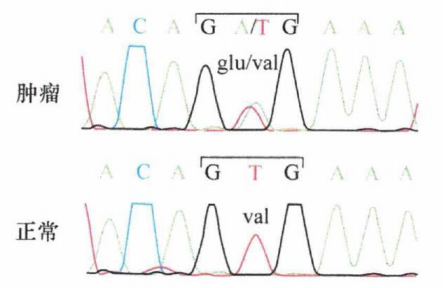 
图7：B-Raf等位基因点突变
 
2011年，特异性靶向V600E突变型B-Raf蛋白的药物维罗非尼（以前称为PLX4032), 在欧洲获批用于治疗转移性黑色素瘤，该药物很快也获得了美国的批准。维罗非尼虽然能使携带V600E型突变的转移性黑色素瘤患者生存期延长，但仍无法治愈疾病。这些肿瘤迟早会产生耐药并进而复发，并最终导致患者死亡。此外，有一定比例接受此药物治疗的患者会出现皮肤鳞状细胞癌，这明确提示该药 物可能会剌激一些处于临床潜伏期的肿瘤发生进展。事实上，若肿瘤患者携带V600E以外的其他突变，维罗非尼的确会促进肿瘤生长。因此，使用该药物前对肿瘤进行序列分析非常重要。
 
与RTK激酶相似，Raf 蛋白以同源二聚体(如B-Raf：B-Raf) 或异源二聚体 (如 B-Raf：C-Raf) 的形式发挥作用。两个亚基间有明确的调节互作，维罗非尼结合到二聚体中的V600E型突变蛋白，会激活另外一个野生型的B-Raf 和C-Raf 蛋白分子。在正常细胞中，Ras确实也能通过B-Raf：C-Raf 异源二聚体进行信号转导。携带Ras癌基因突变的黑色素瘤患者，用此药治疗后能强烈激活Ras-Raf-MEK-MAPK信号通路。MEK是Raf 蛋白的直接下游激酶，阻断MEK活性的药物通常能阻止该药物出现相反疗效。
 
如下图所示：①正常细胞中，具有丝裂原活性的GTP型Ras蛋白结合并激活 B-Raf/C-Raf 异源二聚体，并由 B-raf 强烈激活下游信号通路，这导致 MEK 和 MAPK/ERK 激活。②在许多恶性黑色素瘤中，V600E突变型 B-Raf 蛋 白，可以作为一种单体(左)以 Ras 非依赖方式发挥功能，强烈激活该信号级联。以一种V600E特异性抑制剂(绿色矩形)阻断这个信号(右)后能暂时抑制恶性黑色素瘤。③有Ras癌蛋白突变存在的肿瘤细胞中(例如，在许多大肠癌)，V600E特异性抑制剂关闭 B-Raf 信号，却通过别构互作导致后者被激活，并由 C-Raf 激活下游信号。④在某些B-Raf 野生型的正常细胞中，这种抑制剂可能会通过 C-Raf 来激活下游信号。
 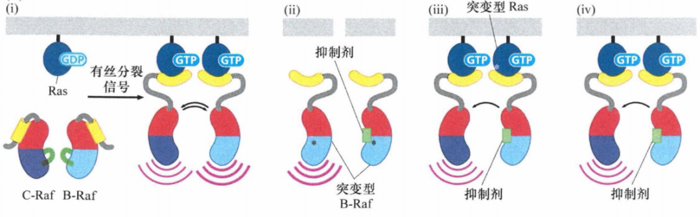 
图8：维罗非尼在治疗中扮演的双重角色
