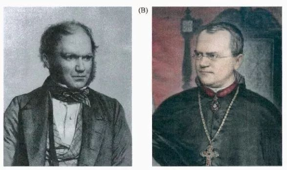
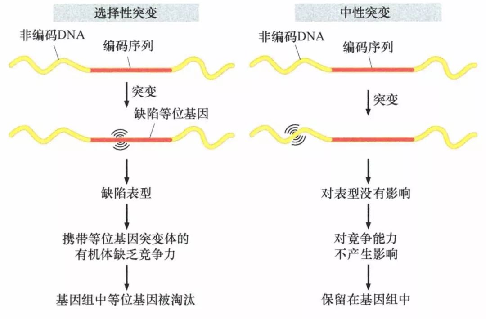
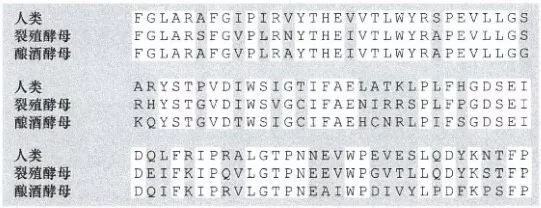
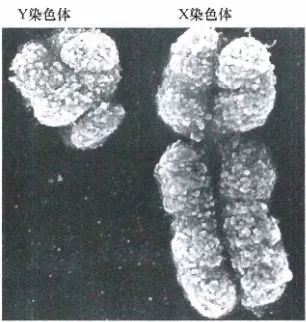
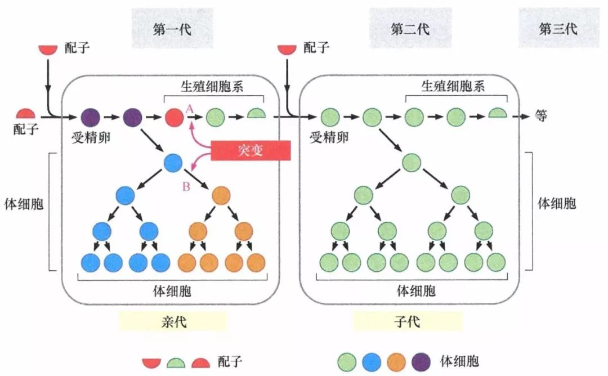

# 第一章 《癌生物学》第一章（1）  孟德尔遗传定律和达尔文进化论【学习分享】

**“** 生物学各个分支学科的发现不断丰富着我们对于肿瘤发生的理解 ，孟德尔和达尔文两位先驱建立的概念影响着现代生物学思想的各个方面 。 本章中，我们首先回顾孟德尔遗传学体系和达尔文进化论，及基于此发现并建立的生物学大楼。 **”** ****

 图1-1：达尔文 与孟德尔

01 —

孟德尔遗传定律与基因型、表型

**“颗粒遗传学”** 是 孟德尔的一项主要见解，它指出：遗传物质是由独立的信息小体组成的，而每一个信息小体都对应于一可观测的性状。

这种信息小体在后来被称为基因， 可观测的性状 即表型 。 现在我们知道，基因是表型的决定性因素，多数可观测的表型都能追溯至多个基因的共同作用；而 控制不同表型的基因是相互独立、互不干扰的。

对于二倍体生物，一个基因含有两个等位基因（等位基因相同者称之为纯合子；反之为杂合子）。在决定表型上，其中一个等位基因通常起主导作用。故而，性状正常的杂合子个体可能携带有缺陷的等位基因。

 图1-2：颗粒遗传说 
 事实上，把等位基因划为显性或者隐形过度简化了生物学的现实， 某些基因的等位基因可以呈 共显性，也就是一个表达出的表型可以呈现为两个等位基因混合的形式。不完全外显也是一种常见的例子，在这种情况下，某一显性基因是存在的，但由于生物体基因组中其他基因的作用，它的表型并不能完全显示。因此，该等位基因的支配地位不仅是由这一基因自身决定表型的能力决定，而是由其与其他等位基因的相互作用决定的 。 
 

 02 — 
 孟德尔遗传定律与达尔文进化论 20世纪 二三十年代，人们开始意识到遗传物质是易变的。基因突变是改变基因信息内容的“肇事者”：基因突变把一种等位基因转变为另一种等位基因或从之前普遍存在的某一物种的等位基因创造出新的等位基因。为方便描述，把在某物种大多数个体中都存在的等位基因称为“野生型”，由突变产生的存在于少部分个体中的等位基因称为“突变型”。 然而，并非所有基因突变都会影响表型。现在知道，人类基因组中仅约3.5%的 DNA 携带重要的生物学序列并执行相应的生物学功能，绝大部分 DNA 并不携带重要的生物学序列。 突变发生于基因组中，它不加选择地改变有作用的基因和非编码DNA， 无功能DNA发生的突变并不影响表型，称为“中性突变”。

图1-3：突变与进化

中性突变对生命体的生存不会产生影响，故能够在基因库中存留，并在进化过程中累积，呈现“多态性”。相反，具有生物学功能的序列发生的突变常会导致其功能丧失，故自然选择使其在基因库中淘汰，这些序列仅仅缓慢变化，呈现“保守性”。（下图三个物种同源蛋白质的氨基酸序列显示保守型。）

图1-4：基因功能的高度保守性

03 —

基因和染色体运转

基因定位于特定染色体的特定位点（基因位点），染色体的长度与它所携带的基因数量成比例。人体中几乎所有细胞都拥有一套完整的染色体组，几乎所有细胞都直接遗传并继承了受精卵基因组的精确拷贝。这意味着，基因通过影响单个细胞的行为来产生整个生命体的表型。

孟德尔遗传定律的染色体和基因都成对出现，这一机制在肿瘤的发展中起重要作用，因为几乎所有防止细胞增殖失控的基因都以两个拷贝的形式存在，只有当两个拷贝全部失活时，才会使其失去生长抑制功能进和导致肿瘤细胞增殖。

性染色体违背了对称出现的原则：人类X染色体约携带900个基因，而Y染色体仅携带78个基因。很多对生命的发育和功能至关重要的基因都位于X染色体上，成对出现的X染色体能够保证生命体更加健壮。因此 ， 其结构上的不对称本应使雄性处于生物学上的不利地位。

图1-5：人类性染色体

然而， X 失活机制缓解了性别之间的差异：胚胎发生早期，雌性胚胎的每一个细胞中，两条 X 染色体中的一条随机失活，导致该染色体上几乎所有基因沉默，并使之收缩成称为“巴氏小体”的微粒。因此，雌性携带X染色体相关基因冗余拷贝的优势也只是相对的。

04 —

肿瘤与基因、染色体突变

正常情况下，每个细胞都存在着精密的修复系统，它们不断监控着细胞的基因组，一旦发现突变序列就用适当的野生型序列对其进行替换。然而，没有绝对可靠的损伤检测和修复系统，当 修复装置偶尔失察或灾难性损害超过修复能力，便有可能导致 基因组突变 积聚 。

生殖细胞和体细胞 累及 的突变 均可引发肿瘤，但遗传学后果不尽相同： 生殖细胞突变发生于生殖细胞基因组携带的基因中，由亲代个体传至子代个体，突变了的基因存在于子代体内性腺以外的所有细胞，并可传递给后代；体细胞基因突变 发生于亲代体细胞基因组携带的基因中 ， 突变了的基因 仅 影响亲代的一个体细胞基因组，仅传递给该亲代身体内突变细胞的直系后代，并不能传递给后代。

图1-6：生殖细胞突变与体细胞突变

此外，多数癌细胞的染色体也发生了改变，如：整条染色体丢失、额外染色体副本、一条染色体臂与另一条染色体臂融合等。特定基因、染色体的获得和缺失有益于特定类型肿瘤的增殖。

结构上看似正常的染色体可以产生额外的拷贝，所得到的拷贝首尾相连融合为一个同源染色区。染色体片段也可能被从染色体上切除，并且在核内扩增为很多拷贝，产生称为双微染色体的亚染色体片段。 有时，两种形式的扩增可共存于同一个细胞。 双微染色体和同源染色区都可引起所携带的基因扩增，进而促进癌细胞的生长。

参考书目：《The Biology of Cancer》（Second Edition）  R.A.Weinberg  著，詹启敏 等  译

编辑：周健  张月明  游丹铭

校审：张健  罗鹏

· [留言区]()