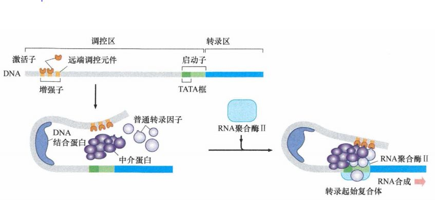
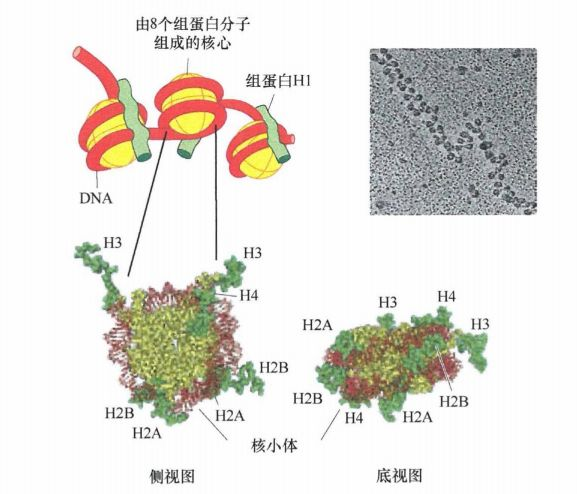
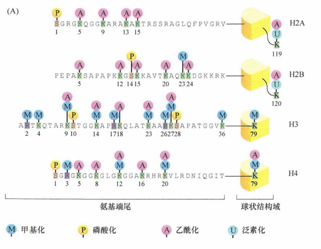
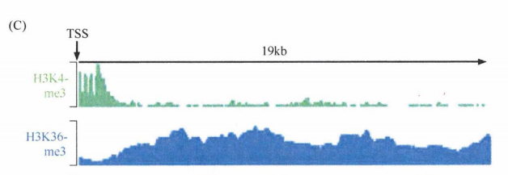
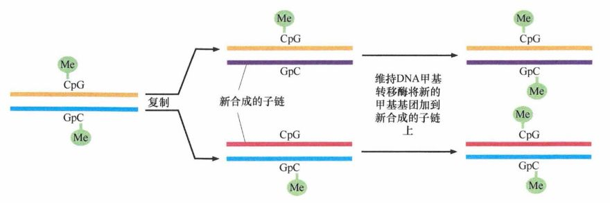
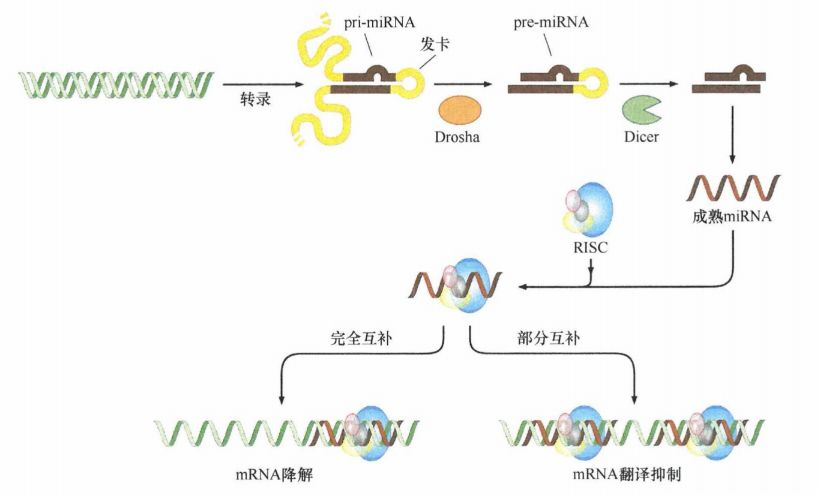

# 第一章 《癌生物学》第一章（3）基因表达的调控【学习分享】

“我们已经知道，基因表达的方式可以决定表型。今天我们谈谈，基因表达受哪些因素的调控。”

转录因子调控基因表达

绝大多数基因的转录依赖于几种不同转录因子（TF）的共同作用，其中每一种TF都结合于基因启动子或周围的适当位点（即增强子），以协同作用激活基因表达。细胞中多种基因的协调表达通常称为基因表达程序，它依赖于多种 TF 在大量基因启动子上的共同作用。

细胞要表现出复杂的、组织特异性的表型需要一系列基因的协同表达和抑制另一些基因的表达。 TF结合于基因调控区的特异性DNA序列 ，决定该基因是否表达。一些 TF以分子水平尚不完全清楚的方式为RNA聚合酶 （在前体 mRNA情况下为RNA聚合酶 II ）提供了接近基因从而启动转录的机会，而另外一些 TF则可以阻止RNA聚合酶接近基因 ，以确保该基因的转录被抑制。

图3-1：TF调控基因表达

转录因子的功能非常强大，单一类型的转录因子就可能同时影响一大类下游应答基因的表达。一种转录因子引发细胞或器官多种改变的能力通常称为多效性。在肿瘤细胞中，一个功能失调的多效性转录因子可以同时协调一大类应答基因的表达，使其共同作用以产生癌细胞的表型。

组蛋白修饰调控基因表达

染色质的核心是由 DNA绑定到核小体上组成的 ，核小体由 DNA与小球状蛋 白共同形成，呈现链珠状。核小体是八聚体，由两个拷贝组成，每个拷贝由 4种不同的组蛋白 （ H2A 、 H2B 、 H3和H4 ）组成。

图3-2：染色质结构的组成

核小体的球状核心是染色质的基本支架，有两种修饰方式。

首先，一些标准的组蛋白，如组蛋白 H2A和H3, 在少数核小体中可被变体形式 （如组蛋白 H2AZ、H3.3 ）替换。在整个染色质中，分散着许多这样的变体组蛋白，但它们对于染色质结构和转录调节的准确作用尚不清楚。

再者， 4种标准组蛋 白的转录后修饰影响染色体结构和转录。这些修饰并不直接改变核小体的球状核心，而是影响核心组蛋白的氨基端尾，后者由球状核心向外延伸并接受多种共价修饰。最突出的是甲基化、乙酰化、磷酸化和泛素化。

图3-3：蛋白质氨基酸尾的翻译后修饰

例如，一种组蛋白磷酸化与发生于有丝分裂的染色质凝聚、基因表达的普遍停止有关；在细胞周期的其他阶段，核心组蛋白的乙酰化通常与基因活跃表达有关，而甲基化通常与基因表达抑制相关。需要注意的是，组蛋白的甲基化与基因抑制和表达均相关，结果效应取决于受甲基化影响的赖氨酸残基的位置。

染色质蛋白负责调控 TF及RNA聚合酶与DNA的相互作用， 越来越多的证据显示，各种各样的组蛋白修饰对允许或阻止染色体 DNA特定区域 上 RNA聚合酶 的转录功能十分重要，因而在调控基因表达方面具有重要作用。

图3-4：利用抗体免疫沉淀特定类型的修饰组蛋白，随后对该沉淀物进行DNA测序，由此绘制多种组蛋白修饰的位点，发现组蛋白H3赖氨酸4残基三甲基化（H3K4me3，绿色）的核小体位于基因的转录起始位点(TSS)。表明：包含H3K4me2的核小体与TSS相关，而那些包含H3K36me3的核小体与活跃转录基因相关。

DNA的共价修饰调控基因表达

DNA甲基转移酶使甲基基团直接结合于DNA双螺旋中CpG二核苷酸 的胞嘧啶碱基。被甲基化的 CpG二核苷酸通常定位在启动子附近 ，这种甲基化一般引起附近基因的抑制。

甲基化 CpG岛本身并不直接阻断转录 ，而是影响染色质蛋白的结构，这些蛋白质的主要作用是包装染色体 DNA并将其呈现给RNA聚合酶以便转录。尤其是甲基化CpG结合蛋白 特异地与甲基化二核苷酸结合，并影响附近染色质的结构。此外，特定组蛋白的修饰能够从相反的方向影响 DNA甲基化的状态。

DNA复制后 甲基化的维持由 DNA甲基转移酶识别新近复制DNA的半甲基化片段，对与DNA链中已经甲基化的CpG互补的未甲基化片段的CpG二核苷酸进行甲基化 完成。

图3-5：DNA复制后甲基化的维持

非传统RNA分子调控基因表达

20世纪90年代 ，科学家揭示了一种新的 RNA分子 类型：微小 RNA（miRNA）。 它们含 21-25个核苷酸 ，通常产生于更大的核 RNA前体切割产物。 它们控制胞质内特定 mRNA的水平 ，或这些 mRNA翻译的效率 ，或同时对二者进行调控。一种 miRNA可以调节许多不同 种类 mRNA的表达 ，使之对多种细胞过程表现出多效性。

一个初级 miRNA转录物加工后在细胞质内形成miRNA ，后者是核蛋白复合体 RISC （ RNA 诱导沉默复合体 ）的组成部分。这些复合体与一系列 mRNA靶点相关 ，这些靶点通常位于非翻译区，其序列的一部分或者全部与 RISC 复合体中的 miRNA互补。这种互补能够使mRNA翻译抑制或者mRNA降解，或者两种作用同时发生。

图3-6：miRNA的产生与基因调控作用

发现 miRNA的10年后 ，另一种不寻常的 RNA出现在人们的视野： 人类基因组中 4%-9%的DNA转录成200个核苷酸以上长度的RNA分子，却没有发现这些RNA有明确的蛋 白质编码序列及功能。这些长链非编码 RNA（lncRNA ）存在于细胞核与细胞质中，并以我们尚不了解的方式调节基因表达。

一部分已被阐明的 lncRNA在功能上协助蛋 白质发挥作用 —— 蛋白质调节转录， lncRNA 通常作为支架支撑特定染色体修饰蛋白。 lncRNA在 肿瘤发展中的作用研究才刚刚开始，例如， lncRNA HOTAIR 的上调表达与人类乳腺癌和结肠癌转移行为 相关。越来越多的观点认为数千种不同的 lncRNA是细胞调节机制的重要分 子成员。

miRNA和lncRNA的行为使我们进一步窥见哺乳动物细胞内基因表达 、调控的复杂性。某一基因的转录被允许后，会有数种干预机制调控其最终产物 —— 蛋白质的积累以执行该基因的实际功能。这些机制反反映在不同水平： 1、 前体 mRNA的转录后加工 ：选择性剪接模式； 2、mRNA产物的稳定性或降解 ； 3、mRNA翻译调节 ； 4、 翻译后修饰：改变蛋白质产物的稳定性或使其降解。

参考书目： 《The Biology of Cancer》（Second Edition）  R.A.Weinberg  著，詹启敏 等  译

编辑：周健  张月明  游丹铭

校审：张健  罗鹏

往期回顾：

[《癌生物学》第一章（1）孟德尔遗传定律和达尔文进化论【学习分享】](http://mp.weixin.qq.com/s?__biz=Mzg4NjA5Mzg2Mw==&mid=2247484461&idx=1&sn=72104e0b83f7cd500a142fed89d7ffc9&chksm=cf9fa565f8e82c7325ebf03f8f78af60e9e32f486ace8774fef71b186b956f131f683a66fc4f&scene=21#wechat_redirect)

[《癌生物学》第一章（2）基因如何决定表型【学习分享】](http://mp.weixin.qq.com/s?__biz=Mzg4NjA5Mzg2Mw==&mid=2247484557&idx=1&sn=422338d2f6c79f9201ac4c4a57952b76&chksm=cf9fa5c5f8e82cd3a2f6d399f262668bd5dabd51917c601e6e603f521faa4e723a27be245d47&scene=21#wechat_redirect)

