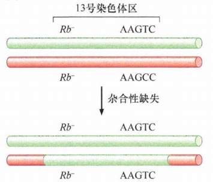
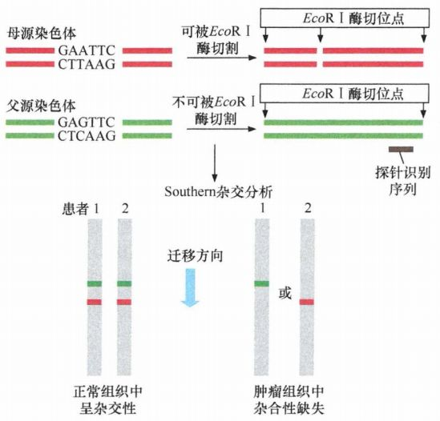
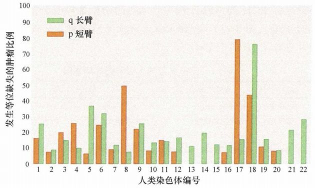
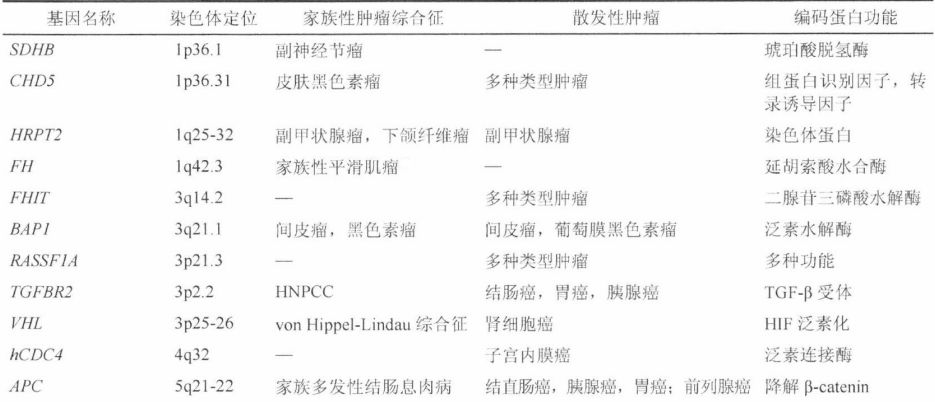
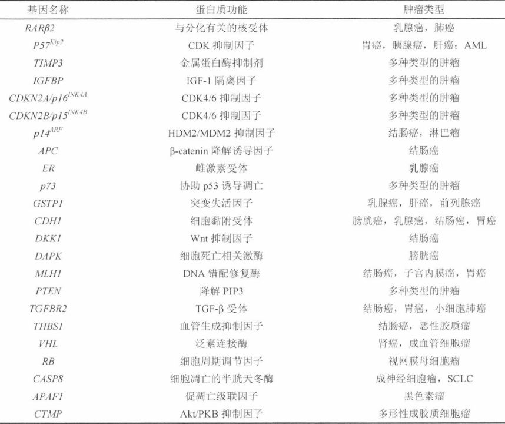
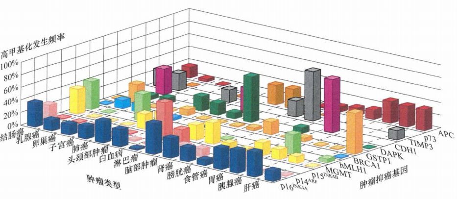

# 第七章 《癌生物学》第七章（2）  抑癌基因的发现与探索

**往期回顾**
 
[《癌生物学》第二章（1） 癌症的起源](http://mp.weixin.qq.com/s?__biz=Mzg4NjA5Mzg2Mw==&mid=2247484770&idx=1&sn=a5144114b3d342408140b8c9ee234d92&chksm=cf9fa42af8e82d3c26681af84e26b7c6361e1275bfdce2edce2c4a3065871c1ce97f0649d3e4&scene=21#wechat_redirect)
 
[《癌生物学》第二章（2） 癌症的发展及其能量代谢](http://mp.weixin.qq.com/s?__biz=Mzg4NjA5Mzg2Mw==&mid=2247484805&idx=1&sn=e97e67056c1d508092127d0388c2eaf6&chksm=cf9fa4cdf8e82ddbaaabda6a2d17d32ec4ab3b7809b97006c79a707f93e35738a7216ba03b4e&scene=21#wechat_redirect)
 
[《癌生物学》第二章（3）癌症的诱因](http://mp.weixin.qq.com/s?__biz=Mzg4NjA5Mzg2Mw==&mid=2247484881&idx=1&sn=bdc85af93a48af8f3c633cbb3b27384d&chksm=cf9fa499f8e82d8f0991b6902435a029254d873ffdc446bc815fddf909f79ca094ce2729135d&scene=21#wechat_redirect)
 
[《癌生物学》第三章（1）病毒可以引发肿瘤](http://mp.weixin.qq.com/s?__biz=Mzg4NjA5Mzg2Mw==&mid=2247485009&idx=1&sn=bf13fdc034c935e967b24ea8264fae21&chksm=cf9fa719f8e82e0f8dc2a5d07a3040aad5619cccfa12509259840d02b3b7417609c8cc132d3c&scene=21#wechat_redirect)
 [《癌生物学》第三章（2）肿瘤病毒如何在细胞中复制（上）](http://mp.weixin.qq.com/s?__biz=Mzg4NjA5Mzg2Mw==&mid=2247485236&idx=1&sn=38754b14ff13c402137769797c36711b&chksm=cf9fa67cf8e82f6aa90d5232aeabf7b48bbcbc792fc807e0626046ec92f4a341bfd30cd9fd1d&scene=21#wechat_redirect) [《癌生物学》第三章（3）肿瘤病毒如何在细胞中复制（下）](http://mp.weixin.qq.com/s?__biz=Mzg4NjA5Mzg2Mw==&mid=2247485333&idx=1&sn=0748f6670320d8d5796113eb408ba01b&chksm=cf9fa6ddf8e82fcbde1175c3ed490fbcad7db352b2728e7fb0e76b0b2c08683663446d3470d2&scene=21#wechat_redirect) 
[《癌生物学》第四章（1）并非所有肿瘤都由病毒感染引起](http://mp.weixin.qq.com/s?__biz=Mzg4NjA5Mzg2Mw==&mid=2247485497&idx=2&sn=c67ed023b637d16e27bb21037e89edec&chksm=cf9fa971f8e82067c6369e04d6a56afa5c398053f08111a2f46879f990bfee32089bc42ff68b&scene=21#wechat_redirect) 

 
[《癌生物学》第四章（2）细胞原癌基因的激活](http://mp.weixin.qq.com/s?__biz=Mzg4NjA5Mzg2Mw==&mid=2247485625&idx=2&sn=fedd027b1ba76c07ed4d2af0b70069c3&chksm=cf9fa9f1f8e820e75e4bc24e8525b5436213d2ad009187877ca2a5f693573b9f5bb965741fba&scene=21#wechat_redirect)
 
[《癌生物学》第五章（1）生长因子与受体（上）](http://mp.weixin.qq.com/s?__biz=Mzg4NjA5Mzg2Mw==&mid=2247485864&idx=1&sn=9d850e610445822a84b6bd6318734094&chksm=cf9fa8e0f8e821f6e93a3c554138b82030bc5adc8d0e47e111ec3d9f0d8424c29bcd49c100c1&scene=21#wechat_redirect)
 
[《癌生物学》第五章（2）生长因子与受体（中）](http://mp.weixin.qq.com/s?__biz=Mzg4NjA5Mzg2Mw==&mid=2247485893&idx=3&sn=e4b521e3cf4ca5cb85a3686ca8bfbd40&chksm=cf9fa88df8e8219bd3ea563f1eb3fd4917188ae6c71d9a3427d3dcc30e1ffaadbafaf744c2fb&scene=21#wechat_redirect)
 
《癌生物学》第五章（3）生长因子与受体（下）
 
[《癌生物学》第六章（1）酪氨酸磷酸化的调控作用](http://mp.weixin.qq.com/s?__biz=Mzg4NjA5Mzg2Mw==&mid=2247486271&idx=2&sn=1cd38152b98c45961b1b2e95fe30a7d9&chksm=cf9faa77f8e8236176748bdc5a18442cbded1d791b7a49db5f7a64076215dab2a339f6ecf2d8&scene=21#wechat_redirect)
 
[《癌生物学》第六章（2） Ras下游3条重要的信号通路](http://mp.weixin.qq.com/s?__biz=Mzg4NjA5Mzg2Mw==&mid=2247486293&idx=2&sn=9ffda5507d1a485d9b3f289333c71af8&chksm=cf9faa1df8e8230bf23de9c88af7810c8454a6b9838d40c23cad3074d99ff397bb56e5c1b6bd&scene=21#wechat_redirect)
 
[《癌生物学》第六章（3） 细胞内其他信号网络](http://mp.weixin.qq.com/s?__biz=Mzg4NjA5Mzg2Mw==&mid=2247486528&idx=1&sn=d46485bf93b08b6ca5f6a52106ce18cd&chksm=cf9fad08f8e8241e16e7d85e350239210c93e196fa16593113968c79457f0f9dfed86d3aa845&scene=21#wechat_redirect)

“通过上一讲，我们知道： 杂合性缺失的发生频率远高于基因突变的发生频率，这就意味着 野生型 Rb基因的丢失可能更多地依赖于杂合性缺失，而不是通过直接的基因突变。 普遍认为，大多数视网膜母细胞瘤细胞都会在 13号染色体Rb基因及其附近的区域（13号染色体长臂l区4带（13q14)）存在杂合性缺失，而不是在这一位置发现由两次独立的事件所产生的、两个突变位点不同的Rb等位基因。”

图 7-2-1 ： Rb位点杂合性缺失的实证：五核苷酸序列最初表现为异源杂合子的形式（上方），但在经历了导致Rb基因发生杂合性缺失的过程之后也同样呈现出杂合性缺失的形式

1、 通过杂合性缺失寻找抑癌基因

癌基因经常在逆转录病毒的基因组中被发现，可以通过转染实验来验证它们的克隆形成能力，或者通过检测它们是否存在于肿瘤染色体的扩增区域来鉴定。与之形成鲜明对比的抑癌基因，只有当它们从基因组上丢失时才能体现自身价值的基因，我们该如何发现它们呢？

在肿瘤形成过程中， 抑癌基因倾向于在邻近的染色体区域发生杂合性缺失 ，这为肿瘤研究人员提供了一种新的遗传学方法来寻找它们： **通过在特定类型肿瘤发生过程中总是发生杂合性缺失的无名遗传标志物附近寻找，有可能会发现尚未被克隆的抑癌基因** 。

在一部分个体当中， 某 DNA片段能够被限制性内切酶剪切；而在其他个体中，同样的DNA片段由于在限制性内切酶识别位点单个碱基的替换而无法被切割。类似于这样的遗传可变性在人类基因库中是由正常的遗传变异引起的，这些位点代表了遗传标志物的多态性。鉴于这些序列存在着可被内切酶剪切和不可被剪切两种不同的结果，我们将其称为 **限制性（内切酶）片段长度多态性 (RFLP)** 。

图7-2-2： 限制性片段长度多态性(RFLP)：母源（红色）DNA片段可以被EcoR I酶切割，而其同源的父源（绿色）片段由于单核甘酸的替换而无法切割。使用一个能识别父源片段右侧末端的放射性探针，通过Southern杂交分析能够确定剪切是否发生。本例中，两例肿瘤患者的正常组织DNA在该染色体区域均呈杂合性。然而，在他们的肿瘤DNA中发生了杂合性缺失。

肿瘤遗传学家通常利用 RFLP来判断在某种肿瘤的发生过程中染色体不同区域是否频繁地发生了LOH。下图显示了用RFLP技术在一组结直肠肿瘤中寻找LOH的结果。大部分染色体的长臂和短臂都用了至少一个RFLP标志物来标记，以便研究整条染色体的变化。值得注意的是，在人类的多种肿瘤中发现17号染色体的短臂(p)和18号染色体的长臂(q)均存在异乎寻常的高LOH发生率，这两条染色体臂的缺失率均远高于肿瘤细胞中平均15%~20%的染色体LOH发生率。

图7-2-3： 肿瘤抑癌基因定位：染色体长臂和短臂分别以绿色和橘色条状图表示。纵坐标显示的”等位缺失”即LOH。（由于当时只有极少数的探针可用于检测染色体层面的LOH, 因此该分析对于关键性的抑癌基因的定位并不精确）

这一事实为这两条染色体臂中发生 LOH的区域还存在其他尚未明确的抑癌基因提供了有力证据。因此， **遗传学定位** 为那些在基因组中寻找与结直肠肿瘤发展密切相关的抑癌基因的基因克隆学家提供了明确的指示线索。

2、抑癌基因突变遗传能解释多种家族性肿瘤

和 Rb基因一样，大多数已经被克隆的抑癌基因都与家族性和散发性肿瘤的发生有关。一般而言，遗传了上述有缺陷的基因拷贝都能极大地增加罹患某种特定类型肿瘤的风险，而该类型的肿瘤在正常人群中则通常比较罕见。在某些患者中，如果突变发生在胚系等位基因中，将会导致对多种类肿瘤易感。

表 7-2-1：部分已被克隆的人类肿瘤抑癌基因 （ TSG）

当遗传了一个突变的 TSG等位基因时可能会增加罹患肿瘤的风险，但反之则不然：并不是所有的家族性肿瘤综合征都存在遗传性的TSG等位基因。由于肿瘤的发生取决于个体体细胞基因组的累积突变，因此减少体细胞基因如这些维持基因组稳定性的基因的突变频率具有高效的抑癌功能。相反，基因组的不稳定性会增加基因的突变率，从而使罹患肿瘤的风险大幅度增加。

因此，人们认识到体内存在着两类不同的家族性肿瘤基因 ： 本 章 讨论的 **抑癌基因** 及将在第 12章介绍的 **基因组稳定维持基因** 。 抑癌基因是通过影响细胞的增殖、分化或死亡来直接调控细胞生物学行为的，有时也被称为 **看门基因** （ gatekeeper gene ),以表明它们在决定细胞是否进入生长和分裂周期过程中所起到的关键作用。 基因组 维持基因则只通过调控细胞内基因突变累积的速率来间接地影响细胞的生物学行为 ， 又 称 为 **看护基** **因** （ caretaker gene )。

3 、 启动子甲基化是抑癌基因失活的一种重要机制

在哺乳动物类细胞中，当鸟嘌呤 5'端的胞嘧啶（CpG序列）甲基化发生在启动子附近时，它能够引起相应基因的转录抑制。大量研究显示：基因组DNA的CpG修饰是导致抑癌基因沉默的重要途径之一。

在一些肿瘤的形成过程中，经常会发现肿瘤细胞整个基因组的甲基化水平逐渐降低，这种 “ **广泛甲基化不足** ”有可能与DNA上那些不具有特定生物学功能的、高度重复序列所携带的甲基化基团丢失有关。

与此同时，在肿瘤细胞基因组中存在另一类富含 CpG的DNA区域，即通常位于启动子区的" **CpG岛** ”，常发生异常高甲基化，从而抑制该基因的转录，导致原本应该转录激活的基因被沉默。

实际上，近年来越来越多的证据显示，比起体细胞突变，启动子区甲基化在沉默抑癌基因方面发挥养更重要的作用。通过胚系突变可引发家族性肿瘤综合征的抑癌基因中有超过半数被发现在散发性的肿瘤中经由启动子区甲基化而沉默。例如，当 Rb抑癌基因发生胚系突变时将导致家族性的视网膜母细胞瘤。而在散发性视网膜母细胞瘤中，则是由体细胞突变或启动子区甲基化导致该抑癌基因的失活。此外，其余一系列被确认或推测与抑制肿瘤形成相关的基因，其启动子区也被发现处于甲基化的状态。

表 7-2-2：人类肿瘤细胞基因组中高甲基化基因

原则上，启动子甲基化可以通过两种方式灭活抑癌基因的功能。其中之一是使一个抑癌基因的两个拷贝分别被甲基化。另外一种则是当其中一个拷贝发生甲基化以后，另一个拷贝通过复制该甲基化拷贝所导致的 LOH而丢失，结果造成甲基化拷贝复制。实际上，第二种机制的发生频率更高。例如，在对吸烟者、曾吸烟者和从未吸烟者的肺组织中 p 1 6 I NK 4 A 抑癌基因的甲基化研究发现，该基因在 44%的吸烟者和曾吸烟者（表面上正常）的支气管上皮细胞中发生了甲基化；而作为对照的那些从未吸烟的人群的细胞中则没有发生任何甲基化。这一染色体区域的LOH在两种吸烟人群中的比例为 71% - 73%, 而在从未吸烟人群中则只1.5% - 1.7% 。

该研究也给了我们其他一些启示：调控生长的关键性基因的甲基化通常发生在肿瘤形成这一繁杂过程的早期，甚至远早于组织学上的形态改变。这些表面正常的细胞群体将为最终的癌前病变和恶性生长提供肥沃的土壤。

图7-2-4： 肿瘤细胞基因组中12个已知发挥抑癌作用基因的甲基化

维甲酸的作用很好地说明了启动子甲基化的细胞生理学结果。在上皮细胞中，维甲酸是一种潜在的细胞周期阻滞剂，甚至是细胞分化诱导剂，它能阻断乳腺癌细胞的进一步增殖。然而，大多数肿瘤细胞中负责编码关键性维甲酸受体蛋白的 RARβ2基因由于启动子甲基化而沉默。该受体的表达缺失时将导致乳腺癌细胞对维甲酸治疗无反应，从而摆脱了生长阻滞，并产生相应的耐药性。

参考书目： 《The Biology of Cancer》（Second Edition）  R.A.Weinberg  著，詹启敏 等  译

编辑：周健 张月明 游丹铭

校审：张健 罗鹏

