# 第三章 《癌生物学》第三章（1）病毒可以引发肿瘤【学习分享】

**往期回顾**

[《癌生物学》第一章（1） 孟德尔遗传定律和达尔文进化论【学习分享】](http://mp.weixin.qq.com/s?__biz=Mzg4NjA5Mzg2Mw==&mid=2247484461&idx=1&sn=72104e0b83f7cd500a142fed89d7ffc9&chksm=cf9fa565f8e82c7325ebf03f8f78af60e9e32f486ace8774fef71b186b956f131f683a66fc4f&scene=21#wechat_redirect)
 
[《癌生物学》第一章（2） 基因如何决定表型【学习分享】](http://mp.weixin.qq.com/s?__biz=Mzg4NjA5Mzg2Mw==&mid=2247484557&idx=1&sn=422338d2f6c79f9201ac4c4a57952b76&chksm=cf9fa5c5f8e82cd3a2f6d399f262668bd5dabd51917c601e6e603f521faa4e723a27be245d47&scene=21#wechat_redirect)
 
[《癌生物学》第一章（3） 基因表达的调控【学习分享】](http://mp.weixin.qq.com/s?__biz=Mzg4NjA5Mzg2Mw==&mid=2247484667&idx=1&sn=f5ac0e9f91f4017af882b9793999b14a&chksm=cf9fa5b3f8e82ca50cbd101947d2b381aa94f44c40eafc3007915592d95d8f1b8f7ce0718a36&scene=21#wechat_redirect)
 
[《癌生物学》第二章（1） 癌症的起源【学习分享】](http://mp.weixin.qq.com/s?__biz=Mzg4NjA5Mzg2Mw==&mid=2247484770&idx=1&sn=a5144114b3d342408140b8c9ee234d92&chksm=cf9fa42af8e82d3c26681af84e26b7c6361e1275bfdce2edce2c4a3065871c1ce97f0649d3e4&scene=21#wechat_redirect)
 
[《癌生物学》第二章（2） 癌症的发展及其能量代谢【学习分享】](http://mp.weixin.qq.com/s?__biz=Mzg4NjA5Mzg2Mw==&mid=2247484805&idx=1&sn=e97e67056c1d508092127d0388c2eaf6&chksm=cf9fa4cdf8e82ddbaaabda6a2d17d32ec4ab3b7809b97006c79a707f93e35738a7216ba03b4e&scene=21#wechat_redirect)
 
[《癌生物学》第二章（3）癌症的诱因【学习分享】](http://mp.weixin.qq.com/s?__biz=Mzg4NjA5Mzg2Mw==&mid=2247484881&idx=1&sn=bdc85af93a48af8f3c633cbb3b27384d&chksm=cf9fa499f8e82d8f0991b6902435a029254d873ffdc446bc815fddf909f79ca094ce2729135d&scene=21#wechat_redirect)

“ 病毒可以在被其感染的宿主细胞内增殖、杀死宿主细胞、释放能够感染附近其他宿主细胞的子代病毒颗粒，且在组织中快速传播，故在所到之处造成广泛的破坏。然而，有些病毒并不杀死被感染的细胞，而是促使其宿主细胞不受限制地增殖，这类病毒被称为肿瘤病毒。肿瘤病毒通常含有相对简单的基因组，但它们却能控制被其感染的细胞及其复杂的基因组，表明它们具有非常高效的基因来干扰被感染宿主细胞本身复杂的调控网络。 ”

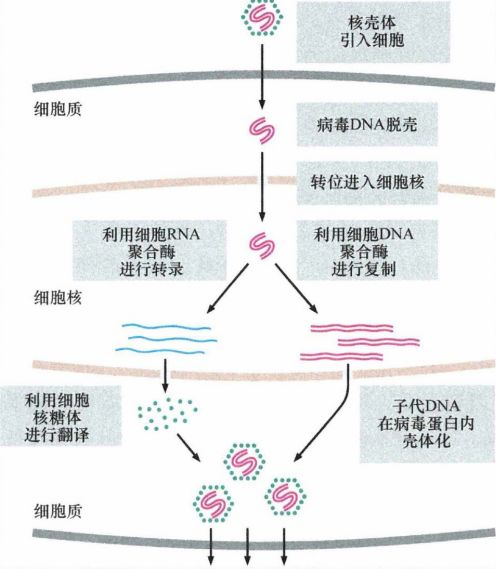

图 3-1-1 ：双链 DNA （ dsDNA ）基因组病毒的生命周期

Peyton Rous发现鸡肉瘤病毒

1908年，两位哥本哈根的研究者从鸡白血病细胞中提取得到一种病毒，将其注入其他鸟的体内后，这些鸟随后也感染了该疾病。遗憾的是，他们并没有将最初的发现研究到底 。

1909年，Peyton Rous开始对雌鸡胸肌中出现的肉瘤进行研究。起初，Rous将这种肉瘤的碎块植入同一品种的其他鸡体内,成功地接种肿瘤。随后，他将一块肉瘤研磨得到的匀浆液进行过滤，把滤过液注入幼鸡体内后，它们也都产生了肿瘤。接着，他发现这些诱导产生的肿瘤经过匀浆后，也能够感染其他鸡并在注射部位产生肉瘤。

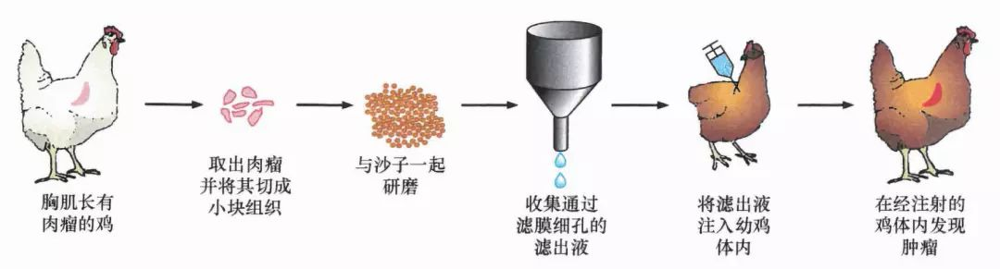

图 3-1-2 ： Rous 在鸡中诱导肉瘤。这个循环能无限次地重复，且子代病毒诱发肉瘤的速度较原代病毒更加迅速

从鸡肉瘤中分离得到的病毒被称为 Rous 肉瘤病毒（RSV），它们能够在鸡的组织内进行增殖，且在被感染而产生的肿瘤组织中被发现比最初注射的量多得多。Rous肉瘤病毒的研究结果使某些人确信：几乎所有人类疾病都由传染性病原体引发，肿瘤如同霍乱、结核、狂犬病和败血症一样，其病因与某种特定微生物病原体相关联。此后不久，1913 年Dane Johanne Grib Fibiger报道称，大鼠胃癌的发生能够溯源到其含有的螺旋体蠕虫。 （注：后来证明， Fibiger所描述的胃肿瘤其实是由于这些大鼠严重缺乏维生素而化生的胃上皮细胞） 他因此获得了1926年诺贝尔生理学或医学奖，直接有力地肯定了最初由Rous研究结果提出的观点：肿瘤是一种传染性疾病。

今天我们知道，“肿瘤是一种传染性疾病”的认识是片面的。但肿瘤病毒的发现，在当时对人类认识肿瘤的发病机制，的的确确产生了革命性的影响。

肿瘤病毒能感染并转化体外培养细胞

在Peyton之后，Harry Rubin发现：将含RSV的悬液加入培养有鸡胚胎成纤维细胞的Petri培养皿时，被RSV感染的细胞似乎也能无限期地存活下来。重要的是，被RSV感染的细胞表现出很多与肿瘤细胞相似的性状：它们聚集形成焦点簇，在显微镜下呈现出肿瘤细胞特有的圆形形态，它们的新陈代谢与从肿瘤中分离的细胞相似。

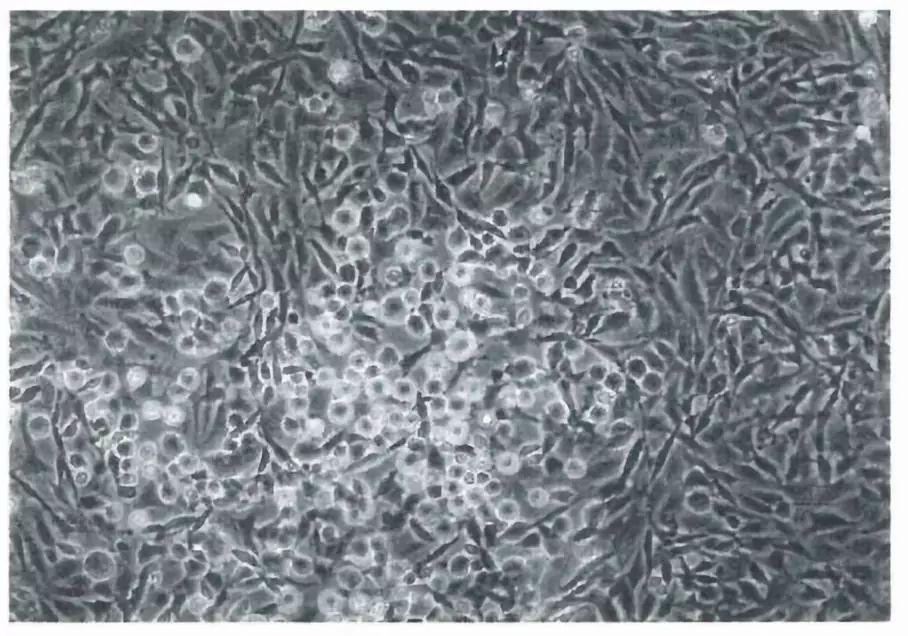

图 3-1-3 ： RSV 诱导形成的细胞簇 （圆形、具有折光性）与正常细胞（扁平）对比鲜明

为了研究最初被RSV感染的细胞是如何增殖的，Rubin和Temin在Petri培养皿底生长的细胞层上铺了一层琼脂胶，以防止游离的病毒颗粒从最初感染的细胞传播到培养皿中其他未感染的细胞，这保证了鸡胚胎成纤维细胞的任何行为改变都是由病毒的初始感染导致的。结果显示，RSV感染诱导产生的转化细胞与正常细胞不同，它们很明显丧失了接触抑制效应并不断增殖，细胞彼此堆积形成肉眼可见的多层细胞簇。

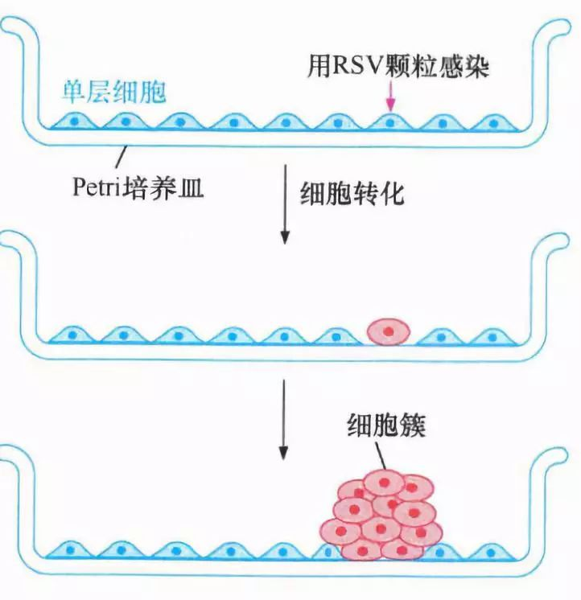

图 3-1-4 ：被转化的细胞形成细胞簇丧失接触抑制

在该实验条件下，同一个细胞簇中的所有细胞都是被一个RSV颗粒感染和转化的一个原代细胞的后代。而在自发产生的人类肿瘤中，所有细胞都是由一个克隆的产物所复制产生。

基于此，Rubin等人推测：RSV在Petri培养皿中诱发的细胞转化与活体动物中肿瘤的产生过程具有相似性。细胞转化（从正常细胞到肿瘤细胞的转换）这一过程不仅仅只在复杂的、难以研究的活组织环境中发生，也能在Petri培养皿中完成。

这些研究结果彻底改变了肿瘤的研究进程：肿瘤形成可以在单个细胞水平上进行研究，肿瘤整体的复杂生物学行为可以通过研究形成肿瘤的转化细胞来了解。

维持转化需要病毒持续存在

RSV诱导产生的细胞簇中的细胞行为显示，转化表型从最初感染转化的鸡细胞传递给了它的直系后代。这种传递引起了另一个问题：RSV病毒颗粒感染和转化了细胞簇的祖细胞后，是继续影响所有直系后代细胞的行为以保证细胞处于维持被转化的状态，还是以“打了就跑”的方式离开”犯罪现场”？

1970年，加利福尼亚大学伯克利分校建立了一种RSV突变株：当在37℃培养时能够转化鸡细胞，而在41℃培养时则不能（后者是培养鸡细胞的正常温度）。在鸡胚胎成纤维细胞被RSV温度敏感型突变体感染后，在允许温度（37°C)下进行培养时，病毒的转化功能得到表达，细胞将发生转化。但是将含有这些被感染细胞的培养物转移至非允许温度(41°C)时，细胞恢复到正常的、未转化的形态。之后，将这些培养物再转移至允许温度时，细胞再次展现出被转化的形态。

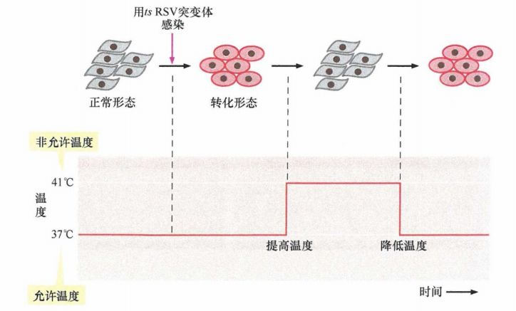

图 3-1-5 ：温度敏感型突变体和 RSV 诱发转化的维持

温度下调许多天后，细胞重新获得转化表型，表明尽管在高温时细胞呈现正常形态，但病毒基因组始终存在于这些细胞中，由RSV诱导的细胞转化不是一个“打了就跑”的过程。用肿瘤病毒学家的话来说，病毒的转化基因是引起和维持病毒感染细胞的转化表型所必需的。

DNA病毒也能引发肿瘤

RSV被发现后，人们逐渐发现了越来越多的肿瘤病毒，这些病毒颗粒携带的基因组不仅仅是类似RSV病毒的RNA基因组，也有很多是DNA基因组。

20世纪50年代末 ， Richard Shope在兔皮肤乳头状瘤 中 发现了 Shope 病毒， Shope 颗粒携带 DNA 分子，由蛋白质外壳包裹； 1953年 人们发现多瘤病毒，该病毒因能够在小鼠中诱发多种不同类型的肿瘤而得名； 20世纪50年代中晚期 ，人们发现了 SV40病毒时，最初认为 它是生产的脊髓灰质炎病毒疫苗中的污染物。后来的病毒学研究发现， SV40病毒颗粒经常隐藏于恒河猴和食蟹猴的肾脏细胞中，这些细胞通常在疫苗制备阶段被用于繁殖脊髓灰质炎病毒。细胞在被SV40 病毒感染后，不到一天就会溶解并释放出成千上万个后代病毒颗粒。

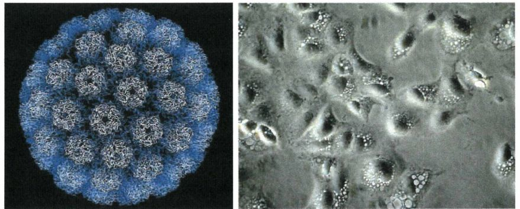

图 3-1-6 ： SV40 病毒结构（左）： X 射线衍射测定结果显示， SV40 DNA肿瘤病毒的蛋白质衣壳由病毒编码的3 种蛋白质构成，这些蛋白质组合成为五聚体和六聚体，双链 DNA存在于衣壳内。SV40 病毒在宿主细胞内启动裂解周期（右）：引发细胞病变，包括在细胞死亡前形成的巨大细胞质空泡和释放后代病毒颗粒。

Shope乳头状瘤病毒、小鼠多瘤病毒和SV40病毒都属于乳多空病毒 ，这个词指代乳头状瘤、多瘤及 SV40 病毒在其裂解感染中引发空泡。乳多空病毒基因组较小，由双链DNA构成，绝大多数基因都与病毒复制有关，其中有一些基因专门编码病毒颗粒的衣壳蛋白。说明乳多空病毒只有少数基因用于细胞的转化，这极大地简化了肿瘤研究，使我们只需要去研究很少数量的基因和因果机制。

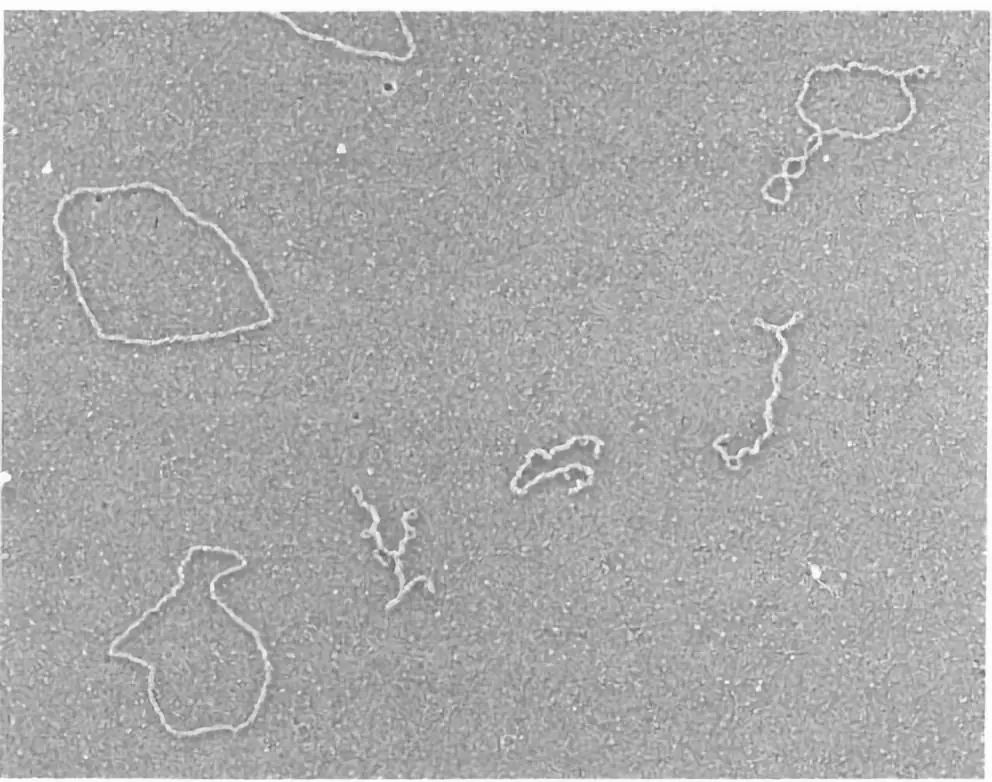

图 3-1-7 ：乳多空病毒（ SV 40 病毒）基因组： 电镜下显示其结构为双链环状，图中为不同形态的 SV 40病毒DNA

人类腺病毒的发现进一步壮大了DNA肿瘤病毒的队伍，该病毒能够引发人类的上呼吸道感染，且能够在被感染的仓鼠身上引发肿瘤；其他的DNA肿瘤病毒都属于疱疹病毒。人类l型和2型疱疹病毒没有致瘤性，但疱疹病毒家族的远亲Epstein-Barr病毒（EBV）在赤道非洲和新几内亚的小儿Burkitt's淋巴瘤及东南亚鼻咽癌的发生中起关键作用。

腺病毒和疱疹病毒颗粒含有长的线性双链 DNA（dsDNA）分子，与RSV病毒的基因组相似。与乳多空病毒相比，疱疹病毒具有庞大的基因组，因而没有成为具有吸引力的研究对象。

表 3-1-1 ：肿瘤病毒基因组：腺病毒和疱疹病毒基因组庞大

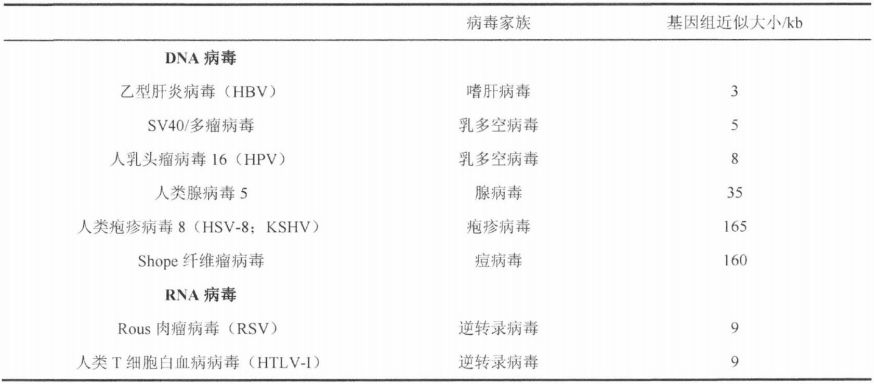

肿瘤病毒诱导多种表型

肿瘤病毒感染并转化的细胞，在形态、功能上，均与正常细胞表现出很大的差异，前文提到的接触抑制消失只是病毒转化细胞众多表型改变中的一方面。

表 3-1-2 ：转化细胞的特征

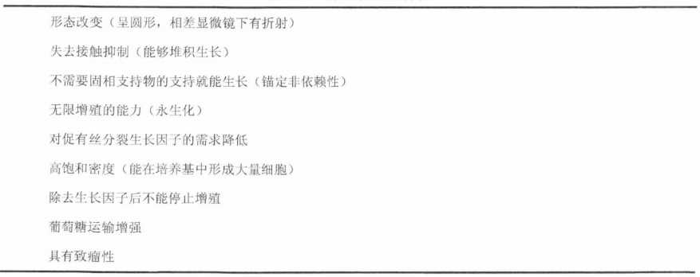

正常细胞在不含血清和血清相关生长刺激因子的培养液中是不能增殖的；而被各种肿瘤病毒转化的细胞对培养液中这些因子的需求却大大降低。正常细胞在培养液中的增殖潜力有限，在经过一定的、预设的细胞分裂后，最终停止增殖；而肿瘤细胞似乎能够在培养液中无限增殖，发生永生化。此外，正常细胞必须与固相基底接触锚定后才能生长，即锚定依赖性的；而转化细胞的增殖不依赖于与培养皿固相基底接触，它们能够悬浮于琼脂胶中增殖为球状的克隆，称为锚定非依赖性的。

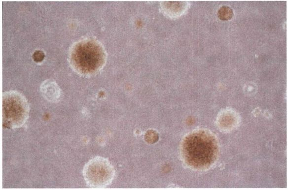

图 3-1-8 ： 锚定非依赖性的生长：半固体培养基中，转化细胞在悬浮状态下仍然能够增殖

细胞能够在体外以铀定非依赖性的形式生长，通常预示着当其注射入适当的宿主动物时，能够在其体内产生肿瘤。这一形成肿瘤的能力——致瘤性，是检测细胞是否完全转化的真正指标。通常，肿瘤病毒感染细胞的致瘤性不能在同系的宿主动物中进行检测，因为被研究细胞的来源物种中不能得到近亲繁殖的同系宿主。这迫使研究者使用免疫功能不全的宿主进行研究，它们的免疫系统能够耐受各种类型的外来细胞，包括来自其他物种的细胞。于是，裸鼠就成为最常用的宿主，用来检测一系列细胞（包括人源性）的致瘤性，最常见的方法是将候选的肿瘤细胞进行裸鼠皮下注射。

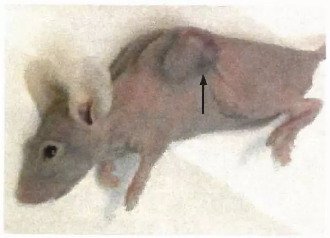

图 3-1-9 ：裸鼠： 裸鼠缺乏胸腺，免疫功能高度不全，容易接受遗传上不相关的移植细胞。裸鼠无毛，因此在其皮下注入转化细胞后，容易密切监测肿瘤的形成（箭头所示）过程。

参考书目： 《The Biology of Cancer》（Second Edition）  R.A.Weinberg  著，詹启敏 等  译

编辑：周健  张月明  游丹铭

校审：张健  罗鹏

