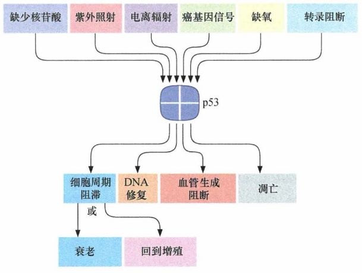
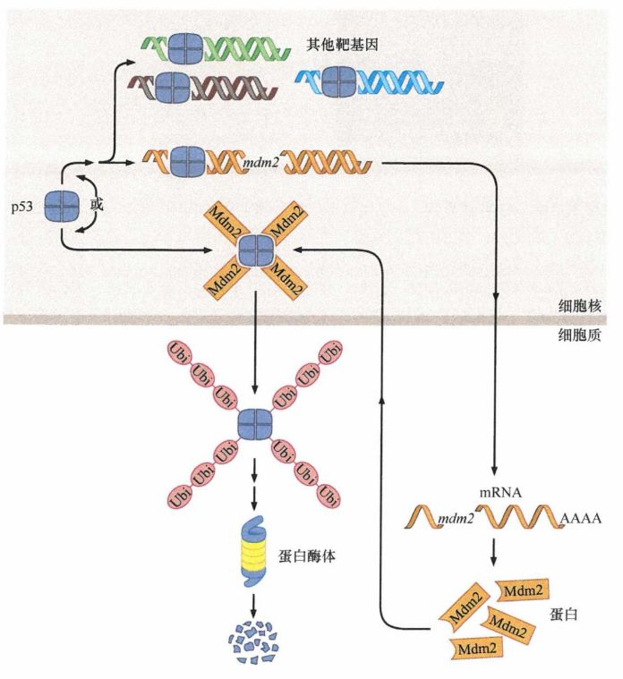
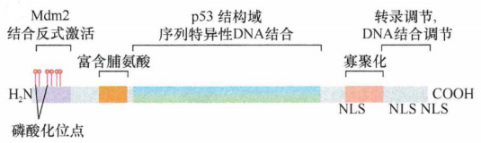

# 第九章 《癌生物学》第九章（2）  P53水平的调控

**往期回顾**

[《癌生物学》第四章（1）并非所有肿瘤都由病毒感染引起](http://mp.weixin.qq.com/s?__biz=Mzg4NjA5Mzg2Mw==&mid=2247485497&idx=2&sn=c67ed023b637d16e27bb21037e89edec&chksm=cf9fa971f8e82067c6369e04d6a56afa5c398053f08111a2f46879f990bfee32089bc42ff68b&scene=21#wechat_redirect) 

 
[《癌生物学》第四章（2）细胞原癌基因的激活](http://mp.weixin.qq.com/s?__biz=Mzg4NjA5Mzg2Mw==&mid=2247485625&idx=2&sn=fedd027b1ba76c07ed4d2af0b70069c3&chksm=cf9fa9f1f8e820e75e4bc24e8525b5436213d2ad009187877ca2a5f693573b9f5bb965741fba&scene=21#wechat_redirect)
 
[《癌生物学》第五章（1）生长因子与受体（上）](http://mp.weixin.qq.com/s?__biz=Mzg4NjA5Mzg2Mw==&mid=2247485864&idx=1&sn=9d850e610445822a84b6bd6318734094&chksm=cf9fa8e0f8e821f6e93a3c554138b82030bc5adc8d0e47e111ec3d9f0d8424c29bcd49c100c1&scene=21#wechat_redirect)
 
[《癌生物学》第五章（2）生长因子与受体（中）](http://mp.weixin.qq.com/s?__biz=Mzg4NjA5Mzg2Mw==&mid=2247485893&idx=3&sn=e4b521e3cf4ca5cb85a3686ca8bfbd40&chksm=cf9fa88df8e8219bd3ea563f1eb3fd4917188ae6c71d9a3427d3dcc30e1ffaadbafaf744c2fb&scene=21#wechat_redirect)
 
《癌生物学》第五章（3）生长因子与受体（下）
 
[《癌生物学》第六章（1）酪氨酸磷酸化的调控作用](http://mp.weixin.qq.com/s?__biz=Mzg4NjA5Mzg2Mw==&mid=2247486271&idx=2&sn=1cd38152b98c45961b1b2e95fe30a7d9&chksm=cf9faa77f8e8236176748bdc5a18442cbded1d791b7a49db5f7a64076215dab2a339f6ecf2d8&scene=21#wechat_redirect)
 
[《癌生物学》第六章（2）Ras下游3条重要的信号通路](http://mp.weixin.qq.com/s?__biz=Mzg4NjA5Mzg2Mw==&mid=2247486293&idx=2&sn=9ffda5507d1a485d9b3f289333c71af8&chksm=cf9faa1df8e8230bf23de9c88af7810c8454a6b9838d40c23cad3074d99ff397bb56e5c1b6bd&scene=21#wechat_redirect)
 
[《癌生物学》第六章（3）细胞内其他信号网络](http://mp.weixin.qq.com/s?__biz=Mzg4NjA5Mzg2Mw==&mid=2247486528&idx=1&sn=d46485bf93b08b6ca5f6a52106ce18cd&chksm=cf9fad08f8e8241e16e7d85e350239210c93e196fa16593113968c79457f0f9dfed86d3aa845&scene=21#wechat_redirect)
 
[《癌生物学》第七章（1） 抑癌基因与肿瘤细胞表型](http://mp.weixin.qq.com/s?__biz=Mzg4NjA5Mzg2Mw==&mid=2247486664&idx=1&sn=52597f9e0e4f0027c3bfc4c17954eba0&chksm=cf9fad80f8e824965ed77e0a87f16cb145e8ec9b80f3c4597624f7ea84882af22653207a8437&scene=21#wechat_redirect)
 
[《癌生物学》第七章（2） 抑癌基因的发现与探索](http://mp.weixin.qq.com/s?__biz=Mzg4NjA5Mzg2Mw==&mid=2247486671&idx=2&sn=18afb1b90118fc8ce0521c9f10a73d16&chksm=cf9fad87f8e8249117a3d1e0395cfabbda447a5a4410d4a9ff913043bee26d6ec8899e4aceb3&scene=21#wechat_redirect)
 
[《癌生物学》第七章（3） 抑癌基因的作用实例](http://mp.weixin.qq.com/s?__biz=Mzg4NjA5Mzg2Mw==&mid=2247486678&idx=2&sn=91703b8b6417578486ac512a09a064d2&chksm=cf9fad9ef8e82488061f0150a628ffa88f89b81d7f3155c0797ec2c4b4aef0a12bbd9db66ed8&scene=21#wechat_redirect)
 
《癌生物学》第八章（1）细胞周期控制时钟
 
[《癌生物学》第八章（2）pRb在细胞周期时钟中的作用](http://mp.weixin.qq.com/s?__biz=Mzg4NjA5Mzg2Mw==&mid=2247487021&idx=1&sn=5b7c94bc179e2002f3c9a5713b0733c3&chksm=cf9faf65f8e82673762e74e560b7a481ee1561a6845ed2cdcf87ed1cef9427db47c7ad68d437&scene=21#wechat_redirect)
 
[《癌生物学》第八章（3）Myc、TGF-β在细胞周期时钟中的作用](http://mp.weixin.qq.com/s?__biz=Mzg4NjA5Mzg2Mw==&mid=2247487022&idx=1&sn=013769ab286813e3834183669c3fe69b&chksm=cf9faf66f8e82670baab3d827866f7b2b668259bbacfb38aedb0f0626ecc2dadf1f1235c895a&scene=21#wechat_redirect)
 
[《癌生物学》第九章（1） p53——抑癌基因](http://mp.weixin.qq.com/s?__biz=Mzg4NjA5Mzg2Mw==&mid=2247487247&idx=1&sn=50b6eaf0623c0c134f4c6588f68c3689&chksm=cf9fae47f8e82751bc562b5867da4f7cbecc9cfcd3bb65c3ea19891184fc6f4bd5cccf590299&scene=21#wechat_redirect)

“我们已经知道了， P53 最终被认为是一个非常重要的抑癌基因。那么，机体是如何调节 P53 的激活、降解与稳定，进而发挥重要的作用呢？这其中涉及哪些信号与通路呢？”

1、 P 53 的激活信号

20 世纪 90 年代早期， 科学家 发现 X 射线 、紫外线、 某些能损伤 DNA 的化疗药、 DNA 合成抑制剂及分解细胞骨架中微管蛋白的因子能诱导 P 53 蛋白水平快速升 高。在接下来的几年里，低氧（缺氧）条件被发现能够引起 P 53 水平剧烈改变。 后来 还发现，将 myc 或者腺 病毒 携带的 E 1 A 癌基因转入细胞后也能引起 P 53 水平的上调。 高 于正常水平的 E2Fl 转录因子表达、染色体 DNA 的广泛去甲基化、 DNA 的核 苷酸前体不足都能刺激 P 53 的积累。将细胞置于一氧化二氮或者酸性培养基中、细胞内核糖核酸的缺失、 RNA 或 DNA 合成的阻碍也都可以使 P 53 蛋白水平升高。

在其他研究中能导致 P 53 上调的遗传毒性（如 DNA 损伤）因子及生理学信号同样被熟知 ，它们在某些条件下能抑制细胞生长，导致细胞循环停止，这种反应通常被称为 “ 生长抑制 ” 。在另一些情况下，这些应激信号可能启动凋亡程序。 当遗传毒性因子，如 X 射线，诱发细胞内 P 53 水平升高时， p21 Cip1 蛋白水平也相应地升高， 然而在 p53 突变的细胞中则不发生这样的现象 。这说明 P 53 蛋白能通过诱导 CDK 抑制剂的表达来阻滞细胞周期进程。

综合考虑，这些发现可以整合成一个简单的机制模型： P 53 持 续地接收从多种监控系统传出的信号。如果 P 53 接收到特殊的 警报信号时，它将阻止细胞的增殖，或者启动凋亡程序。

实际上， p53 具有抑制细胞生长和促进细胞凋亡的功能，这对于那些向恶性生长期进展的初期肿瘤细胞来说是一个主要威胁。许多应激，包括缺氧、基因组损伤及调控细胞增殖的信号通路失调，是肿瘤细胞在发展成肿瘤的各个时期都会经历的。在这些应激中的任何一种存在的情况下，完整的、有功能的 P 53 警报系统就会威胁可能形成肿瘤的细胞。

2、 D N A 损伤及失调的生长信号导致 p 5 3 稳定

有 3 个研究 的比较透彻的监控系统，当检测到损伤或者信号失衡时，会给 P 53 发送 报警信号。

第一个监控系统是对染色体 DNA 双链断裂 (DBS) 进行应答的，这些断裂是 由 电离辐射引起的，如 X 射线。传感器将信号传递给 ATM 激酶 ， ATM 将信号传递到 Chk2 激酶上。 Chk2 激酶能磷酸化 P 53, 而 P 53 的磷酸化保证其 中 被一个名为 Mdm2 的蛋 白质降解。（下节讨论）

第二 条信号通路可以被单链 DNA ( ssDNA) 激活，单链 DNA 是 由 停滞的复制叉产生的，通常是由于 DNA 聚合酶遇到了因 DNA 损伤而改变的碱基 。 这些 DNA 损伤因 子包括某些化疗药物及紫外线照射。 ssDNA 感应器通过 Chk 1 激酶激活 ATR 激酶，进而使 P 53 蛋白磷酸化，从而保护其不被降解 。

第三条通路是由异常的生长信号引起的 P 53 激活，特别是在那些由于 pRb-E2F 控制的细胞周期发生紊乱时 ，这条通路并不依赖于激酶介导的 P 53 水平的改变及信号。

这些错综复杂的信号通路说明了哺乳动物细胞的脆弱。在进化的进程中， P 5 3 蛋白被委以重任，接收来自负责监控许多重要的细胞内生理及生化系统发出的信号。 但这也给细胞带来了一个最大的弊端 ，即一旦失去这个调控通路的蛋白质，细胞将灾难性地失去监控自身健康的能力，并且将不能对某些系统的失灵采取适 当的对抗措施。

图 9-2-1 ： P 53 的 激活信号和下游效应

在一次打击后（实际上，两次打击能使 P 53 基因的两个拷贝失活） ， 细胞变得对 自身的故障开始视而不见。 由此它们获得了在某些环境下持续增殖的能力，而在正常情况下这些环境会导致细胞增殖抑制或者进入凋亡。另外，失去了由 P 5 3 促进的 DNA 修复及稳定基因组的功能， p5 3 -/- 细胞的子 代将获得更多的突变 ，并且在向形成恶性肿瘤的道路上更快地迈进 。

3、 M d m2 参与降解 P53

像许多细胞蛋白 一样， p53 蛋白是 由泛素蛋白酶体系统降解的。由这个系统降解的蛋白质都会首先被多聚泛素链共价标记结合，然后被转运到蛋白酶体中，并在其中被消化成为寡肽。这个过程中最为关键的一步是起始的标记过程。 在正常的、未被搅乱的细胞中， p53 的降解是 由 蛋白 Mdm2 （ 小鼠中）和 MDM2 （ 人）调控的。

p53 作为一个转录因 子起作用， Mdm2 与 p53 结合后立即使其调节转录的功能失活。此后， Mdm2 介导单个泛素与 p53 的连接，并将其从核内 （ p53 主要在核内起 作 用）转运到细胞质中，接下来对 p53 的多聚泛素化保证了其在细胞质蛋 白酶体中的迅速降解。连续而有 效的 Mdm2 运作保证了 p53 在正常未受应激的细胞中有 20min 短暂的半衰期 。

以上讨论仅显示 了 Mdm2 作为一个单体蛋白发挥作用，而实际上它常与 MdmX （ 又称 Mdm4 ） 形成异源二聚体。这个复合物在泛素化导致 p53 降解的过程中发挥主要作用。实际上 ， 在缺失 Mdm4 的情况下， Mdm2 不 能使 p53 降解。

图 9-2-2 ： Mdm2 控制 P 53 水平 ：在某些生理信号刺激后 P 53 浓度上升（此处未显示）， P 53 四聚体与众多的靶基因启动 子区结合，这些靶基因的转录由 P 53 诱导（上）。在这些基因中，还包括 mdm2, 导致 mdm2mRNA 及 Mdm2 蛋白水平的上升（右）。一旦合成， Mdm2 分子就和 P 53 蛋白亚基结合，并使其泛素化，并被转运至胞质中进一步泛素化（此处未显示），随后在蛋白酶体中降解。这个负反馈环保证了 P 53 最终回落到一个较低的水平，并且在正常细胞中保证 P 53 的浓度在一个非常低的水平

在某些环境下，特别是细胞遭遇某些类型 的应激或者损伤时， p53 必须被保护起来，以免除 Mdm2 对它们的降解。一般来说，这种保护通常是通过磷酸化来 实 现的， Mdm2 不 能与磷酸化的 p53 结合，故 不 能使其泛素化。 p53 的磷酸化氨基酸残基位于 N 端结构域 ， 如 ATM 、 Chkl 和 Chk2 等激酶对该位点的磷酸化，改变了 p53 蛋 白中通常被 Mdm2 识别并结合的结构域，通过这个方式避免 Mdm2 与 p53 结合。同时， DNA 损失诱导激活的 ATM 激酶可以磷酸化 Mdm2, 并使其功能失活并解体。 当 p53 和 Mdm2 都被磷酸化后 ， Mdm2 不 能起始 p53 的泛 素化。 从而使得 p53 不被降解 。

图 9-2-3 ： p53 蛋白与 Mdm2 的结合发生 在 其靠近 N 端的一个小的结构域中 ，而它的转录激活区也在此处。 在此区域内的 p53 氨基酸残基的磷酸化（红色棒棒）阻止了与 Mdm2 的结合并使得 p53 不能被泛素化及降解

Mdm2 蛋 白的活性及其水平由 其他信号调节。这个信号通路使细胞在激活 Pl3 激酶 (Pl3K) 通路后，通过 Akt/PKB 激 酶 引起 Mdm2 的磷酸化，将 Mdm2 从细胞质中转入核中，并在核中与 p53 发生作用。由 于 Pl3K 本身 由 Ras 和生长因子受体激活，我们了解到促有丝分裂信号通路确实可以影响 Mdm2 从而影响 p53 。同时，在促有丝分裂信号通路中， Ras - Ra f - MAPK 的激活能通过 Ets AP-I (Fos + Jun) 转录因子大幅提高 mdm2 基因的转录，产生高水平的 mdm2 m RNA 及蛋白质。提高的 Mdm2 蛋白水平通过 PI3K - Akt/PKB 信号通路增加了磷酸化激活的 Mdm2 。 这些效应都导致了 p53 蛋白水平的降低 。

另外一个影响 Mdm2 的机制通过 Mdm2 拮 抗物的发现而被发现，即小鼠细胞中的 p 1 9 ARF 和人类中的 p 1 4 AR F 。精确的序列分析发现了后来被命名为 ARF 的基因。这个编码基因最早在小鼠细胞中被发现，它的序列与 p16 INK4A 基因重叠。后者是 CDK4 和 CDK6 激酶的一个重要抑制剂，可起始 pRb 的磷酸化。通过使用 p16 INK4A 启动了上游 13kb 处的启动子转录及可变剪切，使该基因合成了一个编码可变阅读框的 mRNA ， 其编码 ARF 蛋 白 。在野生型咽齿类动物细胞中表达 ARF 编码的 cDNA, 可以对细胞增殖产生强有力的抑制作用 。 但是，当将 ARF 的 cDNA 转入到缺少野生型 p53 功能的细胞中时，这种抑制作用却没有发现。这说明 ARF 的生长抑制功能完全依赖于细胞中有功能的 p53 的存在。

进一步的研究发现， 在野生型细胞中， ARF 的表达可以导致 p53 水平的快速上调。 现在已经研究清楚了 ARF 与 Mdm2 结合并抑制其功能这个反应的分子机制，一方面它可以将 Mdm2 隔离在核仁中；另一方面则是在细胞质中抑制 Mdm2 。一旦将 Mdm2 与 p53 的相互作用阻断， p53 就能逃离 Mdm2 介导的泛素化及降解 ，并由此在细胞内快速高水平地累积。 ARF 能够快速诱导 p53 水平的上调就是因为它能结合并抑制 Mdm2 。

由于 ARF 在提高 p53 水平上有重要的作用， p 1 4 A RF 基因与编码其靶蛋白 的 p53 一样 ，是细胞中一个极其重要的肿瘤抑制基因。

参考书目： 《The Biology of Cancer》（Second Edition）  R.A.Weinberg  著，詹启敏 等  译

编辑：周健 张月明 游丹铭

校审：张健 罗鹏

