# 第九章 《癌生物学》第九章（4）  凋亡与肿瘤

**往期回顾**

[《癌生物学》第四章（1）并非所有肿瘤都由病毒感染引起](http://mp.weixin.qq.com/s?__biz=Mzg4NjA5Mzg2Mw==&mid=2247485497&idx=2&sn=c67ed023b637d16e27bb21037e89edec&chksm=cf9fa971f8e82067c6369e04d6a56afa5c398053f08111a2f46879f990bfee32089bc42ff68b&scene=21#wechat_redirect) 

 
[《癌生物学》第四章（2）细胞原癌基因的激活](http://mp.weixin.qq.com/s?__biz=Mzg4NjA5Mzg2Mw==&mid=2247485625&idx=2&sn=fedd027b1ba76c07ed4d2af0b70069c3&chksm=cf9fa9f1f8e820e75e4bc24e8525b5436213d2ad009187877ca2a5f693573b9f5bb965741fba&scene=21#wechat_redirect)
 
[《癌生物学》第五章（1）生长因子与受体（上）](http://mp.weixin.qq.com/s?__biz=Mzg4NjA5Mzg2Mw==&mid=2247485864&idx=1&sn=9d850e610445822a84b6bd6318734094&chksm=cf9fa8e0f8e821f6e93a3c554138b82030bc5adc8d0e47e111ec3d9f0d8424c29bcd49c100c1&scene=21#wechat_redirect)
 
[《癌生物学》第五章（2）生长因子与受体（中）](http://mp.weixin.qq.com/s?__biz=Mzg4NjA5Mzg2Mw==&mid=2247485893&idx=3&sn=e4b521e3cf4ca5cb85a3686ca8bfbd40&chksm=cf9fa88df8e8219bd3ea563f1eb3fd4917188ae6c71d9a3427d3dcc30e1ffaadbafaf744c2fb&scene=21#wechat_redirect)
 
《癌生物学》第五章（3）生长因子与受体（下）
 
[《癌生物学》第六章（1）酪氨酸磷酸化的调控作用](http://mp.weixin.qq.com/s?__biz=Mzg4NjA5Mzg2Mw==&mid=2247486271&idx=2&sn=1cd38152b98c45961b1b2e95fe30a7d9&chksm=cf9faa77f8e8236176748bdc5a18442cbded1d791b7a49db5f7a64076215dab2a339f6ecf2d8&scene=21#wechat_redirect)
 
[《癌生物学》第六章（2）Ras下游3条重要的信号通路](http://mp.weixin.qq.com/s?__biz=Mzg4NjA5Mzg2Mw==&mid=2247486293&idx=2&sn=9ffda5507d1a485d9b3f289333c71af8&chksm=cf9faa1df8e8230bf23de9c88af7810c8454a6b9838d40c23cad3074d99ff397bb56e5c1b6bd&scene=21#wechat_redirect)
 
[《癌生物学》第六章（3）细胞内其他信号网络](http://mp.weixin.qq.com/s?__biz=Mzg4NjA5Mzg2Mw==&mid=2247486528&idx=1&sn=d46485bf93b08b6ca5f6a52106ce18cd&chksm=cf9fad08f8e8241e16e7d85e350239210c93e196fa16593113968c79457f0f9dfed86d3aa845&scene=21#wechat_redirect)
 
[《癌生物学》第七章（1） 抑癌基因与肿瘤细胞表型](http://mp.weixin.qq.com/s?__biz=Mzg4NjA5Mzg2Mw==&mid=2247486664&idx=1&sn=52597f9e0e4f0027c3bfc4c17954eba0&chksm=cf9fad80f8e824965ed77e0a87f16cb145e8ec9b80f3c4597624f7ea84882af22653207a8437&scene=21#wechat_redirect)
 
[《癌生物学》第七章（2） 抑癌基因的发现与探索](http://mp.weixin.qq.com/s?__biz=Mzg4NjA5Mzg2Mw==&mid=2247486671&idx=2&sn=18afb1b90118fc8ce0521c9f10a73d16&chksm=cf9fad87f8e8249117a3d1e0395cfabbda447a5a4410d4a9ff913043bee26d6ec8899e4aceb3&scene=21#wechat_redirect)
 
[《癌生物学》第七章（3） 抑癌基因的作用实例](http://mp.weixin.qq.com/s?__biz=Mzg4NjA5Mzg2Mw==&mid=2247486678&idx=2&sn=91703b8b6417578486ac512a09a064d2&chksm=cf9fad9ef8e82488061f0150a628ffa88f89b81d7f3155c0797ec2c4b4aef0a12bbd9db66ed8&scene=21#wechat_redirect)
 
《癌生物学》第八章（1）细胞周期控制时钟
 
[《癌生物学》第八章（2）pRb在细胞周期时钟中的作用](http://mp.weixin.qq.com/s?__biz=Mzg4NjA5Mzg2Mw==&mid=2247487021&idx=1&sn=5b7c94bc179e2002f3c9a5713b0733c3&chksm=cf9faf65f8e82673762e74e560b7a481ee1561a6845ed2cdcf87ed1cef9427db47c7ad68d437&scene=21#wechat_redirect)
 
[《癌生物学》第八章（3）Myc、TGF-β在细胞周期时钟中的作用](http://mp.weixin.qq.com/s?__biz=Mzg4NjA5Mzg2Mw==&mid=2247487022&idx=1&sn=013769ab286813e3834183669c3fe69b&chksm=cf9faf66f8e82670baab3d827866f7b2b668259bbacfb38aedb0f0626ecc2dadf1f1235c895a&scene=21#wechat_redirect)

“我们已经知道，作为抑癌基因， P53 影响肿瘤发生发展的机制包括 在 DNA 损伤后阻 止细胞周期的进程并参与修复，在机体面对不利因素的情况下介导细胞凋亡。然而，直到现在为止，我们对凋亡的认识并不完全，也未能完全公平评判自杀程序在肿瘤病因学中的作用。现在，我们重新回顾一下凋亡，并展开更深层次的探讨。”

1、 凋亡过程依赖线粒体

1972 年之前，多细胞动物组织里的细胞通常被认为是因坏死而被单个消灭的 ； 20 世纪 80 年代晚期，对线虫发育的遗传学研究拟示了凋亡在这些微小动物的正常发育过程中参与清除各种细胞。大家逐渐认识到，对于所有的多细胞生物而言 ，凋亡都是一个基本的生物学行为。

表 9-4-1 ： 凋亡与坏死的区别

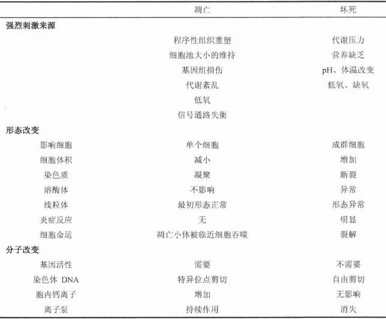

线粒体在凋亡过程中发挥着重要的作用， 细胞色素 c 是这个过程的核心因素，通常位于线粒体内膜和外膜之间的间隙 ，作为氧化磷酸化作用的一部分，起传递电子的作用。然而，一旦某些信号起始凋亡，线粒体的外膜开启通道， 细胞色素 c 就会脱离线粒体，进入外 围胞质，联合其他的蛋白质引起导致凋亡的级联事件。所以，在真核细胞进化的过程中，在细胞产生大量能量的地方同时还存在养另一完全不相关的功能，那就是产生和释放生化信号，诱导相关变化最终导致细胞死亡。

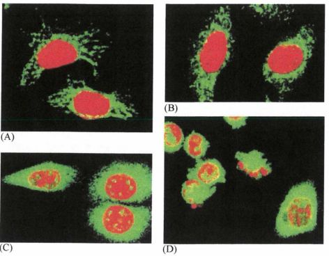

图 9-4-1 ： 细胞色素 c 从线粒体中释放入细胞质 ： （ A) 起始时，细胞色素 c 与线粒体在细胞质中的分布一致 ； ( B )( C )( D ) 当凋亡逐渐进展，细胞色素 c 逐渐从线粒体中释放进入细胞质中，它在细胞浆中的染色体变得越来越均匀一致，同时细胞核表示出与凋亡相一致的断裂 细胞色素 c 可被特异性荧光标记抗体检测（绿色） ，与染料标记细胞核（红橙色）区别

Bcl-2 蛋 白是一个大而复杂的家族中的一员， 它能调控细胞色素 c 通过线粒体 外膜上的特异性通道释放进入细胞质， 这些通道也特异性地决定细胞色素 c 和其他的蛋 白质是否 从线粒体释放入细胞质。 Bcl-2 家族的一些成员， 如 Bcl-2 和 bcl-XL ， 能够保持这些通道关闭； 而其他 Bcl-2 相关蛋 白 ，如 Bax 、 Bad 、 Bak 和 Bid ， 起开启这些通道的作用。

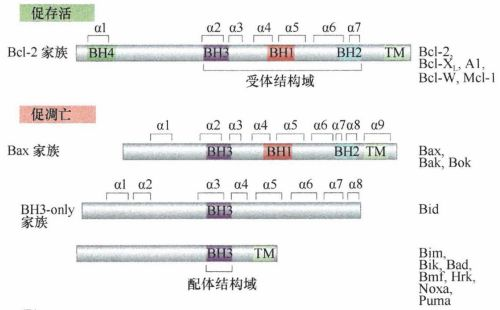

图9-4-2： Bcl-2 和相关蛋白 ： B c l 家族成员既有抑制凋亡的作用又有促进凋 亡 的作用。这些蛋白质都具有一个同样的 BH3 结构域（紫色） ， 有些如 Bcl-2 还具有 BH1 和 BH2 结构域 （红色，蓝绿色），一些成员还具有用于铀定 于细胞膜上 的跨膜结构域（浅绿色）和 BH4 结构域（深绿色），具有 BH4 结构域的蛋白质可以在一定程度 上抑制内质网钙离子释放，进而具有抑制凋亡的功能。促凋亡蛋白 可以分为 Bax 家族和只含有 BH3 结构域家族蛋白。 Bax 家族蛋白以无活性形式，存在 于线粒体外膜或者细胞质基 质中，无活性的只含 BH3 结构域的蛋白质只存在于细胞质基质中，两类促亡蛋白在凋亡信号的刺激下被活化（或者），转位到线粒体外膜。

人类基因组已知能编码 24 种 Bcl-2 相关蛋白 。 它们中的 6 种是抗凋亡 蛋 白，剩下的 18 种是促凋亡蛋白。每一个通道内的促 凋 亡蛋白和抗凋亡蛋白的相对水平决定细胞色素 c 是保留在线粒体内还是释放出来 ， 从这个角度来说，线粒体膜通道决定细胞的生存或死亡。这也可以解释为，组织中不同细胞的命运由促凋亡和抗凋亡 Bcl-2 样蛋白之间的精密平衡来掌控。

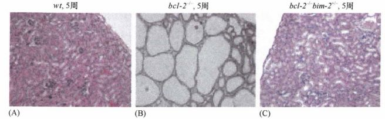

图9-4-3： 凋亡前体蛋白和抗凋亡蛋白之间的精密平衡： (A) 野生型小鼠的肾脏在 5 周龄 时结构完整； ( B ) 抗凋亡 bc l -2 基因的双生殖系拷贝缺失（造成 bc l-2 - /- 表型）导致这个年龄小鼠广泛性的细胞凋亡和多囊性肾病； ( C) 如果凋亡前体 bim 基因的单生殖系拷贝缺失可避免这种情况的出现（高产 bc l -2 -/- bim +/- 表型）

Bcl-2 蛋白家族的促凋亡蛋白和抗凋亡蛋白的作用各不相同，每个成员都有自己的反向作用伴随者。

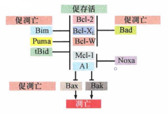

图9-4-4： Bcl-2 蛋白家族的每一个成员都有自己的一套反向作用剂

此外， 这些蛋白质都可以诱导特定细胞类型中的细胞凋亡。例如， Bim 在控制乳腺的发展中起到了关键性的作用 ， 使管腔形成了管道。细胞色素 c 一旦从线粒体逃逸至细胞质，它就与 Apaf-1 蛋白形成一个复合物结构，称为凋亡小体。形成的这个 凋亡 小体复合物活化潜在的细胞质蛋白酶前体 caspase9 （ 半胱天冬酶 9 ）， 使之变成活化的 caspase9 。 小体活化的 caspase9 剪切前体 caspase3 活化另一相关的蛋白酶 ， 接着再切割并活化其他前体 caspase, 形成条链式反应 。 这种剪切的顺序相连形成一种信号级联放大。当胞质的细胞色素 c 活化 caspase 时，另一个与细胞色素 c 一同从线粒体释放出来的蛋白 质 Smac/DIA-BLO 可以失活一组称为 IAP （ inhibitor of apoptosis ） 的抗凋亡蛋白。正常情况下， lAP 以下面两种方式抑制 caspase 的活性：直接结合 和 标记在泛素化 caspase 上并把它降解 。如果没有 I AP 持续抑制的影响， caspase 可以自由地起始蛋白酶水解切割，最终导致凋亡。所以，在线粒体膜通道开放以后，凋亡信号以两种方式活化。细胞色素 c 释放并活化凋亡小体内的 caspase9 。同时，从通道内释放出来的 Smac/DIABLO 失活 IAP, 从而使 caspase 免除 IAP 的抑制。 caspase 的级联活化将会一直进行 ，直到最终导致细胞的程序性死亡。

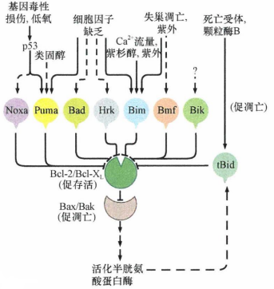

图9-4-5： Bcl-2 样蛋白的多样性是各种各样的细胞生理刺激通过不同的凋亡前体蛋白去对抗抗凋亡蛋白，如 Bcl-2 和 B c l-XL （ 绿色）， 因此阻止 B c l-XL 蛋白中和 Bax 及 Bak （ 浅棕色），它们是一个重要的凋亡前体蛋白 ，能从线粒体膜释放细胞色素 c 。 在凋亡通路下游已激活的 caspase 也可以通过蛋 白 质水解（切割 tBid ） 激活 Bid 促凋亡功能，从而放大凋亡反应

caspase 从功能上分为两类：一类为起始性的 caspase ， 它们是真正的破坏细胞重要组分的实施者。一类为下游执行 caspase ， 掌控了破坏细胞关键组分的工作。一系列重要的细胞组分都被死亡执行性的 caspase, 如 caspase3 、 caspase6 和 caspase7 剪切 。它们的剪切降解引起细胞复杂的形态学转化，这些转化伴随着细胞凋亡而进行。核膜内表面的核纤层蛋白的切割，即和可观测到代表凋亡的染色质凝集和核皱缩（固缩）同时进行。剪切半胱天冬酶活化的脱氧核糖核酸酶的抑制剂（ ICAD ） 能使脱氧核糖核酸酶活化，从而降解染色体 DNA 。剪切细胞骨架蛋白，如肌动蛋 白 、网格蛋白、弹性蛋白和（肌动蛋白）凝溶胶蛋白，能使细胞骨架塌陷，质膜外生性地水泡状生长，形成 “自然死亡”小体。caspase 对它的降解能破坏电子传递链，使 ATP 产生失败，从线粒体中释放活性氧，使线粒体的结构也失去整体性，从而扩增凋亡程序。凋亡多个步骤的有效实施在一定程度上又进一步地增强了 凋亡起始信号。

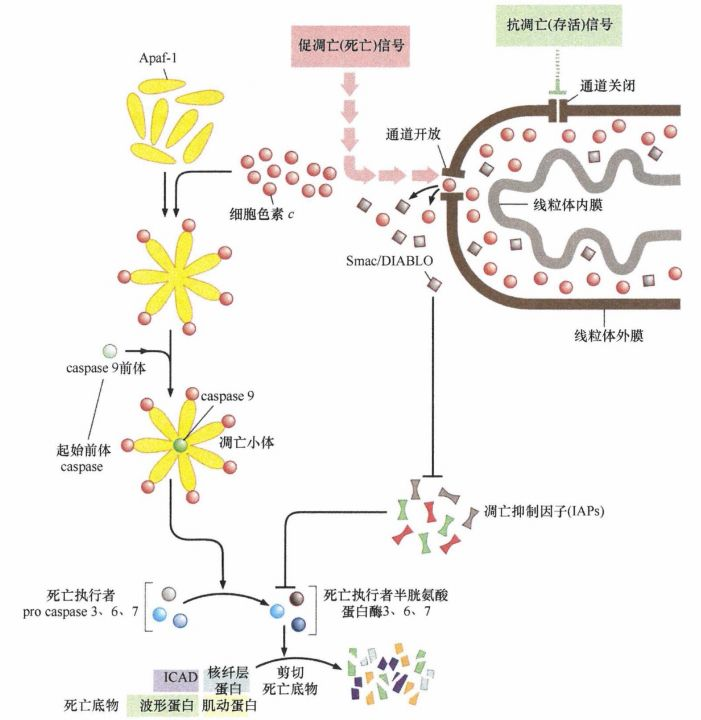

图9-4-6： 凋亡的半胱天冬酶级联反应： 线粒体外膜 （暗褐色）有着决定细胞生存或死亡的关键性的门控通道 。抗凋亡信号控制线粒体外膜通道的关闭，凋亡前体蛋白则使之开启。 释 放入细胞质的重要线粒体分子是细胞色素 c 分子（红球）和 Smac/DIABLO 分子（褐方） 。 细胞色素 c 聚集 Apaf-1 形成一个 7 辐条的轮状 凋亡小体（左） 。凋亡小体能转换活化前体 caspase9 成有活性的 caspase9 （绿环）， caspase9 继续剪切并活化前体 caspase3 、 caspase6 和 caspase7 ，转换成死亡决定性的 caspase, 然后就可以剪切各种底物 ，产生凋亡表型。正常情况下，许多凋亡抑制物（ IAP ） 结合并失活 caspase 。 然而， 同时从线粒体释放出来的 Smac/DIABLO 能对抗这些 IAP ， 从而使 caspase 免除 IAP 的抑制

2、 细胞内外途径均可介导凋亡

前面所述的凋亡程序能在许多信号，如：重要的基因组损伤、缺氧，以及那些细胞内部生长调节信号的不平衡的刺激下使 p53 活化处于凋亡诱导状态， 后者 推动如 Bax 这样的蛋白能开启线粒体膜通道，细胞色素 c 和其他凋亡前体蛋白就能从线粒体释放出来，活化 caspase, 起始凋亡。这一系列的事件有时称为细胞 凋亡的内途径，因为起始信号来自细胞内部。

凋亡也可以通过其他选择性的途径起始。其中之一就是细胞外信号活化凋亡前体细胞的表面受体。细胞表面受体是跨膜蛋白，通常被称为死亡受体，提示它们具有活化凋亡程序的能力。在结合了细胞外间隙的相应配体后，死亡受体能活化细胞质中的半胱天冬酸 级联反应 ，最终和前面所述的内源性 凋亡通路会聚，导致凋亡的发生，这种受体所引起的凋亡称为外源性凋亡程序或受体活化凋亡途径。

表9-4-2： 死亡受体和它们的配体

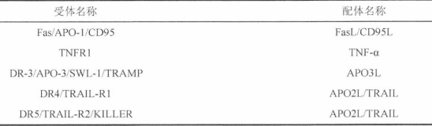

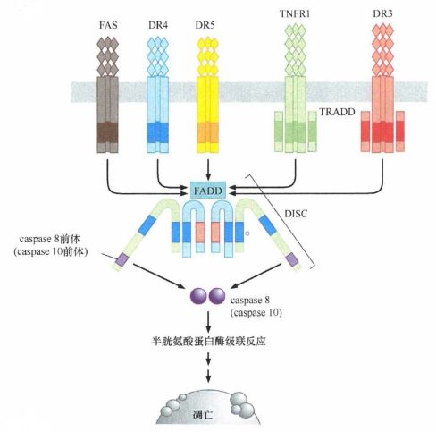

图9-4-7： 不同类型哺乳动物细胞表面有 5 个不同死 亡受体家族

死亡受体的配体是肿瘤坏死因子 (TNF) 家族成员，包括 TNF-a 、 TRAIL 和 Fas 死亡受体的配体 （ FasL ） 。每个 TNF 样蛋 白与它们的相应受体结合， 这个受体家族的许多成员之中大约有 30 个由人类基因组编码，有一个共同的胞浆死亡结构域。这些受体和它们的行为因为受体和配体名称的多样性而变得复杂 ，一旦被配体的结合所活化， 这些受体的死亡结构域能结合并活化细胞质中称为 FADD 的蛋 白质。 形成的复合物称为 DISC ， 能聚非活化的、酶原形式的 caspase8, 少数情况下是 caspase 10 , 它们都是起始性的 caspase 。 caspase8 和 caspase 10 活化执行死亡的 caspase3 、 caspase6 和 caspae7, 最后和内途径凋亡程序殊途同归。

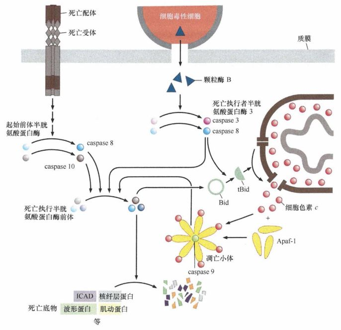

图9-4-8： 凋亡内途径与外途径汇聚： 在死亡受体把前体 caspase8 和（或） caspase 10 活化成

相应的 caspase 后，后者通过切割和活化执行 caspase 和内源性 凋亡级联反应的汇聚

实际上，还存在着凋亡的第三条途径， 此途径由杀伤靶细胞的细胞毒性 T 淋巴细胞和自然杀伤 (NK) 细胞起始 。 这两种杀伤细胞能够活化靶细胞表面表达的死亡受体，如 Fas 。另外，杀伤性细胞能结合在靶细胞表面，并注入一种被称为颗粒酶 B 的蛋白，颗粒酶一旦受制于这些杀伤细胞 ， 就能切割并活化酶原 caspase3 和 caspase8 ， 和前面所描述的途径相汇聚，继续作用而引起凋亡。

3 、 癌细胞抵抗凋亡

细胞在形成肿瘤的漫长过程中会遇到许多生理应激因子威胁它们的存在，每个生理应激因子都能诱导凋亡。事实上，所有的癌细胞都有抗凋亡的战略机制。

小部分人类肿瘤过表达 Mdm2 ， 这些影响 ARF 或 Mdm2 表达的机制都会降低细胞内 p53 蛋白的水平。最终 ， 在许多人类肿瘤细胞中， p53 就会错误定位 ，沉默于细胞质中。

另外一个对抗凋亡高度有效的机制来自 PI3K - Akt/PKB 通路的过度活化 。 这条通路的活化来自酪氨酸激酶受体和 Ras 癌蛋白的联合作用 ， 它们都能活化 Pl3K 使 PIP3 的水平升高，活 化 Akt/PKB 。一旦 Akt/PKB 被聚集的 PIP3 活化，它就能磷酸化并抑制促凋亡蛋白，同时磷酸化并活化 Mdm2 。

另一个逃避凋亡的机制在儿童 成神经细胞瘤中表现得很明显， N-myc 基因的扩增表明了肿瘤的攻击性生长和预期寿命的缩短。对于它本身来说，这种扩增确实威胁到神经母细胞瘤细胞的增殖，如前由所述， myc 癌基因的行为是一把双刃剑。这些编 码 癌蛋白的基因释放潜在的有丝分裂信号，但同时又强烈地促凋亡。许多神经母细胞瘤细胞通过基因扩增过表达 N-myc ，看 起来解决了这个问题，至 少一部分通过甲基化或缺失失活 caspase8 编码基因。

外途径细胞凋亡诱导通路常与癌细胞发展相关。事实证明在有些肿瘤细胞中，此通路常是失活的。有些癌细胞表达 FLIP (FLICE- 抑制蛋 白），一种通过结合死亡受体的死亡结构域而介导外源性途径凋亡级联反应活化的蛋白质，从而阻断这个反应过程和阻止 起始 caspase8 的自我催化活化。其他肿瘤细胞通过甲基化 TNFR 1 编码基因的启动子 ，从而抑制 TNF 受体的表达。

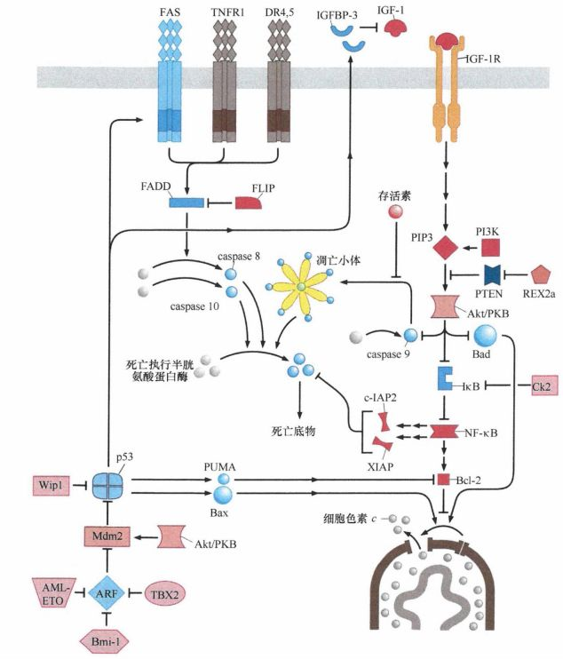

图9-4-9： 癌细胞抗凋亡机制：癌细胞能以各种逃离方式减少凋亡发生的可能性。在不同的癌细胞中，重要的促凋亡蛋白的表达水平和活性下降（蓝色）；某些抗凋亡蛋白的活性和表达水平则上升（红色）

癌细胞运用的这些策略机制清楚地说明了它们能通过失活凋亡的外源性途径从而得以存活。这也相应地说明了，免疫细胞经常包围癌细胞， 并试图通过释放 TNF 样因子和引起的外途径 凋亡程序来杀死它们。看到这么复杂的调节凋亡的连线图，不难推测，还有很多其他的抗凋亡机制是我们未知的。

参考书目： 《The Biology of Cancer》（Second Edition）  R.A.Weinberg  著，詹启敏 等  译

编辑：周健 张月明 游丹铭

校审：张健 罗鹏

