# 第二章 《癌生物学》第二章（1）肿瘤的起源【学习分享】

“正常细胞严格按照设计好的程序去参与构建不同的组织，从而使机体生存下来。而肿瘤细胞却展现出一种截然不同、 目标更加集中的任务，它们好像只考虑一件事情：尽可能地自我繁殖。”本章节，我们将初步探讨癌症的本质，帮助我们从本质上去揭示复杂的肿瘤领域。
 

 
***01***
 
**肿瘤的起源**
 
19 世纪中晚期的发现使我们了解到一个受精卵是如何发育成为组织和复杂器官的。这其中最重要的发现莫过于：受精卵能够通过不断地生长与分裂来产生机体中的所有细胞。
 
这些认识对肿瘤起源的研究产生了深远的影响。之前，许多人认为肿瘤是一种通过某种方式植入患者体内的异物。如今， 大量事实表明，各种不同类型的肿瘤常常都是源于它们各自起源的自身正常组织，而不是外界的入侵体。
 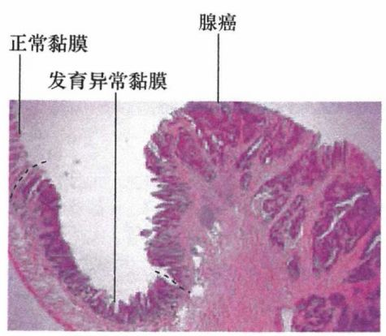 
图1：低倍镜下的小肠回肠段上皮组织切片
 

 
事实上，肿瘤确实有在体内迁徙的能力：在许多患者体内，多种肿瘤都能在距其原发组织很远的地方检测到转移灶，因为癌细胞能在体内扩散并且形成新的癌细胞克隆。这些新克隆，即转移灶，都可被溯源到肿瘤发生的最初部位，即原发肿瘤。
 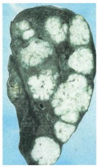 
图2：晚期结肠癌患者常常发生肝转移（白色部分）
 

 
相对于周围正常组织，肿瘤组织结构的排列要混乱无序得多。肿瘤是由一群失去了组成正常组织能力的细胞构成的。微观结构上，肿瘤组织与正常组织差异巨大，但它们在组织学上仍然存在某些相似之处。因此，理论上讲所有肿瘤都应该能追溯到其发源的特定组织或器官，我们可以通过对肿瘤切片进行组织病理学分析来为此提供关键线索。这个简单的想法为肿瘤的分类提供了新方法，即根据可能的源发组织进行分类。
 

 

 
***02***
 
**肿瘤的分类**
 
根据肿瘤组织来源（上皮、间叶、造血和神经外胚层），可以将肿瘤分为四类。 

 
**上皮组织来源的肿瘤** 

 
人类大多数肿瘤来源于上皮组织。上皮细胞是构成体腔、管道和表皮的规则排列的层状细胞，如皮肤是作为机体的外覆层。在上皮细胞之下是基底膜（有时也称基底层），基底膜则把上皮细胞 与下面起支持连接作用的间质层细胞分隔开。基底膜是细胞外基质 （ECM) 的一种特殊形式，主要由上皮细胞分泌的蛋白质构成。
 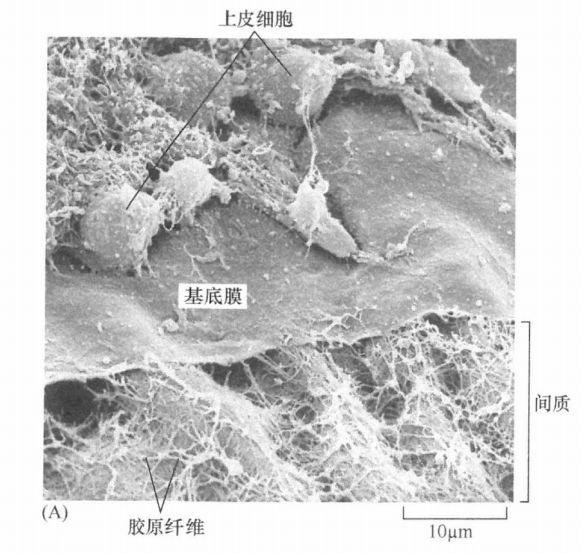 
图3：鸡角膜上皮电镜扫描图
 

 
为什么我们对上皮细胞如此感兴趣呢，因为它产生了人类最常见的恶性肿瘤，称为癌。
 
一些上皮细胞层的主要作用是封闭腔穴或管道的表面并且保护其下层细胞。这种上皮细胞发展而来的癌称为鳞状细胞癌。例如，覆盖皮肤和大部分口腔的上皮细胞会发生这类肿瘤。
 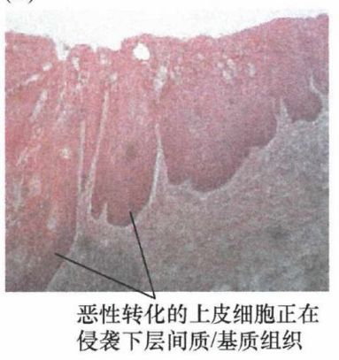 
图4：食管癌
 

 
还有许多上皮组织中存在特殊的具有分泌能力的细胞，它们可以释放分泌物到自身形成的导管或腔穴中。通常这些分泌物的作用是保护上皮细胞层不受腔穴内物质的作用。这种细胞来源的肿瘤称为腺癌。
 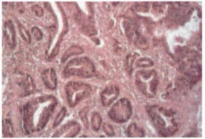 
图5：胃腺癌
 

 
在某些器官，如肺、子宫、子宫颈中，上皮细胞层能够发展为单纯的腺癌或鳞状细胞癌；而在更多的情况下，这些器官来源的肿瘤会包含这两种类型的癌细胞。
 

 
**肉瘤** 

 
肉瘤来源于多种间质细胞，包括：分泌胶原的成纤维细胞及其相关结缔组织细胞，它们是肌腱和皮肤的细胞外基质的主要组分；脂肪细胞，它们在胞质中储藏脂肪；成骨细胞，在胶原基质中聚集磷酸钙结品以形成骨骼；还有组成肌肉的肌细胞。相对多见于儿童的血管肉瘤是由血管内皮细胞的前体细胞产生的。
 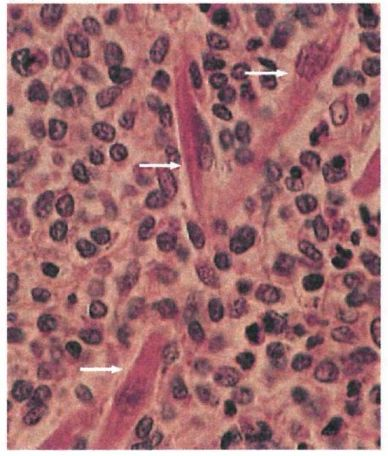 
图6：横纹肌肉瘤
 

 
**造血系统恶性肿瘤** 

 
造血系统恶性肿瘤由各种组成造血系统的细胞转化而来，包括免疫系统的细胞，如：红细胞、 能分泌抗体的浆细胞、T淋巴细胞（简称T细胞）和B淋巴细胞（简称 B 细胞）。白血病泛指造血细胞谱系的恶性衍生物，它们不同于红细胞 ，胞内没有细胞色素，而且 能够自由地穿行于循环系统中。白血病的肿瘤细胞是散布在循环系统中的单细胞群，而淋巴系（T淋巴细胞和B淋巴细胞）肿瘤则能够聚集在淋巴结形成实体瘤。
 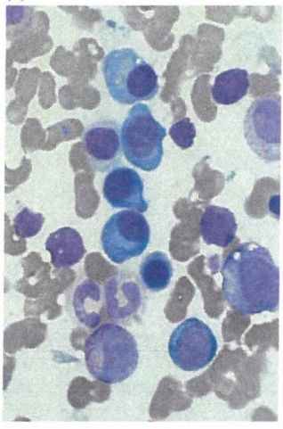 
图7：多发性骨髓瘤
 

 
**神经外胚层瘤**
 
最后一大类肿瘤，是由构成中枢和外周神经系统的各种细胞恶性转化而致。这类肿瘤通常被称为神经外胚层瘤 ，反映其是从早期胚胎的外胚层发育而来，包括胶质瘤、胶质母细胞瘤、神经母细胞瘤、神经鞘瘤和髓母细胞瘤。
 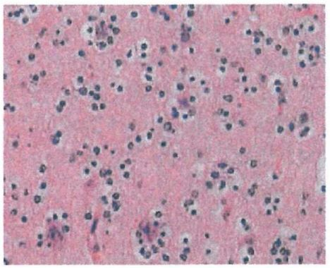 
图8：少突胶质细胞瘤
 

 
**不适于上述分类的肿瘤** 

 
黑色素瘤来源于皮肤和视网膜中内含色素的黑色素细胞，而黑色素细胞则是由胚胎中的神经脊发育而来。尽管与神经外胚层细胞的发源地如此接近，但随着发育过程，它却最终落脚在了皮肤和眼睛的组织中，为其提供色素，而与神经系统没有任何直接联系。
 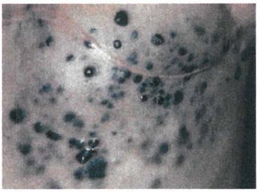 
图9：黑色素瘤
 

 
小细胞肺癌（SCLC) 中有许多具有类似于神经分泌细胞特征的细胞 ，就像肾上腺中的某些神经脊来源的细胞一样，具有分泌功能。迄今为止还未确定小细胞肺癌是否起源于神经外胚层细胞。而另一种看法认为， 这些源于肺部内胚层细胞克隆的肿瘤 ，失去了一些自身上皮细胞的特征，同时又呈现出了一些神经外胚层细胞谱系的特征。这种细胞谱系的转换和随之而获得的一套全新的已分化成熟的特性，通常被称为转分化作用。
 
畸胎瘤是由于生殖细胞（卵细胞和精子）前体在发育早期未能迁移到正确的位置，并在发育过程中一直处于异位所致。它们保留了早期胚胎细胞的多能性。 同一个畸胎瘤中能看到组成胚胎的 3 个胚层——内胚层、中胚层、外胚层。 

 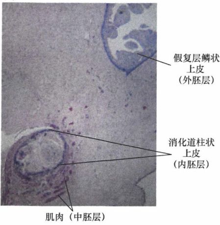 
图10：畸胎瘤
 

 
在少数情况下 (2%~4%), 某些肿瘤已经完全丧失了其发源组织的特异性和分化特征，发生了去分化作用。发生去分化的这类肿瘤通常被归入 “未知原发灶癌 " (CUP), 很难从患者身上找到相应的原发肿瘤的部位。
 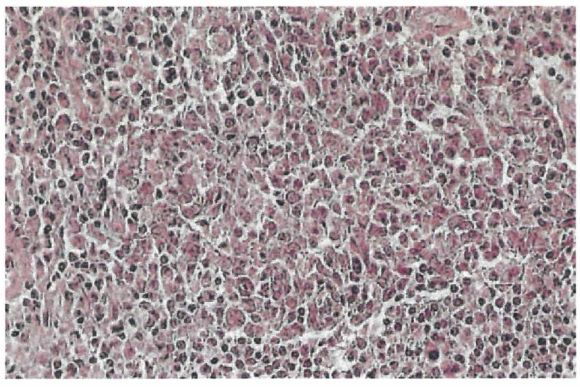 
图11：起源不明的间变肿瘤
 

 
本节主要介绍了肿瘤的起源，下一小节我们将进一步介绍肿瘤的发展和能量代谢特征，下期再见！
 

 
参考书目：《The Biology of Cancer》（Second Edition）  R.A.Weinberg  著，詹启敏 等  译
 
编辑：张月明 周健
 
校审：张健 罗鹏
 

 
往期回顾： 

 
[《癌生物学》第一章（1） 孟德尔遗传定律和达尔文进化论【学习分享】](http://mp.weixin.qq.com/s?__biz=Mzg4NjA5Mzg2Mw==&mid=2247484461&idx=1&sn=72104e0b83f7cd500a142fed89d7ffc9&chksm=cf9fa565f8e82c7325ebf03f8f78af60e9e32f486ace8774fef71b186b956f131f683a66fc4f&scene=21#wechat_redirect)
 
[《癌生物学》第一章（2） 基因如何决定表型【学习分享】](http://mp.weixin.qq.com/s?__biz=Mzg4NjA5Mzg2Mw==&mid=2247484557&idx=1&sn=422338d2f6c79f9201ac4c4a57952b76&chksm=cf9fa5c5f8e82cd3a2f6d399f262668bd5dabd51917c601e6e603f521faa4e723a27be245d47&scene=21#wechat_redirect)
 
[《癌生物学》第一章（3） 基因表达的调控【学习分享】](http://mp.weixin.qq.com/s?__biz=Mzg4NjA5Mzg2Mw==&mid=2247484667&idx=1&sn=f5ac0e9f91f4017af882b9793999b14a&chksm=cf9fa5b3f8e82ca50cbd101947d2b381aa94f44c40eafc3007915592d95d8f1b8f7ce0718a36&scene=21#wechat_redirect)
 

 

 

 

 
*** 欢迎点击下方图片进行留言，说出你的看法哦~** ***** ****
 

 
