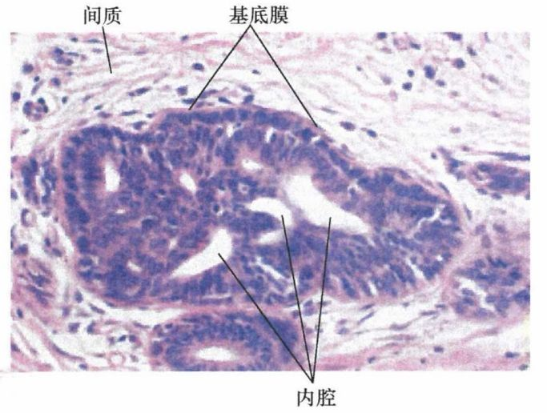
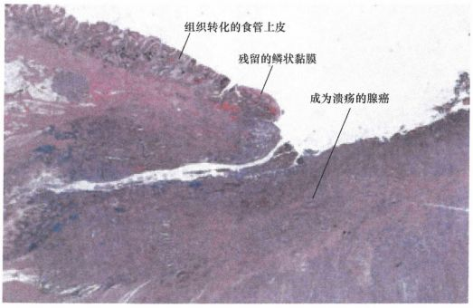
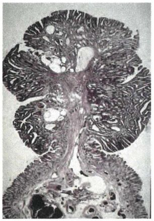
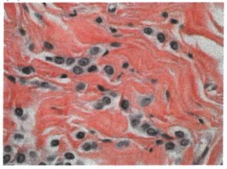
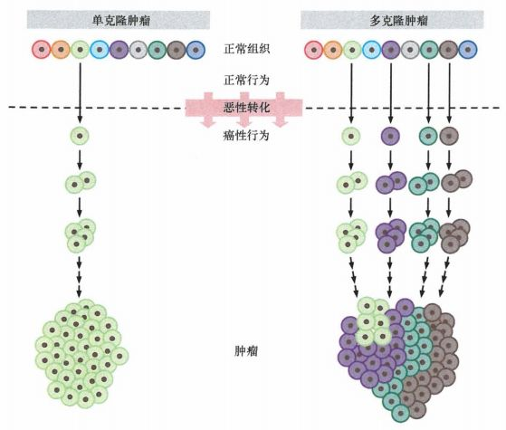
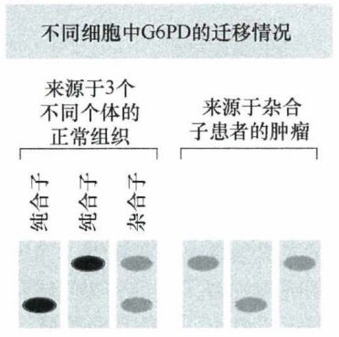
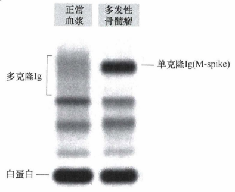
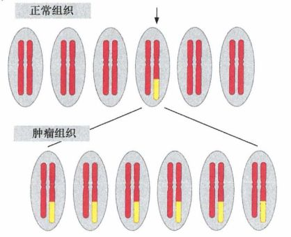
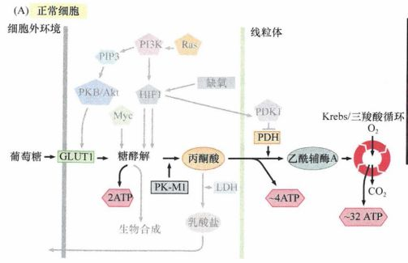
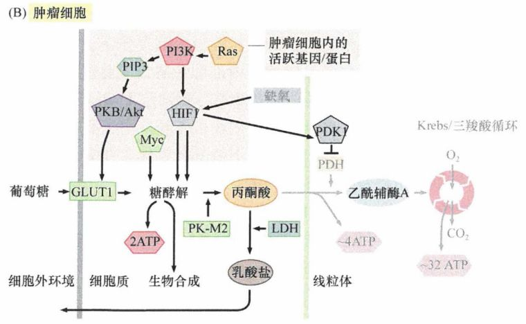

# 第二章 《癌生物学》第二章（2）癌症的发展及其能量代谢【学习分享】

**在开始这节的学习之前，小编先唠唠嗑~**
 
上周刚抽完获得《白话统计学》的5位幸运儿，粉丝们有木有觉得意犹未尽呢？今天，小编要在这里再次宣布一个好消息：我们今天要抽取的奖品是 本专题 —— **《癌生物学》** 的正版书籍！ 但是~抽奖方式有一点点不一样哦~ 这次咱们的抽奖“不看天命”啦，而是需要各位“各显神通”哦：点击 **关注“珠江肿瘤”** ，点击文章最后的留言区进行 **留言** ， **点赞次数最多** 的 **2位** 幸运儿即可 获得 **《癌生物学》** 的正版书籍！ Ps：我们还会在接下来的推送中不定期举行抽奖活动，总有一本属于你~
 

 
**接下来开始本节的学习啦~**
 

 
“肿瘤以一种独特又令人恐惧的方式摧毁一个人，像人机体自身一样但变得高度增殖，疯狂蔓延，掠夺营养，并且不受控制。”肿瘤虽然增殖迅速，但其发展历程也是有迹可循的，本节将主要介绍肿瘤的发展和能量代谢特征。 

 

 
***01***
 
**肿瘤是多阶段多步骤发展形成的**
 
在正常组织和高度恶化的肿瘤组织两个极端之间，机体组织形态还存在着丰富的中间过渡状态。这些处于不同异常阶段的细胞，反映了细胞逐步从正常组织过渡到越来越具有侵袭和转移能力的恶化状态的过程。
 
增生 

 
有一些特殊的细胞肿块，它们与正常组织之间只有微小的差别，但是在细胞数量上异常增多，这种肿块称为增生。虽然形成增生组织的细胞的增殖明显不受控制，但其发育成为组织的能力与正常细胞别无二致。
 

 
图1：增生的乳腺导管
 

 
化生
 
化生是指一种已分化组织转变为另一种分化组织的过程。该过程并非由已分化的细胞直接转变为另一种细胞，而是由具有分裂能力的未分化细胞向另一方向分化而成。这些细胞虽然生长在了错误的位置，但在镜检下往往表现得与正常细胞无异。化生常常发生在上皮组织的过渡带中，多见于子宫与子宫颈及食管与胃的连接处。在上述两个连接处，扁平上皮细胞往往会急剧地转变成分泌黏液型上皮细胞。
 
食管癌变前的一个早期指征就是出现一种巴氏食管 (Barrett's esophagus) 化生情况，食管中的扁平上皮细胞会被一种常见于胃部的分泌型上皮细胞取代。尽管这些细胞具有非常正常的外观 ，但这种化生通常被认为是食管癌的早期病变步骤。
  
图2：上皮细胞的化生
 

 
不典型增生
 
比化生更为异常的组织称为不典型增生。这类组织的改变包括细胞核大小和形状改变，细胞核染色加深，核质比例增大，核分裂能力增强，以及与组织中正常分化相关的胞质特征丢失。在不典型增生组织中， 原见于正常组织的不同类型细胞的数量比例都发生了改变。不典型增生是完全良性肿瘤至恶性癌变之间的过渡状态。
 
腺瘤（腺瘤、息肉、乳头状瘤和疣）是不典型增生的上皮瘤。在显微镜下观察 ，腺瘤中的组织是不典型增生的，它们通常长到一定大小便停止生长，并且绝不穿过基底膜，所以与基底膜下方的上皮组织仍然是隔开的。正是由于这一点，一般认为它们是良性的。
  
图3：息肉显微切片照
 

 
恶性肿瘤
 
突破基底膜并且侵及下层组织的肿瘤属于恶性肿瘤。更进一步的异常是肿瘤扩散至体内其他部位，即形成了转移瘤。转移不仅有侵袭突破基底膜的能力，而且获得了运动和适应周围新环境的特性。
 
原发灶肿瘤细胞能通过循环系统转移到机体远处而形成新的癌细胞克隆。癌细胞侵袭到邻近的组织中，进入血管和淋巴管，通过这些管道迁徙到身体远端，并再次突破血管或淋巴管，侵入下层组织，在此处形成新的癌细胞克隆。
  
图4：侵袭性乳腺小叶癌
 

 
以上列出的各种异常生长形式代表了不断恶化的组织异常程度，它们似乎是恶性肿瘤进展过程中的停顿点，在该过程中正常组织逐渐发展为高度恶化的癌组织。
 

 
***02***
 
**肿瘤由单克隆发育而来**
 
我们已经知道肿瘤是从正常细胞逐步转化而来的，接下来需要思考的是：肿瘤是由单个的细胞跨越了从正常到异常的界限发育而来的呢，还是有一大群细胞历经这种改变，然后每一个都发展成了肿瘤中的单个细胞亚群呢？
 
理论上，肿瘤可以起源于单克隆，或者多克隆。随机出现的体细胞突变可以视为细胞的独特标记，如果这种标记出现在肿瘤块中所有的细胞里，就可以说此肿瘤块中所有细胞都起源于同一个突变的细胞。这种起源于单个祖先的细胞克隆，称为是单克隆性的。同样地，如果肿块是由一系列具有不同遗传学特征的细胞亚群构成的，而这些细胞之间并不存在共同的祖先，那么该肿块就被称为是多克隆性的。
  
图5：肿瘤的单克隆性和多克隆性
 

 
确定肿瘤细胞群体克隆性的第一个实验，依赖于胞内天然存在的、表观遗传学的标记物。如第1章所述，在雌性哺乳动物早期胚胎的体细胞中，每个细胞内的两条X染色体会随机地发生失活现象，只保留其中一条。该失活染色体 上几乎全部基因的转录都被抑制。一旦胚胎细胞中发生了某条X染色体（来自于母方或者父方）失活，由此胚胎细胞发育而来的全部成熟组织细胞就都将与其祖先保持一致，细胞中相同的X染色体均失活。
 
葡萄糖-6-磷酸脱氢酶 (G6PD) 的基因就在X染色体上。由于 X 染色体失活，杂合体女性的每一个细胞都只表达两个G6PD等位基因的其中一条，从而在胞内合成不同的G6PD蛋白。在杂合个体的大多数组织里，约有半数的细胞合成其中一种形式的G6PD, 另外半数细胞合成另一种形式的酶。1965 年曾经报道了对非裔美国人杂合体中发生的平滑肌瘤（位于子宫壁的良性肿瘤）的观测结果，每一个平滑肌瘤总是只表达G6PD两种可变形式中的其中一种。这说明很有可能此肿瘤所有细胞都来源于一个共同的祖细胞。
  
图6：用淀粉凝胶电泳对两种类型的 G6PD 进行分析，结果显示 G6PD 杂合体肿瘤患者的所有肿瘤细胞都表达该酶两种形式中的一种。
 

 
另外一个证据来自于对骨髓瘤的研究，骨髓瘤主要是源自能分泌抗体的浆细胞的母细胞 B 淋巴细胞。通常情况下，B 淋巴细胞库是由数量极多的、区别明显的亚群构成，经过免疫球蛋白（抗体）基因的重排作用，每一个亚群细胞都分泌一种特异性的抗体。与之相比，骨髓瘤患者的浆细胞产生相同的抗体，提示它们是从之前的复杂异质群体细胞中的某一单个细胞发育而来的，具有共同的祖细胞。
  
图7：多发性骨髓瘤中的单一类型抗体
 

 
关于肿瘤单克隆性质的最有力证据来自于对癌细胞染色体的观察。在有丝分裂中期染色体凝集的时候，显微镜下可见肿瘤细胞染色体有一系列异常畸变。通常由一个小概率的遗传学事件所引发的特异的染色体异常，在同一瘤体中所有细胞中都能看到。这表明，同一瘤体中所有恶性细胞都来源于同一个祖细胞，当此祖细胞染色体发生重组后，这种变化也都遗传到其所有子代细胞。
  
图8：肿瘤组织中的染色体易位
 

 
每一个祖细胞都能发育成一个单克隆群 体。 可以设想，在一种组织中 10 个正常细胞同时从正常状态向恶性状态（或至少前恶性状态）转化， 10 个祖细胞连同它们的子细胞都不受控制地异常增殖 ， 每一个祖细胞都能发育成一个单克隆群体， 总 体来看，由这10种细胞群体构成的肿瘤就是多克隆性的了。如果一个克隆具有比别的克隆稍微短一点的倍增时间，那么迟早它会长得大于其他所有克隆，这一克隆也会不断地扩增以致在整个肿瘤块中占据主导地位，使这个肿瘤看起来像一个单克隆群体。实际上，许多肿瘤的发生发展都需要很漫长的过程，这就为肿瘤块中某一单克隆群体发展成为优势群体提供了充裕的时间。因此，一个大瘤体表现出的单克隆性质，并不能严谨地证明肿瘤在最初发展时期也是单克隆性的。
 
以上这些容易发生误判的事实使我们对肿瘤的单克隆起源的判断变得更加复杂和困难。但一个已经广泛被认可的事实是，大多数人类肿瘤都是单克隆群体，即从单个的祖细胞开始逐步走向恶性转化。这些祖细胞通常被称为起源细胞。
 

 
***03***
 
**肿瘤细胞的能量代谢特征**
 
大多数肿瘤细胞的能量代谢与正常细胞相比呈现出巨大的差异性。1924年 Otto Warburg 首先报道了这一现象。正常细胞在胞质中有氧条件下能通过有氧氧化途径将葡萄糖分解成丙酮酸，随后丙酮酸被输送到线粒体，进一步分解为二氧化碳，此即三羧酸循环。在厌氧或者缺氧条件下，正常细胞的三羧酸循环被限制，丙酮酸只能被还原为乳酸，分泌到胞外。Warburg 发现许多类型的肿瘤细胞即使暴露在有充足氧气的环境中，它们的葡萄糖利用途径也还是最终产生乳酸。
  
图9：正常细胞的能量代谢
 

 
肿瘤细胞的有氧糖酵解，又称为 Warburg 效应，其每分解一个葡萄糖分子只能得到两个 ATP 分子，在能量学上显得很不经济。因为在三羧酸循环中有氧分子参与的情况下，一个葡萄糖分子能提供 36 个 ATP 分子。由于肿瘤细胞使用的是一种很不经济的糖代谢方式，因此它们需要大量的葡萄糖进入胞内进行分解。它们表达葡萄糖转运蛋白，如 GLUTl 等，以便能跨膜转运大量葡萄糖。放射生物学家利用这种特性，在循环系统中注入有同素标记的 18-氟-2-脱氧-2-氟-D-葡萄糖 [2-deoxy-2-(18F)fluoro-D-glucose, FOG] 后 ，能观察到其在肿瘤细胞中快速聚集。
  
图10：肿瘤细胞的能量代谢
 

 
有关有氧糖酵解的一个解释是肿瘤块内部的肿瘤细胞通常都呈现缺氧的状态。这种缺氧状态导致细胞不能进行充分的有氧氧化进而提供充足的 ATP。而 Warburg 效应使肿瘤细胞很好地适应了这种缺氧环境，但这依然不能解释为什么在提供充足氧气的条件下，肿瘤细胞依然不加以利用 以合成更多的 ATP。
 
关于有氧糖酵解另一个合理的解释是，除了产生 ATP, 糖酵解还有第二个作用：糖酵解途径的中间产物可以作为很多涉及细胞生长，如核酸和脂类的合成，的分子的前体。肿瘤细胞通过糖酵解途径的负反馈机制，阻断糖酵解途径的最后一步，使细胞内积累了大量早期中间代谢物。这些中间产物能参与许多重要的生化合成反应。较肿瘤细胞而言，正常细胞没有那么强的增殖活性，也不需要大规模的生化合成反应，葡萄糖主要用来产生 ATP 以维持其正常代谢。
 
那么肿瘤细胞是如何精确调控，使其绕过线粒体糖代谢过程的呢？丙酮酸激酶 (PK) 催化糖酵解的最后一 步将磷酸烯醇丙酮酸 (PEP) 催化为丙酮酸。丙酮酸激酶的 M1 亚型在大多数成体组织中特异表达，而 M2 亚型则在早期胚胎细胞、快速生长的正常细胞和肿瘤细胞中表达。PK 的 M1 亚型调控丙酮酸由细胞质运送到线粒体，而在肿瘤细胞内表达的 M2 亚型则调控丙酮酸在细胞质内分解为乳酸。与 M1亚型相比，M2 亚型催化酶的催化效率非常低，这就导致了糖酵解中间产物大量聚集，并参与到其他生化合成通路中。另外，肿瘤细胞中三羧酸循环的相对失活并非由线粒体的缺陷所致：它们在肿瘤细胞中正常存在，而且完全有能力接收丙酮酸并使其进入三羧酸循环。
 
肿瘤细胞的生长依赖于 PK 的 M2 亚型的存在，同时也依赖于较高水平表达的葡萄糖转运蛋白 GLUT1 和乳酸脱氢酶 A (LOH-A), 后者将丙酮酸分解为乳酸，再分泌出胞外。以上三者中任意一个受到抑制，肿瘤的生长速度就会减慢。
 

 
我是彩蛋
 
结束这一小节的学习，还不快快 **关注“珠江肿瘤”** ， 点击文章下方的留言区进行 **留言** ， **点赞次数最多** 的 **2位** 幸运儿即可 获得 **《癌生物学》** 的正版书籍！ Ps：我们还会在接下来的推送中不定期举行抽奖活动，总有一本属于你~
 
参考书目：《The Biology of Cancer》（Second Edition）  R.A.Weinberg  著，詹启敏 等  译 

 
编辑：张月明 周健
 
校审：张健 罗鹏
 

 
往期回顾：
 
[《癌生物学》第一章（1） 孟德尔遗传定律和达尔文进化论【学习分享】](http://mp.weixin.qq.com/s?__biz=Mzg4NjA5Mzg2Mw==&mid=2247484461&idx=1&sn=72104e0b83f7cd500a142fed89d7ffc9&chksm=cf9fa565f8e82c7325ebf03f8f78af60e9e32f486ace8774fef71b186b956f131f683a66fc4f&scene=21#wechat_redirect)
 
[《癌生物学》第一章（2） 基因如何决定表型【学习分享】](http://mp.weixin.qq.com/s?__biz=Mzg4NjA5Mzg2Mw==&mid=2247484557&idx=1&sn=422338d2f6c79f9201ac4c4a57952b76&chksm=cf9fa5c5f8e82cd3a2f6d399f262668bd5dabd51917c601e6e603f521faa4e723a27be245d47&scene=21#wechat_redirect)
 
[《癌生物学》第一章（3） 基因表达的调控【学习分享】](http://mp.weixin.qq.com/s?__biz=Mzg4NjA5Mzg2Mw==&mid=2247484667&idx=1&sn=f5ac0e9f91f4017af882b9793999b14a&chksm=cf9fa5b3f8e82ca50cbd101947d2b381aa94f44c40eafc3007915592d95d8f1b8f7ce0718a36&scene=21#wechat_redirect)
 
[《癌生物学》第二章（1） 癌症的起源【学习分享】](http://mp.weixin.qq.com/s?__biz=Mzg4NjA5Mzg2Mw==&mid=2247484770&idx=1&sn=a5144114b3d342408140b8c9ee234d92&chksm=cf9fa42af8e82d3c26681af84e26b7c6361e1275bfdce2edce2c4a3065871c1ce97f0649d3e4&scene=21#wechat_redirect)
 

 

 
*** 欢迎点击下方图片进行留言，说出你的看法哦~***
 
