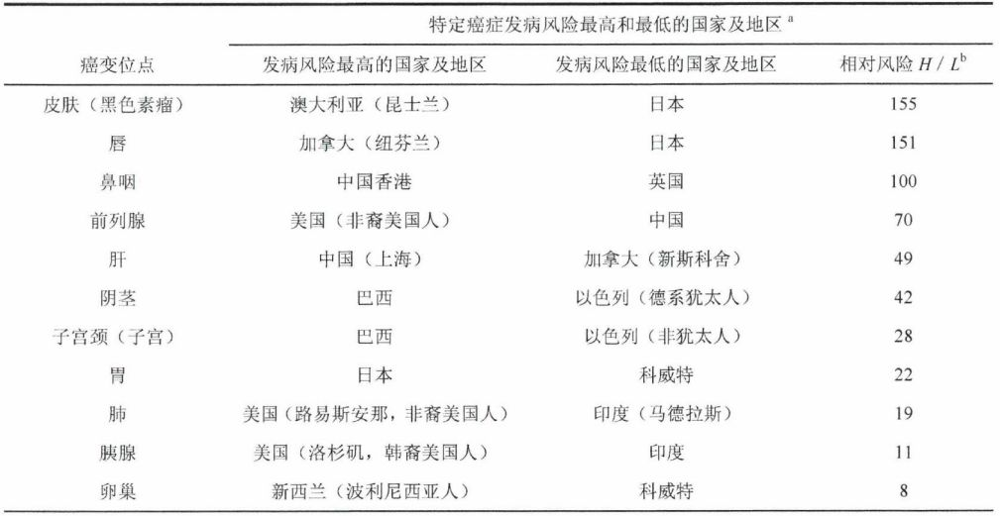
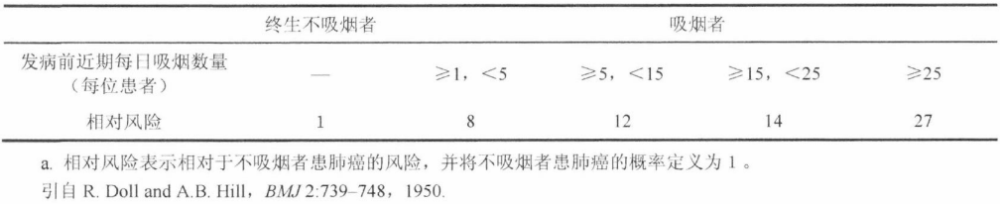
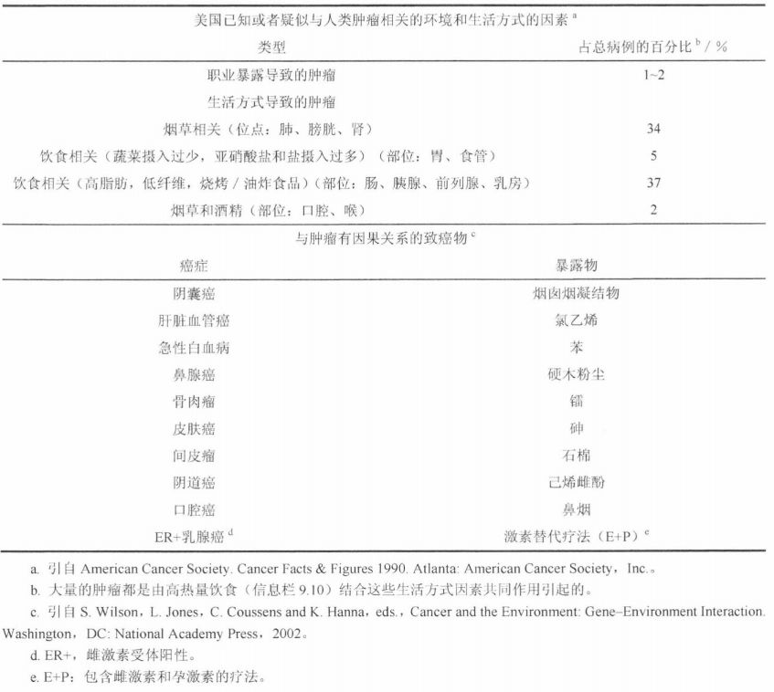
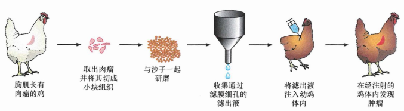
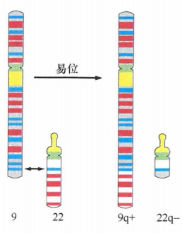
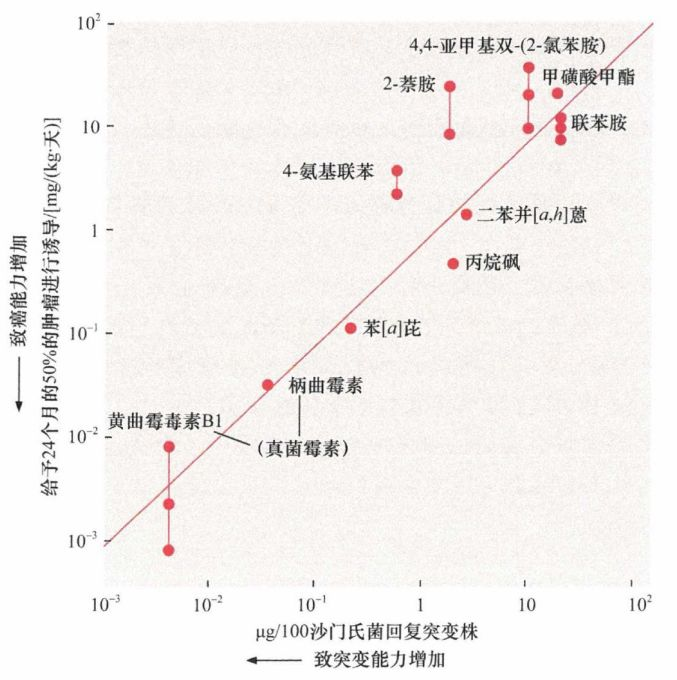

# 第二章 《癌生物学》第二章（3）癌症的诱因【学习分享】

**往期回顾**
 
[《癌生物学》第一章（1） 孟德尔遗传定律和达尔文进化论【学习分享】](http://mp.weixin.qq.com/s?__biz=Mzg4NjA5Mzg2Mw==&mid=2247484461&idx=1&sn=72104e0b83f7cd500a142fed89d7ffc9&chksm=cf9fa565f8e82c7325ebf03f8f78af60e9e32f486ace8774fef71b186b956f131f683a66fc4f&scene=21#wechat_redirect)
 
[《癌生物学》第一章（2） 基因如何决定表型【学习分享】](http://mp.weixin.qq.com/s?__biz=Mzg4NjA5Mzg2Mw==&mid=2247484557&idx=1&sn=422338d2f6c79f9201ac4c4a57952b76&chksm=cf9fa5c5f8e82cd3a2f6d399f262668bd5dabd51917c601e6e603f521faa4e723a27be245d47&scene=21#wechat_redirect)
 
[《癌生物学》第一章（3） 基因表达的调控【学习分享】](http://mp.weixin.qq.com/s?__biz=Mzg4NjA5Mzg2Mw==&mid=2247484667&idx=1&sn=f5ac0e9f91f4017af882b9793999b14a&chksm=cf9fa5b3f8e82ca50cbd101947d2b381aa94f44c40eafc3007915592d95d8f1b8f7ce0718a36&scene=21#wechat_redirect)
 
[《癌生物学》第二章（1） 癌症的起源【学习分享】](http://mp.weixin.qq.com/s?__biz=Mzg4NjA5Mzg2Mw==&mid=2247484770&idx=1&sn=a5144114b3d342408140b8c9ee234d92&chksm=cf9fa42af8e82d3c26681af84e26b7c6361e1275bfdce2edce2c4a3065871c1ce97f0649d3e4&scene=21#wechat_redirect)
 
[《癌生物学》第二章（2） 癌症的发展及其能量代谢【学习分享】](http://mp.weixin.qq.com/s?__biz=Mzg4NjA5Mzg2Mw==&mid=2247484805&idx=1&sn=e97e67056c1d508092127d0388c2eaf6&chksm=cf9fa4cdf8e82ddbaaabda6a2d17d32ec4ab3b7809b97006c79a707f93e35738a7216ba03b4e&scene=21#wechat_redirect)
 
****前言：** 
**
 
**上期我们举行了第一次的《癌生物学》赠书活动，不知道现在在看的你有没有到留言区留言参加活动呢？这期我们就要公布得奖的2位幸运儿啦！先不要着急，得奖名单在文章最后呢~现在先开始本章最后一小节的学习吧~**
 
每一个正常的生物学过程（如持续地细胞分裂）都有致癌的风险。每次经过复杂的细胞生长和分裂过程产生新的细胞，期间有很多容易出错的地方。因此，细胞有一定的几率发生灾难性事件，包括无意中形成肿瘤细胞。如果仅仅是因为这个原因，那么世界上的人群应该有相似的发生肿瘤的概率。然而，根据世界各地临床诊断的结果和发病率来看，一些 癌症在世界范 围内 的 确有 相似的发病率 , 而另一些 癌症发病率差异显著 。所以不能认为所有癌症在不同人群中的发病风险都一样。 

 

 
表1 癌症发生和死亡率的地域差异
 

 

 
在 100 多种人类癌症中，有很大一部分是由随机的、不可避免的事件所引起的，因而在不同人群中有相似的发病率。除了某些特殊癌症发病率相对稳定以外，某些因素在特定的人群能显著地提高肿瘤的发病率。这两大重要因素就是遗传因素和环境因素。本节内容主要探讨环境因素对肿瘤的诱发作用。
 

 
***01***
 
物理因素
 
从16世纪中期开始，波希米亚的St. Joachimsthal (今天的Jachymov, 捷克共和国），大量开采银矿。在19世纪的前50年，肺癌这种在当时几乎很少听说的疾病在矿工中的发病率很高。这提示着，职业暴露与特定类型的癌症具有相关性。
 
到20世纪前10年，人们已经发现了越来越多的致癌物质。那时刚刚发明了X射线管，操作这些仪器的物理学家患肿瘤的概率较高，而且肿瘤通常发生于被照射的位置。这些研究结果终于在很多年后解释了为什么St. Joachimsthal的矿工很容易患肺癌：从矿井中开采出来的矿石具有很强的放射性，这就大大提高了矿工的肺癌发病率。
 

 
***02***
 
化学因素 

 
在现代流行病学建立的一个世纪前，人们就发现某些肿瘤的发生与生活方式及职业因素有关。第一个报道来自英国医生 John Hill, 他于 1761 年注意到了鼻癌的发生与长期过度吸烟有关。14 年后，伦敦的一名外科医生 Percivall Pott 报道了他所遇到的相当数量的青少年阴囊癌患者，他们小时候都有当烟囱清洁工的经历。之后不到 3 年，丹麦清扫者工会就要求其成员每天洗澡以去除皮肤上可能的致癌物。这项措施可能是欧洲大陆阴囊癌的发病率在一个世纪之后还远低于英国的原因。
 
煤焦油冷凝物与 Percivall Pott 研究中的致癌物相似，在20世纪初被用于诱导家兔产生皮肤癌。在家兔耳部皮肤的同一处反复涂抹这种物质，几个月后便会诱发恶性肿瘤。 

 
直到1940年，英国化学家才从煤焦油中提炼出几种能显著致癌的组分，它们都能够在小鼠的皮肤上致癌。组分中的 3- 甲基胆蒽、苯并芘、1,2,4,5-二苯并[a,h] 蒽都是普通的燃烧产物，随后在烟叶燃烧后气体的浓缩物中同样发现了其中一些碳氢化合物，特别是苯并芘。
 
1949年和1950年两组流行病学家的研究发现可能是环境暴露和肿瘤发生之间最确凿的关联性证据。据他们报道：重度吸烟者一生中患肺癌的风险比不吸烟者高 20 倍。
 

 
表2 每日吸烟者患肺癌的相对风险
 

 

 
在1949~1950年的报道后半个世纪内，流行病学家又发现了一系列与某些癌症强烈相关的环境和生活方式因素。
 

 
表3 人类肿瘤的已知或可疑因素
 

 

 
***03***
 
生物因素 

 
在20 世纪前10年，研究者发现病毒能感染小鸡并导致白血病和鸡肉瘤。到了20世纪中期，又发现了一系列能在家兔、鸡、小鼠和大鼠中诱导产生肿瘤的病毒。这一因素会在第3章中进行更为详细的叙述。
  
图1：Rous 在鸡中诱导肉瘤发生的流程
 

 
***04***
 
物理或化学致癌因素可诱导突变
 
3 种致癌因素的致癌机制是如此复杂以至于让人们困惑不清，直到人们对果蝇的遗传学研究取得了一些成果时，针对此机制的研究才取得了巨大的进展。1927 年，Hermann Muller 发现X射线照射可以诱导黑腹果蝇基因组发生变异。这说明动物经过特殊的处理方法，尤其是辐射作用，其基因组是可以发生改变的。这也提示 X 射线诱发肿瘤的一种机制：辐射作用可能使正常细胞的基因发生突变，而这种突变就很可能导致细胞向恶性状态转化 。
 
到 19 世纪 40 年代末，第一次世界大战芥子气战时使用的许多烷化剂也被证明是对果蝇基因具有致突变作用的。根据这些发现，许多遗传学家推测肿瘤是一种基因突变的疾病，而那些如X线或某些只有致癌作用的化学试剂，就是通过使机体发生基因突变而致癌的。
 
1960年，在许多慢性髓细胞白血病 (CML) 患者体内发现大量具有异常结构染色体的细胞。这种被命名为费城染色体的染色体是这种肿瘤的一个显著特征。
  
图2：费城染色体的结构
 

 
1975 年，加利福尼亚大学伯克利分校的细菌遗传学家 Bruce Ames 的研究结果进一步证明了致癌剂能导致基因突变。经过数十年在小鼠和大鼠体内的实验证明，不同化学致癌剂的致癌能力差别很大。
 
有没有一个有效的方法来衡量各种化学试剂诱发突变的能力呢？Ames 采用了一种突变沙门氏菌菌株，此菌株在不含组氨酸的培养基中不能生长。此突变位点被认为具有回复突变的能力。当暴露于诱变剂之下的细菌在此位点发生了回复突变后，具有此野生型基因的细菌就能在 Ames 设计的选择培养基中生长，直至形成肉眼可见的克隆。Ames 只需将待测试的化合物加入有这种突变沙门氏菌菌株的培养基中，通过对形成的菌落进行计数，就能衡量此化合物的致突变能力。
 
通过这项实验，Ames证明许多已知的致癌物同时也是具有致突变潜力的。更重要的是，他发现了这两种能力之间的关系。强致癌化合物同时也是很强的致突变剂。那些不是很强的致癌剂诱导突变的能力也较弱。
  
图3：致癌能力和致突变能力
 

 
随着对肿瘤病因研究的进展发现那些能导致人类细胞发生突变的化合物看起来的确都能致癌。但反过来却不尽然：并不是所有的致癌化合物都能诱导发生突变。20世纪90年代，大量Ames试验表明，在小鼠体内具有致癌性的化合物中，多达40%的化合物在沙门氏菌内不具有明显的致突变能力。因此，关于Ames试验结论的最新说法是：一些致癌物通过其致DNA突变能力诱发肿瘤，而其他一些则通过非遗传机制促进肿瘤发生。我们在第11章将会详述这些非致突变的致癌物，通常也称为促癌剂。
 

 
参考书目：《The Biology of Cancer》（Second Edition）  R.A.Weinberg  著，詹启敏 等  译
 
编辑：张月明 周健
 
校审：张健 罗鹏
 

 

 

 
《癌生物学》第一轮中奖者名单公布
 

 

 
上期赠书活动为期三天，以2019.11.01晚上12点的留言板截图结果为准。恭喜以下2位得奖者，请在微信后台回复邮寄地址，以便奖品尽快邮寄到你们手中 O(∩_∩)O~
 
小编在这里要感谢粉丝们对本专题的喜爱，我们会继续努力哒！本次活动没有得到奖品的朋友也不要灰心，请继续关注我们，本专题还会不定期进行赠书活动哦~ 最后小编祝大家学习&抽奖愉快！ 

  
 

 

 
 ***欢迎点击下方图片进行留言，说出你的看法哦~***
 
