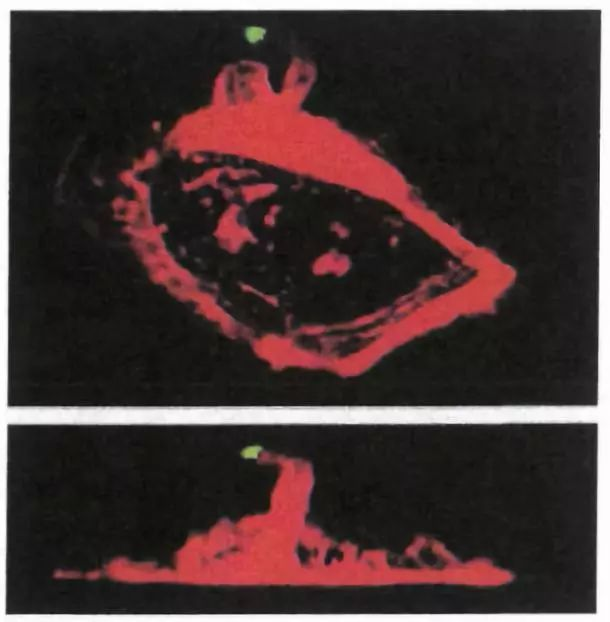
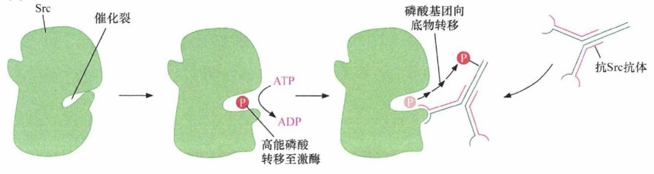
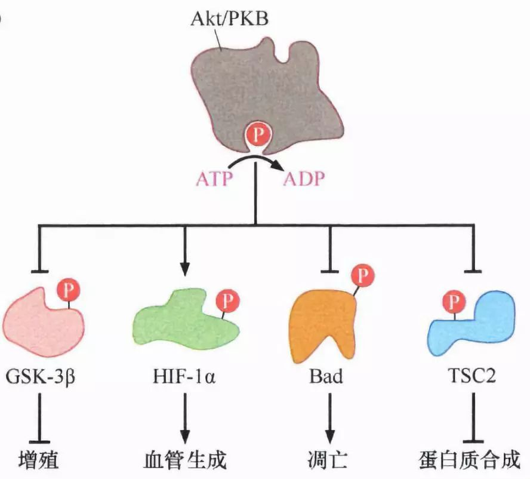
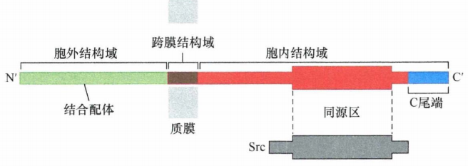
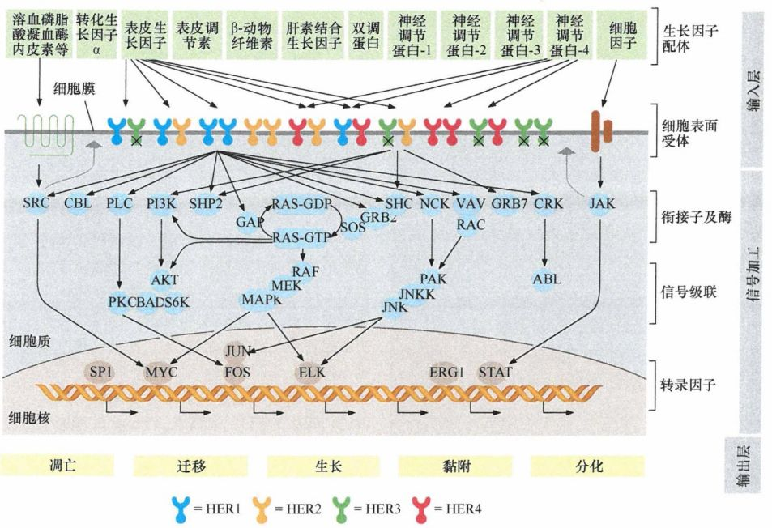
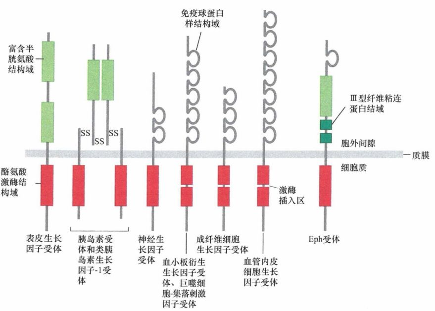
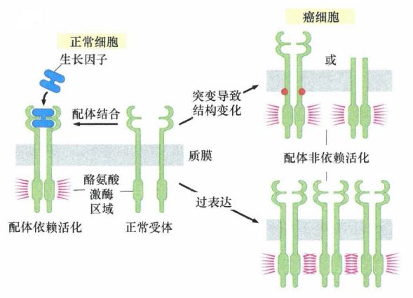

# 第五章 《癌生物学》第五章（1）生长因子与受体（上）

**往期回顾**
 
[《癌生物学》第二章（1） 癌症的起源](http://mp.weixin.qq.com/s?__biz=Mzg4NjA5Mzg2Mw==&mid=2247484770&idx=1&sn=a5144114b3d342408140b8c9ee234d92&chksm=cf9fa42af8e82d3c26681af84e26b7c6361e1275bfdce2edce2c4a3065871c1ce97f0649d3e4&scene=21#wechat_redirect)
 
[《癌生物学》第二章（2） 癌症的发展及其能量代谢](http://mp.weixin.qq.com/s?__biz=Mzg4NjA5Mzg2Mw==&mid=2247484805&idx=1&sn=e97e67056c1d508092127d0388c2eaf6&chksm=cf9fa4cdf8e82ddbaaabda6a2d17d32ec4ab3b7809b97006c79a707f93e35738a7216ba03b4e&scene=21#wechat_redirect)
 
[《癌生物学》第二章（3）癌症的诱因](http://mp.weixin.qq.com/s?__biz=Mzg4NjA5Mzg2Mw==&mid=2247484881&idx=1&sn=bdc85af93a48af8f3c633cbb3b27384d&chksm=cf9fa499f8e82d8f0991b6902435a029254d873ffdc446bc815fddf909f79ca094ce2729135d&scene=21#wechat_redirect)
 
[《癌生物学》第三章（1）病毒可以引发肿瘤](http://mp.weixin.qq.com/s?__biz=Mzg4NjA5Mzg2Mw==&mid=2247485009&idx=1&sn=bf13fdc034c935e967b24ea8264fae21&chksm=cf9fa719f8e82e0f8dc2a5d07a3040aad5619cccfa12509259840d02b3b7417609c8cc132d3c&scene=21#wechat_redirect)
 [《癌生物学》第三章（2）肿瘤病毒如何在细胞中复制（上）](http://mp.weixin.qq.com/s?__biz=Mzg4NjA5Mzg2Mw==&mid=2247485236&idx=1&sn=38754b14ff13c402137769797c36711b&chksm=cf9fa67cf8e82f6aa90d5232aeabf7b48bbcbc792fc807e0626046ec92f4a341bfd30cd9fd1d&scene=21#wechat_redirect) [《癌生物学》第三章（3）肿瘤病毒如何在细胞中复制（下）](http://mp.weixin.qq.com/s?__biz=Mzg4NjA5Mzg2Mw==&mid=2247485333&idx=1&sn=0748f6670320d8d5796113eb408ba01b&chksm=cf9fa6ddf8e82fcbde1175c3ed490fbcad7db352b2728e7fb0e76b0b2c08683663446d3470d2&scene=21#wechat_redirect) 
[《癌生物学》第四章（1）并非所有肿瘤都由病毒感染引起](http://mp.weixin.qq.com/s?__biz=Mzg4NjA5Mzg2Mw==&mid=2247485497&idx=2&sn=c67ed023b637d16e27bb21037e89edec&chksm=cf9fa971f8e82067c6369e04d6a56afa5c398053f08111a2f46879f990bfee32089bc42ff68b&scene=21#wechat_redirect) 

 
[《癌生物学》第四章（2）细胞原癌基因的激活](http://mp.weixin.qq.com/s?__biz=Mzg4NjA5Mzg2Mw==&mid=2247485625&idx=2&sn=fedd027b1ba76c07ed4d2af0b70069c3&chksm=cf9fa9f1f8e820e75e4bc24e8525b5436213d2ad009187877ca2a5f693573b9f5bb965741fba&scene=21#wechat_redirect) 

 

 
“ 正常细胞从其周围获得生长刺激信号，这些信号被细胞中复杂的信号环路处理并整合，决定细胞是否适合生长及分化。细胞间的信号传递主要由蛋白质负责，癌蛋白（如： Src和Ras 分别为癌基因 src和ras的产物 ）可同时改变多种细胞的表型。我们不禁会问，这些单一种类的蛋白质，是如何同时调节众多不同的信号调节通路的呢？
 
从本期推送起，我们将共3期推送介绍生长因子（受体）与配体的知识，欢迎一起学习！”

1、正常细胞间的生命活动相互依存

正常组织形态的维持由以下几方面构成：保持不同细胞组分的适宜比例；替代缺失细胞；清除额外的无用细胞；及时修复损伤组织；清除外源感染物质。这些功能的实现皆有赖于细胞间的协同合作，因此活体组织中的细胞需要持续不断地相互对话，而大部分对话由生长因子（GF）负责传达。

图 5-1-1： 生长因子的作用 ： 被固化在细珠（绿点）上的表皮生长因子（ EGF ）加入小鼠乳腺癌细胞培养体系 5min后，细胞肌动蛋白细胞骨架（红色 ）重组，并从胞质内向生长因子伸出触角（上图：平面观；下图：侧面观）

细胞是否生长由整个组织及整个有机体的需要而定，并非仅出于有利于某些组分生长的目的。正因如此，活体内没有一个细胞被赋予自主权决定该细胞是否增殖或维持静息状态。这一决定需要与组织中其他细胞共同“商议”后才能做出。周围细胞可以通过促使某种特殊细胞分泌生长因子以刺激靶细胞的增殖，也可以通过释放生长抑制因子而抑制其增殖。最终，一个体细胞做出是否增殖的决定反映了周围细胞的群体意见。

从活组织中分离出正常细胞，而后在培养皿中进行培养的实验，可以充分说明个体细胞对环境的依赖性：即使细胞上层的液体介质中包含了所有细胞生长繁殖所要的营养成分，此种介质也无法诱导细胞增殖。但是一旦在这种介质中加入小牛或胎牛的血清，细胞就可增殖。这是因为血清中含有促使细胞增生的生长因子。

血液凝固时，血小板相互黏附聚集并逐渐收缩形成血凝块，将血液中的细胞成分（包括：红细胞和白细胞）网罗其中，这有利于阻止继续出血；当血小板在伤口处形成血凝块时，它们还通过向其周围释放血小板衍生生长因子 （ PDGF）启动伤口的愈合；此外，PDGF可将成纤维细胞吸引至伤口处并刺激成纤维细胞增生，使之形成包括上皮下细胞层的大部分结缔组织。如果没有血清中 PDGF 的刺激 ，在细胞培养皿内培养的成纤维细胞虽然可在几周内存活并保持正常的新陈代谢，但无法继续生长和分裂。

2、Src的酪氨酸激酶功能

细胞间信号如何通过生长因子传递的第一条线索来源于对癌基因v-src及其特定蛋白质产物的生化分析：科学家根据src癌基因的核苷酸序列推导出src癌基因编码的蛋白质氨基酸序列，然而后者并未给“癌蛋白如何促使细胞增殖及转化”这一问题找到答案。

直到1977-1978年，生化学家研制出能与Src特异识别并结合的抗体，当其在同时含有Src及腺苷三磷酸（细胞的万能磷酸根供者）的溶液中孵育时，该抗体被磷酸化。由此可知，Src是作为蛋白激酶发挥作用的，即将ATP的一个高能磷酸键转移至一个适宜的蛋白质底物分子。 （需要注意的是：Src并不常规地磷酸化蛋白底物，早期试验中它的磷酸化功能仅提示它在细胞中的作用模式涉及蛋白底物的磷酸化。） 除了其自身的激酶活性，Src本身就是一个磷酸化蛋白，这表明Src也可作为底物被蛋白激酶磷酸化——自磷酸化或者充当其他激酶的底物。

图 5-1-2 ： Src 的磷酸化作用（底物为用于免疫沉淀 Src分子的抗体 ）

图 5-1-3 ： Akt/PKB激酶 （丝氨酸／苏氨酸蛋白激酶）通过磷酸化主要调控蛋白而广泛地影响生物过程

Src 激酶功能的揭示意义深远：原则上，一种蛋白激酶可以磷酸化细胞内多种不同的蛋白质底物（如Src已被证明有50种不同的蛋白质底物），一旦被磷酸化，这些底物蛋白质的功能可能会发生改变，进而改变其下游靶点的功能。这种作用机制可以解释像Src这样的蛋白质为何能如此多效地干扰多种细胞的表型。

不久之后，人们又发现Src与以前发现的其他蛋白激酶显著不同：在正常细胞内99%以上的磷酸化氨基酸为磷酸化丝氨酸和磷酸化苏氨酸，磷酸化酪氨酸仅占这些细胞内全部磷酸化氨基酸的0.05%-0.1 %；当细胞经v-src癌基因转化后，胞内磷酸化酪氨酸水平显著升高，占这些细胞磷酸氨基酸总量的1%。而当用其他癌基因（如H-ras) 转化相同的细胞时，这些细胞的磷酸化氨基酸组分并没有什么改变。因此认为，磷酸化酪氨酸残基的产生是Src的特有属性，Src通过其酪氨酸激酶活性使蛋白质底物磷酸化而成功地转化细胞。

3、上皮生长因子（EGF）受体的酪氨酸激酶功能

上皮生长因子（EGF）是第一个被发现的生长因子，它对多种上皮细胞具有促分裂作用。EGF可结合于某些细胞表面并刺激其生长，而无法与EGF结合的细胞则对其有丝分裂原作用无反应。这些观察结果提示：可能存在一种细胞表面蛋白——EGF受体（EGF-R），它可特异性识别并结合胞外的EGF，将信息向胞内传递。

图 5-1-4 ： 生长因子受体（ EGFR)结构

图 5-1-5 ： 人类 EGF受体 （ HER2)信号网络

分离EGF-R蛋白极具挑战，因为该受体和其他很多受体一样在细胞内的表达水平非常低。研究者通过使用子宫上皮癌细胞（其表达的EGF-R比正常水平高100倍）解决了这个问题。对EGF-R分离纯化并进行氨基酸序列分析，可以帮助我们了解该蛋白质的结构特征以及这一结构如何发挥功能。从EGF受体的整体结构可以大致推断出：其胞外结构域与EGF结合之后，一个信号被转导通过细胞膜以激活胞内结构域，胞内结构域被激活后释放促使细胞生长分裂的信号。

对该胞内结构域的检测显示，它与已知的Src蛋白质序列有明确的序列相似性。EGF受体如何在胞内释放信号这一问题的答案瞬间变得清晰起来：一旦其胞外结构域结合EGF, 其胞内结构域的Src样激酶将以某种方式被激活，之后磷酸化某些胞内蛋白质的酪氨酸残基，从而使细胞增殖。

图 5-1-6 ： EGFR 可以根据其结构的特点分为不同的家族：它们具有相似的胞内酪氨酸激酶结构域（红色）；它们的胞外结构域（绿色或灰色）结构高度变异，识别并结合大量胞外配体

4、改变的生长因子受体可发挥癌蛋白作用

1984年，人们证实EGFR和禽成红细胞增生病毒的erbB 癌基因编码的癌蛋白高度相似：erbB 癌基因编码的癌蛋白缺少EGFR的N端胞外结构域的序列。在没有N端序列的情况下，ErbB癌蛋白无法辨认及结合EGF，然而，它发挥了细胞增殖刺激因子的功能。

图 5-1-7 ： EGFR 和 v-ErbB癌蛋白高度相似 ： v-ErbB蛋白由EGFR 基因的变体序列编码，它是缺少正常胞外结构域（绿色）的截短体

这一发现引出了一个有趣的推论并在随后被证实：胞外结构域的缺失可通过某种方式使被截短的EGF受体蛋白向细胞内源源不断地发送生长刺激信号，而完全不依赖于EGF。多年后，在1/3的人成胶质细胞瘤中发现了被截短的EGFR，其mRNA缺少由外显子2-7携带的编码序列，这源于该受体的基因中相应的DNA序列缺失。而后，在乳腺癌中发现了ErbB/EGF-R的同源分子，如Erb82、HER2及Neu，它们与不良预后密切相关。更具广泛意义的是，在人类肿瘤中存在多种与EGF受体结构相似的生长因子受体过表达或结构改变。

图 5-1-8 ： 功能正常的生长因子受体（左侧）在与配体（蓝色）结合后向胞内释放信号（红色穗状）；编码受体分子的基因突变（右侧）可引起蛋白质结构的变化，导致配体非依赖性的受体激活，信号失调。

正常细胞通过从其培养基中获得生长因子而维持生长，然而癌细胞在生长和生存过程中对生长因子的依赖性则大大降低。ErbB-EGF-R间的关系为癌细胞这一特性提供了一个简单明了的解释：ErbB 癌蛋白所释放的信号与那些经配体激活的EGFR所释放的信号非常相似，不同于EGR的是，ErbB癌蛋白可以持续不断地向细胞内发放生长剌激信号，从而使细胞认为周围存在着大量的EGF。

参考书目： 《The Biology of Cancer》（Second Edition）  R.A.Weinberg  著，詹启敏 等  译

编辑：周健 张月明 游丹铭

校审：张健 罗鹏

