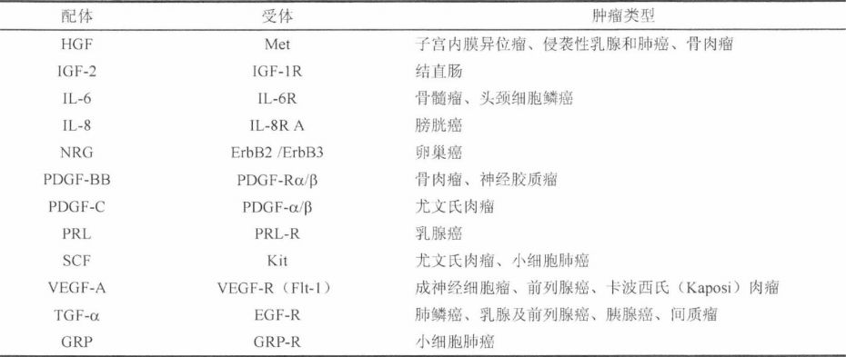
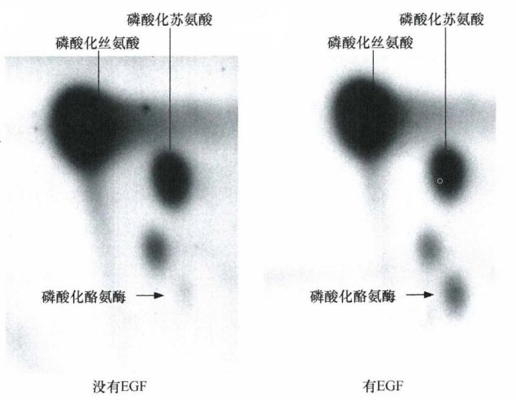
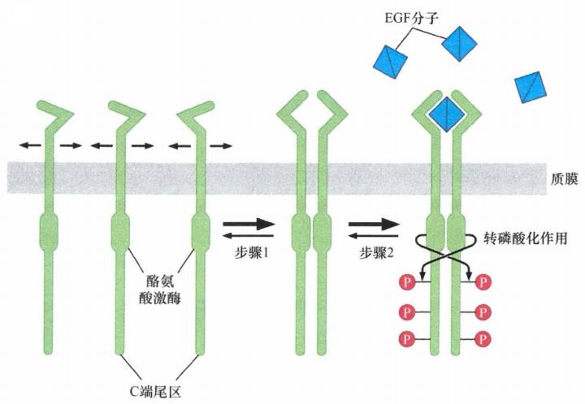
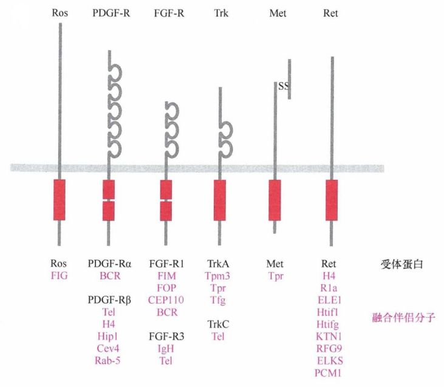
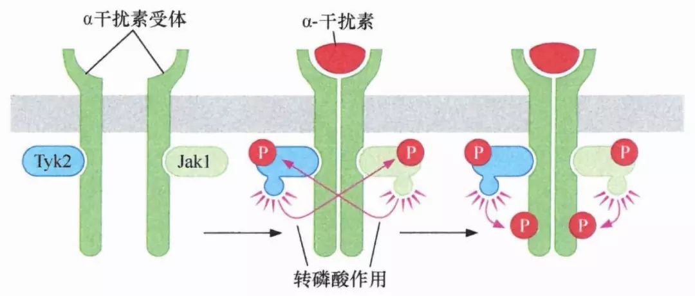
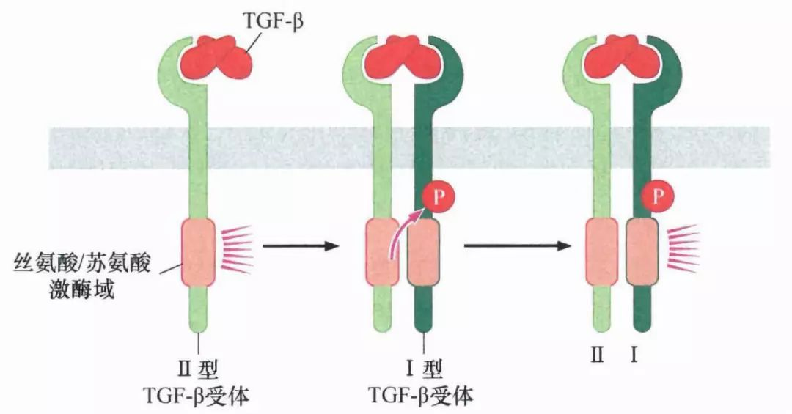
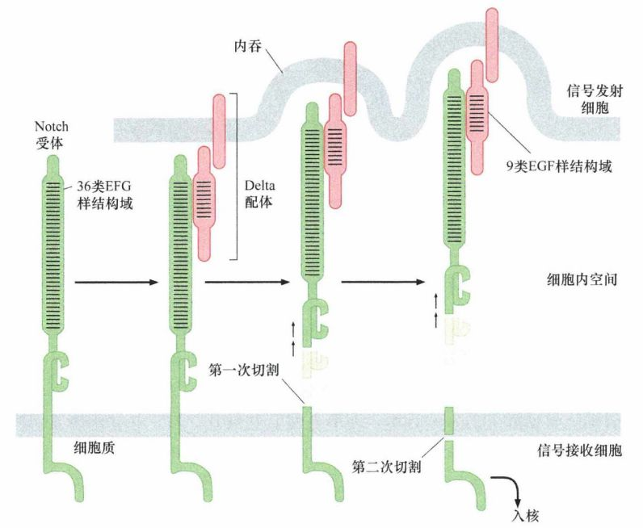
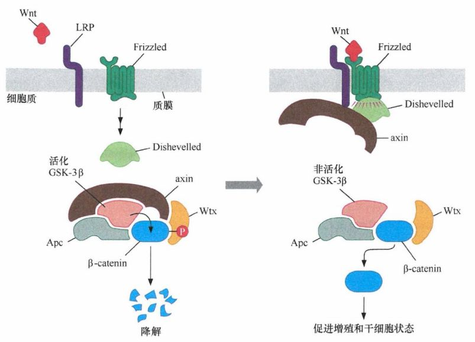

# 第五章 《癌生物学》第五章（2）生长因子与受体（中）

**往期回顾**
 
[《癌生物学》第二章（1） 癌症的起源](http://mp.weixin.qq.com/s?__biz=Mzg4NjA5Mzg2Mw==&mid=2247484770&idx=1&sn=a5144114b3d342408140b8c9ee234d92&chksm=cf9fa42af8e82d3c26681af84e26b7c6361e1275bfdce2edce2c4a3065871c1ce97f0649d3e4&scene=21#wechat_redirect)
 
[《癌生物学》第二章（2） 癌症的发展及其能量代谢](http://mp.weixin.qq.com/s?__biz=Mzg4NjA5Mzg2Mw==&mid=2247484805&idx=1&sn=e97e67056c1d508092127d0388c2eaf6&chksm=cf9fa4cdf8e82ddbaaabda6a2d17d32ec4ab3b7809b97006c79a707f93e35738a7216ba03b4e&scene=21#wechat_redirect)
 
[《癌生物学》第二章（3）癌症的诱因](http://mp.weixin.qq.com/s?__biz=Mzg4NjA5Mzg2Mw==&mid=2247484881&idx=1&sn=bdc85af93a48af8f3c633cbb3b27384d&chksm=cf9fa499f8e82d8f0991b6902435a029254d873ffdc446bc815fddf909f79ca094ce2729135d&scene=21#wechat_redirect)
 
[《癌生物学》第三章（1）病毒可以引发肿瘤](http://mp.weixin.qq.com/s?__biz=Mzg4NjA5Mzg2Mw==&mid=2247485009&idx=1&sn=bf13fdc034c935e967b24ea8264fae21&chksm=cf9fa719f8e82e0f8dc2a5d07a3040aad5619cccfa12509259840d02b3b7417609c8cc132d3c&scene=21#wechat_redirect)
 [《癌生物学》第三章（2）肿瘤病毒如何在细胞中复制（上）](http://mp.weixin.qq.com/s?__biz=Mzg4NjA5Mzg2Mw==&mid=2247485236&idx=1&sn=38754b14ff13c402137769797c36711b&chksm=cf9fa67cf8e82f6aa90d5232aeabf7b48bbcbc792fc807e0626046ec92f4a341bfd30cd9fd1d&scene=21#wechat_redirect) [《癌生物学》第三章（3）肿瘤病毒如何在细胞中复制（下）](http://mp.weixin.qq.com/s?__biz=Mzg4NjA5Mzg2Mw==&mid=2247485333&idx=1&sn=0748f6670320d8d5796113eb408ba01b&chksm=cf9fa6ddf8e82fcbde1175c3ed490fbcad7db352b2728e7fb0e76b0b2c08683663446d3470d2&scene=21#wechat_redirect) 
[《癌生物学》第四章（1）并非所有肿瘤都由病毒感染引起](http://mp.weixin.qq.com/s?__biz=Mzg4NjA5Mzg2Mw==&mid=2247485497&idx=2&sn=c67ed023b637d16e27bb21037e89edec&chksm=cf9fa971f8e82067c6369e04d6a56afa5c398053f08111a2f46879f990bfee32089bc42ff68b&scene=21#wechat_redirect) 

 
[《癌生物学》第四章（2）细胞原癌基因的激活](http://mp.weixin.qq.com/s?__biz=Mzg4NjA5Mzg2Mw==&mid=2247485625&idx=2&sn=fedd027b1ba76c07ed4d2af0b70069c3&chksm=cf9fa9f1f8e820e75e4bc24e8525b5436213d2ad009187877ca2a5f693573b9f5bb965741fba&scene=21#wechat_redirect)
 
[《癌生物学》第五章（1）生长因子与受体（上）](http://mp.weixin.qq.com/s?__biz=Mzg4NjA5Mzg2Mw==&mid=2247485864&idx=1&sn=9d850e610445822a84b6bd6318734094&chksm=cf9fa8e0f8e821f6e93a3c554138b82030bc5adc8d0e47e111ec3d9f0d8424c29bcd49c100c1&scene=21#wechat_redirect) 

 

 

 
5、生长因子基因可转变为癌基因 

 

 
1983年 ，人们发现血小板衍生生长因子（ PDGF）的β链序列与猴肉瘤 病毒 v-sis癌基因编 码的癌蛋白高度相关，后来的氨基酸序列鉴定提示了另一个癌蛋白转化细胞的重要机制：猴肉瘤病毒感染细胞后，它的 sis癌基因促使被感染细胞释放 大量 PDGF样Sis蛋白 ，后者与释放它们的自身细胞上的 PDGF-R结合 ，造成这些细胞上 PDGF受体强烈活化 ，产生持续的生长刺激信号。
 
PDGF主要刺激间 充质细胞（如成纤维细胞、脂肪细胞及平滑肌细胞）生长，而 EGF则主要 刺激上皮细胞生长。这也解释了为什么猴肉瘤病毒只能转化成纤维细胞，却无法转化上皮细胞。
 
我们已知许多肿瘤细胞可以产生并释放大量它们自身亦可应答的生长因子。肺癌可产生至少 3种不同的生长因子 ：肿瘤生长因子 -α（TGF-α ）、干细胞因子（ SCF ）及胰岛素样生长因子 -1 （ IGF-1 ），并可表达这 3种配体的受体，从而同时确立了3条自分泌信号环路。这些信号环路对肿瘤生长具有重要作用 ，例如，在一项对小细胞肺癌（ SCLC ）患者的研究中，癌细胞表达 Kit （即受体 SCF ）的患者确诊后的平均存活时间仅为 71天，而癌细胞不表达Kit的患者则可平均生存288天。
 

 
表 5-2-1： 产生自分泌生长因子的人类肿瘤举例
 

 

 
一般来说，自分泌信号环路意味着组织和器官存在潜在危险。在正常组织中，个体细胞的增生几乎都依赖于从其他细胞获取的信号；这种相互依赖性确保了细胞种群及组织结构的稳定性。一个获得控制自身增生能力的细胞，其自我强化的正反馈环路往往会导致生理失衡，因此会造成巨大的危险。

6、 受体酪氨酸激酶依赖转磷酸化发挥作用

生长因子受体与配体结合后，其激酶结构域被激活，磷酸化某些胞内蛋白质的酪氨酸残基，从而使细胞增殖。这又引发了一个问题：生长因子受体与配体结合后，是怎样利用它们的酪氨酸激酶结构域来发出信号的呢？

图 5-2-1： 在缺乏EGF时， 32 P0 4 标记的富含磷酸化氨基酸的蛋白质；当添加 EGF到人表皮样癌细胞A431时，右下方的点变强 ，根据内参标记表明这是磷酸化酪氨酸。

在没有配体的情况下，一个生长因子受体通常以单体（一个亚基）形式嵌入质膜。当其生长因子配体（配体为同源二聚体）存在时，受体分子就会结合在配体两个亚基中的一个上。其后，配体 - 受体复合物将在质膜上徘徊直到有第二次机会遇到另一个受体分子，配体中没有结合受体的那个亚基将和第二个受体分子结合。这样，通过二聚体形式的配体为桥梁，两个受体分子成功地交联在一起。两个受体分子的胞外结构域通过与配体结合而发生二聚化，胞质部分通常也会被拉在一起。每个激酶结构域磷酸化另一受体胞质结构域里的酪氨酸残基，这种双向的相互磷酸化作用被称为 转磷酸 作用。

图 5-2-2： 受体二聚化、配体结合与转磷酸作用：在没有配体结合时，生长因子受体分子（左，绿色）在质膜平面自由横向迁移；当两个受体分子相遇时，它们形成同源二聚体且待续时间短暂，受体的胞外结构域发生构象改变并获得与生长因子配体结合的强亲和力（步骤 1 ）；随后 EGF配体分子的结合可导致受体二聚体的稳定性增强并激活酪氨酸激酶 （ TK ）结构域（步骤 2 ）；每个受体亚基磷酸化另一个亚基的 C端胞质尾区转磷酸化作用（箭头）

这些酪氨酸残基的磷酸化至少导致两种后果。

首先，激酶催化裂隙（即蛋白酶发挥功能的区域）通常受蛋白质的环结构阻隔，从而阻止激酶与其底物有效结合。阻隔 “活化环”的关键 酪氨酸的转磷酸作用可导致该环结构移开，从而可使底物分子进入催化裂隙。其次，转磷酸作用可导致生长因子受体胞质部分激酶区域 以外的一系列酪氨酸残基磷酸化。

受体的二聚化模型解释了生长因子受体分子的过表达如何参与肿瘤的形成：生长因子受体在细胞表面的表达水平远远超过了正常细胞，由于受体分子可以自由地在质膜平面横向迁移，它们的高数量使得分子之间经常发生碰撞，这种碰撞类似配体结合所引发的受体二聚化并导致转磷酸作用、受体激活和信号传递。

此外，除了二聚化，配体结合的胞外结构域还经历某种类型的旋转或立体转换，这种转换通过质膜传递至胞质激酶结构域，使其本身转变成更利于转磷酸作用的新构象。事实上，在一些酪氨酸激酶受体中，即使没有配体结合，组成性的二聚化也是可能存在的，配体只是使受体分子的胞外和胞质结构域同步旋转，从而有利于其激酶结构域转导信号。

图 5-3-3： 在一些恶性肿瘤中，当编码生长因子受体（黑色）的基因碰巧与通常能形成二聚体或高阶寡聚物（红色）的基因融合时，其产物可将一对受体单体拖到一起 （这里列出的是人类肿瘤中存在的一些突变融合受体） 。

7、 其他类型的受体介导哺乳动物细胞与环境的交流

细胞从周围环境中接收各种各样的生化信号，这提示许多类型的受体可能参与了肿瘤的发病机制。上述酪氨酸激酶受体（ RTK ）只是众多结构多样的受体类型之一，其他类似 RTK 的 受体特异识别细胞外特定的配体，一旦与之结合就将信号转导入胞内。

Jaks激酶是独立的 多肽，它利用了酪氨酸激酶活性，与受体的胞质结构域非共价连接，调控各种类型造血细胞的发育。这类受体包括促红细胞生成素（ EPO ）受体、促血小板生成素（ TPO ）受体和干扰素受体（INF-R）。当这类细胞因子受体分子被配体结合而发生二聚化时，与之相连的 Jaks相互磷酸化并激活 ，使受体分子的 C端尾部磷酸化，从而使受体激活并释放信号。 （详见第 6章）

图 5-3-4：干扰素受体 （ IFN-R,深绿色）以非共价形式与Jak家族的酪氨酸激酶(Tks)连接 (Tyk2和Jakl) ：当配体（ α-干扰素）结合后，两个Tks通过转磷酸化作用来相互激 活，接下来， Tks再磷酸化受体亚基的C端尾部，使受体处于一个信号活化的构象

转化生长因子 -β（TGF-β） 及相关配体的受体结构上类似酪氨酸激酶受体（有一个胞外配体结合域、跨膜结构域和胞质激酶结构域），但这些受体是以异源二聚体形式发挥功能，如 I型和II型TGF-β 受体复合物。重要的是，它们的激酶结构域磷酸化丝氨酸和苏氨酸残基，而不是酪氨酸残基。 TGF-β 在肿瘤发病机制中发挥重要作用，它们能抑制正常上皮细胞的增殖，同时促进已经转化的细胞获得侵袭能力。当配体结合后，一个含有组成性丝氨酸／苏氨酸激酶活性的 II型TGF-β 受体亚基，被带到一个 I型TGF-β 受体亚基附近，然后将其磷酸化。 I型TGF-β 受体亚基的激酶被激活后，磷酸化胞浆蛋白并使其入核，从而激活特定靶基因。（详见第 8章）

图 5-3-5：转化生长因子-β 受体的激酶结构域特定地磷酸化丝氨酸和苏氨酸残基。当 Tl型受体 （ TGF-βR II） 通过结合 TGF-β 配体进而接触到 I型受体 （ TGF-βR I)后，它可以磷酸化并激活I型受体的激酶活性。活化的I型受体激酶通过磷酸化特定的细胞质底物释放信号。

Notch受体和它的多个选择性配体是一个更为原始的跨膜信号系统。这些配体是由信号发射细胞表达出来的固定在细胞表面的蛋白质。因此 ，配体 - 受体相互作用需要信号发射细胞和信号接收细胞之间物理距离靠近，这种类型的信号被称为近分泌信号。

图 5-3-6 ： 当 Notch受体 （绿色）与相邻细胞表面的配体（图中 Delta,粉红色 ）结合后，配 体 Delta通过内吞作用进入配体表达细胞，从而触发Notch受体两次连续的蛋白酶酶切作用。最终导致Notch受体C端胞质片段释放并入核，从而改变某些基因的表达。

Patched受体由多个跨膜结构域组成 ，这种形式的受体称为蛇形受体。当 Patched配体Hedgehog蛋白 （ Hh ）与 Patched受体 （ Ptc ）结合后， Ptc远离第二个蛇形G蛋白 Smoothened （ Smo ），从而释放 Smo蛋白的信号转导活性。

Wnt代表另一个独立的信号转导系统 ，人类至少有 19种不同的Wnt蛋白。Wnt蛋白被紧紧结合在细胞外基质(ECM ）中，并通过一个脂质尾结合在细胞膜上，不能随意扩散。当没有 Wnt信号时，细胞质糖原合成酶激酶3β（GSK-3β） 磷酸化几个关键促增殖蛋白并使其降解。但是，当 Wnt结合到Frizzled受体时会触发一系列级联反应 ，关闭 GSK-3β 活性，使下游蛋白质逃脱降解从而促进细胞增殖。

β-catenin的水平受Wnt调控，通常被称为“经典的Wnt信号通路”, 是 Wnt与其Frizzled受体影响细胞行为的两种方式之一。某些Wnt配体与它们相应的Frizzled受体一起，通过一个完全不同的生化途径传导信号，称为“非经典的Wnt信号通路”。非经典的Frizzled受体能够激活鸟嘌呤核苷酸结合蛋白（简称为G蛋白），G蛋白可作为一个双相开关, 在 GTP结合的活化状态和GDP结合的非激活状态之间转换 。 Wnt通路在肿瘤发病中起着至关重要的作用，我们将在接下来的几个章节详细讨论 。

图 5-3-7： Frizzled受体介导的经典Wnt信号通路 ：没有配体结合时（左），复合物中的 axin （棕色）和 Ape （淡蓝绿色）允许糖原合成酶激酶 3P （ GSK-3P,粉色）磷酸化β-catenin （蓝色），导致 β-catenin被蛋白酶水解而迅速降解。当Wnt配体结合到特定的Frizzled受体（右，深绿色）和LRP受体（紫色）时，Frizzled受体被激活，并通过Dishevelled蛋白（浅绿色）和axin （深棕色）抑制 GSK-3P ，这样 β-catenin就能在细胞核 累积并促进细胞增殖。

参考书目： 《The Biology of Cancer》（Second Edition）  R.A.Weinberg  著，詹启敏 等  译

编辑：周健 张月明 游丹铭

校审：张健 罗鹏

