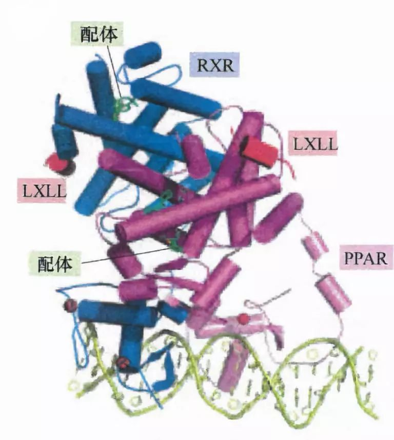
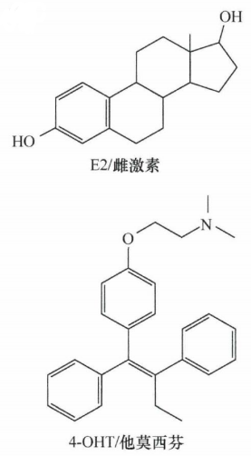
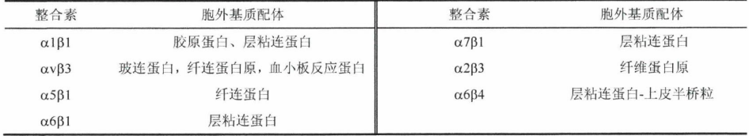
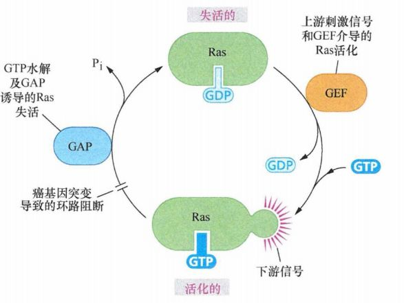

# 第五章 《癌生物学》第五章（3）生长因子与受体（下）

**往期回顾**
 
[《癌生物学》第二章（1） 癌症的起源](http://mp.weixin.qq.com/s?__biz=Mzg4NjA5Mzg2Mw==&mid=2247484770&idx=1&sn=a5144114b3d342408140b8c9ee234d92&chksm=cf9fa42af8e82d3c26681af84e26b7c6361e1275bfdce2edce2c4a3065871c1ce97f0649d3e4&scene=21#wechat_redirect)
 
[《癌生物学》第二章（2） 癌症的发展及其能量代谢](http://mp.weixin.qq.com/s?__biz=Mzg4NjA5Mzg2Mw==&mid=2247484805&idx=1&sn=e97e67056c1d508092127d0388c2eaf6&chksm=cf9fa4cdf8e82ddbaaabda6a2d17d32ec4ab3b7809b97006c79a707f93e35738a7216ba03b4e&scene=21#wechat_redirect)
 
[《癌生物学》第二章（3）癌症的诱因](http://mp.weixin.qq.com/s?__biz=Mzg4NjA5Mzg2Mw==&mid=2247484881&idx=1&sn=bdc85af93a48af8f3c633cbb3b27384d&chksm=cf9fa499f8e82d8f0991b6902435a029254d873ffdc446bc815fddf909f79ca094ce2729135d&scene=21#wechat_redirect)
 
[《癌生物学》第三章（1）病毒可以引发肿瘤](http://mp.weixin.qq.com/s?__biz=Mzg4NjA5Mzg2Mw==&mid=2247485009&idx=1&sn=bf13fdc034c935e967b24ea8264fae21&chksm=cf9fa719f8e82e0f8dc2a5d07a3040aad5619cccfa12509259840d02b3b7417609c8cc132d3c&scene=21#wechat_redirect)
 [《癌生物学》第三章（2）肿瘤病毒如何在细胞中复制（上）](http://mp.weixin.qq.com/s?__biz=Mzg4NjA5Mzg2Mw==&mid=2247485236&idx=1&sn=38754b14ff13c402137769797c36711b&chksm=cf9fa67cf8e82f6aa90d5232aeabf7b48bbcbc792fc807e0626046ec92f4a341bfd30cd9fd1d&scene=21#wechat_redirect) [《癌生物学》第三章（3）肿瘤病毒如何在细胞中复制（下）](http://mp.weixin.qq.com/s?__biz=Mzg4NjA5Mzg2Mw==&mid=2247485333&idx=1&sn=0748f6670320d8d5796113eb408ba01b&chksm=cf9fa6ddf8e82fcbde1175c3ed490fbcad7db352b2728e7fb0e76b0b2c08683663446d3470d2&scene=21#wechat_redirect) 
[《癌生物学》第四章（1）并非所有肿瘤都由病毒感染引起](http://mp.weixin.qq.com/s?__biz=Mzg4NjA5Mzg2Mw==&mid=2247485497&idx=2&sn=c67ed023b637d16e27bb21037e89edec&chksm=cf9fa971f8e82067c6369e04d6a56afa5c398053f08111a2f46879f990bfee32089bc42ff68b&scene=21#wechat_redirect) 

 
[《癌生物学》第四章（2）细胞原癌基因的激活](http://mp.weixin.qq.com/s?__biz=Mzg4NjA5Mzg2Mw==&mid=2247485625&idx=2&sn=fedd027b1ba76c07ed4d2af0b70069c3&chksm=cf9fa9f1f8e820e75e4bc24e8525b5436213d2ad009187877ca2a5f693573b9f5bb965741fba&scene=21#wechat_redirect)

9、 核受体感受低分子量脂溶性配体的存在

细胞内有一类信号配体，属于低分子量和相对疏水的分子，包括类固醇性激素、类维生素 A和维生素D。它们的疏水性使这些配体容易穿透细胞膜并进一步进入细胞核 ，结合并激活一系列充当转录因子的核 DNA结合蛋白。这些“核受体”可以结合它们的配体并直接调控靶基因的表达 ，不需要各种细胞表面受体和核内转录机制之间起中介功能的胞质内信号级联通路。

图 5-3-1：许多核受体为异源二聚体 ，图中所示为唯一已被阐明的核受体复合物的结构：即 PPAR-γ（ 过氧化物酶体增殖物激活受体 γ,浅紫色）和RXR （视黄素 X受体 ，蓝色）的异源二聚体复合物。每个受体的共激活子（红色）的 LXLL结构域CL为亮氨酸 ， X为可变的氨基酸残基 ）使共激活子直接结合到受体，然后再招募染色质修饰酶到附近的染色质。两个受体的配体（绿色）为罗格列酮（与 PPAR 结合）和9-顺视黄酸（与RXR结合）

人类48个左右的核受体中最主要的为结合雌激素、孕激素和雄激素这3种类固醇激素的受体。这3种受体在人类恶性肿瘤 ，尤其是乳腺癌、卵巢癌和前列腺癌的发展中发挥重要作用。

核受体分子包含一个 DNA结合域、铰链区和一个保守的配体结合域 ，这 3个区域两侧有可变N端和C端结构域。一些核受体保留在细胞质中直到配体结合才触发入核，有的则结构性地结合到染色质。一旦与染色质相结合，这些受体以同源或异源二聚体的形式结合到它们所调控表达的基因启动子区内或附近的一段DNA识别序列 ，这些识别序列通常称为激素应答元件（ HRE ）。

雌激素受体（ ER ）与其天然配体 17β 雌二醇（通常称为雌激素或 E2 ）结合可引起 ER配体结合袋附近a螺旋的构象转变；这些转变可使受体吸引某个受体共激活子 ，并释放共阻遏子，这些共激活子和共阻遏子是将信号从 ER传递到转录机构的蛋白质。这些中介蛋白经常通过修饰附近组蛋白或通过招募组蛋白修饰酶来发挥作用 。经修饰的染色质能够允许或禁止 RNA聚合酶II对相关基因的转录。选择性雌激素受体调节剂 （ SERM ）（如他莫昔芬）可使 ER释放共激活子并招募共阻遏子，从而有效阻断E2信号 。

图 5-3-2： 配体 17β 雌二醇（雌激素 E2)可引起雌激素受体 （ ER ）构象改变，使受体结合一个共激活子，从而导致转录活化。而与假配体结合，如药物 4-胫基他莫昔芬 （ 4-0HT ）会导致受体的另一种立体化学结构转变，使其失去共激活子并与共阻遏子结合，这解释了为什么他莫昔芬可以用于治疗性地拮抗雌激素信号

10、 整合素受体感受细胞与细胞外基质间的联系

正常细胞的重要属性是锚定依赖性生长，其增殖需要固体基质。对细胞黏附的培养皿底部的固体基质的生化分析表明，大部分细胞并不直接锚定到培养皿的表面，而是连接到类似存在于大部分组织内细胞间空隙存在的细胞外基质（ ECM ）的复杂分子网络。 ECM 由一系列糖蛋白组成，包括胶原、层粘连蛋白、蛋白聚糖和纤连蛋白。细胞进入培养皿，会分泌 ECM ，然后附着到这种基质上。

锚定依赖性真实地反映了正常细胞为了生存和增殖对周围 ECM 组分的需求 ，这使细胞能够感知自己是否已成功接触到 ECM 。大部分 ECM组分的识别是 由一类专门的细胞表面受体完成，即整合素（ integrin ），整合素通过将细胞栓系到 ECM创建组织的机械稳定性。

图 5-3-3： 整合素的结构：整合素由一个 α 亚基和一个 β亚 基（绿色，蓝色）组成。胞外结构域可与细胞外基质（ ECM ）的特定组分结合。二价阳离子（黄点）以多种方式调节配体－受体结合；胞质结构域（主要是 β 亚基）通过中间蛋白与细胞骨架（主要是肌动蛋白纤维）相连接，还可吸引各种信号转导蛋白，当胞外结构域与 ECM配体结合时即可将之激活

整合素构成一个异源二聚跨膜细胞表面受体大家族，该受体由 α 亚基和 β 亚基组成。这些受体的胞外结构域可与特定的 ECM组分结合 。例如，研究较多的 α5/β1整合素是纤连蛋白的主要受体 ，纤连蛋白是脊椎动物组织中 ECM组分的一个重要糖蛋白 ；层粘连蛋白是包含多个结构域的 ECM大分 子，已知可被多达 12个 不同的整合素异源二聚体结合。

表 5-3-1：整合素及其胞外基 质配体

通常认为受体的功能是从细胞外向细胞质传递信息，整合素确实发挥了这样的功能。除此之外，来自细胞质的信号也可控制整合素与其 ECM配体结合的亲和力 ，这种 “由内向外”的信号使细胞能调节它们与不同 类型的 ECM或同一ECM的不同位点的结合 ，从而打破已有的连接并在自己的位置上建立新的联系。细胞外接触的快速调节使细胞能够摆脱组织内的一个微环境并进入另一微环境，甚至在体外横贯单层 ECM 。

综上，针对各式各样的酪氨酸激受体和整合素的研究表明，这些受体使正常细胞进行生长和分裂满足两个前提条件： 细胞必须感应到在其周围有充分的有丝分裂生长因子 和 充分的可锚定的ECM特定组分。

11、 Ras蛋 白作为信号级联反应的下游因子，
 
发挥类似G蛋白的功能

哺乳动物细胞中有 3个 不同的 ras基因编4 码种不同的 Ras蛋白 （ K-Ras的mRNA前体经选择性剪接形成两种蛋 白）， Ras可以结合并水解（即剪切） 鸟苷酸。这种类似 GTP 酶的作用和 Src、erbB的酪氨酸激酶作用模式完全不同 ，但这 3种癌蛋 白对细胞行为的影响极为相似。

通过进一步与 G蛋 白对比发现： Ras蛋 白处于非活化状态时，结合一个 GDP分子； 当上游信号级联通路传来刺激信号后， Ras蛋 白释放结合的 GDP分 子并结合一个 GTP分 子；结合了 GTP分 子后， Ras蛋 白转化为活化的、可以传递信号的构象，自身的 GTP酶发挥功能，剪切GTP,从而使自身再一次回到非活化的、 不能传递信号的构象。

图 5-3-4：Ras信号环路

假设信号传递链是这样的：酪氨酸激酶受体传递的有丝分裂信号激活了一种鸟嘌呤核苷酸交换因子（ GEF ），活化的 GEF使 静止的 Ras蛋 白释放 GDP并结合GTP而活化；活化的Ras蛋白将信号传给下游未知的靶基因群 。当 Ras蛋 白水解 GTP后 ，这个信号传递过程结束， Ras蛋白恢复到静止状态 。

人们在对 Harvey肉瘤病毒点突变ras癌基因编码的Ras蛋白进行生化分析时发现 ：突变的 Ras癌蛋白和其他正常Ras蛋白一样 ，可以结合 GTP,但是它丧失了大部分的GTP酶活性。因此，它可以被上游刺激信号和GEF激活而转化为活性的信号传递状态 。但是一旦被激活，突变的 Ras蛋白不能自动关闭而处 于持续活化状态。这说明点突变引起的氨基酸替换破 坏了Ras蛋白行使正常功能必需的负反馈调节环。

X射线结晶学方法对Ras蛋白的详细结构研究 显示： Ras蛋白的12位、13位和61位氨基酸残基位 于 Ras蛋白行使GTP酶活性的区域。因此 ，几乎这 3个氨基酸发生的任何替换，都能破坏Ras蛋白的GTP酶功能 。

现在 我们可以理解为什么在多种人类肿瘤基因组中只发现了仅仅影响少数有限数目氨基酸残基的点突变： ras原癌基因的大片段改变在肿瘤中并不常见，因为它们往往引起Ras蛋白功能缺失而不是增强 ；大部分 ras原癌基因点突变产生的突变Ras蛋白往往失去而不是增强了传导生长刺激信号的能力 。只有当 Ras蛋白的信号传递能力保持完好 ，而其 GTP酶负反馈调节机制被选择性抑制时，Ras蛋白才能获得促进细胞增殖和使细胞发生转化的能力。只有那些极少数发生突变导致Ras蛋 白 3个氨基酸残基中任何一个发生替换的细胞，才能获得比其野生 型细胞更强的生长能力，从而有机会成为癌细胞前体细胞。

小结：过去三次推文中，我们一起学习了在生理及病理状况 （尤其是肿瘤） 下，机体信号传递的基本方式，即：配体 -受体结合导致一系列下游变化并释放信号。从受体角度来讲，除耳熟能详的膜受体外，核受体与整合素也发挥着重要的作用。也许你仍然对于复杂的信号通路及配体受体分子难以理解，不用紧张，在后续章节中，我们还会多次重温这些知识。

参考书目： 《The Biology of Cancer》（Second Edition）  R.A.Weinberg  著，詹启敏 等  译

编辑：周健 张月明 游丹铭

校审：张健 罗鹏

