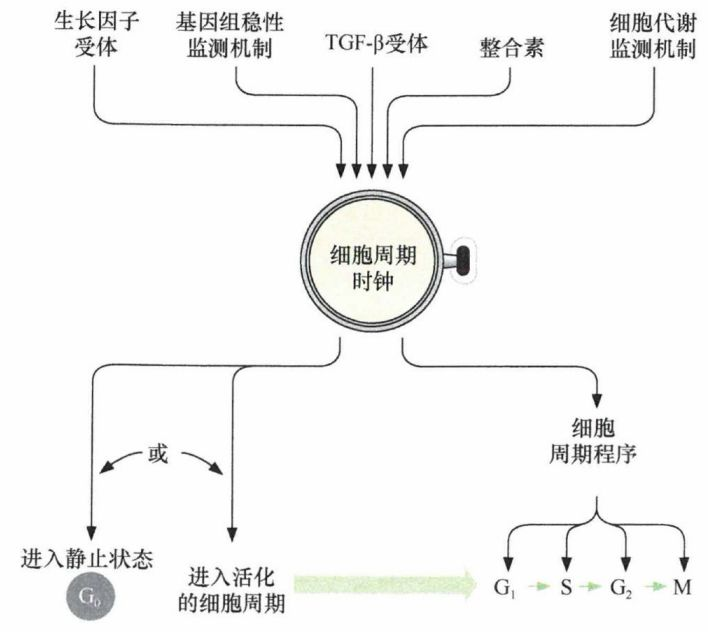
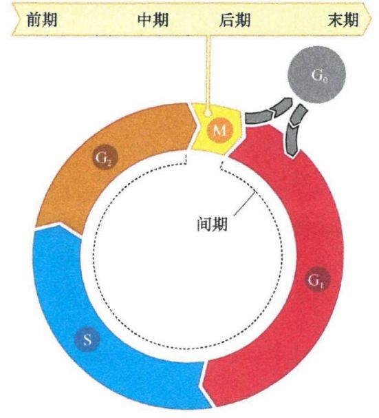
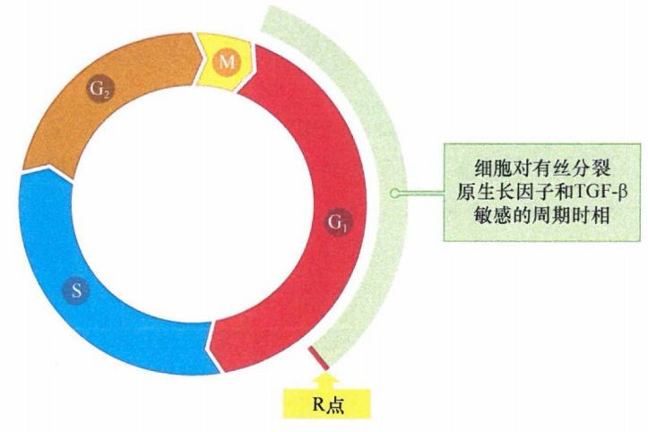
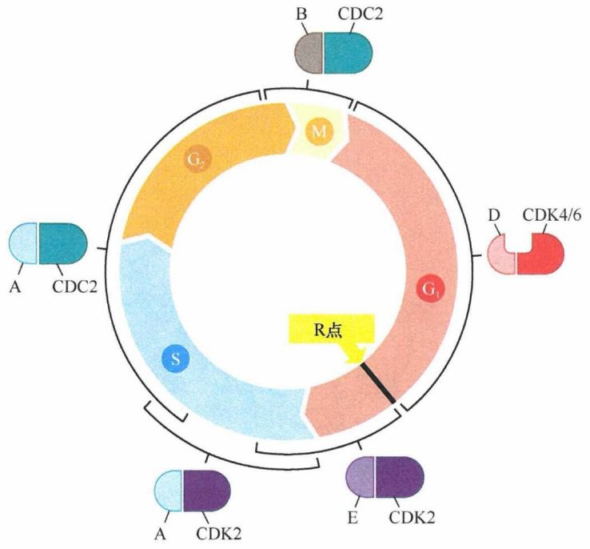
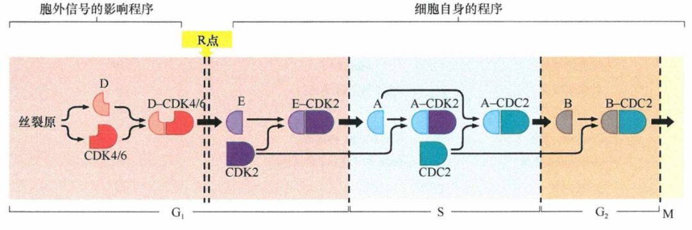
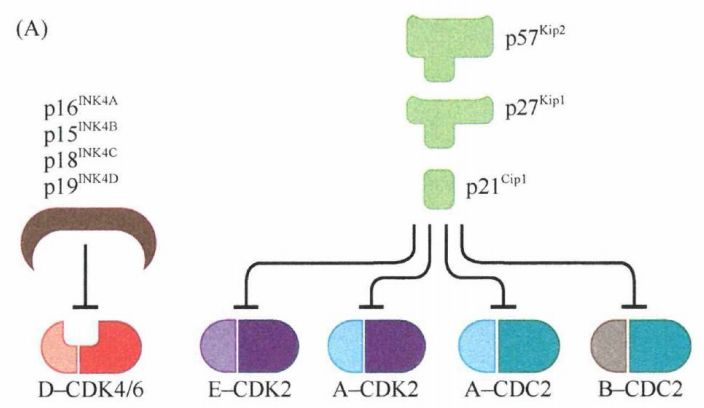
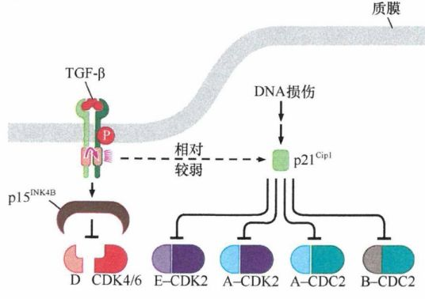
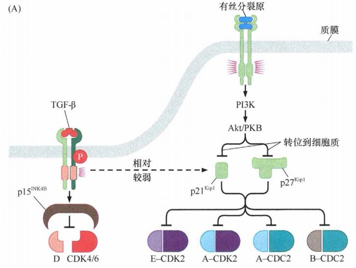
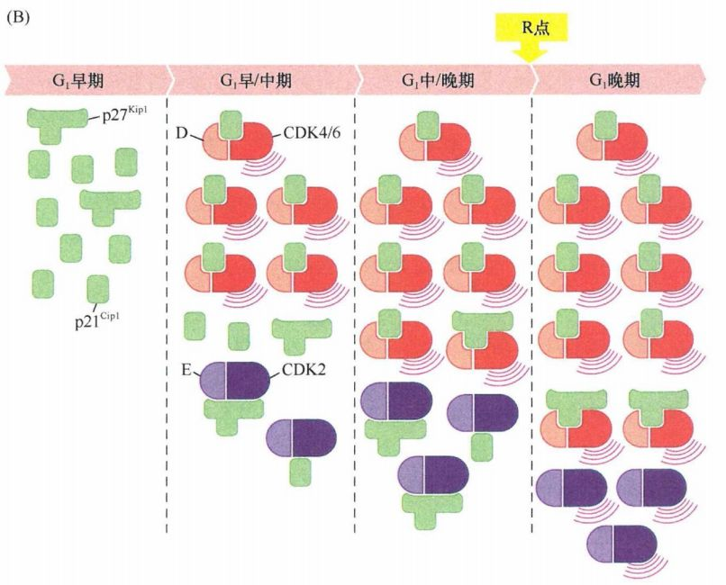

# 第八章 《癌生物学》第八章（1）细胞周期控制时钟

**往期回顾**
 
[《癌生物学》第三章（1）病毒可以引发肿瘤](http://mp.weixin.qq.com/s?__biz=Mzg4NjA5Mzg2Mw==&mid=2247485009&idx=1&sn=bf13fdc034c935e967b24ea8264fae21&chksm=cf9fa719f8e82e0f8dc2a5d07a3040aad5619cccfa12509259840d02b3b7417609c8cc132d3c&scene=21#wechat_redirect)
 [《癌生物学》第三章（2）肿瘤病毒如何在细胞中复制（上）](http://mp.weixin.qq.com/s?__biz=Mzg4NjA5Mzg2Mw==&mid=2247485236&idx=1&sn=38754b14ff13c402137769797c36711b&chksm=cf9fa67cf8e82f6aa90d5232aeabf7b48bbcbc792fc807e0626046ec92f4a341bfd30cd9fd1d&scene=21#wechat_redirect) [《癌生物学》第三章（3）肿瘤病毒如何在细胞中复制（下）](http://mp.weixin.qq.com/s?__biz=Mzg4NjA5Mzg2Mw==&mid=2247485333&idx=1&sn=0748f6670320d8d5796113eb408ba01b&chksm=cf9fa6ddf8e82fcbde1175c3ed490fbcad7db352b2728e7fb0e76b0b2c08683663446d3470d2&scene=21#wechat_redirect) 
[《癌生物学》第四章（1）并非所有肿瘤都由病毒感染引起](http://mp.weixin.qq.com/s?__biz=Mzg4NjA5Mzg2Mw==&mid=2247485497&idx=2&sn=c67ed023b637d16e27bb21037e89edec&chksm=cf9fa971f8e82067c6369e04d6a56afa5c398053f08111a2f46879f990bfee32089bc42ff68b&scene=21#wechat_redirect) 

 
[《癌生物学》第四章（2）细胞原癌基因的激活](http://mp.weixin.qq.com/s?__biz=Mzg4NjA5Mzg2Mw==&mid=2247485625&idx=2&sn=fedd027b1ba76c07ed4d2af0b70069c3&chksm=cf9fa9f1f8e820e75e4bc24e8525b5436213d2ad009187877ca2a5f693573b9f5bb965741fba&scene=21#wechat_redirect)
 
[《癌生物学》第五章（1）生长因子与受体（上）](http://mp.weixin.qq.com/s?__biz=Mzg4NjA5Mzg2Mw==&mid=2247485864&idx=1&sn=9d850e610445822a84b6bd6318734094&chksm=cf9fa8e0f8e821f6e93a3c554138b82030bc5adc8d0e47e111ec3d9f0d8424c29bcd49c100c1&scene=21#wechat_redirect)
 
[《癌生物学》第五章（2）生长因子与受体（中）](http://mp.weixin.qq.com/s?__biz=Mzg4NjA5Mzg2Mw==&mid=2247485893&idx=3&sn=e4b521e3cf4ca5cb85a3686ca8bfbd40&chksm=cf9fa88df8e8219bd3ea563f1eb3fd4917188ae6c71d9a3427d3dcc30e1ffaadbafaf744c2fb&scene=21#wechat_redirect)
 
《癌生物学》第五章（3）生长因子与受体（下）
 
[《癌生物学》第六章（1）酪氨酸磷酸化的调控作用](http://mp.weixin.qq.com/s?__biz=Mzg4NjA5Mzg2Mw==&mid=2247486271&idx=2&sn=1cd38152b98c45961b1b2e95fe30a7d9&chksm=cf9faa77f8e8236176748bdc5a18442cbded1d791b7a49db5f7a64076215dab2a339f6ecf2d8&scene=21#wechat_redirect)
 
[《癌生物学》第六章（2）Ras下游3条重要的信号通路](http://mp.weixin.qq.com/s?__biz=Mzg4NjA5Mzg2Mw==&mid=2247486293&idx=2&sn=9ffda5507d1a485d9b3f289333c71af8&chksm=cf9faa1df8e8230bf23de9c88af7810c8454a6b9838d40c23cad3074d99ff397bb56e5c1b6bd&scene=21#wechat_redirect)
 
[《癌生物学》第六章（3）细胞内其他信号网络](http://mp.weixin.qq.com/s?__biz=Mzg4NjA5Mzg2Mw==&mid=2247486528&idx=1&sn=d46485bf93b08b6ca5f6a52106ce18cd&chksm=cf9fad08f8e8241e16e7d85e350239210c93e196fa16593113968c79457f0f9dfed86d3aa845&scene=21#wechat_redirect)
 
[《癌生物学》第七章（1）  抑癌基因与肿瘤细胞表型](http://mp.weixin.qq.com/s?__biz=Mzg4NjA5Mzg2Mw==&mid=2247486664&idx=1&sn=52597f9e0e4f0027c3bfc4c17954eba0&chksm=cf9fad80f8e824965ed77e0a87f16cb145e8ec9b80f3c4597624f7ea84882af22653207a8437&scene=21#wechat_redirect)
 
[《癌生物学》第七章（2）  抑癌基因的发现与探索](http://mp.weixin.qq.com/s?__biz=Mzg4NjA5Mzg2Mw==&mid=2247486671&idx=2&sn=18afb1b90118fc8ce0521c9f10a73d16&chksm=cf9fad87f8e8249117a3d1e0395cfabbda447a5a4410d4a9ff913043bee26d6ec8899e4aceb3&scene=21#wechat_redirect)
 
[《癌生物学》第七章（3） 抑癌基因的作用实例](http://mp.weixin.qq.com/s?__biz=Mzg4NjA5Mzg2Mw==&mid=2247486678&idx=2&sn=91703b8b6417578486ac512a09a064d2&chksm=cf9fad9ef8e82488061f0150a628ffa88f89b81d7f3155c0797ec2c4b4aef0a12bbd9db66ed8&scene=21#wechat_redirect)
 

 

 
前言：经过前几章的学习，相信我们的小伙伴已经认识到，做人不容易，作为一个小小的细胞也是“鸭梨山大”呀！面对这错综复杂的信号和通路，每天都是批不完的“公文”！那么细胞是不是也像人一样，有个像“大脑”一样的“总司令”呢？答案是有的！它就是我们这一章节的主角—— **“ 细胞周期控制时钟 ”** ！
 

 
功能各异的信号可以被细胞表面受体收集并传递给细胞质中复杂的信号处理通路，这些混杂的信号必须以某种方式处理、整合，最终形成简单的、二元的 命令，如决定细胞是继续增殖还是保持休眠，或者决定静止细胞是否进行分化。这些生物学行为提示，在细内部存在一些中央行动调节器——一种专门的信号交换所，接收各种输入信号并做出重要的指令从而决定相关细胞的命运。目前这些重要的调节器已经鉴定，它们在细胞核中发挥细胞周期时钟的作用。当然，这个 “时钟”并不能用来计算时间，这些细胞周期时钟是一些相互作用的蛋白质网络，它们接收胞内和胞外的各种不同来源的信号，对其进行整合后决定细胞的命运。
  
图1：细胞周期时钟
 

 
**No.1**
 
**细胞周期**
 

 
一个经过细胞分裂新近生成的子代细胞， 必须马上决定是否进入下一个新的生长-分裂周期，或者退回到非生长状态，即G 0 期。要维持在活跃的生长-分裂周期中，需要这些细胞即刻开始准备进入下一次分裂。这些准备必须包括细胞内大分子成分的复制，以确保下次分裂形成的两个子代细胞能够获得相等的成分。这种细胞成分的累积导致细胞体积增加的过程，为细胞的生长过程。而细胞的分裂过程是指通过有丝分裂和胞质分裂，一个亲本细胞形成两个子代细胞的过程。
 
在大多数哺乳动物细胞中，RNA 与蛋白质的累积在细胞分裂之后立即开始并且持续整个细胞分裂周期。与之不同的是，在细胞有丝分裂和胞质分裂形成子代细胞之后的几小时内才开始 DNA 复制 (12~15h) 。这个子代细胞形成与 DNA 开始复制的间隙被命名为细胞周期的G 1 期（第一个间隙）。在这一时期里，细胞要做出继续生长还是维持静止的决定；对于静止细胞，则要决定细胞是否开始分化。G 1 期后的DNA合成通常要6~8h, 这一DNA合成期被称为S期。随后，大多数哺乳动物细胞在进入M期之前都有一个3~5h的延迟，这是细胞周期中的第二个间隙，称为G 2 期，细胞为进入M期和细胞分裂做准备。M期的完成通常大约需要1h, 包括4个独立的亚期：前期、中期、后期、末期，并最终完成胞质分裂，形成两个新的子代细胞。
  
图2：细胞周期
 

 
细胞周期中每一步的执行都有可能发生故障，而细胞周期对细胞的重要作用要求细胞周期的每一步都准确无误。因此，细胞还需要具有一系列的监控机制来监督细胞周期的每一步，保证在上一步成功完成之后细胞周期才能进入下一步。如果细胞周期中特定的步骤发生错误，监控机制就会马上中止细胞周期的进程，直到这个错误被修正。还有的监控机制用于确保某些特定的步骤在一个细胞周期中完成后就不再重复，直到细胞进入下一个细胞周期，这些监控机制被命名为检验点(checkpoint) 或检验点调控 (checkpoint control)。
 
细胞周期中的检验点举例如下：
 
①细胞在完成G 1 期各步骤之前不能进入S期；
 
②所有染色体DNA复制完成之前细胞将被阻滞进入G 2 期；
 
③中期的有丝分裂纺锤体与所有染色体正确组装之前，细胞将不能进入有丝分裂后期（成对的姐妹染色单体分离）；
 
④如果细胞的DNA受损而没有被修复，细胞将不能进入S期或M期；
 
⑤在G 2 晚期，解链监测点能阻止细胞进入M期，直到前面S期复制的DNA完成解螺旋。
 

 
**No.2**
 
**G 1 期特定时相决定细胞生长/维持静止**
 

 
机体内几乎所有正常细胞都需要外部信号的调控，如细胞在生长和分裂前都需要促有丝分裂生长因子转化的信号剌激。唯一例外的例子是非常早期的胚胎细胞，它们能够不接受特异的生长刺激而持续增殖。
 
细胞受控于其周围的胞外环境以及活跃细胞周期的特定时间窗内的生长调控信号，具体来说， **活跃细胞周期的特定时间窗内是指从G** **1** **期开始直至G** **1** **/S期转换前的1h或2h。** 如果在G 1 期完成的80%~90%以前撤除培养细胞的血清和生长因子，这些细胞将不能继续完成剩余的细胞周期，它们将极有可能返回到G 0 期的状态；然而，一旦细胞度过了G 1 期的生长决定时限进入G 1 期的最后几小时(G 1 期最后的10%~20%), 再撤除培养血清将不能影响它们的生长进程，它们将完成剩下的G 1 期并最终通过S期、G 2 期、M期。同样，有丝分裂抑制因子，如 TGF-β，也只能在G1期的早期和中期发挥作用；一旦细胞进入G1期晚期，细胞的生长就如其周围没有负调节因子一样。
 
细胞周期进入G 1 期晚期前完全依赖于细胞外信号，然后成为信号相对非依赖的状态，这种规律表明决定细胞在接近G 1 期晚期的时候必须做出关键性决定——是否停留在 G 1 期、退出细胞周期而进入G 0 期、还是是加速进入G 1 期晚期从而继续细胞周期进程完成后面的时相。这一关键的转换点被称为检验点或 **R点** 。R点发生在G 1 /S 期转化前的几小时。
  
图3：限制点（R点）
 

 
如果细胞在R点决定继续完成其生长分裂周期，那么它们将自主通过G 1 期进入S期并且严格完成周期中的一系列事件（整个S期、G 2 期和M期）。即使在其后的周期时相中细胞外环境不存在生长因子，这个决定也将持续完成。
 
但这一个模式也并不是绝对的，在S期、G 2 期、M期介入的代谢性、遗传性或者生理性损伤都有可能暂时中断细胞周期的进程，直到这些损伤解除或修复。然而在许多情况下，活体组织中的细胞能够成功避免这些损伤作用。所以R点成为决定细胞是否生长的关键决策点。此外，G 1 期晚期的其他决策点仍然对一些肿瘤的异常增殖发挥作用。其中作用非常显著的一个决策点是哺乳动物细胞在R 点之后至G 1 /S 期过渡之前需要监测他们与细胞外基质的黏附情况。
 

 
**No.3**
 
**细胞周期时钟的核心组件 
**
 

 
细胞周期时钟是一些相互作用的蛋白质网络，其中最核心的组件就是： **细胞周期蛋白(cyclin)** 和 **细胞周期蛋白依赖性激酶(cyclin dependent kinase,CDK)** 。
 
参与细胞周期调控机制的蛋白激酶统称为细胞周期蛋白依赖性蛋白激酶。这些蛋白激酶不能依靠自身发挥作用，而必须与细胞周期蛋白相互结合才能发挥正常功能。CDK 与其相应的细胞周期蛋白配体构成双分子复合体参与细胞周期时钟的信号向下游传递给效应分子，推动细胞生长-分裂周期的运行。
 
CDK是丝氨酸/苏氨酸激酶。细胞周期蛋白与CDK的结合激活了激酶的催化活性。与此同时，细胞周期蛋白还具有导向作用，有助于细胞周期蛋白-CDK 复合体在细胞中正确识别蛋白底物。
 

 
**CDK与cyclin在细胞周期中的作用：**
 
① 在 G 1 期的大部分时间段内，两个功能类似的 CDK( CDK4和CDK6 )与3个细胞周期蛋白( D1、D2、D3 ) 相互作用并由其定位至相应部位，这3个细胞周期蛋白统称为 D型细胞周期蛋白 。
 
② G 1 期晚期的R点之后， E型细胞周期蛋白 (E1、E2) 与 CDK2 结合并磷酸化进入S期所需的适当底物。
 
③ 随着细胞进入S期， A型周期蛋白 (A1和A2) 代替E型细胞周期蛋白与 CDK2 结合，从而保证S期的进程。
 
④S后期， A型细胞周期蛋白 与 CDK2 解离并重新结合其他 CDK, 此复合体被称为 CDC2 或者CDK1(本书用CDC2) 。
 
⑤ 进入G 2 期后， CDC2 中的A型细胞周期蛋白被 B型细胞周期蛋白 (B1和 B2) 所替代。最终，从 M 期开始，B 型细胞周期蛋白参与的CDC2复合体触发了有丝分裂复杂过程的前期、中期、后期、末期等许多事件。
 
⑥ 另一对 cyclin-CDK 复合体—— cyclin C-CDK3 参与了细胞从G0期进入G1期的转换，目前对其知之甚少。
  
图4：cyclin与CDK的配对
 

 
各种cyclin-CDK复合体的激活必须是可以调节的，以强化对细胞周期特定时相的调控 。其中最重要的调控手段就是改变细胞周期的各个时相中 **细胞周期蛋白** 的表达水平和效率 。而几乎所有的CDK表达水平变化很小。
 
研究结果显示，B型细胞周期蛋白的蛋白水平在有丝分裂之前显著升高，cyclinB与CDC2 形成复合体，促使细胞进入M期。在M期未，该蛋白的降解导致cyclinB的水平迅速下降。在下一个细胞周期的早期，细胞中的cyclinB几乎检测不到，到下一个M期之前 cyclinB又开始逐步累积。cyclinB水平随细胞周期显著性变化的现象在其他细胞周期蛋白上也有发生。cyclinE水平在大多数G 1 期都较低，在细胞通过R点后显著升高，而在细胞进入S期后下降。同时，cyclinA 随着细胞进入S期开始表达升高。
  
图5：细胞周期中细胞周期蛋白水平的变化
 

 
各种细胞周期蛋白随着细胞周期时相的变化而快速地改变，是因为它们能够被快速降解，其降解主要是通过泛素化途径进行的。多聚泛素链能介导蛋白酶体中的蛋白水解作用。细胞周期蛋白的快速降解及之后的逐渐累积可以引导细胞周期时钟只向一个方向发展。以cyclinB为例，它保证细胞在完成M期之后不能返回重复进行另一个M期，而只能继续向前通过G 1 期、S期、G 2 期，直到cyclinB累积到必需的水平，细胞才能再次进入M期。
 
在此程序性变化的细胞周期蛋白中唯一的特例就是cyclinD。cyclinD 的3个亚型具有相似的结构，它们的蛋白质水平在细胞生长分裂周期各时相中并没有明显的变化。相反，cyclinD 的水平主要受控于细胞外信号，尤其是由多种促有丝分裂生长因子传递的信号。生长因子激活的酪氨酸激酶型受体及其下游的多级信号传递可导致cyclinD1的快速累积。相反，从细胞培养基中撤除生长因子，将导致 cyclinD1水平的快速下降。所以，cyclinD不断向细胞周期时钟传递细胞外环境的信号变化。
  
图6：细胞周期蛋白表达水平调控
 

 
细胞质中合成的cyclinD在转运进入至细胞核后，与相应CDK (CDK4和CDK6) 相互结合形成复合体。由于这两个CDK功能相似，此后就用CDK4/6 指代。cyclinD-CDK4/6 复合体具有相同的酶活性和底物特异性，与cyclinD的亚型无关（不论D1、D2、D3) 。这些看似兀余的细胞周期蛋白使细胞的输入信号更加准确，并增加了反应的灵活性。这3个编码基因的各自启动子受不同的信号通路调控，因此基因的表达受不同的细胞表面受体调控。
 
cyclinD1的启动子（在人类中通常指CCND1) 具有AP-1、Tcf/Lef 和 NF-κB 转录因子的结合点, 它们能依次被多种生长因子受体激活；而 cyclinD2 的启动子与 Myc 的活化及胞外信号导致的胞内cAMP累积相关；cyclinD3与转录因子STAT3和STAT5相关，这两个转录因子参与由白细胞介素受体介导的多种造血细胞活化，而参与激活淋巴细胞分化的转录因子E2A也能调控cyclinD3的表达。
 
一旦cyclinD-CDK4/6复合体形成，它们将使细胞从G 1 期开始通过R点。一旦细胞通过R点，细胞周期将会自主进行，不受细胞外信号的影响。在随后的周期时相中形成的细胞周期蛋白-CDK复合体能够对上个时相中的细胞周期蛋白-CDK复合体产生抑制作用。例如，在S晚期和G 2 早期，cyclinA-CDC2复合体开始激活cyclinB-CDC2, 从而推进细胞进入有丝分裂。而一旦后者被激活，它又反过来抑制cyclinA的合成。
 

 
**No.3**
 
**CDK抑制剂**
 

 
生理信号对细胞周期时钟的影响仿佛只是通过细胞周期蛋白的表达调控实现的。实际上，还存在其他层面的方式调控细胞周期蛋白-CDK复合体的活化。在这些调控方式中最重要的方式来源于一类蛋白，即CDK抑制分子或称为 CKIs。迄今为止，已经发现7种CDK抑制分子能够对抗细胞周期蛋白-CDK 复合体的活化。其中，4 个INK4家族的分子（起先被命名为CDK4抑制分子），能定向结合CDK4和CDK6复合体 ，而对CDC2和CDK2不起作用。这4种抑制分子包括 p16 INK4A 、p15 INK4B 、p18 lNK4C 和p19 INK4D 。另外3个抑制分子是 p21 Cip1 (有时也称为 p21 Waf1 )、 p27 Kip1 、p57 Kip2 , 它 们对细胞周期晚期存在的细胞周期蛋白-CDK复合体具有广泛的抑制作用。
 

  
图7：CDK抑制剂的作用
 

 
这两类CDK抑制分子的作用原理可以通过 p15 INK4B 和 p21 Cip1 - p27 Kip1 这一对分子来阐述。
 
TGF-β能强烈诱导 **p15** **INK4B** 的表达，并且对 p21 Cip1 也有一定的诱导作用，其中，前者能够阻断cyclinD-CDK4/6 的反应，后者能够影响细胞周期中其他cyclin-CDK复合体的活化。如果没有活化的cyclinD-CDK4/6, 细胞将不能通过G1早期和中期到达R点。一旦细胞通过了R点，细胞将不再依赖cyclinD-CDK4/6 的作用。这或许可以解释为什么TGF-β在G 1 早期和中期只有生长抑制作用，而当细胞通过R点后其生长抑制作用将部分甚全全部丧失。
  
图8：TGF-β对细胞周期的调控
 

 
**p21 Cip1** 是一种广泛的CDK抑制分子，也能够被 TGF-β诱导，但诱导作用较弱。各种生理性应激反应可能导致 p21 Cip1 水平升高，这具有很重要的意义。一旦 p21 Cip1 达到一定水平，它就能够在细胞周期的多个时段阻断其进程。所有应激中最严重的是细胞基因组的损伤。在基因组DNA持续非修复状态的悄况下，DNA 一旦受到损伤，只要基因组还处在未修复状态，被诱导表达的 p21 Cip1 将降低已经形成的cyclin-CDK复合 体的活性，如cyclinE-CDK2、cyclinA-CDK2、cyclinA-CDC2、cyclinB-CDC2。一旦DNA的损伤被修复， p21 Cip1 的阻断作用就被解除。这一策略在G 1 期具有特殊的意义：如果这一时期细胞的基因组被诱变剂损伤， p21 Cip1 将阻止细胞通过R点（通过抑制细胞周期蛋白E-CDK2复合体），以保证细胞不能进入S期，直至DNA损伤被修复，使得受损的DNA 序列不会被复制。而且， p21 Cip1 能抑制一种被称为PCNA的DNA复制关键组件的功能，这一功能能够保证已经开始的 DNA 复制的中止， 直到 DNA 损伤修复完成。
 

 
促细胞分裂剂能够发挥与CDK抑制分子相反的作用，推进细胞周期进程。它们的作用机制是依靠磷脂酰肌醇 3-激酶 (PI3K) 通路。PI3K能直接或间接地被促细胞分裂剂激活，进而激发许多酪氨酸激酶受体。Akt/PKB是一种重要的激酶，它能被促细胞分裂剂活化的PI3K激活。既而Akt/PKB能磷酸化位于细胞核中的 p21 Cip1 ，促进其从细胞核转运全细胞质，而到达细胞质中的 p27 Kip1 将不能对细胞周期蛋白-CDK复合体产生抑制作用。同样，Akt/PKB 能够磷酸化 p27 Kip1 (其功能与 p21 Cip1 类似），并抑制 p27 Kip1 从其合成的细胞质部位转运到细胞核，而 p27 Kip1 通常在细胞核中才能发挥其关键作用。
  
图9：PI3K通路对细胞周期的影响
 

 
p21 Cip1 与 p27 Kip1 存在一种看似很矛盾生物学行为，当它们抑制cyclinE-CDK2、cyclinA-CDC2、cyclinB-CDC2作用的同时，其又促进了cyclinD-CDK4/6 复合体的形成。而且，即使 cyclinD-CDK4/6 与其中任一抑制分子结合形成三元复合体， cyclin-CDK 复合体仍然能磷酸化它的正常底物。因此，所谓的 "CDK 抑制分子”实际上是一个误称 。这两个蛋白质 p21 Cip1 与 p27 Kip1 对大多数细胞周期蛋白-CDK 复合体具有抑制作用，但是它们对cyclinD-CDK4/6具有激活作用。
  
图10： p21 Cip1 与p27 Kip1 激活cyclinD-CDK4/6，抑制cyclinE-CDK2
 

 
当细胞处在G 1 期时， p27 Kip1 累积并结合细胞内为数不多的cyclinE-CDK2, 这种结合能抑制复合体的活性。当细胞受到生长因子的作用时，由于促细胞分裂剂能够提高细胞中D型周期素的水平，cyclinD-CDK4/6 开始累积。每当新的 cyclinD-CDK4/6 复合体形成时，它就会结合一个 p27 Kip1 分子。随着越来越多 p27 Kip1 被cyclinD-CDK4/6复合体捕获，导致细胞中游离的 p27 Kip1 减少。几小时后，剩余的 p27 Kip1 分子终于从 cyclinE-CDK2复合体上解离。一旦cyclinE-CDK2复合体解除了 p27 Kip1 的作用，这复合体就能推进细胞通过 R点。最初被激活的cyclinE-CDK2复合物触发了一个自我维持的正反馈循环，导致 p27 Kip1 分子发生降解，同时增加新的cyclinE的分子合成。结果是功能性cyclinE-CDK2复合物迅速上升以及基本不可逆地通过R点。
  
图11： p27 Kip1 的特殊生物学行为
 

 
今天主要介绍了细胞周期控制时钟的基本机制，下一节会接着介绍抑癌基因Rb对细胞周期进程的作用~
 

 参考书目： 《The Biology of Cancer》（Second Edition）  R.A.Weinberg  著，詹启敏 等  译 编辑： 张月明 周健 
 校审： 张健 罗鹏 

 

 
 ***欢迎点击下方图片进行留言，说出你的看法哦~***
 
