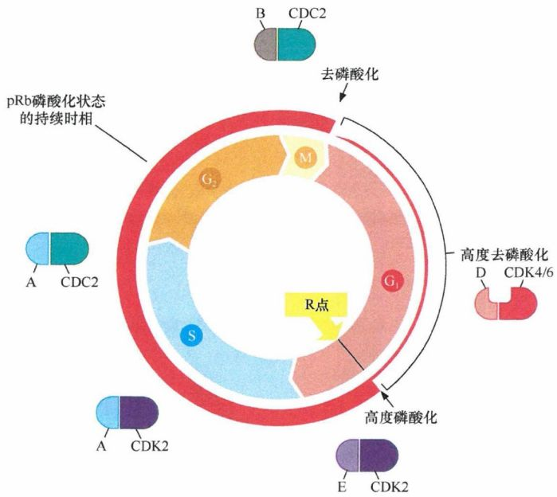
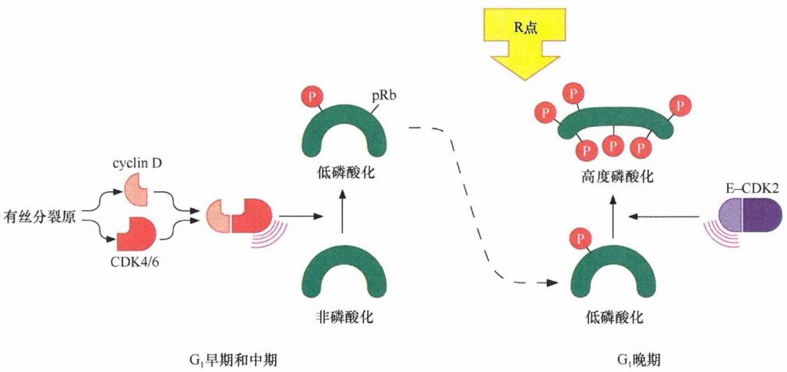
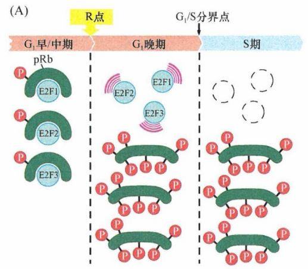
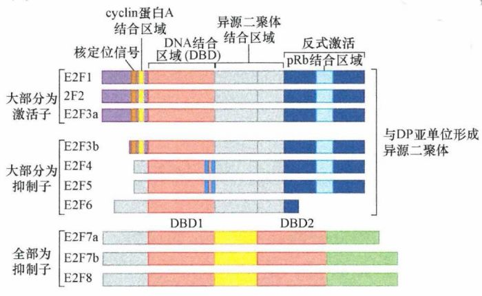
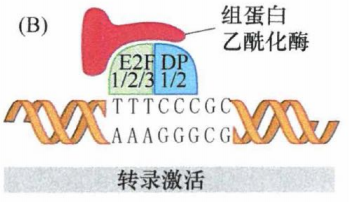
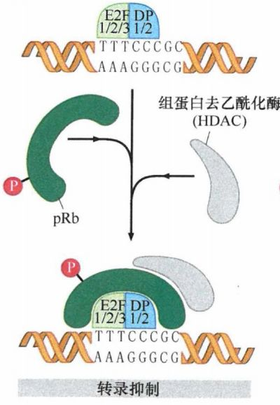
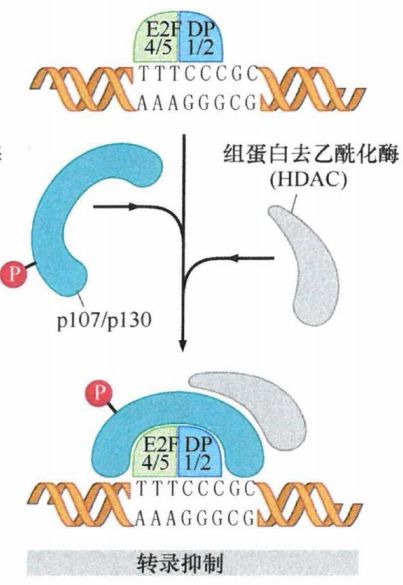
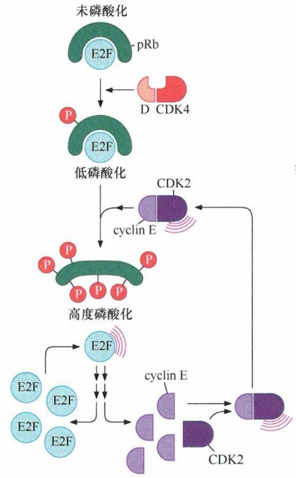
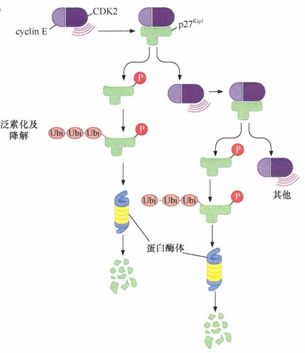
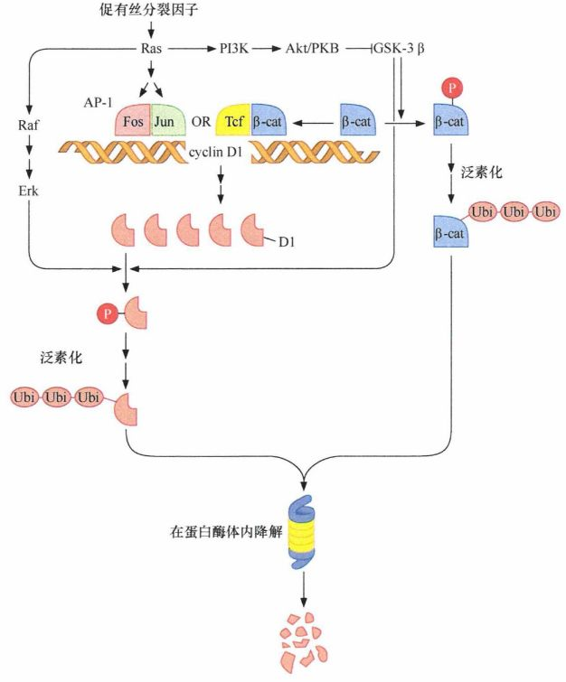

# 第八章 《癌生物学》第八章（2）pRb在细胞周期时钟中的作用

**往期回顾**
 
[《癌生物学》第三章（1）病毒可以引发肿瘤](http://mp.weixin.qq.com/s?__biz=Mzg4NjA5Mzg2Mw==&mid=2247485009&idx=1&sn=bf13fdc034c935e967b24ea8264fae21&chksm=cf9fa719f8e82e0f8dc2a5d07a3040aad5619cccfa12509259840d02b3b7417609c8cc132d3c&scene=21#wechat_redirect)
 [《癌生物学》第三章（2）肿瘤病毒如何在细胞中复制（上）](http://mp.weixin.qq.com/s?__biz=Mzg4NjA5Mzg2Mw==&mid=2247485236&idx=1&sn=38754b14ff13c402137769797c36711b&chksm=cf9fa67cf8e82f6aa90d5232aeabf7b48bbcbc792fc807e0626046ec92f4a341bfd30cd9fd1d&scene=21#wechat_redirect) [《癌生物学》第三章（3）肿瘤病毒如何在细胞中复制（下）](http://mp.weixin.qq.com/s?__biz=Mzg4NjA5Mzg2Mw==&mid=2247485333&idx=1&sn=0748f6670320d8d5796113eb408ba01b&chksm=cf9fa6ddf8e82fcbde1175c3ed490fbcad7db352b2728e7fb0e76b0b2c08683663446d3470d2&scene=21#wechat_redirect) 
[《癌生物学》第四章（1）并非所有肿瘤都由病毒感染引起](http://mp.weixin.qq.com/s?__biz=Mzg4NjA5Mzg2Mw==&mid=2247485497&idx=2&sn=c67ed023b637d16e27bb21037e89edec&chksm=cf9fa971f8e82067c6369e04d6a56afa5c398053f08111a2f46879f990bfee32089bc42ff68b&scene=21#wechat_redirect) 

 
[《癌生物学》第四章（2）细胞原癌基因的激活](http://mp.weixin.qq.com/s?__biz=Mzg4NjA5Mzg2Mw==&mid=2247485625&idx=2&sn=fedd027b1ba76c07ed4d2af0b70069c3&chksm=cf9fa9f1f8e820e75e4bc24e8525b5436213d2ad009187877ca2a5f693573b9f5bb965741fba&scene=21#wechat_redirect)
 
[《癌生物学》第五章（1）生长因子与受体（上）](http://mp.weixin.qq.com/s?__biz=Mzg4NjA5Mzg2Mw==&mid=2247485864&idx=1&sn=9d850e610445822a84b6bd6318734094&chksm=cf9fa8e0f8e821f6e93a3c554138b82030bc5adc8d0e47e111ec3d9f0d8424c29bcd49c100c1&scene=21#wechat_redirect)
 
[《癌生物学》第五章（2）生长因子与受体（中）](http://mp.weixin.qq.com/s?__biz=Mzg4NjA5Mzg2Mw==&mid=2247485893&idx=3&sn=e4b521e3cf4ca5cb85a3686ca8bfbd40&chksm=cf9fa88df8e8219bd3ea563f1eb3fd4917188ae6c71d9a3427d3dcc30e1ffaadbafaf744c2fb&scene=21#wechat_redirect)
 
《癌生物学》第五章（3）生长因子与受体（下）
 
[《癌生物学》第六章（1）酪氨酸磷酸化的调控作用](http://mp.weixin.qq.com/s?__biz=Mzg4NjA5Mzg2Mw==&mid=2247486271&idx=2&sn=1cd38152b98c45961b1b2e95fe30a7d9&chksm=cf9faa77f8e8236176748bdc5a18442cbded1d791b7a49db5f7a64076215dab2a339f6ecf2d8&scene=21#wechat_redirect)
 
[《癌生物学》第六章（2）Ras下游3条重要的信号通路](http://mp.weixin.qq.com/s?__biz=Mzg4NjA5Mzg2Mw==&mid=2247486293&idx=2&sn=9ffda5507d1a485d9b3f289333c71af8&chksm=cf9faa1df8e8230bf23de9c88af7810c8454a6b9838d40c23cad3074d99ff397bb56e5c1b6bd&scene=21#wechat_redirect)
 
[《癌生物学》第六章（3）细胞内其他信号网络](http://mp.weixin.qq.com/s?__biz=Mzg4NjA5Mzg2Mw==&mid=2247486528&idx=1&sn=d46485bf93b08b6ca5f6a52106ce18cd&chksm=cf9fad08f8e8241e16e7d85e350239210c93e196fa16593113968c79457f0f9dfed86d3aa845&scene=21#wechat_redirect)
 
[《癌生物学》第七章（1） 抑癌基因与肿瘤细胞表型](http://mp.weixin.qq.com/s?__biz=Mzg4NjA5Mzg2Mw==&mid=2247486664&idx=1&sn=52597f9e0e4f0027c3bfc4c17954eba0&chksm=cf9fad80f8e824965ed77e0a87f16cb145e8ec9b80f3c4597624f7ea84882af22653207a8437&scene=21#wechat_redirect)
 
[《癌生物学》第七章（2） 抑癌基因的发现与探索](http://mp.weixin.qq.com/s?__biz=Mzg4NjA5Mzg2Mw==&mid=2247486671&idx=2&sn=18afb1b90118fc8ce0521c9f10a73d16&chksm=cf9fad87f8e8249117a3d1e0395cfabbda447a5a4410d4a9ff913043bee26d6ec8899e4aceb3&scene=21#wechat_redirect)
 
[《癌生物学》第七章（3） 抑癌基因的作用实例](http://mp.weixin.qq.com/s?__biz=Mzg4NjA5Mzg2Mw==&mid=2247486678&idx=2&sn=91703b8b6417578486ac512a09a064d2&chksm=cf9fad9ef8e82488061f0150a628ffa88f89b81d7f3155c0797ec2c4b4aef0a12bbd9db66ed8&scene=21#wechat_redirect)
 
[《癌生物学》第八章（1）细胞周期控制时钟](http://mp.weixin.qq.com/s?__biz=Mzg4NjA5Mzg2Mw==&mid=2247486926&idx=1&sn=7e75e170b8cc007c97c6099d87a1d035&chksm=cf9fac86f8e82590d558ea1b4ed630891adcf34923053b0f09c9aaa5132fdcc2c2f9c8c96ab2&scene=21#wechat_redirect) 

 

 
前言：在第七章的学习中，我们已经知道 *Rb* 是一个肿瘤抑制基因，该基因编码一个约105kDa的磷酸化核蛋白，这个蛋白被称为pRb或RB, 在多种肿瘤细胞中都发现该蛋白质的缺失或结构缺陷。 在肿瘤细胞中 pRb 功能受损的两条途径：在视网膜母细胞瘤、骨肉瘤和小细胞肺癌中 Rb 基因的突变会使 pRb 丧失功能；在感染并转化了人乳头瘤病毒 (HPV) 的细胞中也会出现同样的现象 。 在这一小节，我们就要来揭秘 **pRb** 在细胞周期进程中的作用。
 

 
**No.1**
 
**pRb在细胞周期中的变化**
 

 
已有的实验结果显示，pRb的磷酸化与细胞周期的进程相一致。在G 0 期，pRb基本是非磷酸化状态；进入G 1 期后，pRb上少量的丝氨酸/苏氨酸残基开始磷酸化（低磷酸化）；细胞通过R点后，pRb 上大量的丝氨酸/苏氨酸残基被磷酸化（高度磷酸化）。一旦细胞通过R点，pRb在随后的整个细胞周期中就会持续维持磷酸化状态；在细胞完 成有丝分裂后，pRb 上的磷酸化基团被 I 型蛋白磷酸酯酶 (PPl) 水解去除。这些磷酸基团的水解是下一个细胞周期的必需阶段，由此，pRb开始进入下一个磷酸化循环。pRb的高度磷酸化与细胞通过R点的时间相一致，提示这个蛋白质可能是R点转换的分子调节器。
 
在G 1 早期和中期的pRb是低磷酸化状态的，它对细胞的生长起抑制作用；而在R点之后，pRb是高度磷酸化状态，它丧失了生长抑制功能，即蛋白质的磷酸化使其功能失活。这意味着R点转换伴随着pRb的生化改变而完成。
 
pRb的磷酸化是可逆的过程。如果细胞在S期或G 2 期受到生理性应激，磷酸化的pRb可以被目前尚未知的磷酸酶水解，使pRb回到抑制生长的状态。这些应激包括缺氧、DNA 损伤、有丝分裂纺锤体被破坏等。一旦细胞生理应激或损伤被解除，这种反应也将被逆转。
  
图1：pRb的细胞周期依赖性磷酸化
 

 
1988 年的研究揭示了一个关于DNA肿瘤病毒编码蛋白，干扰细胞生长的重要调控机制。人类 5 型腺病毒中E1A癌基因编码蛋白的生化特征表明，在腺病毒感染的细胞中，这种癌蛋白能够紧密结合许多细胞蛋白，其中就包括pRb。随后，在人宫颈癌中发现病毒SV40编码的大T癌蛋白和某些人类HPV病毒编码的E7癌蛋白也能与pRb物理性结合，形成复合物。
 
除了pRb，能够与这些DNA肿瘤病毒编码蛋白结合的还有pRb的两个同源蛋白——p107和p130。pRb和它的两个同源蛋白常常被称为 “口袋蛋白“, 每个蛋白质携带一个可被病毒癌基因如 E1A 插入的沟槽。E1A 蛋白可以结合这 3 种细胞蛋白，并且明显是为了将这三种蛋白捕获隔离。一个病毒感染细胞后需要重置被感染细胞的调控通路，来创建一个支持病毒复制各个步骤的细胞内环境。病毒DNA复制是最重要的环节。显然，病毒只有把这些控制细胞处于静息期的调控蛋白功能失活，使受感染的细胞从G 0 静息静释放进入活跃的细胞周期，DNA才能有效复制。此外，HPV E7 蛋白不仅能直接阻断pRb功能，还能介导pRb的泛素化从而促进其降解。
 
实验还发现，DNA肿瘤病毒编码蛋白能够优先结合低磷酸化的pRb, 而这种低磷酸化的pRb主要出现在G 1 期。相反，这些病毒编码癌蛋白不能结合G 1 晚期及随后的细胞周期中出现的高度磷酸化pRb。这一发现也提示，肿瘤病毒编码蛋白的主要作用于特定状态下的pRb存在于G 1 早期和中期的、起生长抑制作用的pRb, 而对那些已经被其他途径失活的pRb蛋白则不起作用。
 

 
**No.2**
 
**pRb磷酸化状态的调控**
 

 
pRb就像细胞周期时钟的守护者一样，使这条通道保持关闭状态，直到pRb被高度磷酸化而失去生长抑制功能，这扇大门才打开，才能允许细胞进入G 1 晚期及后续的细胞周期时相。
 
既然pRb是监控细胞生长与否的关键分子，那么它的磷酸化必须被严格调控。在G1早期和中期， cyclinD 与其配体 CDK4/6 参与 pRb的起始磷酸化 ，并产生 低磷酸化 的pRb蛋白。而且cyclinD的表达水平在很大程度上受到细胞外信号尤其是促有丝分裂生长因子的调控，故而我们能归纳出这样一条信号通路：生长因子诱导cyclinD的表达；细胞周期蛋白D与CDK4/6相互结合，开始pRb的磷酸化过程。
 
在正常的细胞周期中，pRb的起始磷酸化对于其在R点的功能失活是必需的，但是条件并不充分，因为R点转换需要pRb的高度磷酸化。实际上， cyclinE 的表达水平在R点显著升高，其与配体 CDK2 相互作用能促进pRb磷酸化的完成，使pRb进入 高度磷酸化状态 而功能失活。这意味着不经过cyclinD-CDK4/6的起始磷酸化的pRb将不能成为cyclinE-CDK2复合体的磷酸化底物。pRb的同源蛋白p107和p130的磷酸化和功能失活也在cyclinD-CDK4/6的调控之下，其中或许还包括 cyclinE-CDK2复合体的作用。
  
图2：pRb磷酸化状态的调控
 

 
如果在从G 1 早期到R点的时间段内撤除促细胞分裂剂，cyclinD1的表达水平将大幅度下降。没有 cyclinD1 的情况下，pRb 通过尚未知的磷酸酯酶去除其磷酸基团，结果可能导致pRb蛋白不能成为cyclinE-CDK2的磷酸化底物。这一反应强调了在G 1 早期到R点的时间段内持续较强促细胞分裂信号作用的必需性。
 
细胞一旦通过R点，pRb的高度磷酸化及功能失活状态的维持和加强就主要通过cyclinE、cyclinA、cyclinB及其各自相关的CDK来调控。这些细胞周期蛋白-CDK复合体都不参与细胞外信号反应，这是细胞周期时钟的特征。
 
如果pRb在细胞中缺失（通过染色体上Rb基因突变、Rb基因启动子甲基化，或者DNA肿瘤病毒编码蛋白的作用），那么该蛋白将不再能监控R点。而在其他一些肿瘤细胞中，则失去了正常情况下PPl磷酸酯酶完成的M/G 1 期转换所必需的pRb 去磷酸化过程。这一现象导致pRb持续磷酸化，在细胞的整个生长分裂周期内始终处于功能失活状态 。没有pRb的监控作用，细胞通过G1期进入 S 期将不受控制。
 

 
**No.3**
 
**pRb在细胞周期中的下游机制**
 

 
pRb主要通过一些转录因子(被称为 E2F)完成对细胞周期的调控功能。
 
当pRb(及其同源蛋白p107 和 p130) 处于非磷酸化或低磷酸化状态时，它们能结合E2F, 包括与DNA结合的E2F; 然而，当被高度磷酸化后，pRb和它的同源蛋白从E2F上解离。这提示着：
 
① 在G 1 早期和中期，E2F 结合在它们调控基因的启动子上；同时，这些转录因子与口袋蛋白结合；口袋蛋白参与抑制E2F的转录激活作用，故 在细胞周期的G 1 期依靠E2F转录的基因处于抑制状态；
 
② 当口袋蛋白在G 1 晚期的点被高度磷酸化后，它们与E2F解离，允许E2F激活下游基因的转录，这些基因的蛋白产物随后诱导细胞从G 1 晚期进入S期；
 
③ 当存在病毒来源的癌蛋白时，它们能通过阻止pRb与E2F的结合产生与pRb高度磷酸化同样的后果。
  
图3：pRb与E2F在细胞周期中的相互作用
 

 
那么，E2F是何方神圣？
 

 
E2F由 E2F1~E2F8八个成分组成 ，其中前6个可以和DP1或DP2结合形成异源二聚体转录因子; E2F7和E2F8有两个DNA结合位点(DBD), 可以和DNA结合，但和DP1或DP2亚基无关。一旦二聚体形成，E2F-DP复合体就会识别结合许多基因启动序列中的特异序列元件(TTTCCCGC或此序列的轻度变异体）。
  
图4：E2F的结构和功能
 

 
当E2F结合基因启动序列而缺乏任何相关口袋蛋白（如pRb、p107、p130) 时，E2F (如 **E2F1、E2F2、 E2F3** ) 可以吸引其他蛋白（如组蛋白乙酰化酶），使临近染色质重塑并募集RNA聚合酶以起始转录。
  
图5：E2F1/2/3 激活转录
 

 
当pRb呈低磷酸化状态时，它能够与已经位于基因启动子区的 **E2F1/2/3** 结合（此时 E2F 与多个基因的启动子结合，pRb 与它们结合后也依然能保待这种结合的形式）。一旦与这些E2F结合，低磷酸化的pRb分子能够封闭E2F上的转录活性结构域。同时，pRb 募集其他抑制转录的蛋白。其中重要的途径之一是募集组蛋白去乙酰化酶 (histone deacety lase, HDAC) 到复合体上；HDAC通过水解附近组蛋白分子上的乙酰基团，导致染色体构型重塑使之不适应转录激活。这意味着，除了通过物理性结合阻断与E2F的反式激活结构域，pRb还发挥转录抑制作用。
  
图6：pRb介导的染色体修饰
 

 
**E2F4和E2F5** 主要参与抑制基因表达，它们通过与 p107和p103蛋白共同作用募集转录抑制因子结合到启动子区域，使基因表达下调。 **E2F6、E2F7和E2F8** 不与口袋蛋白结合，能单独作为转录抑制因子发挥作用。
  
图7：p107/p130介导的染色体修饰
 

 
在休眠状态的G 0 期细胞，E2F4和E2F5发生富集（与 p130 大量结合），而几乎不表达在增殖状态的细胞中才会大量表达的E2F1、E2F2和E2F3转录因子。此外，基因水平丢失E2F4和E2F5的细胞中， p16 INK4A CDK抑制剂不能再产生生长抑制效应。这意味着抑制 cyclinD-CDK4/6 复合体及阻断口袋蛋白磷酸化引起的大部分下游效应，是通过这两个E2F与p107、p130 结合来介导的。最终，这种结合将会抑制启动子区含有TTTCCCGC 序列的基因的表达。
 
一旦被高度磷酸化，pRb 将释放E2F1、E2F2和 E2F3复合体，这些 E2F随后募集转录激活蛋白，包括组蛋白乙酰化酶，它能够修饰染色体的构型使之利于转录。在一系列G 1 晚期发生特异表达、并已知或推测出其对进入S期具有重要作用的基因的启动子区都发现含有E2F的结合位点。
 

 
**细胞周期时钟中的正反馈回路** ：
 
① 在E2F激活的基因中最显著的是编码cyclinE和E2F1的基因。因此，通过R点以后cyclinE和 E2F1的mRNA水平迅速上调，蛋白含量也随之增加。因为部分cyclinE能与CDK2作用共同促进pRb的高度磷酸化，所以pRb的失活将引起cyclinE水平的上调， 而cyclinE一旦生成，将进一步使pRb失活。这些通路能够在细胞通过R点时形成一个强大并自我加强的正反馈回路。 

  
图8：正反馈回路
 

 
② 在细胞通过R点的同时还会激活另一种正反馈回路，其机制如下：cyclinE-CDK2复合体使 p27 Kip1 磷酸化，后者一经磷酸化后就迅速发生泛素化降解 。 p27 Kip1 分子降解后将释放cyclinE-CDK2复合体，进而继续磷酸化其他的 p27 Kip1 分子使其失活。
  
图9：正反馈回路
 

 
③ 还有一个正反馈回路是：E2F在R点可提高 Skp2基因的转录，Skp2蛋白能促进 p27 Kip1 降解，从而释放更多被 p27 Kip1 抑制的 cyclinE-CDK2 复合体 。
 
这种正反馈机制可以保证细胞决策能够迅速完成，并确保指令一旦下达便不可逆转。
 

 
E2F1、E2F2和E2F3促进转录活化的时期是非常短暂的。这段时间始于R 点，此时pRb发生高度磷酸化并释放E2F。这3个E2F进而诱导G 1 晚期重要基因表达，这些基因的产物将为细胞进入S 期做准备。当细胞通过G 1 /S过渡期进入S期时，cyclinA被激活并与其配体CDK2共同磷酸化这些异源二聚体转录因子E2F和DP的亚基，导致E2F-DP复合物解离，并丧失其转录激活能力。同时，E2F1 (可能还包含其他 E2F) 发生泛素化降解；具有抑制E2F介导的基因活化能力的E2F7和E2F8开始表达，使细胞进入S期后的基因表达不再依赖E2F。这些改变能有效关闭E2F因子的转录激活作用，而E2F作为转录激活因子的短暂作用时刻仅会在下一次细胞周期的G 1 末期重新出现。
 

 
**No.4** ****
 
**多种有丝分裂信号通路调控pRb的磷酸化状态**
 

 
有丝分裂信号转导通过 **Ras** 使pRb先低磷酸化最终高度磷酸化。这种磷酸化作用的启动是通过诱导编码cyclinD基因的表达来实现，特别是cyclinD1 期。当Ras信号途径被阻断（通过转入显性负效应突变体Ras蛋白）后，血清培养的野生型细胞的增殖被阻断，而缺乏 Ras 作用的突变型Rb -/- 细胞则能照常进入S期。 这说明了在G 1 期间Ras的主要功能是确保配体激活的生长因子受体能成功引发pRb磷酸化及功能失活，进而产生有丝分裂信号释放。 此外，外源过表达cyclinE或E2F1能够绕过显性负效应的Ras蛋白，引起的S期前阻滞。 上述内容揭示了一条直线指令： 生长因子→生长因子受体→Ras→cyclinD1和cyclinE→pRb失活→E2F活化→进入S期。
 

 

 
**Ras→Raf→MAPK 信号通路** ：处于这一信号级联放大的底层有许多Fos家族转录因子，能与Jun蛋白形成复合物，产生异二聚体AP-1转录因子，这些AP-1复合物已知是cyclinD1基因转录的强力激活因子。此外，cyclinD2和cyclinD3启动子具有自己的上游调控因子，并能对胞外信号作出应答。在人类癌细胞中，许多汇聚到这两个基因的启动子的通路信号会出现失控，导致某种cyclinD过表达，引起pRb的异常磷酸化和失活，并发生细胞增殖调控异常。
 
活化后的Ras通过 **磷脂酰肌醇3-激酶 (Pl3K)** 激活 **Akt/PKB激酶** ，后者能使糖原合成酶激酶 3β(GSK-3β)磷酸化失活，该反应利于细胞生长。GSK-3β 的作用是使β-catenin磷酸化，最终导致β-catenin泛素化，并随后在蛋白酶体内降解。然而，PKB/Akt磷酸化使GSK-3β失活，导致β-catenin积累并入核，在核内与Tcf/Lef 形成转录因子复合物，促进合成更多cyclinD1的 mRNA。由于GSK-3β磷酸化也可使cyclinD1蛋白降解, 故 GSK-3β 的失活能进一步上调 cyclinD1 的水平。此外，Wnt 生长因子通过抑制 GSK-3β 的活性可能在细胞周期中也具有类似的功能。
  
图10：多种有丝分裂信号通路调控pRb的磷酸化状态
 

 
今天的学习内容就到这里，下一节会接着介绍 Myc蛋白和TGF-β 在细胞周期中的调控作用~
 

 参考书目： 《The Biology of Cancer》（Second Edition）  R.A.Weinberg  著，詹启敏 等  译 编辑： 张月明 周健 
 校审： 张健 罗鹏 

 
  ***欢迎点击下方图片进行留言，说出你的看法哦~*** 
 
