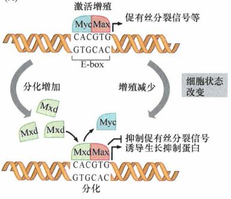
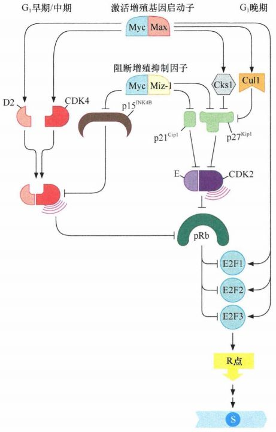
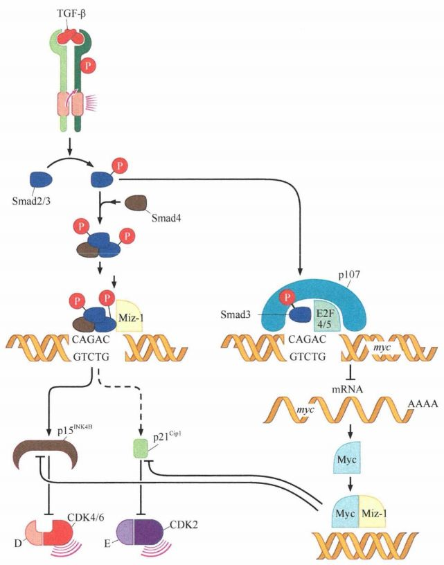
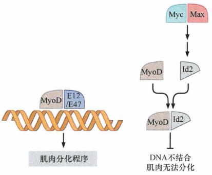

# 第八章 《癌生物学》第八章（3）Myc、TGF-β在细胞周期时钟中的作用

**往期回顾**
 

 
[《癌生物学》第三章（1）病毒可以引发肿瘤](http://mp.weixin.qq.com/s?__biz=Mzg4NjA5Mzg2Mw==&mid=2247485009&idx=1&sn=bf13fdc034c935e967b24ea8264fae21&chksm=cf9fa719f8e82e0f8dc2a5d07a3040aad5619cccfa12509259840d02b3b7417609c8cc132d3c&scene=21#wechat_redirect)
 [《癌生物学》第三章（2）肿瘤病毒如何在细胞中复制（上）](http://mp.weixin.qq.com/s?__biz=Mzg4NjA5Mzg2Mw==&mid=2247485236&idx=1&sn=38754b14ff13c402137769797c36711b&chksm=cf9fa67cf8e82f6aa90d5232aeabf7b48bbcbc792fc807e0626046ec92f4a341bfd30cd9fd1d&scene=21#wechat_redirect) [《癌生物学》第三章（3）肿瘤病毒如何在细胞中复制（下）](http://mp.weixin.qq.com/s?__biz=Mzg4NjA5Mzg2Mw==&mid=2247485333&idx=1&sn=0748f6670320d8d5796113eb408ba01b&chksm=cf9fa6ddf8e82fcbde1175c3ed490fbcad7db352b2728e7fb0e76b0b2c08683663446d3470d2&scene=21#wechat_redirect) 
[《癌生物学》第四章（1）并非所有肿瘤都由病毒感染引起](http://mp.weixin.qq.com/s?__biz=Mzg4NjA5Mzg2Mw==&mid=2247485497&idx=2&sn=c67ed023b637d16e27bb21037e89edec&chksm=cf9fa971f8e82067c6369e04d6a56afa5c398053f08111a2f46879f990bfee32089bc42ff68b&scene=21#wechat_redirect) 

 
[《癌生物学》第四章（2）细胞原癌基因的激活](http://mp.weixin.qq.com/s?__biz=Mzg4NjA5Mzg2Mw==&mid=2247485625&idx=2&sn=fedd027b1ba76c07ed4d2af0b70069c3&chksm=cf9fa9f1f8e820e75e4bc24e8525b5436213d2ad009187877ca2a5f693573b9f5bb965741fba&scene=21#wechat_redirect)
 
[《癌生物学》第五章（1）生长因子与受体（上）](http://mp.weixin.qq.com/s?__biz=Mzg4NjA5Mzg2Mw==&mid=2247485864&idx=1&sn=9d850e610445822a84b6bd6318734094&chksm=cf9fa8e0f8e821f6e93a3c554138b82030bc5adc8d0e47e111ec3d9f0d8424c29bcd49c100c1&scene=21#wechat_redirect)
 
[《癌生物学》第五章（2）生长因子与受体（中）](http://mp.weixin.qq.com/s?__biz=Mzg4NjA5Mzg2Mw==&mid=2247485893&idx=3&sn=e4b521e3cf4ca5cb85a3686ca8bfbd40&chksm=cf9fa88df8e8219bd3ea563f1eb3fd4917188ae6c71d9a3427d3dcc30e1ffaadbafaf744c2fb&scene=21#wechat_redirect)
 
《癌生物学》第五章（3）生长因子与受体（下）
 
[《癌生物学》第六章（1）酪氨酸磷酸化的调控作用](http://mp.weixin.qq.com/s?__biz=Mzg4NjA5Mzg2Mw==&mid=2247486271&idx=2&sn=1cd38152b98c45961b1b2e95fe30a7d9&chksm=cf9faa77f8e8236176748bdc5a18442cbded1d791b7a49db5f7a64076215dab2a339f6ecf2d8&scene=21#wechat_redirect)
 
[《癌生物学》第六章（2）Ras下游3条重要的信号通路](http://mp.weixin.qq.com/s?__biz=Mzg4NjA5Mzg2Mw==&mid=2247486293&idx=2&sn=9ffda5507d1a485d9b3f289333c71af8&chksm=cf9faa1df8e8230bf23de9c88af7810c8454a6b9838d40c23cad3074d99ff397bb56e5c1b6bd&scene=21#wechat_redirect)
 
[《癌生物学》第六章（3）细胞内其他信号网络](http://mp.weixin.qq.com/s?__biz=Mzg4NjA5Mzg2Mw==&mid=2247486528&idx=1&sn=d46485bf93b08b6ca5f6a52106ce18cd&chksm=cf9fad08f8e8241e16e7d85e350239210c93e196fa16593113968c79457f0f9dfed86d3aa845&scene=21#wechat_redirect)
 
[《癌生物学》第七章（1） 抑癌基因与肿瘤细胞表型](http://mp.weixin.qq.com/s?__biz=Mzg4NjA5Mzg2Mw==&mid=2247486664&idx=1&sn=52597f9e0e4f0027c3bfc4c17954eba0&chksm=cf9fad80f8e824965ed77e0a87f16cb145e8ec9b80f3c4597624f7ea84882af22653207a8437&scene=21#wechat_redirect)
 
[《癌生物学》第七章（2） 抑癌基因的发现与探索](http://mp.weixin.qq.com/s?__biz=Mzg4NjA5Mzg2Mw==&mid=2247486671&idx=2&sn=18afb1b90118fc8ce0521c9f10a73d16&chksm=cf9fad87f8e8249117a3d1e0395cfabbda447a5a4410d4a9ff913043bee26d6ec8899e4aceb3&scene=21#wechat_redirect)
 
[《癌生物学》第七章（3） 抑癌基因的作用实例](http://mp.weixin.qq.com/s?__biz=Mzg4NjA5Mzg2Mw==&mid=2247486678&idx=2&sn=91703b8b6417578486ac512a09a064d2&chksm=cf9fad9ef8e82488061f0150a628ffa88f89b81d7f3155c0797ec2c4b4aef0a12bbd9db66ed8&scene=21#wechat_redirect)
 
《癌生物学》第八章（1）细胞周期控制时钟
 
[《癌生物学》第八章（2）pRb在细胞周期时钟中的作用](http://mp.weixin.qq.com/s?__biz=Mzg4NjA5Mzg2Mw==&mid=2247487021&idx=1&sn=5b7c94bc179e2002f3c9a5713b0733c3&chksm=cf9faf65f8e82673762e74e560b7a481ee1561a6845ed2cdcf87ed1cef9427db47c7ad68d437&scene=21#wechat_redirect) 

 

 
前言：在前一节的学习中，我们已经了解了Rb基因在细胞周期中的作用。人类癌细胞会通过多种策略来逃避细胞周期的调控，今天我们就要来学习 **Myc蛋白** 和 **TGF-β** 在细胞周期中的调控作用。
 

 
**No.1**
 
**Myc蛋白调控细胞增殖或分化的方向** 

 

 
Myc 蛋白在调节异常的情况下会成为一种癌蛋白。超过 70% 的人类肿瘤中过度表达Myc (通常称为c-Myc), 或者与其相近的两个同源蛋白N-Myc和L-Myc。Myc癌蛋白家族的功能与我们前面提到的癌蛋白非常不同。其他癌蛋白特别是Ras和Src, 在细胞膜附近作用并引发复杂的级联信号，激活胞内信号转导蛋白，最终激活核转录因子。相比之下，Myc和它的同源蛋白存在于核内，并发挥促生长转录因子的功能。
 
这 3 个Myc家族蛋白属于一个庞大（多于100个成员）的bHLH转录因子家族。它们以共同的三维结构命名。这个三维结构包括一个碱性的 DNA 结合结构域，以及与之相连的一个由氨基酸序列构成的 a 螺旋-环状结构-a 螺旋结构。该转录因子家族成员能与自身或者其他成员形成同源或者异源二聚体。这类二聚体复合物随后与被称为E-box(由CACGTG序列组成）的特异性调控序列所结合，E-box 序列存在于其调控的目的基因的启动子区域。
 
Myc作为转录因子是起促进作用还是抑制作用，不仅仅只由它自身水平决定，还由与它结合的bHLH蛋白水平决定。后者能够增强或者抑制Myc作为转录激活因子的功能。Myc蛋白的磷酸化能调节它的功能及稳定性，当Myc与能促进转录激活的 bHLH 配体Max结合后， **Myc-Max** 异 源二聚体转录因子将有效地促进一群目的基因表达，其中许多基因的产物对细胞周期具有潜在的 **促进细胞增殖效应** 。
 
虽然Myc受有丝分信号的强烈影响，但Max的水平在胞内保持相对稳定。因此，当细胞在血清促有丝分裂剂中培养时，Myc会大量累积；相反的，当移除血清中促有丝分裂剂时，Myc的水平将急剧下降。这意味着 Myc-Max异源二聚体的水平在正常细胞中是由有丝分裂信号所调控的。
 
Myc作为转录因子的功能比较特殊。其他的转录因子可能仅参与转录起始。但是，对于许多基因来说，RNA聚合酶 II 开始转录后，会在一个位于转录起始位点下方约 50bp处的位点暂停。此时，Myc-Max异源二聚体结合到DNA上，与RNA聚合酶 II 复合物发生作用，使其通过暂停位点，并继续转录整个基因，即延伸RNA转录物。如果没有Myc-Max的作用，RNA 聚合酶 II 将停止在该暂停位点。在一项研究中发现 70%活跃转录的基因在这些暂停位点中都有Myc-Max异源二聚体结合。
 
当活跃生长的细胞还没有进入有丝分裂后期的分化状态时，Myc 可以促进细胞增殖并阻断细胞分化。当细胞增殖减缓并开始分化时，因为Mxd蛋白水平升高，替代了复合物中的Myc, Myc-Max复合物解离。后来形成的 **Mxd-Max** 复合物不再刺激转录，使许多人体组织细胞进入 **有丝分裂后期的分化状态** 。
  
图1：Myc蛋白调控细胞增殖或分化的方向
 

 
**No.2**
 
**Myc在细胞周期时钟中的作用**
 

 
Myc 驱动的多种基因表达改变可以通过一种或者其他多种方式推动细胞通过G1期：
 
① Myc的众多靶基因之一是cyclinD2 基因。cyclinD2的高表达会引起pRb的低磷酸化。
 
② Myc还能促进CDK4的基因表达，CDK4表达上调后形成cyclinD-CDK4复合物使pRb低磷酸化，与此同时还能偏离CDK抑制因子 p27 Kip1 进而从抑制作用中释放cyclinE-CDK2 复合物。
 
③ Myc也能促进Cul1蛋白的表达，Cul1蛋白在泛素化降解CDK抑制因子 p27 Kip1 的过程中起到核心作用。
 
④ Myc可以通过与另一个转录因子Miz-1的作用，行使转录抑制因子的功能。Myc 能抑制那些编码CDK 抑制因子 p15 INK4B 和 p21 Waf1 的基因表达，从而抑制 CDK4/6和CDK2的功能。
 
我们即将在后面提到，TGF-β会利用这两种CDK抑制因子来阻止细胞通过G 1 期。因此，Myc 通过抑制这两个CDK抑制因子的表达，对TGF-β的生长抑制功能发挥拮抗作用。这表明即使肿瘤细胞处于存在正常细胞增殖抑制因素的情况下（例如，周围环境存在 TGF-β），还能通过这种重要的方式继续增殖。
 
⑤ Myc能够诱导编码 E2F1、E2F2和E2F3转录因子蛋白的基因表达。通过使这些促生长转录因子在胞内积累，Myc 再次打破平衡，促进细胞增殖。
  
图2：Myc 在细胞周期时钟中的作用
 

 
对果蝇细胞中Myc的功能研究得知，Myc还对许多细胞周期机制以外的其他目标基因起作用。检测这些基因后发现Myc在胞内的广泛效应是促进细胞生长，从视觉上而言就是增加细胞的体积。事实上，Myc 调节的促生长基因数量(包括促进蛋白质合成和整体的能量代谢)超过了Myc作用于细胞周期进程的基因。在癌症的发病机制中，Myc似乎还具有其他的生物学功能，如其在胚胎干细胞 (ES) 中对肿瘤形成的影响。总之，Myc能够调控成千上万个的哺乳动物基因的表达，其在细胞周期进程、细胞生长方面的功能及这里提及的功能都只是它诸多功能的一部分。
 

 
**No.3**
 
**TGF-β引起细胞周期阻滞**
 

 
TGF-β有两种主要作用：一种是抑制肿瘤细胞的生长，另一种是促进肿瘤生长。这两种作用显然互相拮抗。癌细胞往往能够解决这种困境，学习如何逃避 TGF-β的抑制作用却又完整保留另一种作用，如促进肿瘤细胞的侵袭能力。
 
TGF-β具有独特的受体，该受体能利用其胞内结构域（而不是酪氨酸激酶）的丝氨酸/苏氨酸激酶发出信号。这些信号已知的初级靶点是 **Smad转录因子家族** 的蛋白。一对 Smad2 (或Smad3) 蛋白分子一旦在胞质中被 TGF-β受体磷酸化，它将与Smad4蛋白作用（后者并不是受体的磷酸化底物），形成异源三聚体蛋白复合物，入核行使转录因子的功能。
 
TGF-β可直接或间接 **抑制pRb的磷酸化** , 而pRb是决定细胞是否增殖的中心调控分子。在细胞周期调控中，TGF-β最重要的作用靶点是两个编码CDK抑制因子 p15 INK4B 和 p21 Waf1 的基因, 它们的启动子区域中都含有CAGAC, 能募集Smad3-Smad4转录因子的异源三聚体复合物。一个Smad复合物仅靠自身无法激活这些基因的转录，它会与另一个转录因子Miz-1共同作用，Miz-1能够与这两个基因启动子区域的邻近DNA序列结合从而激活转录。而Myc癌蛋白对这两个基因具有相反作用，与Miz-1共同作用阻断这两个CDK抑制因子的诱导表达。
 
**在正常细胞中，TGF-β需要具有决定细胞是否增殖的最终决定能力** 。为此，TGF-β必须能 **抵抗任何Myc释放的信号** 。在正常细胞中，TGF-β可以通过阻断myc原癌基因的表达，使Myc远离 p15 INK4B 和 p21 Waf1 的启动子区域。myc基因启动子上具有一个 TGF-β激活的Smad3 转录因子能够结合的序列。邻近这段序列的是可以被E2F4或 E2F5结合的序列，这两个E2F转录因子能够抑制转录。Smad3通过与E2F4/E2F5 加上p107形成一个三聚体复合物阻断Myc的转录，从而消除细胞调控回路中Myc蛋白的生长促进效应。一旦TGF-β成功地从CDK抑制因子 p15 INK4B 和 p21 Waf1 的启动子区域移除Myc, TGF-β将再利用Smad3-Smd4复合物，协同 Miz-1, 一起激活这两个启动子，诱导这些重要的CDK抑制因子表达。当myc突变为癌基因后，这些基因的启动子结构发生了改变，不再对TGF-β诱导的抑制作用产生反应。
  
图3：TGF-β和Myc的拮抗作用
 

 
**No.4**
 
**癌细胞逃避TGF-β的生长抑制**
 

 
通常情况下，癌细胞极力避免TGF-β的生长抑制作用，却保留对细胞生长有利的其他TGF-β反应。
 
① 逃避 TGF-β介导的生长抑制作用通常是通过失活 pRb 信号通路来实现。如果通过前一节所述的任一机制，使pRb蛋白从调控环路中失活，TGF-β阻滞生长的能力就会被大大地削弱，因为 TGF-β诱导的 p15 INK4B 不能有效地抑制细胞周期的进程。
 
② TGF-β的部分失活，如Smad2/Smad4蛋白编码基因的突变，若缺乏Smad4, 无论是Smad2-Smad4还是Smad3-Smad4复合物都无法形成。这两个复合物是 TGF-β受体派出的、进入细胞核抑制细胞增殖的主要分子。
 
③ Ski 癌蛋白质似乎也能类似地部分削弱TGF-β 诱导的抗有丝分裂反应，该蛋白及其亲缘蛋白Sno都能与Smad3-Smad4转录因子复合体相结合，并阻断后者抑制 *myc* 基因转录的能力。
 
④ 通过失活编码TGF-β受体的基因来关闭其产生的所有反应。例如，绝大部分具有 “微卫星不稳定性”（一种会引起高频突变的状态）的结肠癌存在突变失活的 TGF-β II 受体。
 

 
**No.5**
 
**pRb与Myc蛋白对细胞分化的作用**
 

 
pRb
 
 
在对视网膜的研究中，pRb功能缺陷的视网膜前体细胞会阻止杆状光感受器细胞的正常分化。 

 
相对未分化的肌原细胞能在体外诱导成肌细胞 （肌肉细胞）。通过实验手段提高 p16 INK4A 或者 p21 Waf1 CDK抑制因子的表达水平可以强制阻断肌原细胞在细胞周期G 1 期，引起肌原细胞在不能发生分化的条件下（例如，培养基中高水平的血清生长因子）发生分化。同时缺乏两个Rb基因拷贝并无法表达pRb的遗传修饰小鼠的肌原细胞，对转入 p16 INK4A 或者 p21 Waf1 编码基因引起的分化诱导不能产生响应。此外，在肌原细胞中过表达 cyclinD1 (促进pRb磷酸化及失活）会阻断移除培养基中的生长因子诱导的细胞分化。上述实验都表明 **低磷酸化的 pRb 是停止肌原细胞增殖和促进它们分化成为肌细胞所必需的** 。
 
**调控pRb及其同源蛋白磷酸化状态的机制是细胞分化过程中一个活跃的参与机制。**
 
**
**
 
Myc蛋白
 
 
Myc蛋白是分化和细胞周期之间的重要耦合点。许多调控分化程序的转录因子都是像Myc一样的bHLH转录因子家族的成员。然而， **这些bHLH蛋白的功能与Myc非常不同：它们会调控复杂的、组织特异性的分化程序，而 Myc 作用相反，阻断分化并促进增殖。**
 
Myc能够提高Id1和Id2蛋白水平，后者能作为bHLH转录因子的抑制因子来抑制分化。Id1和 ld2 也属于bHLH转录因子家族的成员 (Id1~Id4) 。Id蛋白能显性负抑制其他 bHLH 转录因子。此外，Id 还能与 bHLH转录因子形成异源二聚体。因为它们缺少DNA识别的结构域，故它们不具有结合DNA的能力。这揭示了为何Id蛋白能作为bHLH 诱导分化转录因子的抑制因子，发挥抑制分化的作用。
 
Id蛋白在许多生长活跃的细胞中表达水平都比较高，降低了这些细胞分化的可能性。例如，一个Id蛋白与MyoD作用，抑制MyoD在生长活跃的肌原细胞中的肌肉分化程序。在正常的分化过程中，Id蛋白的水平会降到极低的水平，MyoD则不受Id的影响，而能够与 bHLH伴侣（称为E12和E47) 形成二聚体来激活肌肉特异性的分化程序。
  
图4：Id 转录因子和分化抑制
 

 
在许多正常细胞中，Id2蛋白被含量丰富的pRb分子抑制。然而，在儿童中相对常见的神经母细胞瘤中，过表达的N-Myc蛋白经常促进ld2的高表达。Id2积累到分子摩尔水平，远远超过(>10X) pRb的程度。因此，pRb无法再抑制并调控细胞中的ld2蛋白。而在某些肿瘤中，这些高度不稳定的Id蛋白的降解被阻断。Id 蛋白的浓度大大提高，从而阻断了细胞分化。
 

 
经过这一章的学习，相信大家对细胞周期时钟和 *Rb* 基因的了解又进了一步，下一章我们会继续深入学习 *p53* 基因，不见不散哟~
 

 参考书目： 《The Biology of Cancer》（Second Edition）  R.A.Weinberg  著，詹启敏 等  译 编辑： 张月明 周健 
 校审： 张健 罗鹏 

 

 
 ***欢迎点击下方图片进行留言，说出你的看法哦~***
 
