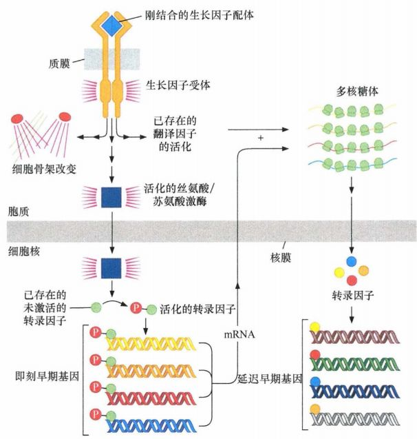
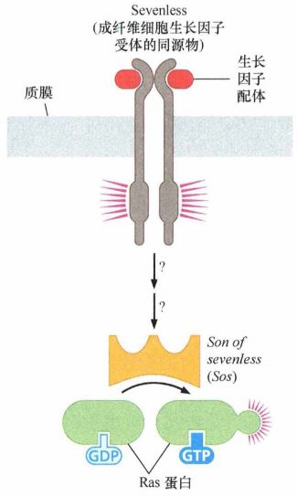
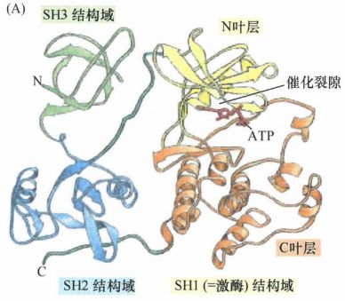
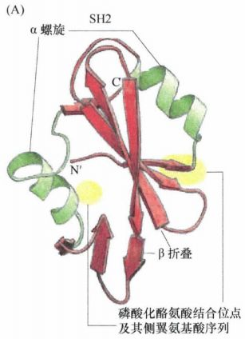
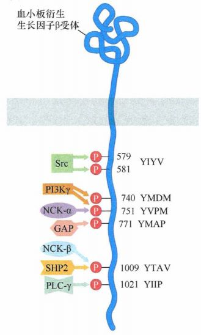
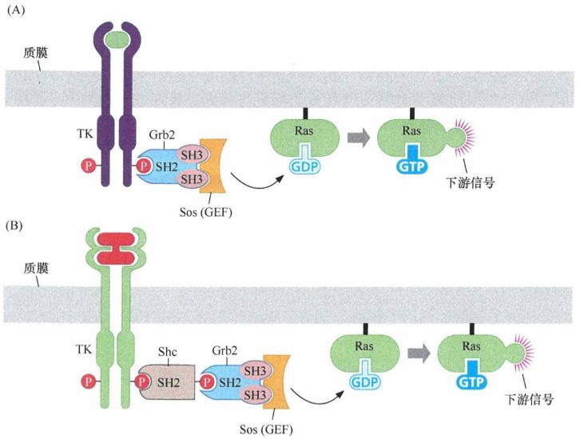

# 第六章 《癌生物学》第六章（1）酪氨酸磷酸化的调控作用

**往期回顾**
 
[《癌生物学》第二章（1） 癌症的起源](http://mp.weixin.qq.com/s?__biz=Mzg4NjA5Mzg2Mw==&mid=2247484770&idx=1&sn=a5144114b3d342408140b8c9ee234d92&chksm=cf9fa42af8e82d3c26681af84e26b7c6361e1275bfdce2edce2c4a3065871c1ce97f0649d3e4&scene=21#wechat_redirect)
 
[《癌生物学》第二章（2） 癌症的发展及其能量代谢](http://mp.weixin.qq.com/s?__biz=Mzg4NjA5Mzg2Mw==&mid=2247484805&idx=1&sn=e97e67056c1d508092127d0388c2eaf6&chksm=cf9fa4cdf8e82ddbaaabda6a2d17d32ec4ab3b7809b97006c79a707f93e35738a7216ba03b4e&scene=21#wechat_redirect)
 
[《癌生物学》第二章（3）癌症的诱因](http://mp.weixin.qq.com/s?__biz=Mzg4NjA5Mzg2Mw==&mid=2247484881&idx=1&sn=bdc85af93a48af8f3c633cbb3b27384d&chksm=cf9fa499f8e82d8f0991b6902435a029254d873ffdc446bc815fddf909f79ca094ce2729135d&scene=21#wechat_redirect)
 
[《癌生物学》第三章（1）病毒可以引发肿瘤](http://mp.weixin.qq.com/s?__biz=Mzg4NjA5Mzg2Mw==&mid=2247485009&idx=1&sn=bf13fdc034c935e967b24ea8264fae21&chksm=cf9fa719f8e82e0f8dc2a5d07a3040aad5619cccfa12509259840d02b3b7417609c8cc132d3c&scene=21#wechat_redirect)
 [《癌生物学》第三章（2）肿瘤病毒如何在细胞中复制（上）](http://mp.weixin.qq.com/s?__biz=Mzg4NjA5Mzg2Mw==&mid=2247485236&idx=1&sn=38754b14ff13c402137769797c36711b&chksm=cf9fa67cf8e82f6aa90d5232aeabf7b48bbcbc792fc807e0626046ec92f4a341bfd30cd9fd1d&scene=21#wechat_redirect) [《癌生物学》第三章（3）肿瘤病毒如何在细胞中复制（下）](http://mp.weixin.qq.com/s?__biz=Mzg4NjA5Mzg2Mw==&mid=2247485333&idx=1&sn=0748f6670320d8d5796113eb408ba01b&chksm=cf9fa6ddf8e82fcbde1175c3ed490fbcad7db352b2728e7fb0e76b0b2c08683663446d3470d2&scene=21#wechat_redirect) 
[《癌生物学》第四章（1）并非所有肿瘤都由病毒感染引起](http://mp.weixin.qq.com/s?__biz=Mzg4NjA5Mzg2Mw==&mid=2247485497&idx=2&sn=c67ed023b637d16e27bb21037e89edec&chksm=cf9fa971f8e82067c6369e04d6a56afa5c398053f08111a2f46879f990bfee32089bc42ff68b&scene=21#wechat_redirect) 

 
[《癌生物学》第四章（2）细胞原癌基因的激活](http://mp.weixin.qq.com/s?__biz=Mzg4NjA5Mzg2Mw==&mid=2247485625&idx=2&sn=fedd027b1ba76c07ed4d2af0b70069c3&chksm=cf9fa9f1f8e820e75e4bc24e8525b5436213d2ad009187877ca2a5f693573b9f5bb965741fba&scene=21#wechat_redirect)
 
[《癌生物学》第五章（1）生长因子与受体（上）](http://mp.weixin.qq.com/s?__biz=Mzg4NjA5Mzg2Mw==&mid=2247485864&idx=1&sn=9d850e610445822a84b6bd6318734094&chksm=cf9fa8e0f8e821f6e93a3c554138b82030bc5adc8d0e47e111ec3d9f0d8424c29bcd49c100c1&scene=21#wechat_redirect)
 
[《癌生物学》第五章（2）生长因子与受体（中）](http://mp.weixin.qq.com/s?__biz=Mzg4NjA5Mzg2Mw==&mid=2247485893&idx=3&sn=e4b521e3cf4ca5cb85a3686ca8bfbd40&chksm=cf9fa88df8e8219bd3ea563f1eb3fd4917188ae6c71d9a3427d3dcc30e1ffaadbafaf744c2fb&scene=21#wechat_redirect)
 
《癌生物学》第五章（3）生长因子与受体（下） 

 

 
**前言：** 在上一章的学习中，我们提到了 Src 和 EGFR 的酪氨酸激酶功能，但是对于酪氨酸磷酸化的具体调控功能没有展开深入的讲解。今天，我们主要的学习内容就是： **酪氨酸磷酸化调控胞内蛋白质信号的定位和功能** 。哈哈，要讲到各种 **信号分子间的相互调控** 啦，一听就不是好惹的“家伙”呢。
 

 
先打个预防针，这一章节的内容可能是整本书最有挑战性的一章了。因此，各种字眼，每个句子的意思，大家可要花费一番不小的心思去 **琢磨** 呢。虽然比较难啃，但是估计也是各位同学最想啃下来的部分了，要加油哦~
 

 
**从细胞表面至细胞核的信号通路**
 
***01***
 

 
暴露于有丝分裂原的细胞，其生长和分裂的改变包含着成千上万种胞内蛋白的协同作用。那么，生长因子是结合并激活它们的受体后发生了什么改变呢？
 
对于这些问题的认识的重要进展来自于 1981 年的实验，即利用撤除生长因子的血清培养正常细胞（使用正常成纤维细胞）的实验。在 “血清饥饿 ”期间，培养的细胞都可逆地进入了不生长的静止状态，称为 G0期。处于 G0 期几天后，“血清饥饿”的细胞又被置于含有新鲜血清中获得充足的有丝分裂生长因子。此实验的目的是将所有的培养细胞都诱导至一个活跃生长和分裂同步的状态。的确，经过 9~12h 后，这些原先静止的细胞大多数开始了 DNA 的复制，几小时后又开始了细胞分裂。
 
在不到 1h 的时间内，100 多种胞内基因即被诱导转录 。这些基因表达被我们称为 **即刻早期基因** (IEG) 的表达，在生长因子剌激不到半小时内就迅速增加。
 
1981 年实验的另一个衍生实验，是用新鲜血清和放线菌酮一起处理细胞。放线菌酮是一种能阻断所有胞内蛋白质合成的物质。尽管抑制了蛋白质合成，即刻早期基因的诱导依然正常进行。这表明在血清加入细胞的时候，激活即刻早期基因的转录所需要的蛋白质就已经就位了。换句话说，这些基因的诱导不需要蛋白质的从头合成。
 
在即刻早期基因 mRNA 诱导 1h 内，第二轮基因诱导表达开始了。这些 **延迟早期基因** 的诱导表达会被放线菌酮有效阻断，表明它们的表达依赖于蛋白质的从头合成（实际上，这些延迟早期基因的表达似乎依赖于即刻早期基因表达出来的转录因子）。
  
图1:即刻早期基因与延迟早期基因
 

 
即刻早期基因编码一些有趣的蛋白质。其中一些是转录因子，它们一旦被合成，就能诱导下一轮基因的表达，包含 myc、fas 和 jun 等最初鉴定的与逆转录病毒转化相关的基因。其他即刻早期基因则编码分泌型细胞因子 (cytokine), 或者编码细胞骨架蛋白。
 
给静止细胞添加生长因子除了能迅速诱导核内基因表达外，还能引起细胞生理上的其他变化。静止细胞暴露于血清后，通过活化一些具有促核糖体起始 mRNA 功能翻译的蛋白质，使胞内蛋白质的合成速率显著增加。一些生长因子可以诱导细胞运动，表现为沿培养皿的底层移动。其他一些生长因子可以引起决定细胞形态的平滑肌肌动蛋白纤维的重组，来协助构建细胞骨架——这是决定细胞形态的支架。还有许多生长因子为细胞存活提供信号，保护细胞不会激活一些不利于细胞生存的反应，如细胞亡之类的自杀程序。
 
这些形形色色的反应表明配体激活生长因子受体后，可发散出一系列不同的生化信号，并且这些信号作用于胞内的不同靶点，代表着这背后肯定有着纷繁复杂的信号转导机制。
 

 
**信号转导的故事从Ras蛋白说起**
 
***02***
 

 
细胞的信号转导通路慢慢地像一个游戏拼图那样被拼凑起来，其中的故事要从 Ras 蛋白开始。在上一章中我们讨论过 Ras 的特点，但并没有表明它是如何与整个信号网络联系起来的。
 
故事起源于研究者发现一个被称为 Sevenless 的基因对组成果蝇复眼的光感原件小眼的正常发育起关键作用。Sevenless 基因编码的蛋白质含有酪氨酸激酶受体普遍存在的结构，即哺乳动物的成纤维细胞生长因子受体。一个名为 Son of sevenless 简称 sos 的基因编码其中一个下游蛋白，并发现 Sos 蛋白与参与激活核苷酸交换的 G 蛋白如 Ras 有关。这些酵母蛋白，通常被称为鸟嘌呤核苷酸交换因子 (GEF), 可通过诱导 G 蛋白释放 GDP, 以便为 GTP 的结合提供位点。这样便可将这些 G 蛋白从无活性状态诱导为活化的、可释放信号的构象。而这个精细的反应是 Sos 作用于 Ras 之后的结果。因此 ，Sos 就是长期以来寻找的可将 Ras 转化为活性状态的上游刺激因子，是调控 Ras 的关键组分。
  
图2：Sos 蛋白
 

 
随后陆续发现了信号级联中的其他中间分子。其中的两个是 Shc 和 Grb2。这些蛋白质的功能是作为接头蛋白，在生长因子受体和 Sos 之间起桥连作用。第三个此类的接头蛋白称为 Crk, 是一种 由 CT10 鸟肉瘤病毒编码的癌蛋白。
 
以上这些结果提示人们有这样一条线性信号级联：酪氨酸激酶受体→Shc→Grb→Sos→Ras。但这些级联只给出了一条信号通路的框架，并未在相互作用的生化方式上说明各种蛋白质间是如何传递信号的。
 

 
**酪氨酸磷酸化的调控作用**
 
***03***
 

 
那么生长因子受体上的酪氨酸残基的磷酸化是怎样向细胞内传递信号的呢？就像我们知道了这条信号级联：酪氨酸激酶受体→Shc→Grb→Sos→Ras，他们的信号又是怎样一步步传递下去的呢？
 
通过对 Src 蛋白结构的分析，研究人员发现了 3 种不同的氨基酸序列结构域，每一 种都既存在于 Src 蛋白中，又存在于其他的无关蛋白质中。这些序列被称为 Src 的同源结构域 l 、2 、3 (SH1、SH2、SH3)。这对于解开受体信号通路这个谜题起到了关键的作用。
  
图3：Src 蛋白结构域的结构
 

 
我们来仔细看看这三种结构域的结构和功能——
 

 

 

 
SH1结构域 

 

 

 
Src 蛋白的 SH1 结构域代表它的催化结构域，并且和 Src 构型相似的所有受体酪氨酸激酶和非受体酪氨酸激酶中都存在相似的结构域。如图3所示，SH1 的催化结构包含两部分—— N 端和 C 端激酶结构域（黄色和橙色）。ATP 的结合位点就位于这两个末端之间 （红色棒）。ATP是细胞的万能磷酸根供者。
 

 

 

 
SH2结构域
 

 

 
SH2结构域的功能是作为内部的 “受体”发挥作用，即识别胞质中的底物。它既能识别磷酸化酪氨酸，又能识别磷酸化酪氨酸 C 端的侧翼氨基酸序列。而正是这些侧翼氨基酸残基保证了结合的特异性。
 
一个 SH2 结构域可使携带它的蛋白质与一个伴侣蛋白结合 ，这个伴侣蛋白具有特异的磷酸化酪氨酸及侧翼氨基酸序列，从而使这两种蛋白质发生物理结合 。一些含有 SH2 结构域的蛋白质并不只有催化活性，而其他一些这类蛋白质，除了具有 SH2 结构域，还携带与 Src 蛋白本身的酪氨酸激酶活性完全不同的催化点。例如，SHP1 蛋白则携带与一个磷酸酶的催化结构域连接的一个 SH2 结构域，该磷酸酶结构域具有去磷酸化活性，可以对抗激酶的磷酸化作用。
  
图4：SH2结构域的结构和功能
 

 
SH2 结构域的相关发现最终回答了酪氨酸激酶受体是如何发出信号的问题。正如上一章讲到的，配体诱导的受体转磷酸作用的结果是受体分子（如血小板衍生的生长因子 β 受体等）胞内区产生特征性的磷酸酪氨酸残基谱；同样，表皮生长因子受体的胞内区也具有特异的磷酸化酪氨酸。这些磷酸酪氨酸残基 （其 C 端的氨基酸序列决定了其特异性） 对各种含 SH2 的胞内蛋白质具有亲和力，尤其是胞质内可溶区 （细胞液）的一些常见蛋白质。于是，在被配体结合激活后不久，一个生长因子受体就被一系列伴侣蛋白——通过 SH2 结构域结合到其磷酸化酪氨酸残基上所修饰。 **（多读几遍，好好理解理解这段话，这是本篇推文最核心的知识点）**
 
例如，配体激活的血小板来源生长因子受体可以募集 Src、PI2K、Ras-GAP（可激活 Ras 的 GTP 酶活性）、SHP2 （含 SH2 的酪氨酸磷酸酶 2) 和 PLC-γ （磷脂酶 C-γ），这些蛋白质都携带至少一个 SH2 结构域。当血小板来源的生长因子受体的胞内尾部和激酶区（称为 “激酶插入区" ) 中间很短的一段酪氨酸磷酸化后，这些蛋白大量结合到血小板来源生长因子受体上。一旦定位于 PDGF 受体上，一些含 SH2 结构 域的蛋白就成为 PDGF 受体激酶的酪氨酸磷酸化底物。每一种蛋白质都控制着自身下游的信号级联，而每种级联都影响不同方面的细胞行为。含 SH2 蛋白质与受体分子结合后就会激活它们相应的信号级联。一些含有 SH2 的蛋白质可以激活负反馈环并最终关闭受体信号通路。这就解释了一个生长因子是如何激发细胞产生不同生物化学和生物学反应的。
  
图5：磷酸化受体募集的信号转导蛋白
 

 
由于酪氨酸激酶受体胞内的结构域位于质膜内表面，由受体募集而来的含 SH2蛋白也就贴近质膜，即由于各种原因已存在质膜上的其他蛋白质。这种靠近使得各种含 SH2 蛋白可直接与质膜相关蛋白或磷脂相互作用，故而产生一系列生化信号，并通过各种信号级联传递下去。其中最经典的例子就是 Ras 调控的信号通路，将会在下一期中进行详细叙述。
 

 

 

 
SH3结构域
 

 

 
SH3 结构域是 Src 蛋白中的第三个序列模板，其功能是调节催化的活性。它能特异地结合伴侣蛋白中的富含脯氨酸序列结构域，这些富含脯氨酸的序列就作为 SH3 结构域配体来发挥作用。
 
在 Src 蛋白的 SH3 结构域这个例子中，有证据表明这个结构域可以识别并结合特定的富含脯氨酸结构域的底物 ，这些底物一旦与 Src 结合，可被 Src 的激酶活性磷酸化。其他证据则指出，Src 蛋白本身就含有富含脯氨酸的连接结构域，可以与其自身的 SH3 结构域相连，形成分子内连接，Src 蛋白激酶的功能即被沉默。
 

 

 
**最后** ，我们再返回去看一下这条级联通路就会比较清楚了： 酪氨酸激酶受体→Shc→Grb→Sos→Ras 。Grb2 蛋白包含两个 SH3 结构域和一个 SH2 结构域。它的 SH3 结构域对 Sos 中两个不同的富含脯氨酸序列具有亲和能力，而它的 SH2 结构域则可与众多生长因子激活受体的 C 端 的磷酸化酪氨酸结合。对 Grb2 蛋白及与其构象相似的蛋白质结构（如 Crk) 进行深入分析表明，它们除了 SH2 和 SH3 结构域之外并不携带其他功能结构域。显然 ，这些接头蛋白的作用就是把不同的蛋白质连接起来（下图中还显示了另一种桥连形式，即一个生长因子受体通过 Grb2 或 Shc 与 Sos 连接时所采用的方式）。
 
一旦 Sos 蛋白通过 Grb2（或者 Grb2 及 Shc) 与受体连接，它与 Ras 蛋白的距离就会被拉近，而大部分 Ras 蛋白都被永久性地锚定于质膜内侧。Sos 与 Ras 分子的直接相互作用诱导后者释放 GDP 并结合 GTP。这种鸟嘌呤核苷酸的转换使 Ras 蛋白通路的信号激活。
 

 图6： 由 Grb2 和 Shc 桥连蛋白形成的分子间连接 

 
因此，这条生化通路可显示如下：受体→Grb2→Sos→Ras/受体→Shc→Grb2→Sos→Ras。
 

 
编辑： 张月明 周健
 
校审： 张健 罗鹏
 

 

 

 
 ***欢迎点击下方图片进行留言，说出你的看法哦~***
 
