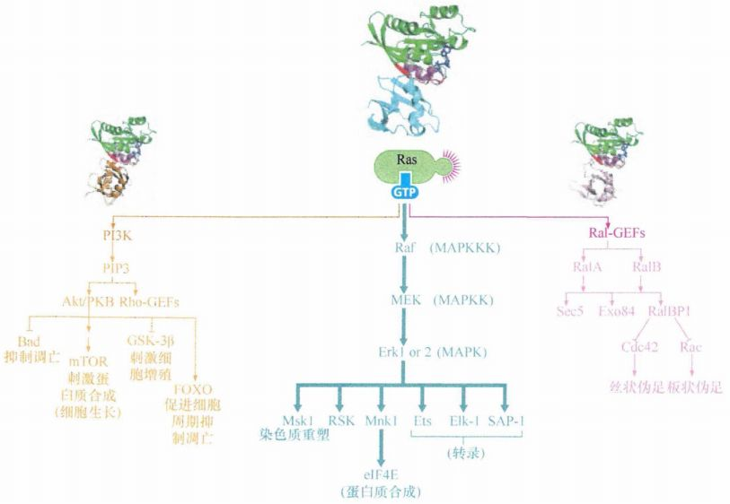
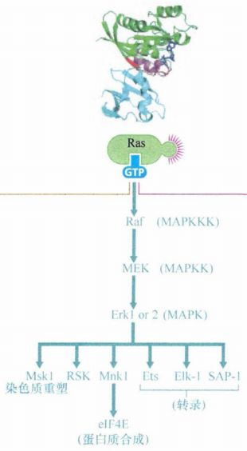
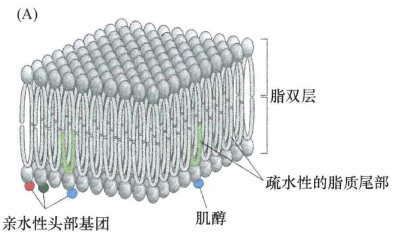
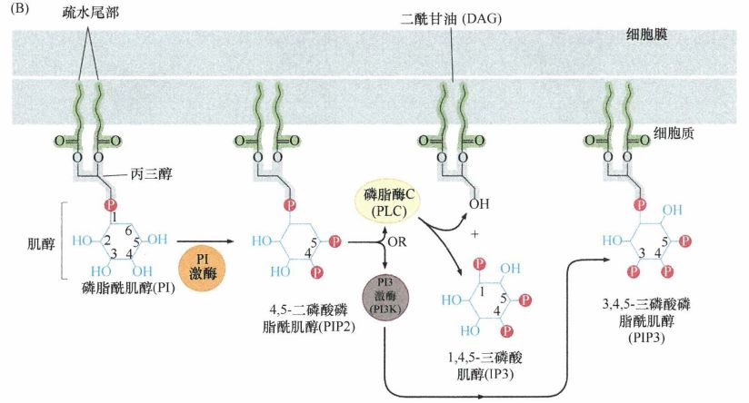
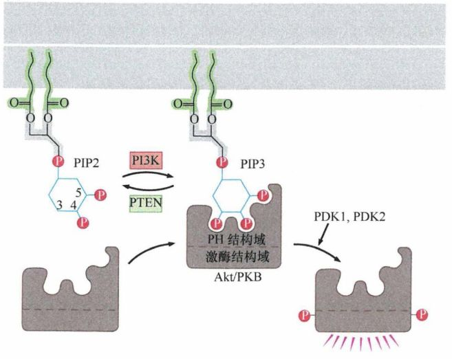
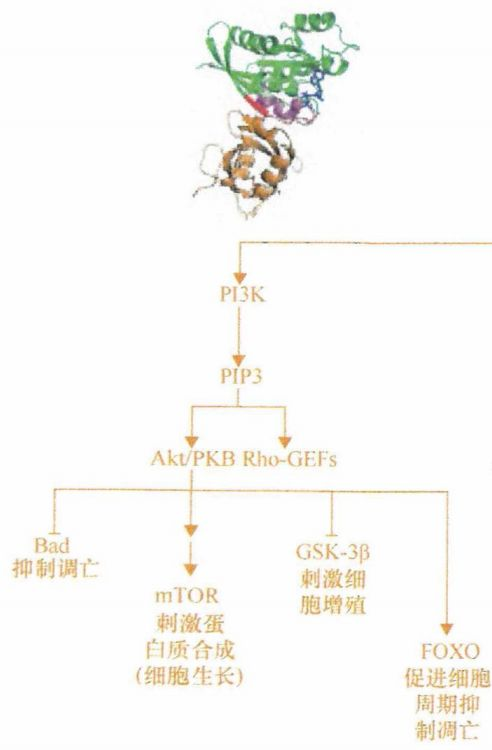
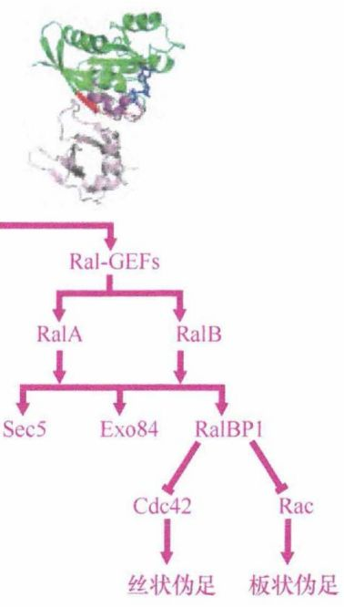

# 第六章 《癌生物学》第六章（2）Ras下游3条重要的信号通路

**往期回顾**
 
[《癌生物学》第二章（1） 癌症的起源](http://mp.weixin.qq.com/s?__biz=Mzg4NjA5Mzg2Mw==&mid=2247484770&idx=1&sn=a5144114b3d342408140b8c9ee234d92&chksm=cf9fa42af8e82d3c26681af84e26b7c6361e1275bfdce2edce2c4a3065871c1ce97f0649d3e4&scene=21#wechat_redirect)
 
[《癌生物学》第二章（2） 癌症的发展及其能量代谢](http://mp.weixin.qq.com/s?__biz=Mzg4NjA5Mzg2Mw==&mid=2247484805&idx=1&sn=e97e67056c1d508092127d0388c2eaf6&chksm=cf9fa4cdf8e82ddbaaabda6a2d17d32ec4ab3b7809b97006c79a707f93e35738a7216ba03b4e&scene=21#wechat_redirect)
 
[《癌生物学》第二章（3）癌症的诱因](http://mp.weixin.qq.com/s?__biz=Mzg4NjA5Mzg2Mw==&mid=2247484881&idx=1&sn=bdc85af93a48af8f3c633cbb3b27384d&chksm=cf9fa499f8e82d8f0991b6902435a029254d873ffdc446bc815fddf909f79ca094ce2729135d&scene=21#wechat_redirect)
 
[《癌生物学》第三章（1）病毒可以引发肿瘤](http://mp.weixin.qq.com/s?__biz=Mzg4NjA5Mzg2Mw==&mid=2247485009&idx=1&sn=bf13fdc034c935e967b24ea8264fae21&chksm=cf9fa719f8e82e0f8dc2a5d07a3040aad5619cccfa12509259840d02b3b7417609c8cc132d3c&scene=21#wechat_redirect)
 [《癌生物学》第三章（2）肿瘤病毒如何在细胞中复制（上）](http://mp.weixin.qq.com/s?__biz=Mzg4NjA5Mzg2Mw==&mid=2247485236&idx=1&sn=38754b14ff13c402137769797c36711b&chksm=cf9fa67cf8e82f6aa90d5232aeabf7b48bbcbc792fc807e0626046ec92f4a341bfd30cd9fd1d&scene=21#wechat_redirect) [《癌生物学》第三章（3）肿瘤病毒如何在细胞中复制（下）](http://mp.weixin.qq.com/s?__biz=Mzg4NjA5Mzg2Mw==&mid=2247485333&idx=1&sn=0748f6670320d8d5796113eb408ba01b&chksm=cf9fa6ddf8e82fcbde1175c3ed490fbcad7db352b2728e7fb0e76b0b2c08683663446d3470d2&scene=21#wechat_redirect) 
[《癌生物学》第四章（1）并非所有肿瘤都由病毒感染引起](http://mp.weixin.qq.com/s?__biz=Mzg4NjA5Mzg2Mw==&mid=2247485497&idx=2&sn=c67ed023b637d16e27bb21037e89edec&chksm=cf9fa971f8e82067c6369e04d6a56afa5c398053f08111a2f46879f990bfee32089bc42ff68b&scene=21#wechat_redirect) 

 
[《癌生物学》第四章（2）细胞原癌基因的激活](http://mp.weixin.qq.com/s?__biz=Mzg4NjA5Mzg2Mw==&mid=2247485625&idx=2&sn=fedd027b1ba76c07ed4d2af0b70069c3&chksm=cf9fa9f1f8e820e75e4bc24e8525b5436213d2ad009187877ca2a5f693573b9f5bb965741fba&scene=21#wechat_redirect)
 
[《癌生物学》第五章（1）生长因子与受体（上）](http://mp.weixin.qq.com/s?__biz=Mzg4NjA5Mzg2Mw==&mid=2247485864&idx=1&sn=9d850e610445822a84b6bd6318734094&chksm=cf9fa8e0f8e821f6e93a3c554138b82030bc5adc8d0e47e111ec3d9f0d8424c29bcd49c100c1&scene=21#wechat_redirect)
 
[《癌生物学》第五章（2）生长因子与受体（中）](http://mp.weixin.qq.com/s?__biz=Mzg4NjA5Mzg2Mw==&mid=2247485893&idx=3&sn=e4b521e3cf4ca5cb85a3686ca8bfbd40&chksm=cf9fa88df8e8219bd3ea563f1eb3fd4917188ae6c71d9a3427d3dcc30e1ffaadbafaf744c2fb&scene=21#wechat_redirect)
 
《癌生物学》第五章（3）生长因子与受体（下）
 
[《癌生物学》第六章（1）酪氨酸磷酸化的调控作用](http://mp.weixin.qq.com/s?__biz=Mzg4NjA5Mzg2Mw==&mid=2247486271&idx=2&sn=1cd38152b98c45961b1b2e95fe30a7d9&chksm=cf9faa77f8e8236176748bdc5a18442cbded1d791b7a49db5f7a64076215dab2a339f6ecf2d8&scene=21#wechat_redirect) 

 

 
**前言：** 在一期的学习中，我们前前后后提及过很多次 Ras 蛋白，可见其在细胞的信号转导中真的非常非常重要，可谓是元老级人物。今天我们就要请出这位重量级嘉宾—— **“Ras”** ，来一起学习一下其下游的3条重要的信号通路。
 

 
小编已经迫不及待要上个图给大家感受感受这位重量级嘉宾的“表演”了——
  
图1：Ras下游3条重要的信号通路
 

 
如果你看着有点眼花缭乱，那小编视觉冲击的目的就达到了，哈哈，别急，我们一条一条来捋清楚~
 

 

 
Ras→Raf→MAP激酶通路 

 

 
经过第5章的学习，我们知道，当 Ras 结合 GTP 时，两个 “切换结构域 ”发生切换，Ras处于活化状态，使效应环可以和一些 Ras 效应分子的下游信号分子相互作用。这些行使 Ras 实际功能的蛋白质统称为 Ras 效应分子。每一种效应分子对结合 GTP 的 Ras 蛋白的效应环具有强亲和力，而对 GDP 结合形式的Ras 蛋白的效应环亲和力差。
 
第一个被发现的 Ras 效应分子是 Raf 激酶 。像大多数细胞内的蛋白激酶一样，Raf 可以磷酸化底物蛋白的丝氨酸和苏氨酸残基。
 
Ras 激活 Raf 的反应依赖于 Raf 在胞质内重新定位。Ras 蛋白一直都锚定于质膜上，通常通过它的疏水 C 端结合在质膜的内表面。一旦 Ras 结合了 GTP, Ras 对 Raf 的亲和力将增加三个数量级，活化的 Ras 就可以通过其效应环结合 Raf。在这种结合形成之前， Raf 存在于胞质中，与 Ras 结合之后，Raf 通过 Ras 定位于质膜附近。
 
Raf 活化后通过磷酸化激活第二个激酶 MEK (MAPKK) 。MEK 被 Raf 激活后，MEK 就作为一种可以传递信号的激酶被活化了。这种丝氨酸/苏氨酸的磷酸化与生长因子受体胞内区的酪氨酸残基磷酸化的结果不同。受体的磷酸化可以募集信号伴侣分子并且将伴侣分子重新定位，而 Raf 引起 的 MEK 磷酸化可以引起其结构的改变并进而导致其激酶功能活化。MEK 既可以磷酸化丝氨酸／苏氨酸残基，又可以磷酸化酪氨酸残基。MEK 利用这两种功能来磷酸化另外两种激酶，胞外信号调控激酶 1 和 2 ( 通常指的是 Erk1和 Erk2 ) 。一旦被活化，每一种 Erk 都可以磷酸化底物，然后调节包括转录在内的各种胞内进程。
 
这种激酶信号级联通常称为 MAPK 通路 （丝裂原激活蛋白激酶 ）。Raf 起始的信号级联下游的 Erk1 和 Erk2 可以称为 MAPK。磷酸化 MAPK 的激酶通常称为 MAPKK, 在本级联中，MEK 行使这个 MAPKK 的角色。磷酸化 MAPKK 的激酶则通常称为 MAPKKK，Raf 可以认为是一种 MAPKKK。
 
这些组成许多信号级联的激酶由骨架蛋白维系在一起。例如，KSRI 可以把 Raf、MEK 和 Erk 组装在一起，从而保证 Raf 能与其底物 MEK、MEK 与其底物 Erk 相互靠近。
 
Erk 激酶一旦被激活，就可以磷酸化胞内底物并可以转位至核内，在核里磷酸化转录因子，其中的一些转录因子可以启动即刻早期基因和延迟早期基因表达。除了活化一些生长促进基因外，这条通路还使细胞失去了锚定依赖性和接触抑制性。同样，它也对 Ras 蛋白所引起的细胞形态的改变起重要作用。
  
图2：Ras→Raf→MAP激酶通路
 

 

 
**PI3K→PIP3→Akt信号通路**
 

 
对于肿瘤来说，抑制细胞凋亡是非常重要的。这种抗凋亡的活性对于癌细胞极其关键，因为大多数癌细胞都是处于细胞凋亡被激活的边缘状态。而PI3K→PIP3→Akt信号通路与细胞凋亡有着密切的关系。
 
我们都知道，细胞膜的磷脂都是双亲性的，即具有一个亲水性的头部和一个疏水性的尾部，一些磷脂的亲水性头部含有肌醇基团。肌醇是一种水溶性碳水化合物分子。
  
图3：脂双层的生化结构
 

 
这种 磷脂的肌醇部分 能被磷酸基团修饰，形成 三磷酸肌醇（IP3） ，接着与磷脂分子的疏水基团部分相分离。由于其是完全亲水的，IP3 能扩散到远离膜的部位，从而实现其作为一种胞内激素、把信号从胞膜传递到细胞远端的作用。这种胞内激素通常称为第二信使。 二酰甘油（DAG） 是IP3分离后的另一产物，它能激活细胞中一种重要的信号激酶——丝氨酸／苏氨酸激酶，即蛋白激酶 C (PKC) 。另外，磷酸化的肌醇也能与磷脂保持连接，嵌入胞膜，从而作为某些胞内蛋白的锚定位点。
 
知道了细胞膜磷脂的肌醇部分被磷酸化后产生的效应，那么它是被谁磷酸化的呢？
 
目前已知磷脂的肌醇部分能被几种不同的激酶修饰，并且每种酶都特异性地修饰肌醇的某一羟基，如 磷脂酰肌醇 3-激酶 (PI3K) 能给嵌在胞膜的磷脂酰肌醇 (PI) 肌醇部分的 3' 羟基加上一个磷酸基团。在已发现的几种 PI3 激酶中，最重要的可能是磷酸化 Pl (4',5') P2 ( 又称 PlP2 ) 的 PI3K。PlP2 自身在肌醇部分的 4'位和 5'位含有磷酸基，经 PI3K修饰后肌醇获得了第三个磷酸基团，因此 PIP2 变成了 3',4',5'-三磷酸磷脂酰肌醇 ( PIP3 ）。与上一条通路不同的是，Pl3K是将磷酸基团加到磷脂上而不是蛋白质底物上。
  
图4：PI3K→PIP3→Akt信号通路
 

 
咦？讲了半天，Ras 这个主角貌似还没有出现！这就来这就来：这个我们需要结合上一期的知识，PI3K 能通过其调节亚基的 SH2 基团结合到一些配体激活的受体上，并磷酸化位于细胞膜上的含肌醇磷脂。研究发现 GTP 激活的 Ras 就能结合 Pl3K 并增强其功能活性。上一期还提到：由于酪氨酸激酶受体胞内的结构域位于质膜内表面，由受体募集而来的含 SH2蛋白也就贴近质膜。这种靠近使得各种含 SH2 蛋白可直接与质膜相关蛋白或磷脂相互作用，产生一系列生化信号。所以，PI3K 与 Ras 的结合使其定位于质膜附近，它就可以接触并磷酸化嵌在膜内的肌醇脂质。
 
此外，PI3K 还能被多种信号分子激活，如 PDGE 、神经生长因 子 (NGF) 、胰岛素样生长因子 CIGF-1) 、白细胞介素-3 和通过整合素连接的细胞外基质 (ECM)，可见 PI3K 能在多种信号通路中发挥枢纽作用。
 
许多与 PIP3 作用的胞浆蛋白都有一个 pleckstrin 同源 (PH) 结构域, 这个结构域对三磷酸化的肌醇头部有很强的亲和力。Akt 又称为蛋白激酶 B (PKB), 是一种含有 PH 结构域的丝氨酸/苏氨酸激酶。因此，当 PI3K 生成 PIP3 时 ， Akt/PKB 激酶分子便通过其 PH 结构域，结合到从细胞膜延伸到细胞内的 PIP3 肌醇头部。
  
图5：PH 结构域锚定到 PIP3 上
 

 
Akt/PKB 与细胞膜的结合导致其激酶活性激活。激活后的 Akt/PKB 对一系列的底物进行磷酸化，从而对细胞产生各种各样的效应。Akt/PKB 对细胞主要有 3 方面的生物学效应: ① 减小细胞启动凋亡程序自杀的可能性，促进细胞的存活；② 刺激细胞增殖；③ 刺激细胞生长，即狭义上的细胞体积大小的增长。同时，它也能以一种目前尚不明确的机制影响细胞迁移和血管生成，促进新的血管形成。
 
Akt/PKB 增殖调控功能依赖于其对细胞生长分裂循环，即细胞周期进展过程中重要蛋白质的干扰。此外，Akt/PKB 还能使调控细胞蛋白质合成速率的相关蛋白质发生巨大变化。Akt/PKB 通过中介分子诱导激活 mTOR 激酶 ，而激活后的 mTOR 激酶可磷酸化一种翻译抑制因子 4EP-BP, 并使之失活。同时，激活的 mTOR 激酶还磷酸化激活一种翻译激活因子 p70S6 激酶，这些变化使 Akt/PKB 能提高一组 mRNA 的翻译起始效率，加速蛋白质合成，利于胞内蛋白质的积累，从而促进细胞生长（而不是增殖 ）。
  
图6：PI3K→PIP3→Akt信号通路
 

 
细胞内使 PIP3 和其他磷酸化 PI 分子通常情况下维持低水平的是一系列磷酸酶，其能逆转类似 PI3K 激酶的激活效应。最有代表性的是 PTEN , 它能将 PIP3 中由 PI3K 等激酶加上 的 3'磷酸移除。这提示了两种可能导致 Akt/PKB 信号通路在肿瘤细胞中异常调控的不同机制：PI3K 的过度激活或者 PTEN 的失活。
 

 

 
**通过Ras同源物Ral进行调控**
 

 
先来看看背景知识——
 
在具有 PH 结构域的蛋白质中，有一组类似 Sos 作用的鸟嘌呤核苷酸交换因子（GEF), 能激活各种类似 Ras 蛋白并与之有联系的小 GTPase。这一类 GTPase 属于 Rho 信号蛋白家族，这一家族包括 Rho、Rac 和 Cdc42 三个成员。如同 Ras 一样，这些 Rho 蛋白也是双相开关，结合 GTP 时作为具有活性的信号分子，而结合 GDP 时没有信 号活性。Rho-GEF 一旦结合 PIP3 被活化后，它就如同 Sos 对 Ras 蛋白的作用一样作用于 Rho 蛋白。这些 Rho-GEF 能解离结合在 Rho 上的 GDP, 使 GTP 结合上来，从而激活 Rho。
 
激活的 Rho 蛋白功能与 Ras 显著不同：它参与细胞骨架及细胞与胞外环境黏附结构的重建。通过这种方式，Rho 样蛋白调控细胞形状、迁移及癌细胞的转移。例如，Cdc42 与肌动蛋白细胞骨架重组有关，并参与细胞线状伪足形成。线状伪足是一种细胞用来探知外部环境和胞外基质黏附的细胞膜指状小突起；而 Rac 则参与形成片状伪足，这是一种位于运动细胞前沿从细胞膜上延伸出来的褶皱。这些过程与肿瘤细胞的侵袭和转移密切相关。
 
Ras 下游的第三条通路涉及一对 Ras 样蛋白：RalA 和 RaIB, 这两种蛋白质与 Ras 具有 58%的序列同源性。同 Ras 一样, Ral 蛋白的功能激活依赖于 GTP 取代 GDP 与之相结合。
 
Ras 和 Ral 之间的信号转导由 Ral 鸟嘌呤核苷酸交换因子 (Ral-GEF) 介导，Ral-GEF 能促进 Ral 蛋白释放 GDP 并结合 GTP。除了它的 GEF 结构域，每个 Ral-GEF 还有一个能结合活性状态下 Ras 的口袋形结构域。Ral-GEF 与 Ras 的结合，使 Ral-GEF 定位在细胞膜的内表面，而且能引起 Ral-GEF 构象改变，激活其内在的鸟嘌呤核苷酸交换因子 (GEF) 的活性。
 
结合 GTP 的 Ral 蛋白接着激活多个下游通路，主要激活 Sec5、Exo84 和 RalBP1 的通路。激活的 Sec5 和 Exo84 对体外培养的 Ras 转化细胞的非锚定依赖性生长及体内成瘤有着重要贡献，而 RalBP1 通过作用于 Cdc42 和 Rac, 可重组肌动蛋白细胞骨架从而影响细胞迁移。
  
图7：Ral及其对细胞骨架的调控
 

 
Ras 下游3条重要的信号通路到这里就讲完了，但是我们是把 Ras 蛋白作为单一蛋白质进行讨论的，然而事实上 Ras 家族有 4 种蛋白质 (1种 H-Ras, 1种 N-Ras, 2种 K-Ras), 这4种蛋白质在细胞中的定位不同，作用方式也略有差异。其次，我们列举的3种蛋白质 (Raf、PI3K 和 Ral-GEF) 并不能包括所有的 Ras 效应蛋白。
 

 
学完一个Ras通路，有没有觉得有那么一点点成就感呢，哈哈，下一期还有N条通路等着我们来学习呢，真是路漫漫其修远兮~ 但是！我们不在怕的，对不对 
 

 参考书目： 《The Biology of Cancer》（Second Edition）  R.A.Weinberg  著，詹启敏 等  译 编辑： 张月明 周健 
 校审： 张健 罗鹏 
 

 
  ***欢迎点击下方图片进行留言，说出你的看法哦~*** 
