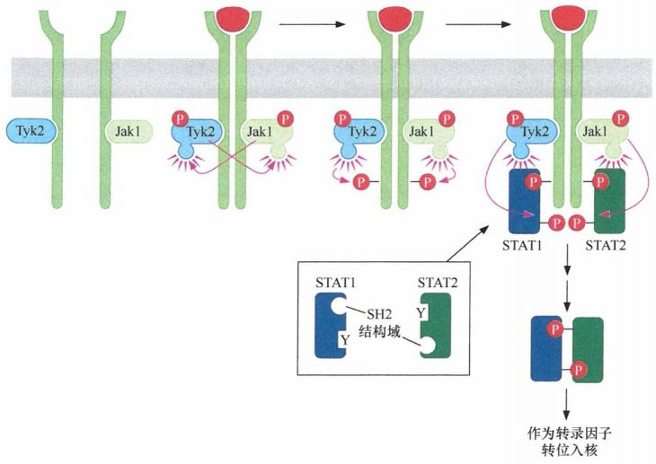
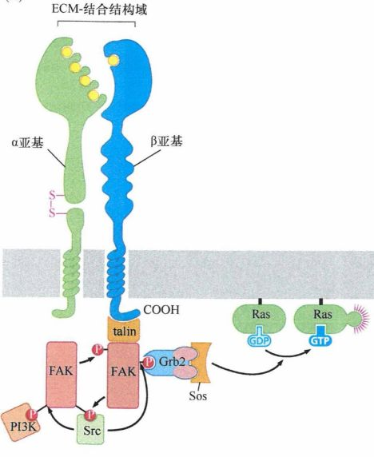
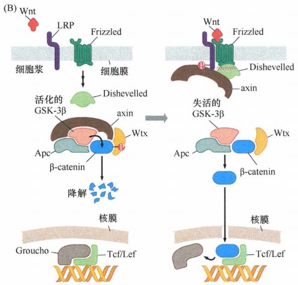
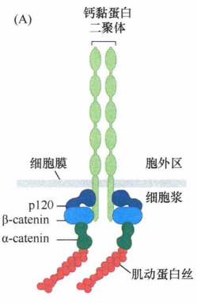
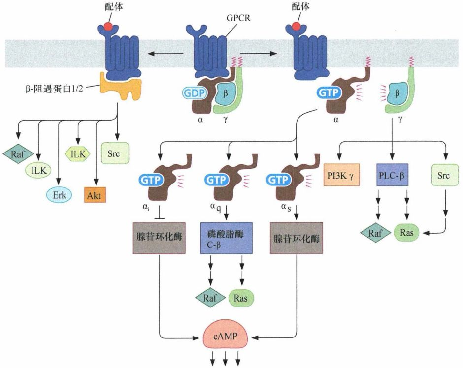
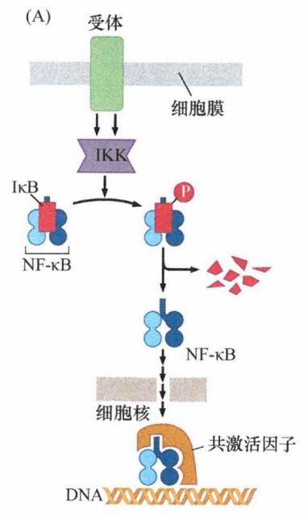
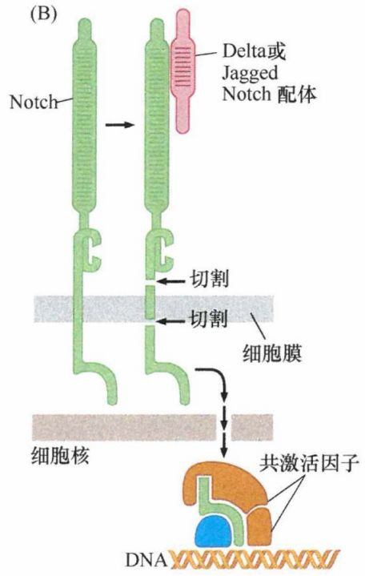
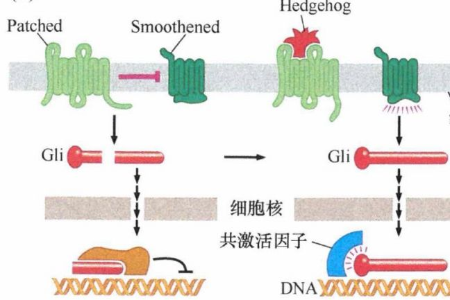
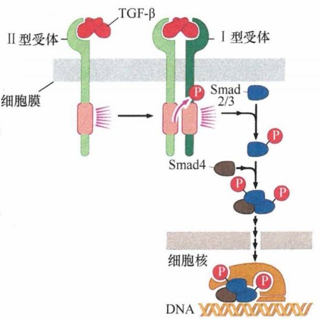

# 第六章 《癌生物学》第六章（3）细胞内其他信号网络

**往期回顾**
 

 
[《癌生物学》第二章（1） 癌症的起源](http://mp.weixin.qq.com/s?__biz=Mzg4NjA5Mzg2Mw==&mid=2247484770&idx=1&sn=a5144114b3d342408140b8c9ee234d92&chksm=cf9fa42af8e82d3c26681af84e26b7c6361e1275bfdce2edce2c4a3065871c1ce97f0649d3e4&scene=21#wechat_redirect)
 
[《癌生物学》第二章（2） 癌症的发展及其能量代谢](http://mp.weixin.qq.com/s?__biz=Mzg4NjA5Mzg2Mw==&mid=2247484805&idx=1&sn=e97e67056c1d508092127d0388c2eaf6&chksm=cf9fa4cdf8e82ddbaaabda6a2d17d32ec4ab3b7809b97006c79a707f93e35738a7216ba03b4e&scene=21#wechat_redirect)
 
[《癌生物学》第二章（3）癌症的诱因](http://mp.weixin.qq.com/s?__biz=Mzg4NjA5Mzg2Mw==&mid=2247484881&idx=1&sn=bdc85af93a48af8f3c633cbb3b27384d&chksm=cf9fa499f8e82d8f0991b6902435a029254d873ffdc446bc815fddf909f79ca094ce2729135d&scene=21#wechat_redirect)
 
[《癌生物学》第三章（1）病毒可以引发肿瘤](http://mp.weixin.qq.com/s?__biz=Mzg4NjA5Mzg2Mw==&mid=2247485009&idx=1&sn=bf13fdc034c935e967b24ea8264fae21&chksm=cf9fa719f8e82e0f8dc2a5d07a3040aad5619cccfa12509259840d02b3b7417609c8cc132d3c&scene=21#wechat_redirect)
 [《癌生物学》第三章（2）肿瘤病毒如何在细胞中复制（上）](http://mp.weixin.qq.com/s?__biz=Mzg4NjA5Mzg2Mw==&mid=2247485236&idx=1&sn=38754b14ff13c402137769797c36711b&chksm=cf9fa67cf8e82f6aa90d5232aeabf7b48bbcbc792fc807e0626046ec92f4a341bfd30cd9fd1d&scene=21#wechat_redirect) [《癌生物学》第三章（3）肿瘤病毒如何在细胞中复制（下）](http://mp.weixin.qq.com/s?__biz=Mzg4NjA5Mzg2Mw==&mid=2247485333&idx=1&sn=0748f6670320d8d5796113eb408ba01b&chksm=cf9fa6ddf8e82fcbde1175c3ed490fbcad7db352b2728e7fb0e76b0b2c08683663446d3470d2&scene=21#wechat_redirect) 
[《癌生物学》第四章（1）并非所有肿瘤都由病毒感染引起](http://mp.weixin.qq.com/s?__biz=Mzg4NjA5Mzg2Mw==&mid=2247485497&idx=2&sn=c67ed023b637d16e27bb21037e89edec&chksm=cf9fa971f8e82067c6369e04d6a56afa5c398053f08111a2f46879f990bfee32089bc42ff68b&scene=21#wechat_redirect) 

 
[《癌生物学》第四章（2）细胞原癌基因的激活](http://mp.weixin.qq.com/s?__biz=Mzg4NjA5Mzg2Mw==&mid=2247485625&idx=2&sn=fedd027b1ba76c07ed4d2af0b70069c3&chksm=cf9fa9f1f8e820e75e4bc24e8525b5436213d2ad009187877ca2a5f693573b9f5bb965741fba&scene=21#wechat_redirect)
 
[《癌生物学》第五章（1）生长因子与受体（上）](http://mp.weixin.qq.com/s?__biz=Mzg4NjA5Mzg2Mw==&mid=2247485864&idx=1&sn=9d850e610445822a84b6bd6318734094&chksm=cf9fa8e0f8e821f6e93a3c554138b82030bc5adc8d0e47e111ec3d9f0d8424c29bcd49c100c1&scene=21#wechat_redirect)
 
[《癌生物学》第五章（2）生长因子与受体（中）](http://mp.weixin.qq.com/s?__biz=Mzg4NjA5Mzg2Mw==&mid=2247485893&idx=3&sn=e4b521e3cf4ca5cb85a3686ca8bfbd40&chksm=cf9fa88df8e8219bd3ea563f1eb3fd4917188ae6c71d9a3427d3dcc30e1ffaadbafaf744c2fb&scene=21#wechat_redirect)
 
《癌生物学》第五章（3）生长因子与受体（下）
 
[《癌生物学》第六章（1）酪氨酸磷酸化的调控作用](http://mp.weixin.qq.com/s?__biz=Mzg4NjA5Mzg2Mw==&mid=2247486271&idx=2&sn=1cd38152b98c45961b1b2e95fe30a7d9&chksm=cf9faa77f8e8236176748bdc5a18442cbded1d791b7a49db5f7a64076215dab2a339f6ecf2d8&scene=21#wechat_redirect)
 
[《癌生物学》第六章（2） Ras下游3条重要的信号通路](http://mp.weixin.qq.com/s?__biz=Mzg4NjA5Mzg2Mw==&mid=2247486293&idx=2&sn=9ffda5507d1a485d9b3f289333c71af8&chksm=cf9faa1df8e8230bf23de9c88af7810c8454a6b9838d40c23cad3074d99ff397bb56e5c1b6bd&scene=21#wechat_redirect)
 

 
前言：在一期的学习中，我们介绍了一位重量级嘉宾——“Ras”，一起学习了其下游的3条重要的信号通路。今天我们主要来看看其他的一些细胞内的信号通路，有Jak-STAT、Wnt-β-catenin、NF-κB、Notch……学习任务也是不轻的哦，要继续打起十二分精神，拿小本本记下来了！
 

 

 
Jak-STAT通路 

 

 
对一些造血系统刺激因子受体进行的研究发现，它们的受体与上一章中介绍到的大多数生长因子受体略有不同。这些特殊的受体蛋白没有共价结合的酪氨酸激酶结构域，而是与 Jak (Janus 激酶）一类的酪氨酸激酶形成非共价复合物。这类受体包括干扰素 (IFN) 受体、促红细胞生成素 (EPO) 受体和血小板生成素 (TPO) 受体。
 
由配体结合介导受体发生二聚化后，每个受体分子结合的 Jak 酶将二聚体中另一个受体分子的细胞质尾部酪氨酸磷酸化，其原理与 EGF-R 和 PDGF-R 受体在被配体激活后二聚体亚基之间进行交互磷酸化是一致的。形成的磷酸化酪氨酸吸引并结合含有 SH2 结构域的转录因子 STAT。STAT 进一步被 Jak 磷酸化后，形成同时含有 SH2 结构域和磷酸化酪氨酸的单个 STAT 分子。重要的是，STAT 的 SH2 结构域能够特异性地结合 STAT 上形成的磷酸化酪氨酸残基，因此形成 STAT-STAT 二聚体，其中每个 STAT 都通过其 SH2 结构域与二聚体中另一STAT的磷酸化酪氨酸相结合。形成的 STAT 二聚体迁移入核，作为转录因子发挥功能。
  
图1：Jak-STAT通路
 

 
STAT 可以激活对细胞增殖和细胞存活极其重要的靶基因，包括如 myc、cyclinD2 和 D3（能使细胞通过生长一一分裂周期），以及编码强抗凋亡蛋白Bcl-X L 的基因等。除了可磷酸化 STAT, Jak 还可磷酸化那些能激活其他促有丝分裂通路的底物，包括前面介绍的 Ras-MAPK 通路。
 
STAT 能促进癌症发生发展。在 STAT3 中插入一对半胱氨酸残基，突变后的 STAT3 能够自发二聚化并形成共价二硫键从而稳定地交联。这样形成的 STAT3 突变二聚体在结构和功能上均与正常情况下被 Jak 磷酸化后生成的 STAT3 二聚体相似，但其作为核内转录因子的作用是组成性激活的，因此具有致癌蛋白功能。
 
在许多黑色素瘤中，STAT3 主要是被 Src 激活的，而 Src 本身在这些肿瘤细胞里也是组成性激活的。至少有 4 种属于非受体酪氨酸激酶的 Src 家族成员蛋白质能磷酸化并激活 STAT3。这也突出表明了 STAT 在胞质中是被非受体偶联的酪氨酸激酶而不是受体相关的 Jak 活化的。抑制这些黑色素瘤细胞中的 Src 能使 STAT3 失活，导致细胞凋亡，表明了 STAT3 在保证肿瘤细胞存活中具有重要作用。
 

 

 
整合素信号通路 

 

 
由α+β二聚体组成的整合素具有 3 个功能：①使细胞与 ECM 相连接；②通知细胞是否已经与某些 ECM 成分连接；③通过断开与 ECM 的旧连接，形成新连接，促进细胞的迁移。
 
如上一章所述，整合素能在一小块称为黏着斑的固定面积上聚集生成许多与 ECM 的连接。这种聚集能引起黏着斑激酶 (FAK) 激活。FAK 是一类类似 Src 的非受体酪氨酸激酶，与一些整合素分子β亚基的细胞内尾部相连，当整合素聚集在黏着斑时其可能通过反式磷酸化作用被磷酸化。FAK 上被磷酸化的酪氨酸残基可以为 Src 提供锚定位点。锚定后的 Src 接着磷酸化 FAK 上的其他酪氨酸残基，由此形成的磷酸化酪氨酸残基成为其他含 SH2 结构域的信号分子（如 Grb2 、Shc、PI3K 和 PLC-γ) 的锚定位点。也有证据表明 Grb2 一旦结合磷酸化的 FAK 后，能重新招募 Sos, 后者接着激活其下游的靶基因，包括 Ras 和 PI3K。已有的证据表明存在最少包括以下这些元件的信号通路：ECM→整合素→Sos→Ras→Raf, Pl3K 和 Ral-GEF。
  
图2：整合素的信号转导
 

 
正常情况下细胞依赖整合素信号来衡量正常 Ras 蛋白的活化情况。缺少这种信号时，细胞会认为已经无法与细胞外基质相连接。这将使细胞生长分裂的周期演进受到阻滞，或者更剧烈地引起细胞进入失巢凋亡的程序性死亡状态。这提示致癌性Ras 能模仿整合素与细胞外基质黏着后的一个关键下游信号，从而促使细胞获得非锚定依赖性生长增殖的特性。产生的结果是致癌性的Ras能够迷惑细胞，使其认为整合素已经与 ECM 成分成功结合，允许 Ras 转化的细胞继续增殖。
 

 

 
Wnt-β-catenin通路
 

 
Wnt-β-catenin 通路可以转导有丝分裂信号，还能使细胞保持在一种相对的未分化状态。
 
正如第5章提到的，Wnt 因子结合 Frizzled 受体，抑制糖原合酶-3β （GSK-3β）的活性。在缺乏 Wnt 时，GSK-3β 磷酸化几种重要的底物蛋白质，使他们被降解。这其中最重要的一种底物是 β-catenin。β-catenin 正常情况下在细胞中以 3 种状态存在：①它可以结合到细胞－细胞黏附受体的胞内结构区，如 E-钙黏蛋白；邻近细胞的 E-钙黏蛋白分子可以互相连接形成黏附连接 ——一种有助于保障上皮层完整、阻止癌细胞转移的细胞间接触；②存在于胞质的一个可溶性分子池里，并且很快地降解，存在时间不足 20min；③它还可以存在于细胞核里，作为重要的一个转录因子元件发挥作用。
 
合成后不久，β-catenin 就会与其他两种细胞蛋白——Apc（腺瘤性结肠息肉蛋白）和 axin 形成多蛋白复合物。这些蛋白质使β-catenin 与其分解者 GSK-3β结合。通过磷酸化β-catenin, GSK-3β 确保 β-catenin 被泛素化标记，从而导致β-catenin的快速降解，故正常情况下稳定状态的β-catenin在胞质内总保待低浓度。
 
Wnt 信号激活时，GSK-3β 的降解作用被抑制，β-catenin 免于降解，半衰期从 20min 增长为 1~2h, 其稳态浓度也相应增加，累积的β-catenin便转移进入细胞核，结合Tcf/Lef 蛋白，激活转录。β-catenin 与 Tcf/Lef 形成的转录因子复合物能激活多个重要靶基因，包括那些编码细胞生长增殖相关蛋白的基因，如 cyclin D1 和 Myc。
  
图3：Wnt-β-catenin通路
 

 
GSK-3β 还可磷酸化其他一些重要的生长调节蛋白。GSK-3β 可通过磷酸化 cyclin D1 而促进其快速降解。因此，Wnt 通路实际上在转录水平和翻译后水平两个层次上调节 cyclin D1 的表达水平。Wnt 因子还是一种强分裂原，其作用如同许多受体酪氨酸激酶的配体一样。此外，高水平的β-catenin是小肠干细胞保持未分化状态、不分化成小肠壁特异细胞的重要保证。
 
β-catenin 的另一种角色是参与形成一种细胞质复合物，使细胞表面黏附受体（如 E-钙黏蛋白）连接到细胞骨架上。在上皮细胞中，似乎绝大多数β-catenin 分子都与胞膜上 E-cadherin 分子的胞内尾部相结合，而 E-cadherin 则形成细胞与细胞间的黏附连接。因此，可以推测在没有 E-cadherin 的细胞里，β-catenin 会被解放出来，进而转位入核，启动转录。事实上这确实是可以观察到的现象。
  
图4：β-catenin 分子与 E-cadherin 分子结合
 

 
已有显著证据表明在大约 20%晚期前列腺癌中存在β-catenin的核转移，并且，5%~7% 的前列腺癌出现β-catenin 的基因突变，其编码的蛋白质不能被 GSK-3β磷酸化，因而在细胞核大量累积。此外，能促进β-catenin 降解的 Apc 蛋白质失活，导致在几乎所有的结肠癌中 β-catenin 的降解机制都是失活的。
 

 

 
G蛋白偶联受体 

 

 
G蛋白偶联受体（GPCR）是一个跨膜蛋白，迂回七次通过细胞膜。当G蛋白偶联受体与细胞外配体结合时，每一个受体可以激活一种或者几种胞质内的G蛋白异源三聚体。之所以称为异源三聚体是因为G蛋白具有3个截然不同的亚基 (Gα、Gβ 和 Gγ），其中 Gα 可以结合 GDP 或者 GTP。以 Ras 蛋白为例，当结合 GTP 时，Gα 处于活化状态。
 
一旦被G蛋白偶联受体激活，G蛋白异源三聚体中的 Gα 亚基就会与它的两个伙伴 Gβ 和 Gγ 分离，进一步活化一系列不同的酶类, 其中就包括腺苷酸环化酶和磷脂酶 C-β （PLC-β)。腺苷酸环化酶可以将 ATP 转化为环腺苷酸cAMP, 而磷脂酶 C-β 则通过酶切 PIP3, 生成二酰甘油 (DAG) 和三磷酸肌醇（lP3）, 其中 IP3 是细胞质中重要的第二信使，具有刺激细胞增殖的功能。
 
有证据表明，就连 Src 激酶也可以被某些 GTP 结合的 Gα 亚基所激活。同时，G蛋白异源三聚体中的另外两个亚基复合物 Gβ 和 Gγ 也可以激活其他重要的细胞有丝分裂信号蛋白，如某一种形式的磷脂酰肌醇 3-激酶 (PI3K)。
 
GPCR 介导的第二条信号通路是由最初的视网膜的视紫红质信号通路衍生而来。这条光子刺激诱导 GPCR 发出的信号通路可以被一种名为 arrestin 的蛋白质阻滞。这种分子介导某种形式的负反馈，来确保 GPCR 信号在被光子激活后可以仅限定在一定的时间段内活化。随后，研究者又发现了视网膜 arrestin 的两个同源蛋白 β-arrestin1 和 β-arrestin2 在视网膜外的人体所有细胞类型中表达。在多种类型的细胞中，配体活化 GPCR 的同时会激活 β-arrestin 的负反馈反应，激活下游多种信号蛋白，其中包括已知的促进细胞生存及增殖的重要激酶。
  
图5：G蛋白偶联受体
 

 
在某些非小细胞肺癌中，肿瘤细胞可以自发分泌铃蟾钛（亦被称为胃泌素释放肽或GRP) 、缓激肽、缩胆囊素 (CCK)、胃泌素、神经加压素和抗利尿激素。同时，表达 G 蛋白偶联受体的细胞可以识别并结合这些因子，从而形成了一个自分泌信号环路。甲状腺瘤和某些甲状腺癌中，编码促甲状腺激素受体（一种G蛋白偶联受体）的基因经常发生点突变，导致 TSH 受体可以不依赖于配体而组成性地活化。在其他的甲状腺肿瘤中，Gα发生点突变，使 Gα 失去了通过自身 GTP 酶活性发挥自我关闭的功能。在某些疱疹病毒感染时（如人8型疱疹病毒HHV-8, 另称卡博氏肉瘤疱疹病毒 KSHV，G蛋白偶联受体被意外破坏，经常导致艾滋病患者发生血管肿瘤。
 

 

 
NF-κB信号通路 

 

 
最常见的 NF-κB 异源二聚体由 p65 和 p50 组成。通常，NF-κB 被另一个多肽 IκB (NF-κB 抑制因子）阻滞在细胞质中。在接收到某些不同来源的信号时，IκB 被磷酸化并迅速降解。结果，NF-κB 从 IκB 的禁锢中解放出来，并移动到细胞核中，激活一大群（至少 500 个 ）靶基因的表达。
 
破坏 IκB 并导致 NF-κB 信号通路活化的激酶（称为 IκB 激酶或者简称 IKK) 本身也能被众多的因子所激活，包括肿瘤坏死因子、白细胞介素-1β (免疫系统中参与免疫应答的细胞外因子）、脂多糖（细菌感染的标记）、活性氧物质 (ROS) 、抗肿瘤药物及λ射线等。在肿瘤发生过程中，NF-κB 对细胞存活和增殖具有重要影响。一旦到达细胞核，NF-KB 就可以引起一系列重要的抗凋亡蛋白的基因表达，如 Bcl-2、IAP-1 和 IAP-2。同时，NF-KB 可以通过诱导细胞周期调节机制中的重要成员 myc 和 cyclinD1 的基因表达，参与细胞有丝分裂。因此，NF-κB可以保护细胞免于细胞凋亡，同时驱动细胞增殖。
  
图6：NF-κB异源二聚体
 

 

 
Notch信号通路 

 

 
如第5章所讲，Notch 是一个细胞表面受体，与配体（Jagged 或 Delta-like 蛋白）结合后经历两次蛋白酶切，一次在细胞外结构域，另一次在细胞跨膜区。后一次的酶切从细胞膜附着处释放出一个大的胞质蛋白片段，这个片段随后移动到细胞核中，与其伴侣蛋白一起作为转录因子发挥作用。Notch 配体和受体的胞外区随后内化，被配体呈递细胞降解。
 
每次 Notch 受体结合配体后，受体将经历一次不可逆转的共价改变，更明确地说就是蛋白酶切。因此，每一个 Notch 受体在结合配体后仅能活化一次。而与之形成鲜明对比的是酪氨酸激酶受体可以在结合配体后的相当长时间里重复释放信号，将生长因子配体所启动的信号大大增强。
  
图7：Notch 受体
 

 

 
Hedgehog信号通路 

 

 
当 Patched 受体与其配体 Hedgehog 结合时，改变了 Patched (Ptc) 与 Smo 的相互作用，结果导致 Smoothened 与 Gli 在初级纤毛富 集，位置主要在纤毛顶部。正常状态下，在缺少 Smoothened 蛋白调节时，Gli 前体蛋白被切割为两个片段，其 中一段移动到细胞核中，行使转录抑制因子的功能。但是，当 Smoothened 被活化时，Smoothened 与 Gli 在初级纤毛相互作用， Gli 前体的切割被抑制，导致完整的 Gli 蛋白移动到细胞核中，作为转录激活因子发挥功能。
  
图8：Hedgehog信号通路
 

 
Gli 最初是在恶性胶质瘤中发现的一个高表达蛋白质。一旦高表达，Gli 和其他几个有亲缘关系的家族蛋白可以发挥癌基因的功能。例如，人 patched 基因 (PTCH) 遗传性失活突变会导致 Gorlin 综合征——一种遗传性的肿瘤易感综合征，表现为皮肤多发性基底细胞癌及其他肿瘤的发病危险性增加（尤其是成神经管细胞瘤，这是一种小脑细胞肿瘤）。这一类的失活性突变导致 Patched 不能抑制 Smoothened, 使得下游不间断地释放活化的 Gli 蛋白到细胞核中。
 

 

 
TGF-β信号通路 

 

 
TGF-β 和它所引起的信号转导通路几乎在所有的肿瘤发生中起重要作用，包括肿瘤发生早期 TGF-β 在多种类型细胞中阻滞细胞生长及在随后的肿瘤进展期影响肿瘤侵袭的表型。这条通路的活化可以将转录因子 Smad 转位到细胞核中，在那里结合特异性的四联核苷酸序列，并与周边转录因子共同作用，诱导多个基因表达并抑制另外一些基因的表达, 在关键因子 Smad 缺失时，上皮性肿瘤细胞可以逃脱 TGF-β 的生长抑制作用而旺盛生长，这种情况在侵袭性胰腺癌的前期经常可以看到。
  
图9：TGF-β信号通路
 

 
Smad 转录因子与其他转录因子不同，它们识别和结合染色体 DNA 的四联核苷酸序列。仅靠 Smad 自身的结合力太弱，不能保证 Smad 结合在 DNA 上。因此，Smad 经常结合在邻近的其他转录因子结合点的 DNA 区段上，这样 Smad 与其他转录因子（TF) 伴侣之间的蛋白质－蛋白质相互作用保证它们与 DNA 的结合足够强劲，而且相互协作。目前已知 Smad 可以与超过 130 个不同的 TF 形成这种伙伴关系，但大多数功能尚不明确。这条通路在后续的学习中还会进行更为深入的讨论。
 

 

 
正向和反向反馈调控
 

 
事实上，所有有规则的信号环路均有抑制作用的成员对发出正向信号的环路成员进行抗衡及调控。
 
原则上，限制分裂信号通路的有效策略是限制细胞暴露环境的生长因子数量。即使细胞表面表达过量的生长因子受体，但由于受体可以结合的 GF 配体数量有限，也可限制下游信号通路的活化。
 
更精准和有效地调控这类分裂信号的策略是调控效应细胞内部信号的进程。在信号环路活化之前，细胞内信号环路中的负调控成员处于失活状态，一旦信号环路开始传递，负调节的蛋白质就会被活化，减弱或者阻断更多信号活化。这种可诱导的抑制作用称为负反馈。我们已经提到了很多参与负反馈调节环路的蛋白质。例如，当一个 GF 受体被配体结合活化后发生自身磷酸化，Ras-GAP的 SH2 区域可以将蛋白质结合到受体的一个磷酸化位点。这样就将 Ras-GAP 带到指定的位置，使其可以激活 GTPase 活 性，导致 Ras 失活。这样，Ras 蛋白在刚被激活为活化的 GTP 结合状态后，即通过以上反应失活。
 
与负反馈环路相对应的模式是正反馈环路。例如，神经纤维瘤蛋白（NF1）通常与 Ras-GAP 功能相似，可以诱导 Ras 蛋白的 GTP 水解。在细胞没有分裂信号时，NF1 确保 GTP 结合的 Ras 处于极低水平。但是，一旦配体结合的 GF 受体激活分裂信号，细胞内的 NF1 蛋白就迅速降解，使 Ras 迅速活化。随后，NF1 蛋白水平被其他调控机制恢复，确保其最后可以关闭 Ras 信号。关于 NF1 的功能将在第 7 章详细讨论。
 
有时候，正反馈机制可以用来稳定某一细胞行为，如使细胞保持某种分化状态。例如，一旦细胞决定前进到细胞周期的下一个时相，正反馈环路将增强并且放大这一决策，阻止细胞返回到细胞周期的前一个时相。
 

 
第6章的学习到此结束，下一章节我们将一起来学习有关抑癌基因的内容，敬请期待~
 

 参考书目： 《The Biology of Cancer》（Second Edition）  R.A.Weinberg  著，詹启敏 等  译 编辑： 张月明 周健 
 校审： 张健 罗鹏 
 

 
  ***欢迎点击下方图片进行留言，说出你的看法哦~*** 
