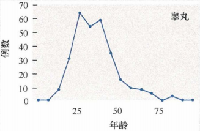
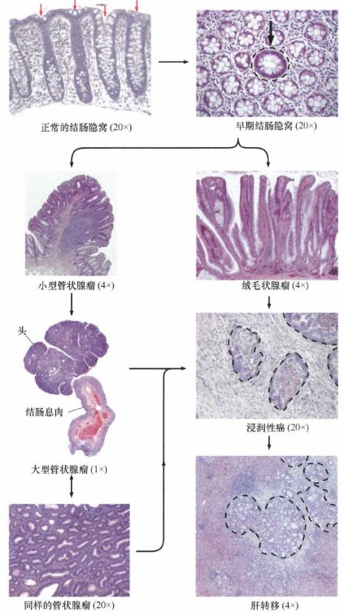
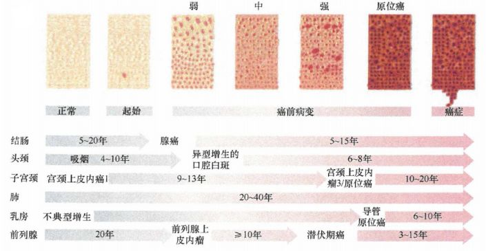
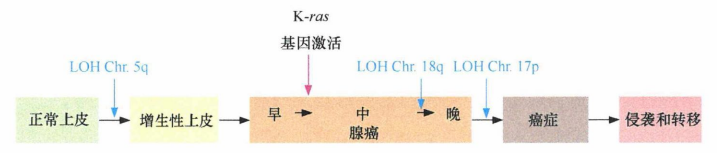
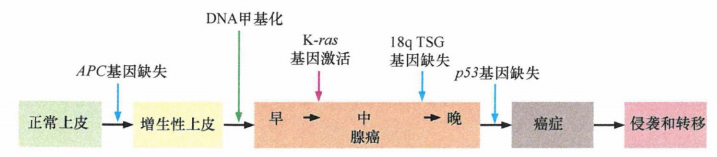
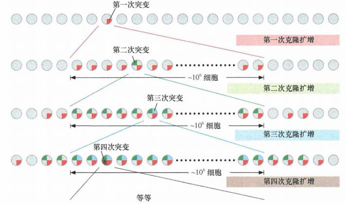

# 第十一章 《癌生物学》第十一章（1）  肿瘤多阶段发展

**往期回顾**

[《癌生物学》第六章（1）酪氨酸磷酸化的调控作用](http://mp.weixin.qq.com/s?__biz=Mzg4NjA5Mzg2Mw==&mid=2247486271&idx=2&sn=1cd38152b98c45961b1b2e95fe30a7d9&chksm=cf9faa77f8e8236176748bdc5a18442cbded1d791b7a49db5f7a64076215dab2a339f6ecf2d8&scene=21#wechat_redirect)
 
[《癌生物学》第六章（2）Ras下游3条重要的信号通路](http://mp.weixin.qq.com/s?__biz=Mzg4NjA5Mzg2Mw==&mid=2247486293&idx=2&sn=9ffda5507d1a485d9b3f289333c71af8&chksm=cf9faa1df8e8230bf23de9c88af7810c8454a6b9838d40c23cad3074d99ff397bb56e5c1b6bd&scene=21#wechat_redirect)
 
[《癌生物学》第六章（3）细胞内其他信号网络](http://mp.weixin.qq.com/s?__biz=Mzg4NjA5Mzg2Mw==&mid=2247486528&idx=1&sn=d46485bf93b08b6ca5f6a52106ce18cd&chksm=cf9fad08f8e8241e16e7d85e350239210c93e196fa16593113968c79457f0f9dfed86d3aa845&scene=21#wechat_redirect)
 
[《癌生物学》第七章（1） 抑癌基因与肿瘤细胞表型](http://mp.weixin.qq.com/s?__biz=Mzg4NjA5Mzg2Mw==&mid=2247486664&idx=1&sn=52597f9e0e4f0027c3bfc4c17954eba0&chksm=cf9fad80f8e824965ed77e0a87f16cb145e8ec9b80f3c4597624f7ea84882af22653207a8437&scene=21#wechat_redirect)
 
[《癌生物学》第七章（2） 抑癌基因的发现与探索](http://mp.weixin.qq.com/s?__biz=Mzg4NjA5Mzg2Mw==&mid=2247486671&idx=2&sn=18afb1b90118fc8ce0521c9f10a73d16&chksm=cf9fad87f8e8249117a3d1e0395cfabbda447a5a4410d4a9ff913043bee26d6ec8899e4aceb3&scene=21#wechat_redirect)
 
[《癌生物学》第七章（3） 抑癌基因的作用实例](http://mp.weixin.qq.com/s?__biz=Mzg4NjA5Mzg2Mw==&mid=2247486678&idx=2&sn=91703b8b6417578486ac512a09a064d2&chksm=cf9fad9ef8e82488061f0150a628ffa88f89b81d7f3155c0797ec2c4b4aef0a12bbd9db66ed8&scene=21#wechat_redirect)
 
《癌生物学》第八章（1）细胞周期控制时钟
 
[《癌生物学》第八章（2）pRb在细胞周期时钟中的作用](http://mp.weixin.qq.com/s?__biz=Mzg4NjA5Mzg2Mw==&mid=2247487021&idx=1&sn=5b7c94bc179e2002f3c9a5713b0733c3&chksm=cf9faf65f8e82673762e74e560b7a481ee1561a6845ed2cdcf87ed1cef9427db47c7ad68d437&scene=21#wechat_redirect)
 
[《癌生物学》第八章（3）Myc、TGF-β在细胞周期时钟中的作用](http://mp.weixin.qq.com/s?__biz=Mzg4NjA5Mzg2Mw==&mid=2247487022&idx=1&sn=013769ab286813e3834183669c3fe69b&chksm=cf9faf66f8e82670baab3d827866f7b2b668259bbacfb38aedb0f0626ecc2dadf1f1235c895a&scene=21#wechat_redirect)
 
[《癌生物学》第九章（1） p53——抑癌基因](http://mp.weixin.qq.com/s?__biz=Mzg4NjA5Mzg2Mw==&mid=2247487247&idx=1&sn=50b6eaf0623c0c134f4c6588f68c3689&chksm=cf9fae47f8e82751bc562b5867da4f7cbecc9cfcd3bb65c3ea19891184fc6f4bd5cccf590299&scene=21#wechat_redirect)
 
[《癌生物学》第九章（2）  P53水平的调控](http://mp.weixin.qq.com/s?__biz=Mzg4NjA5Mzg2Mw==&mid=2247487248&idx=1&sn=f33178b9d3428da2eb7ec91e7fe1e8f6&chksm=cf9fae58f8e8274e3234ef693fd33bda4ab3a62f6f3e790ea677a4dbe61b2b87e945202fb99d&scene=21#wechat_redirect)
 
[《癌生物学》第九章（3）  P53的生物学功能](http://mp.weixin.qq.com/s?__biz=Mzg4NjA5Mzg2Mw==&mid=2247487249&idx=1&sn=812b0a64097fabf21da4b79650fe668d&chksm=cf9fae59f8e8274f0f4165f157155304db6f91b85bc141e38330e8b09c94173ff44a8e03718c&scene=21#wechat_redirect)
 
[《癌生物学》第九章（4）  凋亡与肿瘤](http://mp.weixin.qq.com/s?__biz=Mzg4NjA5Mzg2Mw==&mid=2247487251&idx=2&sn=c670121fa3e55e6eac50a606096bd292&chksm=cf9fae5bf8e8274d404393647fc7eca19b7f54bdac964ad16003b9b0f5f9eeaf767e843dcecb&scene=21#wechat_redirect) 

 
[《癌生物学》第十章（1）肿瘤细胞无限增殖的两个障碍](http://mp.weixin.qq.com/s?__biz=Mzg4NjA5Mzg2Mw==&mid=2247487501&idx=1&sn=3923a4a34cbabaf58f5c49f5973e4149&chksm=cf9fb145f8e83853ba49d4d8e6512b681ff674bfdf4724ff3a519130d9f6173242dad0e80132&scene=21#wechat_redirect)
 
[《癌生物学》第十章（2）端粒和端粒酶](http://mp.weixin.qq.com/s?__biz=Mzg4NjA5Mzg2Mw==&mid=2247487506&idx=1&sn=4e2df94146e3a9328b7ca74b03a573da&chksm=cf9fb15af8e8384c2bdcf218c35b9497ffd1f521e658084df49d4be5f9eed137d39211a67935&scene=21#wechat_redirect)
 
[《癌生物学》第十章（3）端粒酶的双重角色](http://mp.weixin.qq.com/s?__biz=Mzg4NjA5Mzg2Mw==&mid=2247487507&idx=2&sn=2b23b04530bff885efd741fed554d46f&chksm=cf9fb15bf8e8384d1670f2d518fdc4aa87cd47a756936cca722f2c6b88df16c699570d0cc205&scene=21#wechat_redirect)

“正常个体的组织细胞通过演化并逐步发展成具有恶性表型的肿瘤，这一过程称为肿瘤进展。进化过程使正常细胞和肿瘤细胞之间建立了一系列的屏障，肿瘤进展过程中所完成的每一步都可以看作是癌前细胞克隆性生长的屏障被破坏的过程。 前面的大多数章节主要讲述的是肿瘤发生过程中某些单独的细胞防癌控制系统，现在我们将这些单独的线索综合起来，看看到底这些系统的改变是如何促进肿瘤形成的。 ”

1、 大多数人类癌症的发生发展需要数十年时间

流行病学调查显示，年龄是癌症发病的一个重要因素。在美国， 70岁男性死于结肠癌的风险比10岁儿童高出大约1000倍 ， 包括 结肠癌 在内的许多常见癌症同样需要经过几年或几十年的发生与发展。

图 11-1-1： 不同年龄阶段的癌症发病率

在五十岁后，大多数 典型 类型 的 肿瘤发病率随着年龄的增长急剧增加 。 然而，特定癌症的年龄发病率并不遵循这一规律 ，如：睾丸癌。

图 11-1-2： 睾丸癌发病率随年龄的变化

这些不同的肿瘤行为表明，研究肿瘤形成的动力学机制和发生率，还需要考虑除不断增长的年龄以外的其他因素 。如： 致癌物质增加了特定肿瘤进展的速度，比自然背景下的肿瘤进展速率快许多个数量级 。

2、 多阶段致癌学说的组织病理学依据

人类肿瘤发生发展的多阶段性概念在肠上皮组织中已经被阐述得很清楚了。

上皮细胞层是大多数结肠癌发生病理变化的位置。结肠癌病理活检分析可以显示多种组织形态，从几乎很难与正常组织区分的轻度恶变到多种细胞混杂的高度恶变。这种由多种组织形态组成的结构很难与正常肠黏膜（结肠腔内层结构）区分开，逐渐形成高度恶变的组织。与正常的肠道上皮一样，这些肿瘤也由各种不同的细胞类型构成，事实上几乎正常组织中存在的所有类型细胞在肿瘤组织中都有存在。

一些增生性病变表现出几乎正常的组织学形态，这些细胞的外观和正常细胞相同。然而，这些增生区域的上皮细胞具有显著的分裂能力，从而形成比正常情况下更厚的上皮细胞层。但是有些其他的增生细胞却表现出异常组织学形态，如结肠黏膜上皮细胞不再形成规则的细胞层，个体细胞 的形态与正常细胞存在不同程度的差异。这类细胞增殖称为不典型增生。当进一步增殖会使赘生物体积更大、结构异常更明显，细胞内包含不典型增生细胞且细胞层显著增厚，此时的赘生物称为息肉或腺瘤。在结肠中存在着不同类型的息肉：有些沿着结肠生长，有些通过蒂与结肠壁相连。通常认为这些赘生物是良性的，它们都没有突破基底膜而浸润到基质组织。细胞形态异常更加明显的赘生物如果突破基底膜并向下浸润即认为是恶性组织。这些恶性程度较强的结肠癌与相关癌细胞之间是有分级的，其分级主要依赖于细胞是否侵入基质层和平滑肌层，以及这些增生物中的细胞是否迁移转移至解剖学上的机体远处位置。

图 11-1-3： 人类结肠癌组织的病理学形态改变

将这些演进中的组织表型从正常发展到具有侵袭性进行排序，可以看到这种演进过程精确地描述了结肠中肿瘤发展的实际情况。

图 11-1-4： 不同器官部位的多步骤肿瘤发生过程

此外，有人对进行结肠镜检的大规模患者人群进行了临床研究。在这些患者中常规进行结肠镜检 以监控结肠偶尔发生的腺瘤性息肉，并在一旦发现的时候将其切除。在一项研究随访中发现，那些被切除了息肉的患者在多年后其结肠癌的发生率降低了 80%。这一结果表明，在这一人群中，至少80%的结肠癌来源于已经存在的、可检测到的腺瘤。（这些研究不足以证明所有人类的结肠癌都是由已经存在的腺瘤发展而来的）

3、 肿瘤进展过程中会不断积累遗传学与表观遗传学变化

遗传进展与表型进展之前的平行性最初来源于对人类结肠癌的研究。

约翰霍普金斯大学医学院的研究者们得到许多证据表明诸如 ras和p53之类的等位基因突变会在体外的实验条件下导致细胞转化。因此，他们又进一步确定是否能通过检测小结肠腺瘤、中等体积腺瘤、大腺瘤和癌的基因组发现在体内也存在这种关系。令人高兴的是，他们发现 **随着结肠组织从正常至高度癌变进展的过程中，这一系列组织中的上皮细胞会不断积累越来越多的这类基因突变** 。

在这项具有里程碑意义的工作中，研究者发现早期腺瘤就已经表现出 5号染色体长臂（5q) 的杂合性缺失。而对于体积稍大的腺瘤，几乎50%会另外携带突变的K-ras癌基因。而在体积更大的腺瘤中，18号染色体长臂（18q) 倾向于发生高频率的杂合性缺失。几乎一半的结肠癌会在此基础上发生17号染色体短臂（17p) 的杂合性缺失。

图 11-1-5： 染色体杂合性缺失与结肠癌进展

这些结果强烈支持了这样一个观点：在肿瘤进展过程中，随着上皮细胞获得癌变表型，它们的基因组相应表现出越来越多的大量遗传位点改变。这些改变会累及原癌基因激活为癌基因 (K-ras) 及至少三个不同抑癌基因的显著失活，这些基因改变对于结肠癌发生同样重要。这一观点首次提出了我们现在看来是一个相当常见的现象：在人类肿瘤细胞基因组中，失活的抑癌基因数量远远超过被激活的癌基因数量。

在这一遗传事件发现不久就发现了 5号和17号染色体遗传位点包含的抑癌基因。染色体杂合性缺失经常累及的5q21包含的基因是APC(结肠腺瘤样息肉）抑癌基因，染色体17p13区则被鉴定为p53抑癌基因的位点。而结肠癌发生过程中染色体18q区域所累及的抑癌基因还没有鉴定出来。这一染色体区段在60%以上的人类结肠癌中都存在着杂合性缺失，这段区域包含的最可能的抑癌基因是DPC4/MADH4，它编码的Smad4把TGF- β 受体产生的生长抑制信号传递至细胞核内。但是， DPC4/MADH4基因拷贝仅在不到35%的结肠癌中存在着突变或转录抑制，并且它旁边的一个基因Smad2也经常以稍低的频率发生失活。这就使大部分肿瘤中染色体18q上被LOH或其他机制失活的抑癌基因身份难以确定。

图 11-1-6： 抑癌基因与结肠癌进展 ： 80%结肠癌在进展的早期有5号染色体长臂APC基因的失活 ； 35%的病例存在K-ras基因突变 ； 不足 50%病例的17号染色体有杂合性缺失 ； 60%病例18号染色体长臂杂合性缺失 ； 约 30%的结肠癌存在导致TGF- β 受体失活的突变或启动子甲基化

依赖于肿瘤发生的多步骤模型，我们能够理解为什么遗传了突变的 APC等位基因会导致息肉病和结肠癌：作为结肠癌进展的第一步，家族性息肉病患者的所有结肠上皮细胞中已经存在了APC基因拷贝失活，这些患者体内包括结肠细胞在内的所有细胞都是APC +/- 基因型而不是 APC -/- 基 因型。由于在每一代细胞分裂中杂合性缺失是相对高发的事件，家族性腺瘤息肉病患者生命早期就可能会产生上百个、甚全上千个完全失去 APC功能的结肠上皮细胞，从而进入APC -/- 的基因型状态。每个 APC阴性的细胞成长为腺瘤性息肉的可能性都很大，这种息肉一旦形成，就很可能会发展为癌。

肿瘤形成过程中这些多步骤遗传和表观遗传学事件的积累可能表明肿瘤发生的最终细胞产物与它们完全正常的前体细胞（起源细胞）之间的相似性很低。但是，越来越多的研究发现即使经历了几年（如果不是几十年的话）的演变，正常起源细胞的大部分分化程序仍然存在于其癌变子代细胞中。因此，即使肿瘤细胞基因组中的某些致癌改变倾向于导致细胞的分化特征缺失，这一缺失也是不完全的。实际上，大部分肿瘤中都还保留养分化的特征（不同的形态学和蛋白质标志分子），这使病理学家能够相当准确地把这些肿瘤分成不同的类型 。

4 、 肿瘤发生似乎符合达尔文进化论

对于肿瘤进展来说，进化单元是细胞群体中互相竞争的个体细胞，而不是种群中互相竞争的生物 个体。如现代达尔文进化论所描述，随机突变在细胞群体中产生了遗传多样性。一旦产生遗传异质性群体，那些利于细胞在活体组织微环境内生长的特征就会在选择压力下使细胞获得优势生长。

把达尔文进化论与肿瘤进展多步骤理论结合起来，能够把肿瘤发生过程描述为一个序贯的克隆扩增过程：随机突变能产生具有优势生长和生存能力的细胞，这一细胞和它的子代细胞能够比它们周围的细胞更高效地增殖，最终产生一个大的克隆细胞群，从而成为肿瘤组织的主要成分并从遗传上淹没了不具优势的邻近细胞。这一细胞克隆早晚会达到足够大的体积（如 10 6 细胞）使细胞克隆易于随机发生其他具有生存优势的突变（突变频率大约为 l/10 6 )。

图 11-1-7： 达尔文进化论与克隆演进 ： 有机体通过基因组中的突变推动物种的进化，肿瘤进展过程中细胞群体内的可遗传改变可能也发挥了同样的作用

需要注意，肿瘤进展的达尔文进化模型是非常简化的。

首先，必须把基因的表遗传学改变（准确地说是启动子甲基化 ) 在抑癌基因失活中具有重要作用这一发现引入达尔文进化理论。其次，用肿瘤进展过程中受累的遗传位点数量计数来进行估计，我们可能低估了肿瘤进展中所需的不同步骤事件数目。抑癌基因的失活总是衙要两个步骤才能完成，因此肿瘤进展过程中发生的不同改变的数量大约是相关突变位点数量的两倍。

由于这些克隆增殖是由低频率的遗传或表观遗传学改变引发的，这些克隆的扩增很可能间隔很长时间。在散发性结肠癌发生过程中，两个关键遗传改变事件发生之间可能间隔 1年甚至更长时间。对于许多个体来说，整个肿瘤进展过程可能要一个多世纪的时间才能完成。

但是，也有一些人在很短的时间内发生散发性结肠癌，因此在这些个体的结肠中这一程序一定被 压 缩执行了。最近的研究发现肿瘤的多步骤进展发生过程中所发生的突变数景远远超过驱动肿瘤发生所实际需要的突变数量，这使 勾描 肿瘤遗传图谱变得更加复杂了。

参考书目： 《The Biology of Cancer》（Second Edition）  R.A.Weinberg  著，詹启敏 等  译

编辑：周健 张月明 游丹铭

校审：张健 罗鹏

