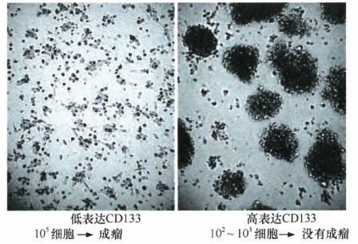
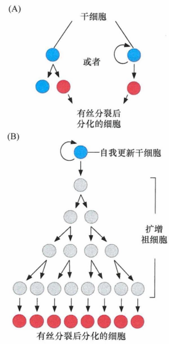
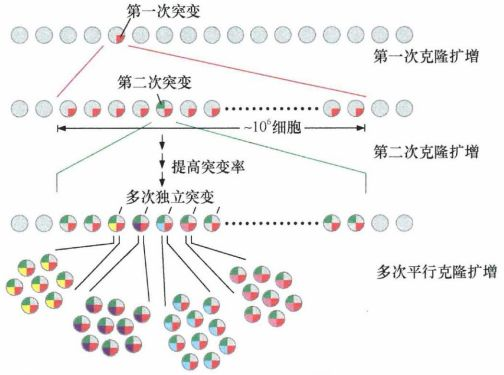
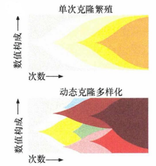
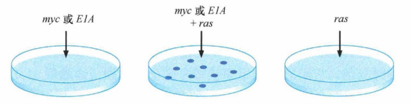
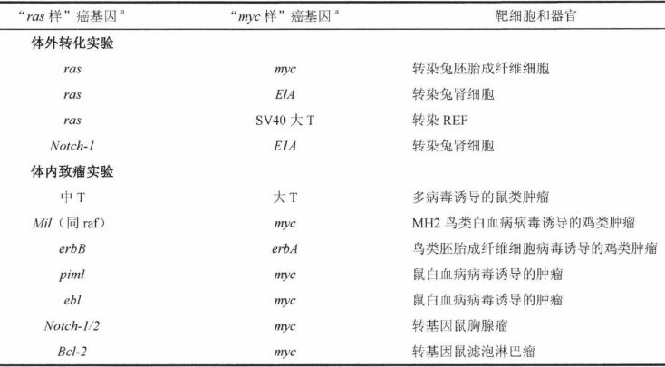

# 第十一章 《癌生物学》第十一章（2） 对进化论解释肿瘤发展的补充

**往期回顾**

[《癌生物学》第六章（1）酪氨酸磷酸化的调控作用](http://mp.weixin.qq.com/s?__biz=Mzg4NjA5Mzg2Mw==&mid=2247486271&idx=2&sn=1cd38152b98c45961b1b2e95fe30a7d9&chksm=cf9faa77f8e8236176748bdc5a18442cbded1d791b7a49db5f7a64076215dab2a339f6ecf2d8&scene=21#wechat_redirect)
 
[《癌生物学》第六章（2）Ras下游3条重要的信号通路](http://mp.weixin.qq.com/s?__biz=Mzg4NjA5Mzg2Mw==&mid=2247486293&idx=2&sn=9ffda5507d1a485d9b3f289333c71af8&chksm=cf9faa1df8e8230bf23de9c88af7810c8454a6b9838d40c23cad3074d99ff397bb56e5c1b6bd&scene=21#wechat_redirect)
 
[《癌生物学》第六章（3）细胞内其他信号网络](http://mp.weixin.qq.com/s?__biz=Mzg4NjA5Mzg2Mw==&mid=2247486528&idx=1&sn=d46485bf93b08b6ca5f6a52106ce18cd&chksm=cf9fad08f8e8241e16e7d85e350239210c93e196fa16593113968c79457f0f9dfed86d3aa845&scene=21#wechat_redirect)
 
[《癌生物学》第七章（1） 抑癌基因与肿瘤细胞表型](http://mp.weixin.qq.com/s?__biz=Mzg4NjA5Mzg2Mw==&mid=2247486664&idx=1&sn=52597f9e0e4f0027c3bfc4c17954eba0&chksm=cf9fad80f8e824965ed77e0a87f16cb145e8ec9b80f3c4597624f7ea84882af22653207a8437&scene=21#wechat_redirect)
 
[《癌生物学》第七章（2） 抑癌基因的发现与探索](http://mp.weixin.qq.com/s?__biz=Mzg4NjA5Mzg2Mw==&mid=2247486671&idx=2&sn=18afb1b90118fc8ce0521c9f10a73d16&chksm=cf9fad87f8e8249117a3d1e0395cfabbda447a5a4410d4a9ff913043bee26d6ec8899e4aceb3&scene=21#wechat_redirect)
 
[《癌生物学》第七章（3） 抑癌基因的作用实例](http://mp.weixin.qq.com/s?__biz=Mzg4NjA5Mzg2Mw==&mid=2247486678&idx=2&sn=91703b8b6417578486ac512a09a064d2&chksm=cf9fad9ef8e82488061f0150a628ffa88f89b81d7f3155c0797ec2c4b4aef0a12bbd9db66ed8&scene=21#wechat_redirect)
 
《癌生物学》第八章（1）细胞周期控制时钟
 
[《癌生物学》第八章（2）pRb在细胞周期时钟中的作用](http://mp.weixin.qq.com/s?__biz=Mzg4NjA5Mzg2Mw==&mid=2247487021&idx=1&sn=5b7c94bc179e2002f3c9a5713b0733c3&chksm=cf9faf65f8e82673762e74e560b7a481ee1561a6845ed2cdcf87ed1cef9427db47c7ad68d437&scene=21#wechat_redirect)
 
[《癌生物学》第八章（3）Myc、TGF-β在细胞周期时钟中的作用](http://mp.weixin.qq.com/s?__biz=Mzg4NjA5Mzg2Mw==&mid=2247487022&idx=1&sn=013769ab286813e3834183669c3fe69b&chksm=cf9faf66f8e82670baab3d827866f7b2b668259bbacfb38aedb0f0626ecc2dadf1f1235c895a&scene=21#wechat_redirect)
 
[《癌生物学》第九章（1） p53——抑癌基因](http://mp.weixin.qq.com/s?__biz=Mzg4NjA5Mzg2Mw==&mid=2247487247&idx=1&sn=50b6eaf0623c0c134f4c6588f68c3689&chksm=cf9fae47f8e82751bc562b5867da4f7cbecc9cfcd3bb65c3ea19891184fc6f4bd5cccf590299&scene=21#wechat_redirect)
 
[《癌生物学》第九章（2）  P53水平的调控](http://mp.weixin.qq.com/s?__biz=Mzg4NjA5Mzg2Mw==&mid=2247487248&idx=1&sn=f33178b9d3428da2eb7ec91e7fe1e8f6&chksm=cf9fae58f8e8274e3234ef693fd33bda4ab3a62f6f3e790ea677a4dbe61b2b87e945202fb99d&scene=21#wechat_redirect)
 
[《癌生物学》第九章（3）  P53的生物学功能](http://mp.weixin.qq.com/s?__biz=Mzg4NjA5Mzg2Mw==&mid=2247487249&idx=1&sn=812b0a64097fabf21da4b79650fe668d&chksm=cf9fae59f8e8274f0f4165f157155304db6f91b85bc141e38330e8b09c94173ff44a8e03718c&scene=21#wechat_redirect)
 
[《癌生物学》第九章（4）  凋亡与肿瘤](http://mp.weixin.qq.com/s?__biz=Mzg4NjA5Mzg2Mw==&mid=2247487251&idx=2&sn=c670121fa3e55e6eac50a606096bd292&chksm=cf9fae5bf8e8274d404393647fc7eca19b7f54bdac964ad16003b9b0f5f9eeaf767e843dcecb&scene=21#wechat_redirect)
 
[《癌生物学》第十章（1）肿瘤细胞无限增殖的两个障碍](http://mp.weixin.qq.com/s?__biz=Mzg4NjA5Mzg2Mw==&mid=2247487501&idx=1&sn=3923a4a34cbabaf58f5c49f5973e4149&chksm=cf9fb145f8e83853ba49d4d8e6512b681ff674bfdf4724ff3a519130d9f6173242dad0e80132&scene=21#wechat_redirect)
 
[《癌生物学》第十章（2）端粒和端粒酶](http://mp.weixin.qq.com/s?__biz=Mzg4NjA5Mzg2Mw==&mid=2247487506&idx=1&sn=4e2df94146e3a9328b7ca74b03a573da&chksm=cf9fb15af8e8384c2bdcf218c35b9497ffd1f521e658084df49d4be5f9eed137d39211a67935&scene=21#wechat_redirect)
 
[《癌生物学》第十章（3）端粒酶的双重角色](http://mp.weixin.qq.com/s?__biz=Mzg4NjA5Mzg2Mw==&mid=2247487507&idx=2&sn=2b23b04530bff885efd741fed554d46f&chksm=cf9fb15bf8e8384d1670f2d518fdc4aa87cd47a756936cca722f2c6b88df16c699570d0cc205&scene=21#wechat_redirect)
 
[《癌生物学》第十一章（1）  肿瘤多阶段发展](http://mp.weixin.qq.com/s?__biz=Mzg4NjA5Mzg2Mw==&mid=2247487819&idx=1&sn=9e5153efeab13f233efce6fcefd01d53&chksm=cf9fb003f8e83915e4fca96afb9676a896222551f89c72698dd51b2a159d2098acaf2db3c0f2&scene=21#wechat_redirect) 

 

 

 
“通过上一讲，我们知道了，肿瘤的发生发展经常需要历经数十年时间。 肿瘤 在 进展过程中会不断积累遗传学与表观遗传学变化 ，使其 最终细胞产物与它们完全正常的前体细胞（起源细胞）之间的相似性很低 。 达尔文进化论 可以帮助我们从一个角度理解 肿瘤 的 多步骤进展 ，但其 模型是非常简化的 ，因此我们需要更广泛、深刻地理解。 ”

1、 肿瘤干细胞与克隆演化和肿瘤进展

人类肿瘤中的细胞根据其细胞表面蛋白被分为不同亚型，利用荧光激活细胞分选技术（ FACS）可以通过带有荧光染料的单克隆抗体标记不同亚型的细胞，从而将不同亚型的肿瘤活细胞分离开来。

研究人员 用 FACS方法将AML分为多数和少数两个细胞群体，在一次实验中：少数群体细胞只占不到 1%，只需5000个左右的这类少数群体细胞注射入宿主小鼠体内就可形成新的肿瘤，因此被认为只有“成瘤性”；相反，来自多数细胞群体的多达500000个AML细胞却不能形成肿瘤。少数细胞群体接种后最终形成的肿瘤再次分为了大、小两个细胞群体。和原先一样，这两类细胞的成瘤性差异极大 。

这些结果表明 **AML肿瘤由两种类型细胞组成，小部分是具有自我更新能力的成瘤细胞，大部分是不具有体内增殖能力或仅有很小增殖能力的分化细胞** 。

类似结果随后 拓展到了 乳腺癌 、 脑肿瘤 和 其他实体瘤如胰腺癌、直肠癌、肝癌及某些恶性造血系统肿瘤中 。

图 11-2-1： 多至 10 5 个 低表达 CD 1 33细胞不能在宿主小鼠体内形成肿瘤； 少 至 10 2 个 高表达 CD 1 33细胞能在免疫缺陷小鼠体内形成肿瘤

正常组织中的细胞呈现等级结构的组织形式。干细胞处于等级结构的顶层，它的一个子代细胞仍然保持干细胞状态，另一个子代细胞则启动分化程序。已经脱离干细胞状态的细胞通常称为过渡扩增细胞，也称为前体细胞。这些细胞在许多正常组织中都存在，代表着干细胞和它们的完全分化后代细胞之间的过渡细胞群。过渡扩增细胞／前体细胞能够经过很多代次的分裂，它们的子代细胞最终会进入完全分化状态、停止活跃的生长－分裂周期。因此，最初形成的过渡扩增细胞／前体细胞能够扩展出几十个、甚至数百个分化的后代细胞。这表明：干细胞只需要分裂一次就能够产生大量完全分化的子代细胞，因此即使在不断地丢失和再生分化细胞的组织中干细胞也仅采用周期性分裂的方式，而不是持续性的分裂方式，而组织内的大部分细胞分裂通常是以指数形式生长的过渡扩增细胞。

图 11-2-2： 干细胞与它们的后代细胞：（ A）干细胞的不对称分裂：子代细胞一个成为与亲本细胞一样的干细胞（蓝色） ； 另一个（红色） 发生 分化而失去分裂能力 （ B）干细胞的一个子代细胞成为干细胞 ， 另一个 子代 细胞形成 “过渡扩增细胞”（灰色）进入分化程序但并不进入终末分化状态 ， 这些细胞以及它们的后代细胞发生一系列对称分裂，最终会进入完全分化的 后 有丝分裂状态（红色）

这一理论被用来解释肿瘤细胞的组织：肿瘤起始细胞（肿瘤干细胞， CSC）是一种具有自我更新能力的细胞，能够产生组成瘤体的无数肿瘤后代细胞。虽然 CSC 和它的后代细胞在遗传上是完全相同的，但后代细胞由于失去了自我更新能力从而也失去了起始肿瘤形成的能力。肿瘤仅仅是利用了它们正常组织来源的干细胞中的调控程序，而不会创造出新的干细胞调控程序。

CSC 的存在使肿瘤内的复杂性又增加了一个维度 ： 先前我们勾画了一个正常细胞发展至肿瘤细胞的线性、一维进展过程。现在，似乎以二维图的方式描绘肿瘤的多步骤进展过程更合适，每一阶段形成的干细胞衍生出多个不同的亚细胞群，这些细胞群都或多或少地发生了不同程度的分化。

然而，如果认为多步骤肿瘤进展过程的每个阶段都有这种干细胞等级结构，还有很多问题尚不清楚：每个阶段的细胞是如何进化成为下一阶段的细胞的，尤其是该阶段的哪个肿瘤细胞亚群会获得触发新的克隆扩增所需要的突变以使细胞进入下一进展阶段 ？ 肿瘤干细胞的准确正常细胞来源 是什么？ 形成的瘤体中所有肿瘤细胞的前体细胞的正常细胞是干细胞还是过渡增殖细胞或祖细胞？我们将在第 16章讨论这些问题，敬请期待！

2、 肿瘤内异质性

到目前为止，我们所提出的克隆演进模型、认为肿瘤团块内参与形成某个特定克隆扩增的所有细胞在遗传学上都是彼此相同的，根据这一理论，如果我们要检测癌前或癌细胞团中的细胞的话，我们几乎总会发现团块中某个遗传学上同质的细胞克隆占据主体成分，这是它过度生长并大范围代替产生它的前体细胞的结果。

但是，随着肿瘤的进展，肿瘤基因组经常会变得更加不稳定，每一代细胞增殖获得突变的机率大大增加，遗传改变以及由此导致遗传差异的速率很快会超过达尔文选择的速率。因此，许多肿瘤团块中共存着大量遗传上不同的细胞亚克隆。例如，在人的胰腺癌中，肿瘤不同部位的基因组序列分析发现了肿瘤内具有不同遗传特征的亚克隆，每个亚克隆约含至少 100万个细胞。每个亚克隆及其相关细胞在肿瘤内的定位并不明确。用计算机技术对肿瘤内每个细胞进行分析会发现：每个亚克隆的细胞是彼此交织渗透的。

图 11-2-3： 肿瘤团块中存在遗传上不同的亚克隆：肿瘤进展过程中，肿瘤细胞的基因组经常会变得越来越不稳定，产生突变等位基因的速率可能会超过达尔文选择的速率

在原发肿瘤内还存在其他尚未完全了解的遗传差异性来源。例如，有明确的证据表明相距很远的转移灶之间的细胞能够重新归巢至原发灶并再次形成肿瘤种植克隆。这意味着在这些转移灶中发生的任何遗传进化会被反馈至原发肿瘤灶的基因池中并成为原发灶的遗传变异来源之一。

图 11-2-4： 肿瘤内存在高度变异的不同细胞克隆

对人类肿瘤进行的常规检测还发现了肿瘤内异质性的另一个来源：表遗传学可塑性。对肿瘤切片中的蛋白表达进行免疫荧光染色发现肿瘤内存在着明显不同的小灶状肿瘤细胞亚群，这种改变很有可能是由于表遗传学机制导致的 —肿瘤微环境内细胞—细胞之间信号通路的局部波动会使细胞产生表型差异，而这并不能直接用它们的遗传变异来解释。诸如此类的研究结果提示：在肿瘤内共生着不同表型的亚细胞群，它们彼此之间并非直接竞争，而是支待彼此的生长和生存。

这种遗传异质性累积的结果可能体现在两个水平：特定肿瘤不同的亚克隆包含不同的遗传改变的组合；不同患者之间同一类型肿瘤之间的差异。因此，这些肿瘤的基因型之间可能会存在着巨大的差异。

3、 单个基因突变不能使正常细胞发生转化

将有活性的膀胱癌 H-ras癌基因突变体导入正常的NIH3T3成纤维细胞，从而获得含有突变的ras癌基因的转化细胞，并最终能在合适的宿主小鼠体内形成肿瘤。 而 用 上述 原代大鼠和仓鼠细胞得到的实验 ， 通过对照实验可亳无疑问地确定这些原代细胞确实获得了转染的癌基因并表达 Ras蛋白，但它们没有发生转化 。

二者 结果 相悖， 是因为： NIH3T3细胞是一个细胞系，已经适应了培养环境并且能够无限增殖。这些细胞在某些环节已经发生了一个甚至更多的遗传或表观遗传学改变，使它们能够在培养条件下以永生化的方式生长和增殖。

事实上，仅仅单次单基因点突变，其本身不能使一个正常的细胞转变为癌细胞。用一个简单的估算验证：人体内每天发生细胞分裂的次数约为 3 X 10 11 ，人体总细胞数大于 3X 10 13 ，鉴于人类基因组中随机发生特定点突变的比率，每天都会有数百万计细胞携带 ras基因的致癌突变，但人并没有每天都产生肿瘤。

还有结果表明，即使是同时涉及活化的原癌基因 (K-ras)和失活的抑癌基因(AFC)两个突变等位基因，仍然不足以在人体中引发结肠癌。

4、 细胞转化常需要多个突变基因协同

20世纪80年代初，研究DNA肿瘤病毒时发现，它们的基因组中携带有多个癌基因，如多瘤病毒带有中T和大T基因两个突变。1982年，研究人员发现这两个癌基因具有协同促使啮齿类动物细胞发生转化的作用：大T蛋白有助于细胞适应培养环境并且发生永生化，中T蛋白诱导出许多与ras癌基因相关的表型。很快，在许多其他DNA肿瘤病毒中也发现了同样的多基因协同细胞转化的特征。

DNA肿瘤病毒诱导细胞转化的特征表明细胞内自身突变的基因也可能相互作用诱导细胞转化。实际上，在人早幼粒白血病细胞中就发现携带有活化的N-ras和myc两个癌基因，这表明两个癌基因可能共同决定了早幼粒白血病细胞的恶性型。这个猜想在一个简单的实验中得到了证实：当我们将myc基因与H-ras基因共同转染入大鼠的胚胎成纤维细胞时，便使其产生了恶性转化；然而，单独转入某一个癌基因并不能使其发生恶性转化 。

图 11-2-5：大鼠 胚胎成纤维 细胞转化需要 N-ras和myc两个癌基因协同

很快，研究者又发现了许多其他相互协同的癌基因能够诱导体外细胞转化和体内肿瘤发生。大多数情况下，相互作用的两个基因按照功能可分成两种：一种有 ras特性，另一种有myc特性。我们现在已知ras样癌基因参与组成细胞质中促有丝分裂级联信号反应，而myc样癌基因则扰乱发生在细胞核中的许多细胞周期调控机制。

表 11-2-1： 体内外癌基因共同作用的例子

这些癌基因之间相互作用的体外实验为体内细胞多级转化模型奠定了基础，同时也为人类肿瘤形成过程中复杂的基因改变提供了理论基础。每一个基因改变能够使细胞发生一种或者多种表型的变化，最终使得细胞发生恶性转化。细胞增殖和生存是受一系列不同细胞信号通路调控的，每一个癌基因都干扰细胞内某个特定的信号通路，肿瘤细胞在形成之前已经发生了这些通路的改变。

有趣的是，在特定实验条件下，可以通过改变单一基因而诱导细胞发生恶性转化。例如，在体外条件下鸡胚成纤维细胞（ CEF)仅仅通过RSV（Rous sarcoma virus)感染便可致瘤 ； 而在体内其肿瘤的形成仅发生在一些创伤部位，包括当时肌内注射 RSV时形成的创伤部位。因此成纤维细胞在创伤修复过程中发生的改变可能会促进RSV的src基因诱导肿瘤细胞转化。类似地，在对大鼠胚胎成纤维细胞处理的实验中显示：当从Petri培养皿中把经过ras基因转化的细胞分离出来进行培养时，这些细胞甚至不需要类似myc的另一些癌基因共同作用便能增殖形成癌细胞克隆 ； 而当这类细胞被正常的邻近细胞包围时（类似在体内）却不能增殖形成癌细胞克隆。

这些单一基因使细胞转化实验能够取得成功，可能是由于我们对活体组织内抗肿瘤形成机制并不完全了解，在活体组织内肿瘤形成还 需要 其他改变的相互作用。

参考书目： 《The Biology of Cancer》（Second Edition）  R.A.Weinberg  著，詹启敏 等  译

编辑：周健 张月明 游丹铭

校审：张健 罗鹏

