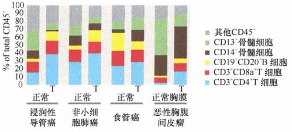
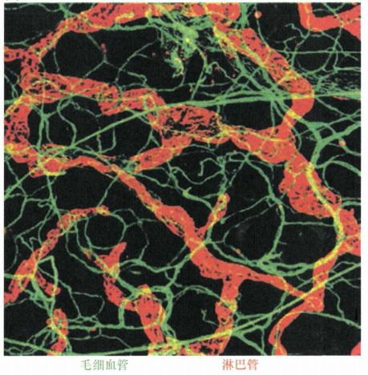
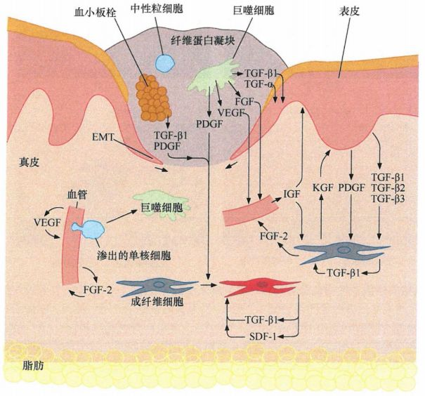
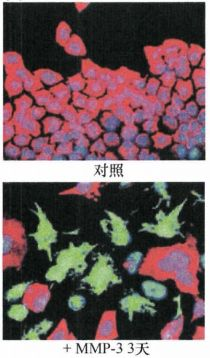
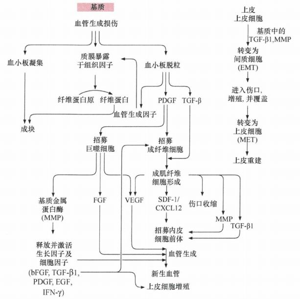
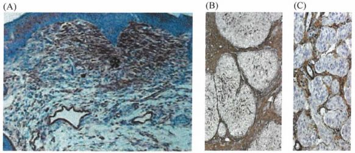

# 第十三章 《癌生物学》第十三章（1） 肿瘤发生类似伤口损伤愈合

**往期回顾**

《癌生物学》第八章（1）细胞周期控制时钟 [《癌生物学》第八章（2）pRb在细胞周期时钟中的作用](http://mp.weixin.qq.com/s?__biz=Mzg4NjA5Mzg2Mw==&mid=2247487021&idx=1&sn=5b7c94bc179e2002f3c9a5713b0733c3&chksm=cf9faf65f8e82673762e74e560b7a481ee1561a6845ed2cdcf87ed1cef9427db47c7ad68d437&scene=21#wechat_redirect) [《癌生物学》第八章（3）Myc、TGF-β在细胞周期时钟中的作用](http://mp.weixin.qq.com/s?__biz=Mzg4NjA5Mzg2Mw==&mid=2247487022&idx=1&sn=013769ab286813e3834183669c3fe69b&chksm=cf9faf66f8e82670baab3d827866f7b2b668259bbacfb38aedb0f0626ecc2dadf1f1235c895a&scene=21#wechat_redirect) [《癌生物学》第九章（1） p53——抑癌基因](http://mp.weixin.qq.com/s?__biz=Mzg4NjA5Mzg2Mw==&mid=2247487247&idx=1&sn=50b6eaf0623c0c134f4c6588f68c3689&chksm=cf9fae47f8e82751bc562b5867da4f7cbecc9cfcd3bb65c3ea19891184fc6f4bd5cccf590299&scene=21#wechat_redirect) [《癌生物学》第九章（2）  P53水平的调控](http://mp.weixin.qq.com/s?__biz=Mzg4NjA5Mzg2Mw==&mid=2247487248&idx=1&sn=f33178b9d3428da2eb7ec91e7fe1e8f6&chksm=cf9fae58f8e8274e3234ef693fd33bda4ab3a62f6f3e790ea677a4dbe61b2b87e945202fb99d&scene=21#wechat_redirect) [《癌生物学》第九章（3）  P53的生物学功能](http://mp.weixin.qq.com/s?__biz=Mzg4NjA5Mzg2Mw==&mid=2247487249&idx=1&sn=812b0a64097fabf21da4b79650fe668d&chksm=cf9fae59f8e8274f0f4165f157155304db6f91b85bc141e38330e8b09c94173ff44a8e03718c&scene=21#wechat_redirect) [《癌生物学》第九章（4）  凋亡与肿瘤](http://mp.weixin.qq.com/s?__biz=Mzg4NjA5Mzg2Mw==&mid=2247487251&idx=2&sn=c670121fa3e55e6eac50a606096bd292&chksm=cf9fae5bf8e8274d404393647fc7eca19b7f54bdac964ad16003b9b0f5f9eeaf767e843dcecb&scene=21#wechat_redirect) [《癌生物学》第十章（1） 肿瘤细胞无限增殖的两个障碍](http://mp.weixin.qq.com/s?__biz=Mzg4NjA5Mzg2Mw==&mid=2247487501&idx=1&sn=3923a4a34cbabaf58f5c49f5973e4149&chksm=cf9fb145f8e83853ba49d4d8e6512b681ff674bfdf4724ff3a519130d9f6173242dad0e80132&scene=21#wechat_redirect) [《癌生物学》第十章（2） 端粒和端粒酶](http://mp.weixin.qq.com/s?__biz=Mzg4NjA5Mzg2Mw==&mid=2247487506&idx=1&sn=4e2df94146e3a9328b7ca74b03a573da&chksm=cf9fb15af8e8384c2bdcf218c35b9497ffd1f521e658084df49d4be5f9eed137d39211a67935&scene=21#wechat_redirect) [《癌生物学》第十章（3） 端粒酶的双重角色](http://mp.weixin.qq.com/s?__biz=Mzg4NjA5Mzg2Mw==&mid=2247487507&idx=2&sn=2b23b04530bff885efd741fed554d46f&chksm=cf9fb15bf8e8384d1670f2d518fdc4aa87cd47a756936cca722f2c6b88df16c699570d0cc205&scene=21#wechat_redirect) [《癌生物学》第十一章（1）  肿瘤多阶段发展](http://mp.weixin.qq.com/s?__biz=Mzg4NjA5Mzg2Mw==&mid=2247487819&idx=1&sn=9e5153efeab13f233efce6fcefd01d53&chksm=cf9fb003f8e83915e4fca96afb9676a896222551f89c72698dd51b2a159d2098acaf2db3c0f2&scene=21#wechat_redirect) [《癌生物学》第十一章（2） 对进化论解释肿瘤发展的补充](http://mp.weixin.qq.com/s?__biz=Mzg4NjA5Mzg2Mw==&mid=2247487832&idx=1&sn=5e8fbe85d6c878d01fd5c8123597f738&chksm=cf9fb010f8e83906a15b3a4dde368c45a4878310af6d8ae7cea6ee854219ee36eabe1ca51ae4&scene=21#wechat_redirect) [《癌生物学》第十一章（3）参与肿瘤发展的因素之炎症](http://mp.weixin.qq.com/s?__biz=Mzg4NjA5Mzg2Mw==&mid=2247487874&idx=1&sn=d1adb72c268af79d532a0ede13f52abe&chksm=cf9fb0caf8e839dcdbc8eb23ce9779053eb50f64e7589bab3116b6ee14fb10b048f51388ec44&scene=21#wechat_redirect) [《癌生物学》第十二章（1）DNA损伤的预防](http://mp.weixin.qq.com/s?__biz=Mzg4NjA5Mzg2Mw==&mid=2247487949&idx=1&sn=107054f050f8b4d3404a6e371ddf3194&chksm=cf9fb085f8e839937724d4ada4c21deec6f12551160dd2933522d10f25fae38b9b8ac6f895a3&scene=21#wechat_redirect) [《癌生物学》第十二章（2）基因组损伤的来源](http://mp.weixin.qq.com/s?__biz=Mzg4NjA5Mzg2Mw==&mid=2247487974&idx=1&sn=f78a30cafd41835b2d9b7b52e63a5399&chksm=cf9fb0aef8e839b820ab28b8f4857b6ed209ac34864b16068dc5fdb0c413a2a27b1fa9481ef1&scene=21#wechat_redirect) [《癌生物学》第十二章（3）DNA修复缺陷引发的疾病](http://mp.weixin.qq.com/s?__biz=Mzg4NjA5Mzg2Mw==&mid=2247487974&idx=2&sn=274bb725f72e37dbc9653c58126a3b6a&chksm=cf9fb0aef8e839b8eab9358955de09d65d8a6fb27412a7c8f6eacf5b6b34752eb894c8f01eb1&scene=21#wechat_redirect) [《癌生物学》第十二章（4）癌细胞核型的变化](http://mp.weixin.qq.com/s?__biz=Mzg4NjA5Mzg2Mw==&mid=2247487974&idx=3&sn=c7fabdb23bf2fb1b8d6cb1e8cf231992&chksm=cf9fb0aef8e839b81c81319a584355725e04bab654f99985457158592285553a78527035da9a&scene=21#wechat_redirect)

“对癌症的许多认识都归功于还原论方法：将正常组织与肿瘤组织分解为细胞，再将这些细胞细化为分子。虽然由此获知的信息只涉及复杂系统的一小部分，但这部分至少是确信可靠的，且后续研究者对复杂系统及其组分进行研究时不必对这一部分做本质上的修改。

癌症绝不仅仅是肿瘤细胞内部相互作用的结果，相反，大多数肿瘤组织中恶变细胞与正常细胞不停地进行交流。本章我们将着重讨论上皮癌 ， 因为对这些肿瘤组织内部恶变细胞与正常细胞间的相互作用较其他类型肿瘤了解得更为清楚。 ”

1、 正常和恶性上皮组织均由相互依存的不同细胞类型组成

除了恶变的上皮细胞外，多种间质细胞也参与构成上皮来源肿瘤组织。这些间质细胞包括成纤维细胞、肌纤维细胞、内皮细胞、内皮细胞、平滑肌细胞、脂肪细胞、巨噬细胞、淋巴细胞及肥大细胞。种类繁多的间质细胞可产生结缔组织，以及在血液和免疫系统中产生多种免疫细胞，因此与转化后可导致癌变的上皮细胞在生物学上有很大区别。

图 13-1-1： 多色流式细胞仪监测实体瘤间质中的不同细胞类型

为什么其他类型的细胞会存在于上皮癌间质中呢？

一种可能的解释是：在这种组织中，适当比例的不同类型细胞必须依赖其间待续的信号交流，这种相互作用包括多种不同分化方向的细胞类型，它们之间的通信称为异质性信号转导，不同细胞通过这种方式促进或限制其邻近细胞的生长。 由此推测，在正常组织中的许多异质性相互作用在该组织形成的肿瘤中也发挥重要作用。这可能意味着如同正常上皮细胞一样， **肿瘤细胞通过招募邻近的正常组织和远处骨髓中的间质细胞来控制其数量并促进其增殖** 。另外，间质细胞也可能影响肿瘤上皮细胞的增殖和存活 。

在正常组织中，异质性信号通路主要依赖下列因子间的交换： 1.生长因子，如血小板衍生生长因子（PDGF）；2.生长抑制信号，如转化生长因子-β（TGF-β）；3.营养因子，如胰岛素样生长因子（IGF）。这些因子分泌到细胞外间隙的同时，通常短距离发挥仵用 ， 并且它们的定位对其功能非常重要 。

而在肿瘤组织中，间质－上皮异质性相互作用的各种细节到今天已经被详细阐明。它们几乎在肿瘤进程的所有阶段都起关键作用，包括肿瘤最初的形成阶段。例如，癌细胞释放生长因子、细胞因子和趋化因子招募巨噬细胞、中性粒细胞和淋巴细胞至肿瘤相关间质，然后招募 的细胞释放 TNF-α和前列腺素引起炎症反应，从而进一步促进附近上皮细胞的增殖和血管生成。在肿瘤形成以后异质性相互作用仍然存在。例如，肿瘤上皮细胞释放PDGF，而间质细胞（特别是成纤维细胞、肌成纤维细胞和巨噬细胞）含有相应的受体，同时间质细胞释放IGF-1,促进周围肿瘤细胞的生长和存活。

正常上皮组织中间质细胞和上皮细胞互相协作，建立起存在于二者之间的特殊细胞外基质（ ECM），也称为基底膜或基底层。组成毛细血管和大血管及淋巴管的内皮细胞是正常和恶变间质中的重要成分，这些内皮细胞的增殖由上皮和间质中的其他细胞促进，从而确保其获得充足的血液供应。当毛细血管被组装并具有功能后，可为邻近细胞提供足够的养料和氧；当细胞缺乏足够氧时就会释放可促进毛细血管生长的血管生成因子。

图 13-1-2： 毛细血管（绿色）和淋巴管（红色）交错成网：淋巴管直径远大于毛细血管，但淋巴管内皮细胞不受其下的壁细胞（周细胞和平滑肌细胞）支撑

当毛细血管生成时，内皮细胞分泌生长因子促进其他非内皮细胞的增殖。最重要的是，内皮细胞释放 PDGF和HB-EGF，吸引周皮细胞和血管平滑肌细胞，共同形成毛细血管外壁。当位于合适位置时，周皮细胞 又会 释放血管内皮 生长 因子（ VEGF）和促血管生成素-I(Ang-I)，反过来为最初招募它们的内皮细胞生长提供生长信号。

2、 癌细胞在形成细胞株的过程中行为异于体内肿瘤

为了在体外培养肿瘤细胞，研究者将肿瘤组织标本中的癌细胞 在 体外 培养皿中 培养。 然而 大多数情况下，这样的集落并不能形成 。 能够形成克隆的细胞常常是间质来源的，特别是成纤维细胞，可被培养基血清中的 PDGF促进生长。

少数情况下，在培养皿中长时间培养肿瘤组织，癌细胞增殖活跃的克隆的确能够生长起 来 。这些癌细胞在体外选择压力下，获得了自发生长的能力，且不依赖于间质的支持，因此其进化已经不再受大多数肿瘤中癌细胞在体内所处的肿瘤进展阶段的影响。这些肿瘤细胞系 （常用有几十株 ）是癌症研究的标准对象。这些细胞可被植入免疫缺陷小鼠中，迅速增殖并形成移植瘤。 （ 裸鼠、 NOD/SCID小鼠及RAGl/2小鼠由于缺乏免疫系统而可容忍其他物种的组织生长而被用于此类实验。 ）

3 、 肿瘤组织与未愈合的损伤组织类似

实际上，肿瘤内异质性相互作用的信号传递非常复杂，涉及许多信号分子在不同细胞间的交换 ， 且许多正常组织中不存在这样的信号转导 。 由此引出一些问题：肿瘤细胞是怎样学会释放和应答这样一系列异质性信号的？复杂的信号转导程序及其引起的生物应答是肿瘤在进化过程中逐渐获得的，还是肿瘤利用了正常组织中预存的程序？

1986年，有研究者在观察肿瘤组织和愈伤组织结构时，注意到许多信号转导在肿瘤发展和伤口愈合时有惊人的相似性。若这种相似性被证明的话，则说明癌细胞只不过是激活了复杂而普通的生理过程——伤口愈合，这 一 已经存在基因组中的程序。

图 13-1-3 ：伤口愈合模式图

伤口愈合过程已被研究得非常深入，当皮肤形成创伤时，血小板凝集并释放一些分子，包括血小板衍生生长因子（ PDGF）和转化生长因子-β(TGF-β）。伤口会释放血管活性因子，增加伤口附近血管的渗透性，帮助伤口从血浆中得到纤维蛋白原，后者转化为纤维蛋白，成为血块的支架，成簇的纤维蛋白缠绕在血小板团块周围起止血作用。 血小板释放的 PDGF能吸引成纤维细胞并刺激其增殖，随后血小板衍生的TGF-β激活这些肌成纤维细胞并诱导其分泌基质金属蛋白酶（MMP）。受伤位点招募的大量巨噬细胞也分泌这些蛋白酶。激活的成纤维细胞还释放有丝分裂原，如各种成纤维细胞生长因子（FGF），刺激特定上皮细胞的增殖。

MMP一旦释放，便开始降解胞外基质（ECM）中的特定成分，导致两种主要结果：一方面使ECM结构重塑，为新的细胞留出空间；另一方面导致许多黏附于ECM上且处于未激活状态的生长因子的释放并激活，包括碱性成纤维细胞生长因子(bFGF)、TGF-β、PDGF、EGF-相关因子和干扰素-γ（IFN-γ）。

血小板释放的和 ECM来源的生长因子随后吸引单核细胞（其会迅速分化成巨噬细胞）和其他类型的吞噬细胞，称为中性粒细胞，浸入伤口位置。这些细胞清理伤口并清除外来物质、细菌及组织碎片，同时释放并激活有丝分裂因子，如成纤维细胞生长因子（FGF）、血管内皮生长因子（VEGF），刺激内皮细胞增殖并构建新的毛细血管，即血管生成过程。

当这些事件在愈伤间质部位发生时，此处的上皮细胞也在进行自我更新。上皮细胞减少其与 ECM，特别是基底膜的黏附，其运动能力大增。愈伤组织周围的上皮细胞之间的相互按触也被切断，连接相邻上皮细胞的E-钙黏蛋白表达降低，并常常被替换为N-钙黏蛋白。当表达不同的细胞表面钙黏蛋白后，处于愈伤组织周边的上皮细胞发生形态学改变，呈现出成纤维细胞的外观，上皮细胞具有运动能力和侵袭性，这种改变称为上皮－间质转化（EMT），可使上细胞游走至伤口部位，并填充伤口产生的组织损伤缺口。

图 13-1- 4 ： 上皮－间质转化： MMP-3能降解E-钙黏蛋白，刺激单层上皮细胞EMT的发生 ： 上皮细胞蛋白，如细胞角蛋白（深粉红色）和 E-钙黏蛋白表达减少；间质细胞蛋白，如波形蛋白、纤维结合素和N-钙黏蛋白表达增多；此外细胞形状由多边形转变为成纤维细胞的形态，且常常因此获得运动和侵袭能力。

EMT仅是细胞形态暂时性的改变，当这些细胞到达伤口位置并覆盖伤口后，它们将启动逆向程序重建上皮组织，这样的程序称为间质－上皮转换（MET），伤口完全愈合后上皮组织内的细胞便不留有任何间质细胞的痕迹。

图 13-1- 5 ： 伤口愈合流程图

与伤口愈合过程相同的是，由癌细胞产生的 PDGF靶点都是表达PDGF受体的间质细胞，包括平滑肌细胞、成纤维细胞和巨噬细胞。对于间质细胞，PDGF同时起到诱导物和有丝分裂原的作用，可能是癌细胞招募并剌激间质细胞增殖的重要信号分子。癌细胞释放的PDGF首先招募成纤维细胞进入纤维蛋白基质。同时，招募来的成纤维细胞通过整合素附着在纤维蛋白基质的骨架上，并可以在其上迁移。侵入的间质细胞通过降解许多最初形成的纤维蛋白分子，并用一种由成纤维细胞分泌的胶原组装成的更为永久性的基质替代它们，从而重塑这一“临时性基质”。这与伤口愈合时的有序性过程一致。

在伤口愈合过程中，间质细胞的任务之一是使伤口边缘收缩从而闭合伤口。收缩由肌成纤维细胞 的特殊成纤维细胞调节。肌成纤维细胞同样在慢性创伤中出现，即那些持续发炎的组织在大多数晚期肿瘤的间质中也存在大量此类肌成纤维细胞。

大多数间质成纤维细胞和肌成纤维细胞的来源尚未阐明。伤口愈合期间，参与凝集的血小板释放 PDGF, 从相邻组织间质中招募成纤维细胞。TGF-βl诱导这些成纤维细胞的一部分转分化成为肌成纤维细胞。事实上，TGF-βl 在体外可诱导正常的成纤维细胞成为肌成纤维细胞，这提示许多类型的癌细胞，尤其那些正在向更高恶性程度进展的癌细胞所分泌的TGF-β1，是肿瘤相关间质中肌成纤维细胞形成的主要原因。

肌成纤维细胞的其他来源也已被证明：它们可能产生自成纤维细胞和起源于骨髓的间充质干细胞（ MSC）。两种类型的细胞都在循环系统被发现，并且已知可以定位到组织损伤的区域，在此它们可以分化成肌成纤维细胞或成纤维细胞，从而促进间质的快速重建。这个机制确保大量细胞可以快速动员伤口外部的原料从而加快损伤间质的重建。同样地，MSC被大量招募到各种癌症的间质。由于起源于MSC的分化的肌成纤维细胞也是血管生成的强诱导者，这使MSC及其形成的肌成纤维细胞成为肿瘤生长的关键调控因子。

图 13-1-6： 通过抗原染色的方法检测 α-SMA，在伤口愈合部位、发炎部位和肿瘤相关间质中发现肌成纤维细胞：（A) 小鼠皮肤受伤后3天（褐色为肌成纤维细胞）；（B) 肝硬化组织（棕色为肌成纤维细胞）；（C) 肝细胞癌（棕色为肌成纤维细胞）

肌成纤维细胞形成的肿瘤间质与正常上皮组织间质在外观上有着很大区别，基于这一特征性的外观，病理学家将其称为 “反应性的”或促结缔组织增生的间质。后一名称说明，由于肌成纤维细胞的作用，造成广泛的细胞外基质沉积，导致肿瘤硬块的形成。在肿 瘤 向更高级别、更具侵袭性发展的过程中，促结缔组织增生间质的比例也在增加 。

比较 伤口愈合 过程同肿瘤细胞与相邻间质细胞的相互作用，发现 **伤口愈合与肿瘤发生极为相似** 。

参考书目： 《The Biology of Cancer》（Second Edition）  R.A.Weinberg  著，詹启敏 等  译

编辑：周健 张月明 游丹铭

校审：张健 罗鹏

