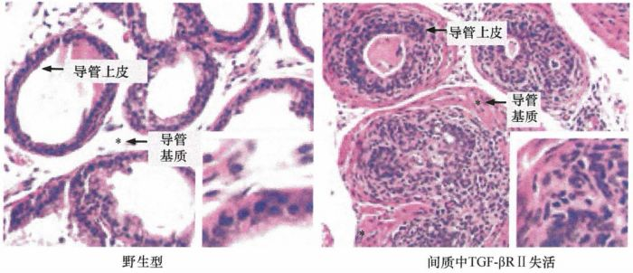
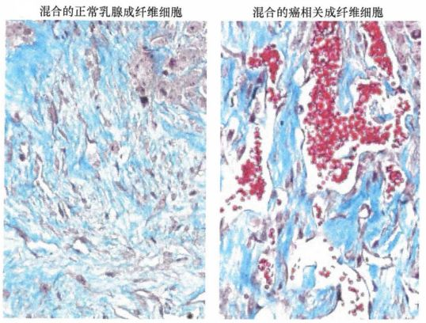
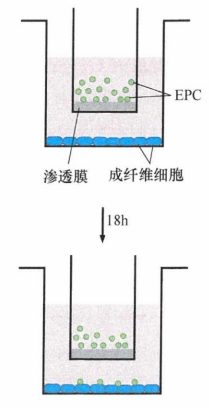
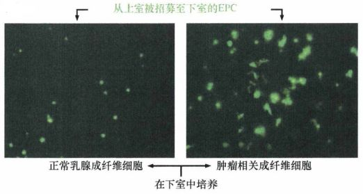
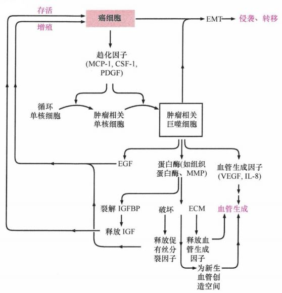

# 第十三章 《癌生物学》第十三章（2） 间质细胞可促进肿瘤

**往期回顾**

《癌生物学》第八章（1）细胞周期控制时钟 [《癌生物学》第八章（2）pRb在细胞周期时钟中的作用](http://mp.weixin.qq.com/s?__biz=Mzg4NjA5Mzg2Mw==&mid=2247487021&idx=1&sn=5b7c94bc179e2002f3c9a5713b0733c3&chksm=cf9faf65f8e82673762e74e560b7a481ee1561a6845ed2cdcf87ed1cef9427db47c7ad68d437&scene=21#wechat_redirect) [《癌生物学》第八章（3）Myc、TGF-β在细胞周期时钟中的作用](http://mp.weixin.qq.com/s?__biz=Mzg4NjA5Mzg2Mw==&mid=2247487022&idx=1&sn=013769ab286813e3834183669c3fe69b&chksm=cf9faf66f8e82670baab3d827866f7b2b668259bbacfb38aedb0f0626ecc2dadf1f1235c895a&scene=21#wechat_redirect)

[《癌生物学》第九章（1） p53——抑癌基因](http://mp.weixin.qq.com/s?__biz=Mzg4NjA5Mzg2Mw==&mid=2247487247&idx=1&sn=50b6eaf0623c0c134f4c6588f68c3689&chksm=cf9fae47f8e82751bc562b5867da4f7cbecc9cfcd3bb65c3ea19891184fc6f4bd5cccf590299&scene=21#wechat_redirect)

[《癌生物学》第九章（2）  P53水平的调控](http://mp.weixin.qq.com/s?__biz=Mzg4NjA5Mzg2Mw==&mid=2247487248&idx=1&sn=f33178b9d3428da2eb7ec91e7fe1e8f6&chksm=cf9fae58f8e8274e3234ef693fd33bda4ab3a62f6f3e790ea677a4dbe61b2b87e945202fb99d&scene=21#wechat_redirect)

[《癌生物学》第九章（3）  P53的生物学功能](http://mp.weixin.qq.com/s?__biz=Mzg4NjA5Mzg2Mw==&mid=2247487249&idx=1&sn=812b0a64097fabf21da4b79650fe668d&chksm=cf9fae59f8e8274f0f4165f157155304db6f91b85bc141e38330e8b09c94173ff44a8e03718c&scene=21#wechat_redirect)

[《癌生物学》第九章（4）  凋亡与肿瘤](http://mp.weixin.qq.com/s?__biz=Mzg4NjA5Mzg2Mw==&mid=2247487251&idx=2&sn=c670121fa3e55e6eac50a606096bd292&chksm=cf9fae5bf8e8274d404393647fc7eca19b7f54bdac964ad16003b9b0f5f9eeaf767e843dcecb&scene=21#wechat_redirect)

[《癌生物学》第十章（1） 肿瘤细胞无限增殖的两个障碍](http://mp.weixin.qq.com/s?__biz=Mzg4NjA5Mzg2Mw==&mid=2247487501&idx=1&sn=3923a4a34cbabaf58f5c49f5973e4149&chksm=cf9fb145f8e83853ba49d4d8e6512b681ff674bfdf4724ff3a519130d9f6173242dad0e80132&scene=21#wechat_redirect)

[《癌生物学》第十章（2） 端粒和端粒酶](http://mp.weixin.qq.com/s?__biz=Mzg4NjA5Mzg2Mw==&mid=2247487506&idx=1&sn=4e2df94146e3a9328b7ca74b03a573da&chksm=cf9fb15af8e8384c2bdcf218c35b9497ffd1f521e658084df49d4be5f9eed137d39211a67935&scene=21#wechat_redirect)

[《癌生物学》第十章（3） 端粒酶的双重角色](http://mp.weixin.qq.com/s?__biz=Mzg4NjA5Mzg2Mw==&mid=2247487507&idx=2&sn=2b23b04530bff885efd741fed554d46f&chksm=cf9fb15bf8e8384d1670f2d518fdc4aa87cd47a756936cca722f2c6b88df16c699570d0cc205&scene=21#wechat_redirect)

[《癌生物学》第十一章（1）  肿瘤多阶段发展](http://mp.weixin.qq.com/s?__biz=Mzg4NjA5Mzg2Mw==&mid=2247487819&idx=1&sn=9e5153efeab13f233efce6fcefd01d53&chksm=cf9fb003f8e83915e4fca96afb9676a896222551f89c72698dd51b2a159d2098acaf2db3c0f2&scene=21#wechat_redirect)

[《癌生物学》第十一章（2） 对进化论解释肿瘤发展的补充](http://mp.weixin.qq.com/s?__biz=Mzg4NjA5Mzg2Mw==&mid=2247487832&idx=1&sn=5e8fbe85d6c878d01fd5c8123597f738&chksm=cf9fb010f8e83906a15b3a4dde368c45a4878310af6d8ae7cea6ee854219ee36eabe1ca51ae4&scene=21#wechat_redirect)

[《癌生物学》第十一章（3）参与肿瘤发展的因素之炎症](http://mp.weixin.qq.com/s?__biz=Mzg4NjA5Mzg2Mw==&mid=2247487874&idx=1&sn=d1adb72c268af79d532a0ede13f52abe&chksm=cf9fb0caf8e839dcdbc8eb23ce9779053eb50f64e7589bab3116b6ee14fb10b048f51388ec44&scene=21#wechat_redirect)

[《癌生物学》第十二章（1）DNA损伤的预防](http://mp.weixin.qq.com/s?__biz=Mzg4NjA5Mzg2Mw==&mid=2247487949&idx=1&sn=107054f050f8b4d3404a6e371ddf3194&chksm=cf9fb085f8e839937724d4ada4c21deec6f12551160dd2933522d10f25fae38b9b8ac6f895a3&scene=21#wechat_redirect)

[《癌生物学》第十二章（2）基因组损伤的来源](http://mp.weixin.qq.com/s?__biz=Mzg4NjA5Mzg2Mw==&mid=2247487974&idx=1&sn=f78a30cafd41835b2d9b7b52e63a5399&chksm=cf9fb0aef8e839b820ab28b8f4857b6ed209ac34864b16068dc5fdb0c413a2a27b1fa9481ef1&scene=21#wechat_redirect)

[《癌生物学》第十二章（3）DNA修复缺陷引发的疾病](http://mp.weixin.qq.com/s?__biz=Mzg4NjA5Mzg2Mw==&mid=2247487974&idx=2&sn=274bb725f72e37dbc9653c58126a3b6a&chksm=cf9fb0aef8e839b8eab9358955de09d65d8a6fb27412a7c8f6eacf5b6b34752eb894c8f01eb1&scene=21#wechat_redirect)

[《癌生物学》第十二章（4）癌细胞核型的变化](http://mp.weixin.qq.com/s?__biz=Mzg4NjA5Mzg2Mw==&mid=2247487974&idx=3&sn=c7fabdb23bf2fb1b8d6cb1e8cf231992&chksm=cf9fb0aef8e839b81c81319a584355725e04bab654f99985457158592285553a78527035da9a&scene=21#wechat_redirect)

[《癌生物学》第十三章（1） 肿瘤发生类似伤口损伤愈合](http://mp.weixin.qq.com/s?__biz=Mzg4NjA5Mzg2Mw==&mid=2247487990&idx=2&sn=427192f2af09ea8a12bafb6467955c95&chksm=cf9fb0bef8e839a8a174cead45f0dfe45b154efdf3664b5a5c3c21fb245a1072ba0f06f59944&scene=21#wechat_redirect)

“ 通过上一讲，我们知道了，恶性上皮 同 正常 上皮一样 ，由相互依存的不同细胞类型组成 ，且 不同类型细胞 通过 异质性信号转导 传递信息 ，促进或限制其邻近细胞的生长。 此外， 肿瘤发生与伤口愈合 过程 极为相似 ，这提示 癌细胞只不过是激活了伤口愈合这 一 已经存在基因组中的程序。

今天，我们具体讨论间质细胞在肿瘤发生发展过程中的重要作用。 ”

1、 间质细胞的活化促进肿瘤发生

在一项研究中，通过导入 PDGF表达载体使原来非致瘤性的、永生化的角化细胞分泌高水平的PDGF。释放的生长因子在体外对这些细胞的增殖并没有影响，因为它们的表面没有表达PDGF受体。然而，当这些细胞被植入宿主鼠体内时，它们形成了增殖旺盛的肿瘤，这种能力无疑是因为它们可以释放PDGF以招募并激活间质细胞。然后，间质细胞又与分泌PDGF的角化细胞相互作用，并促进其增殖，最终引发后者的恶性转化。

在一个补充实验中，研究者通过基因工程技术改变小鼠种系，使他们能灭活各种组织间质成纤维细胞中的 TGFβ II型受体。结果导致间质细胞对TGF-β介导的生长抑制不再敏感，并在多种组织中发生间质增生。其中一些过度增殖的成纤维细胞促进附近上皮细胞增殖，最终形成癌。再一次证明 **间质细胞有刺激上皮细胞增殖的能力，并导致上皮细胞的致瘤转化** 。

图 13-2-1： 间质成纤维细胞发生遗传改变的小鼠形成的前列腺肿瘤

正常上皮组织的间质细胞加速肿瘤形成的效率是否与癌间质细胞相同 呢？ 通过比较提取自正常上皮组织的间质成纤维细胞与提取自癌组织的肿瘤相关成纤维细胞（ CAF）的行为 可 得到答案。

在一系列实验中，成纤维细胞纯化自正常人前列腺的间质，而 CAF来自于人前列腺癌的间质。每个细胞群体与另外的非致瘤性的、SV40大T抗原永生化的人前列腺上皮细胞混合，然后植入免疫缺陷的裸鼠。结果显示这些混合组织移植物的生长有显著差别，特别是同时含有CAF和永生化前列腺上皮细胞的移植物形成的肿瘤 ， 比同时含有正常人前列腺成纤维细胞和永生化的前列腺上皮细胞形成的肿瘤大 500倍（当单独注射时，CAF不形成肿瘤）。该实验证明，这些CAF在功能上与正常前列腺组织中的间质成纤维细胞有很大的不同。在肿瘤进展过程中，间质细胞对邻近上皮细胞的存活和增殖起到越来越重要的作用。

图 13- 2-2： CAF诱导血管新生：人MCF7-ras 乳腺癌细胞与正常人乳腺间质成纤维细胞混合（左）形成的肿瘤在肿瘤相关间质（蓝色）中显示有相对较少的血管（红色）；与肿瘤相关成纤维细胞（CAF, 右）混合 的 形成肿瘤伴有大量血管和红细胞（红色）

那么，肌成纤维细胞的 CAF群体是如何加速肿瘤生长的呢？鉴于血管生成在肿瘤发生过程中通常是一个限速步骤， **混合 CAF的促肿瘤作用可能很大程度上是由于其能加速肿瘤血管生成** 。 事实上， 肌成纤维细胞释放间质衍生因子 -1（SDF-1, 也称CXCL12) ，后者 招募循环中的内皮前体细胞（ EPC）进入肿瘤间质。 此外， 肌成纤维细胞分泌的 VEGF有助于诱导这些新成员分化成为内皮细胞，形成肿瘤的新血管系统。

图 13-2-3、图13-2-4： CAF比正常乳腺间质成纤维细胞吸引更多EPC：将用绿色荧光蛋白标记的表达内皮前体细胞（EPC）特征性表面抗原的骨随细胞 置于 小室的渗透性膜的上面，正常乳腺间质成纤维细胞或来自乳腺癌细胞 CAF被置于下层小室底部的表面，18小时后用荧光显微镜计数被募集于下层小室底部的EPC数量

目前广泛接受的假设认为，肿瘤脉管系统中出现的内皮细胞有两个来源：绝大部分源于现有内皮细胞的增殖（包括相邻的正常组织中的内皮细胞）；另一小部分源于骨髓来源的 EPC，它们随循环系统到达肿瘤间质。

2、 巨噬细胞和骨髓细胞在活化肿瘤间质中起重要作用

起初认为，肿块大量募集巨噬细胞可能对肿瘤形成不利，因为巨噬细胞通常由免疫系统产生，清除并破坏感染性的物质及异常细胞。但越来越多的证据显示，这些免疫细胞在促进肿瘤发展中也起重要作用。

骨髓中髓系单核细胞被癌细胞募集进入肿瘤，而后被诱导分化为巨噬细胞。这种募集依赖于趋化因子传递的趋化信号，这些因子为运动的细胞提供定向信号。多种类型的神经外胚层细胞和上皮性癌细胞分泌 的 单核细胞趋化蛋白 -1 (MCP-1) 和 其他肿瘤细胞释放的集落刺激因子 -I（CSF-1） 均 有助于刺激单核细胞分化为巨噬细胞。

巨噬细胞一旦定居于肿瘤间质中，即刺激血管生成 ，特别 是在肿瘤的乏氧区 。（ 虽然仅凭募集的巨噬细胞并不能完全弥补局部血管生成的缺陷。 ） 在一些癌症中， **产生 MCP-1的水平、巨噬细胞存在的数量与各种肿瘤诱导血管生成的水平直接相关** 。利用实验的方法促进肿瘤表达 MCP-1后，该趋化因子使得肿瘤细胞吸引更多巨噬细胞，后者分泌重要的血管生成因子，特别是VEGF和IL-8，导致血管生成活性显著增加。此外，当肺癌细胞在体外暴露于培养的巨噬细胞所分泌的各种因子中时，肿瘤细胞就会产生IL-8和许多其他促进血管生成及细胞侵袭的蛋白质作为应答。

图 13-2-5： 巨噬细胞参与血管形成模式图

与肌成纤维细胞类似， 肌成纤维细胞释放间质衍生因子 -1（SDF-1,也称CXCL12) ，后者 招募循环中的内皮前体细胞（ EPC）进入肿瘤间质。 此外， 肌成纤维细胞分泌的 VEGF有助于诱导这些新成员分化成为内皮细胞，形成肿瘤的新血管系统。

MMP-9也可以裂解IGFBP (胰岛素样生长因子结合蛋白），后者通常在细胞外空间灭活IFG分子。释放IFG, 为邻近的细胞（包括肿瘤细胞）提供生存信号。在晚期乳腺癌中，肿瘤相关巨噬细胞也能直接帮助癌细胞，因为它们是驱动表达EGF-R的癌细胞增殖的上皮生长因子(EGF) 的主要来源。

一些巨噬细胞参与肿瘤进展，而另一些形态上不同的巨噬细胞亚系辅助免疫系统，可以发现并杀死癌细胞。然而，它们在许多类型的肿瘤中都没有起到免疫作用。可能是一些肿瘤细胞获得了减弱第二类巨噬细胞的肿瘤杀伤作用的能力，而帮助肿瘤进展的第一类巨噬细胞保留着完整的功能。或者，肿瘤细胞具有某种逃避机制，使其不被巨噬细胞识别和破坏。

髓系细胞中还有第二种促进肿瘤侵袭的细胞。未成熟骨髓细胞 (iMC)在小鼠的结直肠癌模型中研究得最为清楚。通过使Apc和Smad4双基因失活建立小鼠自发结直肠癌模型，Smad4是TGF-β信号转导的关键蛋白，该模型所产生的腺瘤或腺癌细胞分泌趋化因子CCL9，后者能招募来源于骨髓的iMC。 **iMC聚集于肿瘤侵袭的前沿，分泌基质金属蛋白酶MMP-2和MMP-9，协助肿瘤细胞向下面的组织层侵袭** 。后续研究显示，如果没有 MMP-2和MMP-9，iMC就不能促进小鼠结直肠癌细胞的侵袭和转移，并且原发瘤中癌细胞的转移能力依赖于其对iMC的募集。

参考书目： 《The Biology of Cancer》（Second Edition）  R.A.Weinberg  著，詹启敏 等  译

编辑：周健 张月明 游丹铭

校审：张健 罗鹏

