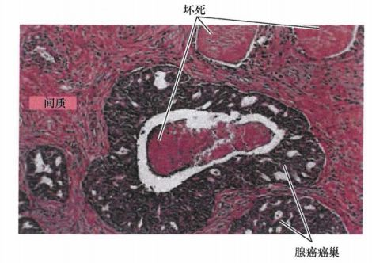
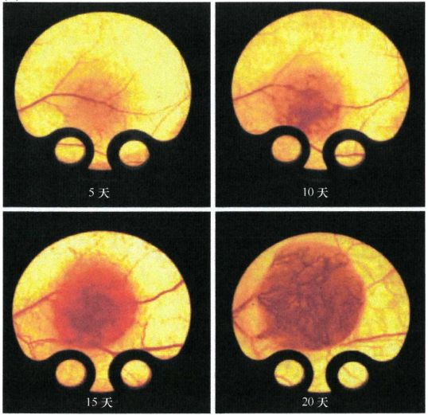
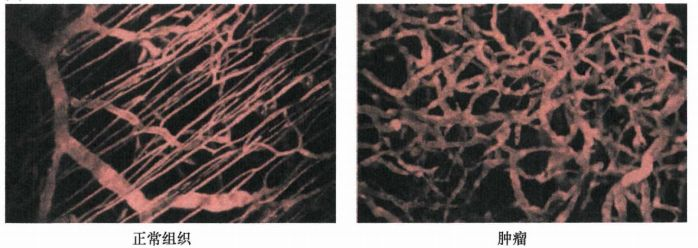
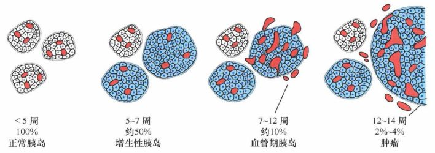
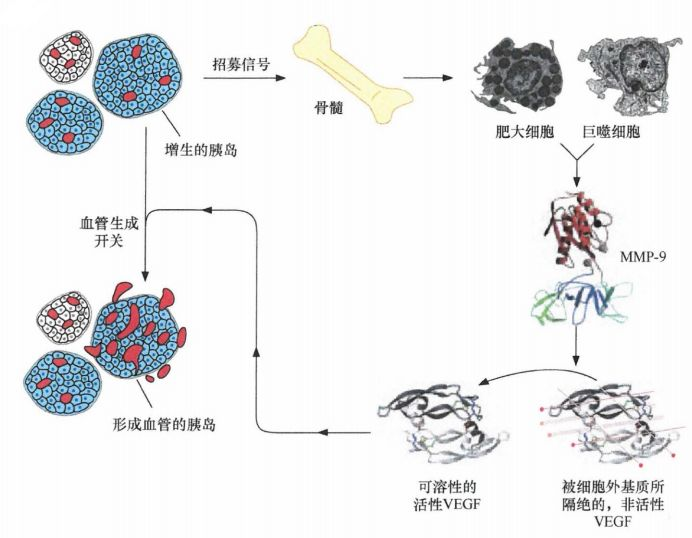
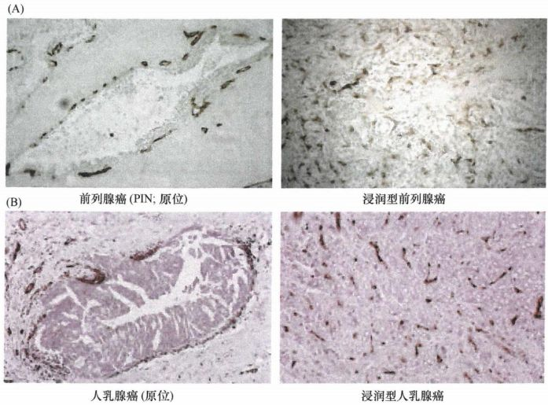
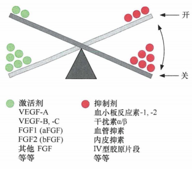
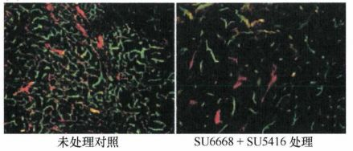
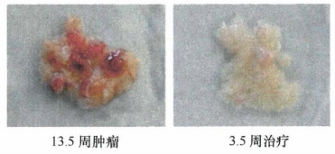

# 第十三章 《癌生物学》第十三章（3） 血管生成与肿瘤

**往期回顾**

《癌生物学》第八章（1）细胞周期控制时钟 [《癌生物学》第八章（2）pRb在细胞周期时钟中的作用](http://mp.weixin.qq.com/s?__biz=Mzg4NjA5Mzg2Mw==&mid=2247487021&idx=1&sn=5b7c94bc179e2002f3c9a5713b0733c3&chksm=cf9faf65f8e82673762e74e560b7a481ee1561a6845ed2cdcf87ed1cef9427db47c7ad68d437&scene=21#wechat_redirect) [《癌生物学》第八章（3）Myc、TGF-β在细胞周期时钟中的作用](http://mp.weixin.qq.com/s?__biz=Mzg4NjA5Mzg2Mw==&mid=2247487022&idx=1&sn=013769ab286813e3834183669c3fe69b&chksm=cf9faf66f8e82670baab3d827866f7b2b668259bbacfb38aedb0f0626ecc2dadf1f1235c895a&scene=21#wechat_redirect)

[《癌生物学》第九章（1） p53——抑癌基因](http://mp.weixin.qq.com/s?__biz=Mzg4NjA5Mzg2Mw==&mid=2247487247&idx=1&sn=50b6eaf0623c0c134f4c6588f68c3689&chksm=cf9fae47f8e82751bc562b5867da4f7cbecc9cfcd3bb65c3ea19891184fc6f4bd5cccf590299&scene=21#wechat_redirect)

[《癌生物学》第九章（2）  P53水平的调控](http://mp.weixin.qq.com/s?__biz=Mzg4NjA5Mzg2Mw==&mid=2247487248&idx=1&sn=f33178b9d3428da2eb7ec91e7fe1e8f6&chksm=cf9fae58f8e8274e3234ef693fd33bda4ab3a62f6f3e790ea677a4dbe61b2b87e945202fb99d&scene=21#wechat_redirect)

[《癌生物学》第九章（3）  P53的生物学功能](http://mp.weixin.qq.com/s?__biz=Mzg4NjA5Mzg2Mw==&mid=2247487249&idx=1&sn=812b0a64097fabf21da4b79650fe668d&chksm=cf9fae59f8e8274f0f4165f157155304db6f91b85bc141e38330e8b09c94173ff44a8e03718c&scene=21#wechat_redirect)

[《癌生物学》第九章（4）  凋亡与肿瘤](http://mp.weixin.qq.com/s?__biz=Mzg4NjA5Mzg2Mw==&mid=2247487251&idx=2&sn=c670121fa3e55e6eac50a606096bd292&chksm=cf9fae5bf8e8274d404393647fc7eca19b7f54bdac964ad16003b9b0f5f9eeaf767e843dcecb&scene=21#wechat_redirect)

[《癌生物学》第十章（1） 肿瘤细胞无限增殖的两个障碍](http://mp.weixin.qq.com/s?__biz=Mzg4NjA5Mzg2Mw==&mid=2247487501&idx=1&sn=3923a4a34cbabaf58f5c49f5973e4149&chksm=cf9fb145f8e83853ba49d4d8e6512b681ff674bfdf4724ff3a519130d9f6173242dad0e80132&scene=21#wechat_redirect)

[《癌生物学》第十章（2） 端粒和端粒酶](http://mp.weixin.qq.com/s?__biz=Mzg4NjA5Mzg2Mw==&mid=2247487506&idx=1&sn=4e2df94146e3a9328b7ca74b03a573da&chksm=cf9fb15af8e8384c2bdcf218c35b9497ffd1f521e658084df49d4be5f9eed137d39211a67935&scene=21#wechat_redirect)

[《癌生物学》第十章（3） 端粒酶的双重角色](http://mp.weixin.qq.com/s?__biz=Mzg4NjA5Mzg2Mw==&mid=2247487507&idx=2&sn=2b23b04530bff885efd741fed554d46f&chksm=cf9fb15bf8e8384d1670f2d518fdc4aa87cd47a756936cca722f2c6b88df16c699570d0cc205&scene=21#wechat_redirect)

[《癌生物学》第十一章（1）  肿瘤多阶段发展](http://mp.weixin.qq.com/s?__biz=Mzg4NjA5Mzg2Mw==&mid=2247487819&idx=1&sn=9e5153efeab13f233efce6fcefd01d53&chksm=cf9fb003f8e83915e4fca96afb9676a896222551f89c72698dd51b2a159d2098acaf2db3c0f2&scene=21#wechat_redirect)

[《癌生物学》第十一章（2） 对进化论解释肿瘤发展的补充](http://mp.weixin.qq.com/s?__biz=Mzg4NjA5Mzg2Mw==&mid=2247487832&idx=1&sn=5e8fbe85d6c878d01fd5c8123597f738&chksm=cf9fb010f8e83906a15b3a4dde368c45a4878310af6d8ae7cea6ee854219ee36eabe1ca51ae4&scene=21#wechat_redirect)

[《癌生物学》第十一章（3）参与肿瘤发展的因素之炎症](http://mp.weixin.qq.com/s?__biz=Mzg4NjA5Mzg2Mw==&mid=2247487874&idx=1&sn=d1adb72c268af79d532a0ede13f52abe&chksm=cf9fb0caf8e839dcdbc8eb23ce9779053eb50f64e7589bab3116b6ee14fb10b048f51388ec44&scene=21#wechat_redirect)

[《癌生物学》第十二章（1）DNA损伤的预防](http://mp.weixin.qq.com/s?__biz=Mzg4NjA5Mzg2Mw==&mid=2247487949&idx=1&sn=107054f050f8b4d3404a6e371ddf3194&chksm=cf9fb085f8e839937724d4ada4c21deec6f12551160dd2933522d10f25fae38b9b8ac6f895a3&scene=21#wechat_redirect)

[《癌生物学》第十二章（2）基因组损伤的来源](http://mp.weixin.qq.com/s?__biz=Mzg4NjA5Mzg2Mw==&mid=2247487974&idx=1&sn=f78a30cafd41835b2d9b7b52e63a5399&chksm=cf9fb0aef8e839b820ab28b8f4857b6ed209ac34864b16068dc5fdb0c413a2a27b1fa9481ef1&scene=21#wechat_redirect)

[《癌生物学》第十二章（3）DNA修复缺陷引发的疾病](http://mp.weixin.qq.com/s?__biz=Mzg4NjA5Mzg2Mw==&mid=2247487974&idx=2&sn=274bb725f72e37dbc9653c58126a3b6a&chksm=cf9fb0aef8e839b8eab9358955de09d65d8a6fb27412a7c8f6eacf5b6b34752eb894c8f01eb1&scene=21#wechat_redirect)

[《癌生物学》第十二章（4）癌细胞核型的变化](http://mp.weixin.qq.com/s?__biz=Mzg4NjA5Mzg2Mw==&mid=2247487974&idx=3&sn=c7fabdb23bf2fb1b8d6cb1e8cf231992&chksm=cf9fb0aef8e839b81c81319a584355725e04bab654f99985457158592285553a78527035da9a&scene=21#wechat_redirect)

[《癌生物学》第十三章（1） 肿瘤发生类似伤口损伤愈合](http://mp.weixin.qq.com/s?__biz=Mzg4NjA5Mzg2Mw==&mid=2247487990&idx=2&sn=427192f2af09ea8a12bafb6467955c95&chksm=cf9fb0bef8e839a8a174cead45f0dfe45b154efdf3664b5a5c3c21fb245a1072ba0f06f59944&scene=21#wechat_redirect)

[《癌生物学》第十三章（2） 间质细胞可促进肿瘤](http://mp.weixin.qq.com/s?__biz=Mzg4NjA5Mzg2Mw==&mid=2247488046&idx=2&sn=0dab3432d2e285c01924c68f4207286d&chksm=cf9fb366f8e83a7038662351ee64dd8e0c0ec3c37d1d888bc962f95f3ce8b700c3dc07614ed2&scene=21#wechat_redirect)

“通过上一讲，我们知 道了，多种间质细胞的活化都可以促进肿瘤的进展。 肿瘤相关成纤维细胞（ CAF） 和 肌成纤维细胞 既可以 释放间质衍生因子 -1（SDF-1 ），后者 招募循环中的内皮前体细胞（ EPC）进入肿瘤间质 ，也可以 分泌 VEGF ，以 诱导形成肿瘤的新血管系统 ；小鼠 腺瘤或腺癌细胞 可 分泌趋化因子 CCL9，后者能招募来源于骨髓的未成熟骨髓细胞 （ iMC ）， iMC聚集于肿瘤侵袭的前沿，分泌基质金属蛋白酶MMP-2和MMP-9，协助肿瘤细胞向下面的组织层侵袭。

今天，我们讨论内皮细胞及血管新生在肿瘤发生进展中的作用。 ”

1、 内皮细胞及其形成的血管确保肿瘤接近循环系统

早在 20世纪50年代中期，病理学家就注意到肿瘤优先生长在血管周围：距离血管0.2mm之外的肿瘤细胞不再生长，而再远处的肿瘤则会死亡。在距离血管大约0.2mm的这一半径范围内的细胞可依赖扩散保证它们的供氧，在这个距离之外的细胞则要经受中度或严重的乏氧和低pH的影响，有坏死的危险。

图 13- 3-1： 前列腺癌中的大规模坏死：中心生长的是腺癌癌巢（深红色），其被大量的间质 （浅红色） 包围，癌巢的中央是一大块坏死的组织（浅红色）。腺癌细胞因 接近间质和相关的血管系统而 生长旺盛

乏氧不是细胞远离循环系统所付出的唯一代价， 除获取氧气之外，脉管系统对于所有类型组织（正常及肿瘤组织）的生长和存活均具有重要意义 。细胞还需要与血管系统进行有效的相互作用以获取营养，并排泄代谢废物和二氧化碳。组织中所有细胞与最近的毛细血管的距离都不超过几个细胞的直径，在一些正常组织，尤其是具有高代谢活性的组织中，多数细胞都倾向于与至少一根毛细血管直接接触。

在胚胎发育过程中，一个器官或组织的结构和总体大小是由遗传编程的，但单个细胞的精确定位并非如此。这同样适用于脉管系统：基因组决定主要血管的总体布局，并将设计和装配局部毛细血管网和稍 大 血管的任务委派给组织内的单个细胞。短距离的异质性相互作用决定了构建脉管系统的单个毛细血管的路径。更加特别的是，组织中的毛细血管似乎可在任何需要它们的、无血管（即实质）的细胞处形成。

肿瘤发生过程与上述情况相似。一个生物体的基因组不能决定肿瘤的总体构造，因为每个肿瘤都是新创造的，而不是由基因组预先设定的。这暗示肿瘤血管生成也是如此。肿瘤不能依照遗传信息配置它们的血液供给系统，而是必须根据肿瘤发展的不同阶段，调整脉管系统的布局。特别是在组装它们自己的供血系统时，肿瘤完全依赖瘤内无脉管的细胞（包括肿瘤细胞和其他类型的起支持作用的基质细胞）与脉管系统的细胞（包括内皮细胞、周细胞和平滑肌细胞）间局部的异质性相互作用。

将小块肿瘤移植至实验动物如兔子的角膜或耳中，揭示出血管生成因子的存在及其能力。几天之内，先前存在的毛细血管床中即形成密集的毛细血管网和较大的血管，这些毛细血管网及血管进而汇聚于移植的肿瘤块中。

图 13- 3-2： 通过插在小鼠皮肤肿瘤上的窗观察 皮下移植瘤的血管生长

在正常组织中可见毛细血管被周细胞系统地覆盖，与之形成反差的是它们在肿瘤相关毛细血管附近的杂乱分布。肿瘤中典型的毛细血管直径是正常的 3倍。而且， **肿瘤内部及肿瘤周围血管的整体布局相当混乱** 。

肿瘤中毛细血管和较的血管建造得如此随意的确切原因还不清楚。一种可能的原因是两种互相桔抗的生长因子（促血管生成素 -1 和促血管生成素-2) 之间的平衡被打破。VEGF通过吸引和刺激内皮细胞启动毛细血管生长，而促血管生成素-1 和促血管生成素-2的混合物诱导内皮细胞招募周细胞和平滑肌细胞，使得新形成的毛细血管成熟为由3种细胞类型（即内皮细胞、周细胞和平滑肌细胞）以适当比例构建起的血管。这两种 拮抗 的促血管生成素的不平衡及肿瘤内过高的 VEGF,可能是大多数肿瘤中脉管系统构件缺陷的原因。实际上，一些实验表明在正常的皮肤中仅通过表达VEGF-A即可模拟肿瘤相关微血管的异常组织形态。

图 13-3- 3 ： 活体组织血管成像技术显示 肿瘤相关血管的组织紊乱

在亚显微水平，肿瘤块中的毛细血管是随意组装的。因为相邻内皮细胞的质膜并没有相互接触形成围绕毛细血管腔的无缝隙内层，相反经常保留着几微米宽的缺口，导致毛细血管周围的细胞直接接触血浆，由此导致的渗漏可能是肿瘤实质中血纤维蛋白沉积的原因。

定量测量显示肿瘤中毛细血管壁的通透性比正常毛细血管高 10倍。有些渗漏可能是由于毛细血管壁组装缺陷。但是， **多数渗漏可能是由肿瘤细胞和肿瘤相关间质中的巨噬细胞和成纤维细胞分泌 VEGF失调所致** 。当给荷瘤小鼠注射 VEGF中和抗体后，肿瘤相关毛细血管的渗透性显著降低。 然而， VEGF造成血管渗透性增加的机制尚不清楚。

图 13-3-4： VEGF引起毛细血管渗漏：用包装有VEGF-A表达载体的腺病毒感染小鼠的耳朵，此后将伊凡思蓝染料注入小鼠循环系统，30分钟后成像显示，VEGF-A表达的时间越长，微血管的渗漏程度越严重

肿瘤相关毛细血管的渗漏导致肿瘤实质间隙中大量体液的累积。在正常组织中，这些体液可由淋巴管引流最终进入静脉循环。而在实体瘤中，癌细胞群的扩张使淋巴管外部压力增大，使仅存的淋巴管坍塌。在实体瘤核心区域中，由此导致的淋巴排泄系统缺陷进一步加剧了由毛细血管渗漏造成的体液积累，在肿瘤的无脉管部分产生相对较高的液压。

2 、 血管生成开关的开放对肿瘤扩张是必需的

Rip-Tag 转基因小鼠实验研究了 肿瘤发生血管生成的机制，该小鼠携带一个胚系转基因 -胰岛素基因启动子驱动SV40大 T抗原和小T抗原的表达，确保病毒癌蛋白在胰腺中形成胰岛的β细胞中表达。10周龄时，Rip-Tag小鼠约一半的胰岛形成增生结节 ； 12 - 14周时，最初形成的增生性胰岛中约3%最终进展成为癌。

图 13-3-5： 胰岛细胞肿瘤进展的 Rip-Tag 模型

在 Rip-Tag小鼠小的肿瘤细胞巢中，细胞因被转入的致癌基因驱动而持续不停地分裂 ，但 每个胰岛中肿瘤细胞群体的总体大小保持恒定，因为细胞会通过凋亡进行代偿消耗。该模型提示，人类中小肿瘤细胞巢在很多年里保待这种不断分裂但体积不变的状态，无法突破限制它们的屏障。且这种 屏障 并非 是物理性的 ，而是因为 这些细胞还没有开始形成血管，缺乏脉管系统 ， 由此导致的乏氧触发 了 p53依赖的凋亡 。

然而在某些时间点上，一小群癌前胰岛细胞突然获得了引起新血管生成的能力，限制它们及其后代增殖的因素被解除。这种小肿瘤块行为上的瞬间显著改变称为 “ 血管生成开关 ”。 **血管生成开关无疑是肿瘤进展中的一个** **重要** **步骤，代表癌细胞成功突破了这一防御屏障并且获得随意诱导血管生成的能力** 。

这些 β细胞在血管生成开关出现之前很久就已制造了大量的VEG，但这些VEGF分子被周围的细胞外基质（ECM）有效隔离，不能刺激血管生成。而在Rip-Tag胰岛中的血管生成开关伴随着突然出现大量的基质金属蛋白酶-9（MMP-9），MMP-9以靶向作用的方式裂解ECM的特定成分，从而释放VEGF。MMP-9是由被招募了癌变前胰岛的炎性细胞（肥大细胞和巨噬细胞）合成并释放的。因此，在此特定的组织中， **血管生成开关的开放在根本上是依赖于招募炎性分子的能力的** 。

图片 13-3- 6 ： 血管生成开关及炎性细胞的招募

用基因工程技术选择性地使胰岛细胞中编码 VEGF的基因缺失，胰岛存活并且肿瘤的早期步骤仍然可以正常地进行，但不会出现血管生成开关。这更加说明了 **胰岛细胞** **来源** **的 VEGF分子在触发血管形成中起关键作用，而且招募的基质细胞不能通过其自身带来的VEGF补偿这种VEGF的缺乏** 。

需要注意的是， Rip-Tag模型不能代表所有类型肿瘤形成过程中发生的血管形成机制。例如，在一些肿瘤中，血管形成似乎是逐渐增多的，这与Rip-Tag胰岛的行为形成反差。此外，其他肿瘤可能依赖不同的血管生成因子引发血管形成。

3 、 血管生成开关启动一个高度复杂的过程

肿瘤早期血管生成是受限制的，只有当肿瘤细胞变得有侵袭性、穿透基底膜，并获得与间质细胞直接而密切的接触时，才开始大量生成血管，这表明 **肿瘤的侵袭和血管大量生成是紧密相连的两个过程** 。在许多类型的人类肿瘤中，显微镜下平均每个视野中的毛细血管密度会随着肿瘤的恶性程度而增加， 且 大量表达 VEGF（除HER2外）的乳腺癌患者在初次诊断后的治疗效果就很差，这些表明血管生成开关仅是使肿瘤逐渐发生血管生成并加速脉管系统形成的诸多阶段中的第一步。

图 13-3-7： 肿瘤获得侵袭性前 /后的毛细血管（褐色）：(A) 良性前列腺上皮内瘤变中的毛细血管远少于浸润型前列腺癌 （B)乳腺导管原位癌中的毛细血管远少于浸润型导管癌

血管生成开关可能使少量肿瘤细胞在血管生成开启后可以增殖并最终占据肿瘤大部分体积，从而使得肿瘤整体上均有血管生成表型。实际上，通过分析从人移植瘤中分离出来的细胞，发现 **不同亚群的肿瘤细胞在血管生成能力方面有很大的异质性** ，一些肿瘤细胞血管生成能力很强，而另一些则很弱。即使在肿瘤细胞系中，单个亚克隆细胞群在体内移植时也显示不同的血管生成和肿瘤形成能力。这 提示 血管生成开关开启很久以后，肿瘤块中血管生成能力较弱的肿瘤细胞依赖于邻近血管生成能力较强的细胞 ， 获得充足的脉管系统。

4、 血管生成通常被生理抑制剂抑制

原发肿瘤可释放一些类型的抑制物，通过体液循环抑制远端转移细胞的增殖。这些抑制因子无论其本质是什么，似乎都能在次级生长中阻止血管生成，使其不能扩张至多于 1/10mm。一旦原发肿瘤被切除，假定的抑制因子就会在循环系统中消失，去除了对已经种植的转移灶生长的抑制。

图 13-3-8： 血管生成开关平衡

血管抑素和内皮抑素分子最初是从罹患肿瘤的动物的尿中分离得到的，对这两个氨基酸序列进行测序发现，它们来源于细胞外基质 (ECM)或者血浆中已知蛋白的切割产物。近年来，仍有其他抗血管生成物质被分离，许多是通过水解细胞外基质蛋白形成的。这些发现表明，血管生成在正常组织发育和伤口愈合中进行，该过程最终由胞外空间的抗血管生成蛋白片段聚集所终止。

其他重要的天然抗血管生成蛋白发挥基质金属蛋白酶 (MMP)拮抗剂的功能。VEGF刺激局部产生MMP-1-MMP-4, 促使毛细血管延伸侵袭到细胞外基质。称为组织金属蛋白酶抑制物(TIMP)的一系列分泌蛋白可以通过阻止这些或者其他的MMP发挥作用而阻止毛细血管的延伸。

在这些 血管生成的生理调节中观察到的现象表明，血管生成不是一个二元的状态。相反，不同类型的肿瘤细胞获得或多或少血管生成能力 ， 甚至在特定的肿瘤中，不同的肿瘤细胞也很可能显示出不同吸引脉管系统的能力。这样的行为可以被解释为 **促血管生成和抗血管生成因子之间的平衡决定了新生血管生成是否会继续，以及肿瘤内多大的区域将会被脉管覆盖** 。

5、 特定的抗血管生成可用于治疗肿瘤

原则上讲，既然肿瘤完全依赖于血管生成才长成特定大小（直径约 0.2 mm), 那么任何可以成功阻止血管生成或清除血管生成的产物的方法应该代表治疗肿瘤的高效策略。一旦其血管供给被中断，微小肿瘤将不会再长大，较大肿瘤将会衰竭。 且 肿瘤中内皮细胞不断地形成和丢失，半衰期仅有一周。而机体其他正常血管的相应内皮细胞几乎不分裂，且半衰期达到数百天。循环细胞（如进入活跃的细胞周期的细胞）对药物诱导杀伤的敏感性几乎总是远远高于那些静止的细胞 ，所以 针对内皮细胞的细胞毒性治疗应当对肿瘤相关的脉管系统有强烈的杀伤作用，而体内正常的血管则完好无损。

**天然抗血管生成抑制剂（如血管抑素和内皮抑素）** 是体内天然存在的，它们有被耐受而不产生毒性作用的优势。血管抑素和内皮抑素阻止 Rip-Tag胰腺小鼠的血管生成开启的作用是非常有限的，但是当应用到已具有血管的小肿瘤时，内皮抑素对生长的抑制超过了80% ， 血管抑素抑制了 50%。当用这些试剂治疗那些大的、发育良好的肿瘤时，几乎没有观察到任何效果，但是将二者同时导入可使这样的肿瘤体积减小75%。长时期的内皮抑素治疗可使肺癌细胞系诱导小鼠肿瘤消退。这表明内皮抑素可能成为肿瘤临床治疗的高效的治疗方案。

**干扰素** 是另一类天然血管生成拈抗剂，常常被用于研究如何调节免疫系统不同细胞类型的活性。碱性成纤维细胞生长因子（ bFGF）和白介素-8（IL-8）是强的血管生成剂，干扰素-α和干扰素-β已被证明是合成bFGF和IL-8的强效抑制剂。使用干扰素-α在引起一些内皮细胞起源的肿瘤如血管瘤及Kaposi's肉瘤等的消退中被证明是有用的。

一种 **单克隆抗体** **， 有 Avastin 和 bevacizumab** 两种名称， 结合并中和 VEGF-A，这种抗体在大规模临床试验中显示出显著的有效性。例如，使用这种抗体联合化疗 (5-氟尿嘧啶）治疗转移性结肠癌的患者，在平均水平上比单纯化疗的患者存活期长4个月，Avastin 联合目前的化学治疗将非小细胞肺癌 (NSCLC) 患者的存活时间延长了两个月。类似地，Avastin 可以延缓肾细胞癌患者的肿瘤进展，但是对于延长生存期无效。

一些合成的低分子量 抗血管生成化合物 已经被发现或者开发，其直接针对血管生成过程中不同的分子靶点。第一种是 **烟曲霉素** ，一种真菌来源的抗血管生成化合物，其临床衍生物是 TNP-470 ，可以抑制体外和体内内皮细胞的增殖，表明其体内抗血管生成能力来自其阻止依赖内皮细胞的新毛细血管的生长。第二种类型的药物 主要 **抗** **PDGF受体酪氨酸激酶** ，如 SU6668。血管生成的起始步骤可以在无PDGF受体功能的条件下顺利进行，但是在后续的肿瘤进展过中，PDGF对血管生成和肿瘤体积的增加越来越重要。SU6668在处理晚期高级别肿瘤时，远比抗VEGF-R药物更有效，可将这些肿瘤人小减少一半并减少血管分布。

13-3-9： PDGF受体抑制剂SU6668联合VEGF-R抑制剂SU5416治疗Rip-Tag转基因小鼠胰岛细胞癌： 小鼠胰岛细胞肿瘤（左）接受治疗 4周 后（右） ，脉管系统衰退。 （ 毛细血管腔用黄色标记，红色标记为与之相关的血管平滑肌 ）

13- 3-10： PDGF受体抑制剂SU6668联合VEGF-R抑制剂SU5416治疗Rip-Tag转基因小鼠胰岛细胞癌： 患癌的 13.5周龄小鼠 （红色，左） 接受治疗 3.5周后 ， 肿瘤基本消退（右）

实验表明， 抗血管生成药物除可以抑制肿瘤相关微脉管外，还在 传统的抗肿瘤放射治疗中起着难以想象的重要作用 ： 肿瘤的放疗敏感性并不是肿瘤细胞自身固有的，而是由宿主细胞决定的，尤其被那些从宿主骨髓招募至移植瘤的内皮细胞。这些都表明，将来优化抗肿瘤化学疗法或许应更多地考虑肿瘤相关微血管而非肿瘤细胞本身的反应性。

参考书目： 《The Biology of Cancer》（Second Edition）  R.A.Weinberg  著，詹启敏 等  译

编辑：周健 张月明 游丹铭

校审：张健 罗鹏

