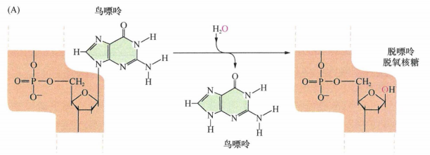
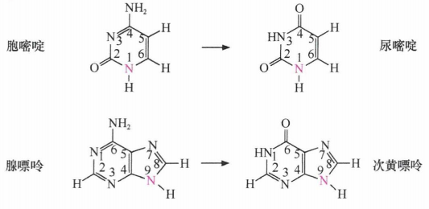
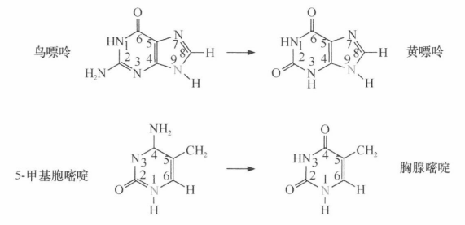
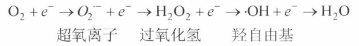
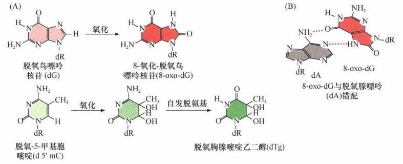
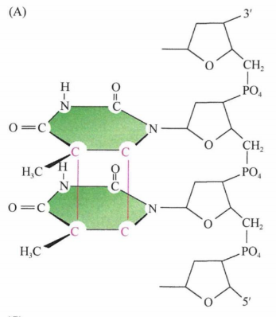
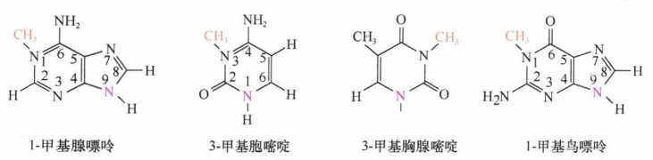
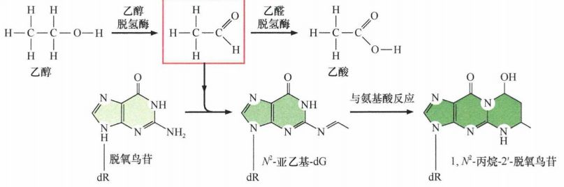
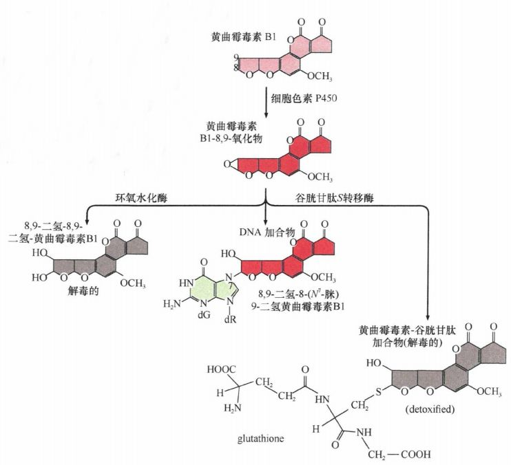
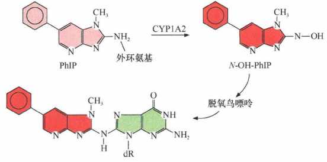

# 第十二章 《癌生物学》第十二章（2）基因组损伤的来源

**往期回顾**
 

 
[《癌生物学》第七章（1） 抑癌基因与肿瘤细胞表型](http://mp.weixin.qq.com/s?__biz=Mzg4NjA5Mzg2Mw==&mid=2247486664&idx=1&sn=52597f9e0e4f0027c3bfc4c17954eba0&chksm=cf9fad80f8e824965ed77e0a87f16cb145e8ec9b80f3c4597624f7ea84882af22653207a8437&scene=21#wechat_redirect)
 
[《癌生物学》第七章（2） 抑癌基因的发现与探索](http://mp.weixin.qq.com/s?__biz=Mzg4NjA5Mzg2Mw==&mid=2247486671&idx=2&sn=18afb1b90118fc8ce0521c9f10a73d16&chksm=cf9fad87f8e8249117a3d1e0395cfabbda447a5a4410d4a9ff913043bee26d6ec8899e4aceb3&scene=21#wechat_redirect)
 
[《癌生物学》第七章（3） 抑癌基因的作用实例](http://mp.weixin.qq.com/s?__biz=Mzg4NjA5Mzg2Mw==&mid=2247486678&idx=2&sn=91703b8b6417578486ac512a09a064d2&chksm=cf9fad9ef8e82488061f0150a628ffa88f89b81d7f3155c0797ec2c4b4aef0a12bbd9db66ed8&scene=21#wechat_redirect)
 
《癌生物学》第八章（1） 细胞周期控制时钟
 
[《癌生物学》第八章（2） pRb在细胞周期时钟中的作用](http://mp.weixin.qq.com/s?__biz=Mzg4NjA5Mzg2Mw==&mid=2247487021&idx=1&sn=5b7c94bc179e2002f3c9a5713b0733c3&chksm=cf9faf65f8e82673762e74e560b7a481ee1561a6845ed2cdcf87ed1cef9427db47c7ad68d437&scene=21#wechat_redirect)
 
[《癌生物学》第八章（3） Myc、TGF-β在细胞周期时钟中的作用](http://mp.weixin.qq.com/s?__biz=Mzg4NjA5Mzg2Mw==&mid=2247487022&idx=1&sn=013769ab286813e3834183669c3fe69b&chksm=cf9faf66f8e82670baab3d827866f7b2b668259bbacfb38aedb0f0626ecc2dadf1f1235c895a&scene=21#wechat_redirect)
 
[《癌生物学》第九章（1） p53——抑癌基因](http://mp.weixin.qq.com/s?__biz=Mzg4NjA5Mzg2Mw==&mid=2247487247&idx=1&sn=50b6eaf0623c0c134f4c6588f68c3689&chksm=cf9fae47f8e82751bc562b5867da4f7cbecc9cfcd3bb65c3ea19891184fc6f4bd5cccf590299&scene=21#wechat_redirect)
 
[《癌生物学》第九章（2） P53水平的调控](http://mp.weixin.qq.com/s?__biz=Mzg4NjA5Mzg2Mw==&mid=2247487248&idx=1&sn=f33178b9d3428da2eb7ec91e7fe1e8f6&chksm=cf9fae58f8e8274e3234ef693fd33bda4ab3a62f6f3e790ea677a4dbe61b2b87e945202fb99d&scene=21#wechat_redirect)
 
[《癌生物学》第九章（3） P53的生物学功能](http://mp.weixin.qq.com/s?__biz=Mzg4NjA5Mzg2Mw==&mid=2247487249&idx=1&sn=812b0a64097fabf21da4b79650fe668d&chksm=cf9fae59f8e8274f0f4165f157155304db6f91b85bc141e38330e8b09c94173ff44a8e03718c&scene=21#wechat_redirect)
 
[《癌生物学》第九章（4） 凋亡与肿瘤](http://mp.weixin.qq.com/s?__biz=Mzg4NjA5Mzg2Mw==&mid=2247487251&idx=2&sn=c670121fa3e55e6eac50a606096bd292&chksm=cf9fae5bf8e8274d404393647fc7eca19b7f54bdac964ad16003b9b0f5f9eeaf767e843dcecb&scene=21#wechat_redirect)
 
[《癌生物学》第十章（1） 肿瘤细胞无限增殖的两个障碍](http://mp.weixin.qq.com/s?__biz=Mzg4NjA5Mzg2Mw==&mid=2247487501&idx=1&sn=3923a4a34cbabaf58f5c49f5973e4149&chksm=cf9fb145f8e83853ba49d4d8e6512b681ff674bfdf4724ff3a519130d9f6173242dad0e80132&scene=21#wechat_redirect)
 
[《癌生物学》第十章（2） 端粒和端粒酶](http://mp.weixin.qq.com/s?__biz=Mzg4NjA5Mzg2Mw==&mid=2247487506&idx=1&sn=4e2df94146e3a9328b7ca74b03a573da&chksm=cf9fb15af8e8384c2bdcf218c35b9497ffd1f521e658084df49d4be5f9eed137d39211a67935&scene=21#wechat_redirect)
 
[《癌生物学》第十章（3） 端粒酶的双重角色](http://mp.weixin.qq.com/s?__biz=Mzg4NjA5Mzg2Mw==&mid=2247487507&idx=2&sn=2b23b04530bff885efd741fed554d46f&chksm=cf9fb15bf8e8384d1670f2d518fdc4aa87cd47a756936cca722f2c6b88df16c699570d0cc205&scene=21#wechat_redirect)
 
[《癌生物学》第十一章（1）  肿瘤多阶段发展](http://mp.weixin.qq.com/s?__biz=Mzg4NjA5Mzg2Mw==&mid=2247487819&idx=1&sn=9e5153efeab13f233efce6fcefd01d53&chksm=cf9fb003f8e83915e4fca96afb9676a896222551f89c72698dd51b2a159d2098acaf2db3c0f2&scene=21#wechat_redirect)
 
[《癌生物学》第十一章（2） 对进化论解释肿瘤发展的补充](http://mp.weixin.qq.com/s?__biz=Mzg4NjA5Mzg2Mw==&mid=2247487832&idx=1&sn=5e8fbe85d6c878d01fd5c8123597f738&chksm=cf9fb010f8e83906a15b3a4dde368c45a4878310af6d8ae7cea6ee854219ee36eabe1ca51ae4&scene=21#wechat_redirect)
 
[《癌生物学》第十一章（3）参与肿瘤发展的因素之炎症](http://mp.weixin.qq.com/s?__biz=Mzg4NjA5Mzg2Mw==&mid=2247487874&idx=1&sn=d1adb72c268af79d532a0ede13f52abe&chksm=cf9fb0caf8e839dcdbc8eb23ce9779053eb50f64e7589bab3116b6ee14fb10b048f51388ec44&scene=21#wechat_redirect)
 
[《癌生物学》第十二章（1）DNA损伤的预防](http://mp.weixin.qq.com/s?__biz=Mzg4NjA5Mzg2Mw==&mid=2247487949&idx=1&sn=107054f050f8b4d3404a6e371ddf3194&chksm=cf9fb085f8e839937724d4ada4c21deec6f12551160dd2933522d10f25fae38b9b8ac6f895a3&scene=21#wechat_redirect)
 

 
**前言** ：上一期我们了解了预防和修复基因组损伤的机制，这一小节主要来学习 **基因组损伤的来源** ，可以进一步加深对基因组损伤修复的理解。
 

 
DNA具有双螺旋结构，碱基朝向内部，以遮蔽潜在的化学反应基团，尤其是碱基的氨基侧链，使其免受多种诱变剂的各种化学攻击。一些研究表明，单链DNA中的碱基比双链DNA中的碱基遭受的氧化损伤多100~1000倍。尽管DNA分子具有如此聪明的机制，它还是容易发生化学改变和物理损伤。一些损伤是中性pH条件下低浓度（约10 -7 m ol/L) 氢离子和氢氧根离子的作用造成的。
 

 
 

 
 
**内源性攻击**
 
 

 
 
**脱嘌呤过程**
 
 

 
 
在脱嘌呤过程中，连接嘌呤碱基（腺嘌呤或鸟嘌呤）和脱氧核糖的化学键能够自发断裂。据估计，一个哺乳动物细胞每天通过脱嘌呤作用能丢失多至10000个嘌呤碱基（这相当于人体内每天产生多于10 17 个 化学改变的核苷酸）。
  
图1：脱嘌呤作用
 

 
**脱嘧啶过程**
 
 

 
 
与脱嘌呤相比，脱嘧啶作用以低20~100倍的频率发生，但仍能使每个细胞每天丢失多至500个胞嘧啶和胸腺嘧啶。据估计，存在于单一人类基因组中无碱基核苷酸的水平稳定维持在4000~50000个。
 

 
**脱氨基过程**
 
 

 
 
脱氨基作用可能发生于鸟嘌呤、腺嘌呤和胞嘧啶环中伸出的氨基位点，使氨基丢失，这一脱氨基作用分别产生黄嘌呤、次黄嘌呤和尿嘧啶。尿嘌呤在随后的DNA复制过程中可能被识别为胸腺嘧啶，因此造成C-T点突变，称为转换性突变，即嘧啶之间相互替换。通过脱氨基作用产生的碱基对于正常DNA来说都是外来的，因此能被识别，并被DNA修复酶去除。然而，任何逃避监视和被修复酶去除的碱基都代表了潜在的点突变来源。
 
5-甲基胞嘧啶——前面提到的甲基化胞嘧啶——通过自发脱氨基作用能以更高的频率产生胸腺嘧啶。这将会给DNA修复机器带来很严重的问题，因为胸腺嘧啶（与上文提到的脱氨基作用的其他三种产物不同）是正常DNA的组成成分，T:G碱基对可能因此而逃避监视，从而幸存下来，最终作为模板进入下一个DNA复制循环，造成C-T点突变。
 
实际上，5-甲基胞嘧啶的脱氨基作用是人类DNA中点突变的主要来源。据估计，内脏器官的肿瘤基因组中63%的点突变（如免受紫外线辐射的组织）发生于CpG序列。在突变的p53等位基因中，约有30%是由野生型p53等位基因中的CpG序列突变而来的。但不是所有CpG位点发生的突变都是由脱氨基作用造成的。
   
图2：脱氨基作用
 

 
**氧化过程**
 
 

 
 
细胞内环境对于染色体DNA来说，还具有其他危险。其中最严重的来自氧化过程，这可能比上面提到的反应对DNA产生的损伤更多。最重要的反应发生在线粒体中，在氧气逐渐被还原为水的过程中生成多种中间产物：
  
图3：氧化过程
 

 
一些中间产物，所谓的活性氧物质(ROS),可能会从线粒体中渗出，进入细胞质，从而到达细胞中其他部位。这样的中间产物包括超氧离子、过氧化氢和羟自由基。然而，还会产生多种作为耗氧酶副产物的氧化剂，包括过氧化物酶体（参与多种细胞成分，特别是磷脂氧化反应的细胞质体）中的酶，以及由脂类自发氧化导致过氧化的酶。炎症反应也会为氧化剂提供重要来源，这些氧化剂倾向于引发突变和随之而来的致癌作用。
 
在这些过程中产生的高反应活性分子，通常在几秒钟之内就能与细胞中很多其他分子形成共价键。DNA中的碱基是众多活性氧物质攻击的位点之一，包括嘌呤碱基和嘧啶碱基。另外，活性氧物质可以诱导单链和双链DNA的断裂，形成无嘌呤和无嘧啶位点（统称为无碱基位点，这些位点中的碱基从脱氧核糖上断裂下来), 以及DNA-蛋白质的交联。许多由此而改变的碱基被修复机器识别，进而从DNA上切除。
 
两种高频率的氧化反应，一种是脱氧鸟嘌呤核苷(dG)被氧化成8-氧化-脱氧鸟嘌呤核苷(8-oxo-dG); 另一种是脱氧-5-甲基胞嘧啶(d5'mC), 这一核苷酸存在于甲基化CpG序列中。后者最初形成一个不稳定的碱基，并很快脱氨基，生成脱氧胸腺嘧啶乙二醇(dTg)。
 
一些被切下的碱基，包括由脱氧胸腺嘧啶二醇产生的胸腺嘧啶二醇和由8-氧化-脱氧鸟嘌呤核苷(8-oxo-dG)产生的8-脱氧鸟嘌呤，可在哺乳动物尿液中对其进行检测并定量，从而为获得其在整个机体中的合成速率提供 一些信息。
 
一些实验显示，在多种物种中这些成分的生成量与氧化代谢速率有直接的比例关系。8-oxo-dG的形成会有突变的危险，因为该碱基的一种构象可以很容易与A配对，在DNA复制过程中该碱基错配会导致G:C碱基对替换，即G:A对变成T:A碱基对。这种G→T由嘌呤到嘧啶的替换（或相反）通常称为 **颠换** 。
  
图4：DNA中碱基的氧化
 

 
**碱基甲基化**
 
 

 
 
其他损伤可以通过碱基与S-腺苷甲硫氨酸反应而引发碱基甲基化。S-腺苷甲硫氨酸是细胞中一种常见的代谢中间物，携带高反应活性的甲基基团。
 
总的来说，由氧化、脱嘌呤、脱氨基和甲基化产生的持续损伤，每天可能使每个细胞中成千上万的碱基发生改变，远远超过大多数组织中由外源诱变剂产生损伤的量。
 

 
 

 
 
**外源性攻击**
 
 

 
 
**X射线**
 
 

 
 
研究最多的外源致癌物是X射线，由于这种形式的电磁能量在细胞中产生离子化的、具有化学反应活性的分子，通常被称为“离子辐射”。细胞中由X射线储存的多达 80%的能量被认为用于从水分子中去除电子，产生的自由基接着会形成活性氧物质(ROS)。X射线能够使DNA发生改变，因为它们通常形成可使DNA双螺旋中产生单链和双链断裂的自由基。这些双链断裂通常很难被修复，而且可能偶尔会在染色体内发生断裂，这在显微镜下观察中期分裂相时可以看到。
 

 
**紫外线辐射**
 
 

 
 
与X射线相比，来自阳光的紫外线辐射是更加普遍的环境辐射来源。紫外光子攻击皮肤细胞中的DNA常常会形成嘧啶二聚体。也就是说，在同一条DNA链两个相邻的嘧啶之间形成共价键。原则上，这些键可以在两个相邻的C、两个相邻的T或者C和相邻的T之间形成。在哺乳动物中，A、C、G和T的比例相似，多于60% 的嘧啶二聚体是TT, 另有约30%是CT, 剩下的是CC 。一对共价键在相邻的嘧啶之间形成，从而产生一个四碳环（环丁烷。
  
图5：DNA相邻嘧啶之间发生共价交联
 

 
另一种不很普遍的DNA光反应产物，被称为嘧啶(6-4)嘧啶酮，也包含两个相邻嘧啶的共价交联。嘧啶二聚体一旦形成，就非常稳定，能够在DNA中存留很长时间，除非它们被DN 修复酶识别并消除掉。
 
嘧啶二聚体能够诱变的事实，在皮肤角质症（良性皮肤损伤）和基底细胞癌DNA中发现的p53突变谱中得以证实。在异常细胞中，许多突变的p53等位基因被一个嘧啶二聚体所替代。TT二聚体是由紫外线照射形成最多的结构之一，但其只有弱的诱变作用，因为很多DNA修复和复制酶能够对其进行有效的处理。
 

 
**烷化剂**
 
 

 
 
多种化学分子能够从外界进入机体，经过化学修饰，然后与细胞中的大分子DNA进行反应。许多被修饰的化学分子是亲电的，它们寻找并击靶分子内富含电子的区域。最强的一类诱变剂是被称为烷化剂的化学物质，它们能够使烷基与DNA碱基共价交联。
 
碱基的烷基化可能使其与脱氧核糖间的共价键变得不稳定，造成DNA中嘌呤或嘧啶碱基的丢失。另外，烷基化碱基在DNA复制过程中可能会被DNA聚合酶错读。由于它们强大的诱变作用，烷基化试剂通常被用于诱导实验动物形成多种类型的肿瘤。
 
由于在临床上被用于抗肿瘤化疗的特定烷化剂也具有强大的诱变作用，化疗会带来一个副作用，即可能会在另一个部位出现由于治疗而引起的新肿瘤。另外，按受过烷化剂替莫唑胺(temozolomide)化疗的胶质瘤患者的基因组测序结果表明，其基因组中存在大量的点突变。
  
图6：DNA的甲基化（烷化基团）
 

 
**代谢改变化合物的性质**
 
 

 
 
当被吸收的化合物在细胞中通过代谢途径发生改变时，会形成很多功能强大的诱变物质。以苯并芘(BP)为例，它是一种强致癌剂，属于多环芳烃(PAH),即多个苯环以多种方式组合在一起。一组复杂的属于细胞色素酶P450(CYP)家族的酶，被细胞用于氧化多环芳烃。细胞运用这些酶解毒外来化学分子，并将其转变为可溶的并易于分泌的分子。然而，这一解毒作用的作用通常是，产生对DNA分子有高反应活性的、具有活跃诱变性的化学分子。其结果是，化学惰性、无反应活性的前致癌剂会被转变为反应活性高的致癌剂，通过与多种碱基之间形成共价键直接攻击DNA分子。致癌剂与DNA碱基反应形成的化学基团通常被称为DNA加合物。
 
在多数情况下，具有化学反应活性的终致癌剂几乎在刚形成的时候就对其他分子进行攻击，因此它们作为游离分子的生存期只有几秒钟时间。这表明许多由活化致癌剂造成的遗传损伤与这些分子启动的代谢激活途径存在于相同细胞内。
 
最近发现乙醇的致癌作用主要是当其以多种高浓度的蒸馏酒的形式存在时发挥的细胞毒作用：乙醇可使口腔和食管的上皮脱落，进一步驱动上皮干细胞的代偿性增殖，从而作为一个强大的肿瘤促进因子起作用。然而，该机制不能解释已被广泛接受的流行病学现象，即大量饮用更加稀释的乙醇也能够致癌。近期一项欧洲的研究发现，每日饮用三杯或更多啤酒且具有特定乙醇脱氢酶（alcohol dehydrogenase, ADH) 等位基因和能够使酶活性降低的乙醛脱氢酶（aldehyde dehydrogenase, ALDH) 等位基因的人患胃癌的频率提高2倍（相对于正常的等位基因）。东亚人群中，ALDH2位点杂合使酶功能降低，饮酒后面部变红，且相对于具有完整ALDH2活性的人，其患食管癌的风险增加10倍。可能主要（虽不是全部）是由于乙醛的诱变作用。乙醛是乙醇代谢过程的中间产物，其与脱氧鸟苷(deoxyguanosine, dG) 具有较高的反应活性，二者能够形成几种不同的DNA加合物，这些加合物远远小于苯并芘产生的庞大加合物。
  
图7：代谢产生的乙醛具有DNA损伤活性
 

 
**黄曲霉素B1** 

 
 

 
 
最强的外源致癌剂之一是由曲霉属真菌合成的黄曲霉毒素B1(aflatoxinB1, AFB1)。曲霉真菌生长在保存不当的花生和谷物上。生活在AFB1高剂量环境中的人患肝癌(HCC)的风险升高3倍，而感染慢性肝炎B病毒的人患此病的风险将升高7倍。在一些区域，被这一病毒感染并食用过被AFB1污染食物的人患萎缩性肝癌的风险升高60倍。
 
AFB1一旦被肝中的CYP激活，产生的代谢物就能攻击鸟嘌呤，并通过共价键连接至该碱基，从而形成一个DNA加合物。AFBI导致DNA中发生特定的G→T突变。暴露于AFB1而形成的肝细胞癌中，有一半在抑癌基因p53第249位密码子处发生点突变，即AGG→AGT。
  
图8：黄曲霉毒素
 

 
**杂环胺**
 
 

 
 
杂环胺(heterocyclic, HCA)是多种肉类在高温烹制时大量形成的一类分子。这些化合物是通过细胞中自然形成的分子之间的作用形成的，主要是肌氨酸、葡萄糖磷酸、二肽和游离氨基酸。HCA无疑具有致癌作用。例如，肉类高温烹制过程中形成最多的化合物2-氨基-1-甲基-6-苯基咪唑 [4,5-b] 吡啶(PhIP), 能导致大鼠发生结肠癌和乳腺癌，导致小鼠形成淋巴瘤。PhIP被认为是人类饮食中最主要的HCA。
 
一旦杂环胺进入细胞，即被CYP氧化。一些CYP氧化杂环胺的环，其他的氧化环外的氨基，即由环伸出的基团。CYP对环的氧化作用可以成功地解毒。然而，氨基氧化会形成易与蛋白质和DNA形成共价键的具有高度活性的化合物。这些化合物和HCA的其他化学变构体在肝脏中大量积累，生成的活性分子通常都会在肝脏中保留很长时间后才被释放，然后通过血液循环进入其他器官。在这些器官中，它们可能通过攻击DNA从而发挥其诱变活性。
  
图9：PhIP的氧化
 

 参考书目： 《The Biology of Cancer》（Second Edition）  R.A.Weinberg  著，詹启敏 等  译 
 编辑： 张月明 周健 
 校审： 张健 罗鹏 

 
 ***欢迎点击下方图片进行留言，说出你的看法哦~***
 

 
我知道你 **在看** 哟
 