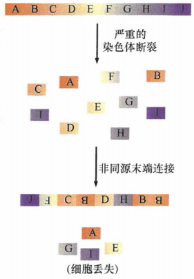
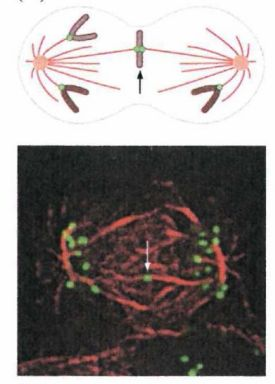
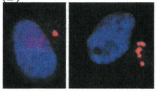
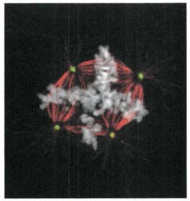

# 第十二章 《癌生物学》第十二章（4）癌细胞核型的变化

**往期回顾**
 

 
[《癌生物学》第七章（1） 抑癌基因与肿瘤细胞表型](http://mp.weixin.qq.com/s?__biz=Mzg4NjA5Mzg2Mw==&mid=2247486664&idx=1&sn=52597f9e0e4f0027c3bfc4c17954eba0&chksm=cf9fad80f8e824965ed77e0a87f16cb145e8ec9b80f3c4597624f7ea84882af22653207a8437&scene=21#wechat_redirect)
 
[《癌生物学》第七章（2） 抑癌基因的发现与探索](http://mp.weixin.qq.com/s?__biz=Mzg4NjA5Mzg2Mw==&mid=2247486671&idx=2&sn=18afb1b90118fc8ce0521c9f10a73d16&chksm=cf9fad87f8e8249117a3d1e0395cfabbda447a5a4410d4a9ff913043bee26d6ec8899e4aceb3&scene=21#wechat_redirect)
 
[《癌生物学》第七章（3） 抑癌基因的作用实例](http://mp.weixin.qq.com/s?__biz=Mzg4NjA5Mzg2Mw==&mid=2247486678&idx=2&sn=91703b8b6417578486ac512a09a064d2&chksm=cf9fad9ef8e82488061f0150a628ffa88f89b81d7f3155c0797ec2c4b4aef0a12bbd9db66ed8&scene=21#wechat_redirect)
 
《癌生物学》第八章（1） 细胞周期控制时钟
 
[《癌生物学》第八章（2） pRb在细胞周期时钟中的作用](http://mp.weixin.qq.com/s?__biz=Mzg4NjA5Mzg2Mw==&mid=2247487021&idx=1&sn=5b7c94bc179e2002f3c9a5713b0733c3&chksm=cf9faf65f8e82673762e74e560b7a481ee1561a6845ed2cdcf87ed1cef9427db47c7ad68d437&scene=21#wechat_redirect)
 
[《癌生物学》第八章（3） Myc、TGF-β在细胞周期时钟中的作用](http://mp.weixin.qq.com/s?__biz=Mzg4NjA5Mzg2Mw==&mid=2247487022&idx=1&sn=013769ab286813e3834183669c3fe69b&chksm=cf9faf66f8e82670baab3d827866f7b2b668259bbacfb38aedb0f0626ecc2dadf1f1235c895a&scene=21#wechat_redirect)
 
[《癌生物学》第九章（1） p53——抑癌基因](http://mp.weixin.qq.com/s?__biz=Mzg4NjA5Mzg2Mw==&mid=2247487247&idx=1&sn=50b6eaf0623c0c134f4c6588f68c3689&chksm=cf9fae47f8e82751bc562b5867da4f7cbecc9cfcd3bb65c3ea19891184fc6f4bd5cccf590299&scene=21#wechat_redirect)
 
[《癌生物学》第九章（2） P53水平的调控](http://mp.weixin.qq.com/s?__biz=Mzg4NjA5Mzg2Mw==&mid=2247487248&idx=1&sn=f33178b9d3428da2eb7ec91e7fe1e8f6&chksm=cf9fae58f8e8274e3234ef693fd33bda4ab3a62f6f3e790ea677a4dbe61b2b87e945202fb99d&scene=21#wechat_redirect)
 
[《癌生物学》第九章（3） P53的生物学功能](http://mp.weixin.qq.com/s?__biz=Mzg4NjA5Mzg2Mw==&mid=2247487249&idx=1&sn=812b0a64097fabf21da4b79650fe668d&chksm=cf9fae59f8e8274f0f4165f157155304db6f91b85bc141e38330e8b09c94173ff44a8e03718c&scene=21#wechat_redirect)
 
[《癌生物学》第九章（4） 凋亡与肿瘤](http://mp.weixin.qq.com/s?__biz=Mzg4NjA5Mzg2Mw==&mid=2247487251&idx=2&sn=c670121fa3e55e6eac50a606096bd292&chksm=cf9fae5bf8e8274d404393647fc7eca19b7f54bdac964ad16003b9b0f5f9eeaf767e843dcecb&scene=21#wechat_redirect)
 
[《癌生物学》第十章（1） 肿瘤细胞无限增殖的两个障碍](http://mp.weixin.qq.com/s?__biz=Mzg4NjA5Mzg2Mw==&mid=2247487501&idx=1&sn=3923a4a34cbabaf58f5c49f5973e4149&chksm=cf9fb145f8e83853ba49d4d8e6512b681ff674bfdf4724ff3a519130d9f6173242dad0e80132&scene=21#wechat_redirect)
 
[《癌生物学》第十章（2） 端粒和端粒酶](http://mp.weixin.qq.com/s?__biz=Mzg4NjA5Mzg2Mw==&mid=2247487506&idx=1&sn=4e2df94146e3a9328b7ca74b03a573da&chksm=cf9fb15af8e8384c2bdcf218c35b9497ffd1f521e658084df49d4be5f9eed137d39211a67935&scene=21#wechat_redirect)
 
[《癌生物学》第十章（3） 端粒酶的双重角色](http://mp.weixin.qq.com/s?__biz=Mzg4NjA5Mzg2Mw==&mid=2247487507&idx=2&sn=2b23b04530bff885efd741fed554d46f&chksm=cf9fb15bf8e8384d1670f2d518fdc4aa87cd47a756936cca722f2c6b88df16c699570d0cc205&scene=21#wechat_redirect)
 
[《癌生物学》第十一章（1）  肿瘤多阶段发展](http://mp.weixin.qq.com/s?__biz=Mzg4NjA5Mzg2Mw==&mid=2247487819&idx=1&sn=9e5153efeab13f233efce6fcefd01d53&chksm=cf9fb003f8e83915e4fca96afb9676a896222551f89c72698dd51b2a159d2098acaf2db3c0f2&scene=21#wechat_redirect)
 
[《癌生物学》第十一章（2） 对进化论解释肿瘤发展的补充](http://mp.weixin.qq.com/s?__biz=Mzg4NjA5Mzg2Mw==&mid=2247487832&idx=1&sn=5e8fbe85d6c878d01fd5c8123597f738&chksm=cf9fb010f8e83906a15b3a4dde368c45a4878310af6d8ae7cea6ee854219ee36eabe1ca51ae4&scene=21#wechat_redirect)
 
[《癌生物学》第十一章（3）参与肿瘤发展的因素之炎症](http://mp.weixin.qq.com/s?__biz=Mzg4NjA5Mzg2Mw==&mid=2247487874&idx=1&sn=d1adb72c268af79d532a0ede13f52abe&chksm=cf9fb0caf8e839dcdbc8eb23ce9779053eb50f64e7589bab3116b6ee14fb10b048f51388ec44&scene=21#wechat_redirect)
 
[《癌生物学》第十二章（1）DNA损伤的预防](http://mp.weixin.qq.com/s?__biz=Mzg4NjA5Mzg2Mw==&mid=2247487949&idx=1&sn=107054f050f8b4d3404a6e371ddf3194&chksm=cf9fb085f8e839937724d4ada4c21deec6f12551160dd2933522d10f25fae38b9b8ac6f895a3&scene=21#wechat_redirect)
 

 
**前言** ：前三小节学完，第十二章的学习也接近尾声了，今天的学习任务相对比较轻松了哈。主要来讲解癌细胞核型异常的两种形式： **单条染色体结构的改变和无染色体结构改变的数量变化** 。
 

 
 

 
 
**癌细胞核型的变化**
 
 

 
 
早在对DNA损伤及其修复认识之前，人们就已经知道癌细胞中存在核型异常。实际上，人类认识到癌细胞中存在着异常染色体已经近一个世纪。在BRCA1和BRCA2功能缺失的细胞中可观察到二射体和四射体的中期染色体就是很好的例子。癌细胞中的核型异常有两种形式：单条染色体结构的改变和无染色体结构改变的数量变化。
 

 
**染色体结构的改变**
 
 

 
 
非整倍体通常指由正常（或整倍体）核型衍生而来的染色体数量的变化。但是，近年来非整倍体这一术语所指的范围偶尔也会扩大到包括单条染色体结构的变化，这种异常见于大部分实体瘤细胞（大于85%)。在此，我们使用一个更专业的术语 “染色体畸变”。
 
偶然发生在DNA复制叉的不能被修复的双链DNA断裂，被认为是染色体易位的主要机制。研究比较清楚的易位是myc原癌基因易位到3个免疫球蛋白之一的启动子/增强子序列，形成融合基因。在这些及其他的淋巴瘤中，引起免疫球蛋白和T细胞受体(TCR)基因重排的复杂机制似乎没有作用。该机制不引起免疫球蛋白和TCR基因序列的重排，而是催化错误的染色体间重组，使免疫球蛋白基因杂乱地与遍布于整个基因组中的序列融合，myc基因就是其中之一。发生在原癌基因myc 中的稀有易位可使其转录失调，细胞获得特异的增殖优势，导致细胞克隆出现，最终产生具有特异核型的淋巴瘤。
 
实际上，在多种造血系统的恶性肿瘤中报道了许多高度特异性的易位。引起蛋白质结构发生各种改变的分子机制还不清楚。但是，在第10章提到了一种很吸引人的假设，即端粒断裂引起的断裂－融合-桥(BFB)循环。
 
在各种造血系统肿瘤中发现一些相似的结构异常。许多这些易位是高频的，因为在一系列独立发生的肿瘤中都发现了这些易位。因为这些易位位于染色体上高度特异的位点，所以其发生的分子机制可能不同于上述的断裂－融合－桥循环。
 
我们在2010年发现，约25%的骨癌基因组和2%~3%的所有肿瘤基因组中存在着完全新型的畸变一局部爆发式染色体重排。仅仅一个灾难性事件就可以使基因组的片段发生碎裂，由此形成的各种构型的碎片随后被重新连接起来。至今“染色体碎裂 "的诱变机制仍不清楚。
  
图1：局部爆发式染色体重排
 

 
在造血及非造血细胞中发现的更为常见的易位分子机制同样也不清楚，在这些细胞中参与免疫球蛋白基因和T细胞受体基因重排的酶不表达。对DNA易位断裂位点及其周围序列分析发现了重复、缺失和倒位，这些发现提示一些具有“错误－倾向”的DNA修复机制，如前面提到的非同源末端连接(NHEJ)参与其中，但目前为止还很难得到证明。
 

 
**染色体数量的改变**
 
 

 
 
造成染色体不稳定的染色体数目变化通常是有丝分裂过程中染色体错误分离的结果。在正常的细胞周期M期，染色体排列到赤道板与由微管蛋白组成的纺锤体纤维相连，一起形成中期纺锤体。中期纺锤体是一种双极结构，每一个半极由微管纤维组成，其中许多由位于染色体的HT(与染色体着丝粒DNA相关的核蛋白体）延伸出来再回到中心体，后者负责整个中期纺锤体结构的组织。当这一“装置”正常运转时，纺锤体纤维牵拉成对的姐妹染色单体将二者分开，使每个染色单体分别移向一个中心体。这一过程保证染色体在两个子细胞中均等分配。
 
染色体分离的复杂过程是由一系列的检验点监控的，从开始就保证形成两个中心体和两个半极的纺锤体，只有在所有配对的染色单体都正确排列到赤道板后染色单体才可以分离。当这些检验点机制失去对染色体分离的监控后，配对的染色单体可能被拉向同一个中心体（即染色体不分离）。结果导致该条染色体在其中的一个子细胞中可能是单体，而在另一个子细胞中可能是三体。在有些情况下，某条染色单体可能没有与纺锤体纤维连接，从而在子代细胞的基因组中丢失。
 
非整倍体的一个更重要的来源是一种复杂装置的功能障碍。正常情况下，这种装置确保每个着丝粒准确结合在自己一套20~25个用于形成纺锤丝的微管上；每对姐妹染色单体原本是由配对的着丝粒连接，着丝粒与纺锤丝的连接可使姐妹染色单体在细胞有丝分裂后期被拉向相反的方向。然而，在许多癌细胞中这种控制机制不能正常运行，单个着丝粒与过多的纺锤丝相连接。例如，当某个着丝粒（属于单个染色单体）同时连接两套方向相反的纺锤丝时就会形成 **微管－染色体错误联结** （merotely),而微管－染色体错误联结就会参与一种微观的“拔河”比赛，这种竞争往往在有丝分裂完成时还未结束，从而使得携带此着丝粒的染色单体滞留在两组准确分离的染色单体（现称为染色体)之间。这条孤立染色体的命运是未知的，它可能完全丢失或者最终进入某个子代细胞核。
  
图2：微管－染色体错误联结
 

 
在正常细胞中，微管－染色体错误联结现象经常在细胞从分裂中期进入分裂后期时被校正修复。这种校正修复对正常细胞非常关键，因为发生微管错误联结的染色体不能解发 **纺锤体组装检验点** (SAC)。如果纺锤丝未能正确地连接到所有染色单体的着丝粒上，SAC就会阻止细胞进入分裂后期。实际上，癌细胞的14个不同SAC 调节蛋白中的一个或多个经常发生缺陷。具有某些SAC蛋白低表达的基因工程小鼠的自发肿瘤形成水平提高。
 
如果纺锤体本身没有正确的组装就会出现更广泛的核型混乱。在正常间期细胞的细胞质中可见一个中心体 , 有丝分裂过程中两个中心体在细胞内两极相对排列。但是在癌细胞中经常可见这种组织形式存在显著的缺陷，包括在间期出现 **多个中心体** 。结果可能是出现多极的，而不是正常细胞内见到的两极的有丝分裂纺锤体。通常，额外的中心体会在细胞有丝分裂过和中合并到正常的中心体中，但是它们形成的纺锤体纤维最终会形成没有功能的纺锤体－着丝粒连接。或者，这些额外的中心体可能持续存在，造成染色体分配至三个或更多的子细胞中。染色体错误地分配到子细胞中可能会导致染色体数目和整个核型的剧烈变化。
  
图3：左边单个中心体，右边多个中心体
 

  
图4：多级有丝分裂装置
 

 
保证染色体正常分离的复杂装置一旦损伤就难以恢复。从这方面来说，CIN与前面提到的断裂－融合－桥(BFB)循环不同，这种循环对基因组的影响发生在肿瘤进展过程中有限的窗口时间内，一旦细胞获得端粒末端转移酶使其核型稳定后，循环就停止。
 
中心体的复制与细胞周期进展是紧密协调一致的，这一过程可能发生在G1/S 过渡期或接近G1/S期。是越来越多的证据表明，中心体的复制与细胞周期蛋白E-CDK和细胞周期蛋白A-CDK复合物以某种方式协调作用。人乳头瘤病毒(HPV) E7 癌蛋白表达的原代细胞中出现中心体数目的失调，通常导致出现多个中心体。E7癌蛋白可结合细胞内的视网膜母细胞瘤蛋白(pRb蛋白）使其功能失活，并加速其降解。一种失去了与pRb结合能力的突变形式的HPV E7癌蛋白不能诱导额外中心体的出现。总之，这些证据表明pRb功能缺失的一个结果是中心体复制的失调。
 
在人类宫颈癌细胞中就发现了这种形式的染色体不稳定，几乎所有的这些细胞都表达HPV基因组的早期区域，该区域携带有编码病毒E6和E7癌蛋白的基因。
 
HPV E6蛋白与其他可使p53功能失活的因子一样，可促进非整倍体的形成，因为关键抑癌基因功能缺失的细胞更容易出现非整倍体基因组。因此，HPV E7癌蛋白使中心体数目不稳定，而E6癌蛋白通过对p53蛋白的作用，使细胞对最终出现的中心体异常耐受。p53 功能、有丝分裂检验点的控制及染色体数目的监控三者之间的信号网络还不是很清楚。pRb调节的失活可导致控制R点转化的监控机制失效，从而使 HPV 感染初期的细胞立即获得增殖优势。
 
有丝分裂调控基因的一个例子是CHFR,纺锤体微管和中心粒排列异常时，该基因编码的蛋白通常可阻止细胞周期由前期进入中期。
 
另一个对M期进展有关键调节作用的是14-3-3蛋白σ。当基因组DNA受到损伤时，p53诱导14-3-3σ的合成，随后该蛋白在细胞质中捕捉周期蛋白B-Cdc2复合物 ，通过隔离这些周期蛋白-CDK复合物，14-3-3σ成功地阻止了细胞进入M期从而终止有丝分裂，直到损伤的染色体DNA得到修复。
 

 参考书目： 《The Biology of Cancer》（Second Edition）  R.A.Weinberg  著，詹启敏 等  译 
 编辑： 张月明 周健 
 校审： 张健 罗鹏 

 
 ***欢迎点击下方图片进行留言，说出你的看法哦~***
 

 
我知道你 **在看** 哟
 