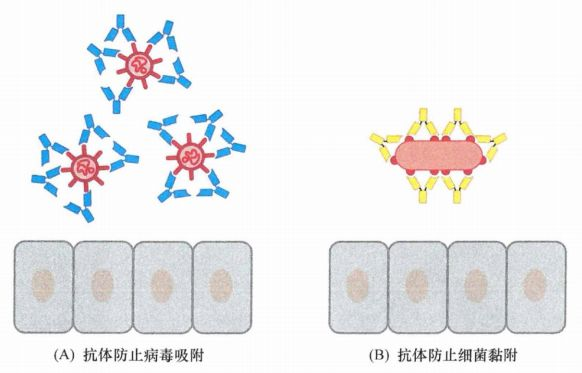
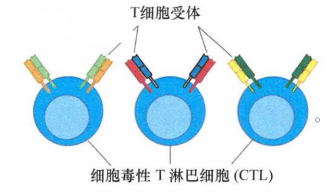
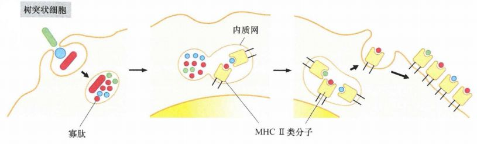
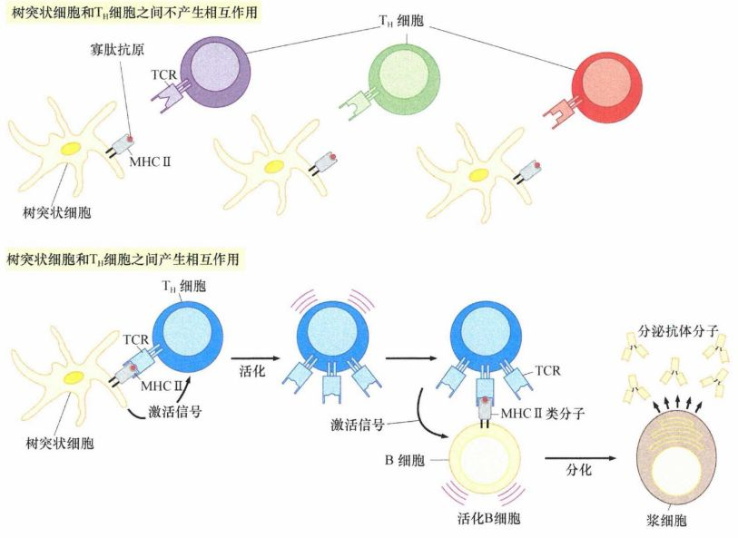
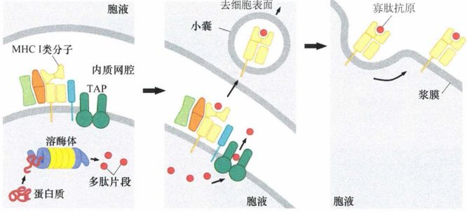
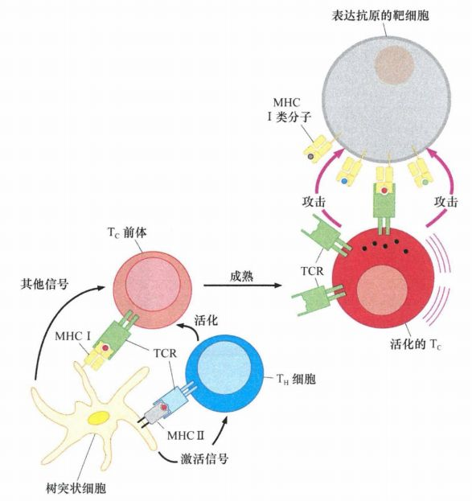
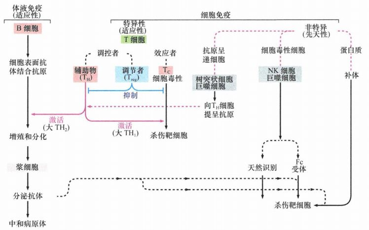

# 第十五章 《癌生物学》第十五章（1） 免疫系统概述

**往期回顾**

[《癌生物学》第十章（1） 肿瘤细胞无限增殖的两个障碍](http://mp.weixin.qq.com/s?__biz=Mzg4NjA5Mzg2Mw==&mid=2247487501&idx=1&sn=3923a4a34cbabaf58f5c49f5973e4149&chksm=cf9fb145f8e83853ba49d4d8e6512b681ff674bfdf4724ff3a519130d9f6173242dad0e80132&scene=21#wechat_redirect) [《癌生物学》第十章（2） 端粒和端粒酶](http://mp.weixin.qq.com/s?__biz=Mzg4NjA5Mzg2Mw==&mid=2247487506&idx=1&sn=4e2df94146e3a9328b7ca74b03a573da&chksm=cf9fb15af8e8384c2bdcf218c35b9497ffd1f521e658084df49d4be5f9eed137d39211a67935&scene=21#wechat_redirect) [《癌生物学》第十章（3） 端粒酶的双重角色](http://mp.weixin.qq.com/s?__biz=Mzg4NjA5Mzg2Mw==&mid=2247487507&idx=2&sn=2b23b04530bff885efd741fed554d46f&chksm=cf9fb15bf8e8384d1670f2d518fdc4aa87cd47a756936cca722f2c6b88df16c699570d0cc205&scene=21#wechat_redirect) [《癌生物学》第十一章（1）  肿瘤多阶段发展](http://mp.weixin.qq.com/s?__biz=Mzg4NjA5Mzg2Mw==&mid=2247487819&idx=1&sn=9e5153efeab13f233efce6fcefd01d53&chksm=cf9fb003f8e83915e4fca96afb9676a896222551f89c72698dd51b2a159d2098acaf2db3c0f2&scene=21#wechat_redirect) [《癌生物学》第十一章（2） 对进化论解释肿瘤发展的补充](http://mp.weixin.qq.com/s?__biz=Mzg4NjA5Mzg2Mw==&mid=2247487832&idx=1&sn=5e8fbe85d6c878d01fd5c8123597f738&chksm=cf9fb010f8e83906a15b3a4dde368c45a4878310af6d8ae7cea6ee854219ee36eabe1ca51ae4&scene=21#wechat_redirect) [《癌生物学》第十一章（3）参与肿瘤发展的因素之炎症](http://mp.weixin.qq.com/s?__biz=Mzg4NjA5Mzg2Mw==&mid=2247487874&idx=1&sn=d1adb72c268af79d532a0ede13f52abe&chksm=cf9fb0caf8e839dcdbc8eb23ce9779053eb50f64e7589bab3116b6ee14fb10b048f51388ec44&scene=21#wechat_redirect) [《癌生物学》第十二章（1）DNA损伤的预防](http://mp.weixin.qq.com/s?__biz=Mzg4NjA5Mzg2Mw==&mid=2247487949&idx=1&sn=107054f050f8b4d3404a6e371ddf3194&chksm=cf9fb085f8e839937724d4ada4c21deec6f12551160dd2933522d10f25fae38b9b8ac6f895a3&scene=21#wechat_redirect) [《癌生物学》第十二章（2）基因组损伤的来源](http://mp.weixin.qq.com/s?__biz=Mzg4NjA5Mzg2Mw==&mid=2247487974&idx=1&sn=f78a30cafd41835b2d9b7b52e63a5399&chksm=cf9fb0aef8e839b820ab28b8f4857b6ed209ac34864b16068dc5fdb0c413a2a27b1fa9481ef1&scene=21#wechat_redirect) [《癌生物学》第十二章（3）DNA修复缺陷引发的疾病](http://mp.weixin.qq.com/s?__biz=Mzg4NjA5Mzg2Mw==&mid=2247487974&idx=2&sn=274bb725f72e37dbc9653c58126a3b6a&chksm=cf9fb0aef8e839b8eab9358955de09d65d8a6fb27412a7c8f6eacf5b6b34752eb894c8f01eb1&scene=21#wechat_redirect) [《癌生物学》第十二章（4）癌细胞核型的变化](http://mp.weixin.qq.com/s?__biz=Mzg4NjA5Mzg2Mw==&mid=2247487974&idx=3&sn=c7fabdb23bf2fb1b8d6cb1e8cf231992&chksm=cf9fb0aef8e839b81c81319a584355725e04bab654f99985457158592285553a78527035da9a&scene=21#wechat_redirect) [《癌生物学》第十三章（1） 肿瘤发生类似伤口损伤愈合](http://mp.weixin.qq.com/s?__biz=Mzg4NjA5Mzg2Mw==&mid=2247487990&idx=2&sn=427192f2af09ea8a12bafb6467955c95&chksm=cf9fb0bef8e839a8a174cead45f0dfe45b154efdf3664b5a5c3c21fb245a1072ba0f06f59944&scene=21#wechat_redirect) [《癌生物学》第十三章（2） 间质细胞可促进肿瘤](http://mp.weixin.qq.com/s?__biz=Mzg4NjA5Mzg2Mw==&mid=2247488046&idx=2&sn=0dab3432d2e285c01924c68f4207286d&chksm=cf9fb366f8e83a7038662351ee64dd8e0c0ec3c37d1d888bc962f95f3ce8b700c3dc07614ed2&scene=21#wechat_redirect) [《癌生物学》第十三章（3） 血管生成与肿瘤](http://mp.weixin.qq.com/s?__biz=Mzg4NjA5Mzg2Mw==&mid=2247488050&idx=2&sn=71764e3ce5e022e275c9376f2cfcc725&chksm=cf9fb37af8e83a6caec618df9c4898312199abdd91650c851a65fdfd0c3926f1aa5c6feaf37c&scene=21#wechat_redirect) [《癌生物学》第十四章（1）侵袭-转移级联反应](http://mp.weixin.qq.com/s?__biz=Mzg4NjA5Mzg2Mw==&mid=2247488369&idx=2&sn=71dba3c62869c6360198bb74f99218d7&chksm=cf9fb239f8e83b2f25630645fe0c0d33cd8021afaa68d6a6eb88c6366484eda0b2172bea97c7&scene=21#wechat_redirect) [《癌生物学》第十四章（2）上皮间叶转化（上）](http://mp.weixin.qq.com/s?__biz=Mzg4NjA5Mzg2Mw==&mid=2247488371&idx=2&sn=c0b04cd92afc7580ac81d623e743141b&chksm=cf9fb23bf8e83b2d187cc5120c3dbf5d2f05d8f70164698e3b7a0643ccfc2e945541b7683d7b&scene=21#wechat_redirect) [《癌生物学》第十四章（3）上皮间叶转化（下）](http://mp.weixin.qq.com/s?__biz=Mzg4NjA5Mzg2Mw==&mid=2247488373&idx=1&sn=f98cd93f4ac5f610dd8e0e31658bc634&chksm=cf9fb23df8e83b2b02b7814b197ee75b286ce2e2baebf1a3b21a69eb5f72de18c1c0b4ed89f7&scene=21#wechat_redirect) 
 [《癌生物学》第十四章（4）转移的亲组织性和骨转移实例](http://mp.weixin.qq.com/s?__biz=Mzg4NjA5Mzg2Mw==&mid=2247488373&idx=2&sn=b47aead2faa1fff7f0a89df205b2b86c&chksm=cf9fb23df8e83b2b109da61b2e5cd191c5f80eba8af9e60c716156c70bde68efda3c550b8e00&scene=21#wechat_redirect) 
 
 “ 免疫系统高效地识别和清除组织中外来的感染性病原体，包括病毒、细菌和真菌等，并且具有多层次的抗肿瘤作用。今天我们讨论免疫系统的基本知识。 ”

1、 免疫系统的两种防御策略

免疫系统主要通过以下两种防御策略：

**1.体液免疫反应可通过产生可溶性抗体分** **子** **特异识别和结合抗原** ，使病毒颗粒或表达在细菌的表面的抗原能快速地被抗体分子包被和中和。同样，被感染的细胞可将病原体生成的抗原表达在细胞表面上并被识别和结合这些抗原的抗体分子包裹，而后被吞噬细胞如巨噬细胞识别、吞噬和消灭，或被细胞毒性细胞如自然杀伤 (NK)细胞杀死。这些免疫细胞自己不具有识别特异外来抗原的能力，但是结合于病毒、细菌或哺乳动物细胞表面抗原的抗体分子能引导这些免疫细胞来摧毁已存在的靶标。

图 15-1-1：抗体分子的中和作用：（A) 病毒感染后宿主产生的抗体可结合病毒颗粒（红色），通过这种包被和中和（灭活）病毒颗粒的感染活性封闭病毒附着于宿主细胞的能力 (B) 细菌表达的某些表面抗原 （红色）也可通过抗体分子（黄色的包被）阻止它们黏附宿主细胞

2. **细胞免疫应答能生成和分化出大量的特异性细胞毒性细胞** ，它们自己能识别和直接攻击在表面表达特定抗原的其他细胞。这种情况下，不需要可溶性抗体仵为中间介导者去识别靶细胞表达的抗原。因为细胞毒性 T淋巴细胞（CTL）系统已形成了由它们自己的T细胞受体（TCR）去识别抗原的机制。

图 15-1-2： 细胞毒性 T淋巴细胞（CTL) ：CTL在其表面产生T细胞受体（TCR)，在免疫系统形成过程中产生出不同排列的TCR, 类似于可溶性抗体的多样性，每个CTL表达一种能识别特异抗原的TCR

免疫系统运用这两种获得性免疫应答限制病毒感染： **细胞免疫应答用于杀伤病毒感染的细胞，体液免疫应答通过抗体分子包被中和已被释放到细胞外、包括循环系统中的病毒颗粒。**

还 从另一个视角描述免疫系统：

免疫系统对感染性病原体（如病毒的特定株）及其抗原的许多免疫应答反应依赖于之前曾遇到过的相同的病原体。免疫系统通过初次相遇并识别这些病原体表达的某些抗原而受到 “训练”，当再次遭遇它们时会产生强有力的反击，这种现象称为获得性免疫反应。同时，免疫系统的其他细胞本能地参与了反应，它们不需要预先遇到抗原和训练即可识别某些感染物和异常细胞，这种生来具有的能力称为固有免疫反应。如前所述的NK细胞就能识别表达特异性细胞表面分子的异常细胞（即使之前没有遇到过此类细胞）。

2、 体液免疫：诱导产生抗体

获得性免疫应答始于免疫系统特殊的吞噬细胞，特别是巨噬细胞和树突状细胞 (DC)吞入感染性颗粒或者非正常的细胞。摄取这些物体或碎片后，吞噬细胞转变了任务，将被摄取的物质呈现给免疫系统的其他细胞（各种类型的T细胞）。为了训练免疫系统，这些抗原呈递细胞(APC)首先消化被它们吞噬的或者内吞的颗粒，在特化的细胞质的小泡中进行消化，将内化的蛋白质切割成寡肽残基，然后这些寡肽结合到主要组织相容性复合体(MHC)II类分子上的特异抗原呈递区。

MHC II分子将信息传递给免疫系统的其他细胞，特别是一类称为辅助性T细胞（T H 细胞）的细胞，其通常被称为 CD4 + 细胞，它们表达一种特异的细胞表面抗原。因为巨噬细胞和树突状细胞专门应用它们的 MHCII 类分子呈递它们自环境中摄取的抗原，免疫学家有时称它们为“专职的"APC。

图 15-1-3： 抗原呈递细胞 (APC)处理抗原：树突状细胞和巨噬细胞将潜在抗原颗粒（红色、绿色和蓝色）吞噬后，通过蛋白酶水解将其片段化成寡肽。然后MHCII 类分子从内质网起步，途经高尔基体（未显示）到达内吞小体并在此与寡肽结合，而后再移到细胞表面，最后在淋巴结内向T细胞呈递寡肽片段

这些 APC将其表面表达的II类分子裸露功能区及其结合的寡肽抗原以联合分子的结构形式一起呈现给T H 细胞。抗原呈递给某些 T H 细胞，然后依次激活 B细胞产生特异识别和结合独特抗原的免疫球蛋白（抗体）分子。这些B细胞的继而分化成熟形成浆细胞，它们活跃地将特定的抗体分泌到循环中，这些抗体分子特异地识别和结合触发这一系列反应的特定抗原。

图 15-1-4： 免疫细胞相会导致抗体产生：树突状细胞通过 MHC II类分子（灰色）将抗原肽呈递给辅助性 T（T H ）细胞。在这里，一个抗原呈递细胞会遇到一些 T H 细胞，它们每个细胞都在其表面显示自己独特的 T细胞受体（紫色、绿色和红色）。 图中 ，最初 3个相遇的T细胞没有一个其表面的T细胞受体能识别并结合被树突状细胞的MHC II类分子呈递的寡肽抗原。当树突状细胞发现 能 识别 其 呈递的寡肽抗原 MHC II类分子 的 T H 细胞 时 ， T H 细胞被激活，离开树突状细胞，寻找在其表面也 MHC II类分子呈递相同抗原的B细胞。当TH细胞发现这种B细胞（浅黄色）时会激活B细胞，促进其增殖，并使其分化为具有释放能够识别这些寡肽抗原的抗体分子的浆细胞。

****

包被在细胞或感染性病原体上的抗体能引发另一种类型的免疫攻击：血浆中的一组蛋白，称为补体，能识别结合于细胞（包括细菌、真菌和哺乳动物细胞）表面的抗体分子的恒定区，与抗体分子结合，在邻近细胞膜上打孔，从而杀伤细胞。 导致适应性体液免疫应答的一系列步骤告诉我们关于具有免疫原性、即能引发免疫应答的抗原分子结构的一些重要内容：它们不是完整的蛋白质，而是 来自于大的蛋白质切割后产生的寡肽片段。

3 、 细胞免疫：细胞毒细胞形成

体液免疫应答不能有效地对抗那些已进入细胞内的病原体，因为浆膜屏蔽了免疫系统对它们的监视。原则上讲，这种屏蔽将产生严重的免疫学难题，因为免疫系统不但承担监控胞外空间和细胞表面的任务，还要监控在细胞内将要发生的事情。这个难题是通过抗原呈递机制来解决的：第一种是通过上述的专职抗原呈递细胞 (APC)的作用；第二种是由其他抗原呈递机制完成。

实际上第二种更为普遍，全身绝大多数细胞都采用第二种方式。它的处理过程如下：细胞内部分合成的蛋白质不是用于它们通常特定的功能，而是常规地被转运给专门的蛋白酶体，在那里，这些蛋白质被降解成寡肽。这些由 8-11个氨基酸残基组成的寡肽先与MHC I类分子结合再被转运到细胞表面，并以MHC-抗原呈递分子复合物的形式展示在细胞表面。

图 15-1-5： MHC I类分子展示胞内抗原几乎全身所有细胞类型：一些在细胞质中近期合成的蛋白转送给蛋白酶体（紫色、黄色），在这里它们被降解成寡肽（红点），然后寡肽通过一个专门的通道 (TAP, 深绿色）被送入内质网腔，在这里遇到MHCI类分子（黄色）并与其相对紧密地结合。这将使寡肽-MHC复合物通过囊泡被传送到细胞表面，向免疫系统展示细胞内合成蛋白的片段。

（ 这些抗原表达的全部过程与 MHCII类分子对抗原的处理、呈递类似，但MHCII类抗原的呈递是由特异的“专职抗原呈递细胞”如巨噬细胞、树突状细胞和B细胞完成的，而MHCI类分子的抗原呈递几乎机体中所有细胞类型都可执行 ）

某些细胞表面呈递寡肽抗原后（通过它的 MHCI类分子)可以吸引细胞毒性T细胞( T C ，或 CTL），进而被这些细胞杀伤。这种杀伤的起源可以追溯到 T H 细胞的作用 , 它们当中一部分亚群能活化 CTL细胞前体 ， 活化的 CTL细胞 特异性识别和杀伤表达激活免疫应答的特殊寡肽抗原的靶细胞，这种细胞毒性淋巴细胞攻击抗原表达细胞即为获得性细胞免疫应答反应。

15-1-6： 树突状细胞激活细胞毒性 T淋巴细胞使其杀伤表达抗原的靶细胞：某些树突状细胞（DC) 能使用自有MHCl类分子来呈递吞下的寡肽给细胞毒性T淋巴细胞的前体（粉红色）。这种DC和Tc前体间的相互作用有时被称为“交叉呈递”，可以帮助诱导细胞毒性T淋巴细胞的前体成熟为活化的细胞毒性T淋巴细胞（CTL, 红色），由它们的T细胞受体(TCR) 识别并结合由全身所有类型细胞表面的MHCI类分子呈递的抗原。这种识别导致的结果是展示抗原的细胞受到攻击（上部右侧灰色区域）。CTL通过含有穿孔素和颗粒酶的细胞毒颗粒（黑点）杀伤靶细胞

细胞毒性 T淋巴细胞通过两种不同的机制有效地杀伤靶细胞。它们可以使靶细胞暴露于特定的毒性蛋白中，如颗粒酶，这些毒性蛋白以多蛋白复合体（包括穿孔素）的形式被内吞入靶细胞的细胞质中，穿孔素在由内吞作用产生的囊泡膜上打孔，允许颗粒酶由这些孔进入靶细胞的细胞质。一旦颗粒酶进入靶细胞的细胞质内，将切割并激活前凋亡蛋白caspase 。

4 、 固有免疫不需要预先致敏

固有免疫应答的细胞能够在体内 “本能地”识别并且攻击外来的病原体和异常细胞，而且无须预先暴露于这些因子被“诱导”。介导固有免疫应答的细胞不是识别特异性抗原，而是识别表达在感染病原体（或者转化细胞）的表面具有特征性的分子模式，该分 子 模式在正常细胞上不表达。

**自然杀伤 (NK)细胞是固有免疫反应的重要介导者** ， NK细胞识别表达在许多不同类型的癌细胞表面的蛋白质结构。除NK细胞外，固有免疫系统的其他细胞成分，包括巨噬细胞和中性粒细胞，可能参与了对抗癌细胞的固有免疫应答。

NK细胞识别和攻击靶细胞后，发出细胞因子信号，特别是干扰素-γ（IFN-γ), 来征募包括巨噬细胞在内的其他免疫细胞到达攻击的部位，这是免疫应答的第二次浪潮，它通常使免疫系统以特异的适应性体液免疫和细胞免疫应答方式，产生更加精确和更为有效的反应。例如，通过获得性免疫应答可以动员大量的细胞毒性T淋巴细胞去有效地杀伤肿瘤细胞。

5 、 免疫耐受的产生需要区分自己和非己

免疫系统具有精密的调控性和高度特异性，它必须能非常精准地区分外来蛋白与体内自身细胞产生的正常蛋白。假如一个细胞表达的寡肽与免疫系统常规遇到的寡肤相似或相同，它在免疫系统各种武器面前将是安全的 ——表现为一种免疫耐受。

在免疫系统的发育过程中，有各种机制确保以清除能识别自身抗原的任何 T细胞或B细胞。免疫系统的早期发育中，T细胞在胸腺基质中遇到巨大的蛋白库，其中包含全身以组织特异性形式表达的大量蛋白 ， **在胸腺中识别自身抗原的 T细胞通过凋亡而从淋巴细胞群中被删除** 。据估计，我们基因组编码的多达 50%的蛋白都在胸腺基质中表达，以产生耐受。中枢耐受的诱导随后经外局／耐受来补充，此时已经逃逸了胸腺中删除过程的T细胞，从胸腺转到全身的淋巴结并识别自身抗原，这些T细胞在淋巴结中进而失活。如果不能从淋巴细胞库中清除这些自身反应的淋巴细胞，那么自身正常的组织细胞将成为它们的靶子。

**自身免疫病的产生就是自身反应细胞对这种耐受打破** ，如类风湿关节炎、溃疡性结肠炎、红斑性狼疮，抗体和细胞毒性细胞均参与攻击正常细胞和组织。

6 、 调节性 T细胞 （ T regs ) 抑制免疫应答

20世纪90年代有间接证据表明，正常个体内有一群重要的免疫细胞，隶属于CTL群体，识别由MHC I类分子呈递的正常组织抗原，这将直接引起对正常组织的免疫攻击，引发自身免疫病。

事实上这种攻击并不会发生，显然一些未知手段抑制了这些细胞的作用。调节性 T细胞（T reg 细胞）的发现在很大程度上解答了这个问题 ——这些细胞封闭了分布在我们全部组织中CTL的作用。

T regs 像 T H 一样，在它们的细胞表面表达 CD4抗原，不同的是T regs 还表达 CD25表面抗原和FOXP3的转录因子。由于T regs 表达抗原特异性 T细胞受体（TCR），它们可以 **特异地封闭那些具有识别同样抗原 TCR的细胞毒性T淋巴细胞** 。此外，在淋巴结中， T regs 可以阻止树突状细胞激活 T H 细胞。

T r e gs 发挥抑制作用必须十分靠近 T H 和 T C 细胞，并且通常释放 TGF-β和白细胞介素-lO（IL-10)来抑制其他类型的T淋巴细胞的增殖。

图 15-1-7： 体液免疫系统和细胞免疫系统概览

参考书目： 《The Biology of Cancer》（Second Edition）  R.A.Weinberg  著，詹启敏 等  译

编辑：周健 张月明

校审：张健 罗鹏

 