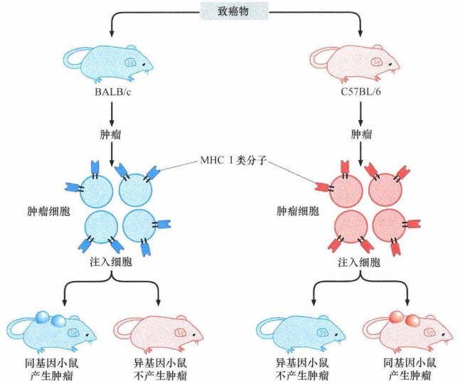
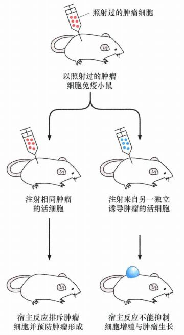
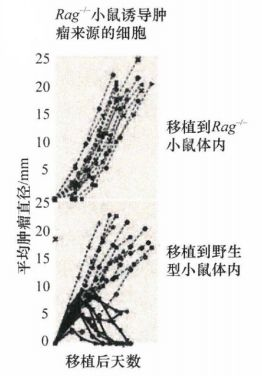

# 第十五章 《癌生物学》第十五章（2）  免疫监视理论

**往期回顾**

[《癌生物学》第十章（1） 肿瘤细胞无限增殖的两个障碍](http://mp.weixin.qq.com/s?__biz=Mzg4NjA5Mzg2Mw==&mid=2247487501&idx=1&sn=3923a4a34cbabaf58f5c49f5973e4149&chksm=cf9fb145f8e83853ba49d4d8e6512b681ff674bfdf4724ff3a519130d9f6173242dad0e80132&scene=21#wechat_redirect)

[《癌生物学》第十章（2） 端粒和端粒酶](http://mp.weixin.qq.com/s?__biz=Mzg4NjA5Mzg2Mw==&mid=2247487506&idx=1&sn=4e2df94146e3a9328b7ca74b03a573da&chksm=cf9fb15af8e8384c2bdcf218c35b9497ffd1f521e658084df49d4be5f9eed137d39211a67935&scene=21#wechat_redirect)

[《癌生物学》第十章（3） 端粒酶的双重角色](http://mp.weixin.qq.com/s?__biz=Mzg4NjA5Mzg2Mw==&mid=2247487507&idx=2&sn=2b23b04530bff885efd741fed554d46f&chksm=cf9fb15bf8e8384d1670f2d518fdc4aa87cd47a756936cca722f2c6b88df16c699570d0cc205&scene=21#wechat_redirect)

[《癌生物学》第十一章（1）  肿瘤多阶段发展](http://mp.weixin.qq.com/s?__biz=Mzg4NjA5Mzg2Mw==&mid=2247487819&idx=1&sn=9e5153efeab13f233efce6fcefd01d53&chksm=cf9fb003f8e83915e4fca96afb9676a896222551f89c72698dd51b2a159d2098acaf2db3c0f2&scene=21#wechat_redirect)

[《癌生物学》第十一章（2） 对进化论解释肿瘤发展的补充](http://mp.weixin.qq.com/s?__biz=Mzg4NjA5Mzg2Mw==&mid=2247487832&idx=1&sn=5e8fbe85d6c878d01fd5c8123597f738&chksm=cf9fb010f8e83906a15b3a4dde368c45a4878310af6d8ae7cea6ee854219ee36eabe1ca51ae4&scene=21#wechat_redirect)

[《癌生物学》第十一章（3）参与肿瘤发展的因素之炎症](http://mp.weixin.qq.com/s?__biz=Mzg4NjA5Mzg2Mw==&mid=2247487874&idx=1&sn=d1adb72c268af79d532a0ede13f52abe&chksm=cf9fb0caf8e839dcdbc8eb23ce9779053eb50f64e7589bab3116b6ee14fb10b048f51388ec44&scene=21#wechat_redirect)

[《癌生物学》第十二章（1）DNA损伤的预防](http://mp.weixin.qq.com/s?__biz=Mzg4NjA5Mzg2Mw==&mid=2247487949&idx=1&sn=107054f050f8b4d3404a6e371ddf3194&chksm=cf9fb085f8e839937724d4ada4c21deec6f12551160dd2933522d10f25fae38b9b8ac6f895a3&scene=21#wechat_redirect)

[《癌生物学》第十二章（2）基因组损伤的来源](http://mp.weixin.qq.com/s?__biz=Mzg4NjA5Mzg2Mw==&mid=2247487974&idx=1&sn=f78a30cafd41835b2d9b7b52e63a5399&chksm=cf9fb0aef8e839b820ab28b8f4857b6ed209ac34864b16068dc5fdb0c413a2a27b1fa9481ef1&scene=21#wechat_redirect)

[《癌生物学》第十二章（3）DNA修复缺陷引发的疾病](http://mp.weixin.qq.com/s?__biz=Mzg4NjA5Mzg2Mw==&mid=2247487974&idx=2&sn=274bb725f72e37dbc9653c58126a3b6a&chksm=cf9fb0aef8e839b8eab9358955de09d65d8a6fb27412a7c8f6eacf5b6b34752eb894c8f01eb1&scene=21#wechat_redirect)

[《癌生物学》第十二章（4）癌细胞核型的变化](http://mp.weixin.qq.com/s?__biz=Mzg4NjA5Mzg2Mw==&mid=2247487974&idx=3&sn=c7fabdb23bf2fb1b8d6cb1e8cf231992&chksm=cf9fb0aef8e839b81c81319a584355725e04bab654f99985457158592285553a78527035da9a&scene=21#wechat_redirect)

[《癌生物学》第十三章（1） 肿瘤发生类似伤口损伤愈合](http://mp.weixin.qq.com/s?__biz=Mzg4NjA5Mzg2Mw==&mid=2247487990&idx=2&sn=427192f2af09ea8a12bafb6467955c95&chksm=cf9fb0bef8e839a8a174cead45f0dfe45b154efdf3664b5a5c3c21fb245a1072ba0f06f59944&scene=21#wechat_redirect)

[《癌生物学》第十三章（2） 间质细胞可促进肿瘤](http://mp.weixin.qq.com/s?__biz=Mzg4NjA5Mzg2Mw==&mid=2247488046&idx=2&sn=0dab3432d2e285c01924c68f4207286d&chksm=cf9fb366f8e83a7038662351ee64dd8e0c0ec3c37d1d888bc962f95f3ce8b700c3dc07614ed2&scene=21#wechat_redirect)

[《癌生物学》第十三章（3） 血管生成与肿瘤](http://mp.weixin.qq.com/s?__biz=Mzg4NjA5Mzg2Mw==&mid=2247488050&idx=2&sn=71764e3ce5e022e275c9376f2cfcc725&chksm=cf9fb37af8e83a6caec618df9c4898312199abdd91650c851a65fdfd0c3926f1aa5c6feaf37c&scene=21#wechat_redirect)

[《癌生物学》第十四章（1）侵袭-转移级联反应](http://mp.weixin.qq.com/s?__biz=Mzg4NjA5Mzg2Mw==&mid=2247488369&idx=2&sn=71dba3c62869c6360198bb74f99218d7&chksm=cf9fb239f8e83b2f25630645fe0c0d33cd8021afaa68d6a6eb88c6366484eda0b2172bea97c7&scene=21#wechat_redirect)

[《癌生物学》第十四章（2）上皮间叶转化（上）](http://mp.weixin.qq.com/s?__biz=Mzg4NjA5Mzg2Mw==&mid=2247488371&idx=2&sn=c0b04cd92afc7580ac81d623e743141b&chksm=cf9fb23bf8e83b2d187cc5120c3dbf5d2f05d8f70164698e3b7a0643ccfc2e945541b7683d7b&scene=21#wechat_redirect)

[《癌生物学》第十四章（3）上皮间叶转化（下）](http://mp.weixin.qq.com/s?__biz=Mzg4NjA5Mzg2Mw==&mid=2247488373&idx=1&sn=f98cd93f4ac5f610dd8e0e31658bc634&chksm=cf9fb23df8e83b2b02b7814b197ee75b286ce2e2baebf1a3b21a69eb5f72de18c1c0b4ed89f7&scene=21#wechat_redirect)

[《癌生物学》第十四章（4）转移的亲组织性和骨转移实例](http://mp.weixin.qq.com/s?__biz=Mzg4NjA5Mzg2Mw==&mid=2247488373&idx=2&sn=b47aead2faa1fff7f0a89df205b2b86c&chksm=cf9fb23df8e83b2b109da61b2e5cd191c5f80eba8af9e60c716156c70bde68efda3c550b8e00&scene=21#wechat_redirect)

[《癌生物学》第十五章（1） 免疫系统概述](http://mp.weixin.qq.com/s?__biz=Mzg4NjA5Mzg2Mw==&mid=2247488461&idx=2&sn=514e0619a8cb95c58caa2ddda4a111c8&chksm=cf9fb285f8e83b932e18cbfd058e2a70cbfb74179f508497a476608f9f4e068c8cf3b003e336&scene=21#wechat_redirect)

“ 上一讲我们主要学习了：人体的免疫应答可以分为体液免疫与细胞免疫。 体液免疫应答主要通过 MHC II类分子特异性识别T H 细胞， T H 细胞激活特异性的 B细胞，后者激活后分泌抗体，抗体分子包被中和已被释放到细胞外、包括循环系统中的病毒颗粒；而细胞免疫应答通过T H 细胞活化 CTL细胞，后者经MHC I类分子的吸引，抵达并杀伤病毒感染的细胞。

今天，我们讨论免疫监视的相关知识，了解免疫系统是以何种方式区分肿瘤细胞与正常细胞、并对其产生杀伤效应的呢？ ”

1、 免疫监视学说的产生和质疑

20世纪50年代，有研究者将荷瘤小鼠的肿瘤移植给其他小鼠，发现肿瘤很快被破坏掉，而且有确凿的证据显示是活跃的宿主免疫系统所为。但不久就清楚了，这种破坏与肿瘤细胞的恶性本质无关，而是不同品系小鼠在细胞膜上表达的由独特遗传模板编码的主要组织相容性复合物（MHC）导致的同种异体排斥反应的结果。

图 15-2-1： 同系小鼠和 MHC可变性

尽管如此，早期的研究工作仍然揭示了重要的现象：除了清除细菌和各种各样的病毒， **免疫系统也能破坏外源的哺乳动物细胞，或者说很可能破坏一些异常的细胞** 。另外，癌细胞不能从一个个体传播到另一个个体 。

如上，假如免疫系统真的能抑制肿瘤的出现，那么免疫功能低下的动物其肿瘤发生率将增加。

然而， 20世纪70年代的研究显示，与同窝出生的野生型正常小鼠相比，裸鼠（缺乏有功能的胸腺——T 细胞发育成熟的器官）的自发肿瘤和化学诱导肿瘤的发生率并没有升高。免疫监视理论的研究经历了巨大的挫折，人们不再相信它，并且使其退出了癌症研究的主要领域近20年。

但这种对免疫监视理论的否定是不成熟的 ！ 裸鼠虽然缺乏正常 T细胞 ， 但完整地保留了免疫系统的其他成分。有些类型的 T细胞可以在胸腺外发育 ，且 裸鼠体内大量存在两种非常重要的免疫细胞：自然杀伤（ NK)细胞和巨噬细胞。在20世纪80年代，研究人员积累的资料证实，NK细胞在识别和杀伤包括肿瘤细胞在内的异常细胞中发挥非常重要的作用，所以从裸鼠的低肿瘤发生率中得到的教训并没有太大的价值。

在小鼠模型中某些化学诱导的肿瘤具有免疫原性、并可被免疫系统识别和清除的证据也在积累。例如，在一批实验中，来自 3-甲基胆蒽（3-MC) 诱导的肿瘤细胞，经照射灭活后注射到小鼠体内，照射的目的是阻止细胞在小鼠体内增殖。随后小鼠被第一次注射相同的活的肿瘤细胞，或者来自第二种由3-MC诱导的肿瘤细胞；结果显示注射来自同样肿瘤的活的肿瘤细胞没有生长，而 由3-MC诱导的另一种肿瘤细胞则继续生长并形成一个新的肿瘤。这表明首次接种照射后的死细胞，使小鼠对后来接种的同一肿瘤来源的活细胞具有了免疫力。

2 、 免疫监视理论的复苏

20世纪90年代中期，研究者可以利用新的研究技术对小鼠的基因进行改造，从而产生新的小鼠品系，应用这项技术能创造缺失一个或多个在免疫系统中起重要功能性作用基因的小鼠。在此基础上开展的一系列研究为长期处于不受重视的免疫监视理论赋予了新的生机。

IFN-γ受体表达缺陷的小鼠是通过在生殖细胞中靶向灭活IFN-γ受体基因而产生的。IFN- γ 是一种可以扩散的细胞因子，它在细胞间传递信，并通过结合和激活其同源细胞表面受体诱导细胞反应。目前尚未发现免疫系统外的细胞可以产生IFN- γ ，因此敲除小鼠基因组中的IFN-γ受体基因后的任何变化，都能归因于免疫细胞之间及免疫细胞与身体其他细胞相互作用缺陷。结果，IFN- γ 受体的基因敲除小鼠，对化学致癌物3-MC诱导肿瘤的敏感性提高了10 - 20倍。

图 15-2-2： 用灭活的肿瘤细胞免疫小鼠

在另 一 系列实验中，让肿瘤细胞表达功能区缺陷的 IFN- γ 受体，使之对各种免疫细胞释放的IFN- γ 不能产生反应，把这些细胞注入野生型的小鼠体内后，发现这些携带缺陷受体的肿瘤细胞比携带正常受体的肿瘤细胞具有更强的致瘤性。这提示肿瘤细胞表达的IFN- γ 受体常常能使它们对免疫细胞释放的IFN- γ 起反应，阻止或延缓由这些细胞形成的肿瘤的生长。

IFN- γ 这种作用至少部分与NK细胞的作用有关：一旦NK细胞将癌细胞视为杀灭的靶细胞，它们将在靶细胞附近释放IFN- γ 。IFN- γ 帮助NK细胞募集其他类型的免疫细胞靶向杀伤癌细胞，从而扩大免疫系统的反应。在这些免疫应答细胞中，巨噬细胞不仅可以直接杀伤癌细胞，还可以作为专职抗原呈递细胞(APC)加工和呈递来自于这些癌细胞的抗原分子。同时，IFN- γ 可以刺激癌细胞，使其细胞表面MHC I类分子的表达升高，后者携带的寡肽抗原能进一步激发高度特异性的获得性免疫反应。

支持免疫监视理论在肿瘤预防中重要性的最令人信服的证据来自对 RAG-2 -/- 基因 缺陷小鼠（缺乏 T细胞、B细胞和一种NK细胞的亚类NKT细胞，获得性免疫应答严重缺陷）或野生型小鼠3-MC诱发肉瘤的详尽研究。当来源于这两组小鼠的肿瘤细胞被移植入新的RAG-2 -/- 缺陷的宿主时，两种来源的肿瘤细胞在新宿主形成肿瘤的效率都很高。然而，当肿瘤细胞被移植入同基因的野生型 （免疫功能健全的）宿主时，观察到明显不同的结果。预先已在野生型小鼠中诱发的 17个肿瘤细胞都成功地在新宿主中生成肿瘤；而预先由3-MC在RAG-2 -/- 诱发的 20个肿瘤细胞中有8株细胞不能形成肿瘤，被这些野生型宿主的免疫系统排斥。

图 15-2-3： 免疫功能在抗肿瘤免疫应答中的作用：当 R A g-2 -/- 小鼠诱发的肿瘤被移植回 R A g-2 -/- 小鼠时，接受移植的所有 Rag-2 -/- 小鼠体内均形成肿瘤（上） ; 而当 R A g-2 -/- 小鼠诱发的肿瘤被移植到野生型小鼠体内时，在 20个接受移植的小鼠中有8个没形成肿瘤（下）

这些观察表明，小鼠的免疫系统在识别肿瘤起源和它们表达抗原的中起到积极作用。免疫系统对肿瘤表型的积极干预被称为免疫编辑，免疫编辑可以看作达尔文自然选择学说的一种类型，在这里选择压力来自于免疫系统对新生肿瘤的直接攻击。

事实上，肿瘤还能进入第三种模式：被免疫系统一直监测（不被消灭），在人体内惰性生长形成无明显症状的小肿瘤。这类肿瘤细胞具有抗原性，可被免疫细胞如细胞毒性 T淋巴细胞清除，清除速率与肿瘤细胞产生速率相同，从而使肿瘤进入一个长期、表面稳定的平衡状态。这种微妙的平衡可被至少两种方式破坏：一种是肿瘤学会抑制其更强免疫原性抗原的表达，从而使其逃避免疫识别和清除，使具有弱抗原性肿瘤细胞突然暴发式生长。另一种是获得性免疫系统的某些组成部分被损伤或破坏，免疫介导的肿瘤抑制减轻，使处于休眠状态的肿瘤得到进展性生长。

3 、 人类免疫系统防御肿瘤

20世纪90年代 以来，由 观察报告积累的证据清楚地显示人类免疫系统在抵御癌症方面发挥非常重要的作用 ：

在美国进行的研究发现，移植患者发生癌症的风险提高了 3 - 5倍，肝移植的患者在移植后5年内通常会发生新的肿瘤。但由病毒感染引起的肿瘤在免疫功能受损的个体中发病率大大增加 ， 首当其冲的是卡波氏肉瘤（由人疱疹病毒 -8，HHV-8感染引起），其在AIDS患者中的发病率是普通人群的3000倍以上。多种抑制HIV复制药物的联合应用，使得大部分HIV感染的患者免疫功能得以恢复，卡波氏肉瘤的发生率降低了40倍。这说明 **免疫系统保护我们对抗病毒诱导的恶变** 。

事实上，成人器官移植的受者与普通人群相比，黑色素瘤的发病率升高了 2-4倍 ， 除卡波氏肉瘤外 的 其他肉瘤发病率也高于普通人群 3倍；接受心脏移植的人群肺癌的发病风险升高了25倍 ； 结肠、肺、膀胱和肾及内分泌系统肿瘤的发病率都升高了。 这说明， **免疫系统也能防御非病毒起源的肿瘤** 。

病毒抗原对机体来讲是外源物，会引起多种体液和细胞介导的免疫反应。在非病毒引起的肿瘤中，肿瘤浸润淋巴细胞（ TIL)被肿瘤细胞招募到肿瘤块中促进肿瘤的生长，而这些TIL也许是免疫系统为了消灭癌细胞而专门被派遣到这里的。

对一组卵巢癌患者的观察为 TIL的抗肿瘤作用提供了生动的实例：将卵巢癌患者的临床病程与他们肿瘤组织中存在或缺乏充足数量的肿瘤浸润淋巴细胞的进行相关分析，结果表明在经历了外科切除瘤组织并随后进行化疗的患者中，肿瘤组织有大量TIL浸润的患者5年生存率为74%，而癌组织无此现象的患者5年生存率只有12%。

4 、 免疫系统可区分正常组织和癌变组织

在各种肿瘤细胞表达的大约 2000种不同的蛋白质（和它们的异构体）中，只有一小部分蛋白质仅表达于肿瘤细胞， 且 肿瘤细胞表达的大多数蛋白质在结构和表达水平都是正常的。 那么， 对来源于机体自身组织的癌细胞，免疫系统能够将其识别为外来物吗？

Ras癌蛋白是肿瘤新抗原中的一个典型例子，它是正常细胞表达的4种亚型的Ras蛋白第12、13或者61位氨基酸残基发生 氨基酸置换 后产生的。 Ras癌蛋白中已经改变的氨基酸残基与其相邻的氨基酸残基组成的氨基酸序列可能构成诱发免疫应答的寡肽抗原。同样，由p53抑癌基因编码的氨基酸结构可以因为众多的 **等位基因突变而使翻译的蛋白质发生改变** ，具有免疫原性。

另一个产生肿瘤特异蛋白的例子来自于多种类型的染色体易位使原来无关联的基因一起编码特定的 融合蛋白 。这种染色体易位多见于血液系统恶性肿瘤，如在慢性髓细胞白血病 (CML)细胞中发现的Bcr-AbL融合蛋白。融合蛋白的大多数氨基酸序列与正常细胞中发现的两种母本蛋白的氨基酸序列相同， 但 这两种 **蛋白** **融合** **组成了全新的氨基酸序列** ，能被免疫系统识别为外源物质，因而具有免疫原性。

机体免疫系统通过各种不同的机制对某些正常的细胞蛋白质产生免疫耐受。然而，如果这些 **蛋白质在肿瘤细胞中异常高水平表达** ，那么免疫系统就可以识别这些肿瘤细胞。例如，端粒酶的催化亚单位 hTERT，它在正常细胞的表达水平较低，但在85%~90%的人类肿瘤细胞中高水平表达。同样，许多乳腺癌细胞表达的HER2/Neu受体比正常上皮组织高10 - 20倍。

此外，人类的肿瘤细胞经常表达一些在 **正常成人组织中从未发现过的胚胎蛋白** ，这些胚胎蛋白可能成为有效的抗原物质 。

综上，免疫系统可以对肿瘤细胞异位（非天然解剖位置）表达的蛋白质，或发育阶段通常不能遇到的，或异常高水平表达的蛋白质发起免疫攻击。

参考书目： 《The Biology of Cancer》（Second Edition）  R.A.Weinberg  著，詹启敏 等  译

编辑：周健 张月明 游丹铭

校审：张健 罗鹏

