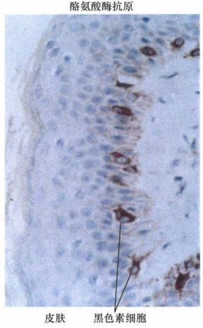
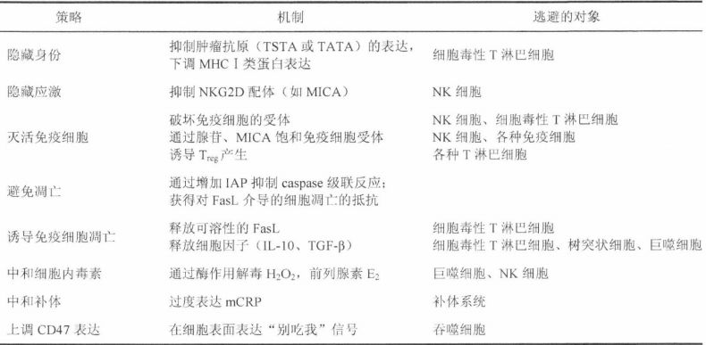
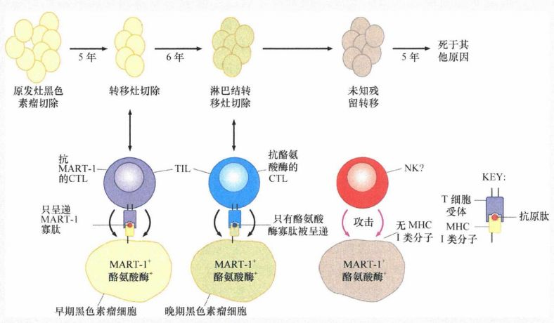
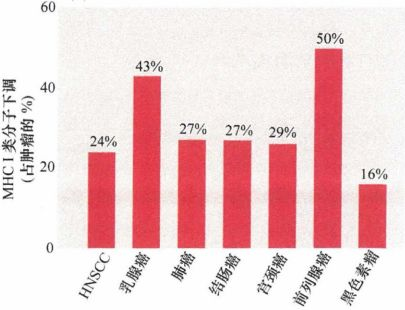
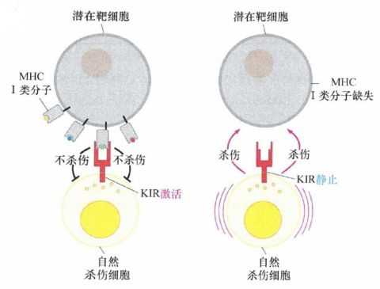
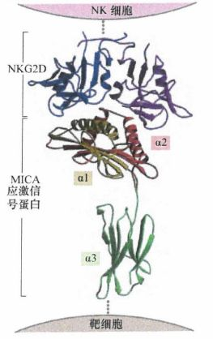
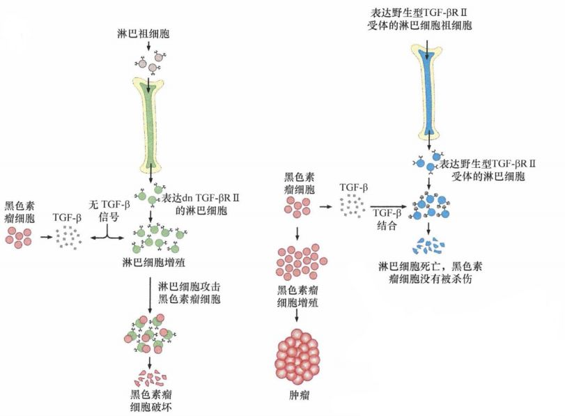
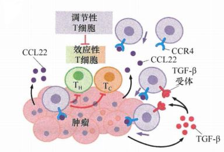

# 第十五章 《癌生物学》第十五章（3） 肿瘤细胞与免疫系统的斗争

**往期回顾**

[《癌生物学》第十一章（1）  肿瘤多阶段发展](http://mp.weixin.qq.com/s?__biz=Mzg4NjA5Mzg2Mw==&mid=2247487819&idx=1&sn=9e5153efeab13f233efce6fcefd01d53&chksm=cf9fb003f8e83915e4fca96afb9676a896222551f89c72698dd51b2a159d2098acaf2db3c0f2&scene=21#wechat_redirect)

[《癌生物学》第十一章（2） 对进化论解释肿瘤发展的补充](http://mp.weixin.qq.com/s?__biz=Mzg4NjA5Mzg2Mw==&mid=2247487832&idx=1&sn=5e8fbe85d6c878d01fd5c8123597f738&chksm=cf9fb010f8e83906a15b3a4dde368c45a4878310af6d8ae7cea6ee854219ee36eabe1ca51ae4&scene=21#wechat_redirect)

[《癌生物学》第十一章（3）参与肿瘤发展的因素之炎症](http://mp.weixin.qq.com/s?__biz=Mzg4NjA5Mzg2Mw==&mid=2247487874&idx=1&sn=d1adb72c268af79d532a0ede13f52abe&chksm=cf9fb0caf8e839dcdbc8eb23ce9779053eb50f64e7589bab3116b6ee14fb10b048f51388ec44&scene=21#wechat_redirect)

[《癌生物学》第十二章（1）DNA损伤的预防](http://mp.weixin.qq.com/s?__biz=Mzg4NjA5Mzg2Mw==&mid=2247487949&idx=1&sn=107054f050f8b4d3404a6e371ddf3194&chksm=cf9fb085f8e839937724d4ada4c21deec6f12551160dd2933522d10f25fae38b9b8ac6f895a3&scene=21#wechat_redirect)

[《癌生物学》第十二章（2）基因组损伤的来源](http://mp.weixin.qq.com/s?__biz=Mzg4NjA5Mzg2Mw==&mid=2247487974&idx=1&sn=f78a30cafd41835b2d9b7b52e63a5399&chksm=cf9fb0aef8e839b820ab28b8f4857b6ed209ac34864b16068dc5fdb0c413a2a27b1fa9481ef1&scene=21#wechat_redirect)

[《癌生物学》第十二章（3）DNA修复缺陷引发的疾病](http://mp.weixin.qq.com/s?__biz=Mzg4NjA5Mzg2Mw==&mid=2247487974&idx=2&sn=274bb725f72e37dbc9653c58126a3b6a&chksm=cf9fb0aef8e839b8eab9358955de09d65d8a6fb27412a7c8f6eacf5b6b34752eb894c8f01eb1&scene=21#wechat_redirect)

[《癌生物学》第十二章（4）癌细胞核型的变化](http://mp.weixin.qq.com/s?__biz=Mzg4NjA5Mzg2Mw==&mid=2247487974&idx=3&sn=c7fabdb23bf2fb1b8d6cb1e8cf231992&chksm=cf9fb0aef8e839b81c81319a584355725e04bab654f99985457158592285553a78527035da9a&scene=21#wechat_redirect)

[《癌生物学》第十三章（1） 肿瘤发生类似伤口损伤愈合](http://mp.weixin.qq.com/s?__biz=Mzg4NjA5Mzg2Mw==&mid=2247487990&idx=2&sn=427192f2af09ea8a12bafb6467955c95&chksm=cf9fb0bef8e839a8a174cead45f0dfe45b154efdf3664b5a5c3c21fb245a1072ba0f06f59944&scene=21#wechat_redirect)

[《癌生物学》第十三章（2） 间质细胞可促进肿瘤](http://mp.weixin.qq.com/s?__biz=Mzg4NjA5Mzg2Mw==&mid=2247488046&idx=2&sn=0dab3432d2e285c01924c68f4207286d&chksm=cf9fb366f8e83a7038662351ee64dd8e0c0ec3c37d1d888bc962f95f3ce8b700c3dc07614ed2&scene=21#wechat_redirect)

[《癌生物学》第十三章（3） 血管生成与肿瘤](http://mp.weixin.qq.com/s?__biz=Mzg4NjA5Mzg2Mw==&mid=2247488050&idx=2&sn=71764e3ce5e022e275c9376f2cfcc725&chksm=cf9fb37af8e83a6caec618df9c4898312199abdd91650c851a65fdfd0c3926f1aa5c6feaf37c&scene=21#wechat_redirect)

[《癌生物学》第十四章（1）侵袭-转移级联反应](http://mp.weixin.qq.com/s?__biz=Mzg4NjA5Mzg2Mw==&mid=2247488369&idx=2&sn=71dba3c62869c6360198bb74f99218d7&chksm=cf9fb239f8e83b2f25630645fe0c0d33cd8021afaa68d6a6eb88c6366484eda0b2172bea97c7&scene=21#wechat_redirect)

[《癌生物学》第十四章（2）上皮间叶转化（上）](http://mp.weixin.qq.com/s?__biz=Mzg4NjA5Mzg2Mw==&mid=2247488371&idx=2&sn=c0b04cd92afc7580ac81d623e743141b&chksm=cf9fb23bf8e83b2d187cc5120c3dbf5d2f05d8f70164698e3b7a0643ccfc2e945541b7683d7b&scene=21#wechat_redirect)

[《癌生物学》第十四章（3）上皮间叶转化（下）](http://mp.weixin.qq.com/s?__biz=Mzg4NjA5Mzg2Mw==&mid=2247488373&idx=1&sn=f98cd93f4ac5f610dd8e0e31658bc634&chksm=cf9fb23df8e83b2b02b7814b197ee75b286ce2e2baebf1a3b21a69eb5f72de18c1c0b4ed89f7&scene=21#wechat_redirect)

[《癌生物学》第十四章（4）转移的亲组织性和骨转移实例](http://mp.weixin.qq.com/s?__biz=Mzg4NjA5Mzg2Mw==&mid=2247488373&idx=2&sn=b47aead2faa1fff7f0a89df205b2b86c&chksm=cf9fb23df8e83b2b109da61b2e5cd191c5f80eba8af9e60c716156c70bde68efda3c550b8e00&scene=21#wechat_redirect)

[《癌生物学》第十五章（1） 免疫系统概述](http://mp.weixin.qq.com/s?__biz=Mzg4NjA5Mzg2Mw==&mid=2247488461&idx=2&sn=514e0619a8cb95c58caa2ddda4a111c8&chksm=cf9fb285f8e83b932e18cbfd058e2a70cbfb74179f508497a476608f9f4e068c8cf3b003e336&scene=21#wechat_redirect)

[《癌生物学》第十五章（2）  免疫监视理论](http://mp.weixin.qq.com/s?__biz=Mzg4NjA5Mzg2Mw==&mid=2247488476&idx=2&sn=eade09268152cd3e553da128cb622928&chksm=cf9fb294f8e83b82439d9b72550529bd94cfa1cc7dd447f6e34763ab86caf5dac649b9e5d879&scene=21#wechat_redirect)

“上两讲中，我们主要讨论了免疫系统的体液免疫与细胞免疫这两种防御策略、免疫监视功能，及免疫系统在抗肿瘤方面的重要作用。 今天，我们具体讨论人体免疫系统与肿瘤抗原、肿瘤细胞间的斗争。”

1、 肿瘤抗原诱导免疫应答

肿瘤免疫学家将肿瘤细胞表达的特异性抗原分为两大类： **肿瘤特异性移植抗原 (TSTA) 和肿瘤相关移植抗原（TATA）** 。

TSTA是只在某种肿瘤或者某一类肿瘤表达、而不在人体正常组织表达的蛋白质或者寡肽。肿瘤特异性移植抗原可以由病毒基因组或者在肿瘤进展过程中出现的突变体细胞的等位基因（例如，突变的ras、p53或bcr-abl基因）编码。由于肿瘤特异性移植抗原结构异常，它们不太可能在免疫系统的正常发育过程中诱导免疫耐受。相反，TATA的表达不是仅限于恶性组织，也存在于正常组织或细胞。TATA是一大类正常蛋白分子，这些蛋白分子由于各种原因未能诱导出完全免疫耐受。当这些蛋白分子在肿瘤中表达时，会产生免疫反应答。

肿瘤特异性移植抗原（ TSTA)和肿瘤相关移植抗原(TATA)这两种类型抗原的存在可以通过肿瘤移植实验得到证实。

例如，化学致癌物 3-甲基胆蒽诱导近交系小鼠产生的肉瘤，可以移植给另外一只同系小鼠。待这些肿瘤细胞在小鼠体内增殖几周后经手术切除，再重新植回给这只术后的小鼠，则会产生抗肿瘤的特异性排斥反应。然而，如果把来源于另一只经3-甲基胆蒽诱导肉瘤的小鼠肿瘤细胞移植给这只小鼠，肿瘤则会生长。这个现象表明，在小同小鼠体内3-甲基胆蒽诱导出的两种肉瘤抗原性存在差别 ，第一种肉瘤细胞携带有一种或者多种特异的抗原决定基，可以诱导小鼠产生排斥移植相同肉瘤细胞的免疫应答。

根据达尔文的自然选择规律，能够被实验者研究的是那些可以长期生存的低表达肿瘤特异性移植抗原的肿瘤细胞和子代肿瘤细胞（因为机体会试图清除高表达的强抗原性的肿瘤细胞），这就使通过生化的方法分离和鉴定肿瘤特异性移植抗原蛋白变得更加困难。然而近年来，采用基因克隆技术已经克隆出一些编码 3-甲基胆蒽诱导产生的肿瘤特异性移植抗原的基因。

克隆策略之一是将作为免疫识别靶点的与 3-甲基胆蒽转化细胞表面MHC I类分子结合的寡肽洗脱、纯化、测定氨基酸序列，然后预测出其相应的编码基因的核苷酸序列，最后克隆出编码基因。通过分析从肿瘤细胞克隆出的肿瘤特异性移植抗原的基因编码序列，发现所有这些基因是经由编码各种细胞蛋白的正常基因相对应的等位基因发生点突变而产生，而这些正常蛋白质并未明显涉及细胞恶性转变的任何路径。

**化学物质诱导产生的 TSTA与肿瘤病毒感染诱导产生的TSTA的生物学行为差异显著** 。例如， SV40病毒可以诱导小鼠产生肉瘤。将荷瘤鼠的肉瘤手术切除后，小鼠就像被免疫了，它们对随后接种的由SV40病毒诱导的肉瘤或其他肿瘤的细胞均产生排斥反应。在这种情况下，确实产生了交叉免疫，参与交叉反应的TSTA是病毒编码的大T癌蛋白，它在所有的SV40病毒转化细胞中都是高水平表达的。这与3-MC诱导的肿瘤不同，后者每个肿瘤都表达自身独特的TSTA或一套TSTA。

2 、 肿瘤相关抗原诱导抗肿瘤免疫

肿瘤相关移植抗原 (TATA)是由于各种原因没有诱导出机体免疫耐受的正常细胞蛋白，当这些正常蛋白质在肿瘤细胞表达时，它们诱导出可以检测到的免疫应答，包括体液和细胞免疫应答。

黑色素瘤细胞可能过度表达源自正常的黑色素细胞的前体细胞低水平表达的某些蛋白质，这些家系特异性的蛋白质有时称为分化抗原。黑色素瘤细胞表达的分化抗原通常诱导机体免疫系统产生很强的免疫应答，伴随而来的还有一种非常特殊的自身免疫病 —— 白癜风，即有些黑色素瘤患者出现大面积的皮肤色素脱失。这种现象是机体针对黑色素瘤的一种特异性免疫应答产生的临床表现。

图 15-3-1： 作为肿瘤相关抗原在黑色素瘤细胞中表达的正常蛋白：应用单克隆抗体在皮肤的黑色素细胞中可检测到酪氨酸酶，它由黑色素瘤细胞表达，使黑色素瘤细胞具有免疫原性并成为细胞毒性淋巴细胞杀伤的靶子

在这些黑色素瘤患者中，由黑色素瘤细胞表达的 TATA诱发的免疫应答可以产生一种副反应，即 **攻击同样表达这些抗原的正常黑色素细胞** 。人黑色素瘤细胞的抗原性可能来源于它们表达的其他主要 TATA亚型，即癌胚抗原（指的是曾在胚胎形成过程中表达并被肿瘤组织再次表达的一类抗原）。 值得注意的是，伴有白癜风的黑色素瘤患者相比不伴有者的生存时间更长，这表明至少在一段时间内这些患者的免疫系统可以有效地控制黑色素瘤。

黑色素瘤蛋白诱导的免疫耐受很容易被克服（打破），使科学家想到了一种简单有效的抗肿瘤治疗策略，即将这些抗原视为外源微生物的侵袭产物。这种理念已使科学家尝试应用一种或多种这类抗原蛋白组成疫苗免疫小鼠或人。例如，一些黑色素瘤细胞会上百倍过度表达某种正常的转铁蛋白受体，向小鼠注射这种纯化的鼠转铁蛋白受体后，可以诱导小鼠产生针对这种蛋白的免疫应答。这提示通过暴露高水平的这种蛋白，很容易打破小鼠体内针对这种蛋白的任何免疫耐受。经过鼠转铁蛋白免疫的小鼠可以排斥随后移植的任何高表达该受体的黑色素瘤。

3 、 肿瘤细胞通过免疫逃逸摆脱免疫监视

免疫耐受使免疫系统对多种类型癌细胞表达的抗原视而不见，同时，在肿瘤患者的血液中可以检测到结合在肿瘤细胞表面抗原上的相对较高滴度（浓度）的抗体。这些观察表明，尽管机体存在免疫耐受，但人类的免疫系统可以针对许多类型（也许是所有类型）的肿瘤细胞发起攻击。

尽管这样，免疫防御机制仍然无法有效地阻断许多肿瘤的进展，我们不禁会问：为什么人类免疫系统动用其强大 的免疫细胞和各种免疫手段，却在阻断肿瘤进展方面屡战屡败呢？

一种可能就是某些具有免疫原性的肿瘤，最初可能遭受免疫系统的严重攻击，但最终找到了逃避清除的途径 —— **免疫逃逸** ，这些肿瘤细胞随后可以旺盛生长，以至于形成体积较大、威胁患者生命的肿瘤。这种解释可以很好地描述许多人类肿瘤的生长过程：正是由于人类肿瘤细胞不断发生改变才有可能逃避免疫系统的攻击。

表 15-3-1： 肿瘤细胞的免疫逃逸策略

最常见的免疫逃逸策略是 **肿瘤细胞停止表达已经吸引免疫系统注意的 TATA或TSTA** 。这些抗原中的大部分并不参与细胞恶性转化过程，它们是组织特异性分化抗原，只是肿瘤组织高表达而已，因此肿瘤细胞经常通过启动子甲基化抑制这些抗原的表达而不损伤自身持续的存活和增殖，这些抗原表达缺失的细胞最终成为肿瘤组织中的主要细胞。

图 15-3-2 ： 免疫系统动态适应变化的肿瘤细胞抗原呈递：免疫系统可以与肿瘤细胞同时进化，产生具有新的特异性的 CTL, 以适应攻击黑色素瘤细胞的需要

在某些 TATA或TSTA的表达对肿瘤的生长不可或缺而不能下调的肿瘤中，肿瘤细胞需要采取其他策略来逃避免疫系统的杀伤。其中一个重要且普遍的策略就是 **通过抑制 MHC I类基因的转录** **下调 MHC I类分子的表达** 。另外，肿瘤细胞也可以采用转录后机制 **抑制 MHC I类分子** **迁移至细胞表面** ，从而抑制抗原呈递。

图 15-3-3 ： MHC I类分子在多数肿瘤中存在高比例的表达下调

4 、 肿瘤细胞逃避 NK细胞和巨噬细胞介导的杀伤

NK细胞表面表达识别潜在靶细胞MHC I类分子的受体，靶细胞的MHC I类分子与NK细胞表面的受体结合后，NK细胞接收抑制性信号，不会对MHC I类分子阳性细胞攻击。相反， 靶细胞表面 MHC I类分子表达缺失 时 NK细胞 会对其靶向杀伤 。这就解释了为什么有些 **肿瘤细胞只选择性地抑制正常情况下机体细胞持续表达的 6种MHC I类分子中的一种** ， **这种抑制既可阻断某种肿瘤抗原的呈递使肿瘤细胞逃避免疫监视，又不会引起 NK细胞的攻击** 。

图 15-3-4 ：肿瘤细胞逃避 NK细胞杀伤： NK细胞（黄）表达识别潜在靶细胞（灰）表面MHC I类分子的杀伤细胞抑制性受体(KIR, 红）。当发生识别时，KIR传递的抑制性信号阻止NK 细胞针对靶细胞的杀伤（左）；当缺乏识别时，NK 细胞启动针对靶细胞的杀伤（右）

NK细胞与肿瘤细胞间还有一种固有的相互作用。肿瘤细胞常表达某种NKG2D活化型配体，NK细胞表面针对这些蛋白表达的受体称为NKG2D ， NKG2D受体与NKG2D活化型配体 结合后，会诱导 NK细胞迅速杀伤表达这些配体的靶细胞。 这迫使 **肿瘤细胞** **为了逃避 NK细胞的攻击而下调** **NKG2D** **配体的表达** ，最终产生强劲增长的肿瘤。此外，许多肿瘤细胞通过另一种策略使 NKG2D信号通道失活：它们 **将** **NKG2D配体** **分泌到肿瘤细胞周围的基质中，** **作为** **诱饵配体结合 NKG2D受体，导致这些受体的内吞和降解** ，使免疫细胞对肿瘤细胞表面的 NKG2D配体 无能为力。

图 15-3-5 ： NK细胞 的 NKG2D受体与靶细胞的NKG2D配体结合，介导NK细胞杀伤靶细胞

不同于调控 NK细胞对肿瘤的攻击，另外两种由肿瘤细胞表达的蛋白为邻近巨噬细胞提供了相互制衡的信号 ：一种 **钙网蛋白 (CRT)代表“吃我”的信号** ，导致肿瘤细胞被巨噬细胞内吞；另一种 **CD47蛋白代表** **“别吃我”的信号** ，帮助肿瘤细胞避开巨噬细胞的吞噬作用。

在特定典型样本中，还未变成侵袭性的人原发乳腺癌细胞 CD47表达几乎少到没有，但来自高度恶性的乳腺瘤的循环肿瘤细胞显示高水平的该蛋白，从而保护自身不被巨噬细胞攻击。肿瘤细胞高水平表达CD47启发了一种有趣的治疗策略：使用单克隆抗体结合和阻隔细胞表面的CD47，剥夺肿瘤细胞对抗巨噬细胞攻击的防御能力 。

5 、 肿瘤细胞攻击免疫细胞

淋巴细胞运用表面的 Fas死亡受体的配体（FasL）分子结合并激活在机体内其他细胞的Fas死亡受体，FasL配体与死亡受体结合激活非固有的凋亡通路。然而，许多种 **肿瘤细胞通过产生和释放可溶性 FasL，扭转FasL-Fas系统作用的方向** 。这种 FasL对肿瘤细胞没有影响，因为肿瘤细胞已经对其作用变得耐受了。但是，一些研究表明这一配体能激活在几种淋巴细胞上表达的Fas死亡受体，诱导它们的死亡。通过对围攻的免疫细胞发起这样的反攻，肿瘤细胞使自身处于安全地带，再一次减小被其杀伤的概率。

此外，许多类型的人类 **肿瘤细胞释放 TGF-β或白介素-10（IL-10)** 。这两种蛋白均能有效地抑制免疫功能，在某些情况下， TGF-β还能诱导免疫系统中两种关键的抗原呈递细胞树突状细胞和巨噬细胞发生凋亡。

一组实验说明了 TGF-β的免疫抑制能力 ： 一组 10只小鼠均被注入一种可以分泌高水平TGF-β的小鼠黑色素瘤细胞，所有的小鼠均在45天内死于肿瘤；另一组向小鼠的骨髓中移植经过基因修饰的造血干细胞，它们表达一种显性负效应(dn)的TGF-β II受体（只有能封闭正常受体的功能），使小鼠的淋巴细胞第一次对TGF-β介导的杀伤产生耐受。当相同的黑色素瘤细胞系注入这组小鼠后，10只中的7只在45天后仍然存活。

图 15-3-6： TGF-β在免疫反应中的作用：将表达显性负效应的TGF-β II受体(上）淋巴细胞的祖细胞注入小鼠的 骨髓中，形成分化的淋巴细胞（绿），对 TGF-β的杀伤作用没有反应（左）；如果将黑色素瘤细胞（粉红，左）注入一个携带有这种淋巴细胞的小鼠中，尽管这些黑色素瘤细胞分泌大量的TGF-β（浅褐色 ，四边形），但淋巴细胞可旺盛生长并且杀灭这些黑色素瘤细胞。相反，当相同的黑色素瘤细胞导入一个移植了表达野生型 TGF-β II 受体（右）淋巴细胞祖细胞的宿主小鼠时，黑色素瘤细胞释放的TGF-β引起表达正常功能TGF-β受体的淋巴细胞（蓝）进入凋亡（下）

这些实验描绘了一种新型抗肿瘤疗法的轮廓，即将肿瘤患者的骨髓细胞修饰成对 TGF-β介导的凋亡产生抵抗，使其高效地攻击释放TGF-β的人类肿瘤。不幸的是，一旦免疫细胞对TGF-β失去应答能力，它们常常会对全身的组织发动灾难性的自身免疫攻击，使机体比患有肿瘤性疾病时更加衰弱和更快死亡。

6 、 肿瘤细胞吸引 T regs 细胞以阻挡其他淋巴细胞的攻击

众多观察表明，调节性 T细胞在影响抗肿瘤免疫中起着重要的作用。 在正常的个体中，调节性 T细胞仅仅占CD4 + 淋巴细胞群的 5%-10%；但在肿瘤患者体内，这 一数字可以升高 25%-30%。

肿瘤释放趋化因子 CCL22以募集调节性T细胞，此外，TGF-β也被认为在胸腺和外周组织中均能帮助诱导其他类型的T细胞反向分化成T regs 。 **肿瘤细胞募集调节性 T细胞后，既可以抑制辅助性T细胞的作用，也能直接抑制甚至杀伤与调节性T细胞识别相同抗原的细胞毒性T淋巴细胞和辅助性T淋巴细胞** 。

图 15-3-7： 调节性 T细胞和肿瘤免疫逃逸：肿瘤细胞（粉）释放CCL22趋化因子（紫，圆点），结合在调节性T细胞表达的CCR4 趋化因子受体（蓝色）上，吸引它们进入肿瘤。Tregs 一旦被募集，就可抑制 CD4 + 辅助性 T淋巴细胞（浅绿）和CD8 + 细胞毒性淋巴细胞（浅橙）

调节性 T细胞的发现，使肿瘤浸润淋巴细胞（TIL）所起的作用变得更加复杂。TIL被归类于细胞毒性T淋巴细胞，积极参与清除它们周围的肿瘤细。但是，如果调节性T细胞在一些肿瘤的TIL构成中所占比例增大，那么这些肿瘤中存在的TIL数量的意义就不得而知了。这意味着对 **细胞毒性 T淋巴细胞和调节性T细胞相对比例的评估，有利于理解肿瘤与宿主细胞免疫反应相互作用的真正动态变化** 。

Treg 细胞和 NK细胞通常在调节肿瘤发展中产生相反的作用，这也提示了 **获得性免疫系统（由 T** **reg** **细胞控制）和固有免疫系统（以 NK细胞为代表）** **的** **互相制衡决定** **了** **瘤内细胞的命运和免疫抑制患者的临床进程** 。

参考书目： 《The Biology of Cancer》（Second Edition）  R.A.Weinberg  著，詹启敏 等  译

编辑：周健 张月明 游丹铭

校审：张健 罗鹏

