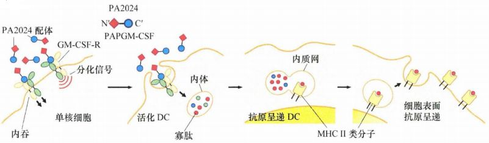
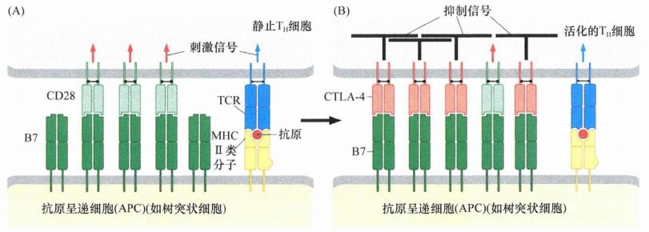

# 第十五章 《癌生物学》第十五章（4） 肿瘤的免疫治疗

**往期回顾**

[《癌生物学》第十一章（1）  肿瘤多阶段发展](http://mp.weixin.qq.com/s?__biz=Mzg4NjA5Mzg2Mw==&mid=2247487819&idx=1&sn=9e5153efeab13f233efce6fcefd01d53&chksm=cf9fb003f8e83915e4fca96afb9676a896222551f89c72698dd51b2a159d2098acaf2db3c0f2&scene=21#wechat_redirect)

[《癌生物学》第十一章（2） 对进化论解释肿瘤发展的补充](http://mp.weixin.qq.com/s?__biz=Mzg4NjA5Mzg2Mw==&mid=2247487832&idx=1&sn=5e8fbe85d6c878d01fd5c8123597f738&chksm=cf9fb010f8e83906a15b3a4dde368c45a4878310af6d8ae7cea6ee854219ee36eabe1ca51ae4&scene=21#wechat_redirect)

[《癌生物学》第十一章（3）参与肿瘤发展的因素之炎症](http://mp.weixin.qq.com/s?__biz=Mzg4NjA5Mzg2Mw==&mid=2247487874&idx=1&sn=d1adb72c268af79d532a0ede13f52abe&chksm=cf9fb0caf8e839dcdbc8eb23ce9779053eb50f64e7589bab3116b6ee14fb10b048f51388ec44&scene=21#wechat_redirect)

[《癌生物学》第十二章（1）DNA损伤的预防](http://mp.weixin.qq.com/s?__biz=Mzg4NjA5Mzg2Mw==&mid=2247487949&idx=1&sn=107054f050f8b4d3404a6e371ddf3194&chksm=cf9fb085f8e839937724d4ada4c21deec6f12551160dd2933522d10f25fae38b9b8ac6f895a3&scene=21#wechat_redirect)

[《癌生物学》第十二章（2）基因组损伤的来源](http://mp.weixin.qq.com/s?__biz=Mzg4NjA5Mzg2Mw==&mid=2247487974&idx=1&sn=f78a30cafd41835b2d9b7b52e63a5399&chksm=cf9fb0aef8e839b820ab28b8f4857b6ed209ac34864b16068dc5fdb0c413a2a27b1fa9481ef1&scene=21#wechat_redirect)

[《癌生物学》第十二章（3）DNA修复缺陷引发的疾病](http://mp.weixin.qq.com/s?__biz=Mzg4NjA5Mzg2Mw==&mid=2247487974&idx=2&sn=274bb725f72e37dbc9653c58126a3b6a&chksm=cf9fb0aef8e839b8eab9358955de09d65d8a6fb27412a7c8f6eacf5b6b34752eb894c8f01eb1&scene=21#wechat_redirect)

[《癌生物学》第十二章（4）癌细胞核型的变化](http://mp.weixin.qq.com/s?__biz=Mzg4NjA5Mzg2Mw==&mid=2247487974&idx=3&sn=c7fabdb23bf2fb1b8d6cb1e8cf231992&chksm=cf9fb0aef8e839b81c81319a584355725e04bab654f99985457158592285553a78527035da9a&scene=21#wechat_redirect)

[《癌生物学》第十三章（1） 肿瘤发生类似伤口损伤愈合](http://mp.weixin.qq.com/s?__biz=Mzg4NjA5Mzg2Mw==&mid=2247487990&idx=2&sn=427192f2af09ea8a12bafb6467955c95&chksm=cf9fb0bef8e839a8a174cead45f0dfe45b154efdf3664b5a5c3c21fb245a1072ba0f06f59944&scene=21#wechat_redirect)

[《癌生物学》第十三章（2） 间质细胞可促进肿瘤](http://mp.weixin.qq.com/s?__biz=Mzg4NjA5Mzg2Mw==&mid=2247488046&idx=2&sn=0dab3432d2e285c01924c68f4207286d&chksm=cf9fb366f8e83a7038662351ee64dd8e0c0ec3c37d1d888bc962f95f3ce8b700c3dc07614ed2&scene=21#wechat_redirect)

[《癌生物学》第十三章（3） 血管生成与肿瘤](http://mp.weixin.qq.com/s?__biz=Mzg4NjA5Mzg2Mw==&mid=2247488050&idx=2&sn=71764e3ce5e022e275c9376f2cfcc725&chksm=cf9fb37af8e83a6caec618df9c4898312199abdd91650c851a65fdfd0c3926f1aa5c6feaf37c&scene=21#wechat_redirect)

[《癌生物学》第十四章（1）侵袭-转移级联反应](http://mp.weixin.qq.com/s?__biz=Mzg4NjA5Mzg2Mw==&mid=2247488369&idx=2&sn=71dba3c62869c6360198bb74f99218d7&chksm=cf9fb239f8e83b2f25630645fe0c0d33cd8021afaa68d6a6eb88c6366484eda0b2172bea97c7&scene=21#wechat_redirect)

[《癌生物学》第十四章（2）上皮间叶转化（上）](http://mp.weixin.qq.com/s?__biz=Mzg4NjA5Mzg2Mw==&mid=2247488371&idx=2&sn=c0b04cd92afc7580ac81d623e743141b&chksm=cf9fb23bf8e83b2d187cc5120c3dbf5d2f05d8f70164698e3b7a0643ccfc2e945541b7683d7b&scene=21#wechat_redirect)

[《癌生物学》第十四章（3）上皮间叶转化（下）](http://mp.weixin.qq.com/s?__biz=Mzg4NjA5Mzg2Mw==&mid=2247488373&idx=1&sn=f98cd93f4ac5f610dd8e0e31658bc634&chksm=cf9fb23df8e83b2b02b7814b197ee75b286ce2e2baebf1a3b21a69eb5f72de18c1c0b4ed89f7&scene=21#wechat_redirect)

[《癌生物学》第十四章（4）转移的亲组织性和骨转移实例](http://mp.weixin.qq.com/s?__biz=Mzg4NjA5Mzg2Mw==&mid=2247488373&idx=2&sn=b47aead2faa1fff7f0a89df205b2b86c&chksm=cf9fb23df8e83b2b109da61b2e5cd191c5f80eba8af9e60c716156c70bde68efda3c550b8e00&scene=21#wechat_redirect)

[《癌生物学》第十五章（1） 免疫系统概述](http://mp.weixin.qq.com/s?__biz=Mzg4NjA5Mzg2Mw==&mid=2247488461&idx=2&sn=514e0619a8cb95c58caa2ddda4a111c8&chksm=cf9fb285f8e83b932e18cbfd058e2a70cbfb74179f508497a476608f9f4e068c8cf3b003e336&scene=21#wechat_redirect)

[《癌生物学》第十五章（2）  免疫监视理论](http://mp.weixin.qq.com/s?__biz=Mzg4NjA5Mzg2Mw==&mid=2247488476&idx=2&sn=eade09268152cd3e553da128cb622928&chksm=cf9fb294f8e83b82439d9b72550529bd94cfa1cc7dd447f6e34763ab86caf5dac649b9e5d879&scene=21#wechat_redirect)

[《癌生物学》第十五章（3） 肿瘤细胞与免疫系统的斗争](http://mp.weixin.qq.com/s?__biz=Mzg4NjA5Mzg2Mw==&mid=2247488477&idx=2&sn=abfb1f5df95ed3c6df4abce9f372ac71&chksm=cf9fb295f8e83b830069edfe09c2eefa61f0d4821029d873f3ed4e3f3d55ac4509f84e589b36&scene=21#wechat_redirect)

“通过上一讲，我们知道了，肿瘤细胞表面抗原可以诱导免疫反应，但肿瘤细胞通过多种方式逃避免疫监视并免受免疫细胞的攻击，此外，肿瘤细胞可以招募调节性 T 细胞抵挡淋巴细胞的攻击。反过来，肿瘤细胞可以攻击免疫细胞以确保自身安全。 今天，我们讨论肿瘤的免疫治疗。”

1、 单克隆抗体被动治疗

被动免疫包括给患者提供免疫制品（如抗体）或是来源于另一生物体的免疫系统中的细胞，目前为止最著名的被动免疫治疗涉及的单克隆抗体是被称为赫赛汀的单抗，也被研发者称为曲妥珠单抗。

赫赛汀来源于一种鼠源的单克隆抗体，可以与 EGF受体相关蛋白强烈作用，该蛋白在不同的地方分别被称为HER2、erbB2或Neu 。 HER2蛋白并非肿瘤特异性抗原，细胞表达异常高水平的HER2蛋白通常高于正常的10-100倍，可能会成为被赫赛汀优先作用的靶细胞。这一过度表达，通常是由于受体编码基因的扩增导致的，一般代表预后不良。

使用 **赫赛** **汀** **能延长肿瘤中过度表达 HER2蛋白的乳腺癌患者的生命** 。赫赛汀很少单独使用，常和一些已经有确定疗效的化疗药物联合用药治疗乳腺癌患者。在一个大规模的临床试验研究中，将赫赛汀与晚期乳腺癌女患者的标准化学疗法联用，可以使疾病无进展期延长（二者联合， 7.4个月；单用化学疗法，4.6个月），一年内死亡率降低(22%比33%)，且生存期更长(25个月比20个月） 。令人印象深刻的消息来自 2005年：对适宜手术的过度表达HER2的早期乳腺癌患者术后单用化疗方案或与赫赛汀联合使用进行治疗。4年后，接受联合用药的妇女中仅有15%肿瘤复发，而单用化疗方案的妇女中有33% 复发肿瘤。

赫赛汀杀伤肿瘤细胞的一个重要机制是依赖多种细胞毒性细胞和吞噬细胞表面的 Fcy受体，包括最重要的NK细胞和巨噬细胞。Fcy受体结合在免疫球蛋白（lgG) 抗体的恒定区，而抗体结合在乳腺癌细胞上。抗体结合在表达Fcy受体的细胞毒性细胞上，后者将靶细胞杀伤。因此，NK细胞和巨噬细胞通过它们的Fcy受体缩短了与lgG抗体结合的肿瘤细胞的距离，并且杀伤肿瘤细胞，这一过程称为 **抗体依赖的细胞介导的细胞毒作用 (ADCC)** 。

不同于赫赛汀，利妥昔单抗（美罗华）是结合 CD20、 含有人源 IgG1的Fc段部分和保留的来自鼠源的单克隆抗体（MoAb）组成的嵌合抗体，这种修饰是为了减少治行患者可能对抗MoAb本身产生免疫反应、导致抗体活性被中和。

（ CD20在不同发育阶段的B细胞和细胞来源的肿瘤上均有表达，它在靶细胞表面的表达水平非常高，且与抗体结合后不会被内化，因此 是一个特别有用的靶向抗原。）

已经证明 **美罗华对于许多非霍奇金淋巴瘤 (NHL)治疗有效** 。每周用一定剂量的利妥昔单抗治疗复发性滤泡性非霍奇金淋巴瘤患者或这些疾病的顽固性肿瘤病例时，约在一半的患者中取得了疗效。有趣的是，在接受治疗的患者中，其正常 B细胞群也同样可以被这种单克隆抗体杀伤，但仅仅在6-9个月后就可以恢复，这种治疗 较小的副作用是可以被患者接受的。截至 2012年 ，美罗华已经被用于治疗全世界几百万患有多种 B细胞来源恶性肿瘤的患者。在大多数情况下，它对已经再有的治疗方法有很好的辅助作用。

然而，虽然这一单克隆抗体治疗能稳定病情并因而延长生存时间，但它还不能治愈患者， **几乎所有患者都会在几年内复发 。** 一些复发患者的肿瘤可能对美罗华的第二轮治疗产生抵抗。迄今为止，美罗华获得性耐药的确切机制并没有完全清楚，目前提出了关于 CD20表达的改变、抵抗凋亡能力的提高、补体活性缺失和介导细胞毒性的细胞免疫能力缺失等理论。

对于抗肿瘤单克隆抗体的研究也可以从新的方向切入：

1. 许多实验已经在探究增强这些抗体分子的细胞毒效应的可能性。抗体分子可能会结合在肿瘤细胞的表面，随后通过补体作用或结合 Fc受体的细胞毒性细胞引起细胞杀伤。一个有前景的选择是将抗体与毒物连接，制造出免疫毒素，它就像一个“巧妙的导弹”对肿瘤进行靶向攻击，这样它们可以将高浓度的毒素导入靶细胞。

2.在注入肿瘤患者体内之前，将抗体分子与放射性分子连接，通过放射线杀伤邻近的肿瘤细胞。

3.将特异性的酶连接在抗体分子上：这些酶类能将无毒的药物前体活化为有毒性的药物。一旦抗体和相连的活化酶在肿瘤中富集后，随后注射入患者体内的药物前体就能被肿瘤邻近区域的酶激活。这种策略的优势在于，酶可以在靶肿瘤细胞的邻近区域激活上百种或是上千种有毒性的药物分子，将单个结合的单克隆抗体分子的毒性效应扩大。

2 、 回输外源免疫细胞被动治疗

被动免疫中一个特殊的类型是骨髓移植（ BMT) ，因为供者的骨髓移植物包含造血干细胞（ HSC),所以可以重建受者的骨髓、再生正常造血功能和免疫功能所需要的所有细胞系 。在许多造血系统恶性肿瘤、特别是淋巴瘤和白血病中， **骨髓移植的目的是去除全身各处的肿瘤干细胞，最重要的是去除骨髓中的肿瘤干细胞** 。

骨髓移植在治疗造血系统恶性肿瘤中的大部分治疗功效是来源于移植物抗肿瘤反应（ GVT),即供者的免疫细胞识别和攻击剩余的肿瘤细胞。这种攻击需要移植供者细胞中存在T淋巴细胞。目前GVT应答是使得格列卫耐药的慢性髓细胞白血病(CML)产生持续缓解和偶尔治愈的唯一有效的方法。

当第一次使用这种肿瘤干细胞治疗策略时，最有效的骨髓供者被认为是与那些骨髓受者组织相容性抗原最匹配的人，这可以保证最有效的骨髓重建和来源于移植物的免疫细胞攻击宿主组织的可能性最小化。但是，随着时间的推移，我们发现 **供者和受者之间只要具有最低水平的组织相容性就可以了** 。这使得异体干细胞移植 (ASCT) 和次要组织相容性抗原不匹配的移植治疗得到广泛应用。

3 、 动员患者的免疫系统

**动员抗肿瘤反应的一个重要策略取决于树突状细胞的激活** ，这些抗原呈递细胞 (APC)通常内吞遍布全身组织的感染原或其他抗原颗粒（包括肿瘤细胞），然后迅速回到邻近的引流淋巴结，在那里它们用其MHC II类分子呈递消化后的寡肽片段给辅助性T细胞。

一种以 DC为基础的 策略称为 **Provenge或sipuleucel-T** ，首先将提取自患者的单核细胞与来自前列腺酸性磷酸酶（ PAP， 几乎所有的前列腺癌细胞都表达 )形成的蛋白在体外共培 养，目的是将 PAP来源的抗原肽负载到从患者提取的树突状细胞（DC)的MHC II蛋白上。然后将PAP的C端与GM-CSF的N端融合形成融合蛋白 （ PA2024 ）。 PA2024的生长因子部分有两个作用：刺激单核细胞分化成未成熟的树突状细胞(DC)和通过GM-CSF与表达在单核细胞 表面的同源受体 GM-CSF-R 连接。

图 15-4-1：Provenge 治疗策略： GM-CSF受体（左）结合融合蛋白，信号传递驱动单核细胞分化成活化的DC，与此同时抗体－受体复合物内化，在内吞小体中降解融合蛋白成寡肽。后面内容是假设寡肽负载到MHC II类蛋白（第三版块）和呈递到DC表面 （右版块） ，产生的抗原呈递 DC能激活包含TH和Tc细胞及B细胞的抗肿瘤获得性免疫应答

这个策略被证明是成功的，使无临床症状或较少症状的转移性前列腺癌男性患者的平均生存期从 21.7个月延长到25.8个月。 这次成功成为了抗肿瘤免疫治疗的一个里程碑，是第一个通过成功控制获得性免疫系统在相当一部分患者中阻止肿瘤进展的临床实验。

可以通过多种途径增强 T淋巴细胞尤其是T H 和 Tc细胞对抗原呈递细胞(APC)呈递寡肽的反应。这个反应通常经历两个阶段。在第一个阶段中，T淋巴细胞最初与APC相遇，导致多种淋巴细胞反应，这些反应是由T淋巴细胞表面的CD28受体介导的。CD28参与呈递抗原结合到T细胞受体(TCR)的过程，而TCR参与抗原的识别。在第二个阶段中，另一个T淋巴细胞表面受体， **CTLA-4（细胞毒性T淋巴细胞抗原-4)与CD28竞争性地结合相同的APC配体** ， **强烈抑制抗原呈递的树突状细胞对 T淋巴细胞进一步激活。** 因此 CTLA-4受体控制着一个关键的负反馈调控系统，确保T淋巴细胞的活化仅仅是短暂的，并限制随后的免疫反应。 **结合和中和 CTLA-4抑制性受体的单克隆抗体，能极大地增强T淋巴细胞的免疫反应** ，可能是因为这些抗体能延长和增强抗原呈递的树突状细胞对于淋巴细胞的刺激活化。

图 15-4-2：CTLA-4调节细胞免疫反应包括两个步骤：(A) 第一个阶段中，T H 细胞表面表达的 CD28蛋白（浅绿）与抗原呈递细胞表面的B7蛋白（深绿）互补结合，使得CD28分子释放共刺激信号（红色箭头），其与抗原结合的T细胞受体释放的信号（蓝色箭头）共同作用使TH细胞活化；（B) 第二个阶段中，作为其活化程序的一部分，T细胞开始合成CTLA-4分子（粉红），这些CTLA-4分子结合在APC的B7分子上，其亲合力高于CD28分子，因此可取代CD28的结合，继而限制T细胞的进一步活化

此外，已证实在体外将白细胞介素 -2（IL-2) 加入到淋巴细胞和已被灭活的肿瘤细胞中混合培养，能够激活淋巴细胞、增强对荷瘤小鼠体内肿瘤细胞的杀伤。另一个动员免疫的相关策略是从患者肿瘤中提取淋巴细胞，在体外将这些细胞进行处理，然后再回输患者体内，这一过程称为过继性细胞输入 (ACT)。

这些结果是令人鼓舞的，但仅仅是零星出现的。很明显，我们仅仅是刚刚开始了解如何调控免疫系统才能使肿瘤衰退。这解释了为什么上述介绍的方案仅仅是序幕，它们将很快被更能有效激活抗肿瘤免疫反应的方案取代。

值得期待， 21世纪，是免疫学的世纪！

参考书目： 《The Biology of Cancer》（Second Edition）  R.A.Weinberg  著，詹启敏 等  译

编辑：周健 张月明 游丹铭

校审：张健 罗鹏

