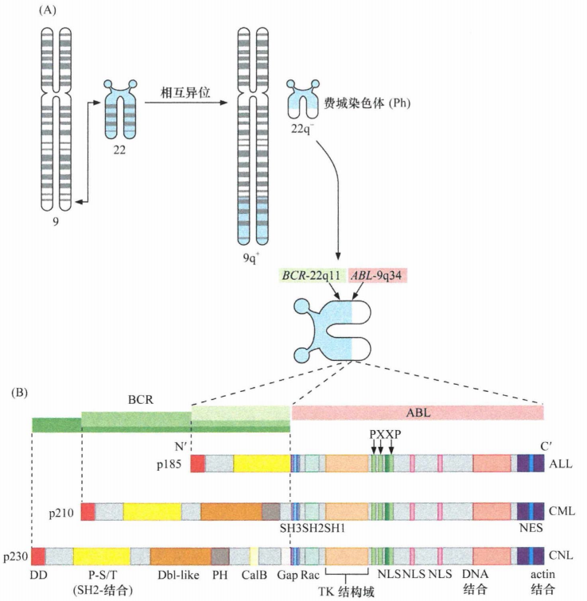
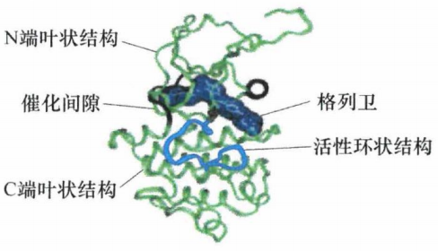
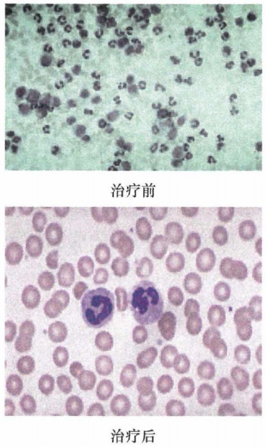
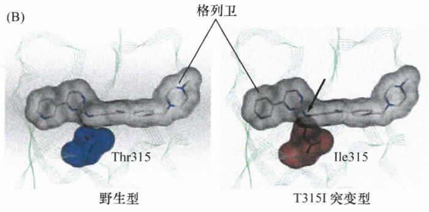
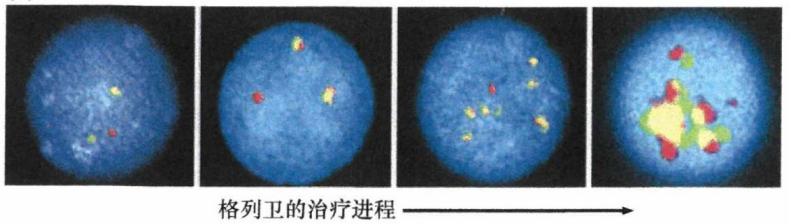
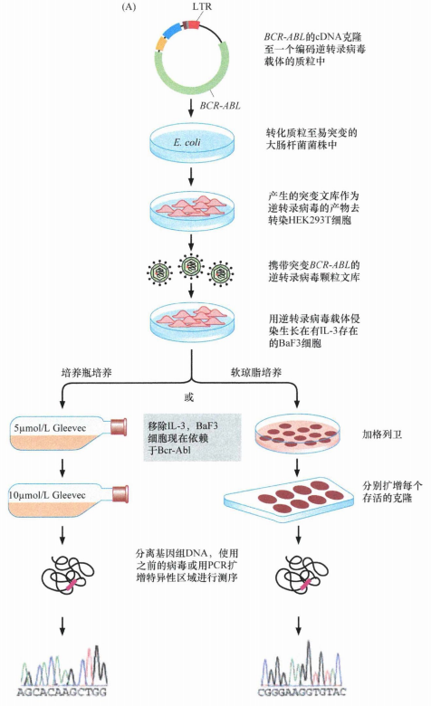
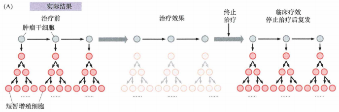

# 第十六章 《癌生物学》第十六章（1）肿瘤的合理治疗（上）

**往期回顾**
 

 [《癌生物学》第十二章（1）DNA损伤的预防](http://mp.weixin.qq.com/s?__biz=Mzg4NjA5Mzg2Mw==&mid=2247487949&idx=1&sn=107054f050f8b4d3404a6e371ddf3194&chksm=cf9fb085f8e839937724d4ada4c21deec6f12551160dd2933522d10f25fae38b9b8ac6f895a3&scene=21#wechat_redirect) [《癌生物学》第十二章（2）基因组损伤的来源](http://mp.weixin.qq.com/s?__biz=Mzg4NjA5Mzg2Mw==&mid=2247487974&idx=1&sn=f78a30cafd41835b2d9b7b52e63a5399&chksm=cf9fb0aef8e839b820ab28b8f4857b6ed209ac34864b16068dc5fdb0c413a2a27b1fa9481ef1&scene=21#wechat_redirect) [《癌生物学》第十二章（3）DNA修复缺陷引发的疾病](http://mp.weixin.qq.com/s?__biz=Mzg4NjA5Mzg2Mw==&mid=2247487974&idx=2&sn=274bb725f72e37dbc9653c58126a3b6a&chksm=cf9fb0aef8e839b8eab9358955de09d65d8a6fb27412a7c8f6eacf5b6b34752eb894c8f01eb1&scene=21#wechat_redirect) [《癌生物学》第十二章（4）癌细胞核型的变化](http://mp.weixin.qq.com/s?__biz=Mzg4NjA5Mzg2Mw==&mid=2247487974&idx=3&sn=c7fabdb23bf2fb1b8d6cb1e8cf231992&chksm=cf9fb0aef8e839b81c81319a584355725e04bab654f99985457158592285553a78527035da9a&scene=21#wechat_redirect) [《癌生物学》第十三章（1） 肿瘤发生类似伤口损伤愈合](http://mp.weixin.qq.com/s?__biz=Mzg4NjA5Mzg2Mw==&mid=2247487990&idx=2&sn=427192f2af09ea8a12bafb6467955c95&chksm=cf9fb0bef8e839a8a174cead45f0dfe45b154efdf3664b5a5c3c21fb245a1072ba0f06f59944&scene=21#wechat_redirect) [《癌生物学》第十三章（2） 间质细胞可促进肿瘤](http://mp.weixin.qq.com/s?__biz=Mzg4NjA5Mzg2Mw==&mid=2247488046&idx=2&sn=0dab3432d2e285c01924c68f4207286d&chksm=cf9fb366f8e83a7038662351ee64dd8e0c0ec3c37d1d888bc962f95f3ce8b700c3dc07614ed2&scene=21#wechat_redirect) [《癌生物学》第十三章（3） 血管生成与肿瘤](http://mp.weixin.qq.com/s?__biz=Mzg4NjA5Mzg2Mw==&mid=2247488050&idx=2&sn=71764e3ce5e022e275c9376f2cfcc725&chksm=cf9fb37af8e83a6caec618df9c4898312199abdd91650c851a65fdfd0c3926f1aa5c6feaf37c&scene=21#wechat_redirect) [《癌生物学》第十四章（1）侵袭-转移级联反应](http://mp.weixin.qq.com/s?__biz=Mzg4NjA5Mzg2Mw==&mid=2247488369&idx=2&sn=71dba3c62869c6360198bb74f99218d7&chksm=cf9fb239f8e83b2f25630645fe0c0d33cd8021afaa68d6a6eb88c6366484eda0b2172bea97c7&scene=21#wechat_redirect) [《癌生物学》第十四章（2）上皮间叶转化（上）](http://mp.weixin.qq.com/s?__biz=Mzg4NjA5Mzg2Mw==&mid=2247488371&idx=2&sn=c0b04cd92afc7580ac81d623e743141b&chksm=cf9fb23bf8e83b2d187cc5120c3dbf5d2f05d8f70164698e3b7a0643ccfc2e945541b7683d7b&scene=21#wechat_redirect) [《癌生物学》第十四章（3）上皮间叶转化（下）](http://mp.weixin.qq.com/s?__biz=Mzg4NjA5Mzg2Mw==&mid=2247488373&idx=1&sn=f98cd93f4ac5f610dd8e0e31658bc634&chksm=cf9fb23df8e83b2b02b7814b197ee75b286ce2e2baebf1a3b21a69eb5f72de18c1c0b4ed89f7&scene=21#wechat_redirect) 
 [《癌生物学》第十四章（4）转移的亲组织性和骨转移实例](http://mp.weixin.qq.com/s?__biz=Mzg4NjA5Mzg2Mw==&mid=2247488373&idx=2&sn=b47aead2faa1fff7f0a89df205b2b86c&chksm=cf9fb23df8e83b2b109da61b2e5cd191c5f80eba8af9e60c716156c70bde68efda3c550b8e00&scene=21#wechat_redirect) [《癌生物学》第十五章（1） 免疫系统概述](http://mp.weixin.qq.com/s?__biz=Mzg4NjA5Mzg2Mw==&mid=2247488461&idx=2&sn=514e0619a8cb95c58caa2ddda4a111c8&chksm=cf9fb285f8e83b932e18cbfd058e2a70cbfb74179f508497a476608f9f4e068c8cf3b003e336&scene=21#wechat_redirect) 
 [《癌生物学》第十五章（2）免疫监视理论](http://mp.weixin.qq.com/s?__biz=Mzg4NjA5Mzg2Mw==&mid=2247488476&idx=2&sn=eade09268152cd3e553da128cb622928&chksm=cf9fb294f8e83b82439d9b72550529bd94cfa1cc7dd447f6e34763ab86caf5dac649b9e5d879&scene=21#wechat_redirect) 
 [《癌生物学》第十五章（3） 肿瘤细胞与免疫系统的斗争](http://mp.weixin.qq.com/s?__biz=Mzg4NjA5Mzg2Mw==&mid=2247488477&idx=2&sn=abfb1f5df95ed3c6df4abce9f372ac71&chksm=cf9fb295f8e83b830069edfe09c2eefa61f0d4821029d873f3ed4e3f3d55ac4509f84e589b36&scene=21#wechat_redirect) 
[《癌生物学》第十五章（4） 肿瘤的免疫治疗](http://mp.weixin.qq.com/s?__biz=Mzg4NjA5Mzg2Mw==&mid=2247488492&idx=3&sn=7d22bc774c83b62e6d1c86c6e51c2918&chksm=cf9fb2a4f8e83bb20d3d464b24ba5bb0875e217a723af92f2840690986d617e9cbd02a4d1a2f&scene=21#wechat_redirect)
 

 
**前言** ：经过前15章的学习，无论是癌症的本质、特性，还是癌症的起源、生长、增殖、分化、凋亡以及侵袭转移，我们对其中的信号转导和发生发展机制都有了一个大概的了解。但是仅有对分子机制的研究是不足的，我们最终需要做的还是要将这些知识转化为肿瘤治疗的原始生产力。所以，这最后一章，我们主要来讲 **6个实例** ——将前面所学的分子机制应用到临床的治疗中去！至于今天要讲的这个实例，大家应该都有所了解，就是电影《我不是药神》里的“ **格列卫** ”。
 

 
 
 
 
分子肿瘤学的知识揭示了许多功能失调有助于肿瘤形成和肿瘤维持的蛋白质。很多这些蛋白质所暴露出来的分子特征，使它们成为如单克隆抗体和低分子量药物等新型抗癌药物的吸引人的靶点。能被抗体所攻击的蛋白质靶点总是位于细胞表面或细胞外间隙。而能够被低分子量药物攻击的大部分蛋白质靶点都是具有药物催化缝隙的酶，因为小分子更容易穿透肿瘤间隙，从而对所有的肿瘤细胞发挥治疗效果。
 
目前的研究进展扩大了候选药物靶点的范围，包括通过低分子量药物抑制特定的蛋白质与蛋白质之间的相互作用。最适合作为靶点的蛋白质是那些一旦失活，肿瘤细胞停止增殖或诱导凋亡导致肿瘤细胞死亡的蛋白质。到目前为止开发得最成功的抗肿瘤药物都具有干扰各种促细胞生长和存活的酶的功能，尤其是受体相关的酪氨酸激酶。成功的药物都要有较高的治疗指数、适合的药代动力学和药效动力学特征，以及对主要器官系统的副作用很小。药物在临床 I 期、II 期、III期的试验研究是不可或缺的，因为临床前在细胞和动物水平对药物疗效和耐受性的研究结果不能很好地预测该药物在人体内的行为。
 

 
 
**格列卫的研发历程**
 
 
1960 年，在费城工作的两位细胞学家注意到，在大多数慢性髓细胞白血病 (CML) 的细胞中都很特异地存在一种异常而且显著短小的 22 号染色体。这个染色体从此被命名为费城染色体 (Philadelphia chromosome) 或简称Ph。过了数十年时间，有一位芝加哥的研究者证实了 9 号和 22 号染色体相互的易位是Ph染色体形成的原因。因为22号染色体的一个很大的片段供给了9号染色体的异位点，这种分离使原来就很短小的22号染色体变得更短；22号染色体的残余部分加上9号染色体异位过来的小片段就形成了Ph。这种明显由体细胞突变而导致的染色体异常被认为是该病的潜在病因。95%以上的CML病例中存在这种特殊的易位。
 
通过这个易位而产生的融合基因在此后几十年里依然未知，直到 1982 年分子生物学家才发现是鼠c-abl原癌基因的人类同源基因ABL直接参与了这个染色体的异位，与另一个未知的基因融合。此后不久发现，另一个未知基因的断点（与 ABL 基因融合的染色体位点）分布在几 kb 长的一段DNA上，被命名为断裂点簇集区(breakpoint cluster region), 简称BCR。实际上，N 端不同长度的 Bcr 蛋白与 C 端几乎完整长度的Abl蛋白构成了 3 种不同的融合蛋白。不同的融合蛋白与不同的白血病类型相关。
  
图1：Bcr-Abl 蛋白的起源和结构
 

 
如上图所示，根据 BCR 断裂的精确位点，可能形成 3 种不同的 Bcr-Abl 融合蛋白，它们分别见于 ALL (急性淋巴细胞白血病)、CML (慢性髓细胞白血病) 和 CNL (慢性中性粒细胞白血病) 。每个 BCR-ABL 融合基因编码一个多结构域 （多功能）的融合蛋白。两年后发现 ， Bcr-Abl 蛋白具有组成性激活的酪氨酸激酶活性 。这个融合蛋白的结构域能够激活Ras通路、PI3激酶-Akt/PKB通路、Jak-STAT通路和Jun、Myc、NF-κB等转录因子。此外，调控着细胞迁移、存活和增殖活化的Ras样(Ras-like) Rac蛋白和两个非受体类酪氨酸激酶 (Hck 和 Fes) 也被激活。这些不同的融合形式使Bcr-Abl蛋白能够影响控制细胞增殖和存活的几乎所有调控通路。
 
研究者已经证实了来源于Abl原癌基因编码蛋白的 Bcr-Abl酪氨酸激酶结构域是其诱导白血病的关键元件。导致Bcr-Abl蛋白酪氨酸激酶催化活性丢失的微小改变都会使其完全丧失细胞转化功能。20 世纪90年代初期，在一项针对Bcr-Abl蛋白酪氨酸激酶活性的低分子量抑制剂进行的研究中，最终发现了一种药物—— **甲磺酸伊马替尼** ，别名 STl-571、Glivec和 **Gleevec** , 它能够结合Bcr-Abl 酪氨酸激酶的催化部位。与这个家族的其他所有激酶相似，Bcr-Abl酪氨酸激酶的催化部位位于激酶蛋白的两个主要结构单元之间。
  
图2：格列卫位于Bcr-Abl 酪氨酸激酶的催化部位
 

 
尽管Abl激酶结构域和许多其他的酪氨酸激酶在氨基酸序列上的相似性约有42%, 但格列卫对Bcr-Abl的抑制效果却相对地特异。随后，又发现格列卫也能抑制来源于 PDGF（α和β）、Kit 受体，以及 Arg (Abelson相关基因）蛋白的酪氨酸激酶活性。据此，格列卫在治疗浓度下只对人类 90 多种酪氨酸激酶中的 4 种有作用。像大部分其他激酶抑制剂一样，格列卫分子与Abl激酶域的ATP结合袋 (ATP-binding pocket) 相关。然而格列卫并不像其他激酶抑制剂一样通过阻断 ATP 结合于催化裂隙而发挥作用，而是通过结合并稳定激酶使之转换为一个没有催化活性的构象。
 
1996 年体外实验发现格列卫能够抑制CML细胞的生长但不会影响正常的骨髓细胞。更为特异的是，低至 40nmol/L 的药物浓度仍然能抑制Bcr-Abl依赖的细胞增殖，这 表明格列卫与酪氨酸激酶区域的催化部位具有相当高的亲和性。格列卫通过抑制Abl的激酶功能，会强制Bcr-Abl依赖性细胞进入凋亡程序。开始于 1998 年的临床试验显示，所有的接受格列卫治疗的31例CML患者都得到了疾病缓解，持续多年的每日服药也只产生轻微的副作用。4 年后 6000 例患者加入了格列卫的临床试验。
  
图3：格列卫的治疗效果：白血病细胞（大而深染的核）减少
 

 

 
 
**对格列卫的耐药性**
 
 
格列卫抑制Bcr-Abl激酶活性的能力随着肿瘤复发和继发性耐药而发生巨大改变。对格列卫耐药患者癌细胞中的BCR-ABL序列进行分析后显示，32 例复发病例中有 29 例 BCR-ABL 基因发生了突变，共产生了激酶区域内 13 个不同氨基酸的替换。其中一些突变直接干扰了格列卫与催化位点的结合或间接地通过改变癌蛋白立体化学构型的方式阻止格列卫与催化位点的结合。例如， 格列卫分子能够紧紧嵌入野生型Bcr-Abl癌蛋白315位苏氨酸形成的分子空隙里。然而，在一个格列卫耐药患者的白血病细胞里发现了一个315位苏氨酸被异亮氨酸取代的Bcr-Abl突变，以致药物结合的空隙向外突出而干扰格列卫进入结合位点。
  
图4：基因突变产生对格列卫的耐药性
 

 
少数患者中对格列卫的耐药性是由于白血病细胞 内BCR-ABL基因发生扩增，由此提升了编码癌蛋白的水平，很自然地导致白血病细胞不能再被常规使用的药物浓度所抑制。如下图所示，一个患者白血病细胞中BCR-ABL基因的拷贝数可以用荧光原位杂交技术检测。在该检测中细胞核呈蓝色，ABL序列呈红色，BCR序列呈绿色。黄色显示的是 ABL 和 BCR 的重叠序列，也就是由染色体易位产生的融合基因部位。在治疗开始时（左）融合基因（黄色）的拷贝数非常低，但是随着治疗的进行（向右），融合基因的拷贝数渐渐增多直到患者的白血病细胞产生耐药性。
  
图5：基因扩增产生对格列卫的耐药性
 

 
进一步的探索尝试在编码Bcr-Abl蛋白的载体中引入随机突变，以确定哪种突变类型能够抵抗格列卫对白血病细 胞的抑制作用。表达“野生型" Bcr-Abl蛋白的cDNA克隆载体（如染色体易位的直接产物）能够通过DNA复制时容易发生错配的 E.coli 细菌内传代而诱发突变，从而在携带BCR-ABL序列的质粒上产生突变体。将产生随机突变的 Bcr-Abl表达克隆文库通过一个逆转录病毒载体引入BaF3细胞，继而用格列卫进行筛选。少数格列卫耐药细胞能够被分离出来，从而可以确定格列卫耐药的BCR-ABL突变型蛋白的序列信息。（在正常情况下，鼠源前B淋巴细胞系BaF3需要在培养基中补充IL-3来维持细胞的生存和增殖。）
  
图6：格列卫耐药Bcr-Abl突变体的体外筛选
 

 
CML患者中产生的对格列卫耐药的Bcr-Abl突变会导致疾病临床复发，很多二代Bcr-Abl抑制剂已经被合成并能有效抑制这些突变Bcr-Abl蛋白。这些抑制剂包括 尼洛替尼 和 达沙替尼 ，它们实际上比格列卫／伊马替尼更有效。然而，它们及其他新开发的 Abl 抑制剂却不能抑制 T315I 这一最棘手的突变蛋白类型。在对这一突变蛋白的结构及其对药物结合的影响进行详尽分析的基础上，终于研发出对这种特殊突变类型具有抑制能力的新型化合物（AP24534）。
 

 
 
**格列卫在其他肿瘤中的作用**
 
 
格列卫还能够抑制 血小板源生长因子受体(PDGF-Rα和 PDGF-Rβ) , 提示格列卫也可能在其他类型恶性肿瘤的治疗中发挥重要作用。例如，在一些慢性骨髓增生性疾病中发现了由编码这两种受体的基因易位引起的受体组成性激活，正是这种异常激活造成了血液循环中某种髓系来源的细胞水平升高。格列卫治疗能使嗜酸性粒细胞增多综合征的患者获得完全缓解，嗜酸性粒细胞完全消失。很多更为常见的胶质母细胞瘤的生长是通过 PDGF-PDGF 受体的自分泌环路来调控的。然而，在这个例子里，同时使用格列卫和细胞毒性药物并没有产生鼓舞人心的效果，可能是因为格列卫不能有效地穿过血脑屏障到达肿瘤组织。
 
格列卫还对第3种酪氨酸激酶 Kit 受体 有效，这也使它成为一种受欢迎的胃肠道间质瘤(gastrointestinal stromal tumor, GIST) 治疗药物。GIST是一种相对少见的肉瘤性肿瘤，几乎没有有效的治疗措施。这些肿瘤中大多数（约 85%) 存在 Kit 受体突变，少数 (3%~5%) 存在 PDGF-Rα突变，这两种蛋白均是格列卫的靶标。这些肿瘤中的突变受体是构成性激活的，似乎是肿瘤细胞有丝分裂的主要驱动力。在一项研究中，几乎 70%接受治疗的患者都观察到了明显的肿瘤消退。
 

 
 
**肿瘤干细胞限制了格列卫的功效**
 
 
针对血液肿瘤、乳腺癌和脑瘤等人类肿瘤进行的研究显示，在这些肿瘤组织中肿瘤干细胞经常是肿瘤细胞的一小部分 (<<5%), 并且它们的存在只能通过肿瘤形成能力的生物学检测或使用荧光激活细胞分选技术得以显示。巧合的是，格列卫可以强力杀伤具有活性的循环的白血病细胞 （也就是短暂增殖细胞或“前体”细胞）。然而，肿瘤干细胞群体中的许多细胞在某单一时间点处于活跃的细胞周期之外，已经证明这些细胞对药物治疗具有相当的抵抗性。除此特性之外，这些肿瘤干细胞中执行多药耐药的外排泵分子表达水平升高。另外，大部分肿瘤干细胞所处的静息状态使它们对常用的以杀伤快速增殖细胞为主的细胞毒药物具有更强的抵抗性。
 
接受格列卫冶疗的 CML 患者通常只存在很少量的肿瘤干细胞，只能由高度敏感的 PCR 检测出来。然而，如果治疗中断，肿瘤干细胞通常会重新进入生长分裂周期，产生具有短暂增殖能力的前体细胞，并进而导致肿瘤再次生长和临床复发。这一现象解释了为什么格列卫治疗要长期维持，以及为什么未来的药物开发需要通过杀死肿瘤干细胞来彻底根除肿瘤。
  
图7：肿瘤干细胞对抗肿瘤治疗的影响
 

 参考书目： 《The Biology of Cancer》（Second Edition）  R.A.Weinberg  著，詹启敏 等  译 
 编辑： 张月明 周健 
 校审： 张健 罗鹏 

 
 ***欢迎点击下方图片进行留言，说出你的看法哦~***
 

 
我知道你 **在看** 哟
 