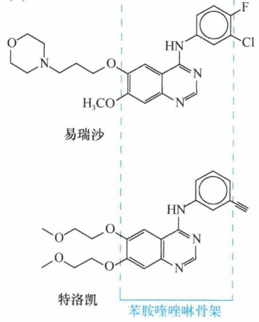
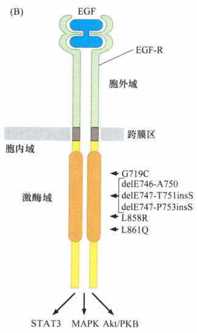
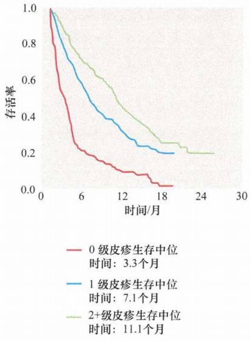
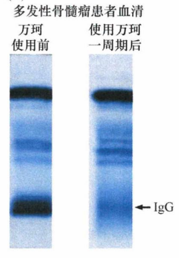
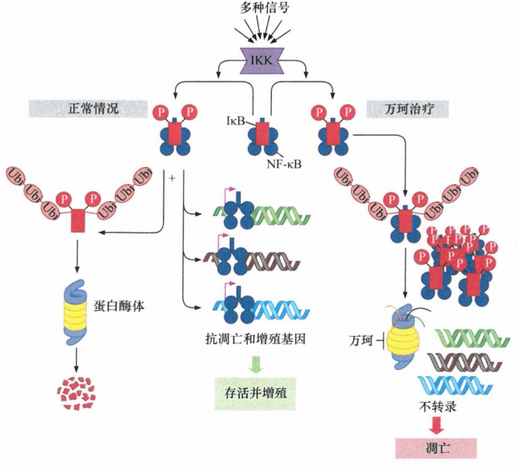
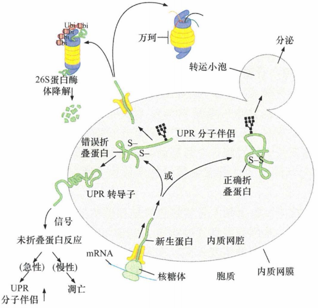

# 第十六章 《癌生物学》第十六章（2）肿瘤的合理治疗（中）

**往期回顾**
 

 [《癌生物学》第十二章（1）DNA损伤的预防](http://mp.weixin.qq.com/s?__biz=Mzg4NjA5Mzg2Mw==&mid=2247487949&idx=1&sn=107054f050f8b4d3404a6e371ddf3194&chksm=cf9fb085f8e839937724d4ada4c21deec6f12551160dd2933522d10f25fae38b9b8ac6f895a3&scene=21#wechat_redirect) [《癌生物学》第十二章（2）基因组损伤的来源](http://mp.weixin.qq.com/s?__biz=Mzg4NjA5Mzg2Mw==&mid=2247487974&idx=1&sn=f78a30cafd41835b2d9b7b52e63a5399&chksm=cf9fb0aef8e839b820ab28b8f4857b6ed209ac34864b16068dc5fdb0c413a2a27b1fa9481ef1&scene=21#wechat_redirect) [《癌生物学》第十二章（3）DNA修复缺陷引发的疾病](http://mp.weixin.qq.com/s?__biz=Mzg4NjA5Mzg2Mw==&mid=2247487974&idx=2&sn=274bb725f72e37dbc9653c58126a3b6a&chksm=cf9fb0aef8e839b8eab9358955de09d65d8a6fb27412a7c8f6eacf5b6b34752eb894c8f01eb1&scene=21#wechat_redirect) [《癌生物学》第十二章（4）癌细胞核型的变化](http://mp.weixin.qq.com/s?__biz=Mzg4NjA5Mzg2Mw==&mid=2247487974&idx=3&sn=c7fabdb23bf2fb1b8d6cb1e8cf231992&chksm=cf9fb0aef8e839b81c81319a584355725e04bab654f99985457158592285553a78527035da9a&scene=21#wechat_redirect) [《癌生物学》第十三章（1） 肿瘤发生类似伤口损伤愈合](http://mp.weixin.qq.com/s?__biz=Mzg4NjA5Mzg2Mw==&mid=2247487990&idx=2&sn=427192f2af09ea8a12bafb6467955c95&chksm=cf9fb0bef8e839a8a174cead45f0dfe45b154efdf3664b5a5c3c21fb245a1072ba0f06f59944&scene=21#wechat_redirect) [《癌生物学》第十三章（2） 间质细胞可促进肿瘤](http://mp.weixin.qq.com/s?__biz=Mzg4NjA5Mzg2Mw==&mid=2247488046&idx=2&sn=0dab3432d2e285c01924c68f4207286d&chksm=cf9fb366f8e83a7038662351ee64dd8e0c0ec3c37d1d888bc962f95f3ce8b700c3dc07614ed2&scene=21#wechat_redirect) [《癌生物学》第十三章（3） 血管生成与肿瘤](http://mp.weixin.qq.com/s?__biz=Mzg4NjA5Mzg2Mw==&mid=2247488050&idx=2&sn=71764e3ce5e022e275c9376f2cfcc725&chksm=cf9fb37af8e83a6caec618df9c4898312199abdd91650c851a65fdfd0c3926f1aa5c6feaf37c&scene=21#wechat_redirect) [《癌生物学》第十四章（1）侵袭-转移级联反应](http://mp.weixin.qq.com/s?__biz=Mzg4NjA5Mzg2Mw==&mid=2247488369&idx=2&sn=71dba3c62869c6360198bb74f99218d7&chksm=cf9fb239f8e83b2f25630645fe0c0d33cd8021afaa68d6a6eb88c6366484eda0b2172bea97c7&scene=21#wechat_redirect) [《癌生物学》第十四章（2）上皮间叶转化（上）](http://mp.weixin.qq.com/s?__biz=Mzg4NjA5Mzg2Mw==&mid=2247488371&idx=2&sn=c0b04cd92afc7580ac81d623e743141b&chksm=cf9fb23bf8e83b2d187cc5120c3dbf5d2f05d8f70164698e3b7a0643ccfc2e945541b7683d7b&scene=21#wechat_redirect) [《癌生物学》第十四章（3）上皮间叶转化（下）](http://mp.weixin.qq.com/s?__biz=Mzg4NjA5Mzg2Mw==&mid=2247488373&idx=1&sn=f98cd93f4ac5f610dd8e0e31658bc634&chksm=cf9fb23df8e83b2b02b7814b197ee75b286ce2e2baebf1a3b21a69eb5f72de18c1c0b4ed89f7&scene=21#wechat_redirect) 
 [《癌生物学》第十四章（4）转移的亲组织性和骨转移实例](http://mp.weixin.qq.com/s?__biz=Mzg4NjA5Mzg2Mw==&mid=2247488373&idx=2&sn=b47aead2faa1fff7f0a89df205b2b86c&chksm=cf9fb23df8e83b2b109da61b2e5cd191c5f80eba8af9e60c716156c70bde68efda3c550b8e00&scene=21#wechat_redirect) [《癌生物学》第十五章（1） 免疫系统概述](http://mp.weixin.qq.com/s?__biz=Mzg4NjA5Mzg2Mw==&mid=2247488461&idx=2&sn=514e0619a8cb95c58caa2ddda4a111c8&chksm=cf9fb285f8e83b932e18cbfd058e2a70cbfb74179f508497a476608f9f4e068c8cf3b003e336&scene=21#wechat_redirect) 
 [《癌生物学》第十五章（2）免疫监视理论](http://mp.weixin.qq.com/s?__biz=Mzg4NjA5Mzg2Mw==&mid=2247488476&idx=2&sn=eade09268152cd3e553da128cb622928&chksm=cf9fb294f8e83b82439d9b72550529bd94cfa1cc7dd447f6e34763ab86caf5dac649b9e5d879&scene=21#wechat_redirect) 
 [《癌生物学》第十五章（3） 肿瘤细胞与免疫系统的斗争](http://mp.weixin.qq.com/s?__biz=Mzg4NjA5Mzg2Mw==&mid=2247488477&idx=2&sn=abfb1f5df95ed3c6df4abce9f372ac71&chksm=cf9fb295f8e83b830069edfe09c2eefa61f0d4821029d873f3ed4e3f3d55ac4509f84e589b36&scene=21#wechat_redirect) 
[《癌生物学》第十五章（4） 肿瘤的免疫治疗](http://mp.weixin.qq.com/s?__biz=Mzg4NjA5Mzg2Mw==&mid=2247488492&idx=3&sn=7d22bc774c83b62e6d1c86c6e51c2918&chksm=cf9fb2a4f8e83bb20d3d464b24ba5bb0875e217a723af92f2840690986d617e9cbd02a4d1a2f&scene=21#wechat_redirect)
 
[《癌生物学》第十六章（1）肿瘤的合理治疗（上）](http://mp.weixin.qq.com/s?__biz=Mzg4NjA5Mzg2Mw==&mid=2247488653&idx=2&sn=c6ddcc7a37893f519fd8021985182692&chksm=cf9fb5c5f8e83cd36b515b72ddd7de61b1b93b9036aed85f4a65bcbf6110fbb206dd1988b1bd&scene=21#wechat_redirect)
 

 
**前言** ：格列卫的研发最初在它发源的药物公司遇到了相当大的阻力，原因只是这一药物的预期市场非常小，以至于不能填平药物研发和临床试验的巨额费用。而我们今天要学习的药物则是不一样的， **EGF受体拮抗剂** 靶向的表皮生长因子受体（EGFR）在 1/3 的肿瘤发生中存在高表达并发挥着关键性的作用。此外，我们还会 介绍 **蛋白酶体抑制剂** 的相关内容 。
 

 
 
**EGF受体拮抗剂**
 
 
研究最充分的两个EGF-R酪氨酸激酶抑制剂是 易瑞莎 和 特洛凯 ，它们也分别被称为 吉非替尼/ZD1839 和 埃罗替尼/OSI-774 。这两种药物具有十分相似但不完全相同的特性，都是破坏受体相关激酶的 ATP 结合位点。一旦通过抑制EGF-R剥夺了肿瘤细胞的受体信号转导功能，它们就失去了由这一受体驱动的强烈的促有丝分裂和抗凋亡作用。例如，在许多上皮细胞类型中，持续的EGF-R信号能维持Bcl-X L (与Bcl-2同一家族，具有强烈抗凋亡作用的蛋白）的表达，通过MAPK驱动磷酸化和促凋亡蛋白Bad的功能失活。
 
我们已经知道在许多人类癌症中存在缺少胞外功能区的截短的EGF-R。这些突变的EGF-R能以配体非依赖的方式持续发出生长信号，即具有强烈的致癌蛋白功能。与此相似，约有一半的进展期胶质瘤（也称为多形性胶质母细胞瘤，GBM) 表现为EGF-R高表达。在这些肿瘤中，又有大约 40% 的肿瘤表达的EGF-R受体缺少由编码序列中外显子2~7编码的胞外区。这些截短的受体不能被单克隆抗体 (MoAb) 识别 ，因为这些抗体只能识别正常受体蛋白的胞外区抗原表位。但这不能阻止低分子量的酪氨酸激酶拮抗剂发挥作用，因为这些药物作用于这一受体胞内区的信号触发区。这些药物的缺点在于其药代动力学特征。例如，特洛凯的半衰期是36h, 而西妥昔（一种抗 EGF-R 的单克隆抗体）的半衰期多于 5 天，赫赛汀的半衰期为 28 天。 

  
图1：易瑞莎和特洛凯
 

 
易瑞莎和特洛凯具有相同的苯胺喹唑啉骨架，这使它们对受体酪氨酸激酶 ATP 结合位点产生亲和性。但联结于骨架的化学侧链具有生物学效应，这就使这两种药物具有不同的肿瘤疗效，如对非小细胞肺癌(NSCLC) 的治疗。与单独应用化疗药物治疗NSCLC相比，易瑞莎与标准化疗药物合用产生的协同效应并没有在患者中产生生存优势。当单独应用时，特洛凯能延长对标准化疗药物治疗耐药的 NSCLC 患者的总体生存时间，而易瑞莎则没有这种作用 。
 
2004 年，波士顿的两个研究小组分别独立地从分子角度对观察到的易瑞莎的不同反应性进行了解释。从前只是从NSCLC细胞中EGF受体是否高表达或是否以持续激活的截短体形式存在两方面研究了EGF受体的状态，但 2004 年进行的研究中，研究者对接受易瑞莎治疗的NSCLC患者中 EGF-R编码基因的阅读框进行了详细测序 。
 
结果他们惊奇地发现，几乎所有对易瑞莎治疗只有较好反应性的患者（占总患者的 10%) 的肿瘤细胞都携带结构发生了改变的 EGF-R。在对易瑞莎治疗没有反应的肿瘤中没有发现这一类型的突变受体，即使在表达高水平的EGF-R的肿瘤患者中也没有发现这些突变。这些突变在激酶结构域产生了氨基酸替换和小片段的缺失, 而不是在胶质母细胞瘤中发现的典型的受体胞外区大部分缺失。这些突变受体改变了它们C端的酪氨酸磷酸化模式，并选择性地激活下游Akt/PKB和STAT5通路，但MAPK信号通路则不受影响。这表明了在用如易瑞莎和特洛凯之类的分子靶向药物治疗肿瘤时利用分子标志物对肿瘤进行分层的重要性。但是，这些实验并没有揭示为什么易瑞莎和特洛凯对这些特殊的肿瘤具有如此强烈的作用。
  
图2：基因缺失或点突变影响EGF受体的胞质结构域
 

 
另外一个困惑是发现NSCLC患者表达结构改变的EGF受体的频率不同。西方NSCLC患者中它的表达率为10%, 而某些亚洲人群NSCLC患者中这些突变受体蛋白的表达率高达30%。在所有情况下，这些改变的受体是体细胞突变造成的，而不是胚系多肽性。这类肿瘤在女性非吸烟患者中发生的频率更高。
 
但是这个困惑看起来已经被解决了。在某些东亚人群中多至一半的CML患者对格列卫产生不完全反应，而在西方患者中这一数值只有1/4。在非小细胞肺癌患者的EGF-R抑制剂冶疗中也存在类似的耐药人群。在这两种情况下，这些患者的肿瘤从一开始就对酪氨酸激酶抑制剂 (TKI) 耐药。肿瘤学家把这种开始就存在的耐药称为 原发性耐药 ， 从而与治疗中产生的 继发性耐药 相区别。
 
在非小细胞肺癌和白血病中，原发性耐药已经追溯到 促凋亡基因Bim 的一个等位基因，这个基因编码一种Bim缺陷蛋白。12.3%的东亚人携带这种缺陷基因， 但是非洲和欧洲人群中没有发现这种突变基因。其他研究表明，致癌的酪氨酸激酶能够抑制野生型Bim蛋白的表达，抑制TK后Bim蛋白激活对于格列卫、易瑞沙和特洛凯成功诱导肿瘤细胞发生凋亡具有重要的作用。由于Bim的两个野生型等位基因均缺失，因而失去了正常的Bim蛋白表达，所以这些东亚患者的肿瘤发生凋亡的趋势显著降低，因而这些肿瘤对这类抑制剂杀伤作用的反应也下降。
 
除了以上提到的胚系或体系突变基因，还有其他基因也有助于预测抗EGF-R TKI的疗效。癌基因K-ras或PI3K发生激活突变或抑癌基因PTEN发生失活与肿瘤对这些TKI药物治疗失败显著相关。如果细胞表面受体的胞质下游效应分子被某种突变激活的话，即使采用靶向治疗使受体失活，下游分子仍然可以不依赖于受体的状态而保持持续激活。
 
但是，也有一个重要的现象无法通过我们现在对细胞信号的理解来解释，到目前为止还是谜：各种抗EGF-R治疗的抗肿瘤疗效的最佳提示指标是肿瘤患者的皮疹严重程度。由于皮肤并不参与肺癌或结直肠癌的病理发生过程，这一现象可能提示不同患者在决定治疗疗效的药代动力学(PK)方面存在显著差异，并且这一差异也同时影响到了皮肤，但是 PK 和皮疹的发生并没有相关性。此外，皮疹严重程度和治疗反应呈正相关这个规律适用于多种小分子量药物及受体单克隆抗体药物。
  
图3：患者皮疹情况与治疗疗效的关系
 

 

 
 
**蛋白酶体抑制剂**
 
 
大部分蛋白降解过程是由泛素蛋白酶体系统来调控的。当蛋白被添加多泛素标记后，它就会被运输到蛋白酶体上，并在这些胞内装置中发生降解。肿瘤相关的恶病质现象最先激起了研究者对蛋白酶体抑制剂的兴趣。蛋白酶体抑制剂有望能够有效延缓恶病质患者中广泛的蛋白质降解。目前至少已经研发过5种不同种类的蛋白酶体抑制剂，但是大部分由于它们的代谢不稳定、缺少特异性和不可逆结合并灭活蛋白酶体等而被放弃了。 **万珂** 是其中一种包含硼酸二肽的蛋白酶体抑制剂，是人工设计的蛋白酶体20S 核心的肽酶（肽剪切）活性特异性抑制剂。通过竞争性抑制酶活性，万珂能够降低蛋白酶与底物的结合，从而使其功能受阻。
 
蛋白酶体介导的蛋白质降解在许多重要的细胞信号通路中起关键的调节作用。因为发现其他的蛋白酶体抑制剂能杀死多种体外培养的肿瘤细胞，所以万珂在临床 I 期试验中被用于现有治疗手段失败后的肿瘤患者的治疗。它在实体肿瘤患者中并没有产生显著疗效。但在血液恶性肿瘤中有一种B细胞系来源的多发性骨髓瘤(MM), 在这种骨髓瘤中能够产生抗体的单一克隆的浆细胞会占据骨髓的大部分。骨髓瘤细胞产生的溶骨性病灶会导致骨折，并代替骨髓的其他细胞成分，结果产生严重的免疫抑制，多数最终因无法控制的感染而死亡。经过万珂初次治疗的患者发生了显著的肿瘤消退, 随后在这项 I 期试验中又迅速纳入了其他骨髓瘤患者，并最终进行了大规模的临床试验。
  
图4：万珂治疗后浆细胞所产生的单种免疫球蛋白γ (lgG) 明显减少
 

 
认为可以应用蛋白酶体抑制剂治疗多发性骨髓瘤，是因为发现骨髓瘤中NF-κB信号通路持续活化，而NF-κB在 细胞的生存和增殖中发挥重要的生理作用。转录因子NF-κB通常被其抑制因子IκB隔离在胞质。当IκB被IκB激酶IKK这一特异激酶磷酸化时，IκB发生多泛素化并被降解；释放出的NF-κB进入细胞核，活化多种抗凋亡基因和促生长基因的表达。因此，如果蛋白酶体的活性被抑制，IκB就不会被降解，而是在胞质中结合NF-κB, 抑制其入核发挥转录因子活性。
  
图5：万珂的作用机制之一
 

 
但是，这些还都不能解释为什么万珂能有效抑制骨髓瘤，但对依赖NF-κB信号通路而免受凋亡的其他肿瘤没有疗效。从骨髓瘤细胞的生长和存活高度依赖于它们表达VEGF (血管内皮生长因子）和黏附分子这一现象可以得到一些线索。黏附分子能使骨髓瘤细胞黏附到骨髓干细胞, 使骨髓瘤细胞完成关键的异型相互作用。所有编码这些蛋白质的基因都受NF-κB活性的调节。
 
万柯作用的另外一种广受支持的理论机制与它特异性灭活NF-κB信号通路功能无关。这种理论机制来源于这样一种事实：骨髓瘤细胞与具有正常抗体分泌功能的浆细胞一样，估计以每秒几千个分子的惊人速度持续合成和分泌抗体分子。这些分子中的相当一部分会由于错误折叠或其他翻译后成熟过程中的灾难性事件而导致其在蛋白酶体中常规降解。除了被蛋白酶体降解，未折叠或错误折叠的蛋白质在内质网中累积还会诱发内质网应激状态，并进一步激活未折叠蛋白反应 (UPR)。这一复杂的程序依赖于受体样UPR信号转导分子传递内质网(ER)腔中过量错误折叠蛋白的信息。在ER应激的急性阶段，UPR的一个成分使分子伴侣从胞质转移到ER腔，帮助异常蛋白正确折叠。UPR 的另一个功能是参与慢性ER反应并启动凋亡。骨髓瘤对蛋白降解抑制剂尤其敏感，细胞中充满了以抗体亚单位为主的错误折叠蛋白分子。蛋白酶体功能缺陷会在胞质中以某种尚不清楚的机制激活ER中UPR过程，引起细胞凋亡。
  
图6：万珂的作用机制之二
 

 参考书目： 《The Biology of Cancer》（Second Edition）  R.A.Weinberg  著，詹启敏 等  译 
 编辑： 张月明 周健 
 校审： 张健 罗鹏 

 
 ***欢迎点击下方图片进行留言，说出你的看法哦~***
 

 
我知道你 **在看** 哟
 