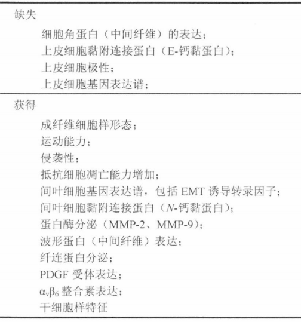
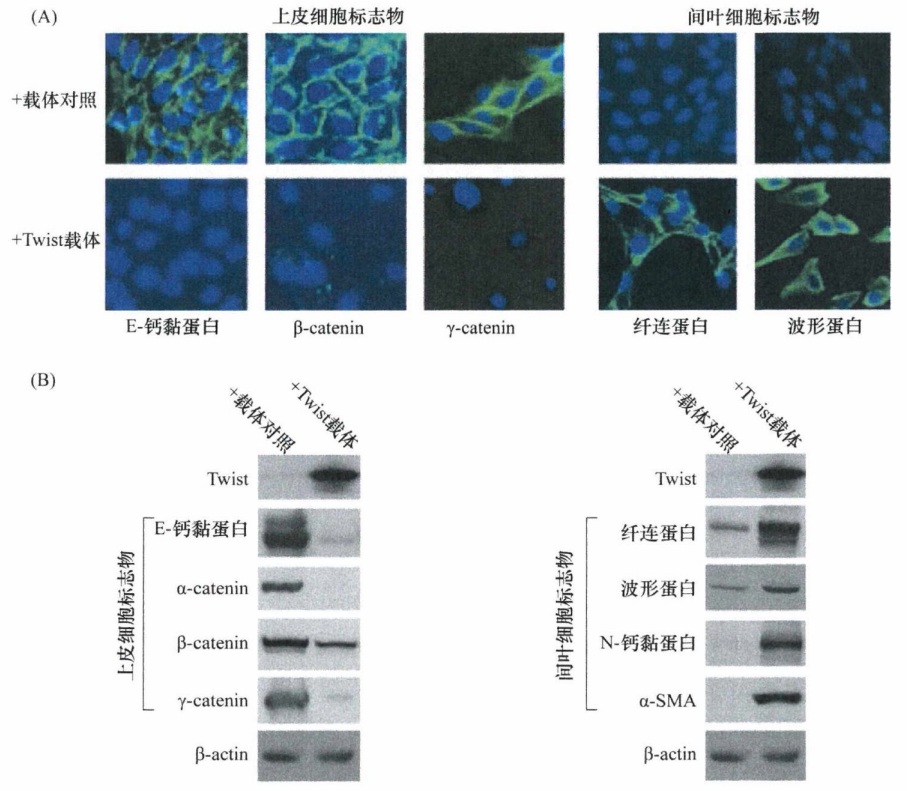
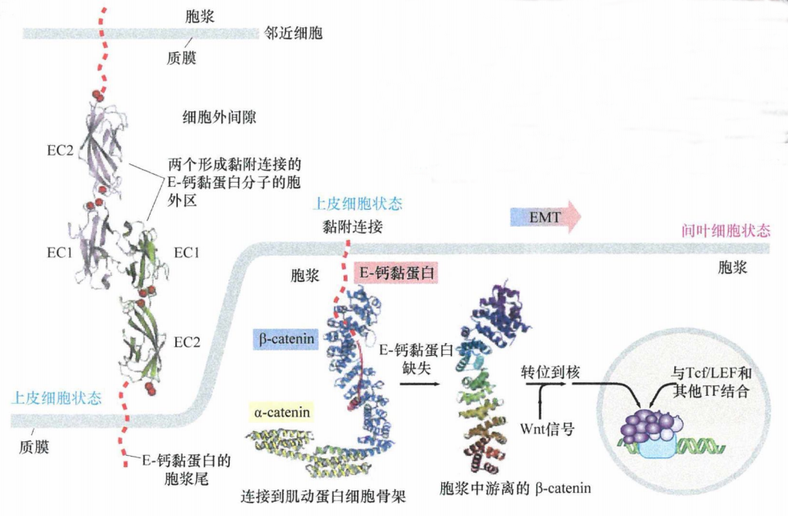
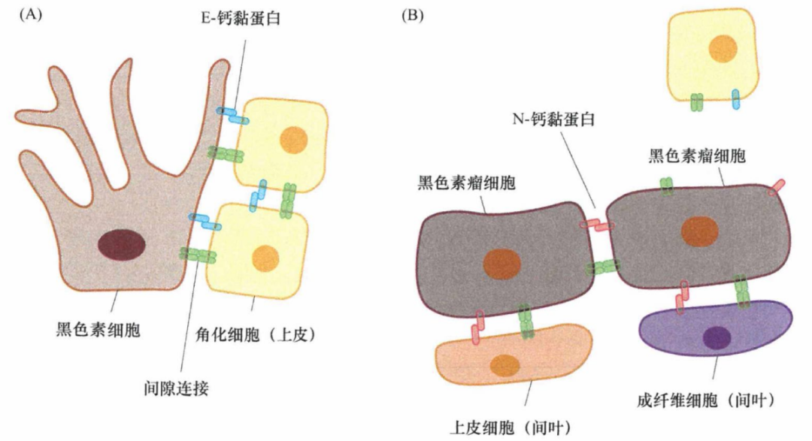
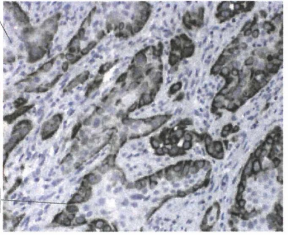
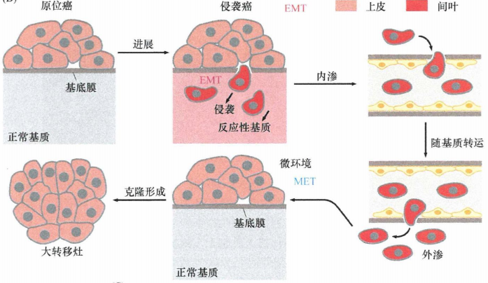
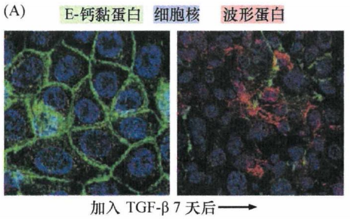
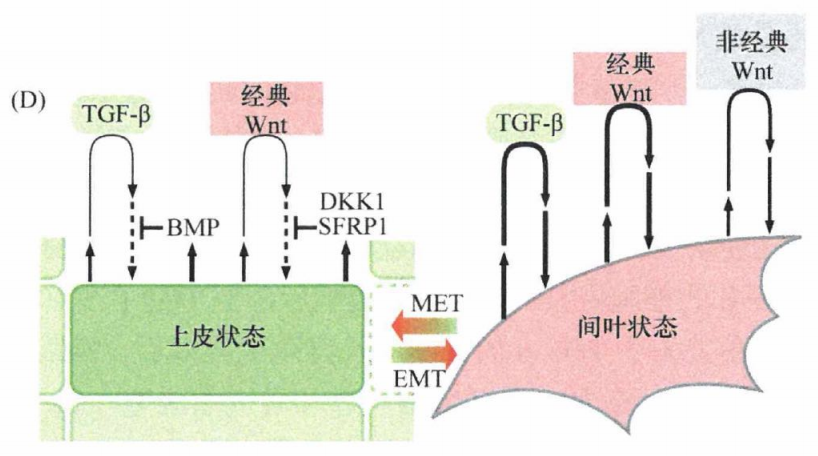
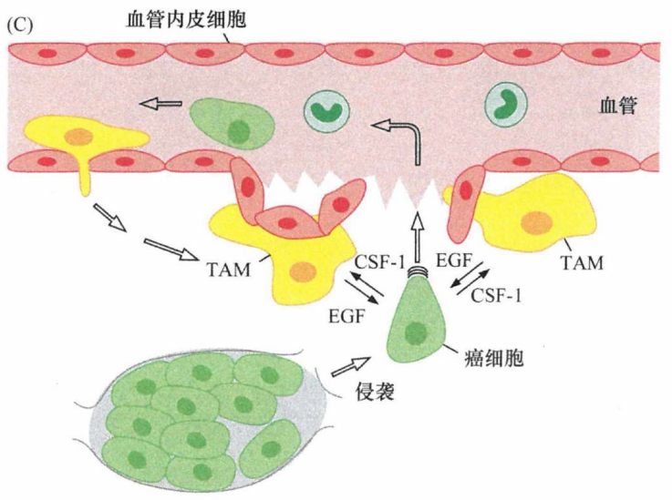
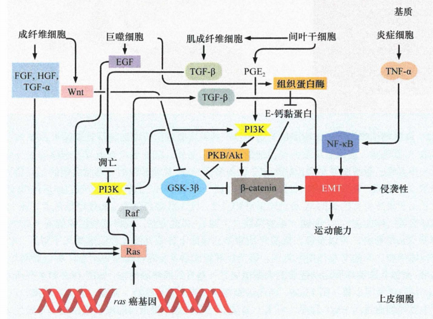

# 第十四章 《癌生物学》第十四章（2）上皮间叶转化（上）

**往期回顾**
 

 [《癌生物学》第九章（1） p53——抑癌基因](http://mp.weixin.qq.com/s?__biz=Mzg4NjA5Mzg2Mw==&mid=2247487247&idx=1&sn=50b6eaf0623c0c134f4c6588f68c3689&chksm=cf9fae47f8e82751bc562b5867da4f7cbecc9cfcd3bb65c3ea19891184fc6f4bd5cccf590299&scene=21#wechat_redirect) [《癌生物学》第九章（2）  P53水平的调控](http://mp.weixin.qq.com/s?__biz=Mzg4NjA5Mzg2Mw==&mid=2247487248&idx=1&sn=f33178b9d3428da2eb7ec91e7fe1e8f6&chksm=cf9fae58f8e8274e3234ef693fd33bda4ab3a62f6f3e790ea677a4dbe61b2b87e945202fb99d&scene=21#wechat_redirect) [《癌生物学》第九章（3）  P53的生物学功能](http://mp.weixin.qq.com/s?__biz=Mzg4NjA5Mzg2Mw==&mid=2247487249&idx=1&sn=812b0a64097fabf21da4b79650fe668d&chksm=cf9fae59f8e8274f0f4165f157155304db6f91b85bc141e38330e8b09c94173ff44a8e03718c&scene=21#wechat_redirect) [《癌生物学》第九章（4）  凋亡与肿瘤](http://mp.weixin.qq.com/s?__biz=Mzg4NjA5Mzg2Mw==&mid=2247487251&idx=2&sn=c670121fa3e55e6eac50a606096bd292&chksm=cf9fae5bf8e8274d404393647fc7eca19b7f54bdac964ad16003b9b0f5f9eeaf767e843dcecb&scene=21#wechat_redirect) [《癌生物学》第十章（1） 肿瘤细胞无限增殖的两个障碍](http://mp.weixin.qq.com/s?__biz=Mzg4NjA5Mzg2Mw==&mid=2247487501&idx=1&sn=3923a4a34cbabaf58f5c49f5973e4149&chksm=cf9fb145f8e83853ba49d4d8e6512b681ff674bfdf4724ff3a519130d9f6173242dad0e80132&scene=21#wechat_redirect) [《癌生物学》第十章（2） 端粒和端粒酶](http://mp.weixin.qq.com/s?__biz=Mzg4NjA5Mzg2Mw==&mid=2247487506&idx=1&sn=4e2df94146e3a9328b7ca74b03a573da&chksm=cf9fb15af8e8384c2bdcf218c35b9497ffd1f521e658084df49d4be5f9eed137d39211a67935&scene=21#wechat_redirect) [《癌生物学》第十章（3） 端粒酶的双重角色](http://mp.weixin.qq.com/s?__biz=Mzg4NjA5Mzg2Mw==&mid=2247487507&idx=2&sn=2b23b04530bff885efd741fed554d46f&chksm=cf9fb15bf8e8384d1670f2d518fdc4aa87cd47a756936cca722f2c6b88df16c699570d0cc205&scene=21#wechat_redirect) [《癌生物学》第十一章（1）  肿瘤多阶段发展](http://mp.weixin.qq.com/s?__biz=Mzg4NjA5Mzg2Mw==&mid=2247487819&idx=1&sn=9e5153efeab13f233efce6fcefd01d53&chksm=cf9fb003f8e83915e4fca96afb9676a896222551f89c72698dd51b2a159d2098acaf2db3c0f2&scene=21#wechat_redirect) [《癌生物学》第十一章（2） 对进化论解释肿瘤发展的补充](http://mp.weixin.qq.com/s?__biz=Mzg4NjA5Mzg2Mw==&mid=2247487832&idx=1&sn=5e8fbe85d6c878d01fd5c8123597f738&chksm=cf9fb010f8e83906a15b3a4dde368c45a4878310af6d8ae7cea6ee854219ee36eabe1ca51ae4&scene=21#wechat_redirect) [《癌生物学》第十一章（3）参与肿瘤发展的因素之炎症](http://mp.weixin.qq.com/s?__biz=Mzg4NjA5Mzg2Mw==&mid=2247487874&idx=1&sn=d1adb72c268af79d532a0ede13f52abe&chksm=cf9fb0caf8e839dcdbc8eb23ce9779053eb50f64e7589bab3116b6ee14fb10b048f51388ec44&scene=21#wechat_redirect) [《癌生物学》第十二章（1）DNA损伤的预防](http://mp.weixin.qq.com/s?__biz=Mzg4NjA5Mzg2Mw==&mid=2247487949&idx=1&sn=107054f050f8b4d3404a6e371ddf3194&chksm=cf9fb085f8e839937724d4ada4c21deec6f12551160dd2933522d10f25fae38b9b8ac6f895a3&scene=21#wechat_redirect) [《癌生物学》第十二章（2）基因组损伤的来源](http://mp.weixin.qq.com/s?__biz=Mzg4NjA5Mzg2Mw==&mid=2247487974&idx=1&sn=f78a30cafd41835b2d9b7b52e63a5399&chksm=cf9fb0aef8e839b820ab28b8f4857b6ed209ac34864b16068dc5fdb0c413a2a27b1fa9481ef1&scene=21#wechat_redirect) [《癌生物学》第十二章（3）DNA修复缺陷引发的疾病](http://mp.weixin.qq.com/s?__biz=Mzg4NjA5Mzg2Mw==&mid=2247487974&idx=2&sn=274bb725f72e37dbc9653c58126a3b6a&chksm=cf9fb0aef8e839b8eab9358955de09d65d8a6fb27412a7c8f6eacf5b6b34752eb894c8f01eb1&scene=21#wechat_redirect) [《癌生物学》第十二章（4）癌细胞核型的变化](http://mp.weixin.qq.com/s?__biz=Mzg4NjA5Mzg2Mw==&mid=2247487974&idx=3&sn=c7fabdb23bf2fb1b8d6cb1e8cf231992&chksm=cf9fb0aef8e839b81c81319a584355725e04bab654f99985457158592285553a78527035da9a&scene=21#wechat_redirect) [《癌生物学》第十三章（1） 肿瘤发生类似伤口损伤愈合](http://mp.weixin.qq.com/s?__biz=Mzg4NjA5Mzg2Mw==&mid=2247487990&idx=2&sn=427192f2af09ea8a12bafb6467955c95&chksm=cf9fb0bef8e839a8a174cead45f0dfe45b154efdf3664b5a5c3c21fb245a1072ba0f06f59944&scene=21#wechat_redirect) [《癌生物学》第十三章（2） 间质细胞可促进肿瘤](http://mp.weixin.qq.com/s?__biz=Mzg4NjA5Mzg2Mw==&mid=2247488046&idx=2&sn=0dab3432d2e285c01924c68f4207286d&chksm=cf9fb366f8e83a7038662351ee64dd8e0c0ec3c37d1d888bc962f95f3ce8b700c3dc07614ed2&scene=21#wechat_redirect) [《癌生物学》第十三章（3） 血管生成与肿瘤](http://mp.weixin.qq.com/s?__biz=Mzg4NjA5Mzg2Mw==&mid=2247488050&idx=2&sn=71764e3ce5e022e275c9376f2cfcc725&chksm=cf9fb37af8e83a6caec618df9c4898312199abdd91650c851a65fdfd0c3926f1aa5c6feaf37c&scene=21#wechat_redirect) [《癌生物学》第十四章（1）侵袭-转移级联反应](http://mp.weixin.qq.com/s?__biz=Mzg4NjA5Mzg2Mw==&mid=2247488369&idx=2&sn=71dba3c62869c6360198bb74f99218d7&chksm=cf9fb239f8e83b2f25630645fe0c0d33cd8021afaa68d6a6eb88c6366484eda0b2172bea97c7&scene=21#wechat_redirect) 

 
**前言** ：发生转移的第一步是获得局部侵袭能力，需要原发瘤的癌细胞发生许多表型改变。如前所述，本节主要讨论的还是上皮组织来源的肿瘤。为了获得运动和侵袭能力，癌细胞必须丢掉许多上皮细胞的表型，改变表型、脱离上皮层、发生一系列显著的改变，这个过程称为 **上皮间叶转化(EMT)** 。今天这一小节主要先来学习两个部分的内容：“ **EMT的标志物** ”和“ **激发EMT的基质信号** ”
 

 
 
 
**EMT的标志物**
 
 
在胚胎发育过程中，某些形态发生阶段和组织重建需要依赖各种类型的上皮细胞发生EMT。在早期胚胎发生的原肠胚形成期，外胚层的单个细胞脱落，向胚胎内部中央迁移，形成中胚层，中胚层是间叶组织包括成纤维细胞和造血细胞（在脊索动物中）的前身。在此阶段，上皮细胞层中排列的外胚层细胞，通过EMT转变为具有中胚层表型的细胞。同时，细胞通过EMT获得从一个部位（外胚层）迁移到胚胎其他（内部）部位的能力。创伤边缘的上皮细胞也必须经历暂时性的EMT,以便迁移到伤口位点并封闭损伤造成的上皮细胞层缺口。
 
癌细胞侵袭过程中存在的、复杂的细胞重组过程，依赖于通常在胚胎发育和成年组织损伤过程中表达程序的重激活。
 
正常和病理状态下的EMT,除了涉及细胞形态改变并获得运动能力外，细胞基因表达谱也发生了改变。上皮细胞标志物E-钙黏蛋白和细胞角蛋白的表达受到抑制，而诱导表达一种间叶细胞骨架中间纤维的组成成分，波形蛋白(vimentin)。发生EMT的上皮细胞通常产生纤连蛋白，这是一种在正常情况下只由间叶细胞，如成纤维细胞分泌的细胞外基质蛋白。同时，典型的成纤维细胞标志物——N-钙黏蛋白，通常取代 E-钙黏蛋白开始表达。
 

 
表1：与EMT现象相关的细胞学改变
  
在这所有的蛋白质中，跨膜的E-钙黏蛋白在影响上皮与间叶细胞表型方面起着非常重要的作用。在正常上皮中，E-钙黏蛋白分子的胞外结构域从胞膜表面伸出，与邻近上皮细胞同样凸出在细胞表面的E-钙黏蛋白分子形成复合物。使上皮细胞层邻近的细胞间形成同源二聚体桥，所形成的黏附连接在维持上皮细胞层的结构完整性上起非常重要的作用。
 
单个E-钙黏蛋白分子的胞质结构域通过α-catenin和β-catenin复合物及其他辅助蛋白锚定在细胞骨架的肌动蛋白纤维上。肌动蛋白细胞骨架为细胞提供张力。因此E-钙黏蛋白分子将邻近细胞的肌动蛋白骨架交织在一起，帮助上皮细胞层抵抗撕拉机械力。一些实验表明，单纯抑制E-钙黏蛋白的表达，就会使细胞获得间叶细胞的形态并增强运动能力。在多种人侵袭性肿瘤中，E-钙黏蛋白编码基因CDH1的启动子发生甲基化而使其表达受到抑制。
  
图1：伴随EMT发生的生化改变（Twist转录因子可以诱导EMT ）
 

 
钙离子对维持E-钙黏蛋白的二级结构和胞外结构域的刚性是必需的，在下图中用红色小球标示。同时，E-钙黏蛋白的胞质尾部通过β-catenin和许多其他分子，连接肌动蛋白细胞骨架。β-catenin同时也在胞质中作为Wnt信号通路的一个重要中间分子。胞膜中E-钙黏蛋白的缺失释放了β-catenin分子，进而使其在胞质中累积。在Wnt信号的作用下，β-catenin从胞质转位到胞核，并与Tcf/LEF和其他转录因子结合，从而诱导EMT相关基因的表达。
  
图2：E-钙黏蛋白与β-catenin
 

 
在早期胚胎的原肠胚形成阶段，也可以看到EMT过程中E-钙黏蛋白表达被N-钙黏蛋白取代的现象。在培养的上皮细胞中(来自胚胎外胚层)，肝细胞生长因子(HGF)可促进E-钙黏蛋白向N-钙黏蛋白的转变。由此它可以诱导EMT,使肌细胞和皮肤前体细胞从原始的生皮肌节迁出，而后者具有早期脊椎动物胚胎体节中的上皮样细胞。
 
像E-钙黏蛋白一样，N-钙黏蛋白也参与细胞间的同型相互作用，它们结合在邻近细胞表面的相同类型的其他分子上。因此，表达在发生了EMT的癌细胞表面的N-钙黏蛋白分子，增强了肿瘤细胞与正常表达N-钙黏蛋白的间质细胞、特别是与上皮细胞层下方基质中的成纤维细胞的亲和性。这种结合有利于具有侵袭能力的癌细胞侵入基质细胞群。这一动态模型可以解释黑色素瘤的发展：正常的黑色素细胞表达E-钙黏蛋白，使它们与周围的角化细胞结合。黑色素瘤细胞黑色素细胞的转化衍生物表达N-钙黏蛋白，使它们浸润皮肤真皮层基质，并与成纤维细胞和内皮细胞相互作用。
  
图3：钙黏蛋白表达转换和黑色素瘤细胞的侵袭性
 

 
虽然从原理上讲，细胞间也可以形成N-钙黏蛋白桥，但是其表达并不会使癌细胞形成大的片层样结构。看起来，N-钙黏蛋白分子间形成的作用力要明显弱于E-钙黏蛋白的同源二聚体。这可以解释为什么细胞表面的N-钙黏蛋白分子有助于细胞的运动，相反同家族的E-钙黏蛋白则可以使细胞固定在上皮细胞层。
 

 
 
 
**EMT通常由基质信号诱导**
 
 
EMT由癌细胞所处的肿瘤微环境中的细胞外信号所诱导。这一观点部分来自于正常发育过程中经历的EMT特性：在胚胎中EMT只在特定位置上才被诱导。胚胎中这种行为实际上意味着两点：第一，EMT由胚胎中特定部位而非其他部位的胚胎细胞信号所诱导；第二，这种精确的定位可能依赖于整合了不同来源单个细胞复杂信号的综合作用，如不同的相邻细胞或细胞群。
 
紧密接触周围基质的癌细胞激活了EMT程序，而位于癌巢内部的细胞（无法直接接触基质）则不会发生EMT。如下图所示，低倍镜下观察同株人转化乳腺上皮细胞（MEC）形成的肿瘤，人波形蛋白（深棕色）的表达限制于直接与周围基质接触的细胞中。相反，处于癌巢内部的癌细胞不表达人波形蛋白，推测它们仍维待在上皮细胞状态。
  
图4：肿瘤上皮与基质界面处的 EMT 现象
 

 
在多种肿瘤的发生发展过程中，EMT表型是完全可逆的。一旦癌细胞完成了多步骤的侵袭转移过程，它们通常要经过间叶-上皮转化过程回复到上皮样细胞表型。很多观察发现，转移灶与其来源的原发瘤在组织病理水平上具有高度相似性, 也提示了这一可逆过程的存在。
 
这种EMT表型的消失可由癌细胞从原发瘤转移到转移灶处后，所处微环境的变化来解释。在原发性肿瘤中，原发瘤形成的漫长过程中产生“反应性基质" , 并释放诱导附近癌细胞发生EMT的信号。当离开原发瘤后，在管腔中吸附于癌细胞表面的血小板，可释放其他的EMT诱导信号, 以保持这些细胞的间叶状态。然而，当癌细胞外渗到转移位点后，最先接触的可能是完全正常的基质，因此无法释放促使周围刚到达此处的癌细胞发生EMT的信号；这将导致细胞通过MET过程恢复到其位于原发瘤中心的祖先细胞的上皮细胞状态（这提示在某些癌细胞中，经EMT产生的间叶细胞状态必须由基质信号维持，一旦这些信号消失，癌细胞将恢复到上皮状态）。如果微小转移灶成功地在远端组织形成克隆，反应性基质最终也会在肉眼可见转移灶中形成，再次重复了先前在原发瘤中发生的改变，并在癌细胞中引发 EMT 过程。
  
图5：EMT的可逆性
 

 
实际上，传统的组织病理学技术很难证明原发性肿瘤侵袭前沿的EMT现象，这主要是因为一旦癌细胞完全发生EMT，它们将与周围的间质细胞难以区分。
 
TGF-β是一个重要的间质信号传递分子。此外，多种其他因子，包括Wnts、肿瘤坏死因子-α(TNF-α)、表皮生长因子(EGF)、肝细胞生长因子(HGF)、胰岛素样生长因子-1 (lGF-1) 和前列腺素 E2 (PGE2) 也参与这一过程。一些研究还发现癌细胞和I型胶原之间具有直接相互作用，I型胶原在基质中含量丰富而在肿瘤上皮中不存在。看起来，这些间质信号以各种组合的方式激活细胞内潜在的EMT程序。
 
一组颇有影响力的实验证明，当ras转化的EpRas小鼠乳腺上皮细胞接受TGF-β刺激后，会逐步失去上皮细胞形态，并下调上皮细胞标志（如细胞角蛋白和E-钙黏蛋白的表达）。与此同时，这些转化细胞开始表达间叶细胞标志（如波形蛋白），而且细胞形态也逐渐趋向于成纤维细胞。这些特征提示细胞发生了EMT的改变。有趣的是，一旦这些ras转化细胞发生了EMT,它们开始自己产生并分泌TGF-β1。这种TGF-β1经自分泌反馈信号作用于细胞自身，即使撤掉培养基中的TGF-β, 细胞也能长期维持间叶细胞表型。上述研究表明，TGF-β信号通路可以协同癌基因 ras, 引起上皮细胞发生EMT转变。肿瘤相关基质也可产生大量TGF-β1。
 
如下图所示，EpRas细胞(左侧)通常具有鹅卵石样的上皮细胞形态，并且在细胞-细胞连接处表达E-钙黏蛋白(绿色)。但在TGF-β1存在的条件下培养7天后(右图)，E-钙黏蛋白表达受到抑制而表现为波形蛋白表达(红色)，由上皮细胞基因表达模式转换为间叶细胞模式。细胞核经DAPI染为蓝色。
  
图6：TGF-β调控EMT
 

 
TGF-β促进恶性癌细胞进展的作用与我们前面讨论的其抗增殖效应相矛盾。大量研究支持TGF-β增强恶性细胞生物学行为，即肿瘤相关TGF-β(通常是TGF-β1) 的表达水平与肿瘤的侵袭性呈正相关。的确，无论是肿瘤组织内还是循环体液中高水平的TGF-β, 都与肿瘤患者的长期生存负相关。
 
总之，TGF-β至少通过4种方式促进癌细胞侵袭。首先，大多数肠道以外起源的人类肿瘤都保留了部分TGF-β受体信号功能，这使得它们在肿瘤发生发展的各个时期都能对TGF-β信号做出反应。其次，大多数人类肿瘤都有pRb信号通路的失活，这使得细胞对TGF-β的细胞生长抑制效应失去响应，但TGF-β受体信号通路引起的其他效应不受影响。再次，在失去TGF-β的细胞生长抑制效应以后，癌细胞接受TGF-β刺激的实际效果将促进细胞增殖。最后，乳腺癌细胞接受TGF-β刺激后可以产生并释放其他因子，加速骨质降解，这是形成骨转移灶的关键步骤。骨质降解还可以释放另外的有丝分裂原，促进细胞增生。
 
基质信号之间可以协同作用，激活癌细胞内的EMT程序。例如，TNF-α可以与TGF-β共同诱导EMT的发生。在肿瘤发生的早期，TNF-α经常由炎症细胞产生，如巨噬细胞。在多种肿瘤中，TNF-α和TGF-β均有助于长期维持活化的NF-κB信号，这一信号似乎对诱导和维持EMT至关重要，因为抑制NF-κB信号将抑制EMT的发生。
 
通过研究自发进入间叶状态的细胞所分泌的生长因子，发现了3种类型的信号蛋白：经典Wnt蛋白、非经典Wnt蛋白和TGF-β，它们在维持细胞处于间叶状态方面有重要作用。
 
有趣的是，上皮细胞也可以分泌TGF-β和经典Wnt蛋白。然而，这些细胞激活自身EMT程序的能力（通过自分泌循环）被伴随分泌的高水平抑制蛋白所阻断，特别是骨形成蛋白(BMP,TGF-β信号抑制因子），以及SFRP和DKK1(经典和非经典Wnt信号抑制因子)。最初由邻近的基质细胞以旁分泌形式提供的信号蛋白激活EMT程序，而后需要以自分泌的形式产生相同的信号蛋白，以维持细胞的间叶状态。推测启动EMT的间质信号可以中和分泌的抑制因子，这些抑制因子在正常情况下可以防止上皮细胞自身的EMT程序不被活化。另一种与EMT诱导相关的自分泌和 旁分泌信号与前列腺素E 2 (PGE 2 ) 有关。PGE 2 可诱导上皮细胞发生EMT, 并与 Wnt蛋白和TGF-β互补加强基质信号。
  
图7：多信号协同诱导并维持间叶细胞状态
 

 
EMT诱导信号的多样性促使人们注意到基质细胞参与肿瘤的侵袭性行为。基质中的巨噬细胞对原发性癌细胞侵袭转移能力的影响，主要来自对集落刺激因子 (CSF-1)缺乏的遗传缺陷小鼠的实验研究。肿瘤易感转基因小鼠发生的乳腺癌通常募集大量的肿瘤相关巨噬细胞(tumor-associated macrophage, TAM)。但是，当这种小鼠的肿瘤细胞失去产生CSF-1的能力时，TAM则很难见到。缺乏CSF-1 和TAM并不影响原发肿瘤的生长, 但是这样的肿瘤与大量募集TAM的肿瘤相比，表现出良性、非侵袭性表型。而且，这些巨噬细胞对转移能力的影响是惊人的——没有TAM, 乳腺癌细胞将不能转移到肺。
 
前面提到过，巨噬细胞源性的TNF-α可能诱导癌细胞发生EMT。另一个关键的巨噬细胞源性信号很可能是由EGF介导的，正如前面提到的巨噬细胞刺激血管内渗。
 
EGF是癌细胞侵袭的主要诱导因子。像多数上皮细胞一样，癌细胞也表达EGF受体，EGF活化其受体导致细胞获得运动侵袭能力并分泌CSF-1,而后者可以趋化并活化巨噬细胞。巨噬细胞对CSF-1刺激的反应是增殖并分泌EGF, EGF又可以反过来激活肿瘤细胞。这些效应都是由旁分泌而小是自分泌信号引发的，因为乳腺癌细胞并不表达CSF-1受体，而巨噬细胞不表达EGF受体。这两种细胞互惠合作，彼此刺激，于是产生了另一种类型的正反馈调节环路。
  
图8：乳腺癌细胞和巨噬细胞间的互惠合作
 

 
HGF是肿瘤基质中的另一种配体，它同样可以诱导上皮细胞发生EMT。这些细胞表面通常具有HGF的受体Met。像EGF一样，HGF似乎可以诱导一部分但并不是全部的EMT相关表型改变。
  
图9：激发MET的基质信号通路
 

 参考书目： 《The Biology of Cancer》（Second Edition）  R.A.Weinberg  著，詹启敏 等  译 
 编辑： 张月明 周健 
 校审： 张健 罗鹏 

 
 ***欢迎点击下方图片进行留言，说出你的看法哦~***
 

 
我知道你 **在看** 哟
 