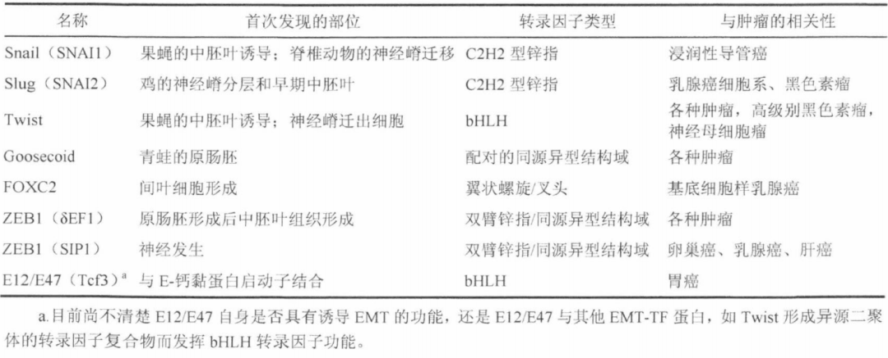
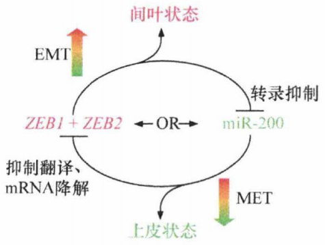
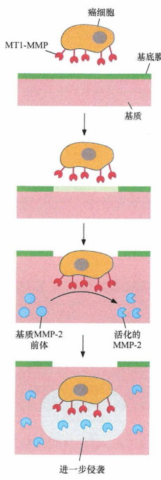
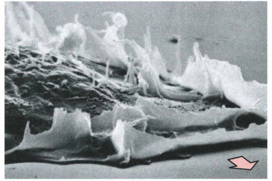
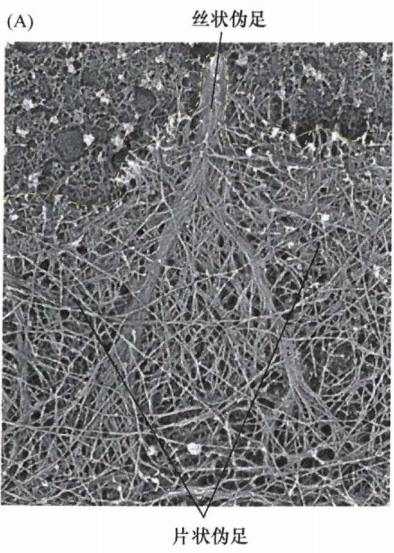
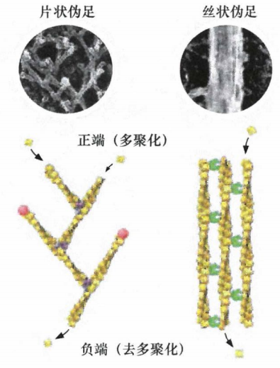
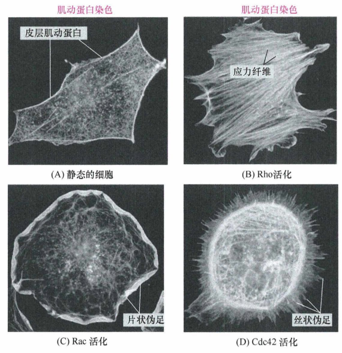
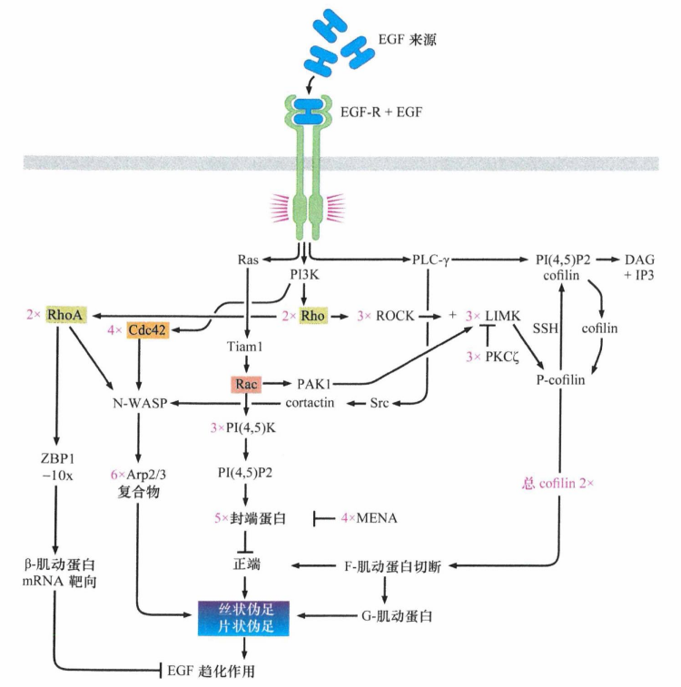
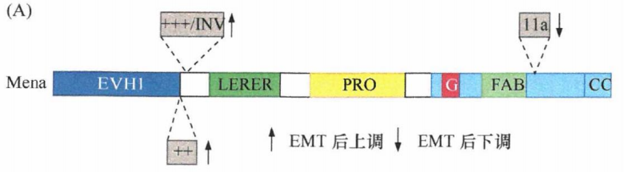
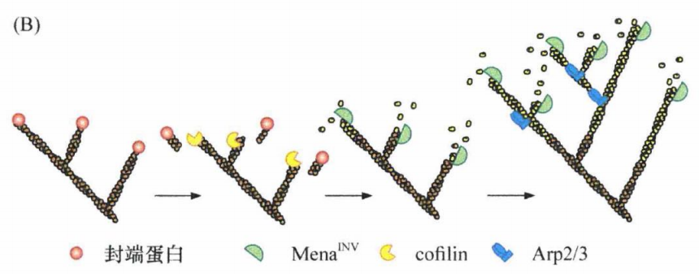

# 第十四章 《癌生物学》第十四章（3）上皮间叶转化（下）

**往期回顾**
 [《癌生物学》第九章（1） p53——抑癌基因](http://mp.weixin.qq.com/s?__biz=Mzg4NjA5Mzg2Mw==&mid=2247487247&idx=1&sn=50b6eaf0623c0c134f4c6588f68c3689&chksm=cf9fae47f8e82751bc562b5867da4f7cbecc9cfcd3bb65c3ea19891184fc6f4bd5cccf590299&scene=21#wechat_redirect) [《癌生物学》第九章（2）  P53水平的调控](http://mp.weixin.qq.com/s?__biz=Mzg4NjA5Mzg2Mw==&mid=2247487248&idx=1&sn=f33178b9d3428da2eb7ec91e7fe1e8f6&chksm=cf9fae58f8e8274e3234ef693fd33bda4ab3a62f6f3e790ea677a4dbe61b2b87e945202fb99d&scene=21#wechat_redirect) [《癌生物学》第九章（3）  P53的生物学功能](http://mp.weixin.qq.com/s?__biz=Mzg4NjA5Mzg2Mw==&mid=2247487249&idx=1&sn=812b0a64097fabf21da4b79650fe668d&chksm=cf9fae59f8e8274f0f4165f157155304db6f91b85bc141e38330e8b09c94173ff44a8e03718c&scene=21#wechat_redirect) [《癌生物学》第九章（4）  凋亡与肿瘤](http://mp.weixin.qq.com/s?__biz=Mzg4NjA5Mzg2Mw==&mid=2247487251&idx=2&sn=c670121fa3e55e6eac50a606096bd292&chksm=cf9fae5bf8e8274d404393647fc7eca19b7f54bdac964ad16003b9b0f5f9eeaf767e843dcecb&scene=21#wechat_redirect) [《癌生物学》第十章（1） 肿瘤细胞无限增殖的两个障碍](http://mp.weixin.qq.com/s?__biz=Mzg4NjA5Mzg2Mw==&mid=2247487501&idx=1&sn=3923a4a34cbabaf58f5c49f5973e4149&chksm=cf9fb145f8e83853ba49d4d8e6512b681ff674bfdf4724ff3a519130d9f6173242dad0e80132&scene=21#wechat_redirect) [《癌生物学》第十章（2） 端粒和端粒酶](http://mp.weixin.qq.com/s?__biz=Mzg4NjA5Mzg2Mw==&mid=2247487506&idx=1&sn=4e2df94146e3a9328b7ca74b03a573da&chksm=cf9fb15af8e8384c2bdcf218c35b9497ffd1f521e658084df49d4be5f9eed137d39211a67935&scene=21#wechat_redirect) [《癌生物学》第十章（3） 端粒酶的双重角色](http://mp.weixin.qq.com/s?__biz=Mzg4NjA5Mzg2Mw==&mid=2247487507&idx=2&sn=2b23b04530bff885efd741fed554d46f&chksm=cf9fb15bf8e8384d1670f2d518fdc4aa87cd47a756936cca722f2c6b88df16c699570d0cc205&scene=21#wechat_redirect) [《癌生物学》第十一章（1）  肿瘤多阶段发展](http://mp.weixin.qq.com/s?__biz=Mzg4NjA5Mzg2Mw==&mid=2247487819&idx=1&sn=9e5153efeab13f233efce6fcefd01d53&chksm=cf9fb003f8e83915e4fca96afb9676a896222551f89c72698dd51b2a159d2098acaf2db3c0f2&scene=21#wechat_redirect) [《癌生物学》第十一章（2） 对进化论解释肿瘤发展的补充](http://mp.weixin.qq.com/s?__biz=Mzg4NjA5Mzg2Mw==&mid=2247487832&idx=1&sn=5e8fbe85d6c878d01fd5c8123597f738&chksm=cf9fb010f8e83906a15b3a4dde368c45a4878310af6d8ae7cea6ee854219ee36eabe1ca51ae4&scene=21#wechat_redirect) [《癌生物学》第十一章（3）参与肿瘤发展的因素之炎症](http://mp.weixin.qq.com/s?__biz=Mzg4NjA5Mzg2Mw==&mid=2247487874&idx=1&sn=d1adb72c268af79d532a0ede13f52abe&chksm=cf9fb0caf8e839dcdbc8eb23ce9779053eb50f64e7589bab3116b6ee14fb10b048f51388ec44&scene=21#wechat_redirect) [《癌生物学》第十二章（1）DNA损伤的预防](http://mp.weixin.qq.com/s?__biz=Mzg4NjA5Mzg2Mw==&mid=2247487949&idx=1&sn=107054f050f8b4d3404a6e371ddf3194&chksm=cf9fb085f8e839937724d4ada4c21deec6f12551160dd2933522d10f25fae38b9b8ac6f895a3&scene=21#wechat_redirect) [《癌生物学》第十二章（2）基因组损伤的来源](http://mp.weixin.qq.com/s?__biz=Mzg4NjA5Mzg2Mw==&mid=2247487974&idx=1&sn=f78a30cafd41835b2d9b7b52e63a5399&chksm=cf9fb0aef8e839b820ab28b8f4857b6ed209ac34864b16068dc5fdb0c413a2a27b1fa9481ef1&scene=21#wechat_redirect) [《癌生物学》第十二章（3）DNA修复缺陷引发的疾病](http://mp.weixin.qq.com/s?__biz=Mzg4NjA5Mzg2Mw==&mid=2247487974&idx=2&sn=274bb725f72e37dbc9653c58126a3b6a&chksm=cf9fb0aef8e839b8eab9358955de09d65d8a6fb27412a7c8f6eacf5b6b34752eb894c8f01eb1&scene=21#wechat_redirect) [《癌生物学》第十二章（4）癌细胞核型的变化](http://mp.weixin.qq.com/s?__biz=Mzg4NjA5Mzg2Mw==&mid=2247487974&idx=3&sn=c7fabdb23bf2fb1b8d6cb1e8cf231992&chksm=cf9fb0aef8e839b81c81319a584355725e04bab654f99985457158592285553a78527035da9a&scene=21#wechat_redirect) [《癌生物学》第十三章（1） 肿瘤发生类似伤口损伤愈合](http://mp.weixin.qq.com/s?__biz=Mzg4NjA5Mzg2Mw==&mid=2247487990&idx=2&sn=427192f2af09ea8a12bafb6467955c95&chksm=cf9fb0bef8e839a8a174cead45f0dfe45b154efdf3664b5a5c3c21fb245a1072ba0f06f59944&scene=21#wechat_redirect) [《癌生物学》第十三章（2） 间质细胞可促进肿瘤](http://mp.weixin.qq.com/s?__biz=Mzg4NjA5Mzg2Mw==&mid=2247488046&idx=2&sn=0dab3432d2e285c01924c68f4207286d&chksm=cf9fb366f8e83a7038662351ee64dd8e0c0ec3c37d1d888bc962f95f3ce8b700c3dc07614ed2&scene=21#wechat_redirect) [《癌生物学》第十三章（3） 血管生成与肿瘤](http://mp.weixin.qq.com/s?__biz=Mzg4NjA5Mzg2Mw==&mid=2247488050&idx=2&sn=71764e3ce5e022e275c9376f2cfcc725&chksm=cf9fb37af8e83a6caec618df9c4898312199abdd91650c851a65fdfd0c3926f1aa5c6feaf37c&scene=21#wechat_redirect) 
[《癌生物学》第十四章（1）侵袭-转移级联反应](http://mp.weixin.qq.com/s?__biz=Mzg4NjA5Mzg2Mw==&mid=2247488369&idx=2&sn=71dba3c62869c6360198bb74f99218d7&chksm=cf9fb239f8e83b2f25630645fe0c0d33cd8021afaa68d6a6eb88c6366484eda0b2172bea97c7&scene=21#wechat_redirect)
 
[《癌生物学》第十四章（2）上皮间叶转化（上）](http://mp.weixin.qq.com/s?__biz=Mzg4NjA5Mzg2Mw==&mid=2247488371&idx=2&sn=c0b04cd92afc7580ac81d623e743141b&chksm=cf9fb23bf8e83b2d187cc5120c3dbf5d2f05d8f70164698e3b7a0643ccfc2e945541b7683d7b&scene=21#wechat_redirect)
 

 
**前言** ：上一节我们已经学习了EMT的两个内容，今天我们接着学习另外的三个内容：“ **EMT的关键转录因子** ”，“ **细胞外蛋白酶** ”和“ **小Ras样GTP酶** ”。
 

 
 
 
**EMT的关键转录因子**
 
 
像许多复杂的细胞生物学过程一样，EMT也由少量的多效性转录因子(TF)所诱导。通过激活这些转录因子，癌细胞启动了复杂的、多阶段的EMT程序。基质中的异型性信号在癌细胞中诱导这些TF的表达，进而启动EMT程序。
 
目前至少发现了6个EMT-TF, 在特定的上皮细胞中异位表达这些转录因子中的任何一个，都能诱发EMT现象。例如，在脊椎动物的早期胚胎中，Snail首先在一部分外胚层细胞表达，这部分细胞随这原肠胚的形成后来逐渐发育成中胚叶。Snail、Slug和Twist在胚胎发育过程中的表达都可以使上皮细胞转变成可迁移的间质细胞并形成中胚叶。Snail及其同一家族的Slug还参与一些其他的胚胎发育步骤，这些步骤都涉及一种组织向另外一种组织的转变。这些转录因子的真正起源如表1所示。
 
某些这类转录因子也在成人组织、如创伤愈合的组织重塑阶段表达。培养的单层上皮细胞的体外划痕实验能很好地模拟这一现象。Slug在划痕边缘存活的上皮细胞中诱导表达，以使细胞获得运动能力并迁移到划痕处。
 
Snail和Slug(也称为SNAl1和SNAI2)是C2H2型锌指转录因子家族成员。现有研究结果表明，Snail-Slug主要充当转录抑制因子，如这两个因子都可以抑制E-钙黏蛋白基因的表达。
 
胚胎期中Snail及其相关的转录因子Slug和Goosecoid可以被某些基质信号，如TGF-β和Wnts诱导表达。Twist 表达水平同样受TGF-β信号诱导。
 
表1：参与EMT现象的转录因子
  

 
在癌细胞中EMT-TF总是结合在一起表达，提示它们之中没有一个能单独组织起EMT程序相关的、所有细胞生物学改变。实际上，人们发现这些主要调节因子可诱导其他因子的产生，这通常是由一个EMT-TF直接结合到另一个EMT-TF启动子上实现的。例如，Twist可直接结合至Twist、Snail、Slug和Zeb1的启动子上，而为了激活EMT程序，它实际上有赖于Slug的诱导表达。此外，在人类乳腺癌中Slug常常与Twist共表达；在某些乳腺癌细胞中当Twist不再表达时，Slug表达也随之缺失。同样，某些这类转录因子以冗余的方式发挥作用，如Snail、Slug、ZEB1和ZEB2都可以结合在E-钙黏蛋白基因(CDH1)启动子上，并抑制E-钙黏蛋白的表达。与此一致，Twist也可以通过Slug抑制E-钙黏蛋白的表达。
 
在这些EMT-TF中，ZEB1和ZEB2似乎在决定癌细胞是保留上皮细胞状态还是激活EMT程序的过程中发挥决定性仵用。它们发挥这一功能有一部分是通过形成一个双稳态开关，使细胞在很长一段时间内保持在间叶细胞或上皮细胞状态。对 ZEB1和ZEB2 mRNA的测序结果表明，miR-200家族成员靶向其3'UTR(3'非翻译区）的多个位点，致使翻译抑制和（或）这些mRNA降解。
 
下图揭示了一个作为双稳态开关的互相拮抗机制，可使一个细胞相对稳定地处于间叶细胞或上皮细胞状态。一旦一组调节因子占上风（如ZEB1/2或miR-200), 细胞将进入一个方向并关闭另一方向，且长期维持于间叶或上皮细胞状态。原则上，每组调节因子可作用于其他基因和mRNA。例如，ZEB1/2可抑制E-钙黏蛋白和其他上皮细胞基因的表达。不过miR-200的功能似乎仅局限于抑制ZEB1/2的表达上。
  
图1：双稳态开关
 

 
EMT诱导转录因子对细胞性状的影响提示，这些重要的调节因子可以协同性地调节侵袭-转移级联反应中几乎所有的步骤。然而还有一个重要的转移步骤尚未考虑：播散的癌细胞若要形成转移灶，必须先具有肿瘤干细胞(CSC）所具有的肿瘤起始能力。
 
一群实验永生化的MEC通过外源表达EMT诱导转录因子Twist或Snail,进入EMT程序。对照组和两个实验组的MEC细胞通过荧光激活细胞分选技术(FACS)分为CD44 hi CD24 lo 和 CD44 lo CD24 hi 两个细胞亚群。 在培养的对照组细胞中，只有很 小一部分细胞具有干细胞特征，而外源表达Twist或Snail则使原先为非干细胞的这部分细胞群转变为 CD44 hi CD24 lo 细胞群，这部分细胞亚群中包含了所有的干细胞。
 
另外一个实验显示了更有说服力的证据：利用FACS将永生化的人MEC区分为两个细胞亚群，一个亚群包含干细胞( CD44 hi CD24 lo ), 另一个亚群包含极少干细胞( CD44 lo CD24 hi ) 。当定量分析这两个细胞亚群的mRNA水平时发现，与非干细胞亚群相比，干细胞富集亚群中间叶标志表达水平显著提高，同时一组EMT-TF的mRNA表达水平也明显增加。这里EMT诱导转录因子与干细胞宫集状态之间的关系反映了自然存在的、内源性转录调节，而不是由实验引入基因而导致的。
 
不过这些实验并不能证明EMT-TF能诱导产生真正的干细胞，而不是与真正干细胞共存于同一细胞亚群的其他细胞。在此情况下，乳腺重建实验则更有启示性。这一实验评价少量的植入MEC形成完整的乳腺导管树（即乳腺的正常结构）的能力。当来自小鼠乳腺的MEC, 瞬时外源表达Slug和Sox9 (第二个协同转录因子)时，将其植入已清除其他细胞的乳腺基质脂肪垫中，其形成乳腺导管树的能力与未表达这些转录因子时相比提高了100倍以上。
 

 
 
 
**细胞外蛋白酶**
 
 
恶性细胞最显著的特征是具有侵袭邻近细胞层的能力。这种行为需要癌细胞重塑周围的组织微环境，在细胞外基质 (ECM) 中开辟道路并推开其他细胞。
 
导致这些复杂改变的最重要的效应分子是 **基质金属蛋白酶** **(MMP)** 。在肿瘤中被募集的间质细胞主要是巨噬细胞、肥大细胞和成纤维细胞，这些细胞本身而不是癌细胞，但能够分泌大量的蛋白酶。通过溶解组织中包绕在细胞周围的厚厚的基质分子，MMP为细胞的移动创造了空间。被MMP降解的ECM组分包括纤维蛋白原、黏蛋白、层粘连蛋白、胶原及蛋白聚糖等。在降解ECM组分的进程中，MMP 还可以动员和激活特定的生长因子，这些生长因子本来以非激活的形式包绕在ECM或细胞表面。
 
与这些分泌型MMP功能互补的一个关键分子是 **MT1-MMP ( 膜型-1 MMP)** , 它直接锚定于癌细胞质膜表面，切割、降解细胞外基质成分、细胞表面黏附分子（如钙黏蛋白和整合素）及生长因子受体和趋化因子。它还可以裂解失活型的酶原（如前MMP-2) 使之转变成有酶活性的MMP分子 (MT1-MMP 是 6 种细胞膜锚定 MMP之一，因此只能裂解邻近细胞产生的底物蛋白）。
  
图2：MT1-MMP 与 MMP-2 的合作
 

 
基底膜是癌细胞侵袭过程中首先遇到的障碍，它具有直径仅40nm的小孔。细胞可通过胞质变形来挤过那些小孔，而细胞核相对较僵硬，因此决定了细胞能穿过的最小孔径。细胞核直径通常在3~10µm, 较基底膜小孔的孔径大了约100倍。这是基底膜溶解对于癌细胞侵袭过程至关重要的原因。
 
MT1-MMP活性在基底膜崩解过程中发挥主导作用，它在细胞表由不同位点的分布密度不同，分布集中的位点最初被称为足小体, 由于这一结构参与了癌细胞侵袭, 近来常被称为侵袭性伪足。在恶性进展早期，癌细胞表面的MT1-MMP可切割赋予基底膜刚性作用的IV型胶原蛋白。基底膜的疏松化使癌细胞开始侵袭下方基质。一旦到达基质，侵袭的癌细胞被相互交联的I型胶原纤维网所阻碍，此时MT1-MMP再一次发挥关键作用。MT1-MMP降解I型胶原蛋白并切割活化基质来源的不具活性的酶原 (MMP-2 前体)。活化的MMP-2在细胞周围空间中进一步将I型胶原蛋白切割成低分子量片段。若没有这些步骤，细胞外基质中的高密度I型胶原纤维网将阻断癌细胞侵袭。
 
几个研究比较清楚的胚胎性转录因子促进EMT进展的主要原因之一就是促进癌细胞合成并释放MMP(主要是MMP-2和MMP-9)。已知大量的MMP来源于肿瘤基质细胞，如广泛研究的MMP-9, 主要由肿瘤侵袭前沿的巨噬细胞、中性粒细胞和成纤维细胞表达。体外实验表明MMP-9能够降解胶原，特别是胶原IV、V、XI和XIV 。胶原是ECM(包括基底膜)的关键组成部分。MMP-9降解的其他底物包括层粘连蛋白(基底膜另一种重要组成部分)、趋化因子、纤维蛋白原和潜伏性TGF-β1。后两者经MMP切割后，由静息型转变为活化型。各种募集的炎性细胞产生多种分泌性蛋白酶，这在很大程度上解释了它们在癌细胞侵袭中的作用。
 
MMP广泛的功能表明其酶活性至少在正常组织中必须受到严密的调控。如同 caspase一样，可溶性的MMP(如MMP-2和MMP-9)最初以无酶活性的酶原形式合成，只有被其他蛋白酶剪切后才具有活性。一类称为组织金属蛋白酶抑制物（TIMP)的蛋白也具有负调控作用，TIMP结合MMP后，使其转变成非活化型构象。
 

 
 
 
**小Ras样GTP酶**
 
 
细胞外蛋白酶在生物化学水平解释了侵袭的癌细胞如何清除前进道路上的细胞外基质及组织障碍。但它们并不能说明单个癌细胞如何通过清除后的道路前行，即细胞运动迁移能力。
 
当培养细胞暴露于各种生长因子后能诱导细胞运动（这些除了具有促有丝分裂原活性外还能促进细胞运动的生长因子被称为促运动因子）。对于上皮细胞，诱导运动能力最强的因子通常是肝细胞生长因子(HGF), 它能够诱导单层培养细胞向各个方向运动，又称为分散因子(SF)。大部分上皮细胞表达HGF的受体——Met,这类细胞在HGF作用下获得运动能力。同样，EGF也能诱导乳腺癌细胞运动。
 
细胞运动过程不但涉及细胞不同部位的肌动蛋白骨架的连续重构，而且包括迁移细胞和细胞外基质(ECM)间的黏附和解黏附过程。对于培养细胞，ECM是铺在细胞下方、培养皿表面的蛋白质网络。
  
图3：片状伪足
 

 
细胞运动过程可以分为几个不同的步骤。首先，细胞的细胞质向运动方向延伸。这一延伸过程包括从细胞表面隆起宽而扁平的薄片样片状伪足。细胞表面蛋白酶能选择性地降解迁移细胞前沿的ECM蛋白。在此过程中，细胞在迁移前沿的ECM和片状伪足之间重新部署整合素分子，以形成新的黏附点；同时，细胞后沿的这种整合素黏附结构解离，由此释放细胞质和质膜，将其重新部署到迁移细胞的前沿。
  
图4：固体附着层上的细胞移动
 

 
从片状伪足凸出的麦芒状突起结构，称为丝状伪足, 能使细胞向前方扩展并启动由整合素介导的黏着斑形成。一旦黏着斑形成，将为细胞提供生存信号，同时使其获得与附近细胞外基质紧密物理接触的牵引力。有提示，丝状伪足通过使外渗癌细胞与邻近组织的细胞外基质形成黏着斑，在微小转移灶初始形成过程中发挥重要作用。如同片状伪足一样，丝状伪足的形成也是通过肌动蛋白纤维重新组装而成，每一丝状伪足的细胞膜下都有紧密排列成束状分布的肌动蛋白纤维。
  
图5：丝状伪足
 

 
如下图所示，高倍镜下显示片状伪足中的肌动蛋白纤维（左上），通过在正端加上肌动蛋白单体（黄球）进行延伸，并在回撤的“负端”通过释放单个肌动蛋白单体而解离。同样的动态机制也促使丝状伪足向前延伸（右）。形成片状伪足的分枝状纤维网络的辅助蛋白用粉色表示，而形成丝状伪足的紧密成束、平行排列的肌动蛋白纤维的辅助蛋白用绿色表示。
  
图6：细胞表面重建
 

 
细胞的形状和运动过程由Rho蛋白家族的一组Ras相关蛋白调控。Rho蛋白像Ras一样，也可进行两相转换，当结合GTP时处于活化状态，当水解GTP成GDP时处于失活状态。人类细胞中已经发现了20多个Rho蛋白家族成员。它们分为3个亚家族—— **Rho蛋白、Rac蛋白和Cdc42** 。像Ras蛋白一样，大多数Rho蛋白家族成员的C端具有脂类基团，使其能锚定在细胞内膜上，而每一成员在细胞形状和运动过程中具有特定的作用。
  
图7：类Rho蛋白的作用
 

 
看起来在肌动蛋白细胞骨架构象改变过程中，每一成员均在整个细胞内发挥作用。事实上，细胞运动的复杂过程依赖于这类蛋白中的每一成员在细胞质内很小范围的局部激活，并随后促进细胞作为一个整体向一个方向或另一个方向移动。这种局灶性的激活似乎依赖于特定Rho GEF (鸟嘌呤核苷酸交换因子）的亚细胞定位。例如，将Rho蛋白从非激活的GDP结合状态转换为具有活性的GTP结合状态的Sos。
 
酪氨酸激酶受体，如PDGF和EGF受体与这些Rho家族蛋白成员之间的信号传递机制目前还不清楚。但是已知这些受体通过激活Ras,活化其下游至少3个信号通路，包括Raf、PI3K和Ral-GEF效应子，它们中的一部分随后通过调节Rho蛋白影响细胞运动。另外，激活的Ras似乎还结合并活化Tiam1, 它可作为Rac的鸟嘌呤核苷酸交换因子(GEF)。GEF可使小G蛋白（如Ras和Rho) 与GDP解离并结合GTP, 从而激活这些G蛋白的信号通路。因此，Tiam1和Rac可以作为Ras的下游效应蛋白，通过调节片状伪足形成而影响细胞运动能力。
 
从细胞运动的角度来说，PI3K是Ras蛋白最重要的效应蛋白。通过产生磷脂酰肌醇(3,4,5)三磷酸(PIP3),PI3K使细胞质膜的胞质即发生化学结构改变，从而使多种胞质蛋白通过PH结构域与之结合。这些蛋白中包含许多GEF，它们负责激活Rho家族的G蛋白成员。这些Rho GEF锚定于质膜后发生活化。
 
似乎Tiam1通过结合活化的Ras和（或）PlP3而激活其功能。通过激活Rac蛋白，Tiam1 GEF促进迁移细胞前沿的肌动蛋白局部多聚化，从而形成对细胞运动至关重要的片状伪足结构。
 
Rho-GEF激活的其他类Rho蛋白在细胞运动过程的其他方面发挥功能。例如，Rho蛋白(如RhoA和RhoB)功能与Rac蛋白作用相似，促进细胞前沿和细胞外基质间新的黏附点的形成。反之亦然，形成的新的黏着斑也促进Rac活化，提示在细胞连续向前移动中形成了自我维持的正反馈环路。Rac和Cdc42蛋白似乎也能诱导一些分泌蛋白酶的表达，主要是基质金属蛋白酶。
 
细胞体的收缩(帮助细胞滞后端向前沿端移动)对细胞的定向运动同等重要。这种收缩主要由Rho亚家族成员控制。通过促进胞质中的肌动蛋白成束分布，Rho 蛋白能产生所谓的“应力纤维”结构，从而调节胞质的收缩性。
 
Cdc42代表第三类Rho样蛋白亚家族，它有特殊的功能：能诱导指状丝状伪足的形成。这些丝状伪足通过集结黏着斑而促进细胞运动，随后使前行细胞在ECM中立地生根。另外，激活的Cdc42还能不依赖于对丝状伪足的特定影响而促进细胞运动。
 
更为复杂的是，Rho、Rac和Cdc42在不同类型的细胞中作用也不相同。例如，在正常上皮细胞（不是成纤维细胞）中，Rac和Rho亚家族蛋白负责维持E-钙黏蛋白依赖性的细胞间黏附连接，这些连接对维持上皮细胞的片层结构、固定上皮细胞至关重要。但是在转化的上皮细胞（如发生了部分或完全EMT转换的结肠癌细胞）中，Rac促进细胞运动。在不动的细胞内，Tiam1(Rac交换因子）定位于黏附连接中；而在迁移的细胞内，Tiam1定位于片状伪足和相关的膜皱褶处。
 
EGF诱导细胞运动环路如下图所示，癌细胞中特定蛋白过表达的程度在图中用粉色数字标示，而表达下调的程度用绿色数字标示。某些蛋白，如cofilin, 在细胞特定区域作用于存在的肌动蛋白纤维，而封端蛋白阻止纤维过度延伸。cortactin与皮质肌动蛋白相关，负责组织片状伪足的侵袭前沿。Rho GTPase家族的成员在图中用黄色和橙色背景标示。事实上，这张图中EGF刺激的所有细胞运动相关环路都可能参与其他促运动因子，如HGF和PDGE诱导的细胞运动过程。
  
图8：EGF诱导细胞运动环路
 

 
EMT过程主要是通过各种调节细胞骨架、蛋白酶合成及癌细胞运动能力的效应蛋白而完成的。这里主要讨论 **Mena蛋白** ，又称ENAH蛋白。
 
当癌细胞发生EMT时，控制选择性剪接模式的某些剪接因子表达发生明显改变。例如，某些利于上皮细胞表型的剪接因子表达被抑制，导致合成某些选择性剪接mRNA,其编码的蛋白质促进细胞向间叶表型转变。Mena就是这样一个mRNA。正常合成的Mena蛋白形式被包含侵袭相关结构域的Mena INV 所代替。 Mena INV 随后影响一系列与细胞侵袭相关的行为，包括影响细胞对EGF诱导的细胞运动和跨内皮侵袭的反应性。
 
通常在正常上皮细胞和非转移性癌细胞中合成的Mena蛋白有多个结构域。如下图所示，除了3个浅棕色结构域外，所有带颜色的结构域由特定的mRNA编码（简称为 Mena), 或是由这些带颜色的结构域再加上一个11a片段的mRNA编码(称为Mena11a)。相对的，在发生了EMT的癌细胞内或体内生长的包含外显子INV (也称为+++）和++及缺乏11a片段的癌细胞中，Mena基因的mRNA发生了改变。编码INV外显子的Mena结构域似乎在癌细胞侵袭过程中发挥特别重要的作用。箭头表明了与EMT相关的变化。
  
图9：Mena的结构域变化
 

 
各种形式的Mena蛋白促进肌动蛋白纤维的延伸，这是片状伪足和丝状伪足生长所必需的。下图仅显示了片状伪足的生长过程。正常情况下，封端蛋白(红圈)阻断肌动蛋白纤维的进一步延伸。cofilin(黄色)切断肌动蛋白纤维末端并移除封端蛋白，此后Mena阻止封端蛋白的重新结合，使纤维得以进一步延伸。Mena的INV异构体促进延伸的效率特别高，因此驱动肌动蛋白纤维延伸及片状伪足和丝状伪足的生长。另一个蛋白Arp2/3(蓝色)则使肌动蛋白纤维形成分支，这对片状伪足稳定延伸尤为重要。
  
图10：Mena蛋白的作用
 
 参考书目： 《The Biology of Cancer》（Second Edition）  R.A.Weinberg  著，詹启敏 等  译 
 编辑： 张月明 周健 
 校审： 张健 罗鹏 

 
 ***欢迎点击下方图片进行留言，说出你的看法哦~***
 

 
我知道你 **在看** 哟
 