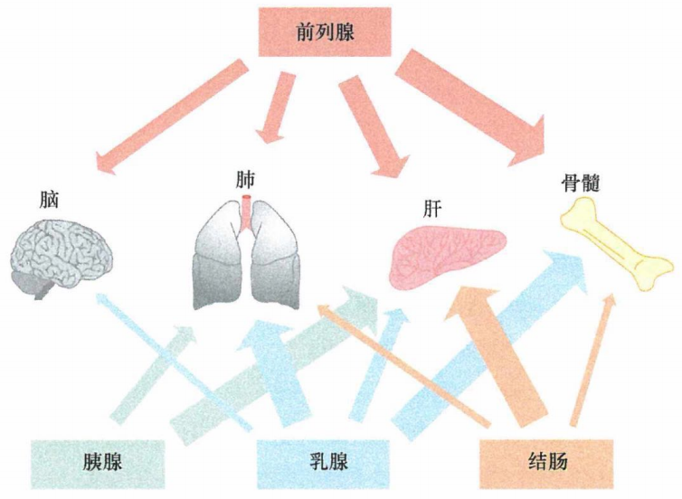
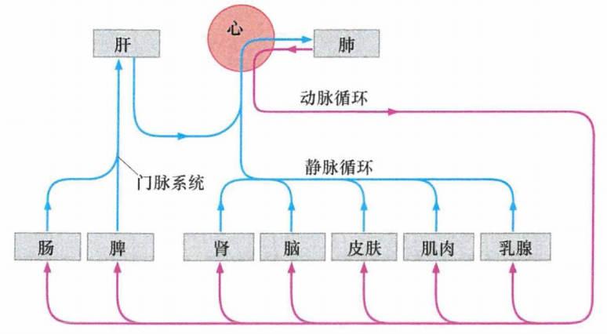
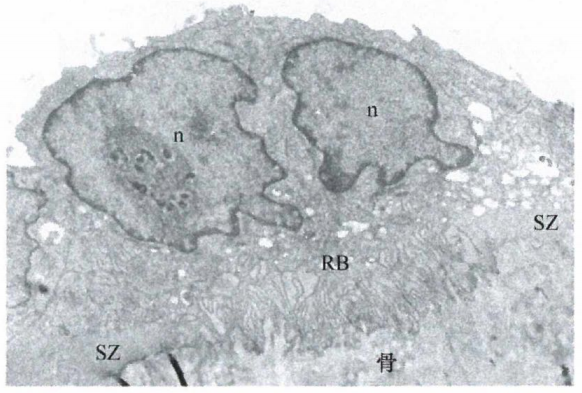
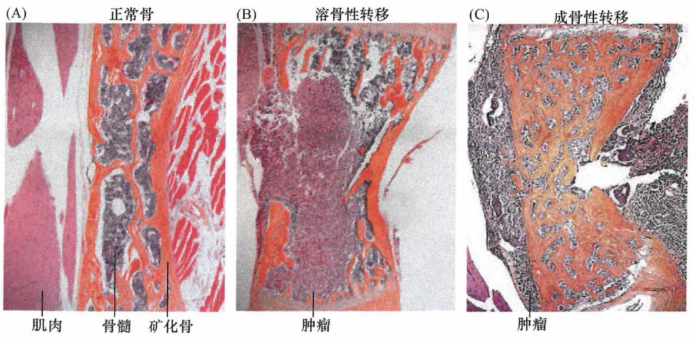
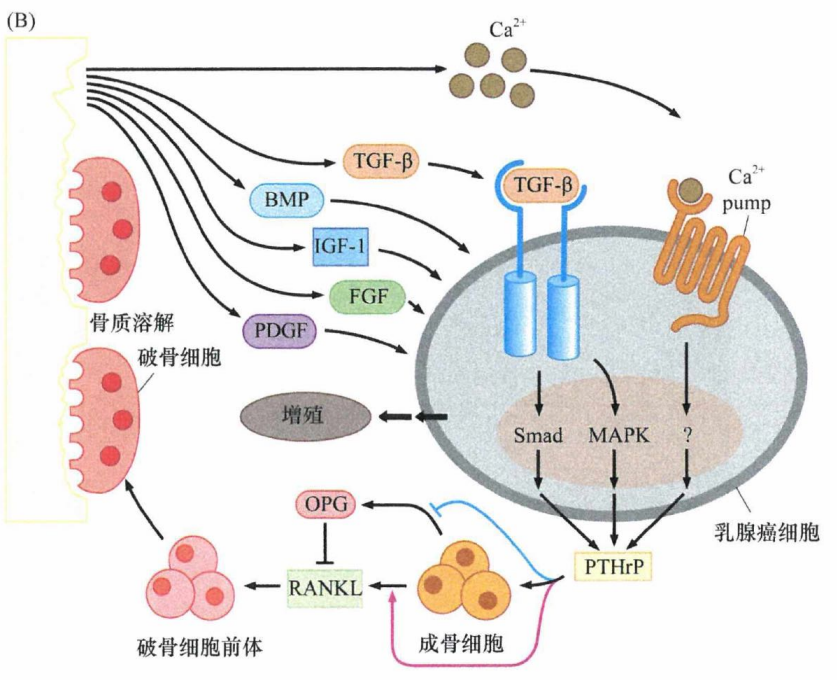
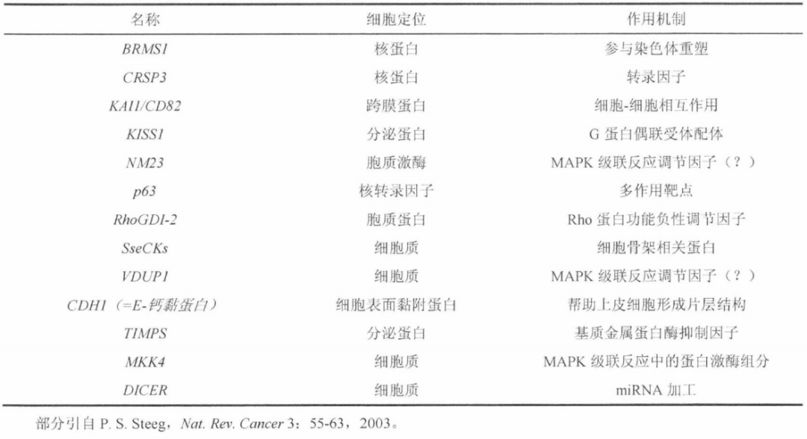
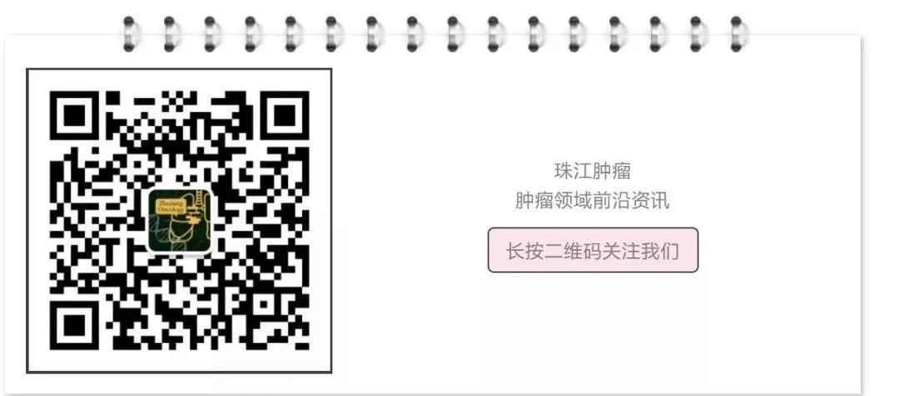
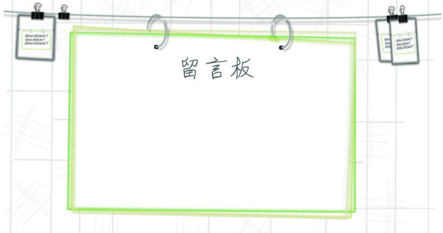

# 第十四章 《癌生物学》第十四章（4）转移的亲组织性和骨转移实例

**往期回顾**
 

 [《癌生物学》第九章（1） p53——抑癌基因](http://mp.weixin.qq.com/s?__biz=Mzg4NjA5Mzg2Mw==&mid=2247487247&idx=1&sn=50b6eaf0623c0c134f4c6588f68c3689&chksm=cf9fae47f8e82751bc562b5867da4f7cbecc9cfcd3bb65c3ea19891184fc6f4bd5cccf590299&scene=21#wechat_redirect) [《癌生物学》第九章（2）  P53水平的调控](http://mp.weixin.qq.com/s?__biz=Mzg4NjA5Mzg2Mw==&mid=2247487248&idx=1&sn=f33178b9d3428da2eb7ec91e7fe1e8f6&chksm=cf9fae58f8e8274e3234ef693fd33bda4ab3a62f6f3e790ea677a4dbe61b2b87e945202fb99d&scene=21#wechat_redirect) [《癌生物学》第九章（3）  P53的生物学功能](http://mp.weixin.qq.com/s?__biz=Mzg4NjA5Mzg2Mw==&mid=2247487249&idx=1&sn=812b0a64097fabf21da4b79650fe668d&chksm=cf9fae59f8e8274f0f4165f157155304db6f91b85bc141e38330e8b09c94173ff44a8e03718c&scene=21#wechat_redirect) [《癌生物学》第九章（4）  凋亡与肿瘤](http://mp.weixin.qq.com/s?__biz=Mzg4NjA5Mzg2Mw==&mid=2247487251&idx=2&sn=c670121fa3e55e6eac50a606096bd292&chksm=cf9fae5bf8e8274d404393647fc7eca19b7f54bdac964ad16003b9b0f5f9eeaf767e843dcecb&scene=21#wechat_redirect) [《癌生物学》第十章（1） 肿瘤细胞无限增殖的两个障碍](http://mp.weixin.qq.com/s?__biz=Mzg4NjA5Mzg2Mw==&mid=2247487501&idx=1&sn=3923a4a34cbabaf58f5c49f5973e4149&chksm=cf9fb145f8e83853ba49d4d8e6512b681ff674bfdf4724ff3a519130d9f6173242dad0e80132&scene=21#wechat_redirect) [《癌生物学》第十章（2） 端粒和端粒酶](http://mp.weixin.qq.com/s?__biz=Mzg4NjA5Mzg2Mw==&mid=2247487506&idx=1&sn=4e2df94146e3a9328b7ca74b03a573da&chksm=cf9fb15af8e8384c2bdcf218c35b9497ffd1f521e658084df49d4be5f9eed137d39211a67935&scene=21#wechat_redirect) [《癌生物学》第十章（3） 端粒酶的双重角色](http://mp.weixin.qq.com/s?__biz=Mzg4NjA5Mzg2Mw==&mid=2247487507&idx=2&sn=2b23b04530bff885efd741fed554d46f&chksm=cf9fb15bf8e8384d1670f2d518fdc4aa87cd47a756936cca722f2c6b88df16c699570d0cc205&scene=21#wechat_redirect) [《癌生物学》第十一章（1）  肿瘤多阶段发展](http://mp.weixin.qq.com/s?__biz=Mzg4NjA5Mzg2Mw==&mid=2247487819&idx=1&sn=9e5153efeab13f233efce6fcefd01d53&chksm=cf9fb003f8e83915e4fca96afb9676a896222551f89c72698dd51b2a159d2098acaf2db3c0f2&scene=21#wechat_redirect) [《癌生物学》第十一章（2） 对进化论解释肿瘤发展的补充](http://mp.weixin.qq.com/s?__biz=Mzg4NjA5Mzg2Mw==&mid=2247487832&idx=1&sn=5e8fbe85d6c878d01fd5c8123597f738&chksm=cf9fb010f8e83906a15b3a4dde368c45a4878310af6d8ae7cea6ee854219ee36eabe1ca51ae4&scene=21#wechat_redirect) [《癌生物学》第十一章（3）参与肿瘤发展的因素之炎症](http://mp.weixin.qq.com/s?__biz=Mzg4NjA5Mzg2Mw==&mid=2247487874&idx=1&sn=d1adb72c268af79d532a0ede13f52abe&chksm=cf9fb0caf8e839dcdbc8eb23ce9779053eb50f64e7589bab3116b6ee14fb10b048f51388ec44&scene=21#wechat_redirect) [《癌生物学》第十二章（1）DNA损伤的预防](http://mp.weixin.qq.com/s?__biz=Mzg4NjA5Mzg2Mw==&mid=2247487949&idx=1&sn=107054f050f8b4d3404a6e371ddf3194&chksm=cf9fb085f8e839937724d4ada4c21deec6f12551160dd2933522d10f25fae38b9b8ac6f895a3&scene=21#wechat_redirect) [《癌生物学》第十二章（2）基因组损伤的来源](http://mp.weixin.qq.com/s?__biz=Mzg4NjA5Mzg2Mw==&mid=2247487974&idx=1&sn=f78a30cafd41835b2d9b7b52e63a5399&chksm=cf9fb0aef8e839b820ab28b8f4857b6ed209ac34864b16068dc5fdb0c413a2a27b1fa9481ef1&scene=21#wechat_redirect) [《癌生物学》第十二章（3）DNA修复缺陷引发的疾病](http://mp.weixin.qq.com/s?__biz=Mzg4NjA5Mzg2Mw==&mid=2247487974&idx=2&sn=274bb725f72e37dbc9653c58126a3b6a&chksm=cf9fb0aef8e839b8eab9358955de09d65d8a6fb27412a7c8f6eacf5b6b34752eb894c8f01eb1&scene=21#wechat_redirect) [《癌生物学》第十二章（4）癌细胞核型的变化](http://mp.weixin.qq.com/s?__biz=Mzg4NjA5Mzg2Mw==&mid=2247487974&idx=3&sn=c7fabdb23bf2fb1b8d6cb1e8cf231992&chksm=cf9fb0aef8e839b81c81319a584355725e04bab654f99985457158592285553a78527035da9a&scene=21#wechat_redirect) [《癌生物学》第十三章（1） 肿瘤发生类似伤口损伤愈合](http://mp.weixin.qq.com/s?__biz=Mzg4NjA5Mzg2Mw==&mid=2247487990&idx=2&sn=427192f2af09ea8a12bafb6467955c95&chksm=cf9fb0bef8e839a8a174cead45f0dfe45b154efdf3664b5a5c3c21fb245a1072ba0f06f59944&scene=21#wechat_redirect) [《癌生物学》第十三章（2） 间质细胞可促进肿瘤](http://mp.weixin.qq.com/s?__biz=Mzg4NjA5Mzg2Mw==&mid=2247488046&idx=2&sn=0dab3432d2e285c01924c68f4207286d&chksm=cf9fb366f8e83a7038662351ee64dd8e0c0ec3c37d1d888bc962f95f3ce8b700c3dc07614ed2&scene=21#wechat_redirect) [《癌生物学》第十三章（3） 血管生成与肿瘤](http://mp.weixin.qq.com/s?__biz=Mzg4NjA5Mzg2Mw==&mid=2247488050&idx=2&sn=71764e3ce5e022e275c9376f2cfcc725&chksm=cf9fb37af8e83a6caec618df9c4898312199abdd91650c851a65fdfd0c3926f1aa5c6feaf37c&scene=21#wechat_redirect) 
[《癌生物学》第十四章（1）侵袭-转移级联反应](http://mp.weixin.qq.com/s?__biz=Mzg4NjA5Mzg2Mw==&mid=2247488369&idx=2&sn=71dba3c62869c6360198bb74f99218d7&chksm=cf9fb239f8e83b2f25630645fe0c0d33cd8021afaa68d6a6eb88c6366484eda0b2172bea97c7&scene=21#wechat_redirect)
 
[《癌生物学》第十四章（2）上皮间叶转化（上）](http://mp.weixin.qq.com/s?__biz=Mzg4NjA5Mzg2Mw==&mid=2247488371&idx=2&sn=c0b04cd92afc7580ac81d623e743141b&chksm=cf9fb23bf8e83b2d187cc5120c3dbf5d2f05d8f70164698e3b7a0643ccfc2e945541b7683d7b&scene=21#wechat_redirect)
 

 
**前言** ：前几节描述的侵袭和转移播散机制从整体上解释了侵袭-转移级联的大多数阶段。看起来似乎各种各样的侵袭转移性癌细胞利用一组通用机制发生播散转移。然而更重要的是侵袭-转移级联的最后步骤——克隆形成。这一小节我们就主要来讲一下 **转移的亲组织性** 和 **骨转移** 的实例。
 

 
 
 
**肿瘤转移的亲组织性**
 
 
很多类别的癌细胞以一种非常相似的方式完成侵袭－转移级联的早期步骤，但不同类型的癌细胞形成克隆的方式则相差很大。因此，成功适应骨髓环境的转移性乳腺癌细胞与在骨髓中成功克隆化的前列腺癌细胞间具有很大差异。另外，在骨髓中成功克隆化的乳腺癌细胞所要经历的变化，与在脑中或肺中克隆化的乳腺癌细胞也有很大区别。
 
大量的证据支持转移性癌细胞在特定组织中形成克隆是高度特异的过程。①75%的年轻的甲状腺乳头状癌患者伴随明显的淋巴结转移，但其中仅3%的患者最终发生远处转移。因此，适应淋巴结的转移性甲状腺癌细胞并不能在体内其他组织形成转移灶。②同样，直径大于1cm的十二指肠癌具有高频的淋巴结转移，但是很少发生肝转移，而肝转移是附近的结肠来源肿瘤的常见转移位点。③把人淋巴结转移灶中分离的癌细胞注射至免疫缺陷鼠的静脉系统，更倾向于在鼠的淋巴结中生长而不是在其他位置形成克隆。④手术切除孤立的、较大的结肠癌肝、肺转移灶通常能增加患者数年的无病生存时间，尽管这些患者的循环中携带较大数量的转移性细胞（包括已经在一个或几个器官中拥有克隆形成能力的细胞）。⑤小鼠黑色素瘤细胞优先在肺部形成转移，而乳腺癌易转移至肺和骨。
 
转移性前列腺癌细胞在骨髓比在肝脏或胰腺更容易形成克隆，这提示正常前列腺上皮细胞的分化程序对癌细胞转移至特定的组织有很强的影响。前列腺癌细胞更容易到达骨髓，表明它们需要较少的改变就能适应这个地方。相反，它们不容易到达其他器官，如肝脏或胰脏，因为在那些器官成功形成克隆需要经历更为复杂的适应过程。下图中箭头的宽度提示原发性腺癌发生临床明显转移灶的相对 比例：
  
图1：原发瘤和它们的转移倾向性
 

 
关于在一个器官或其他器官形成转移灶的偏好性，1889年英国病理学家Stephen Paget提出 **“种子-土壤“假说** ，他把癌细胞比喻成植物播散的种子。在对 735 例乳腺癌患者进行的临床研究中，Paget 发现这些患者的转移形成模式既不能通过体内随机播散来解释，又不能用乳腺的血液循环模式来解释。因此他提出转移性癌细胞（种子）仅在特定的适宜组织（土壤）中生存。
 
但是“种子-土壤”假说并不能解释所有类型人类肿瘤的转移模式。实际上，在某些情况下，转移到某些器官的偏好性可能与 **连** **接原发癌的血管和转移位置的布局** 相关。如结肠癌细胞有强的肝转移倾向，这恰恰反映了这些癌细胞通过门静脉系统（它收集下消化道和脾脏的静脉血）离开肠道后很快进入肝脏，几乎难以避免地滞留在肝内门静脉系统后的毛细血管床中。甚至即使单个转移性结肠癌细胞的克隆化效率极低，这些被困在肝脏中的癌细胞的绝对数目也可以保证随着时间的推移在肝脏这一特定靶器官形成大量的转移灶。
  
图2：门脉循化和肝转移
 

 
相同的逻辑可以解释乳腺癌为什么通常在肺部形成转移灶。与结肠癌细胞的转移一样，游走的乳腺癌细胞并没有发现肺部能为它们提供特别适宜的环境，单个癌细胞成功在肺部形成克隆的概率很低。但是，有些转移灶会最终在肺脏形成，这仅仅是因为太多的细胞被物理性地滞留在这一组织中了。这一逻辑提示，转移至器官的概率一般由两个参数决定：转移的癌细胞在组织中物理性滞留的频率及癌细胞适应组织中新的微环境并形成克隆的能力。
 
"种子-土壤"假说面临最尴尬的地方是它不能解释 为什么对侧转移很少发生。例如，一侧乳腺原发瘤中播散的癌细胞应该找到对侧乳腺，因为它能提供最适宜克隆生长的微环境。事实上，同出现在乳腺外的转移相比，仅2%的乳腺癌患者出现对侧转移。相似地，原发性肾癌也很少在对侧出现转移。一个可能的解释是，除了在适合的组织种植下来以外，癌细胞优先在具有活化基质的组织中生根，如慢性炎症或创伤愈合位点。
 
有迹象表明，某些 **特定的病理过程（如局部损伤）** 能使本来不适合克隆形成的组织变得适宜克隆形成。这提示肿瘤患者机体内的慢性炎症有时可能为转移性癌细胞营造适宜的微环境，因为它们能提供一系列的促分裂和营养信号。
 
还有其他理论用来解释癌细胞转移的组织倾向性。例如，靶器官释放特定化学信号—— **化学趋化因子** ，它们能募集循环中游走的癌细胞。作为免疫系统正常运转的一部分，这种趋化作用可以确保循环中的各种免疫细胞归巢到特定的组织中。在一组实验中，当B16鼠黑色素瘤细胞异位表达CXCR4趋化因了受体时，它转移到肺的能力增加了10倍。当在这些黑色素瘤细胞中特异性高表达CXCR7受体时，显示出明显增强的淋巴结转移能力，因为这一机制正是正常淋巴细胞归巢至淋巴结的机制。事实上，由于这些趋化因子激活受体通常为癌细胞提供促分裂和生存信号，很难知道这些受体是诱导转移性癌细胞到特定的组织，还是仅仅当细胞停留在某一组织而非其他组织后，促进了这些细胞的生存和增殖。
 
根据其他的转移器官特异性模型机制，各种组织中形成的毛细血管床在管腔面表达组织特异性分子。这些分子为表达特定黏附分子（如整合素）的癌细胞表面提供锚定位点。这种模型称为“ **血管邮政编码** ”理论，因为它表明不同组织血管腔面在化学形式上具有类似于邮递系统的特定归巢地址。但这种模式没有考虑到癌细胞通常被血小板团包围, 这些血小板能封闭癌细胞和内皮细胞之间的直接相互作用。
 
总之，各种不同的观察提示转移的细胞播散全机体内许多组织器官，这种播散受血管系统布局的影响。一旦癌细胞到达不同的位点，癌细胞通常在可提供特定的趋化因子、营养因子和分裂原的组织中存活并最终形成克隆。然而在一些情况下，这些细胞能成功地在不适宜栖息的组织场所形成肉眼可见的转移，仅仅是因为血液循环使大量的癌细胞到达这些位点。
 

 
 
 
**骨转移实例**
 
 
骨转移的发生发展在某些方面代表了我们对转移性癌细胞在特定组织微环境快速生长的生物化学和生物学机制的理解。西方国家最常见的几种肿瘤（包括肺癌、乳腺癌和前列腺癌）都表现出很强的骨转移倾向。实际上，晚期乳腺癌和前列腺癌患者往往都会发生骨转移。
 
正常情况下，骨的不断更新是由破骨细胞和成骨细胞协同完成的，前者可以破坏矿物化的骨骼，后者负责重建骨骼。破骨细胞的功能首先是对骨骼去矿物化，即溶解磷酸钙晶体，接着是降解新暴露的作为磷酸钙晶体沉积有机支架的细胞外基质，这一过程通常称为重吸收。随后成骨细胞很快移至骨溶解部位重建骨骼，这一过程包括新细胞外基质的组装和磷酸钙晶体在新基质间隙中沉积。这两种细胞在正常情况下以密切协作的方式工作。
 
扫描电镜显微照片在高倍数下显示破骨细胞如何吸收骨质的细节。下图的切片横穿破骨细胞(多个核，n)及下方骨质，显示出破骨细胞复杂的褶皱边缘(ruffled border, RB), 在边缘破骨细胞分泌因子溶解骨质中的矿物质成分，以及酸性蛋白酶以降解在去矿化作用下暴露的富含胶原的细胞外基质。接触区域周围是环状密闭区域(sealing zone, SZ), 包含了大量肌动纤维蛋白，作为密封圈将这些分泌产物限制在破骨细胞和骨之间的小范围区域。
  
图3：破骨细胞介导的骨降解
 

 
大部分类型的转移癌细胞本身并不能重塑骨骼结构。相反，它们调控并利用骨组织的这两类细胞改变骨骼形态。所以，乳腺癌细胞倾向于激活破骨细胞，导致溶骨性转移，即引起骨质溶解的转移。然而，前列腺癌细胞往往是激活成骨细胞，产生成骨性病灶。在这种情况下，不成熟矿物化的骨组织（有时称为类骨质) 聚集在转移灶附近。如下图所示，可清晰地分辨矿化骨（橘色）、周围的肌肉（亮红色）和骨髓（深紫色）。
  
图4：溶骨性和成骨性转移
 

 
实际上，这两种生物学行为代表了骨代谢平衡的两个极端，因为这两种类型的癌都或多或少的同时激活成骨和破骨细胞。例如，虽然晚期乳腺癌患者以溶骨性转移为主，但是大约1/4患者的骨骼也可见明显的成骨性病灶。同样，前列腺癌导致的成骨性损伤中偶尔也可见散在的破骨性转移。除了骨髓瘤（骨髓瘤是可分泌抗体的B细胞肿瘤，只能产生溶骨性损伤）以外，其他肿瘤的骨转移灶都可见这两种类型的骨转移。
 
成骨细胞和破骨细胞的紧密合作是通过（至少部分通过）生长因子信号的交换介导的。 **RANK** (NF-κB受体激活因子）配体，简称RANKL,是破骨细胞的一个重要诱导因子。 **RANKL** 由成骨细胞合成，分布于细胞的表面。当表达RANK受体的破骨细胞前体与成骨细胞表面的RANKL分子接触时，会导致破骨细胞表面RANK受体的活化及破骨细胞前体成熟为功能性的破骨细胞。同时，成骨细胞可合成一种可溶性的诱饵受体，称为 **骨保护素(OPG)** , 它可以结合RANKL,并在它成功激活破骨细胞表面的RANK受体之前阻断它，其结果是阻断了RANKL-RANK信号通路，抑制破骨细胞的成熟。因此，RANKL(激活作用）和OPG(抑制作用）信号的平衡决定了破骨细胞的激活状态。
  
图5：破骨细胞和成骨细胞
 

 
成骨细胞和破骨细胞之间的动态相互作用为转移到骨的癌细胞发挥作用提供了支持。它们向骨骼的趋化作用最终源于构成磷酸盐沉积有机骨架的非矿化的胶原性细胞外基质。骨细胞外基质富含可促进多种癌细胞生长的促有丝分裂因子和营养因子。因此，癌细胞通过激活骨的去矿物化进入到可作为各种因子储藏库的骨细胞外基质中，这些因子可以支持其自身的繁殖和存活。
 
转移性癌细胞通过滋养骨髓的血管到达骨骼。一旦抵达骨骼，它们便黏附于骨髓面的特化基质细胞。特别是转移性乳腺癌细胞，一旦到达骨骼，它们就恢复了其正常前体——乳腺上皮细胞(mammary epithelial cell, MEC)的行为学特征。在哺乳期，乳汁产生过程中，乳腺中的MEC形成分泌甲状旁腺素相关肽(PTHrP) 的小囊泡。PTHrP通过血液循环到达骨，然后启动激活破骨细胞溶解骨的一连串事件，导致钙离子动员。游离的钙离子再通过血液循环进入乳腺，通过MEC进入乳汁。
 
这种生理性的钙动员机制被转移性乳腺癌细胞所利用，以便建立骨转移。乳腺癌细胞黏附于矿化骨表面的基质细胞后，便恢复正常MEC的功能，开始分泌PTHrP。PTHrP直接结合于成骨细胞表面的受体，引发这些细胞释放RANKL。随后RANKL诱导破骨细胞前体分化为活化型的破骨细胞。活化型的破骨细胞降解附近的矿化骨组织，由此释放黏附于骨细胞外基质的大量生长因子。
 
骨细胞外基质释放出来的生长因子，包括PDGF、骨形态发生蛋白(BMP)、成纤维细胞生长因子 (FGF)、胰岛素样生长因子-1(IGF-1) 和 TGF-β, 成为乳腺癌细胞生长的养料并诱导癌细胞分泌更多的PTHrP。PTHrP引发破骨细胞更为严重的骨溶解，导致形成正反馈增强的信号传递系统，被称为“恶性循环”, 在这一过程中TGF-β也发挥了重要的作用。
  
图6：肿瘤骨转移的机制
 

 
破骨细胞在这一循环中的中心性作用为治疗干预提供了一些可能的靶点。最有效的策略来自二磷酸盐化合物, 这种口服药物可被组成骨矿物组分的磷酸盐晶体所吸收，药物分子可以在局部停留长达10年之久。当含有二磷酸盐化合物的骨被破骨细胞溶解时，后者会被释放的二磷酸盐化合物所损伤，导致自身的凋亡。因此，二磷酸盐化合物可用来降低多种溶骨性损伤骨转移癌的损伤程度。
 
可以预测，成骨性损伤依赖于其他的激活成骨细胞而非破骨细胞的信号传递方式。在此情况下，转移性癌细胞释放的生长因子——" **内皮素-1** "(ET-1), 在激活成骨细胞和抑制破骨细胞活性过程中发挥了显著的作用。这样，原发瘤中的前列腺癌细胞释放内皮素，由于其同类受体也表达于这些癌细胞表面，导致了自分泌激活环路的形成。然而，当癌细胞到达骨髓后，它们释放的内皮素也通过异型信号激活成骨细胞，造成这一肿瘤特征性的成骨性病灶。前列腺癌细胞如何促进成骨细胞活化的确切机制还不清楚。可能在矿化骨形成过程中，活化的成骨细胞分泌了大量的生长因子，一些生长因子在成骨性转移中被癌细胞利用。
 

 
 
 
**转移抑制基因**
 
 
与所有精细调控的环路一样，前面已经提到的各种蛋白质一定既包含正性调节因子又包含负性调节因子，以确保精细调控信号的正确输出。由此可以得到这样的结论：细胞内一定存在很多可以抵抗和平衡促进进展期肿瘤侵袭和转移行为的负性调控因子。这些负性调控因子，类似于肿瘤抑制因子，被称为转移抑制基因，这些基因特异性地抑制转移而不影响原发瘤生长。
 
表1：候选的转移抑制基因
  

 参考书目： 《The Biology of Cancer》（Second Edition）  R.A.Weinberg  著，詹启敏 等  译 
 编辑： 张月明 周健 
 校审： 张健 罗鹏 

 
 ***欢迎点击下方图片进行留言，说出你的看法哦~***
 

 
我知道你 **在看** 哟
 