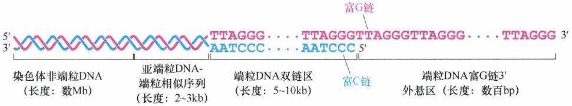
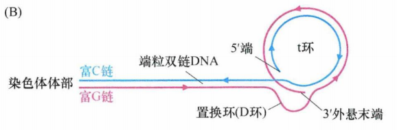
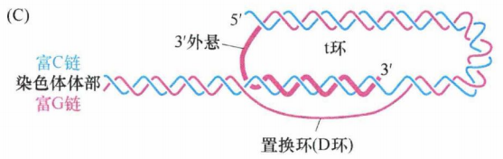
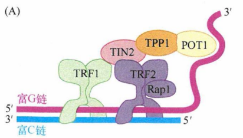
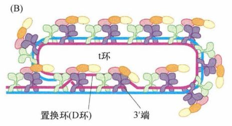
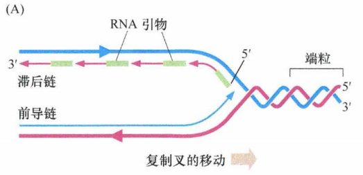
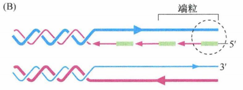
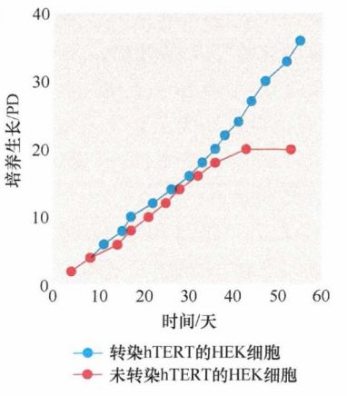
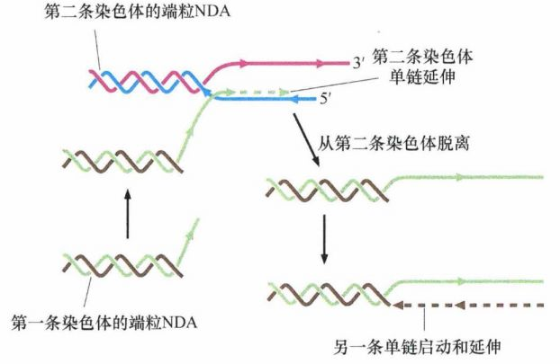
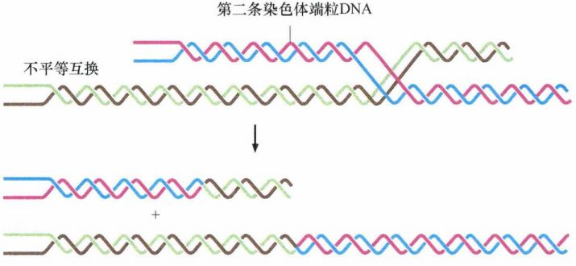

# 第十章 《癌生物学》第十章（2）端粒和端粒酶

**往期回顾**
 

 
[《癌生物学》第五章（1）生长因子与受体（上）](http://mp.weixin.qq.com/s?__biz=Mzg4NjA5Mzg2Mw==&mid=2247485864&idx=1&sn=9d850e610445822a84b6bd6318734094&chksm=cf9fa8e0f8e821f6e93a3c554138b82030bc5adc8d0e47e111ec3d9f0d8424c29bcd49c100c1&scene=21#wechat_redirect)
 
[《癌生物学》第五章（2）生长因子与受体（中）](http://mp.weixin.qq.com/s?__biz=Mzg4NjA5Mzg2Mw==&mid=2247485893&idx=3&sn=e4b521e3cf4ca5cb85a3686ca8bfbd40&chksm=cf9fa88df8e8219bd3ea563f1eb3fd4917188ae6c71d9a3427d3dcc30e1ffaadbafaf744c2fb&scene=21#wechat_redirect)
 
《癌生物学》第五章（3）生长因子与受体（下）
 
[《癌生物学》第六章（1）酪氨酸磷酸化的调控作用](http://mp.weixin.qq.com/s?__biz=Mzg4NjA5Mzg2Mw==&mid=2247486271&idx=2&sn=1cd38152b98c45961b1b2e95fe30a7d9&chksm=cf9faa77f8e8236176748bdc5a18442cbded1d791b7a49db5f7a64076215dab2a339f6ecf2d8&scene=21#wechat_redirect)
 
[《癌生物学》第六章（2）Ras下游3条重要的信号通路](http://mp.weixin.qq.com/s?__biz=Mzg4NjA5Mzg2Mw==&mid=2247486293&idx=2&sn=9ffda5507d1a485d9b3f289333c71af8&chksm=cf9faa1df8e8230bf23de9c88af7810c8454a6b9838d40c23cad3074d99ff397bb56e5c1b6bd&scene=21#wechat_redirect)
 
[《癌生物学》第六章（3）细胞内其他信号网络](http://mp.weixin.qq.com/s?__biz=Mzg4NjA5Mzg2Mw==&mid=2247486528&idx=1&sn=d46485bf93b08b6ca5f6a52106ce18cd&chksm=cf9fad08f8e8241e16e7d85e350239210c93e196fa16593113968c79457f0f9dfed86d3aa845&scene=21#wechat_redirect)
 
[《癌生物学》第七章（1） 抑癌基因与肿瘤细胞表型](http://mp.weixin.qq.com/s?__biz=Mzg4NjA5Mzg2Mw==&mid=2247486664&idx=1&sn=52597f9e0e4f0027c3bfc4c17954eba0&chksm=cf9fad80f8e824965ed77e0a87f16cb145e8ec9b80f3c4597624f7ea84882af22653207a8437&scene=21#wechat_redirect)
 
[《癌生物学》第七章（2） 抑癌基因的发现与探索](http://mp.weixin.qq.com/s?__biz=Mzg4NjA5Mzg2Mw==&mid=2247486671&idx=2&sn=18afb1b90118fc8ce0521c9f10a73d16&chksm=cf9fad87f8e8249117a3d1e0395cfabbda447a5a4410d4a9ff913043bee26d6ec8899e4aceb3&scene=21#wechat_redirect)
 
[《癌生物学》第七章（3） 抑癌基因的作用实例](http://mp.weixin.qq.com/s?__biz=Mzg4NjA5Mzg2Mw==&mid=2247486678&idx=2&sn=91703b8b6417578486ac512a09a064d2&chksm=cf9fad9ef8e82488061f0150a628ffa88f89b81d7f3155c0797ec2c4b4aef0a12bbd9db66ed8&scene=21#wechat_redirect)
 
[《癌生物学》第八章（1）细胞周期控制时钟](http://mp.weixin.qq.com/s?__biz=Mzg4NjA5Mzg2Mw==&mid=2247486926&idx=1&sn=7e75e170b8cc007c97c6099d87a1d035&chksm=cf9fac86f8e82590d558ea1b4ed630891adcf34923053b0f09c9aaa5132fdcc2c2f9c8c96ab2&scene=21#wechat_redirect)
 
[《癌生物学》第八章（2）pRb在细胞周期时钟中的作用](http://mp.weixin.qq.com/s?__biz=Mzg4NjA5Mzg2Mw==&mid=2247487021&idx=1&sn=5b7c94bc179e2002f3c9a5713b0733c3&chksm=cf9faf65f8e82673762e74e560b7a481ee1561a6845ed2cdcf87ed1cef9427db47c7ad68d437&scene=21#wechat_redirect)
 
[《癌生物学》第八章（3）Myc、TGF-β在细胞周期时钟中的作用](http://mp.weixin.qq.com/s?__biz=Mzg4NjA5Mzg2Mw==&mid=2247487022&idx=1&sn=013769ab286813e3834183669c3fe69b&chksm=cf9faf66f8e82670baab3d827866f7b2b668259bbacfb38aedb0f0626ecc2dadf1f1235c895a&scene=21#wechat_redirect)
 
[《癌生物学》第九章（1） p53——抑癌基因](http://mp.weixin.qq.com/s?__biz=Mzg4NjA5Mzg2Mw==&mid=2247487247&idx=1&sn=50b6eaf0623c0c134f4c6588f68c3689&chksm=cf9fae47f8e82751bc562b5867da4f7cbecc9cfcd3bb65c3ea19891184fc6f4bd5cccf590299&scene=21#wechat_redirect)
 
[《癌生物学》第九章（2） P53水平的调控](http://mp.weixin.qq.com/s?__biz=Mzg4NjA5Mzg2Mw==&mid=2247487248&idx=1&sn=f33178b9d3428da2eb7ec91e7fe1e8f6&chksm=cf9fae58f8e8274e3234ef693fd33bda4ab3a62f6f3e790ea677a4dbe61b2b87e945202fb99d&scene=21#wechat_redirect)
 
[《癌生物学》第九章（3） P53的生物学功能](http://mp.weixin.qq.com/s?__biz=Mzg4NjA5Mzg2Mw==&mid=2247487249&idx=1&sn=812b0a64097fabf21da4b79650fe668d&chksm=cf9fae59f8e8274f0f4165f157155304db6f91b85bc141e38330e8b09c94173ff44a8e03718c&scene=21#wechat_redirect)
 
[《癌生物学》第九章（4） 凋亡与肿瘤](http://mp.weixin.qq.com/s?__biz=Mzg4NjA5Mzg2Mw==&mid=2247487251&idx=2&sn=c670121fa3e55e6eac50a606096bd292&chksm=cf9fae5bf8e8274d404393647fc7eca19b7f54bdac964ad16003b9b0f5f9eeaf767e843dcecb&scene=21#wechat_redirect)
 
[《癌生物学》第十章（1）肿瘤细胞无限增殖的两个障碍](http://mp.weixin.qq.com/s?__biz=Mzg4NjA5Mzg2Mw==&mid=2247487501&idx=1&sn=3923a4a34cbabaf58f5c49f5973e4149&chksm=cf9fb145f8e83853ba49d4d8e6512b681ff674bfdf4724ff3a519130d9f6173242dad0e80132&scene=21#wechat_redirect) 

 

 
**前言** ：上一期我们已经介绍了肿瘤细胞无限增殖面临的两个障碍。今天我们主要是学习“ **端粒** ”和“ **端粒酶** ”的相关内容。相信通过本期的学习，我们对端粒和端粒酶的理解会更上一层楼~
 

  
**端粒的结构** 

 
在哺乳动物细胞（以及许多其他后生动物细胞）中，端粒由重复的六核苷酸序列组成，其中一条链(富含G)上为5'-TTAGGG-3', 互补链上(富含C)为 5'-CCCTAA-3'。在正常人体细胞中，端粒DNA由数千个重复的六核苷酸序列组成，在染色体末端形成5-10kb 长的序列重复片段。
 
端粒DNA通常为5-10kb长。在功能性端粒DNA(中间)与非端粒染色体DNA(最左侧）之间还存在着亚端粒DNA区域。亚端粒DNA区域里含有TTAGGG类似片段，但并没有染色体末端保护功能。然而，由于亚端粒DNA含有端粒类似序列，它通常也是端粒限制性片段(TRF)的组成部分。但是只有单纯的端粒重复片段能够保护染色体DNA末端：当单纯串联重复片段的重复次数减少到12次以下时就会丧失末端保护功能。因此，即使仍然有数kb长度的TRF存在，但端粒已经丧失了阻止染色体DNA末端融合的能力。
  
图1：端粒DNA的结构
 

 
特殊的是，富G链多出一百至数百个核苷酸，导致该链3'单链端外悬。这种凸出的链会形成一种最不寻常的分子构型——t环。当时通过电子显微镜分析端粒DNA时发现了一种环形结构，实质上是套索结构。这种构型的形成依赖于三链DNA复合体的形成 。有可能所有端粒DNA的末端均含有 t 环，但是由于在电子显微镜下保存和观察此结构的技术上的限制，只有一部分端粒在电子显微镜下可以观察到 t 环。t 环有助于保护线性DNA分子未端，因为单链末端的外悬区被巧妙地塞进双链区域，以保护其免受损伤。
 
下图为 t 环的示意图，显示了 3'端凸出的富G链(粉色)与富C链(蓝色)的小段区域退火形成詈换(D环)(粉色链)。图中箭头方向为 5'→3'。
  
图2：t 环结构
 

 
下图再次显示了t环，3'端伸入染色体形成双链螺旋，在图中用粗线标明(粉色)。
  
图3：t 环结构
 

 
相对较长的双链端粒DNA和相对较短的外悬单链末端都与特定蛋白质相结合。这些蛋白质中含有能够特异识别并结合该六核苷酸序列的结构域，能够与端粒DNA的双链和单链区结合。端粒结合蛋白、尚未被发现的相关蛋白及端粒DNA一起构成的核蛋白复合体就称为端粒。构成端粒复合物的一些端粒相关蛋白能保护端粒免于降解。其中，TRF1和TRF2能够结合端粒的双链DNA部分，而第三个蛋白POT1既能结合富G链的 3'端外悬单链，又能与置换环(D环)的单链DNA结合。
  
图4：端粒复合物
 

 
每个端粒中会出现多个端粒复合物，它们负责t环的结构维持。如下图所示，POT1通过和D环结合能够维持其结构稳定性并维持 t 环结构完整性。
  
图5：端粒复合物
 

 
在细胞周期的S期，复制机制能高效地复制线性DNA分子中间的序列，即染色体的主体部分，但复制染色体末端序列是极其困难的。困难之处在于所有DNA链的合成必须从已有DNA的3'羟基端开始，DNA3'羟基端以与引物相似的方式来延伸核DNA链。如果没有可用的DNA引物，则以RNA分子的3'端作为DNA合成的引物。
 
如果引物酶（其作用是安置RNA引物）恰巧在距模板链 ( "滞后链合成”发生处）3'端的一定距离处放置了一个RNA引物，那么DNA聚合酶新合成的DNA链的 3'端将缺少一定数量与模板链互补的碱基。即使引物酶恰巧位于模板链的末端，并合成了一条RNA引物，在新合成的子链中仍缺失大约10个核苷酸，这正相当于RNA引物的长度，因为RNA在引物完成起始DNA延伸的使命后就被降解了。最后的结果是DNA两条模板链的其中一条末端的核苷酸序列不能被适当复制。
 
在正常DNA复制过程中，亲本的双螺旋DNA在解旋酶作用下解开，使得复制过程持续进行。新合成的滞后链由短的RNA引物片段引导，引物酶按数百个核苷酸的间隔依次安置这些RNA引物。RNA 分子的3'羟基端作为新合成子链的起始。在这些 RNA 引物尚未移去、片段尚未融合之前，这些片段称为冈崎片段。因为合成按5'→3'方向进行，所以滞后链的合成与延伸的方向和复制叉前进的方向相反。而另一个亲本链的复制由于延伸方向和复制叉的移动方向一致，能够连续进行复制，随着亲本链的解旋向3'端延伸。下图中每条链5'→3'的方向由箭头指示。粗线代表亲本DNA链，细线代表新合成链。
  
图6：正常DNA复制
 

 
由于以上原因，前导链DNA的合成将会一直进行到端粒的末端，产生和原来端粒DNA序列一致的拷贝。然而，滞后链的合成需要用到端粒末端DNA (环状）附近对应的RNA引物。由于此RNA引物随后会被移除，而且它也未必确定位于蓝色模板链的末端精确互补，因此最终合成的DNA链是缺少一段亲本链的互补序列的，最后造成部分亲本链DNA(粗线，蓝色）没有被复制，以及子代细胞基因组中端粒DNA序列的丢失。下图中每条链5'→3'的方向由箭头指示。粗线代表亲本DNA链，细线代表新合成链。
  
图7：端粒DNA的复制
 

 
末端复制的问题可以解释正常细胞每一次分裂后端粒DNA的缩短。除了端粒DNA末端的复制不足，细胞中核酸外切酶也会对端粒DNA的末端造成损坏，其最终所导致的端粒末端侵蚀也许会更大。无论何种原因，在许多类型的正常人类细胞中，细胞每分裂增殖一代端粒将会丢失50-100bp的DNA。这种对端粒DNA的持续性破坏是限制细胞传代能力的分子机制。
 

  
**端粒酶**
 
早期癌细胞可以通过表达端粒酶逃脱细胞危象。端粒酶能特异地延长端粒DNA。通过端粒重复序列扩增实验(telomeric repeat amplification protocol, TRAP) 进行检测发现，在85%-90%的人肿瘤细胞样品中都能检测到端粒酶活性，而其在正常细胞中水平很低。低水平的端粒酶活性，虽然能最低限度地维持端粒DNA的稳定(如修复 t 环或使其再生)，但不能阻止每一次正常细胞周期复制分裂过程中端粒的进行性损耗。
 
一般成人正常细胞中观察到的端粒酶活性都很低，但也有例外。例如，睾丸的精子细胞中存在高端粒酶活性，功能性活化的淋巴细胞也会表达高水平端粒酶。端粒酶在早期胚胎生成过程中高表达，而在随后细胞分化形成机体组织过程中大幅减少。人体大多数细胞中虽然含有端粒酶的全基因序列，却因不能足量表达此基因而表现出该酶的活性。
 
哺乳动物细胞端粒酶全酶的核心由两个亚基组成，即hTERT(human telomerase reverse transcriptase) 催化亚单位和与之相关的hTR RNA亚单位（构成功能性全酶还需要5个其他蛋白质，有的蛋白质出现两个拷贝)。hTERT催化亚单位为DNA聚合酶，更确切地说是逆转录酶，其作用与逆转录病毒产生的逆转录酶、其他一些病毒和转座元件类似，能以RNA为模板合成DNA。但是与其他逆转录酶不同，端粒酶巧妙地组装自身RNA模板即hTR RNA亚单位(由415个核苷酸长度的RNA分子)的一小部分作为模板来指导全酶的逆转录活性。
 
hTERT催化亚单位能够合成与端粒酶相关RNA分子(hTR; 其编码基因有时被称为TERC) 中六核苷酸序列互补的DNA分子，使这些核苷酸结合到端粒DNA 3' 端富G链外悬区域。端粒DNA的互补链据推测由常见DNA聚合酶生成 。
 
下图中，全酶附着在3'端富含G凸出末端(粉色)，部分通过hTR的氢键结合到富含G链的最后5个核酸上。因此通过对hTR亚单位序列的逆转录，hTERT能够以每次6个核苷酸的形式使富含G链延伸(黑色)。通过重复每次增加6个核苷酸这个过程，该酶能在富含G链上延伸成百上千个核苷酸。箭头方向为 5'→3', 在完成延伸后，传统的DNA聚合酶会结合到互补链(蓝色)完成DNA合成。
  
图8：人端粒酶全酶的结构
 

 
在细胞即将进入危象状态之前，转染hTERT基因的cDNA,可诱导细胞端粒酶活性并促使已明显缩短的端粒得以延伸，阻止细胞进入危象状态从而使细胞永生化。
  
图9：表达端粒酶可阻止细胞进入危象
 

 
该实验及类似实验结果支持三点结论。首先，端粒酶的全酶可能由多个不同的亚单位构成，在正常危象前人类细胞中仅仅缺失了hTERT基因编码的催化亚单位；端粒酶全酶的其他亚单位(包括hTR端粒酶相关的RNA分子）在危象前细胞中都是足量存在的。其次，端粒酶的表达(而不是其他酶)使细胞逃过危象，并且端粒酶特异地作用于端粒DNA上，这些观察表明危象的关键原因之一就是端粒的极度缩短。最后，该实验显示端粒酶活性的获得(如在一些处于危象状态的细胞群中仅有极少数的变异细胞可自发地获得端粒酶活性)足以使细胞逃脱危象并使其子代细胞获得永生化能力。
 
端粒酶活性对肿瘤细胞增殖能力的重要性还通过导入反义RNA降低端粒酶活性和催化能力丧失的hTERT酶突变体(dn hTERT)的实验得到了验证。值得注意的是，端粒酶阳性细胞一旦进入危象后，将观察不到dn hTERT酶对细胞增殖的作用，这就排除了另一种可能性：酶突变体本身具有细胞毒性，其对细胞的作用可能是非特异性的毒性损伤。
 
为了合理解释上述结果，研究者提出“汽车模型”的比喻来解释人类肿瘤细胞的生长：癌基因激活被形象地比喻为踩油门，而抑癌基因失活被比作刹车系统失灵，端粒酶好比是高速公路上的加油站，为一路前行的汽车提供汽油。
 

  
**ALT机制**
 
85%~90% 的人肿瘤细胞中端粒酶为阳性，而其余 10%~15% 的肿瘤细胞缺乏可检测到的酶活性。然而，这类肿瘤细胞也能维持最短的端粒长度，满足无限增殖的需要。事实上，这些细胞大部分可通过端粒延长的替代(alternative lengthening oftelomerase, ALT) 机制保护端粒，使细胞存活下来。ALT是一种不依赖端粒酶活性的端粒长度维持机制，少数缺乏端粒酶活性的人肿瘤细胞可利用ALT维持端粒长度。
 
ALT细胞中维持端粒的一种可能机制就是端粒间的序列信息交换(如下图所示), 这一点可能基于染色体复制过程中DNA聚合酶作用依赖于多条染色体模板。一个端粒(棕色和绿色，左下)延伸3'突出末端 (绿色)，取代了另一染色体端粒上相同极性的一条链(粉色)，使3'突出末端退火结合到后一条染色体端粒的互补链上(蓝色)。常规DNA聚合酶能以互补链(蓝色)为模板延伸这条链(绿色虚线)，随后，富含G链从蓝色互补链(蓝色)上解离出来。新延长的富含G链可被常规DNA聚合酶转化成双链形式(棕色虚线，右下)。这个过程可被重复数十次，导致序列信息从一个端粒传递到另一端粒上，最终在无端粒酶存在的情况下，端粒长度延长数千个碱基。实际上，就是DNA聚合酶借用另一个染色体的序列作为模板，并将其序列信息整合到第一个染色体新合成的子链中。
  
图10：ALT的替换机制
 

 
此外，ALT细胞中也会发生端粒之间的不平等交叉互换机制交换序列片段，导致一个端粒长度增加而另一个端粒长度减少，这或许可解释这些细胞中为何端粒的长度极不稳定。
  
图11：ALT的不平等交叉互换机制
 

 
我们仍未能成功在ALT阳性的人肿瘤细胞中鉴定维持端粒结构的酶。一些涉及DNA修复的酶可能维持了ALT细胞的端粒长度。
 
ALT 的存在说明：所有人肿瘤细胞都必须通过使端粒长度维持超过一定阈值的途径来保持细胞的永生化增殖。大多数肿瘤细胞通过解除对hTERT基因表达抑制，少数早期癌细胞可通过激活ALT而发挥作用。另外，ALT也可在正常淋巴细胞的特定类型中起作用。
 
然而为何hTERT机制与ALT机制相比更占优势，目前仍不明确。同样不清楚的是为何处于ALT状态的人类细胞端粒DNA的长度多达30kb, 远比那些端粒酶阳性细胞的端粒 (5-10kb)长得多。值得注意的是，dn hTERT 酶可诱导端粒酶阳性的肿瘤细胞进入危象状态，而ALT细胞却没有这样的作用。这些事实支持以下观点：①ALT 阳性细胞增殖不依赖端粒酶；②dn hTERT 酶本身不具有细胞毒性。
 
ALT细胞也可表现出端粒和衰老之间的关系。当ALT细胞体外导入强表达的ras基因(携带有长质粒)时，转化重组细胞较少存活。然而，当强制这些细胞表达hTERT时，大量的转化细胞存活。这表明由ALT 细胞携带的长端粒不能保护细胞免受ras诱导的衰老作用, 而只有hTERT能保证端粒末端的正确组装和维持。此外，胶质瘤患者可通过ALT机制维持端粒长度，比依赖hTERT作用的患者存活时间长。
 

 参考书目： 《The Biology of Cancer》（Second Edition）  R.A.Weinberg  著，詹启敏 等  译 
 
 编辑： 张月明 周健 
 校审： 张健 罗鹏 

 
 
 ***欢迎点击下方图片进行留言，说出你的看法哦~***
 
