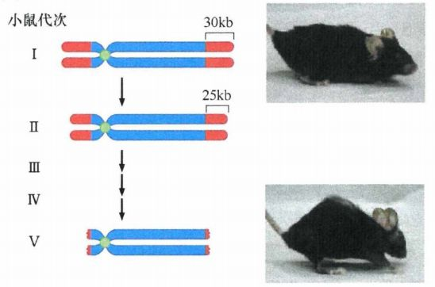
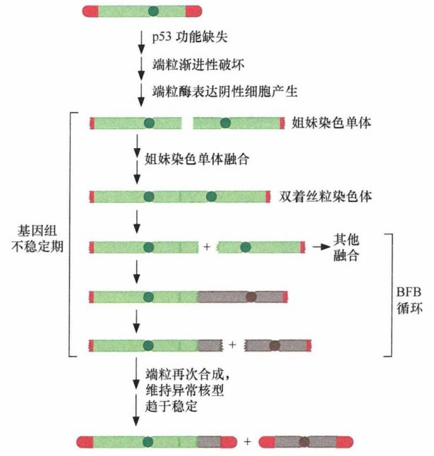

# 第十章 《癌生物学》第十章（3）端粒酶的双重角色

**往期回顾**
 

 
[《癌生物学》第五章（1）生长因子与受体（上）](http://mp.weixin.qq.com/s?__biz=Mzg4NjA5Mzg2Mw==&mid=2247485864&idx=1&sn=9d850e610445822a84b6bd6318734094&chksm=cf9fa8e0f8e821f6e93a3c554138b82030bc5adc8d0e47e111ec3d9f0d8424c29bcd49c100c1&scene=21#wechat_redirect)
 
[《癌生物学》第五章（2）生长因子与受体（中）](http://mp.weixin.qq.com/s?__biz=Mzg4NjA5Mzg2Mw==&mid=2247485893&idx=3&sn=e4b521e3cf4ca5cb85a3686ca8bfbd40&chksm=cf9fa88df8e8219bd3ea563f1eb3fd4917188ae6c71d9a3427d3dcc30e1ffaadbafaf744c2fb&scene=21#wechat_redirect)
 
《癌生物学》第五章（3）生长因子与受体（下）
 
[《癌生物学》第六章（1）酪氨酸磷酸化的调控作用](http://mp.weixin.qq.com/s?__biz=Mzg4NjA5Mzg2Mw==&mid=2247486271&idx=2&sn=1cd38152b98c45961b1b2e95fe30a7d9&chksm=cf9faa77f8e8236176748bdc5a18442cbded1d791b7a49db5f7a64076215dab2a339f6ecf2d8&scene=21#wechat_redirect)
 
[《癌生物学》第六章（2）Ras下游3条重要的信号通路](http://mp.weixin.qq.com/s?__biz=Mzg4NjA5Mzg2Mw==&mid=2247486293&idx=2&sn=9ffda5507d1a485d9b3f289333c71af8&chksm=cf9faa1df8e8230bf23de9c88af7810c8454a6b9838d40c23cad3074d99ff397bb56e5c1b6bd&scene=21#wechat_redirect)
 
[《癌生物学》第六章（3）细胞内其他信号网络](http://mp.weixin.qq.com/s?__biz=Mzg4NjA5Mzg2Mw==&mid=2247486528&idx=1&sn=d46485bf93b08b6ca5f6a52106ce18cd&chksm=cf9fad08f8e8241e16e7d85e350239210c93e196fa16593113968c79457f0f9dfed86d3aa845&scene=21#wechat_redirect)
 
[《癌生物学》第七章（1） 抑癌基因与肿瘤细胞表型](http://mp.weixin.qq.com/s?__biz=Mzg4NjA5Mzg2Mw==&mid=2247486664&idx=1&sn=52597f9e0e4f0027c3bfc4c17954eba0&chksm=cf9fad80f8e824965ed77e0a87f16cb145e8ec9b80f3c4597624f7ea84882af22653207a8437&scene=21#wechat_redirect)
 
[《癌生物学》第七章（2） 抑癌基因的发现与探索](http://mp.weixin.qq.com/s?__biz=Mzg4NjA5Mzg2Mw==&mid=2247486671&idx=2&sn=18afb1b90118fc8ce0521c9f10a73d16&chksm=cf9fad87f8e8249117a3d1e0395cfabbda447a5a4410d4a9ff913043bee26d6ec8899e4aceb3&scene=21#wechat_redirect)
 
[《癌生物学》第七章（3） 抑癌基因的作用实例](http://mp.weixin.qq.com/s?__biz=Mzg4NjA5Mzg2Mw==&mid=2247486678&idx=2&sn=91703b8b6417578486ac512a09a064d2&chksm=cf9fad9ef8e82488061f0150a628ffa88f89b81d7f3155c0797ec2c4b4aef0a12bbd9db66ed8&scene=21#wechat_redirect)
 
[《癌生物学》第八章（1）细胞周期控制时钟](http://mp.weixin.qq.com/s?__biz=Mzg4NjA5Mzg2Mw==&mid=2247486926&idx=1&sn=7e75e170b8cc007c97c6099d87a1d035&chksm=cf9fac86f8e82590d558ea1b4ed630891adcf34923053b0f09c9aaa5132fdcc2c2f9c8c96ab2&scene=21#wechat_redirect)
 
[《癌生物学》第八章（2）pRb在细胞周期时钟中的作用](http://mp.weixin.qq.com/s?__biz=Mzg4NjA5Mzg2Mw==&mid=2247487021&idx=1&sn=5b7c94bc179e2002f3c9a5713b0733c3&chksm=cf9faf65f8e82673762e74e560b7a481ee1561a6845ed2cdcf87ed1cef9427db47c7ad68d437&scene=21#wechat_redirect)
 
[《癌生物学》第八章（3）Myc、TGF-β在细胞周期时钟中的作用](http://mp.weixin.qq.com/s?__biz=Mzg4NjA5Mzg2Mw==&mid=2247487022&idx=1&sn=013769ab286813e3834183669c3fe69b&chksm=cf9faf66f8e82670baab3d827866f7b2b668259bbacfb38aedb0f0626ecc2dadf1f1235c895a&scene=21#wechat_redirect)
 
[《癌生物学》第九章（1） p53——抑癌基因](http://mp.weixin.qq.com/s?__biz=Mzg4NjA5Mzg2Mw==&mid=2247487247&idx=1&sn=50b6eaf0623c0c134f4c6588f68c3689&chksm=cf9fae47f8e82751bc562b5867da4f7cbecc9cfcd3bb65c3ea19891184fc6f4bd5cccf590299&scene=21#wechat_redirect)
 
[《癌生物学》第九章（2） P53水平的调控](http://mp.weixin.qq.com/s?__biz=Mzg4NjA5Mzg2Mw==&mid=2247487248&idx=1&sn=f33178b9d3428da2eb7ec91e7fe1e8f6&chksm=cf9fae58f8e8274e3234ef693fd33bda4ab3a62f6f3e790ea677a4dbe61b2b87e945202fb99d&scene=21#wechat_redirect)
 
[《癌生物学》第九章（3） P53的生物学功能](http://mp.weixin.qq.com/s?__biz=Mzg4NjA5Mzg2Mw==&mid=2247487249&idx=1&sn=812b0a64097fabf21da4b79650fe668d&chksm=cf9fae59f8e8274f0f4165f157155304db6f91b85bc141e38330e8b09c94173ff44a8e03718c&scene=21#wechat_redirect)
 
[《癌生物学》第九章（4） 凋亡与肿瘤](http://mp.weixin.qq.com/s?__biz=Mzg4NjA5Mzg2Mw==&mid=2247487251&idx=2&sn=c670121fa3e55e6eac50a606096bd292&chksm=cf9fae5bf8e8274d404393647fc7eca19b7f54bdac964ad16003b9b0f5f9eeaf767e843dcecb&scene=21#wechat_redirect)
 
《癌生物学》第十章（1）肿瘤细胞无限增殖的两个障碍
 
[《癌生物学》第十章（2）端粒和端粒酶](http://mp.weixin.qq.com/s?__biz=Mzg4NjA5Mzg2Mw==&mid=2247487506&idx=1&sn=4e2df94146e3a9328b7ca74b03a573da&chksm=cf9fb15af8e8384c2bdcf218c35b9497ffd1f521e658084df49d4be5f9eed137d39211a67935&scene=21#wechat_redirect) 

 

 
**前言** ：在前两期中我们已经学习了端粒的大部分内容，对肿瘤细胞的增殖机制有了更深入的理解。今天的内容比较琐碎，主要是讲解有关端粒的一些杂七杂八的内容，重点需要理解的是 **端粒酶的双重角色** 。
 

 
**端粒在实验小鼠和人类细胞中的不同作用**
 
***01***
 

 
啮齿类动物，尤其是那些实验小鼠的细胞，其控制端粒酶表达的方式完全不同。由于某些未知原因，实验小鼠端粒DNA的双链区域长达30-40kb——大约是人类端粒DNA的5倍长度。事实上，实验鼠的端粒如此之长，在其一生中都不存在端粒被破坏而降解至临界点的危险，甚至通过实验抑制端粒酌的表达也不能使其缩短。小鼠端粒的长度允许其细胞谱系经历更长的传代次数，超过肿瘤一般形成所需的时限。然而，小鼠体细胞中高水平的端粒酶活性和较长的端粒长度仍旧不足以使肿瘤细胞在此类物种中迅猛增殖。这提示实验小鼠不依赖端粒长度来限制正常细胞谱系进行复制，而且端粒的破坏也并不是促进咄齿类动物肿瘤发生的机制。
 
在某种程度上，来自实验小鼠的细胞在离体培养时，具有有限的增殖能力，而这个能力并不取决于端粒的长度。事实上，鼠类细胞在培养基中进行繁衍时能相对容易地获得永生化(筛选逃避衰老而自发永生化的离体细胞)。而与鼠类细胞不同，人类细胞需要SV40的大T癌基因(逃避衰老)和hTERT基因(逃避危机)同时导入才能使细胞永生化。另外，离体培养的小鼠细胞较少发生衰老可能是因为它们体外培养时不能产生衰老相关异染色质簇集(SAHF), 而人类细胞容易发生。
 
引入注目的是，人类细胞在其一生中平均大约经历10 16 次的有丝分裂，远比小鼠 10 11 次分裂更具有患肿瘤的危险(即小鼠细胞仅为人类细胞的0.1%, 小鼠平均寿命仅约为人类的1%)。 因此，体型大、寿命长的哺乳动物，如人类，与相对小的、寿命短的物种(如小鼠)相比需要演化一套防御肿瘤的额外机制。
 
mTR阴性表达小鼠与野生型小鼠的表型没有明显区别，这一点进一步证明哺乳动物中端粒酶全酶的作用主要是维持端粒的长度，而对组织发育没有明显影响。(然而，继续表达mTR但不表达mTERT的基因突变小鼠表现出轻微的形态缺陷——一个胸椎转换成腰椎。这一改变显然是由于mTERT蛋白与端粒作用不相关的功能：它结合了转录因子复合体从而使β-catenin激活Wnt信号通路的基因表达，这些研究发现在hTERT也得到了验证。）
 
端粒酶阴性表达的纯合子小鼠(mTR -/- ) 在饲养至少3代以上均未出现表型的变化。 但是，最终在第5代时发现端粒酶阴性的小鼠开始出现明显的表型改变。 经过5代繁殖后，端粒酶缺失小鼠的端粒长度开始缩短。 这些第5代的 mTR -/- 小鼠开始出现病态，缺少创伤修复能力，表明细胞对促有丝分裂信号的反应降低了，出现了早衰症状，包括日渐消瘦，驼背（如下图）。 当繁殖到第6代时， mTR -/- 小鼠这种异常表现进一步加重。 同时小鼠生育能力明显降低。 第6代 mTR -/- 小鼠出生时端粒已经很短，之后也不能维持端粒长度，尤其在有丝分裂活跃的组织中有大量细胞死亡，组织失去功能。 例如，增殖旺盛的组织，如胃肠的上皮细胞、造血系统和睾丸组织，开始明显地萎缩（细胞数减少）。 这些异常现象与小鼠的遗传学特征并不平行，因为将突变导入生殖细胞中，上述表型在5代或6代之后才出现。
 

  
图1：mTR-/-小鼠多代繁殖后发生端粒侵蚀损耗和表型改变
 

 
同时，这些结果进一步显示了人与实验性突变小鼠之间端粒的差异。人类端粒原始长度相对较短，在经历第1代繁殖后，失去端粒酶活性在第1代繁殖后就会产生严重机体表型导致严重的后果。
 
此外，端粒酶功能缺陷还与一种人类家族性综合征——先天性角化不良(dyskeratosis congenita, DC)有关。DC患者的许多组织萎缩，其原因可追溯到端粒酶功能缺失或端粒的严重破坏，使原来再生能力强的组织，如皮肤、骨髓等不能再生，同时伴有染色体稳定性降低。一些个体骨髓造血干细胞再生能力丧失，导致造血系统破坏, 有些患者最后因为端粒破坏而患白血病。
 

 
**端粒酶阴性小鼠既能增加也能降低肿瘤的易感性**
 
***02***
 

 
实验小鼠易感自发性肿瘤，大部分为淋巴瘤和白血病。编码 p16 INK4A 和 p19 ARF 的抑癌蛋白同时被抑制，可以产生易患癌的小鼠。将 p16 INK4A / p19 ARF 失活的生殖细胞导入缺少mTR的小鼠。在对照组，端粒酶阳性、 p16 INK4A /p19 ARF 阴性的小鼠有64%发生肿瘤，而在第4、5代 mTR -/- p16 INK4A / p19 ARF 阴性的小鼠仅有31%发生肿瘤。 通过观察小鼠16周的生存率，88%端粒酶阳性小鼠因患肿瘤而死亡，而端粒酶阴性的第5代小鼠仅有46%死亡，差异具有显著性。 端粒酶阴性小鼠患癌率 低 表明， mTR -/- 小鼠的正常组织在肿瘤发生前已经耗尽所有复制能力。 这些小鼠体内一旦启动肿瘤，初始的肿瘤细胞群在形成肉眼可见的肿块前就必须经过许多代的增殖。 然而，在肿瘤发展的相对早期，这些具有增殖潜力的肿瘤细胞因端粒破坏而启动衰老，肿瘤发生消退。 

 
敲除生殖细胞两个拷贝p53基因的小鼠表现完全不同。通常，在p53 -/- 小鼠引入mTR基因突变，使小鼠生殖细胞p53失活导致患癌风险和死亡率增加。 分析第5、6代 mTR -/- 伴有 p53 -/- 小鼠的细胞基因组，发现其肿瘤形成率明显 高 于单纯 p53 -/- 小鼠而且肿瘤类型从 p53 -/- 小鼠常见的淋巴瘤和血管肉瘤扩大到人类常见的肿瘤，这一发病趋势在第7、8代端粒阴性的小鼠中更为明显。 

 
可以设想由于第5、6代小鼠的细胞耗尽端粒，细胞染色体开始进入BFB(断裂-融合-桥)循环,之后出现衰亡。已经明确BFB循环造成的双链DNA断裂诱导的凋亡依赖于p53，因此，携带正常p53基因并进入BFB循环的细胞可能迅速从组织中消失。当第5代或第6代的 mTR -/- p53 -/- 小鼠经过BFB循环时，为了生存，需要修复染色体DNA断裂损伤。然而，许多细胞由于缺乏关键的促凋亡反应机制——p53而得以存活下来。尽管染色体核型紊乱，但这些细胞仍然保留着细胞生长和分裂能力，而且这些细胞的染色体能持续数周BFB循环。
 
p53缺失而不能诱导细胞凋亡，使这一恶性循环不断在细胞中反复进行。结果在BFB过程中出现大景染色体易位，而导致细胞的基因组不稳定。而基因的不稳定可增加促癌基因结构的发生。此外更重要的是，有证据表明，双链DNA(dsDNA)断裂会导致断裂处附近染色体的扩增或缺失。
 
尽管还没有证据证明BFB循环会对p53阴性细胞产生致命影响，但这种恶性循环一定会影响细胞的增殖能力。这意味着单个细胞要面临很大的选择压力来逃脱BFB循环并恢复核型的稳定，一旦完成这一过程，细胞便能快速增殖。由于生殖细胞中mTR基因已被敲除，在这些小鼠细胞中端粒酶不再被激活。基于这点，一旦细胞通过旁路激活ALT端粒维护系统，这些细胞就能稳定祖细胞失去端粒后造成的异常核型而使细胞重新保持增殖状态。
 
前面提到，在先天性角化不良患者中，一旦进行骨髓移植使崩溃的造血系统成功重建，常常会导致发生肿瘤，一些发展成血液恶性肿瘤(诸如骨髓不典型增生和急性髓细胞白血病)或胃肠道肿瘤。肿瘤发生在持续快速增殖的组织中，这些组织正是端粒酶活性缺失导致端粒迅速破坏的部位，最终导致BFB恶性循环。
 

 
**端粒酶阴性小鼠的肿瘤发病机制可能同样适用于人类肿瘤**
 
***03***
 

 
在肿瘤演进的早期阶段，p53抑癌基因的失活是有利于细胞生存的，因为这样能帮助初始肿瘤细胞逃避凋亡(凋亡原因包括癌基因的激活、血管不足造成的营养匮乏、缺氧、代谢物毒性)。随后，在肿瘤演进过程的癌前细胞群体中，端粒DNA破坏到不能保护染色体末端的水平时，BFB循环发生，导致染色体重排，在断裂点附近出现DNA扩增或缺失。经过BFB循环的细胞将通过p53诱导凋亡的途径被清除，然而，当p53功能缺失时，这样的细胞将会生存下来。尽管伴有核型异常的细胞其增殖速度会降低，但其不易发生凋亡。这类细胞的产生将会形成更多的变异体，这些变异的细胞会再生端粒和维持核型稳定，并获得快速增殖的能力。在突变的 mTR -/- 小鼠细胞, 通过ALT端粒维持系统激活而获得端粒稳定性，而在野生型(例如，mTR +/+ ) 机体(包括肿瘤患者)中使hTERT再表达，可允许端粒重建并保持适当的端粒长度。 一旦端粒在所有染色体末端再生，因BFB循环而导致的进一步核型异常将会受阻。 但是，前期已经生成的任何核型异常将会被保留下来并传递到子细胞群体中。 这一模型对广泛存在于人类肿瘤细胞中的非整倍体核型现象给予了明确的解释。
 

 

  
图2：BFB循环促进人肿瘤形成的机制模型
 

 
人胰腺癌演化过程的研究为这一模型提供了依据。在多阶段胰腺组织癌变过程的早期，在低级别腺瘤的有丝分裂细胞中，少量的后期桥是BFB循环的标志。然而，在发展到重度不典型增生的腺瘤细胞中出现了大量的连接桥。之后，在更晚期的原位癌中，后期桥的水平再次降低。此外，某些慢性炎症如溃疡性结肠炎、Barret 食管炎及被乙肝或丙肝病毒感染的组织，可能与癌症风险增加有关，也可能与端粒破坏和BFB循环有关。
 

 参考书目： 《The Biology of Cancer》（Second Edition）  R.A.Weinberg  著，詹启敏 等  译 
 编辑： 张月明 周健 
 校审： 张健 罗鹏 

 

 
 ***欢迎点击下方图片进行留言，说出你的看法哦~***
 
