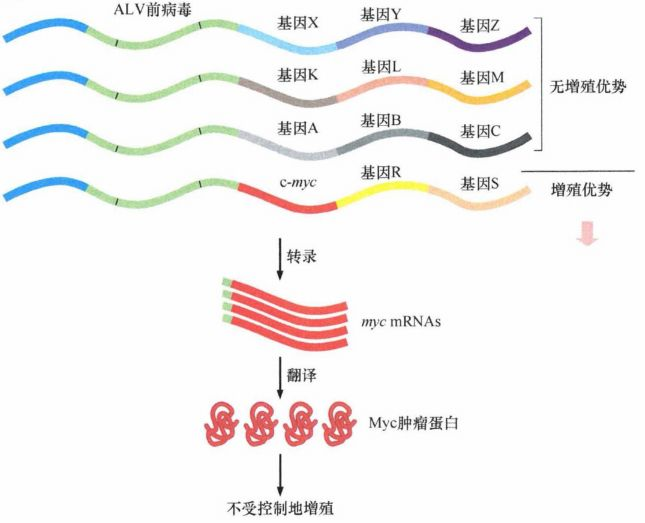
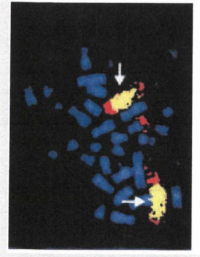
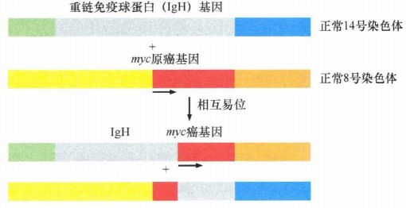
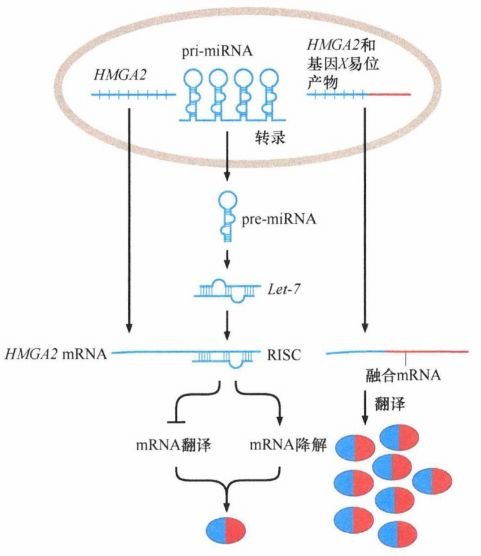
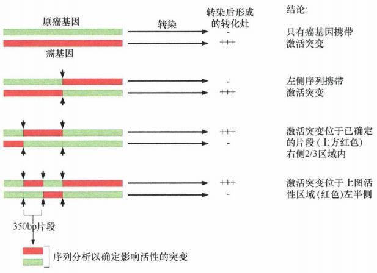
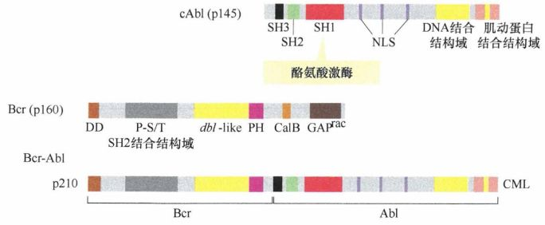

# 第四章 《癌生物学》第四章（2）细胞原癌基因的激活【学习分享】

**往期回顾**
 
[《癌生物学》第一章（1） 孟德尔遗传定律和达尔文进化论【学习分享】](http://mp.weixin.qq.com/s?__biz=Mzg4NjA5Mzg2Mw==&mid=2247484461&idx=1&sn=72104e0b83f7cd500a142fed89d7ffc9&chksm=cf9fa565f8e82c7325ebf03f8f78af60e9e32f486ace8774fef71b186b956f131f683a66fc4f&scene=21#wechat_redirect)
 
[《癌生物学》第一章（2） 基因如何决定表型【学习分享】](http://mp.weixin.qq.com/s?__biz=Mzg4NjA5Mzg2Mw==&mid=2247484557&idx=1&sn=422338d2f6c79f9201ac4c4a57952b76&chksm=cf9fa5c5f8e82cd3a2f6d399f262668bd5dabd51917c601e6e603f521faa4e723a27be245d47&scene=21#wechat_redirect)
 
[《癌生物学》第一章（3） 基因表达的调控【学习分享】](http://mp.weixin.qq.com/s?__biz=Mzg4NjA5Mzg2Mw==&mid=2247484667&idx=1&sn=f5ac0e9f91f4017af882b9793999b14a&chksm=cf9fa5b3f8e82ca50cbd101947d2b381aa94f44c40eafc3007915592d95d8f1b8f7ce0718a36&scene=21#wechat_redirect)
 
[《癌生物学》第二章（1） 癌症的起源【学习分享】](http://mp.weixin.qq.com/s?__biz=Mzg4NjA5Mzg2Mw==&mid=2247484770&idx=1&sn=a5144114b3d342408140b8c9ee234d92&chksm=cf9fa42af8e82d3c26681af84e26b7c6361e1275bfdce2edce2c4a3065871c1ce97f0649d3e4&scene=21#wechat_redirect)
 
[《癌生物学》第二章（2） 癌症的发展及其能量代谢【学习分享】](http://mp.weixin.qq.com/s?__biz=Mzg4NjA5Mzg2Mw==&mid=2247484805&idx=1&sn=e97e67056c1d508092127d0388c2eaf6&chksm=cf9fa4cdf8e82ddbaaabda6a2d17d32ec4ab3b7809b97006c79a707f93e35738a7216ba03b4e&scene=21#wechat_redirect)
 
[《癌生物学》第二章（3）癌症的诱因【学习分享】](http://mp.weixin.qq.com/s?__biz=Mzg4NjA5Mzg2Mw==&mid=2247484881&idx=1&sn=bdc85af93a48af8f3c633cbb3b27384d&chksm=cf9fa499f8e82d8f0991b6902435a029254d873ffdc446bc815fddf909f79ca094ce2729135d&scene=21#wechat_redirect)
 
[《癌生物学》第三章（1）病毒可以引发肿瘤【学习分享】](http://mp.weixin.qq.com/s?__biz=Mzg4NjA5Mzg2Mw==&mid=2247485009&idx=1&sn=bf13fdc034c935e967b24ea8264fae21&chksm=cf9fa719f8e82e0f8dc2a5d07a3040aad5619cccfa12509259840d02b3b7417609c8cc132d3c&scene=21#wechat_redirect)
 [《癌生物学》第三章（2）肿瘤病毒如何在细胞中复制（上）【学习分享】](http://mp.weixin.qq.com/s?__biz=Mzg4NjA5Mzg2Mw==&mid=2247485236&idx=1&sn=38754b14ff13c402137769797c36711b&chksm=cf9fa67cf8e82f6aa90d5232aeabf7b48bbcbc792fc807e0626046ec92f4a341bfd30cd9fd1d&scene=21#wechat_redirect) [《癌生物学》第三章（3）肿瘤病毒如何在细胞中复制（下）【学习分享】](http://mp.weixin.qq.com/s?__biz=Mzg4NjA5Mzg2Mw==&mid=2247485333&idx=1&sn=0748f6670320d8d5796113eb408ba01b&chksm=cf9fa6ddf8e82fcbde1175c3ed490fbcad7db352b2728e7fb0e76b0b2c08683663446d3470d2&scene=21#wechat_redirect) 
《癌生物学》第四章（1）并非所有肿瘤都由病毒感染引起【学习分享】 

 

 
在正常细胞中，每个原癌基因都受到启动子，也就是调节它转录的一段 DNA 序列的调控。随着细胞生理状况的改变，启动子调节这些原癌基因的表达发生相应的改变。通常情况下，细胞会根据自身需要，通过相应的信号通路使原癌基因的表达处于相对较低的水平；然而在某些情况下，细胞会上调这些基因的表达。
 

 

 
**逆转录病毒激活原癌基因** 

 

 
尽管人们已经证实，在人类肿瘤基因组中，大量原癌基因以激活形式存在，但是导致它们激活的遗传学改变的机制依旧不是很清楚。在逆转录病毒的基因组结构被研究清楚后，人们也就了解了逆转录病毒引起癌变的机制 。
 
如果原癌基因来源于逆转录病毒，当在细胞基因组中插入逆转录病毒基因后，插入基因的表达仍然受逆转录病毒的启动子调节, 导致基因处于持续高表达的状态，并且其表达不受细胞自身信号通路的调控。例 如，正常情况下， *c-myc* 基因的表达受到细胞外信 号，如促有丝分裂生长因子的严格调控。而在禽髓细胞瘤病毒 (AMV) 的基因组中，该基因（通常被称为 *v-myc* ) 的表达远远高于细胞内的正常水平，并持续处于高表达的状态。
 
对 *myc* 基因表达的调控还存在另一种罕见的方式。当 ALV 插入基因组中靠近 *c-myc* 原癌基因的位置时， *c-myc* 的表达会受到 ALV 前病毒的调节，导致 *c-myc* RNA 的持续过表达和 Myc 蛋白的含量增加，使细胞获得过量的生长信号。
 
通过前病毒插入导致 *c-myc* 原癌基因激活的模型给了研究人员一种提示：尽管 *c-myc* 处于染色体的正常位置上（ALV不携带癌基因），但也有可能因为外源性转录启动子的插入而导致肿瘤发生。
  
图1：插入突变
 

 

 
**体细胞突变激活原癌基因**
 
**（蛋白质表达水平上升）**
 

 
通过研究逆转录病毒激活原癌基因的机制，人们发现逆转录病毒可以通过上调蛋白质表达水平，从而达到激活原癌基因的目的。在体细胞突变所致的原癌基因激活，也存在类似的情况。
 

 
**基因拷贝数增加**
 
***01***
 

 
在某些人类肿瘤中， *myc* 基因受它自身的启动子调节，但是肿瘤细胞基因组中 *myc* 基因的拷贝数远远超过正常细胞中的两个拷贝。在 30%的儿童神经母细胞瘤病例中， *c-myc* 同一家族成员 *N-myc* 同样被发现存在扩增，在一些恶性度较高的肿瘤中尤为明显。在这两种情况中，基因拷贝数的增加导致基因产物 Myc 蛋白和 N-Myc 蛋 白的表达增加。Myc 家族蛋白具有促进细胞生长的作用。因此，当 Myc 蛋白表达过量时，将使细胞的增殖失去控制。
 
对特定区段的染色体 DNA 选择性复制所形成的基因扩增导致 *myc* 基因的拷贝数增加, 这使得染色体中较远的染色体区域不受影响。这个特定扩增的染色体区域——扩增子，其长度远远大于 *c-myc* 或 *N-myc* 自身的长度（通常包含 50 万~1000 万个碱基对）， 因此在细胞分裂中期，可以用光学显微镜观察到发生扩增的片段。基因扩增会产生一些重复的长线性染色体区段，其在显微镜下表现为均质染色区（HSR) 。带有 *myc* 或 *N-myc* 的染色体片段可能会从染色体上断裂，形成一些染色体外的独立重复颗粒（双微体）。
  
图2： *N-myc* 基因在肿瘤细胞内存在大量的拷贝 （黄色） 

 

 
**染色体易位致转录调控改变**
 
***02***
 

 
在对分裂中期的肿瘤细胞基因组进行详细分析后，研 究人员发现几乎所有的 Burkitt's 淋巴瘤都存在染色体易位的情况。也就是说，某一染色体上的某一片段与另外 一条染色体上的另一无关片段发生了融合。
 
1983 年，研究人员发现 *myc* 原癌基因定位于 Burkitt's 淋巴瘤细胞 8 号染色体与其他 3 条染色体发生易位的区域中。在易位点（也称为染色体断裂点）的另外一边是免疫球蛋白的启动子区，使 *myc* 基因的表达受到免疫球蛋白启动子的调控。由于免疫球蛋白增强子序列直接调节 *c-myc* 基因持续不断地高表达。最终 *myc* 基因编码的 Myc 蛋白结构没有发生改变，但是处于一种不正常的高水平。已有确切的证据表明，在进化中负责免疫球蛋白基因重排的酶偶尔失去特异性，导致免疫球蛋白与 *myc* 重排在一起。
  
图3：Burkitt's 淋巴瘤中的染色体易位
 

 
此外，microRNA 的发现及它们在基因调控中的作用使得之前模糊的某些染色体易位分子机制变得容易理解。
 
例如，HMGA2 是一种小非组蛋白核蛋白，已经被证实在各种良性和恶性肿瘤中高表达，发挥癌蛋白的作用。HMGA2 基因的 3'端非编码区发生断裂，其阅读框与另外一个基因发生了融合。很长一段时间内，人们认为由易位产生的融合蛋白增强了 HMGA2 的致癌功能。然而，删除与 HMGA2 融合的蛋白质序列并不影响 HMGA2 融合蛋白的转化能力。这使人们意识到易位还有另外一个目的：通过易位使正常 HMGA2 mRNA 3'UTR 区上 microRNA Let-7 的识别结合位点发生了缺失。这种缺失，使所产生的 mRNA 不再受 Let-7 介导的转录抑制和降解，最终导致 HMGA2 mRNA 和蛋白质的大量增加 ，以一种尚不明确的机制促进染色质重塑和细胞转化。在 这个实例中，染色体 易位更多的是将原癌基因从负调节的状态中解放出来 ，并非让它与正调节因子融合。
  
图4：易位使 mRNA 不受miRNA 抑制
 

 
在另外一些实例中，染色体易位，如包含 microRNA 的 *myc* 基因，将这些 microRNA 的编码基因与外源性的转录启动子融合，从而增强所编码的 microRNA 的表达。在存在类似易位的肿瘤中，如骨髓增生异常及与之相关的急性髓细胞白血病，易位上调 了 microRNA 的表达，从而阻止了细胞分化，并使细胞处于一种能够演变为高度恶性肿瘤细胞的状态。
 

 

 
**体细胞突变激活原癌基因**
 
**（蛋白质结构改变** ）
 

 
正常情况下，定位于细胞膜上的生长因子受体只有在细胞外的区段与相应的生长因子 (GF, 也就是生长因子受体的配体）结合后，才能向细胞内传递信号。然而，由于受体编码基因的突变或者是受体 mRNA 前体的异常剪切，某些受体胞外段出现缺失，这些缺失胞外段的受体在没有生长因子配体的情况下，也能持续向细胞内传递信号。
 
由此我们可以看到，不光是蛋白质表达水平的上升，蛋白质结构的改变也能激活原癌基因。
 

 
**点突变**
 
***01***
 

 
*ras* 基因中的点突变是第一个被发现的原癌基因点突变。膀胱癌中 *H-ras* 基因只有一份拷贝，因此用基因扩增无法解释该基因的激活。 *H-ras* 癌基因是一段包含 6600 个碱基的 DNA 片段。有趣的是，在人类正常基因组中，也存在一个同样大小的片段，也就是人类 *H-ras* 的原癌基因。在膀胱癌发生的过程中， *H-ras* 原癌基因发生突变，转变成 *H-ras* 癌基因。
 
那么，人类基因组中正常的 *H-ras* 原癌基因又是如何转变成能在膀胱癌中被检测到的癌基因的呢？研究人员将原癌基因片段与癌基因片段进行杂交，最终将关键的差异序列局限在一段长为 350 个碱基对的片段中。通过对这段片段进行测序分析，发现原癌基因和癌基因之间仅存在一个非常细微的差异：原癌基因中的一个 G(鸟嘌呤）在癌基因中突变成 T（胸腺嘧啶）。这种单个碱基的突变——点突变，就是 *H-ras* 原癌基因转换成能够诱发肿瘤的癌基因的原因。重要的是，发生突变的碱基位于 *H-ras* 基因编码蛋白的阅读框内。这个突变使正常 *H-ras* 基因编码的蛋白质中一个甘氨酸变成了缬氨酸。
  
图5：具有癌基因活性突变位点的确定
 

 
**染色体易位致蛋白质结构改变**
 
***02***
 

 
在学习通过蛋白质表达水平上升激活原癌基因的时候，我们就已经介绍过染色体易位。但是那种易位没有影响蛋白质编码基因，也就是说蛋白质结构并没有发生变化。
 
最著名的染色体易位出现在慢性髓细胞白血病 (CML) 中，出现频率约为 95% 。与 Burkitt's 淋巴瘤不同, 这些慢性粒细胞性白血病中通过易位形成的融合蛋 白，是一个基因的转录调节序列插入第二个基因的阅读框内产生的，也就是说蛋白质的结构已经发生了改变。几乎所有 CML 中的染色体易位，都是大部分 Bcr 基因阅读框与几乎全部Abl基因阅读框发生了融合。这种易位形成的融合蛋白中酪氨酸激酶（对应于 SH1 结构域）的活性异常激活，这种异常是融合蛋白发挥致癌功能的主要原因。
  
图6： *bcr-abl* 癌基因的形成
 

 
**总结一下——**
 
原癌基因能够通过两种不同的方式被激活：逆转录病毒感染或者体细胞突变。
 
体细胞突变所导致的原癌基因激活存在两种情况：一种是使原癌基因编码的蛋白质结构发生改变，另一种则是使相应蛋白质表达水平升高。蛋白质结构的改变包括点突变，如 *ras* 原癌基因；基因易位，如 *bcr-abl* 。蛋白质表达水平的上升则是由于基因拷贝数的增加或基因易位导致转录调控的改变，如 *myc* 基因易位后受到免疫球蛋白增强子序列的调控。
 

 
编辑：张月明 周健
 
校审：张健 罗鹏
 

 

 

 
 ***欢迎点击下方图片进行留言，说出你的看法哦~***
 
