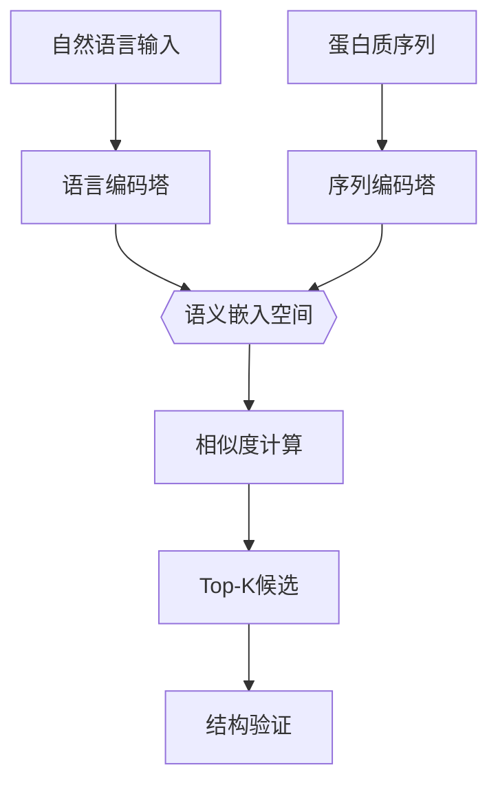

# 基于自然语言识别特定功能蛋白质关键位点的应用

---
## 背景
**为什么需要这个工具？**
- 现状：AlphaFold3等工具能快速预测蛋白质结构, 但找到关键作用位点（如药物结合点）仍需要复杂计算
- 痛点：传统方法需要高性能计算机运行数天，且操作门槛高（需要同时懂生物和编程）
- 创新点：用自然语言（如"找能结合葡萄糖的凹陷区域"）直接定位关键位点，就像用搜索引擎一样简单

---

## 应用方案描述 
**系统能做什么？**
- 输入示例：用日常语言描述需求  
	+  "寻找适合抗癌药物结合的凹陷区域"  
	+  "识别与新冠病毒S蛋白结合的位点"
- 输出结果：
	1. 目标蛋白质的3D结构图（标注红色高亮区域）
	2. 关键位点的物化特性报告（如形状、电荷分布）
	3. 结合能力预测评分（类似搜索引擎的相关性打分）

**核心优势**：
- 速度提升：从传统方法的数小时缩短到5分钟内
- 操作简化：不需要编写代码或操作复杂软件

---

## 技术方案设计

#### 第一步：语言理解
1. 用户输入自然语言（中文/英文）
2. 系统提取关键特征：
   - 功能关键词："结合"、"催化"、"抑制"
   - 结构特征："口袋"、"凹陷"、"螺旋区域"
   - 化学特性："带正电"、"疏水性"
3. 生成"蛋白质特征密码"（一组512位的数字编码）

#### 第二步：蛋白质匹配
1. 将"特征密码"与蛋白质数据库比对
2. 匹配机制：
   - 形状匹配：寻找类似几何结构的区域
   - 化学匹配：比对电荷/亲疏水特性
   - 功能匹配：参考已知相似功能的位点
3. 输出TOP3候选位点

#### 第三步：结构验证
1. 调用AlphaFold3生成3D模型
2. 自动执行验证：
   - 结合稳定性测试（模拟分子对接）
   - 可信度评分（0-100分，>85分才通过）

---

## 模型架构

### 双塔对比学习架构

#### 1. 语言编码塔（Language Tower）
- **架构核心**：基于BioBERT的12层Transformer编码器
- **输入处理**：
  - 文本分词：采用专业词典（含若干生物医学术语）
  - 位置编码：扩展支持蛋白质功能描述语法规则
- **特征提取**：
  - 输出若干维语义向量

#### 2. 序列编码塔（Sequence Tower）
- **架构创新**：混合CNN-BiLSTM网络
  - CNN层：3个并行卷积核（尺寸3/5/7），提取局部序列模式
  - BiLSTM层：128单元双向网络，捕获长程依赖
- **特征融合**：
  - 多尺度特征拼接：局部motif + 全局语境
  - 输出若干维序列嵌入向量

#### 3. 对比学习模块

- **相似度计算**：
  - 温度参数τ=0.05控制分布锐度

- **训练目标**：
  - NT-Xent损失函数：最大化正样本对相似度
  - 负样本挖掘：动态困难样本选择策略

### 跨模态对齐机制
1. **共享嵌入空间**：
   - 语言/序列向量通过正交投影对齐
   - 使用Wasserstein距离约束分布一致性

1. **注意力交互层**：
   $$
   Attention(Q,K,V)=softmax(\frac{QK^T}{\sqrt{d_k}})V
   $$
   - Q: 语言特征向量
   - K/V: 序列特征向量
3. **自适应权重融合**：
   - 动态调整结构特征与化学特征权重（$\alpha\in[0,1]$）
---
## 训练任务

1. **基础学习阶段**
    - 教材：若干组已知"描述-位点"对应数据
    - 目标：建立语言与蛋白质特征的初步关联
2. **专业强化阶段**
    - 学习资料：大量生物医学文献
    - 重点掌握：专业术语（如"变构位点"、"催化三联体"）